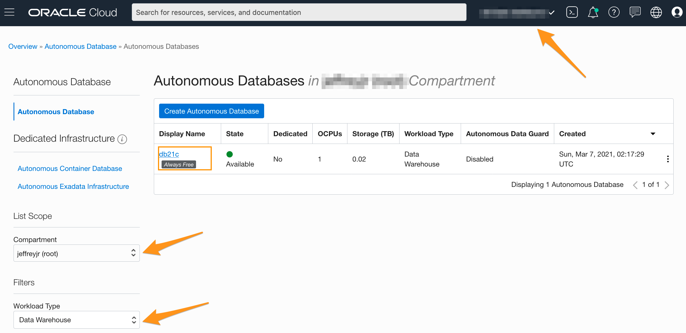
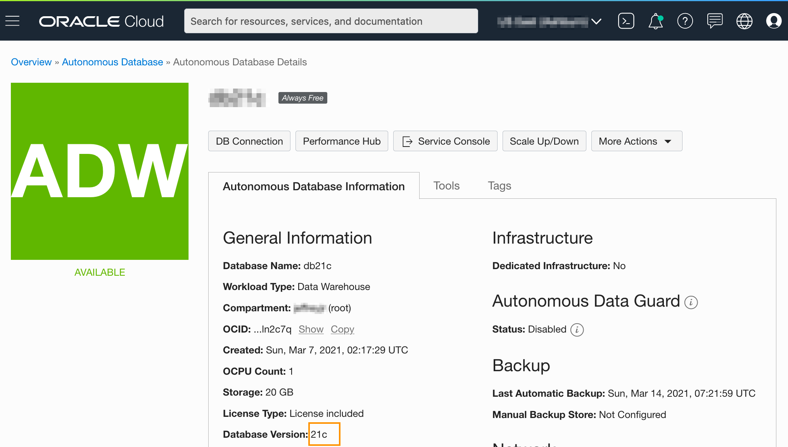
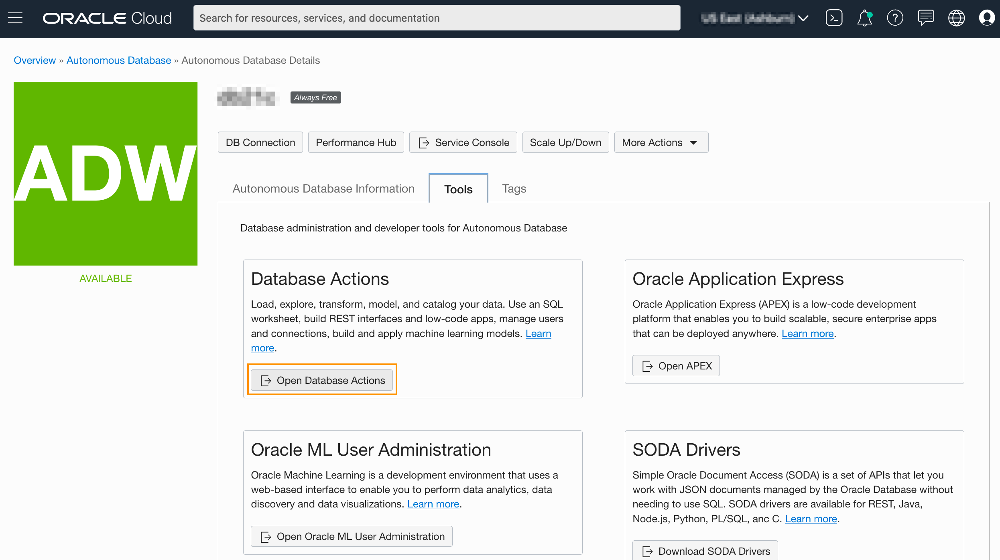
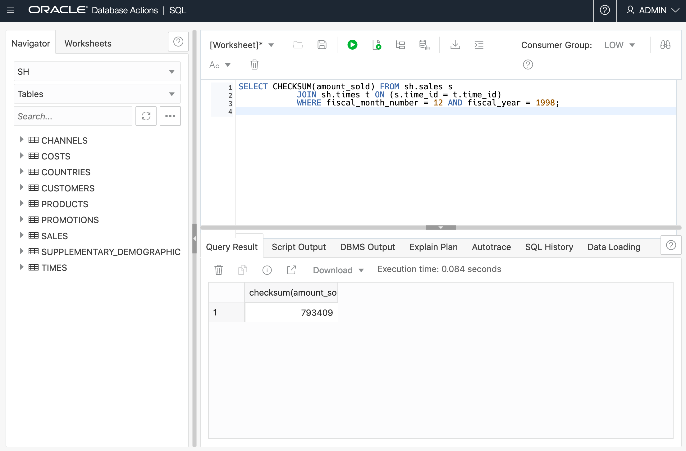

# Detect Data Tampering with the CHECKSUM Function

## Introduction

This lab shows how to use the `CHECKSUM` aggregate function to detect changes in a table. The function can be applied on a column, a constant, a bind variable, or an expression involving them. All datatypes except ADT and JSON are supported. The order of the rows in the table does not affect the result.

Estimated Lab Time: 15 minutes

### Objectives

In this lab, you will:
<if type="dbcs">
  * Setup the environment
  * Examine data before tampering
  * Examine data after tampering
</if>
<if type="atp">
  * Login to SQL Developer Web on Oracle Autonomous Database
  * Examine data before tampering
  * Examine data after tampering
</if>

### Prerequisites

<if type="dbcs">
* An Oracle Free Tier, Paid or Cloud Account
* SSH Keys
* Create a DBCS VM Database
* 21c Setup
</if>
<if type="atp">
* An Oracle Always Free/Free Tier, Paid or LiveLabs Cloud Account
* Provision Oracle Autonomous Database
* Setup
</if>

<if type="dbcs">

## Task 1: Set up the environment

1. Execute the `/home/oracle/labs/M104784GC10/setup_SH_tables.sh` shell script to create and load `SH.SALES` and `SH.TIMES` tables.

    ```
    $ <copy>cd /home/oracle/labs/M104784GC10</copy>
    $ <copy>/home/oracle/labs/M104784GC10/setup_SH_tables.sh</copy>
    ...
    SQL> host mkdir /u01/app/oracle/admin/CDB21/tde
    mkdir: cannot create directory '/u01/app/oracle/admin/CDB21/tde': File exists

    SQL> ADMINISTER KEY MANAGEMENT SET KEYSTORE CLOSE CONTAINER=ALL ;
    ADMINISTER KEY MANAGEMENT SET KEYSTORE CLOSE CONTAINER=ALL
    *
    ERROR at line 1:
    ORA-28389: cannot close auto login wallet

    SQL> ADMINISTER KEY MANAGEMENT SET KEYSTORE CLOSE IDENTIFIED BY <i>WElcome123##</i> CONTAINER=ALL;

    keystore altered.
    ...
    Tablespace dropped.

    Tablespace created.

    Copyright (c) 1982, 2020, Oracle.  All rights reserved.

    Last Successful login time: Wed Mar 25 2020 03:18:51 +00:00

    Connected to:

    specify password for SH as parameter 1:

    specify default tablespace for SH as parameter 2:

    specify temporary tablespace for SH as parameter 3:

    specify password for SYS as parameter 4:

    specify directory path for the data files as parameter 5:

    writeable directory path for the log files as parameter 6:

    specify version as parameter 7:

    specify connect string as parameter 8:

    Session altered.

    User dropped.
    ...
    loading TIMES using:
    /home/oracle/labs/M104784GC10/sales_history/time_v3.ctl
    /home/oracle/labs/M104784GC10/sales_history/time_v3.dat
    /home/oracle/labs/M104784GC10/time_v3.log

    Copyright (c) 1982, 2020, Oracle and/or its affiliates.  All rights reserved.

    Path used:      Direct
    Save data point reached - logical record count 1000.

    Load completed - logical record count 1826.

    Table TIMES:
      1826 Rows successfully loaded.
    ...
    loading additonal SALES using:
    /home/oracle/labs/M104784GC10/sales_history/dmsal_v3.ctl
    /home/oracle/labs/M104784GC10/sales_history/dmsal_v3.dat
    /home/oracle/labs/M104784GC10/dmsal_v3.log

    Copyright (c) 1982, 2020, Oracle and/or its affiliates.  All rights reserved.

    Path used:      Direct
    Save data point reached - logical record count 100.
    Save data point reached - logical record count 200.
    ...
    Save data point reached - logical record count 1500.
    SQL*Loader-2026: the load was aborted because SQL Loader cannot continue.

    Load completed - logical record count 1600.

    Table SALES:
      1500 Rows successfully loaded.
    ...
    gathering statistics ...

    PL/SQL procedure successfully completed.

    SQL>
    ```

</if>
<if type="atp">

## Task 1: Login to SQL Developer Web on Oracle Autonomous Database

There are multiple ways to access your Autonomous Database.  You can access it via sqlplus or by using SQL Developer Web.  To access it via sqlplus, skip to [Step 1B](#STEP1B:LogintoADBusingSQLPlus).

1.  If you aren't still logged in, login to your Oracle Autonomous Database screen by clicking on the navigation menu and selecting the Autonomous Database flavor you selected (Oracle Autonomous Transaction Processing, Oracle Autonomous Data Warehouse, or Oracle Autonomous JSON Database). Otherwise skip to the next step.
      

2.  If you can't find your Oracle Autonomous Database instance, ensure you are in the correct compartment, you have chosen the flavor of Oracle Autonomous Database you choose in the earlier lab and that you are in the correct region.

3.  Click on the **Display Name** to go to your Oracle Autonomous Database main page.
      

4.  Click on the **Tools** tab, select **Database Actions**, a new browser will open up.
      

5.  Login with the *admin* user, click **Next**.  Enter the password *WElcome123##*

6.  Enter the username *admin* and password *WElcome123##*

7.  Click on the **SQL** button.

## Task 1B: Login to Oracle Autonomous Database using SQL Plus

1.  Open up Cloud Shell below if it isn't already open

2.  Connect to the OE user using sqlplus by entering the commands below.
    ```
  	conn admin/WElcome123##@adb1_high
  	```

</if>

## Task 2: Examine data before tampering

1. At the end of each month and fiscal period, for legislative reasons, there is an audit table that stores what was sold. Verify the amount sold at the end of fiscal year 1998.

<if type="dbcs">

    ```
    $ <copy>sqlplus system@PDB21</copy>

    Enter password: <b><i>WElcome123##</i></b>
    ```

    ```  
    SQL> <copy>SET PAGES 100</copy>

    SQL> <copy>
        SELECT amount_sold FROM sh.sales s
        JOIN sh.times t ON (s.time_id = t.time_id)
        WHERE fiscal_month_number = 12 AND fiscal_year = 1998;</copy>

    AMOUNT_SOLD
    -----------
          22.99
          44.99
          7.99
        149.99
    ...
          11.99
          44.99
          49.99
          11.99
          44.99
          27.99
         149.99
          44.99
    12400 rows selected.
    SQL>
    ```

</if>
<if type="atp">

    ```
<copy>SELECT amount_sold FROM sh.sales s
      JOIN sh.times t ON (s.time_id = t.time_id)
      WHERE fiscal_month_number = 12 AND fiscal_year = 1998;</copy>
    ```

</if>

2. Before storing the data for auditing, note the `CHECKSUM` value. This will help you ensure that no one is tampering with old sales.

    ```
      SQL> <copy>
      SELECT CHECKSUM(amount_sold) FROM sh.sales s
      JOIN sh.times t ON (s.time_id = t.time_id)
      WHERE fiscal_month_number = 12 AND fiscal_year = 1998;</copy>

      CHECKSUM(AMOUNT_SOLD)
      ---------------------
                    793409

      SQL>
    ```

<if type="atp">
      

3. If you aren't logged into the cloud, log back in

4. Open up Cloud Shell

5. Connect to the ADMIN user using sqlplus by entering the commands below.

    ```
    export TNS_ADMIN=$(pwd)/wallet
    sqlplus /nolog
	  conn admin/WElcome123##@adb1_high
    UPDATE sh.sales SET amount_sold = amount_sold*2 WHERE time_id='30-NOV-98';

	  ```

</if>

3.  Meanwhile in another terminal session, called SH session, someone executes a batch that updates the amount sold.

    ```
    $ <copy>/home/oracle/labs/M104784GC10/app_SH_tables.sh</copy>				  
    Copyright (c) 1982, 2020, Oracle.  All rights reserved.
    Last Successful login time: Wed Mar 25 2020 03:20:17 +00:00
    Connected to:
    525 rows updated.

    Commit complete.

    $
    ```

## Task 3: Examine data after tampering

1. In the initial terminal session, check that no one tampered with old sales.

    ```
    $ <copy>sqlplus system@PDB21</copy>

    Enter password: <b><i>WElcome123##</i></b>
    ```

    ```
    SQL> <copy>SELECT CHECKSUM(amount_sold) FROM sh.sales s
            JOIN sh.times t ON (s.time_id = t.time_id)
            WHERE fiscal_month_number = 12 AND fiscal_year = 1998;</copy>

    CHECKSUM(AMOUNT_SOLD)
    ---------------------
                  835564

    SQL>
    ```

  Since the checksum value is different from the value retrieved in step 4, someone tampered the data.

2. What happens if someone attempted to tamper with old sales? In the SH session, update some old sales but then rolls the transaction back.

    ```
    $ <copy>sqlplus sh@PDB21</copy>

    Copyright (c) 1982, 2020, Oracle.  All rights reserved.
    Enter password: password
    Last Successful login time: Wed Mar 25 2020 03:28:37 +00:00
    Connected to:
    ```

    ```

    SQL> <copy>UPDATE sh.sales SET amount_sold = amount_sold*2 WHERE time_id='30-NOV-98';</copy>
    525 rows updated.

    SQL> <copy>ROLLBACK;</copy>
    Rollback complete.

    SQL>
    ```

3. In the initial terminal session, check that no one tampered with old sales.

    ```
    SQL> <copy>SELECT CHECKSUM(amount_sold) FROM sh.sales s
        JOIN sh.times t ON (s.time_id = t.time_id)
        WHERE fiscal_month_number = 12 AND fiscal_year = 1998;</copy>

    CHECKSUM(AMOUNT_SOLD)
    ---------------------
                  835564

    SQL>
    ```

  The checksum value for the column is still the same as it was before the rolled back update.

4. Verify also the quantity sold at the end of fiscal year 1998 and the checksum value.

    ```
    SQL> <copy>SELECT DISTINCT quantity_sold FROM sh.sales s
        JOIN sh.times t ON (s.time_id = t.time_id)
        WHERE fiscal_month_number = 12 AND fiscal_year = 1998;</copy>

    QUANTITY_SOLD
    -------------
                1

    SQL>
    ```

  As you can see, the quantity sold for any sales is one.

    ```

    SQL> <copy>SELECT CHECKSUM(quantity_sold) FROM sh.sales s
        JOIN sh.times t ON (s.time_id = t.time_id)
        WHERE fiscal_month_number = 12 AND fiscal_year = 1998;</copy>

    CHECKSUM(QUANTITY_SOLD)
    -----------------------
                          0

    SQL>

    ```

  The checksum value is 0 which is not a distinguishable value from another quantity value.

  What if you use the `DISTINCT` (or `UNIQUE`- `UNIQUE` is an Oracle specific keyword and not an ANSI standard)?

    ```

    SQL> <copy>SELECT CHECKSUM(DISTINCT quantity_sold) FROM sh.sales s
        JOIN sh.times t ON (s.time_id = t.time_id)
        WHERE fiscal_month_number = 12 AND fiscal_year = 1998;</copy>

    CHECKSUM(DISTINCTQUANTITY_SOLD)
    -------------------------------
                            863352

    SQL>
    ```

5. In the SH session, double the quantity for all sales.

    ```
    SQL> <copy>UPDATE sh.sales SET quantity_sold = 2;</copy>

    918843 rows updated.

    SQL> <copy>COMMIT;</copy>

    Commit complete.

    SQL>
    ```

6. In the initial terminal session, check that no one tampered with old sales.

    ```

    SQL> <copy>SELECT CHECKSUM(quantity_sold) FROM sh.sales s
        JOIN sh.times t ON (s.time_id = t.time_id)
        WHERE fiscal_month_number = 12 AND fiscal_year = 1998;</copy>

    CHECKSUM(AMOUNT_SOLD)
    ---------------------
                        0

    SQL>
    ```

    The checksum value for the column is still the same as it was before the committed update.

    ```

      SQL> <copy>SELECT CHECKSUM(DISTINCT quantity_sold) FROM sh.sales s
          JOIN sh.times t ON (s.time_id = t.time_id)
          WHERE fiscal_month_number = 12 AND fiscal_year = 1998;</copy>

      CHECKSUM(DISTINCTQUANTITY_SOLD)
      -------------------------------
                                65515

      SQL>

    ```

  The checksum value for the column is different from the one retrieved previously.

7. How is NULL considered? Still in the initial terminal session, check that no one tampered with customer email addresses.

    - First, get the checksum value of the customer email addresses whose `CUST_INCOME_LEVEL` is equal to 300000 or higher.

    ```

    SQL> <copy>SELECT cust_email FROM sh.customers WHERE cust_income_level ='L: 300,000 and above';</copy>

    CUST_EMAIL
    --------------------------------------------------
    Gowen@company.example.com
    Gowen@company.example.com
    ...
    Krishnan@company.example.com
    Prabu@company.example.com

    1684 rows selected.

    SQL> <copy>SELECT CHECKSUM(cust_email) FROM sh.customers;</copy>

    CHECKSUM(CUST_EMAIL)
    --------------------
                  107013

    SQL><copy> SELECT CHECKSUM(DISTINCT cust_email) FROM sh.customers;</copy>

    CHECKSUM(DISTINCTCUST_EMAIL)
    ----------------------------
                          227092

    SQL>

    ```

    - In the SH session, the user sets the customer email addresses to NULL for customers whose `CUST_INCOME_LEVEL` is equal to 300000 or higher.

    ```

    SQL> <copy>UPDATE sh.customers SET cust_email = NULL
         WHERE cust_income_level ='L: 300,000 and above';</copy>

    1684 rows updated.

    SQL> <copy>COMMIT;</copy>
    Commit complete.

    SQL>

    ```

    - In the initial terminal session, get the new checksum value of customer email addresses of customers whose `CUST_INCOME_LEVEL` is equal to 300000 or higher after the update.

    ```

    SQL> <copy>SELECT DISTINCT cust_email FROM sh.customers WHERE cust_income_level ='L: 300,000 and above';</copy>

    CUST_EMAIL
    --------------------------------------------------

    SQL> <copy>SELECT CHECKSUM(cust_email) FROM sh.customers;</copy>

    CHECKSUM(CUST_EMAIL)
    --------------------
                  577487

    SQL> <copy>SELECT CHECKSUM(DISTINCT cust_email) FROM sh.customers;</copy>

    CHECKSUM(DISTINCTCUST_EMAIL)
    ----------------------------
                          141231


    SQL> <copy>EXIT</copy>
    $

    ```
    *Be aware that NULL values in `CHECKSUM` column are ignored in external tables.*

## Acknowledgements

* **Author** - Donna Keesling, Database UA Team
* **Contributors** -  David Start, Kay Malcolm, Database Product Management
* **Last Updated By/Date** - Arabella Yao, Product Manager, Database Product Management, December 2021
