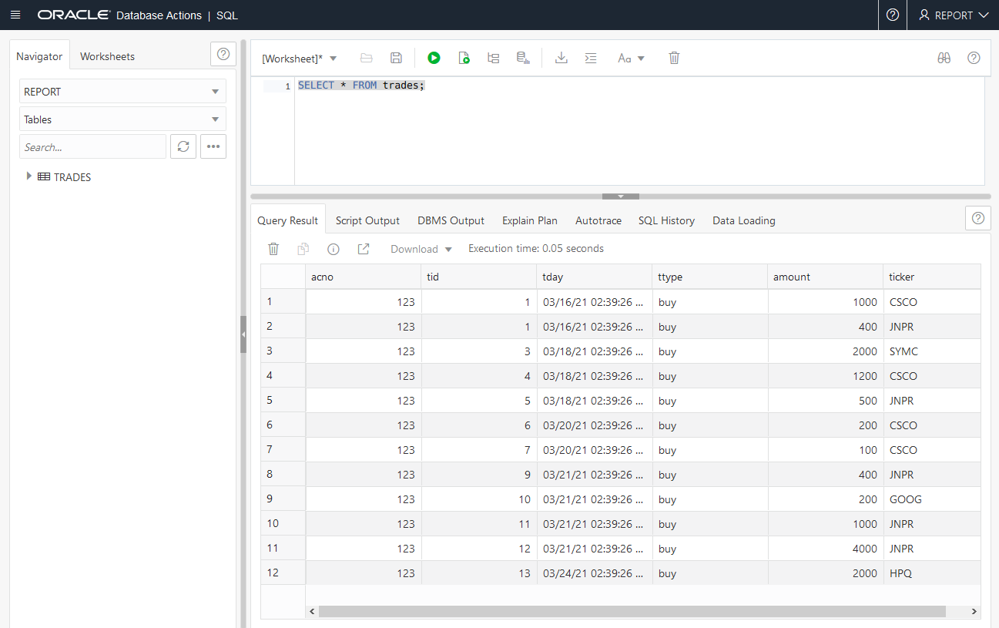
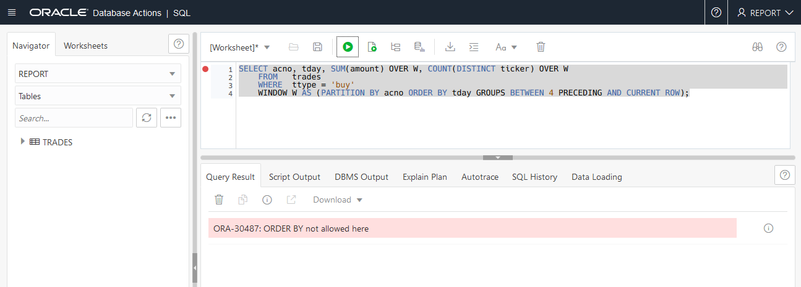
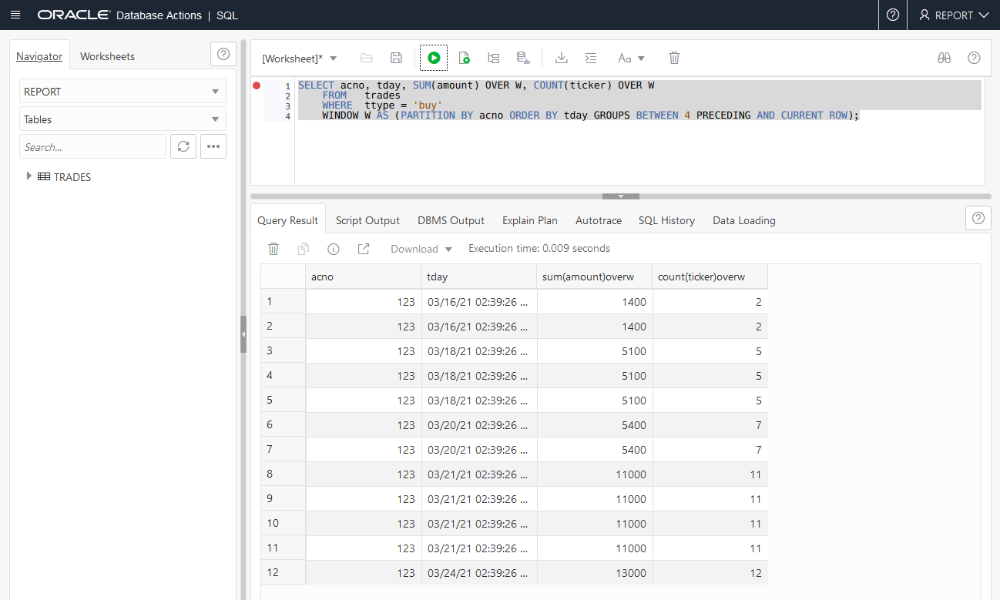
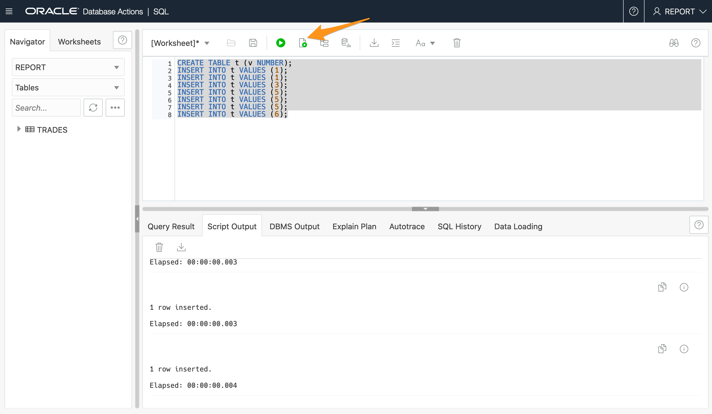
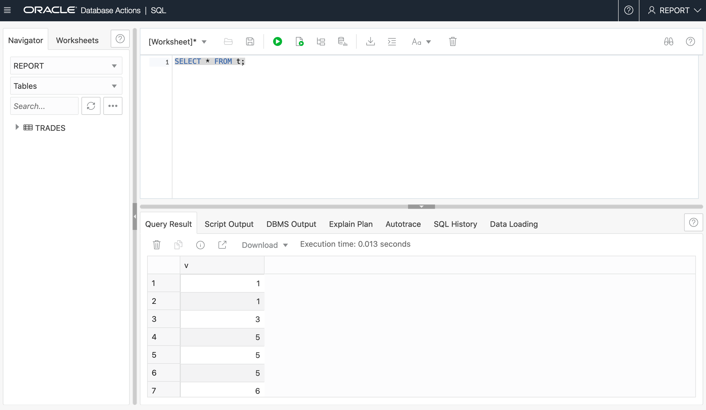
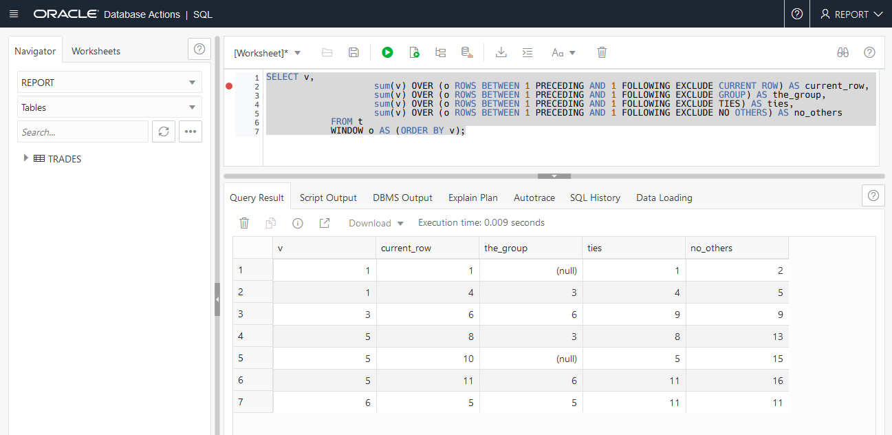
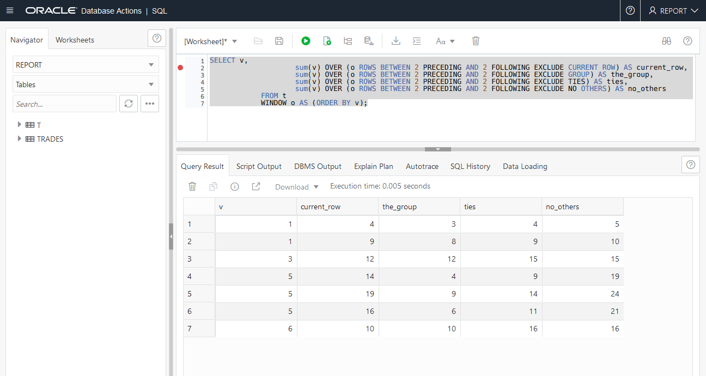
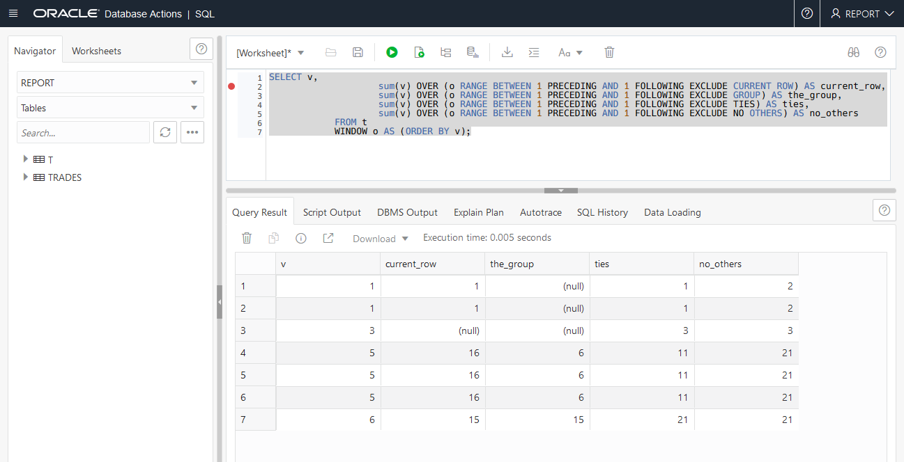
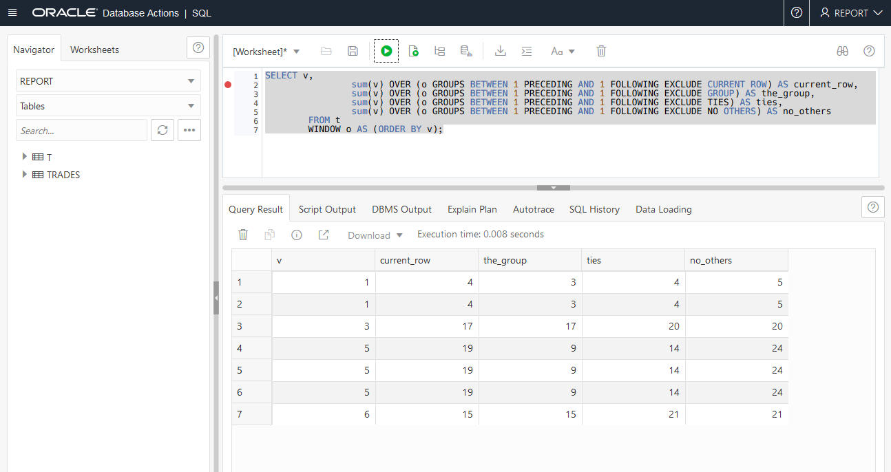
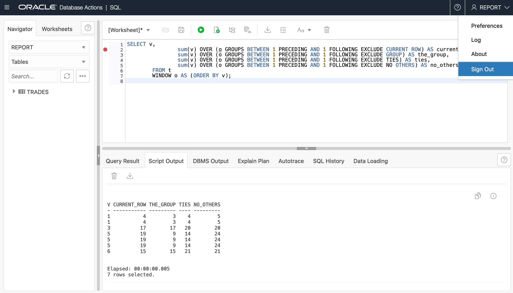

# Use Enhanced Analytic Functions

## Introduction

This lab shows how to benefit from the new options of the window frame clause, `GROUPS` and `EXCLUDE`, and also from the `WINDOW` clause in the table expression.

Estimated Time: 15 minutes

### Objectives

In this lab, you will:
<if type="dbcs">
* Setup the environment
</if>
<if type="atp">
* Login to SQL Developer Web on Oracle Autonomous Database
</if>
* Experiment with the usage of the `GROUPS` clause of the window frame
* Experiment with the usage of the `EXCLUDE` clause of the window frame
* Experiment the usage of the `GROUPS` and `EXCLUDE` clauses of the window frame

### Prerequisites

<if type="dbcs">
* An Oracle Free Tier, Paid or LiveLabs Cloud Account
* SSH Keys
* Create a DBCS VM Database
* 21c Setup
</if>
<if type="atp">
* An Oracle Always Free/Free Tier, Paid or LiveLabs Cloud Account
* Provision Oracle Autonomous Database
* Setup
</if>

<if type="dbcs">

## Task 1: Set up the environment

The `setup_analytic_table.sh` shell script creates in both `PDB21` and `PDB19` the user `REPORT`, grants `REPORT` the `CREATE SESSION`, `CREATE TABLE` and `UNLIMITED TABLESPACE` privileges, and finally creates the table `TRADES` including rows.

1. Run the `setup_analytic_table.sh` script.

    ```
    $ <copy>cd /home/oracle/labs/M104784GC10</copy>
    $ <copy>/home/oracle/labs/M104784GC10/setup_analytic_table.sh</copy>

    Copyright (c) 1982, 2019, Oracle.  All rights reserved.

    Connected to:

    SQL> DROP USER report CASCADE;

    User dropped.

    SQL> CREATE USER report IDENTIFIED BY <i>WElcome123##</i>;

    User created.

    SQL> GRANT create session, create table, unlimited tablespace TO report;

    Grant succeeded.

    SQL> CREATE TABLE report.trades (acno NUMBER, tid NUMBER, Tday DATE, Ttype VARCHAR2(4), amount NUMBER, Ticker VARCHAR2(4));

    Table created.

    SQL> INSERT INTO report.trades VALUES (123, 1, sysdate, 'buy', 1000, 'CSCO');

    1 row created.

    SQL> INSERT INTO report.trades VALUES (123, 1, sysdate, 'buy', 400, 'JNPR');

    1 row created.

    SQL> INSERT INTO report.trades VALUES (123, 3, sysdate+2, 'buy', 2000, 'SYMC');

    1 row created.

    SQL> INSERT INTO report.trades VALUES (123, 4, sysdate+2, 'buy', 1200, 'CSCO');

    1 row created.

    SQL> INSERT INTO report.trades VALUES (123, 5, sysdate+2, 'buy', 500, 'JNPR');

    1 row created.

    SQL> INSERT INTO report.trades VALUES (123, 6, sysdate+4, 'buy', 200, 'CSCO');

    1 row created.

    SQL> INSERT INTO report.trades VALUES (123, 7, sysdate+4, 'buy', 100, 'CSCO');

    1 row created.

    SQL> INSERT INTO report.trades VALUES (123, 9, sysdate+5, 'buy', 400, 'JNPR');

    1 row created.

    SQL> INSERT INTO report.trades VALUES (123, 10, sysdate+5, 'buy', 200, 'GOOG');

    1 row created.

    SQL> INSERT INTO report.trades VALUES (123, 11, sysdate+5, 'buy', 1000, 'JNPR');

    1 row created.

    SQL> INSERT INTO report.trades VALUES (123, 12, sysdate+5, 'buy', 4000, 'JNPR');

    1 row created.

    SQL> INSERT INTO report.trades VALUES (123, 13, sysdate+8, 'buy', 2000, 'HPQ');

    1 row created.

    SQL> COMMIT;

    Commit complete.

    SQL> EXIT
    $
    ```

</if>
<if type="atp">

## Task 1: Login to SQL Developer Web on Oracle Autonomous Database

There are multiple ways to access your Autonomous Database.  You can access it via sqlplus or by using SQL Developer Web.  To access it via sqlplus, skip to [Step 1B](#STEP1B:LogintoADBusingSQLPlus).

1.  If you aren't still logged in, login to your Oracle Autonomous Database screen by clicking on the navigation menu and selecting the Autonomous Database flavor you selected (Oracle Autonomous Transaction Processing, Oracle Autonomous Data Warehouse, or Oracle Autonomous JSON Database). Otherwise skip to #7 of this section.
    

2.  If you can't find your Oracle Autonomous Database instance, ensure you are in the correct compartment, you have chosen the flavor of Oracle Autonomous Database you choose in the earlier lab and that you are in the correct region.

3.  Click on the **Display Name** to go to your Oracle Autonomous Database main page.
      

4.  Click on the **Tools** tab, select **Database Actions**, a new browser will open up.
      

5.  Enter the username *report* and password *WElcome123##*

6.  Click on the **SQL** button.

## Task 1B: Login to Oracle Autonomous Database using SQL Plus

1. If you aren't logged into the cloud, log back in

2. Open up Cloud Shell

3. Connect to the REPORT user using sqlplus by entering the commands below.

    ```
    export TNS_ADMIN=$(pwd)/wallet
    sqlplus /nolog
	  conn report/WElcome123##@adb1_high
	  ```

</if>

## Task 2: Experiment with the usage of the `GROUPS` clause of the window frame

1. Display the rows of `REPORT.TRADES` in `PDB20`. Using `ROWS`, the user specifies the window frame extent by counting rows forward or backward from the current row. `ROWS` allows any number of sort keys, of any ordered data types. This can be advantageous, because counting rows is oblivious to any “holes” in the values that are sorted. On the other hand, counting rows from the current row can be non-deterministic when there are multiple rows that are identical in the sort keys, causing an arbitrary cutoff between two rows that have the same values in the sort keys. Using `RANGE`, the user specifies an offset. There must be precisely one sort key, and its declared type must be amenable to addition and subtraction (i.e., numeric,datetime or interval). This avoids the non-determinism of arbitrarily cutting between two adjacent rows with the same value, but it can only be used with a single sort key of an additive type. SQL:2011 standard includes a third way of specifying the window frame extent, using the keyword `GROUPS`. Like `ROWS`, a `GROUPS` window can have any number of sort keys, of any ordered types. Like `RANGE`, a `GROUPS` window does not make cutoffs between adjacent rows with the same values in the sort keys. Thus, `GROUPS` combines some of the features of both `ROWS` and `RANGE`.

<if type="dbcs">

    ```
    $ <copy>sqlplus report@PDB21</copy>
    Copyright (c) 1982, 2019, Oracle.  All rights reserved.
    Enter password: <b><i>WElcome123##</i></b>
    Connected to:
    ```

    ```
    SQL> <copy>SET PAGES 100</copy>
    ```

    ```
    SQL> <copy>SELECT * FROM trades;</copy>
    ```

</if>
<if type="atp">
    
</if>
<if type="dbcs">

    ```
          ACNO        TID TDAY      TTYP     AMOUNT TICK
    ---------- ---------- --------- ---- ---------- ----
          123          1 08-APR-20 buy        1000 CSCO
          123          1 08-APR-20 buy         400 JNPR
          123          3 10-APR-20 buy        2000 SYMC
          123          4 10-APR-20 buy        1200 CSCO
          123          5 10-APR-20 buy         500 JNPR
          123          6 12-APR-20 buy         200 CSCO
          123          7 12-APR-20 buy         100 CSCO
          123          9 13-APR-20 buy         400 JNPR
          123         10 13-APR-20 buy         200 GOOG
          123         11 13-APR-20 buy        1000 JNPR
          123         12 13-APR-20 buy        4000 JNPR
          123         13 16-APR-20 buy        2000 HPQ

    12 rows selected.
    ```

</if>

2. Compute the total amount over the last five days on which account number 123 performed a “buy”. To answer this query, you can group the data by trade day, compute the sum of amount on each trade day, and then use a `ROWS` window to add up the last five trade days.

    ```
    SQL> <copy>SELECT trades.acno, trades.tday, SUM (agg.suma) OVER W
        FROM    trades, (SELECT acno, tday, SUM(amount) AS suma
                        FROM   trades
                WHERE  ttype = 'buy'
                GROUP BY acno, tday ) agg
        WHERE   trades.acno = agg.acno
        AND     trades.tday = agg.tday
        AND     trades.ttype = 'buy'
        WINDOW W AS (PARTITION BY trades.acno ORDER BY trades.tday ROWS BETWEEN 4 PRECEDING AND CURRENT ROW);</copy>
    ```

    <if type="atp">
    
    </if>

    <if type="dbcs">

    ```
              ACNO TDAY      SUM(AGG.SUMA)OVERW
    ---------- --------- ------------------
          123 08-APR-20               1400
          123 08-APR-20               2800
          123 10-APR-20               6500
          123 10-APR-20              10200
          123 10-APR-20              13900
          123 12-APR-20              12800
          123 12-APR-20              11700
          123 13-APR-20              13600
          123 13-APR-20              15500
          123 13-APR-20              17400
          123 13-APR-20              22700
          123 16-APR-20              24400

    12 rows selected.
    ```

    </if>

  The reason why this query works is because it is possible to decompose a sum into partial aggregates, and compute the final sum from those partial aggregates. In this case, the query is decomposing the sum over groups defined by `acno` and `tday`. Then the query gets the sum over 5 trading days by adding the partial sums from the grouped query. `COUNT`, `MAX` and `MIN` are also decomposable aggregates. `AVG` can be decomposed by computing sums and counts and then dividing.

  *When the window name is specified with a windowing clause, it can only be referenced directly, without parentheses.*

3. Query how many distinct ticker symbols were traded in the preceding 5 trading days. This requires a `COUNT DISTINCT`, which cannot be decomposed into partial counts, one for each trading day, because there may be duplicate ticker symbols on different trading days, as can be seen in the sample data. `COUNT DISTINCT` is not decomposable, and the technique in the preceding query cannot be used. Use the keyword `GROUPS` instead of `RANGE` or `ROWS`. The keyword `GROUPS` emphasizes the relationship to grouped queries. Using this kind of keyword, we can answer queries such as, for each account number, for the last five trading days on which the account executed a “buy”, find the amount spent and the number of distinct ticker symbols bought.

    ```
    SQL> <copy>SELECT acno, tday, SUM(amount) OVER W, COUNT(DISTINCT ticker) OVER W
        FROM   trades
        WHERE  ttype = 'buy'
        WINDOW W AS (PARTITION BY acno ORDER BY tday GROUPS BETWEEN 4 PRECEDING AND CURRENT ROW);</copy>
    ```

    <if type="atp">
    
    </if>

    <if type="dbcs">

    ```
    ERROR at line 1:
    ORA-30487: ORDER BY not allowed here
    ```

    </if>

  *Aggregate function with `DISTINCT` specification cannot be used with a window specification having a window order clause.*

    ```
    SQL> <copy>SELECT acno, tday, SUM(amount) OVER W, COUNT(ticker) OVER W
        FROM   trades
        WHERE  ttype = 'buy'
        WINDOW W AS (PARTITION BY acno ORDER BY tday GROUPS BETWEEN 4 PRECEDING AND CURRENT ROW);</copy>
    ```

    <if type="atp">
    
    </if>

    <if type="dbcs">

    ```
          ACNO TDAY      SUM(AMOUNT)OVERW COUNT(TICKER)OVERW
    ---------- --------- ---------------- ------------------
          123 08-APR-20             1400                  2
          123 08-APR-20             1400                  2
          123 10-APR-20             5100                  5
          123 10-APR-20             5100                  5
          123 10-APR-20             5100                  5
          123 12-APR-20             5400                  7
          123 12-APR-20             5400                  7
          123 13-APR-20            11000                 11
          123 13-APR-20            11000                 11
          123 13-APR-20            11000                 11
          123 13-APR-20            11000                 11
          123 16-APR-20            13000                 12

    12 rows selected.
    ```

    </if>

  Notice that the syntax avoids the need for a nested grouped query and a join with `TRADES` as it was the case in the previous step.

## Task 3: Experiment with the usage of the `EXCLUDE` clause of the window frame

<if type="dbcs">
1. Execute the `/home/oracle/labs/M104784GC10/create_T_table.sql` SQL script.

    ```
    SQL> <copy>@/home/oracle/labs/M104784GC10/create_T_table.sql</copy>
    SQL> SET ECHO ON

    SQL> DROP TABLE t;
    Table dropped.

    SQL> CREATE TABLE t (v NUMBER);
    Table created.

    SQL> INSERT INTO t VALUES (1);
    1 row created.

    SQL> INSERT INTO t VALUES (1);
    1 row created.

    SQL> INSERT INTO t VALUES (3);
    1 row created.

    SQL> INSERT INTO t VALUES (5);
    1 row created.

    SQL> INSERT INTO t VALUES (5);
    1 row created.

    SQL> INSERT INTO t VALUES (5);
    1 row created.

    SQL> INSERT INTO t VALUES (6);
    1 row created.

    SQL> COMMIT;

    Commit complete.

    SQL>

    ```

</if>

<if type="atp">

1.  Paste the following script into your sql worksheet and press **Run as script** button to run.

    ```
    <copy>
    CREATE TABLE t (v NUMBER);
    INSERT INTO t VALUES (1);
    INSERT INTO t VALUES (1);
    INSERT INTO t VALUES (3);
    INSERT INTO t VALUES (5);
    INSERT INTO t VALUES (5);
    INSERT INTO t VALUES (5);
    INSERT INTO t VALUES (6);
    </copy>
    ```

    
</if>

2. Display the rows of table `T`.

    ```
    SQL> <copy>SELECT * FROM t;</copy>
    ```

    <if type="atp">
    
    </if>
    <if type="dbcs">
    ```
            V
    ----------
            1
            1
            3
            5
            5
            5
            6

    7 rows selected.
    ```
    </if>

3. Use the `EXCLUDE` options for window frame exclusion with `ROWS`. If `EXCLUDE CURRENT ROW` is specified and the current row is still a member of the window frame, then remove the current row from the window frame. If `EXCLUDE GROUP` is specified, then remove the current row and any peers of the current row from the window frame.

    ```
    SQL> <copy>SELECT v,
                        sum(v) OVER (o ROWS BETWEEN 1 PRECEDING AND 1 FOLLOWING EXCLUDE CURRENT ROW) AS current_row,
                        sum(v) OVER (o ROWS BETWEEN 1 PRECEDING AND 1 FOLLOWING EXCLUDE GROUP) AS the_group,
                        sum(v) OVER (o ROWS BETWEEN 1 PRECEDING AND 1 FOLLOWING EXCLUDE TIES) AS ties,
                        sum(v) OVER (o ROWS BETWEEN 1 PRECEDING AND 1 FOLLOWING EXCLUDE NO OTHERS) AS no_others
                FROM t
                WINDOW o AS (ORDER BY v);</copy>
    ```

    <if type="atp">
    
    </if>

    <if type="dbcs">
    ```
                V CURRENT_ROW  THE_GROUP       TIES  NO_OTHERS
    ---------- ----------- ---------- ---------- ----------
            1           1                     1          2
            1           4          3          4          5
            3           6          6          9          9
            5           8          3          8         13
            5          10                     5         15
            5          11          6         11         16
            6           5          5         11         11

    7 rows selected.
    ```
    </if>

4. If `EXCLUDE TIES` is specified, then remove any rows other than the current row that are peers of the current row from the window frame. If the current row is already removed from the window frame, then it remains removed from the window frame. If `EXCLUDE NO OTHERS` is specified (this is the default), then no additional rows are removed from the window frame by this rule.

    ```
    SQL> <copy>SELECT v,
                        sum(v) OVER (o ROWS BETWEEN 2 PRECEDING AND 2 FOLLOWING EXCLUDE CURRENT ROW) AS current_row,
                        sum(v) OVER (o ROWS BETWEEN 2 PRECEDING AND 2 FOLLOWING EXCLUDE GROUP) AS the_group,
                        sum(v) OVER (o ROWS BETWEEN 2 PRECEDING AND 2 FOLLOWING EXCLUDE TIES) AS ties,
                        sum(v) OVER (o ROWS BETWEEN 2 PRECEDING AND 2 FOLLOWING EXCLUDE NO OTHERS) AS no_others
                FROM t
                WINDOW o AS (ORDER BY v);</copy>
    ```

    <if type="atp">
    
    </if>
    <if type="dbcs">

    ```
            V CURRENT_ROW  THE_GROUP       TIES  NO_OTHERS
    ---------- ----------- ---------- ---------- ----------
            1           4          3          4          5
            1           9          8          9         10
            3          12         12         15         15
            5          14          4          9         19
            5          19          9         14         24
            5          16          6         11         21
            6          10         10         16         16

    7 rows selected.
    ```

    </if>

4. Use the `EXCLUDE` options for window frame exclusion with `RANGE`.

    ```
    SQL> <copy>SELECT v,
                        sum(v) OVER (o RANGE BETWEEN 1 PRECEDING AND 1 FOLLOWING EXCLUDE CURRENT ROW) AS current_row,
                        sum(v) OVER (o RANGE BETWEEN 1 PRECEDING AND 1 FOLLOWING EXCLUDE GROUP) AS the_group,
                        sum(v) OVER (o RANGE BETWEEN 1 PRECEDING AND 1 FOLLOWING EXCLUDE TIES) AS ties,
                        sum(v) OVER (o RANGE BETWEEN 1 PRECEDING AND 1 FOLLOWING EXCLUDE NO OTHERS) AS no_others
                FROM t
                WINDOW o AS (ORDER BY v);</copy>
    ```

    <if type="atp">
    
    </if>
    <if type="dbcs">

    ```
            V CURRENT_ROW  THE_GROUP       TIES  NO_OTHERS

    ---------- ----------- ---------- ---------- ----------
            1           1                     1          2
            1           1                     1          2
            3                                 3          3
            5          16          6         11         21
            5          16          6         11         21
            5          16          6         11         21
            6          15         15         21         21

    7 rows selected.
    ```

    </if>

## Task 4: Experiment the usage of the `GROUPS` and `EXCLUDE` clauses of the window frame

1. Use the `EXCLUDE` options for window frame exclusion with `GROUPS`.

    ```
    SQL> <copy>SELECT v,
                    sum(v) OVER (o GROUPS BETWEEN 1 PRECEDING AND 1 FOLLOWING EXCLUDE CURRENT ROW) AS current_row,
                    sum(v) OVER (o GROUPS BETWEEN 1 PRECEDING AND 1 FOLLOWING EXCLUDE GROUP) AS the_group,
                    sum(v) OVER (o GROUPS BETWEEN 1 PRECEDING AND 1 FOLLOWING EXCLUDE TIES) AS ties,
                    sum(v) OVER (o GROUPS BETWEEN 1 PRECEDING AND 1 FOLLOWING EXCLUDE NO OTHERS) AS no_others
            FROM t
            WINDOW o AS (ORDER BY v);</copy>
    ```

    <if type="atp">
    
    </if>
    <if type="dbcs">

    ```
            V CURRENT_ROW  THE_GROUP       TIES  NO_OTHERS
    ---------- ----------- ---------- ---------- ----------
            1           4          3          4          5
            1           4          3          4          5
            3          17         17         20         20
            5          19          9         14         24
            5          19          9         14         24
            5          19          9         14         24
            6          15         15         21         21

    7 rows selected.
    ```

    </if>

<if type="dbcs">

2. Exit from the sql prompt

    ```
    SQL> <copy>EXIT</copy>
    $
    ```

</if>
<if type="atp">

2. In the upper left corner, click the down arrow, scroll down and select **Sign Out**.

    

</if>

## Acknowledgements

* **Author** - Donna Keesling, Database UA Team
* **Contributors** -  David Start, Kay Malcolm, Didi Han, Database Product Management
* **Last Updated By/Date** - Arabella Yao, Product Manager, Database Product Management, December 2021
