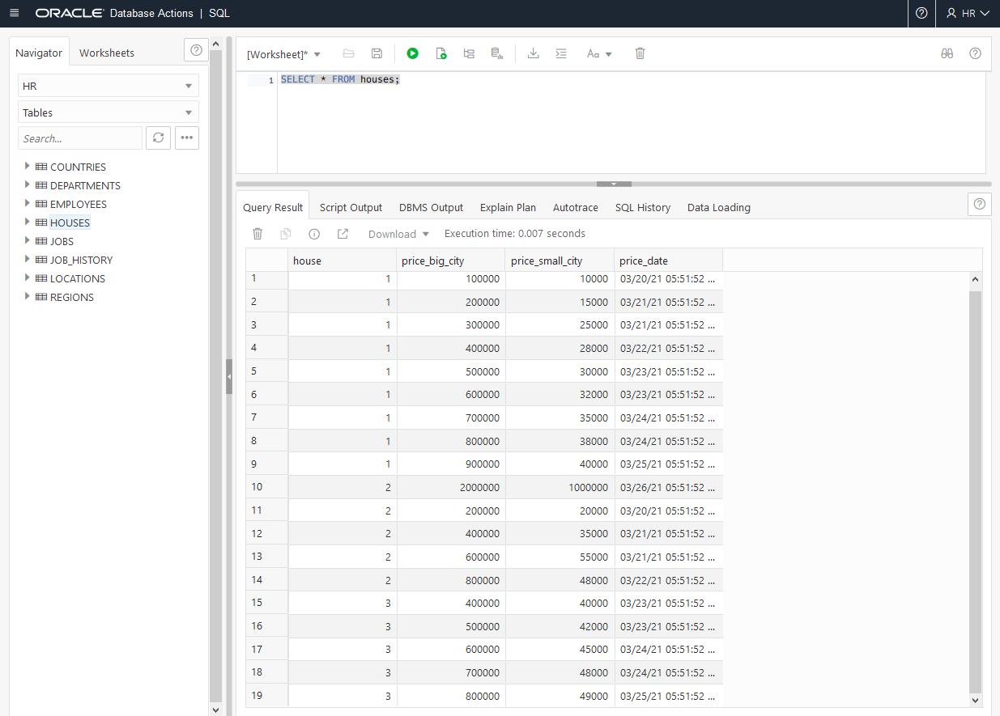
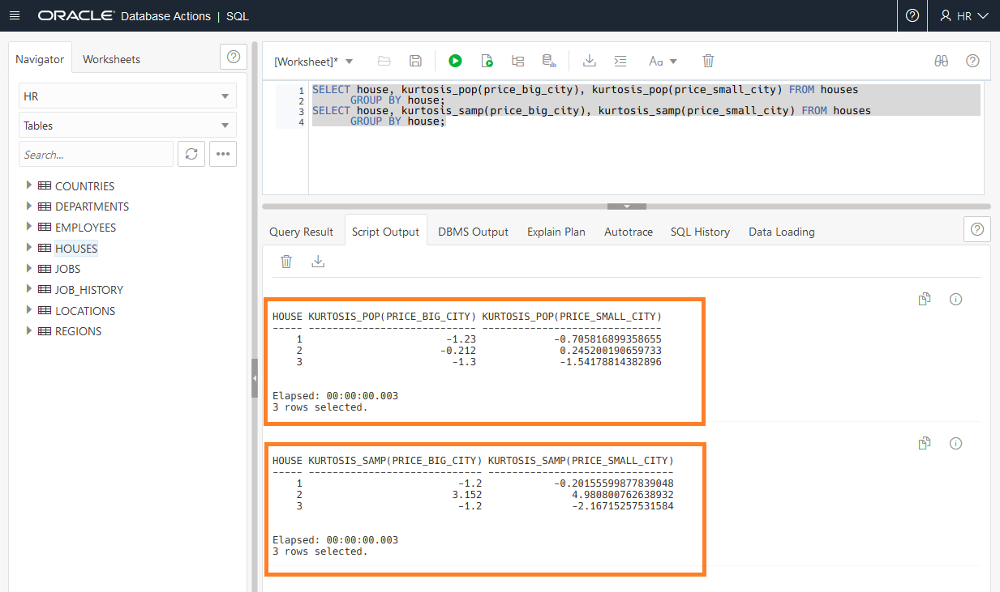
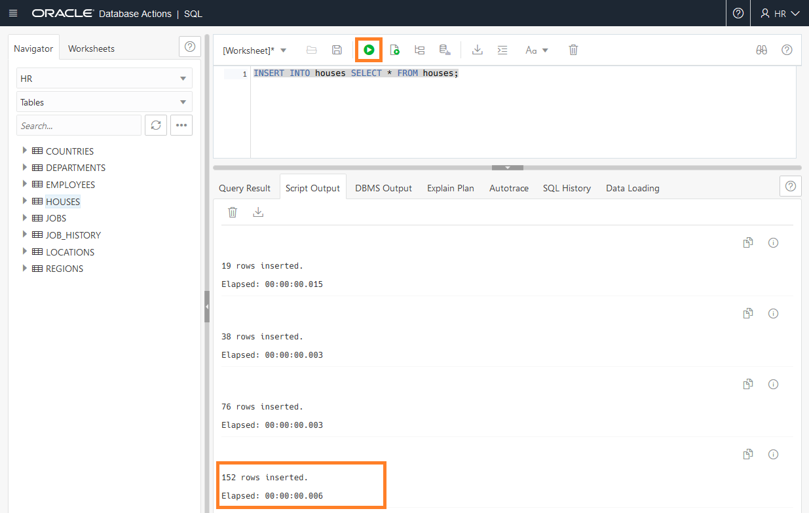
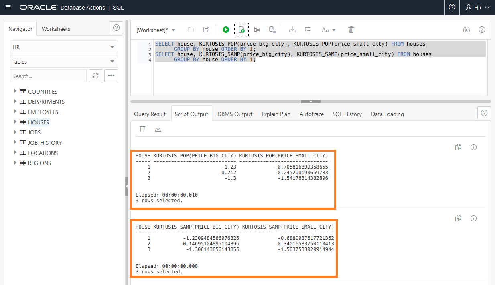
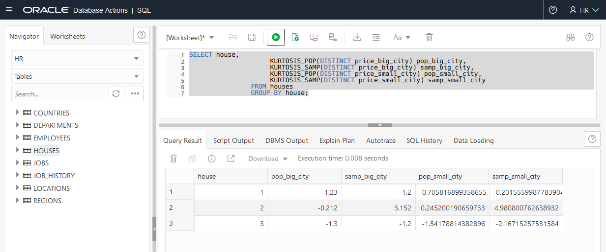
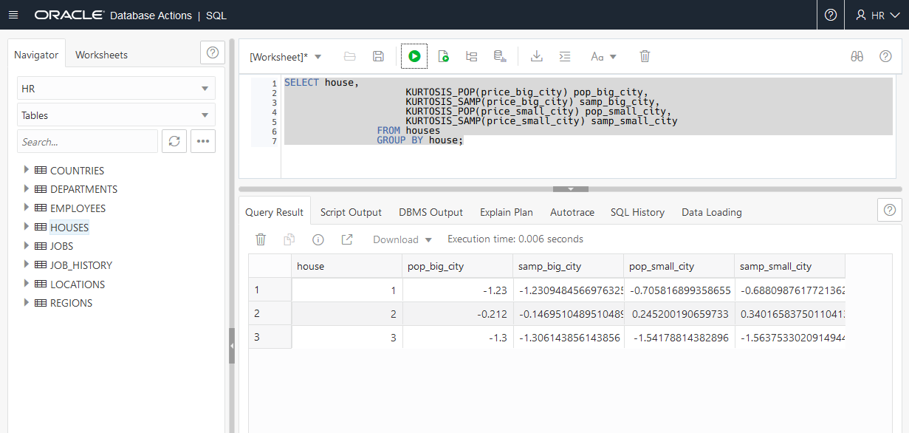
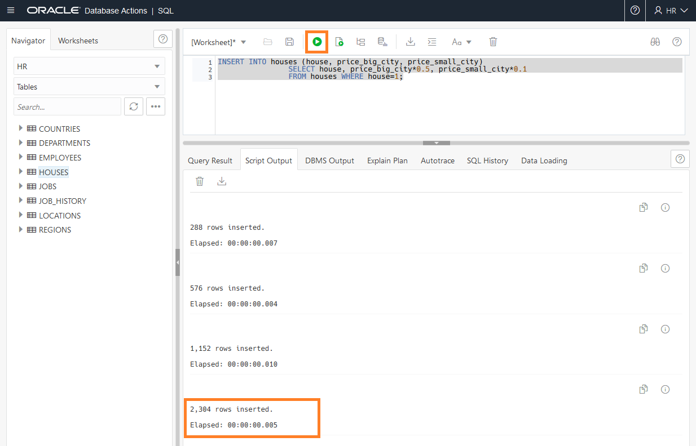
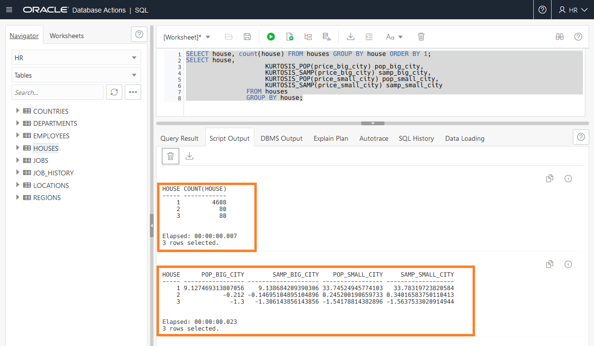

# Measure Tailedness of Data with the KURTOSIS Functions

## Introduction
This lab shows how to use the `KURTOSIS_POP` and `KURTOSIS_SAMP` aggregate functions to measure tailedness of data. Higher kurtosis means more of the variance is the result of infrequent extreme deviations, as opposed to frequent modestly sized deviations. A normal distribution has a kurtosis of zero.

Estimated Lab Time: 10 minutes

### About Kurtosis
When you approach the distribution of data for the first time, it’s often helpful to pull out summary statistics to understand the domain of the data.

Mean and variance are certainly helpful for understanding the scope of a dataset, but to understand the shape of the data we often turn to generating the histogram and manually evaluating the curve of the distribution.

Two additional summary statistics, skew and kurtosis, are a good next step for evaluating the shape of a distribution. ​We will explore kurtosis in this lab.

### Objectives
In this lab, you will:
<if type="dbcs">
* Setup the environment
</if>
<if type="atp">
* Examine the kurtosis of the distribution
* Examine the kurtosis of the distribution after data evolution

### Prerequisites
<if type="dbcs">
* An Oracle Free Tier, Paid or LiveLabs Cloud Account
* Lab: SSH Keys
* Lab: Create a DBCS VM Database
* Lab: 21c Setup
</if>
<if type="atp">
* An Oracle Always Free/Free Tier, Paid or LiveLabs Cloud Account
* Lab: Provision Oracle Autonomous Database
* Lab: Setup
</if>

<if type="dbcs">

## Task 1: Set up the environment

1. Connect to `PDB1` as `HR` and execute the `/home/oracle/labs/M104784GC10/Houses_Prices.sql` SQL script to create a table with data.

     ```

     $ <copy>cd /home/oracle/labs/M104784GC10</copy>
     $ <copy>sqlplus system@PDB21</copy>

     Copyright (c) 1982, 2020, Oracle.  All rights reserved.

     Enter password: <b><i>WElcome123##</i></b>
     Last Successful login time: Mon Mar 16 2020 08:49:41 +00:00

     Connected to:
     ```
     ```

     SQL> <copy>@/home/oracle/labs/M104784GC10/Houses_Prices.sql</copy>
     SQL> SET ECHO ON
     SQL>SQL> DROP TABLE houses;
     DROP TABLE houses
               *
     ERROR at line 1:
     ORA-00942: table or view does not exist

     SQL> CREATE TABLE houses (house NUMBER, price_big_city NUMBER, price_small_city NUMBER, price_date DATE);

     Table created.

     SQL> INSERT INTO houses VALUES (1,100000,10000, sysdate);

     1 row created.

     SQL> INSERT INTO houses VALUES (1,200000,15000, sysdate+1);

     1 row created.

     SQL> INSERT INTO houses VALUES (1,300000,25000, sysdate+1);

     1 row created.

     ...

     SQL> COMMIT;

     Commit complete.

     SQL>

     ```
</if>
<if type="atp">

## Task 1: Login to SQL Developer Web on Oracle Autonomous Database
There are multiple ways to access your Autonomous Database.  You can access it via SQL*Plus or by using SQL Developer Web.  To access it via SQL*Plus, skip to [Step 1B](#STEP1B:LogintoADBusingSQLPlus).

1.  If you aren't still logged in, login to your Oracle Autonomous Database screen by clicking on the navigation menu and selecting the Oracle Autonomous Database flavor you selected (Oracle Autonomous Transaction Processing, Oracle Autonomous Data Warehouse, or Oracle Autonomous JSON Database). Otherwise skip to the next step.
      

2.  If you can't find your Oracle Autonomous Database instance, ensure you are in the correct compartment, you have chosen the flavor of Oracle Autonomous Database you choose in the earlier lab and that you are in the correct region.

3.  Click on the **Display Name** to go to your Oracle Autonomous Database main page.
      

4.  Click on the **Tools** tab, select **Database Actions**, a new browser will open up.
      
5.  Enter the username *hr* and password *WElcome123##*
6.  Click on the **SQL** button.
7.  Skip to [Step 2](#STEP2:Examinethekurtosisofthedistribution)

## Task 1B: Login to Oracle Autonomous Database using SQL Plus
1. If you aren't logged into the cloud, log back in
2. Open up Cloud Shell
3. Connect to the *HR* user using SQL*Plus by entering the commands below.

    ```
    export TNS_ADMIN=$(pwd)/wallet
    sqlplus /nolog
	conn hr/WElcome123##@adb1_high
	```
</if>

## Task 2: Examine the kurtosis of the distribution
<if type="dbcs">
1.  Make some modifications to the display

	```
	SQL> <copy>SET PAGES 100</copy>
	```
</if>
<if type="atp">
1.  If you aren't logged in to SQL Developer Web, login as the *HR* user. We used the *REPORT* user in the skewness lab, this *HR* user has a fresh **houses** table for us to modify.

</if>
1. Display the table rows. The `HOUSE` column values refer to types of house that you want to look at and categorize the data that you look at statistically and compare with each other.


    ```
     SQL> <copy>SELECT * FROM houses;</copy>
    ```
    <if type="atp">
    
    </if>
    <if type="dbcs">
    ```
     HOUSE PRICE_BIG_CITY PRICE_SMALL_CITY PRICE_DAT
     ---------- -------------- ---------------- ---------
               1         100000            10000 05-FEB-20
               1         200000            15000 06-FEB-20
               1         300000            25000 06-FEB-20
               1         400000            28000 07-FEB-20
               1         500000            30000 08-FEB-20
               1         600000            32000 08-FEB-20
               1         700000            35000 09-FEB-20
               1         800000            38000 09-FEB-20
               1         900000            40000 10-FEB-20
               2        2000000          1000000 11-FEB-20
               2         200000            20000 05-FEB-20
               2         400000            35000 06-FEB-20
               2         600000            55000 06-FEB-20
               2         800000            48000 07-FEB-20
               3         400000            40000 08-FEB-20
               3         500000            42000 08-FEB-20
               3         600000            45000 09-FEB-20
               3         700000            48000 09-FEB-20
               3         800000            49000 10-FEB-20

     19 rows selected.
     ```
     </if>

2. Display the result of population kurtosis (`KURTOSIS_POP`) and sample kurtosis (`KURTOSIS_SAMP`) for the three types of houses.


     ```
     SQL> <copy>SELECT house, kurtosis_pop(price_big_city), kurtosis_pop(price_small_city) FROM houses
          GROUP BY house;</copy>
     ```
     <if type="dbcs">
    ```
    HOUSE KURTOSIS_POP(PRICE_BIG_CITY) KURTOSIS_POP(PRICE_SMALL_CITY)
    ---------- ---------------------------- ------------------------------
         1                        -1.23                      -.7058169
         2                        -.212                     .245200191
         3                         -1.3                     -1.5417881
    ```
     </if>
     ```
     SQL> <copy>SELECT house, kurtosis_samp(price_big_city), kurtosis_samp(price_small_city) FROM houses
          GROUP BY house;</copy>
     ```
     <if type="dbcs">
     ```
     HOUSE KURTOSIS_SAMP(PRICE_BIG_CITY) KURTOSIS_SAMP(PRICE_SMALL_CITY)
     ---------- ----------------------------- -------------------------------
         1                          -1.2                        -.201556
         2                         3.152                      4.98080076
         3                          -1.2                      -2.1671526

     ```

    </if>
     <if type="atp">
     
    </if>


  `PRICE_SMALL_CITY` has a higher kurtosis compared to `PRICE_BIG_CITY`. Observe whether there is more data in the tails or around the peak in `PRICE_SMALL_CITY` and in `PRICE_BIG_CITY`.

## Task 3: Examine the kurtosis of the distribution after data evolution
<if type="dbcs">
1. Insert more rows in the table.


     ```
     SQL> <copy>INSERT INTO houses SELECT * FROM houses;</copy>
     19 rows created.

     SQL> <copy>/</copy>
     38 rows created.

     SQL> <copy>/</copy>
     76 rows created.

     SQL> <copy>/</copy>
     152 rows created.

     SQL> <copy>COMMIT;</copy>
     Commit complete.
     ```
</if>
<if type="atp">
1. Insert more rows in the table.

	```
	SQL> <copy>INSERT INTO houses SELECT * FROM houses;</copy>
	```

2. Press the play button in SQL Developer Web to submit.

3. Press the play button 3 more times to submit a total of 152 rows.

     
</if>

2.  Issue select statements to examine the kurtosis of the distribution now.

     ```
     SQL> <copy>SELECT house, KURTOSIS_POP(price_big_city), KURTOSIS_POP(price_small_city) FROM houses
          GROUP BY house ORDER BY 1;</copy>
    ```
     <if type="dbcs">
    ```
       HOUSE KURTOSIS_POP(PRICE_BIG_CITY) KURTOSIS_POP(PRICE_SMALL_CITY)
     ---------- ---------------------------- ------------------------------
          1                        -1.23                      -.7058169
          2                        -.212                     .245200191
          3                         -1.3                     -1.5417881
     ```
     </if>
     ```
     SQL> <copy>SELECT house, KURTOSIS_SAMP(price_big_city), KURTOSIS_SAMP(price_small_city) FROM houses
          GROUP BY house ORDER BY 1;</copy>
     ```
     <if type="dbcs">
     ```       
      HOUSE KURTOSIS_SAMP(PRICE_BIG_CITY) KURTOSIS_SAMP(PRICE_SMALL_CITY)
     ---------- ----------------------------- -------------------------------
          1                    -1.2309485                      -.68809876
          2                    -.14695105                      .340165838
          3                    -1.3061439                      -1.5637533

     ```
     </if>
     <if type="atp">
     
     </if>


  As you can see, as the number of values in the data set increases, the difference between the computed values of `KURTOSIS_SAMP` and `KURTOSIS_POP` decreases.

2. Determine the kurtosis of distinct values in columns `PRICE_SMALL_CITY` and `PRICE_BIG_CITY`.


     ```
     SQL> <copy>SELECT house,
                         KURTOSIS_POP(DISTINCT price_big_city) pop_big_city,
                         KURTOSIS_SAMP(DISTINCT price_big_city) samp_big_city,
                         KURTOSIS_POP(DISTINCT price_small_city) pop_small_city,
                         KURTOSIS_SAMP(DISTINCT price_small_city) samp_small_city  
                    FROM houses
                    GROUP BY house;</copy>

    ```
   <if type="atp">
    
    </if>
    <if type="dbcs">
    ```
               HOUSE POP_BIG_CITY SAMP_BIG_CITY POP_SMALL_CITY SAMP_SMALL_CITY
     ---------- ------------ ------------- -------------- ---------------
               1        -1.23          -1.2      -.7058169        -.201556
               2        -.212         3.152     .245200191      4.98080076
               3         -1.3          -1.2     -1.5417881      -2.1671526
     ```
     </if>

  Is the result much different if the query does not evaluate the distinct values in columns `PRICE_BIG_CITY` and `PRICE_SMALL_CITY`?


     ```
     SQL> <copy>SELECT house,
                         KURTOSIS_POP(price_big_city) pop_big_city,
                         KURTOSIS_SAMP(price_big_city) samp_big_city,
                         KURTOSIS_POP(price_small_city) pop_small_city,
                         KURTOSIS_SAMP(price_small_city) samp_small_city  
                    FROM houses
                    GROUP BY house;</copy>

    ```
    <if type="atp">
    
    </if>
    <if type="dbcs">
    ```
               HOUSE POP_BIG_CITY SAMP_BIG_CITY POP_SMALL_CITY SAMP_SMALL_CITY
     ---------- ------------ ------------- -------------- ---------------
               1        -1.23    -1.2309485      -.7058169      -.68809876
               2        -.212    -.14695105     .245200191      .340165838
               3         -1.3    -1.3061439     -1.5417881      -1.5637533
     ```
     </if>

  The population tailedness value is not different because the same exact rows were inserted.

<if type="dbcs">
3. Insert more rows in the table with a big data set for `HOUSE` number 1.


     ```
     SQL> <copy>INSERT INTO houses (house, price_big_city, price_small_city)
                    SELECT house, price_big_city*0.5, price_small_city*0.1
                    FROM houses WHERE house=1;</copy>

     144 rows created.

     SQL> <copy>/</copy>
     288 rows created.

     SQL> <copy>/</copy>
     576 rows created.

     SQL> <copy>/</copy>
     1152 rows created.

     SQL> <copy>/</copy>
     2304 rows created.

     SQL> <copy>COMMIT;</copy>
     Commit complete.
     ```
</if>

<if type="atp">
3. Insert more rows in the table with a big data set for `HOUSE` number 1.

	```
	SQL> <copy>INSERT INTO houses (house, price_big_city, price_small_city)
                    SELECT house, price_big_city*0.5, price_small_city*0.1
                    FROM houses WHERE house=1;</copy>
	```
2. Press the play button in SQL Developer Web to submit.

3. Press the play button 4 more times to submit a total of 2304 rows.

     
</if>

2. Select and count the houses.

     ```
     SQL> <copy>SELECT house, count(house) FROM houses GROUP BY house ORDER BY 1;</copy>
     ```
     <if type="dbcs">
    ```

               HOUSE COUNT(HOUSE)
     ---------- ------------
               1         4608
               2           80
               3           80
     ```
     </if>
     ```
     SQL> <copy>SELECT house,
                         KURTOSIS_POP(price_big_city) pop_big_city,
                         KURTOSIS_SAMP(price_big_city) samp_big_city,
                         KURTOSIS_POP(price_small_city) pop_small_city,
                         KURTOSIS_SAMP(price_small_city) samp_small_city  
                    FROM houses
                    GROUP BY house;</copy>
     ```

     <if type="dbcs">
     ```

               HOUSE POP_BIG_CITY SAMP_BIG_CITY POP_SMALL_CITY SAMP_SMALL_CITY
     ---------- ------------ ------------- -------------- ---------------
               1   9.12746931    9.13868421     33.7452495      33.7831972
               2        -.212    -.14695105     .245200191      .340165838
               3         -1.3    -1.3061439     -1.5417881      -1.5637533

     ```
    </if>
     <if type="atp">
     
     </if>

  Now the tailedness of the data becomes positive for house number 1 which means that data is skewed to right. `PRICE_SMALL_CITY` has a much higher kurtosis compared to `PRICE_BIG_CITY`. This implies that in `PRICE_SMALL_CITY`, more of the variance is the result of many infrequent extreme deviations, whereas in `PRICE_BIG_CITY`, the variance is attributed to very frequent modestly sized deviations.

<if type="atp">
5. Click the down arrow in the upper right corner and **Sign Out** of the HR user.
</if>
<if type="dbcs">
5.  Exit from the sql prompt

	```
	SQL> <copy>EXIT</copy>
	$

	```
</if>

You may now [proceed to the next lab](#next).

## References
[Skewness Kurtosis Blog](https://www.sisense.com/blog/understanding-outliers-with-skew-and-kurtosis/)

## Acknowledgements
* **Author** - Donna Keesling, Database UA Team
* **Contributors** -  David Start, Kay Malcolm, Didi Han Database Product Management
* **Last Updated By/Date** - Arabella Yao, Product Manager, Database Product Management, December 2021