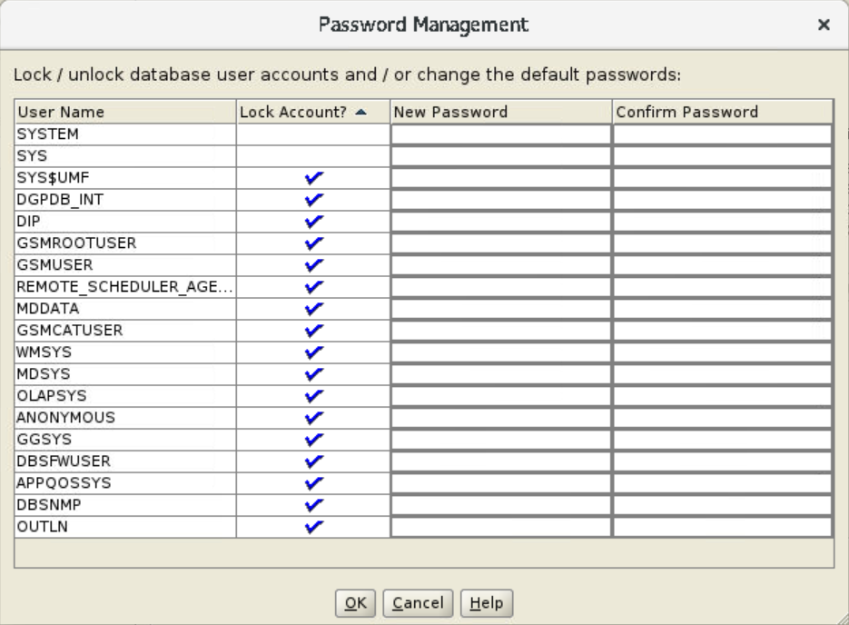

# Create Container Database

## Introduction

This lab shows how to create an Oracle Database using Oracle Database Configuration Assistant (Oracle DBCA).

If your host has only the database software, then you run Oracle DBCA and create a database. Along the database software if you have created an Oracle Database and want to create additional databases, then you can use Oracle DBCA. Oracle DBCA helps you create databases, but it does not install the database software.

With Oracle DBCA, you can create a database in the following modes.
 - *Typical*
 - *Advanced*

Estimated time: 1 hour

### Objectives

 - Start Oracle DBCA from Oracle home 1
 - Create an Oracle Database with *Typical configuration* in Oracle home 1
 - Start Oracle DBCA from Oracle home 2
 - Create an Oracle Database with *Advanced configuration* in Oracle home 2

> **Note**: [](include:oracle-home)

### Prerequisites

This lab assumes you have -
 - An Oracle Cloud account
 - Completed all previous labs successfully
 - Installed the Oracle Database software, configured Oracle homes, and created databases on the host

> **Note**: [](include:example-values)

## Task 1: Start Oracle DBCA from Oracle home 1

You can run Oracle DBCA only after you install the Oracle Database software using the database installer. 

In this task, you will start Oracle DBCA from Oracle home 1.

1.  Open a terminal window and go to the `bin` directory in Oracle home 1.   
    This is the directory where Oracle DBCA is located.

    ```
	$ <copy>cd /u01/app/oracle/product/23.4.0/dbhome_1/bin</copy>
	```

    > **Note**: [](include:oracle-user)

1.  Run this command to start Oracle DBCA.

    ```
	$ <copy>./dbca</copy>
	```

Now, create a database with *Typical configuration* as explained in the next task.

## Task 2: Create a Container Database with Typical configuration

With Typical configuration, you can create an Oracle Database in few steps with minimal options.

In this task, you will select *Typical configuration* to create an Oracle Database, *orcl2*, in Oracle home 1.

1.  Oracle DBCA starts with the Database Operation window and displays with the default option **Create a database** selected. Click **Next**.

    

    > **Tip**: With Oracle DBCA, you can perform other administrative tasks, such as configure or delete an existing database and manage PDBs and templates. These are not included in this workshop.

1.  The window displays the default creation mode, **Typical configuration**, selected with prefilled basic configuration. 

    For this task, specify the following.

     - **Global database name** - Enter a unique name, for example *orcl2.us.oracle.com*
     - **Administrative password** - Set the password for database administrators, for example *We!come1*   
        The password must conform to the Oracle recommended standards.
     -   **Pluggable database name** - Enter a name for the pdb, for example *orcl2pdb*

    For the remaining fields, leave the defaults and click **Next**.

    

	[](include:global-dbname)

	[](include:adm-users)

    The default **Database Character set** for Oracle Database is *AL32UTF8 - Unicode UTF-8 Universal character set*.

	> [](include:char-set)

    Along with the Container Database (CDB), Oracle DBCA also creates a Pluggable Database (PDB) with the name you specify in this window.

1.  Before creating the database, the Summary window displays the database configuration for final review. You can verify the details in this window.

    

    Click **Finish** to create your Oracle Database. The Progress Page window displays the status of database creation.

    > **Note**: You require scripts to configure the Oracle Database software but for creating a database, you do not require any scripts.

    On completion, Oracle DBCA displays the Finish window. 

    

    You have successfully created an Oracle Database, *orcl2*, using Oracle DBCA in Oracle home 1.

    **Password Management**

    In the Finish window, click **Password Management** to view the preexisting user accounts in your database. Except SYS and SYSTEM, all users are initially in locked state.

    

    You can administer user accounts in the Password Management window, such as unlock a user or set the password. However, you can do these tasks later.

    Click **OK** if you want to save any changes and close the Password Management window.

Click **Close** in the Finish window to exit Oracle DBCA.

Next, you will create a database with Advanced configuration. Though you can create multiple databases using different modes in the same Oracle home, for this lab, run Oracle DBCA from another Oracle home. 

## Task 3: Start Oracle DBCA from Oracle home 2

In this task, you will start Oracle DBCA from Oracle home 2.

1.  Open a terminal window and go to the `bin` directory in Oracle home 2.   
    This is the directory where Oracle DBCA is located.

    ```
	$ <copy>cd /u01/app/oracle/product/23.4.0/dbhome_2/bin</copy>
	```

1.  Run this command to start Oracle DBCA.

    ```
	$ <copy>./dbca</copy>
	```

Now, create and configure a database in the *Advanced mode* as explained in the next task.

## Task 4: Create and configure a Container Database with Advanced configuration

Using the Advanced configuration option, you can specify detailed configuration of your Oracle Database. 

In this task, you will select *Advanced configuration* to create an Oracle Database, *orcl3*, in Oracle home 2.

1.  Oracle DBCA starts with the Database Operation window and displays with the default option **Create a database** selected. Click **Next**.

    

1.  In the Creation Mode window, select **Advanced configuration** and click **Next**.

    

	[](include:dbca-adv)

1.  You can select the database type and template suitable for your Oracle Database in the Deployment Type window.

    For this lab, leave the defaults and click **Next**.
     - **Database type**: *Oracle Single Instance database*
	 - **Template name**: *General Purpose or Transaction Processing*

    This template includes basic configuration for the database, such as database components, initialization parameters, data files, control files, and redo log groups.

    

    > **Tip**: For environments that are more complex, you can select the Custom Database option. This option does not use any templates and it usually increases the time taken to create an Oracle Database. For this lab, do not select this option.

1.  The Database Identification window displays prefilled names and Oracle System Identifier (SID) for your database.

    

    For this task, specify the following.
     - **Global database name** - Enter a unique name, for example *orcl3.us.oracle.com*
     - **SID** - *orcl3*
     - **PDB name** - *orcl3pdb1*

    > [](include:oracle-sid)

    Along with the CDB, Oracle DBCA also creates a PDB with the name you specify in this window. Though you can create multiple PDBs together, for this task, create only a single PDB.   
    For the remaining fields, leave the defaults and click **Next**.

1.  The Storage Option window displays the default option **Use template file for database storage attributes** selected.

    In this option, the database uses the directory information specified in the *General Purpose or Transaction Processing* template.

    

    For this task, leave the defaults and click **Next**.

    > **Tip**: You can specify another location to store the database files with the **Use following for the database storage attributes** option. With this option, you can select the storage type as File system or Oracle Automatic Storage Management (Oracle ASM). For this lab, do not select these options.

1.  Select **Specify Fast Recovery Area** to set up a backup and recovery area for your database. The recovery information will be stored as File System in the specified location. 

    

    The Fast Recovery Option window displays the default parameters prefilled.

     - **Recovery files storage type** - *File System*
     - **Fast Recovery Area** - the directory for recovery-related files
     - **Fast Recovery Area size** - size of the recovery area

    You can select the storage type or specify the directory location and size of the recovery area. For this task, leave the defaults and click **Next**.

    > **Tip**: The **Enable archiving** option is for archiving the online redo log files. These files are useful during Oracle Database recovery. For this task, do not select this option.

1.  In the Network Configuration window, you can view the existing listener and select it for your database or create a new listener. For this task, deselect the existing listener if already selected.

    Select the option **Create a new listener** and enter the following:
     - **Listener name** - *LISTENER1*
     - **Listener port** - *1526*

    

    > A ***Listener*** is a network service that runs on the database server. It is responsible for receiving incoming connection requests to and from the database and for managing the network traffic.
     - If you created an Oracle Database earlier, then a listener already exists on your host.
	 - If you installed only the Oracle Database software and did not create a database, then your host does not have any listener.

    You cannot create multiple listeners on a host with the same name. If a listener with the specified name already exists, then enter a different name, for example, *LISTENER23*. Similarly, specify a *unique port number* for each listener on the host. 

1.  With Oracle DBCA you can configure Oracle Database Vault and Oracle Label Security to control administrative access to your data and to individual table rows.

    

    For this task, do not select these options and click **Next**.

1.  You can specify the following configuration options for Oracle Database. 

     - **Memory** - The *Use Automatic Shared Memory Management* method enables you to allocate specific volume of memory to SGA and aggregate PGA. For optimum use of disk space, you can move the indicator to the left and decrease the size of the SGA and PGA values.

		Oracle Database enables automatic shared memory for SGA and distributes the remaining memory among individual PGAs as required.
        For more information about memory management, see [About Automatic Shared Memory Management](https://docs.oracle.com/en/database/oracle/oracle-database/23/admin/managing-memory.html#GUID-B8B8923C-4213-42A9-8ED3-4ABE48C23914).

		

         - *Manual Shared Memory Management* - to enter specific values for each SGA component and the aggregate PGA. It is useful for advanced database administration.

         - *Automatic Memory Management* - to set the usable memory in the memory target. The system then dynamically configures the memory components of both SGA and PGA instances.

        > **Tip**: If the total physical memory of your Oracle Database instance is greater than 4 GB, you cannot select the `Use Automatic Memory Management` option. Instead, *Use Automatic Shared Memory Management* to distribute the available memory among various components as required, thus the system can maximize the use of all available SGA memory.

     - **Sizing** - Specify the maximum number of processes that can connect simultaneously to your Oracle Database, for example, *320*.

		

        > While using predefined templates, the **Block size** option is not enabled. Oracle DBCA creates an Oracle Database with the default block size of *8 KB*.

     - **Character sets** - The *Use Unicode (AL32UTF8)* option is selected by default.

		

		> [](include:char-set)

     - **Connection mode** - *Dedicated server mode* uses a dedicated server process for each user process.

		

    For this task, leave the defaults for each tab and continue.

1.  In the Management Options window, you can register your database with Oracle Enterprise Manager (EM). 

	For this lab, leave this option unselected and click **Next**.

    

	> **Note**: [](include:register-em)

1.  Set the password for the database administrators. Though you can specify different passwords for each user, for this lab, select **Use the same administrative password for all accounts**.

    Enter the password, for example *We!come1*, and click **Next**.   
    The password must conform to the Oracle recommended standards.

    

	[](include:adm-users)

1.  The Creation Option window displays the default option **Create database** selected.   
    For the remaining fields, leave the defaults and click **Next**.

    

1.  Before installing the database, the Summary window displays the database configuration for final review. You can verify the details in this window.

    

    Click **Finish** to create your Oracle Database. The Progress Page window displays the status of database creation. 

    On completion, Oracle DBCA displays the Finish window.

    

You have successfully created an Oracle Database using Oracle DBCA in Oracle home 2. Click **Close** in the Finish window to exit Oracle DBCA.

> **Note**: The Password Management window functions the same as explained in the previous task. You can administer the user accounts in your database, such as unlock a user or set the passwords. However, you can do these tasks later.

Congratulations! You have reached the end of this workshop on *Oracle Database installation*.

In this workshop, you learned how to install the Oracle Database software on your host using the database installer and configure a database with Desktop class and Server class. You also created additional databases using Oracle DBCA with both Typical configuration and Advanced configuration. You can now manage and administer your Oracle Database.

## Acknowledgments

 - **Author**: Manish Garodia, Database User Assistance Development
 - **Contributors**: Prakash Jashnani, Subhash Chandra, Subrahmanyam Kodavaluru, Manisha Mati
 - **Last Updated By/Date**: Manish Garodia, October 2024
