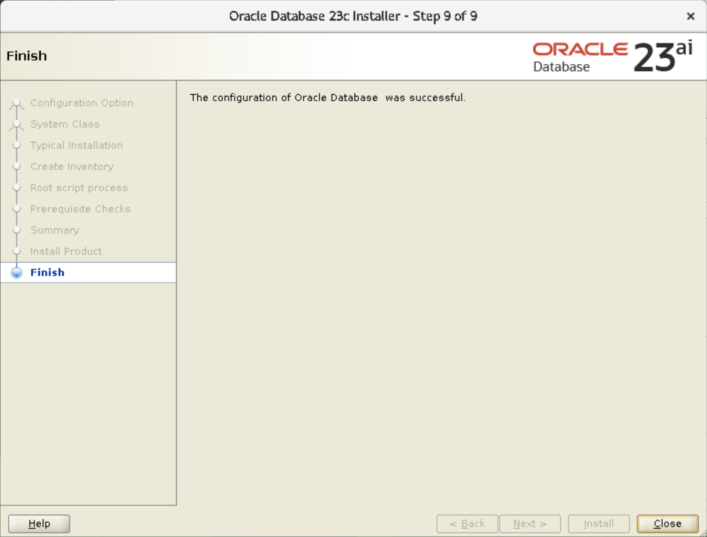
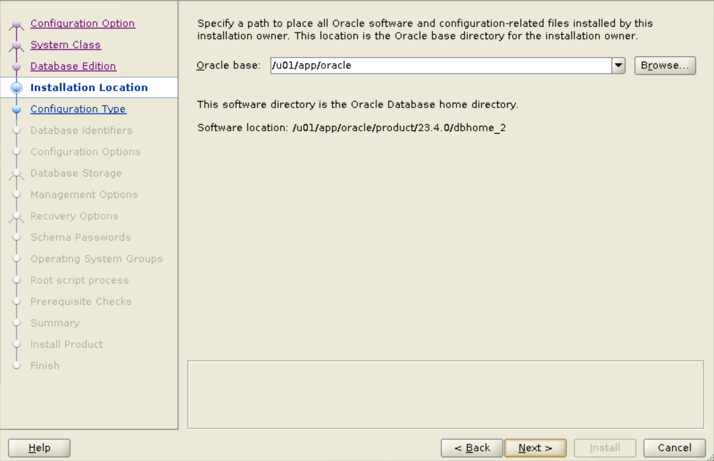

# Install Oracle Database

## Introduction

This lab walks you through the steps for installing the Oracle Database software, setting up Oracle home, and creating a database on your host using Oracle Database Setup Wizard (Database Installer).

Estimated time: 1 hour

### Objectives

 - Run the database installer from Oracle home 1
 - Install Oracle Database with *Desktop class* in Oracle home 1
 - Run the database installer from Oracle home 2
 - Install Oracle Database with *Server class* in Oracle home 2

To install both system classes on the same host, you require different Oracle home locations.

> **Note**: [](include:oracle-home)

### Prerequisites

This lab assumes you have -
 - An Oracle Cloud account
 - Completed all previous labs successfully
 - Downloaded the database installer

	<!-- > **Tip**: You can get the database installer from Oracle's [download site](https://www.oracle.com/database/free/get-started/). If you have reserved a Livelabs environment, then it has the installer already. -->

Besides, you are installing Oracle Database for the first time and do not have Oracle home already configured on your host.

> **Note**: [](include:example-values)

## Task 1: Run the database installer from Oracle home 1

To install Oracle Database, the first step is to access and run the database installer. For this task, you require an installer in Oracle home 1.

1.  Open a terminal window and go to Oracle home 1 where the database installer resides.   
	In the Livelabs environment, an installer is located in the following directory.

    ```
	$ <copy>cd /u01/app/oracle/product/23.4.0/dbhome_1</copy>
	```

    > **Note**: [](include:oracle-user)

1.  From Oracle home 1, run this command to start the installer.

    ```
	$ <copy>./runInstaller</copy>
	```

The installer displays the wizard to start Oracle Database installation.

> **Note**: To run the installer, ensure that the `xdpyinfo` program is installed on your host. If the `oracle` user does not have executable privileges, then log in as `root` and run this command:   
`xhost +SI:localuser:oracle`

## Task 2: Install Oracle Database with Desktop class

With Desktop class, you can install Oracle Database in few steps with basic configuration.

In this task, you will select *Desktop class* to install the database software and create a database, *orcl*, in Oracle home 1.

1.  The Configuration Option window opens with the default option **Create and configure a single instance database** selected. This option helps you create a database. 

    

    > **Note**: The *Set Up Software Only* option installs only the database software but does not create any database. You can create a container database later with Oracle DBCA. For this lab, do not select this option.

    Click **Next**.

1.  The System Class window displays the default option **Desktop class** selected.    
    In this system class, the database installer provides basic configuration for database installation.

    

    Click **Next**.

1.  The Typical Install Configuration window displays prefilled names and values with configuration parameters.

    For this task, specify the following.
     - **OSDBA group** - *dba*
     - **Global database name** - Enter a unique name, for example *orcl.us.oracle.com*
     - **Password** - Set the password for database administrators, for example *We!come1*   
		The password must conform to the Oracle recommended standards.
     - **Pluggable database name** - Leave the default name, *orclpdb*

    For the remaining fields, leave the defaults and click **Next**.

    

	[](include:global-dbname)

	[](include:adm-users)

    The installer internally runs Oracle DBCA to create an Oracle Database. Along with the Container Database (CDB), it also creates a Pluggable Database (PDB) with the name you specify in this window.

1.	The installer prompts you to specify the location for *`oraInventory`*. This is the centralized inventory for all Oracle software products installed on the host.

    

    > **Note**: The first time you install Oracle Database, the installer offers you to specify the inventory location. If Oracle Database is already installed on your host, then the next time you run the database installer, it does not prompt to configure inventory. The inventory location for your database is already set. 

    For this lab, do not change the default **Inventory Directory**. Select the operating system group for Oracle inventory as *dba* and click **Next**.   
	Note that *dba* is the primary group of the user who is installing the database. 

1.  The installer requires you to run scripts as the `root` user to configure the database software.   
    Leave the option **Automatically run configuration scripts** unselected and click **Next**. 

    

    > **Note**: If you specify the root credentials, then the installer will run the configuration scripts automatically. For this lab, run the scripts manually as explained later. 

1. 	[](include:prereq-check)

    

    Click **Next**.

1.  Before installing the database, the Summary window displays the database configuration for final review. You can verify the details in this window. 

    

    Click **Install** to start the database installation. The Install Product window displays the progress of database installation.

1.  During the installation, the installer displays the configuration scripts to run as the `root` user. Run these scripts to proceed with the installation.

    > **Caution**: Do not close this window.

    

    The installer displays this window because you opted to run the scripts manually in a previous step. Note that the window displays two scripts, of which *`orainstRoot.sh`* is to configure the inventory. The next time you run the database installer on the same host, it displays only one script, *`root.sh`*.

1.  Open a new terminal window and run the script *`orainstRoot.sh`* located in the `oraInventory` directory.

    ```
	$ <copy>sudo /u01/app/oraInventory/orainstRoot.sh</copy>
	```

    > **Note**: You can run this script as `root` if you have the privileges. For this lab, use the `sudo` command.

    It returns the following.

    ```
	Changing permissions of /u01/app/oraInventory.
    Adding read,write permissions for group.
    Removing read,write,execute permissions for world.

    Changing groupname of /u01/app/oraInventory to dba.
    The execution of the script is complete.
	```

1.  In the same terminal, run another script *`root.sh`* located in Oracle home 1.

    ```
	$ <copy>sudo /u01/app/oracle/product/23.4.0/dbhome_1/root.sh</copy>
	```

    > **Note**: You can run this script as `root` if you have the privileges. For this lab, use the `sudo` command.

    It returns the following.

    Press Enter, if prompted.

	```
    Performing root user operation.

    The following environment variables are set as:
        ORACLE_OWNER= oracle
        ORACLE_HOME=  /u01/app/oracle/product/23.4.0/dbhome_1

    Enter the full pathname of the local bin directory: [/usr/local/bin]: 
    Copying dbhome to /usr/local/bin ...
    Copying oraenv to /usr/local/bin ...
    Copying coraenv to /usr/local/bin ...

    Creating /etc/oratab file...
    Entries will be added to the /etc/oratab file as needed by
    Database Configuration Assistant when a database is created
    Finished running generic part of root script.
    Now product-specific root actions will be performed.
    ```
    You can close the terminal window. Running scripts are applicable for Linux and UNIX operating systems only.

<!-- 
    The following environment variables are set as:

	ORACLE_OWNER= oracle
	ORACLE_HOME=  /u01/app/oracle/product/23.4.0/dbhome_1

    Enter the full pathname of the local bin directory: [/usr/local/bin]:
	

    Press Enter to continue.

	
	/usr/local/bin is read only.  Continue without copy (y/n) or retry (r)? [y]:
	

    Press Enter to continue.

    
	Warning: /usr/local/bin is read only. No files will be copied.


    Creating /etc/oratab file...
    Entries will be added to the /etc/oratab file as needed by
    Database Configuration Assistant when a database is created
    Finished running generic part of root script.
    Now product-specific root actions will be performed.
    -->

11.  Return to the Run Configuration Scripts window and click **OK** to continue. The installer proceeds with creating the database according to your configuration.

    On completion, the installer displays the Finish window.

    

Congratulations! You have successfully installed your Oracle Database, *orcl*, in Oracle home 1. Click **Close** in the Finish window to exit the database installer.

Next, you will install Oracle Database with *Server class*. 

## Task 3: Run the database installer from Oracle home 2

To install the Oracle Database software again on the same host, you require another database installer in a different Oracle home location, Oracle home 2.


1.  Open a terminal window and go to Oracle home 2 where another installer resides.   
	In the Livelabs environment, the installer is located in the following directory.

    ```
	$ <copy>cd /u01/app/oracle/product/23.4.0/dbhome_2</copy>
	```

1.  From Oracle home 2, run this command to start the installer.

    ```
	$ <copy>./runInstaller</copy>
	```

The installer displays the wizard to start Oracle Database installation.

## Task 4: Install and configure Oracle Database with Server class

Using the Server class option, you can perform advanced database installation with detailed configuration. 

In this task, you will select *Server class* to install the database software and create a database, *orcl1*, in Oracle home 2. 

1.  The Configuration Option window displays the default option to create and configure a database.

    

    > **Note**: The *Set Up Software Only* option installs only the database software. For this task, do not select this option.

	Click **Next**.

1.  Select **Server class** in the System Class window to perform a detailed installation.   
    In this system class, the database installer provides more options to configure your database.

    

	Click **Next**.

1.  The Database Edition window displays the default option, **Enterprise Edition**, selected.   
    This option installs a database suitable for large enterprises. Click **Next**.

    

    > **Tip**: *Standard Edition 2* is suitable for small and medium-sized businesses.

1.  In the Installation Location window, you can select the Oracle base location. 

    

    For this task, leave the default location and click **Next**.

1.  The installer does not prompt to configure the inventory location and goes directly to the Configuration Type window.

    The window displays the default template **General Purpose / Transaction Processing** selected. This template includes basic configuration for the database, such as database components, initialization parameters, data files, control files, and redo log groups. 

    

    > **Note**: If a host does not have Oracle Database installed, then the installer displays an option to set up inventory. As you have installed Oracle Database in the previous task, inventory on your host is already configured.

    Leave the default template and click **Next**.

1.  The Database Identifiers window displays prefilled names and Oracle System Identifier (SID) for your database.

    

    For this task, specify the following.
     - **Global database name** - Enter a unique name, for example *orcl1.us.oracle.com*
     - **Oracle system identifier (SID)** - *orcl1*
     - **Pluggable database name** - *orcl1pdb*

    > [](include:oracle-sid)

    The installer internally runs Oracle DBCA to create an Oracle Database. Along with the CDB, it also creates a PDB with the name you specify in this window.

1.  In the Configuration Options window, you can allocate memory and select character sets for your database. 

     - **Memory** - Specify the memory you want to allocate for your database, for example *6347* MB.
        For optimum use of disk space, you can move the indicator next to **Allocate memory** to the left and decrease the size of the SGA and PGA values.

		

		For this task, do not enable automatic memory management. To learn more about memory management, see [About Automatic Memory Management Installation Options](https://docs.oracle.com/en/database/oracle/oracle-database/23/ladbi/about-automatic-memory-management-installation-options.html#GUID-38F46564-B167-4A78-A974-8C7CEE34EDFE).    
        Go to the next tab. 

     - **Character sets** - The *Use Unicode (AL32UTF8)* option is selected by default.

		

		> [](include:char-set)

    For this lab, leave the defaults and click **Next**.

1.  The installer displays options to select the storage type and data file location for your database.   
    Leave the defaults and click **Next**.

    

    Using Oracle Automatic Storage Management (Oracle ASM), you can store your data files in ASM disk groups. For this lab, do not select this option.

1.  In the Management Options window, you can register your database with Oracle Enterprise Manager (EM).   
    For this lab, leave this option unselected and click **Next**.

    

	> **Tip**: [](include:register-em)

1.  Select **Enable Recovery** in the Recovery Options window for restoration of Oracle Database in event of a failure.   
    The recovery information will be stored as File System in the specified location. Click **Next**.

    

1.  Set the password for the database administrators. Though you can specify different passwords for each user, for this lab, select **Use the same password for all accounts**.

    Enter the password, for example *We!come1*, and click **Next**.   
    The password must conform to the Oracle recommended standards.

    

	[](include:adm-users)

1.  You can select specific OS groups to grant the corresponding SYS privileges to database administrators. The drop-down menu displays the groups to which your user belongs.   
    <!-- For this lab, select *dba* for all groups and click **Next**. -->
    For this task, leave the default OS groups and click **Next**. 

    > **Note**: If OS groups are not configured in your system, you can select *dba* for all groups.

    

1.  The installer requires you to run scripts as the root user to configure the database software.   
    Leave the option **Automatically run configuration scripts** unselected and click **Next**. 

    

    > **Note**: If you specify the root credentials, then the installer will run the configuration scripts automatically. For this lab, run the scripts manually as explained later. 

1.	[](include:prereq-check)

	If you have fixed the issues in the previous task using the autogenerated script, then the installer does not display any problems and goes to the next window.

1.  Before installing the database, the Summary window displays the database configuration for final review. You can verify the details in this window. 

    

    Click **Install** to start the database installation. The Install Product window displays the progress of database installation.

1.  During the installation, the installer displays the configuration script to run as the `root` user. Run the script to proceed with the installation.

    > **Caution**: Do not close this window.

    

    The installer displays this window because you opted to run the scripts manually in a previous step. Note that the window displays only one script, *`root.sh`*. It does not display any script to configure the inventory. As you have installed Oracle Database in the previous task, inventory on your host is already configured.

1.  Open a new terminal window and run another script *`root.sh`* located in Oracle home 2.

    ```
	$ <copy>sudo /u01/app/oracle/product/23.4.0/dbhome_2/root.sh</copy>
	```

    > **Note**: You can run this script as `root` if you have the privileges. For this lab, use the `sudo` command.

    It returns the following.

    Press Enter, if prompted.
    ```
    Performing root user operation.

    The following environment variables are set as:
        ORACLE_OWNER= oracle
        ORACLE_HOME=  /u01/app/oracle/product/23.4.0/dbhome_2

    Enter the full pathname of the local bin directory: [/usr/local/bin]: 
    The contents of "dbhome" have not changed. No need to overwrite.
    The contents of "oraenv" have not changed. No need to overwrite.
    The contents of "coraenv" have not changed. No need to overwrite.

    Entries will be added to the /etc/oratab file as needed by
    Database Configuration Assistant when a database is created
    Finished running generic part of root script.
    Now product-specific root actions will be performed.
    ```
    You can close the terminal window. Running scripts are applicable for Linux and UNIX operating systems only. 

    <!-- ```
	The following environment variables are set as:

	ORACLE_OWNER= oracle
	ORACLE_HOME=  /u01/app/oracle/product/23.4.0/dbhome_2

    Enter the full pathname of the local bin directory: [/usr/local/bin]:
	```

    Press Enter to continue.

    ```
	/usr/local/bin is read only.  Continue without copy (y/n) or retry (r)? [y]:
	```

    Press Enter to continue.

    ```
	Warning: /usr/local/bin is read only. No files will be copied.


    Entries will be added to the /etc/oratab file as needed by
    Database Configuration Assistant when a database is created
    Finished running generic part of root script.
    Now product-specific root actions will be performed.
	``` -->

    

1.  Return to the Run Configuration Scripts window and click **OK** to continue. The installer proceeds with creating the database according to your configuration.

    On completion, the installer displays the Finish window.

    

You have successfully installed and configured your Oracle Database, *orcl1*, in Oracle home 2. Click **Close** in the Finish window to exit the database installer. 

In this lab, you installed Oracle Database with Desktop class in Oracle home 1 location and with Server class in Oracle home 2. You used the database installer for configuring the database software and creating databases, *orcl* and *orcl1*. You now have two Oracle homes configured on your host. Next, you can create additional databases using Oracle DBCA. 

You may now **proceed to the next lab**.

## Acknowledgments

 - **Author**: Manish Garodia, Database User Assistance Development
 - **Contributors**: Prakash Jashnani, Subhash Chandra, Subrahmanyam Kodavaluru, Manisha Mati, Aayushi Arora
 - **Last Updated By/Date**: Aayushi Arora, March 2025
