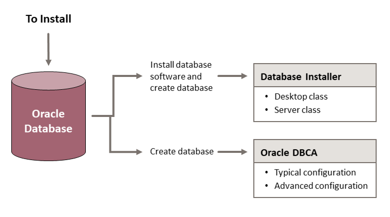

# Oracle Database installation

## About this workshop

This workshop provides detailed steps for installing a new *Oracle Database 23ai* on your host. It helps you install the Oracle Database software and create a single instance database. It demonstrates different ways of installing the software and creating additional databases.

> **Note**: Upgrading an existing Oracle Database to a later version is not within the scope of this workshop. 

Estimated workshop time: 2 hours 45 minutes

Watch this video to learn about the *highlights of Oracle Database 23ai*.

### Objectives

In this workshop, you will do the following.
 - Install Oracle Database with -
	 - *Desktop class*
	 - *Server class*
 - Create a database with -
	 - *Typical configuration*
	 - *Advanced configuration*

> For database installation, use **Oracle Database Setup Wizard (Database Installer)**.    
> For creating databases, use **Oracle Database Configuration Assistant (Oracle DBCA)**.

### Prerequisites

This lab assumes you have -

 - An Oracle Cloud account

## How to install Oracle Database?

You can install Oracle Database in two ways:

 - Create and configure a single instance database
 - Install Oracle Database software and then create the database

For this purpose, Oracle provides the following tools:

 - Database installer
 - Oracle DBCA

### About database installer

The database installer is a graphical user interface utility to systematically install Oracle Database through a wizard. Using the installer, you can install the database software, set Oracle home, and create an Oracle Database.

The installer has the ability to verify whether Oracle home is already configured on your host. When you install Oracle Database for the first time, the installer provides option to configure the central inventory location. If Oracle home is already configured on your host, then the installer uses the existing centralized inventory for additional software installation and database creation.

For database installation, the installer offers two system classes -
 - *Desktop class* with minimal configuration
 - *Server class* with advanced configuration

In a single Oracle home, you install the database software only one-time but can create multiple databases. Hence, to install both the system classes on the same host, you require different Oracle home locations. 

In this workshop, you will install Oracle Database with Desktop class in one Oracle home and with Server class in another Oracle home.

> **Note**: 

**Types of database installation**

When you run the installer, you can select from the following options.

 - **Create and configure a single instance database** - to install the Oracle Database software and create an Oracle Database.
 - **Set Up Software Only** - to install only the database software but not create any database. You can create the database later using Oracle DBCA.

Depending on the type of installation, the installer can run Oracle DBCA internally or you can run Oracle DBCA after the installation.

Consider the scenarios:

 - **Case #1**: You have installed only the database software with the database installer. Then, you must run Oracle DBCA to create a database.

 - **Case #2**: Along with installing the database software, you have also created a database with the installer. You can still run Oracle DBCA to create additional databases.

### About Oracle DBCA

The Oracle DBCA tool helps you create and configure a single-instance Oracle Database in an already-installed Oracle home but does not install the database software. 

> **Note**: You can run Oracle DBCA only after you install the Oracle Database software using the database installer.

Oracle DBCA provides two database creation modes. 

 - *Typical* - In this mode, you have limited options to configure but can create a database in few steps.
 - *Advanced* - 

Follow the subsequent labs to install Oracle Database on your host and explore these options in detail.

### Installation prerequisites

Before installing the Oracle Database software, the installer performs several automated checks to verify whether the hardware and the software required for installation are available. If your system does not meet any specific requirement, then it displays a corresponding error message. The requirements may vary depending upon the system and the operating system you are using.

### Minimum recommendations

 - 2 GB RAM
 - Oracle Enterprise Linux 8.6, Red Hat Enterprise Linux 8.6 or later
 - Sufficient swap space
 - Installation of service packages and patches
 - Use the correct file system format
 - Access to the database installer
 - General knowledge about product installation

Oracle Database Enterprise Edition requires *8.3 GB* of local disk storage space to install the Oracle Database software.

Oracle recommends that you allocate approximately *100 GB* to provide additional space for applying any future patches on top of the existing Oracle home.

For more information, refer [Oracle Database Installation Checklist](https://docs.oracle.com/en/database/oracle/oracle-database/23/ladbi/oracle-database-installation-checklist.html#GUID-E847221C-1406-4B6D-8666-479DB6BDB046).

Click the next lab to **Get Started**.

## Learn more

 - [Oracle Database documentation](https://docs.oracle.com/database/oracle/oracle-database/index.html)
 - [Oracle Database Free](https://www.oracle.com/in/database/free/)
 - [Oracle Database Insider](https://blogs.oracle.com/database/)
 - [Oracle Cloud Infrastructure documentation](https://docs.oracle.com/iaas/Content/home.htm)

## Acknowledgments

 - **Author**: Manish Garodia, Database User Assistance Development
 - **Contributors**: Prakash Jashnani, Subhash Chandra, Subrahmanyam Kodavaluru, Manisha Mati
 - **Last Updated By/Date**: Manish Garodia, October 2024
