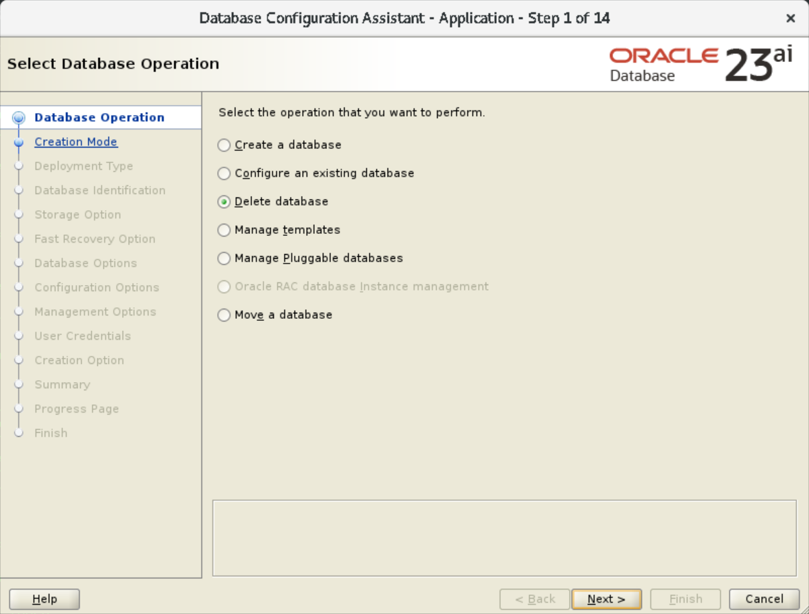
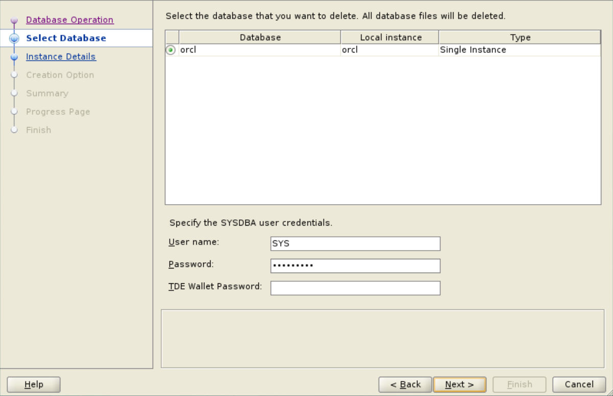
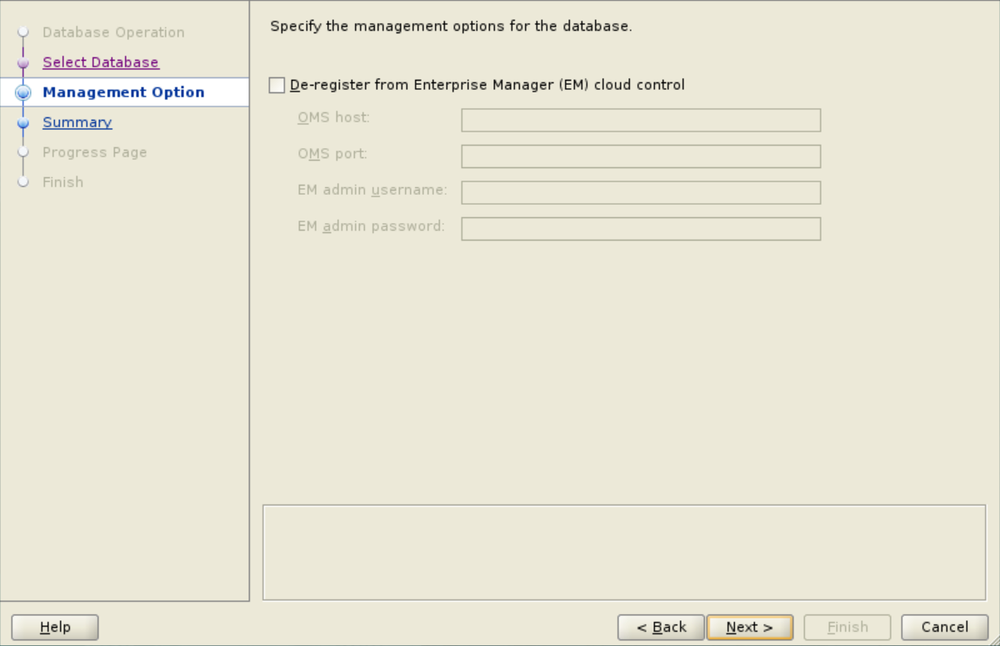
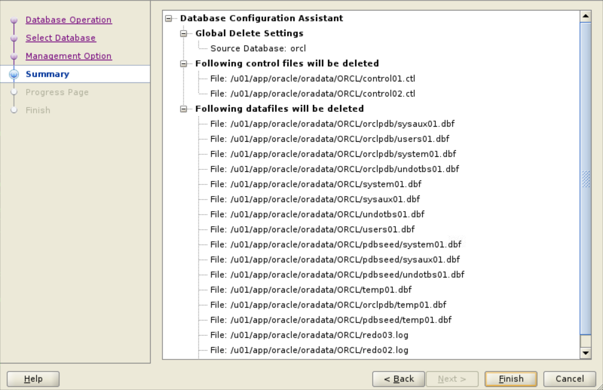
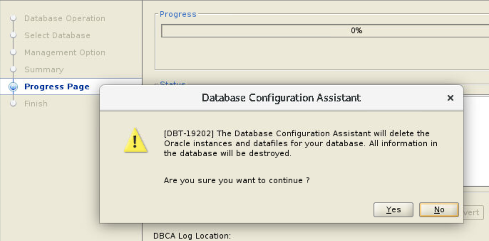
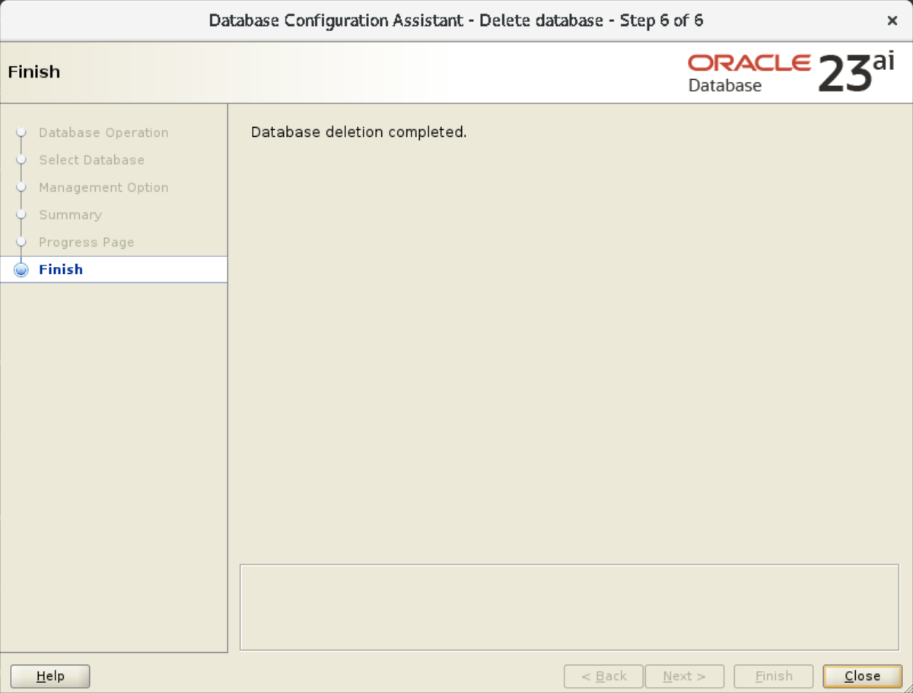

# Delete an Oracle Database

## Introduction

This lab provides the steps for deleting an Oracle Database from your host. You will delete only the database keeping the database software, Oracle home, and the inventory intact. You will use the Oracle Database Configuration Assistant (Oracle DBCA) tool for this purpose. 

Estimated time: 10 minutes

### Objectives

 - Check existing databases
 - Delete an Oracle Database using Oracle DBCA
 - Verify database removal

> **Note**: [](include:user-data)

### Prerequisites

This lab assumes you have -

 - An Oracle Cloud Account
 - Completed all previous labs successfully

You are logged in to your host as *oracle*, the user who can remove Oracle Database.

> **Note**: [](include:example-values)

## Task 1: Check existing databases

Before deleting a database, view the existing databases in your host.

1. Open a terminal window and run the following command.

    ```
	$ <copy>cat /etc/oratab</copy>
	```

	It returns information about the databases installed on your host. If you have additional databases on your host, then it display them also.

	```
	#


	# This file is used by ORACLE utilities.  It is created by root.sh
	# and updated by either Database Configuration Assistant while creating
	# a database or ASM Configuration Assistant while creating ASM instance.

	# A colon, ':', is used as the field terminator.  A new line terminates
	# the entry.  Lines beginning with a pound sign, '#', are comments.
	#
	# Entries are of the form:
	#   $ORACLE_SID:$ORACLE_HOME:<N|Y>:
	#
	# The first and second fields are the system identifier and home
	# directory of the database respectively.  The third field indicates
	# to the dbstart utility that the database should , "Y", or should not,
	# "N", be brought up at system boot time.
	#
	# Multiple entries with the same $ORACLE_SID are not allowed.
	#
	#
	orcl:/u01/app/oracle/product/23.4.0/dbhome_1:N
	orcl1:/u01/app/oracle/product/23.4.0/dbhome_2:N
	```

1. Verify that the file displays entries for the databases and Oracle homes on your host.   
	For this task, the databases are *`orcl`* and *`orcl1`*.

## Task 2: Delete a database

In this task, you will delete the database, *orcl*, from Oracle home 1 using Oracle DBCA.

1. In the terminal window, go to the `bin` directory in Oracle home 1, where Oracle DBCA resides.   
	In the Livelabs environment, Oracle DBCA resides in the following directory.

    ```
	$ <copy>cd /u01/app/oracle/product/23.4.0/dbhome_1/bin</copy>
	```

1.  Run this command to start Oracle DBCA.  

    ```
	$ <copy>./dbca</copy>
	```

1. The Select Database Operation window opens and displays the operations that you can perform on the database.   
	For this task, select **Delete database** to start the deletion process, and click **Next**.

	

1. Oracle DBCA checks for all databases in the current Oracle home and displays them. You can select the database to delete from this list.   
	For this task, select the database to delete, for example *`orcl`*, if not already selected. 

	

	You must specify the database administrator user credentials for this database. 
	 - **User name**: The field displays the administrative user, *`SYS`*, by default
	 - **Password**: Enter the password, for example *`We!come1`*
	 - **TDE Wallet Password**: For this task, leave this blank   
		This option is applicable only if you enable Transparent Data Encryption (TDE) for your database and create a wallet. You can then specify the wallet password in this field. 

	Click **Next** to proceed. 

1. In the Management Options window, you can deregister the database from Oracle Enterprise Manager (EM).   
	For this lab, leave this option unselected and click **Next**.

	

	> **Note**: To deregister a database with EM, you require some details, such as OMS host name, port number, and the EM administrative credentials. However, instead of specifying in this window, you can log in to the EM console using a web browser and remove the database from managed targets. 

1. Before deleting the database, the Summary window displays the database configuration for final review. You can verify the details in this window.

	

	Click **Finish** to continue. 

1.	The Progress Page window displays a confirmation message before deleting the database. 

	> **Note**: Clicking **No** will cancel the delete operation and exit Oracle DBCA. For this task, do not select this option. 

	

	Click **Yes** in the message window to start deleting the database. Oracle DBCA proceeds with the delete operation. 

	

	On completion, Oracle DBCA displays the Finish window.

You have successfully deleted Oracle Database, *`orcl`*, from Oracle home 1. Click **Close** in the Finish window to exit Oracle DBCA. 

> **Note**: You can use Oracle DBCA to create new databases but that is not a part of this workshop.

## Task 3: Verify database removal

After deleting the database, verify that you have removed the database from the host.

1. Open a terminal window and run the following command.

    ```
	$ <copy>cat /etc/oratab</copy>
	```

	It returns the following information.

	```
	#


	# This file is used by ORACLE utilities.  It is created by root.sh
	# and updated by either Database Configuration Assistant while creating
	# a database or ASM Configuration Assistant while creating ASM instance.

	# A colon, ':', is used as the field terminator.  A new line terminates
	# the entry.  Lines beginning with a pound sign, '#', are comments.
	#
	# Entries are of the form:
	#   $ORACLE_SID:$ORACLE_HOME:<N|Y>:
	#
	# The first and second fields are the system identifier and home
	# directory of the database respectively.  The third field indicates
	# to the dbstart utility that the database should , "Y", or should not,
	# "N", be brought up at system boot time.
	#
	# Multiple entries with the same $ORACLE_SID are not allowed.
	#
	#
	orcl1:/u01/app/oracle/product/23.4.0/dbhome_2:N
	```

1. Verify that the file no longer displays the database, *`orcl`*, that you removed. For this lab, it contains only one entry, *`orcl1`*, in Oracle home 2.

In this lab, you checked the existing Oracle Databases on your host. You used Oracle DBCA to delete a database and also verified the removal of database from the host.

You may now **proceed to the next lab**.

## Acknowledgments

 - **Author** - Manish Garodia, Database User Assistance Development
 - **Contributors** - Prakash Jashnani, Subhash Chandra, Subrahmanyam Kodavaluru, Manisha Mati
 - **Last Updated By/Date** - Manish Garodia, October 2024
