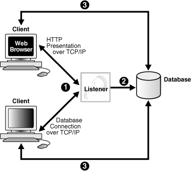
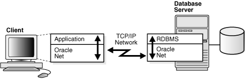

# Oracle Net Listener

## About this workshop

This workshop focuses on network configurations for your Oracle Database. It includes listener operations and administration.

Estimated workshop time: 1 hour

### What is a Listener?

**Oracle Net Listener (or Listener)** is a network service that runs on Oracle Database.

The primary role of a listener is to:
 - Manage connection requests between Oracle Database and clients
 - Manage network traffic

The default name of an Oracle listener is *LISTENER*.

 **Figure: Listener architecture**

### Objectives

This workshop helps you learn how to perform listener operations, such as: 
- view listener status and configuration
- start and stop the listener 
- access listener control utility

### Prerequisites

This lab assumes you have -

 - An Oracle Cloud account
 - Oracle Database installed

## About Listener configuration

After installing Oracle Database, you have a fully functional database with a client/server network environment. *Oracle Net* is a software layer that resides on the client and the database. It establishes and maintains the connection between client applications and the database over a network. 

> **Note**: Oracle Database connections use Oracle propriety SQLNet protocol that runs over industry standard TCP/IP. To view a list of all supported protocols, see [Learn more] (?lab=intro-configure-network#Learnmore).

 **Figure: Client/server application connection**

**Client**   
A client is an application that connects to Oracle Database to send and receive data. An Oracle Database client application resides on the host where the Oracle Database client software is installed.

**Service**   
The client application uses a *Service name* to identify an Oracle Database instance and connect to it. A service name is a logical representation of Oracle Database. A database can have one or more services associated with it.

For example, the listener status returns a service name *orcl* which represents an Oracle Database instance.

```
...
Service "orcl.us.oracle.com" has 1 instance(s).
  Instance "orcl", status READY, has 1 handler(s) for this service...
```

> **Note**: A single-instance Oracle Database can interface with a client as multiple services.

### Listener configuration file

The listener configuration is stored in a file, *listener.ora*, located in Oracle home under the `network/admin` subdirectory.  

The *listener.ora* file carries configuration parameters that determine the characteristics of the listener. The parameters include:

 - Name of the listener
 - Port of the listener
 - Protocol addresses that the listener can accept connection requests on
 - Valid nodes that can register with Oracle Database
 - Oracle Database services
 - Control parameters

The following example gives a glimpse of the `listener.ora` file. Here, the listener assumes the default name, *LISTENER*. 

```
...

LISTENER =
  (DESCRIPTION_LIST =
    (DESCRIPTION =
      (ADDRESS = (PROTOCOL = TCP)(HOST = localhost.us.oracle.com)(PORT = 1523))
      (ADDRESS = (PROTOCOL = IPC)(KEY = EXTPROC1523))
    )
  )

...
```

> **Tip**: You can configure multiple listeners, each with a unique name, in the same `listener.ora` file. However, Oracle recommends that you run only one listener for each node in a customer environment.

*Listener Registration (LREG)* is an instance background process that performs dynamic registration of services and databases with the listener.

### Client connections

The elements involved in client connections to Oracle Database are:

 - **Connect descriptors**   
   The client uses a connect descriptor to specify the Oracle Database to which it wants to connect. The connect descriptor contains a protocol and the Oracle Database service name.

 - **Connection requests**   
   Users start a connection request to Oracle Database using a connect string. The connect string contains a user name and password, and a connect identifier. The connect identifier can be the connect descriptor or a name that represents the connect descriptor.

 - **Naming methods**   
   While connecting to an Oracle Database service, the client application uses a resolution method, called the *naming method*. This method resolves the connect identifier to a connect descriptor.

The following example shows a connect descriptor that enables a client to connect to Oracle Database with the service name *orcl*. 

```
...

DESCRIPTION=
   (ADDRESS=(PROTOCOL=TCP)(HOST=localhost.us.oracle.com)(PORT=1523))
   (CONNECT_DATA=
      (SERVICE_NAME=orcl))
...
```

### Tools for network configuration

Oracle Net Services provide user interface tools and command-line utilities to configure, manage, and monitor the network.

 - **Oracle Net Configuration Assistant (NETCA)**
 - **Oracle Net Manager**

Oracle Enterprise Manager (EM) combines configuration functionality across multiple file systems, along with listener administrative control to provide an integrated environment for configuring and managing Oracle Net Services.

**About Oracle Net Configuration Assistant (NETCA)**   
Oracle Net Configuration Assistant (NETCA) is a standalone tool that helps you configure listeners and naming methods. 

While creating an Oracle Database using Oracle Database Configuration Assistant (Oracle DBCA) - 

 - In typical configuration, NETCA automatically configures a listener with a TCP/IP listening protocol address for the database. 
 - In advanced configuration, NETCA prompts you to specify a listener name and a port number of your choice.

Use NETCA for initial network configuration right after the database installation. Henceforth, you can use Oracle Net Manager to configure and administer your networks.

**About Oracle Net Manager**   
Oracle Net Manager provides configuration functionality for Oracle home on a local client or a server host. It offers built-in wizards and utilities to test connectivity, migrate data from one naming method to another, and create additional network components.

### Listener Control utility

The Listener Control utility helps you to administer listeners. You can use the Listener Control utility commands to perform basic management functions on one or more listeners. 

If you have multiple listeners running, then specify the listener name along with the command at the Listener Control utility prompt. 
 - If you omit the listener name in the command, then the utility uses the listener set with the command `SET CURRENT_LISTENER`. 
 - If you have not set the listener with this command, then the command uses the default listener, `LISTENER`.

When you administer a listener remotely, you can run all listener commands except `START`. The Listener Control utility can start the listener on the same system where the utility runs.

Click the next lab to **Get started**.

## Learn more

 - [Understanding Oracle Net Services](https://docs.oracle.com/en/database/oracle/oracle-database/23/netag/part-I-understanding-oracle-net-services.html)

 - [Oracle Database Component Port Numbers and Protocols](https://docs.oracle.com/en/database/oracle/oracle-database/23/ladbi/oracle-database-component-port-numbers-and-protocols.html)

## Acknowledgments

 - **Author** - Manish Garodia, Database User Assistance Development
 - **Contributors**: Binika Kumar, Bhaskar Mathur, Malai Stalin<if type="hidden">Suresh Rajan, Subhash Chandra, Dharma Sirnapalli, Subrahmanyam Kodavaluru</if>
 - **Last Updated By/Date** - Manish Garodia, August 2024
