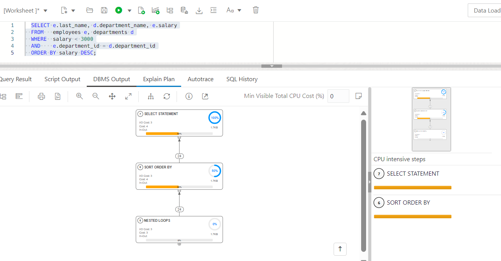
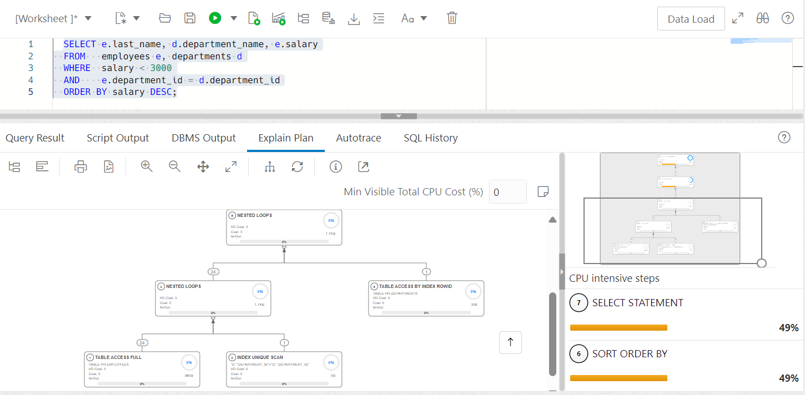

# Create Indexes and Views

## Introduction

This lab walks you through the steps to view and create schema objects such as indexes and views using Database Actions.

Estimated time: 20 minutes

### Objectives

Perform these tasks in your Oracle Database to manage schema objects from Oracle Database Actions:

-   View an existing index
-   Create a new index
-   Analysis of SQL Query performance with Indexing
-   View an existing view
-   Create a new view

### Prerequisites

This lab assumes you have-

-   An Oracle Cloud account
-   Completed all previous labs successfully
-   ORDS installed and configured
-   *HR* schema enabled to access Database Actions
-   Logged in to Oracle Database Actions in a web browser as *HR*

## Task 1: View indexes using Oracle Database Actions

You can view indexes for *HR* schema.

1.  Log in to Database Actions as *HR* if you are not logged in.  
    
2.  Click the **SQL** card. This opens the SQL page in Database Actions.
      
      
3.  In the Navigator tab, verify *HR* schema is selected from the first drop-down and select *Indexes* from the second drop-down list. The navigator pane displays the list of indexes of the selected schema HR.
      
      
4.  Select an index in the left pane. For this task, right-click *COUNTRY\_ C\_ ID\_PK* and select **Open** to view details about the index. The Columns page opens and it is to view the properties of each column in the index.
    

    The Columns page displays the following fields:
    
    -   INDEX_OWNER
    -   INDEX_NAME
    -   TABLE_OWNER
    -   TABLE_NAME
    -   COLUMN_NAME
    -   COLUMN_POSITION
    -   DESCEND  
          
5.  Click the **Details** tab to view additional information about the index.
    
    
    The Details page displays the fields. Some of them have been mentioned below: 
    
    -   CREATED
    -   LAST_DDL\_TIME
    -   OWNER
    -   INDEX_NAME
    -   INDEX_TYPE
    -   TABLE_OWNER
    -   TABLE_TYPE
    -   UNIQUENESS
    -   COMPRESSION
    -   PREFIX_LENGTH
    -   TABLESPACE_NAME  
          
6.  Click the **Statistics** tab.
      
    You can view statistical information about the index.  
    The values may differ depending on the system you are using.  
      
7.  Click the **Partition** tab.
    
    
    This page indicates whether the index is partitioned or not. You will view *No items to display* in the Partitions tab if an index is not partitioned.

Click **Close** at the bottom right to close the properties dialog box.

## Task 2: Create an index using Oracle Database Actions

In this task, you will create an index for *HR* schema.

1.  In the Navigator tab, click the three dots next to the search field and select **Create Object** from the submenu.
    
    
    This opens the Index Properties dialog box.  
    
2.  In the Definition page of the Index Properties dialog box specify the following fields.
    
    -   **Schema:** *HR*. This is the database schema that owns the table associated with the index.   
    -   **Table:** *COUNTRIES*. This is the table associated with the index.    
    -   **Tablespace:** *SYSTEM*. This is the tablespace for the index.
    -   **Name:** *COUNTRY_IX*. This is the name of the index.   
    -   **Type:** *Non-Unique*. This is the type of index which can consist of multiple identical values.

    
    
    In the Columns tab, click the Columns you wish to select for the index from the list of columns available in the table. For this task, select all the columns.  
    You can specify a column expression in the Expression tab of the Definition page.  
      
3.  Click the **DDL** tab of the Index Properties dialog box to review the SQL statements generated while creating the index. Navigate to the Definition tab to make changes to the properties of the index.
      
    
4.  Click **Create**.  
    The Output page displays the generated DDL commands.  
         
    
5.  Click **Close**. 
      
      
    The Database Actions tool creates a new index named *NEW_INDEX* that appears in the list of indexes for the *HR* schema.

> **Note:** To edit an Index, navigate to the Index Properties dialog box. Make the changes in the Definition page and in the DDL page, the UPDATE tab is to view the generated ALTER statements. Click **Apply**.

## Task 3: Analyze SQL query performance with indexing

This task will give information on how a SQL Query performs before and after creating an index based on Elapsed time. This task will also guide you on how to view the Execution plan after creating an index

An execution plan is basically the sequence of operations that the database performs to run a SQL statement.

1.  In the Navigator tab, verify the **HR** schema is selected and then select **Tables** from the second drop-down list.  
    
2.  First, verify the Elapsed time before creating an index using the following code.
    
    ```
    <copy>
      SELECT e.last_name, d.department_name, e.salary
      FROM   employees e, departments d
      WHERE  salary < 3000
      AND    e.department_id = d.department_id
      ORDER BY salary DESC;
      </copy>
    ```
    It displays the following output.    
      
    
3.  Second, to check the plan output, click the Explain Plan icon  

    It displays the following output.  
      
      
4.  Next, create an index. Select **Indexes** from the second drop-down list. Select **Create Object** from the submenu. Then, select **DEPARTMENTS** from the Table drop-down. Change the name of the index to DEPARTMENT\_IX. Next is to select columns **DEPARTMENT\_NAME** and **DEPARTMENT\_ID**. Click **Create**.  
      
    You will be able to view a message "Index HR.DEPARTEMENT\_IX created." in the Output tab.  
      
5.  From the Navigator tab, select **Tables** from the second drop-down list. Run the below code in the editor.
    
    ```
    <copy>
      SELECT e.last_name, d.department_name, e.salary
      FROM   employees e, departments d
      WHERE  salary < 3000
      AND    e.department_id = d.department_id
      ORDER BY salary DESC;
      </copy>
    ```
    
    It displays the following output.  
      
    You can see the Elapsed time had marginally decreased after creating an index.  
    
6.  Next, check the plan output by clicking the Explain Plan icon . To view the expanded version, click Expand All icon 

    It displays the following output.  
    
    
As you can see after creating an index, the SQL Query performs better by fetching the script output in less amount of time.

## Task 4: See a view

You can see all the existing views in your database. In this lab, you will use the *HR* schema to achieve this task.

1.  In the Navigator tab, verify the **HR** schema is selected and then select **Views** from the second drop-down list.

    This displays the list of views of the selected schema HR.  
    
2.  To open and view the properties of the existing view, right-click a view object and select **Open**. 
      
    
3.  Check the details of the view in the dialog box.  
      
    
    The different tabs in the dialog are as follows:  
    
    -   **Columns:** ~You can view all the columns of the view~ This displays the columns in the view.   
    -   **Data:** This displays the data in the view. You can insert a new row in this page. Double click a cell to fill in the values of the row you insert.   
    -   **Grants:** This displays the roles you grant for the selected view.   
    -   **Dependencies:** This displays the dependency information of all the tables used in the selected view.   
    -   **Details:** This displays information like the Creation date, owner of the view, Name of the view, the SQL statement you use to create the view.   
    -   **Triggers:** This displays the trigger actions you used to update the tables underlying the view.   
    -   **Errors:** This displays the errors if there are any. 

Click **Close** at the bottom right to close the properties dialog box.

## Task 5: Create a View

You can create a view for the *HR* Schema.

1.  In the Navigator tab, select **HR** schema from the first drop-down and select **Views** from the second drop-down list if not already selected.  
    
2.  Click the Object submenu (three vertical dots next to Search field) and select **Create Object**.

       > Note: To create a view from an existing template for a selected schema, in the Navigator tab, select the view to create from, right-click and select **Use as Template**.

       
       A View Properties dialog box opens.  
    
3.  Specify the following field values:
    
    **Schema:** *HR*. This is the schema where you create your view.
    **Name:** *MGR\_100\_EMPS*. This is the name of the view.
    
    In the SQL Query pane, enter the following:
    ```
    <copy>
    SELECT * FROM hr.employees WHERE manager_id = 100
    </copy>
    ```
    
4.  Click the **Create** button to create a view.  
    
    
    You will see a successful creation of view message.
      
      
5.  Click **Close**.  
    
    
    The Database Actions tool creates a new view named *MGR_100_EMPS* that appears in the list of views for the *HR* schema.
    
> **Note:** To edit a View, navigate to the View Properties dialog box. Make the changes in the SQL Query page and in the DDL page, the UPDATE tab is to view the generated ALTER statements. Click **Apply**.

You may now **proceed to the next lab**.

## Acknowledgments

-   **Author** - Aayushi Arora, Database User Assistance Development Team
-   **Contributors** - Jeff Smith, Manish Garodia, Manisha Mati
-   **Last Updated By/Date** - Aayushi Arora, October 2024