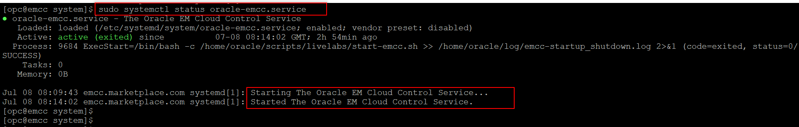
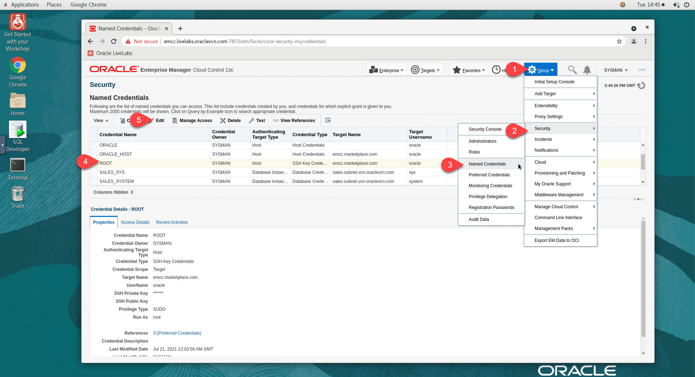
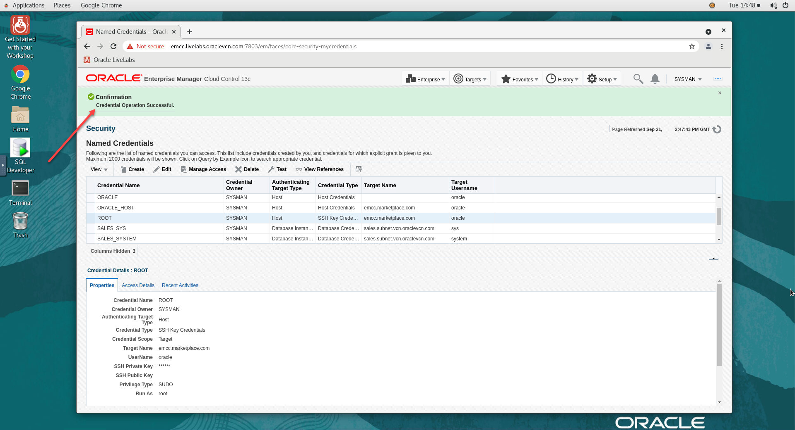
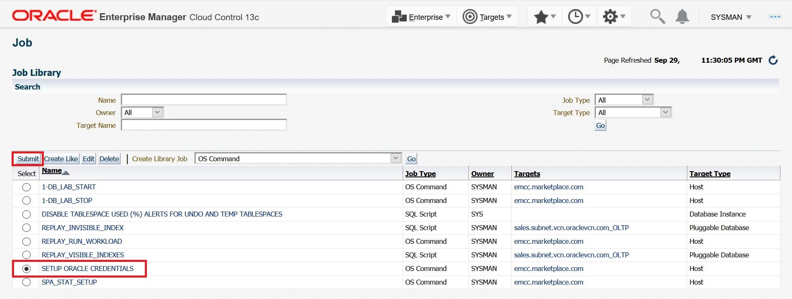
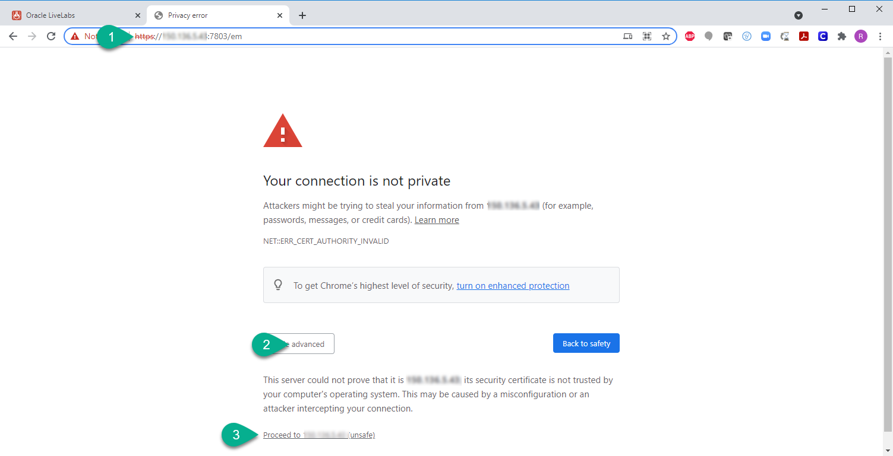

# Initialize environment

## Introduction

This lab helps you start and administer the components and services required for this workshop. 

**Background**   
When you establish a remote desktop session, check the environment and verify that the dependent processes are up and running. After instance provisioning, it takes around 15 minutes for all processes and services to start. If a component is not running, you can start it manually as explained in this lab. 

Estimated time: 10 minutes

### Objectives

 - Ensure that the following are running:
	- Database Listener
		- *LISTENER*
		- *LISTENER_1522*
	- Oracle Database Instance
        - *emrep*
        - *db19c*
		- *orcl*
    - Oracle Enterprise Manager (EM) - Management server (OMS)
    - Oracle Enterprise Manager - Management Agent (emagent)

 - Log in to Oracle Enterprise Manager in a web browser.

### Prerequisites

This lab assumes you have -
 - An Oracle Cloud account
 - Oracle Enterprise Manager installed on your system

## Task 1: Verify that the dependent components are running

In this task, you will verify that the required components, such as Listeners, Oracle Databases, and Oracle Enterprise Manager, are running on the host. 

1. 	Verify that the listener service, *oracle-db-listener*, is running.

    ```
    $ <copy>sudo systemctl status oracle-db-listener</copy>
    ```

    

	The status *active* indicates that the listener service is running. If the listener service is not running, you can restart it with the following command. 

    ```
    $ <copy>sudo systemctl restart oracle-db-listener</copy>
    ```

1. 	Verify that the Oracle Database service, *oracle-database*, is running.

    ```
    $ <copy>sudo systemctl status oracle-database</copy>
    ```

    

    

	The status *active* indicates that the database service is running. If the database service is not running, you can restart it with the following command. 

    ```
    $ <copy>sudo systemctl restart oracle-database</copy>
    ```

1. 	Verify that EM services, *OMS* and *emagent*, are running.

    ```
    $ <copy>sudo systemctl status oracle-emcc</copy>
    ```

    

	> **Note**: You can access the Oracle Enterprise Manager login page in a web browser only if OMS and emagent services are running. 

	The status *active* indicates that these services are running. If the services are not running, you can restart them with the following command. 

    ```
    $ <copy>sudo systemctl restart oracle-emcc</copy>
    ```

1. Validate *emcli* connectivity. From the terminal session on your remote desktop, run as user *oracle*.

    ```
    <copy>
    . ~/.occ_oms.sh
    emcli login -username=sysman -password=welcome1
    </copy>
    ```

If the dependent components are running, you can access the Oracle Enterprise Manager login page in a web browser.

## Task 2: Log in to Oracle Enterprise Manager

In this task, you will log in to the Oracle Enterprise Manager using a web browser. 

If you have reserved a Livelabs environment, then the remote desktop session will have a web browser open and display the *Oracle Enterprise Manager* login page. If it does not display the EM login page, you can access it as follows. 

1. Open a web browser and go to the Oracle Enterprise Manager login URL.   
	For this lab, the login URL is:

	```
	<copy>http://oms1:7803/em</copy>
	```

1. Specify the user credentials for Oracle Enterprise Manager. 

    

	For this lab, the credentials are:

	- **Username**: *sysman*
	- **Password**: *welcome1*

	Click **Login** to sign into the Oracle Enterprise Manager console. 

    

On successful login, the browser displays the EM landing page. Your environment is now ready. 

## Task 3: Generate SSH keys

In this task, you will generate a public-private key pair required for system authentication. 

1. From your remote desktop session, open a terminal window and run the following to generate the key pair.

    ```
    <copy>
    cd ~
    ssh-keygen -b 2048 -t rsa
    </copy>
    ```

1. Accept defaults for file and passphrase by pressing *Enter* three times to create a key with no passphrase.

    

1.  Update *`~/.ssh/authorized_keys`* and copy the *private key* to */tmp*.

    ```
    <copy>
    cd .ssh
    cat id_rsa >/tmp/rsa_priv
    cat id_rsa.pub >>authorized_keys
    </copy>
    ```

    

You can use the keys to setup Named Credentials in Oracle Enterprise Manager.

## Task 4: Set up Named Credentials with the new SSH Keys

In this task, you will use the SSH keys to set up Named Credentials in Oracle Enterprise Manager. 

1. From the EM Console as *SYSMAN*, navigate to **Setup menu** &gt; **Security** &gt; **Named Credentials**. Select the *ROOT* credential and click **Edit**.

    

1. Keep the General Properties unchanged and update the **Credential Properties** section as follows:

    - **User name**: *oracle*
    - Delete any content from the **SSH Public Key** textbox
    - Click **Choose File** to select the *Public Key* `id_rsa.pub`. If you cannot see the *.ssh* directory, you can click *.livelabs* and then go to *oracle* to access the *.ssh* folder.

    

1. For **SSH Private Key**, on the file browser navigate to **+Other Locations** &gt; **tmp** and select the file *rsa_priv*.

    

1. Click *Test and Save*

    

1. Setup Oracle Named Credentials using Job System. This will set up the user oracle password on the host and update the Named Credentials used in this workshop.   
	Navigate to **Enterprise** &gt; **Job** &gt; **Library**, select *SETUP ORACLE CREDENTIALS*, and click **Submit**.

    

1. Click **Submit** again on the Job submission Page.

    

1. The job will be submitted successfully. Click on *SETUP ORACLE CREDENTIALS* job link to view the job.

    

1. The Job should show Status **Succeeded**.

    

You can use the Named Credentials to log in to your host.

## Appendix 1: Managing startup services

You can manage the startup services using various options, for example, start, stop, restart, and status.

1. Database services (All databases and Standard Listener)

    - Start

		```
		<copy>sudo systemctl start oracle-database</copy>
		```

    - Stop

		```
		<copy>sudo systemctl stop oracle-database</copy>
		```

    - Restart

		```
		<copy>sudo systemctl restart oracle-database</copy>
		```

    - Status

		```
		<copy>sudo systemctl status oracle-database</copy>
		```

1. Listener Service (Non-Standard Listener)

    - Start

		```
		<copy>sudo systemctl start oracle-db-listener</copy>
		```

    - Stop

		```
		<copy>sudo systemctl stop oracle-db-listener</copy>
		```

    - Restart

		```
		<copy>sudo systemctl restart oracle-db-listener</copy>
		```

    - Status

		```
		<copy>sudo systemctl status oracle-db-listener</copy>
		```

1. Enterprise Manager Services (OMS and emagent)

    - Start

		```
		<copy>sudo systemctl start oracle-emcc</copy>
		```

    - Stop

		```
		<copy>sudo systemctl stop oracle-emcc</copy>
		```

    - Restart

		```
		<copy>sudo systemctl restart oracle-emcc</copy>
		```

    - Status

		```
		<copy>sudo systemctl status oracle-emcc</copy>
		```

## Appendix 2: External Web Access

You have an option to log in to Oracle Enterprise Manager from a location outside your remote desktop session, for example, a workstation or laptop. 

1. Open a web browser and go to the Oracle Enterprise Manager login page. An EM login URL contains the following: 

    ```
    http://[Your instance public IP]:7803/em
    ```

1. Specify the user credentials for Oracle Enterprise Manager. For this lab, the credentials are:

	- **Username**: *sysman*
	- **Password**: *welcome1*

	Click **Login** to sign in to the Oracle Enterprise Manager console. 

     > **Note**: You may see an error on the browser while accessing the web console - “*Your connection is not private*”. 

    

	You can ignore the warning and add the exception to proceed.

    

You may now **proceed to the next lab**.

## Acknowledgments

 - **Author**: Manish Garodia, Database User Assistance Development
 - **Contributors**: Aayushi Arora, Manisha Mati, Rene Fontcha
 - **Last Updated By/Date**: Manish Garodia, October 2024
