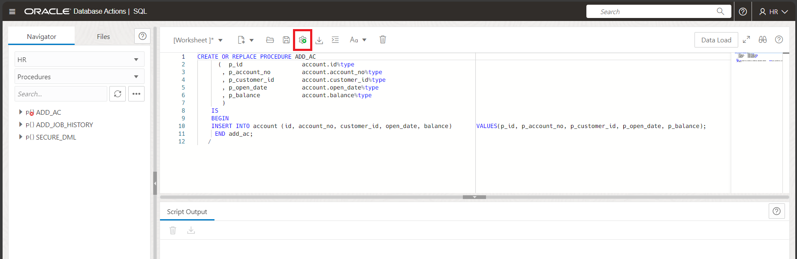

# Manage Program code stored in Oracle Database

## Introduction

In this lab you will use Database Actions to validate invalid Schema objects. You will create a new PL/SQL procedure and change the table referenced in the procedure. As a database administrator (DBA), you may be asked to revalidate schema objects that have become invalid. Schema objects (such as triggers, procedures, or views) can be invalidated when changes are made to objects on which they depend. For example, if a PL/SQL procedure contains a query on a table and you modify table columns that are referenced in the query, then the PL/SQL procedure becomes invalid. You revalidate schema objects by compiling them.

Estimated time: 30 minutes

### Objectives

-   Create a new PL/SQL procedure   
-   Make the object invalid manually fix the invalid schema objects

### Prerequisites

This lab assumes you have-

-   An Oracle Cloud account
-   Completed all previous labs successfully
-   ORDS installed and configured
-   *HR* schema enabled to access Database Actions
-   Logged in to Oracle Database Actions in a web browser as *HR*

## Task 1: Create a PL/SQL procedure 

You can create a new procedure in your Oracle Database using Database Actions. 

1.  In the Navigator tab, verify **HR** schema from the first drop-down is selected and then select Procedures from the second drop-down list.
    
    
2.  Open the PL/SQL editor.  
      
      
3.  Execute the following script to create a new procedure named *`ADD_AC`*. This procedure creates a new procedure named *`ADD_AC`*. 
    
    ```
    <copy>
    CREATE OR REPLACE PROCEDURE ADD_AC
          (  p_id                 account.id%type
           , p_account_no         account.account_no%type
           , p_customer_id        account.customer_id%type
           , p_open_date          account.open_date%type
           , p_balance            account.balance%type                                                        
           )                                                                                                        
        IS
        BEGIN                                                                                                         
        INSERT INTO account (id, account_no, customer_id, open_date, balance)       VALUES(p_id, p_account_no, p_customer_id, p_open_date, p_balance);                                                                                       
         END add_ac;     
       /
       </copy>
    ```
    
4.  Click the compile icon in the SQL toolbar to compile the procedure.
      
    
5.  The Script Output of the output pane displays the following result.
    
    ```
    Procedure ADD_AC compiled
    Elapsed: 00:00:00.037
    ```

    You can view the newly compiled procedure in the list of procedures in the navigator tab for HR schema.  
    

## Task 2: Validate invalid schema objects in the procedure   

To understand more about procedures, you will now remove a column from the table ACOUNT referenced in the ADD_AC procedure. 
 
In the Navigator tab of the **HR** schema, select **Tables** from the second drop-down list. You can view a list of tables associated with the HR schema.

1.  Select *ACCOUNT* table and right click to select **Edit**.
    
    This opens the Table properties dialog box of the *`ACCOUNT`* table.  
    
2.  Verify the Columns tab is selected in the dialog box.
      
      
3.  Click the **`BALANCE`** column and rename it to **`LEFTOVER`**.
      
    
4.  Click **Apply**.
    
    You will view an alter table message in the Output page of the dialog box after the BALANCE column is renamed.  
       
      
    You now have ADD_AC procedure in your database that is invalid.
    
    You will now check for invalid objects and perform the following steps to validate the invalid procedure *`ADD_AC`*.
    
5.  Click the **Selector Icon** to go to the Overview page and then select **Overview**.
      
    
6.  Verify the Invalid Objects widget displays the *`ADD_AC`* procedure.
    
    
    The status of the procedure is shown as INVALID.

7.  Click the **Selector Icon** and select **SQL** under Development.  
      
8.  In Navigator tab, verify **HR** schema is selected from the drop-down and select **Procedures** from the Object type drop-down list.
    
    You can view a list of procedures associated with the HR schema.  
    
9.  Click the *`ADD_AC`* procedure. 
      
      
    > **Note**: The red cross on the procedure indicates that the SQL statement did not compile due to some error.  
    
10.  Right-click the procedure and select **Open**. 
    
    You can view the SQL statements of the procedure in SQL editor.  
    
11.  Click the **Compile** icon in the SQL toolbar to compile the procedure.
      
    
12.  The Script Output displays the following result.
    
    The result clearly means that the component BALANCE must be declared to validate the *`ADD_AC`* procedure.  
    
13.  From the Navigator tab of the *HR* schema, select **Tables** from the second drop-down list.  
    
14.  Select *`ACCOUNT`* table and right-click to select **Edit**.
    
    This opens the Table properties dialog box of the *`ACCOUNT`* table.  
      
15.  Verify the Columns tab of the dialog box is selected and rename the column name *`LEFTOVER`* back to *`BALANCE`*.
      
    
16.  Select **Procedures** from the Object type drop-down list. Then execute the script used to create new procedure ADD_AC again. Refresh the page and the status is back to VALID and red cross mark has disappeared.
    
    > **Note:** It is not always possible to make an object valid by recompiling it. You may have to take remedial actions first. For example, if a view becomes invalid because a table that it references is deleted, then compiling the view produces an error message that indicates that the table does not exist. You cannot validate the view until you re-create the table.
    
Congratulations! You have successfully completed this workshop on *Schema Objects management in Oracle Database*.
    
In this workshop, you not only learned ways to create tables, views and indexes but also how to load data into the new table. You also created a new PL/SQL procedure. You invalidated the procedure by removing a column from a table referenced in the procedure. You validated the procedure by adding the removed column back into the table and checked for its status. 
    

## Acknowledgments

-   **Author** - Aayushi Arora, Database User Assistance Development team
-   **Contributors** - Jeff Smith, Manish Garodia, Manisha Mati
-   **Last Updated By/Date** - Aayushi Arora, October 2024