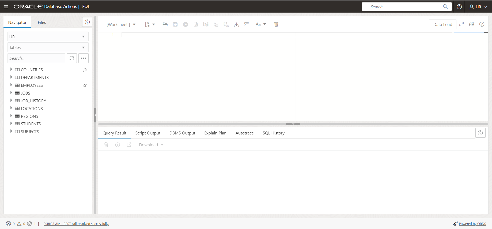
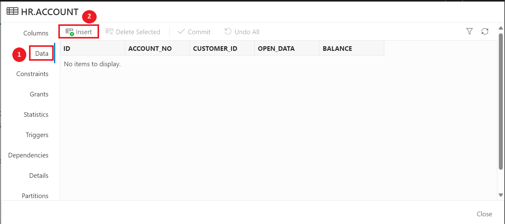
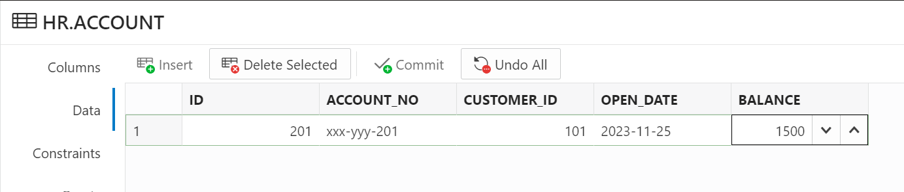
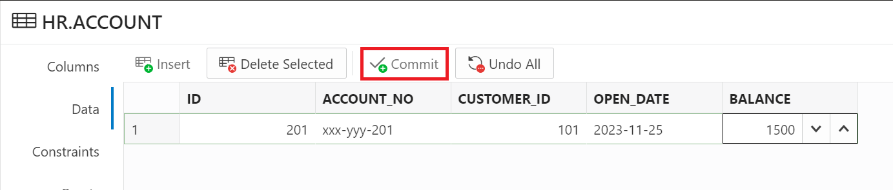
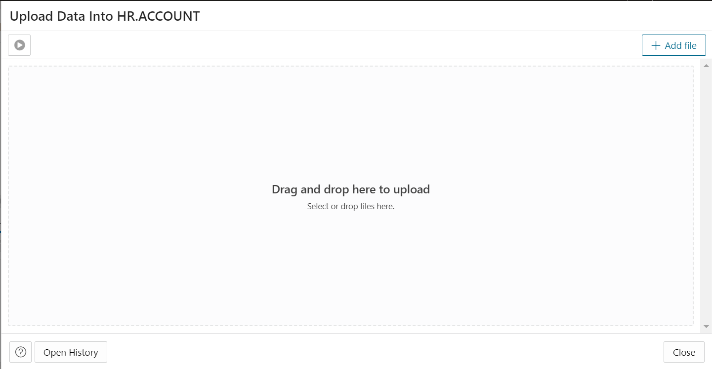
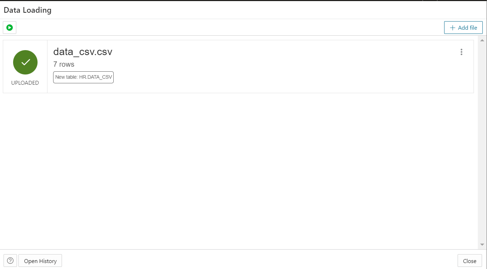
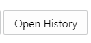
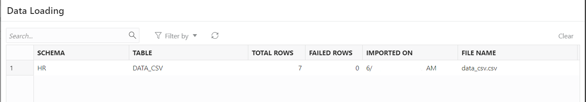

# Manage Tables

## Introduction

In this lab, you will use Database Actions to view table definitions and table data in Oracle Database. You will also learn to create a new table and load data into the new table.

Estimated time: 20 minutes

### Objective

Perform these tasks in your Oracle Database from Oracle Database Actions:

-   View an existing table
-   Create a new table
-   Load data into the table

### Prerequisites

This lab assumes you have-

-   An Oracle Cloud account
-   Completed all previous labs successfully
-   ORDS installed and configured
-   *HR* schema enabled to access Database Actions
-   Logged in to Oracle Database Actions in a web browser as *HR*

## Task 1: View existing table in your schema

In this task, you will view the existing tables in the HR schema in your Autonomous Database using Oracle Database Actions.

1.  Log in to Database Actions as *HR* if you are not logged in.

2.  Click the **SQL** card under Development. This opens the SQL page in Database Action.
    
    
    Alternatively, click the **Selector Icon**  and under Development section click **SQL**. The SQL page appears. 
    
    > **Note:** If this is your first time accessing the SQL Worksheet, click the binocular icon at the top-right to access hopscotch tour. Click the "**X**" in the tour window to quit the tour.

3.  In the Navigator tab, verify schema selected is *HR* from the first drop-down list and *Tables* from the second drop-down list.
    
    The navigator pane displays the list of tables of the selected schema HR.

4.  Right-click one of the tables, for this task, *COUNTRIES* and select **OPEN**.
    
    
    This option opens a window that displays the properties of the selected table. The properties window displays information for the following properties of the table:

    -   Columns
    -   Data
    -   Constraints
    -   Grants
    -   Statistics
    -   Triggers
    -   Dependencies
    -   Details
    -   Partitions
    -   Indexes

5.  Look at the Columns tab from the properties window to view the column names and their definitions.
    
    The values may differ depending on the system you are using.

6. Select the **Data** tab from the properties window to view the data stored in COUNTRIES.
  
  The values may differ depending on the system you are using.

Click **Close** at the bottom-right to close the properties dialog box.

## Task 2: Create a new table

You can create a new table and insert data in your Oracle Database using the SQL card in the Database Actions. The GUI enables you to create, insert and update data in few clicks.

1.  In the Navigator tab, click the three dots next to the search field and select **Create Object** from the submenu.
    
    This opens a dialog  box.
    

2.  Enter the name of the table in the *Name* field. Click on the **Add Column** icon to add a new column.
    

    - Name - *Account*
    - Column 1 - *id*
    - Column 2 - *account_no*
    - Column 3 - *customer_id*
    - Column 4 - *open_date*
    - Column 5 - *balance*
    
    Also add the corresponding datatype from the dropdown for all the columns.

3.  Click the **Constraints** tab. Tick the checkbox in front of the *id* column.
    

4.  Click the Primary Key tab, enter Name as ACCOUNT_PK. Move the id column to the Selected Columns.
    
    Keep the other details as it is.

5.  Click **Create**. Next, click **Apply**.
    

6.  Refresh the page. You can see the new table in the Navigator tab.
    

7.  To insert data in the new table, right-click on the ACCOUNT table. Click **Open**.
    

8.  Click the **Data** tab. Click **Insert**.
    

9.  Insert data as follows:

    - ID: *201*
    - ACCOUNT_NO: *xxx-yyy-201*
    - CUSTOMER_ID: *101*
    - OPEN_DATE: *2023-11-25*
    - BALANCE: *1500*
    

10. Click **Commit**.
    

11. You will get the below notification on your screen.
    

12. Run the select statement and check the Query Result.
    

## Task 3: Load data from a file to an existing table

You can load data from a file to an existing table named *ACCOUNT*.

1.  In the Navigator tab, right-click the ACCOUNT table.

2.  Click **Data Loading** and select **Upload Data**.
    
    An Upload Data into HR.ACCOUNT dialog box appears.

3.  Drag and drop the file that contains data, which you want to load into the table. You can also click **Add File** to browse for the file in your system and upload it. 
    
    
    > **Note:** The file formats that you can load are CSV, XLS, XLSX, TSV, TXT, XML, JSON, and AVRO. 

4.  Verify the file name after adding the file in the Upload Data Into HR.ACCOUNT dialog box.
    

    > **Note**: This lab provides a CSV file with dummy data to upload into your database for learning purpose.

5.  Click the file name to open the Details page.
    -   **Column names:** Select **Get from file** to display column headers in the first row.
    -   **Encoding:** You can view the *UTF-8* value from the drop-down. This is the default value. 
    -   **Text enclosure** and **Field delimiter**: Enter " (single quote) in the Text enclosure field and ","(comma) in the Field delimiter field. These options are visible only when the selected file is in plain text format (CSV, TSV, or TXT).
    -   **Rows to skip:** Select the number of rows to skip. For example, *0*.
    -   **Preview size:** Select the number of rows to preview. For example, *100*.
    -   **Limit rows to upload:** This check box is to specify the number of rows to load. For this task, do not select this check box.
        

6.  Click **Next** to progress to the Target tab of the dialog box. For each Source column, select the value from the drop-down in the Target column.
    For this task, select the following values from Target column.
    -   COL1: Select *ID*
    -   COL2: Select *ACCOUNT_NO*
    -   COL3: Select *CUSTOMER_ID*
    -   COL4: Select *OPEN_DATE*
    -   COL5: Select *BALANCE*
    
    The values differ depending on the file you have uploaded.

7.  Click **Upload File** to load the selected data. It will direct you back to the Upload Data Into HR.ACCOUNT dialog box.
    

8.  When the status changes from PENDING to UPLOADED the data file has been uploaded successfully.
    
    After the data upload process is complete, an entry is added to the log with the status.

9.  To view the log status, click the **Open History** button present in the bottom-left corner of the dialog box.
    
    The subsequent table is displayed.
    
    The values may differ depending on the system you are using.

You can also view the summary of the data uploaded from the SQL main window. Right-click the ACCOUNT table in the Navigator tab, click **Data Loading** and select **History** to view the summary of the data upload. You can view the total number of rows that fail if the data file fails to upload.

You may now **proceed to the next lab**.

## Acknowledgments

- **Author** - Aayushi Arora, Database User Assistance Development Team
- **Contributors** - Jeff Smith, Manish Garodia, Manisha Mati
- **Last Updated By/Date** - Aayushi Arora, October 2024