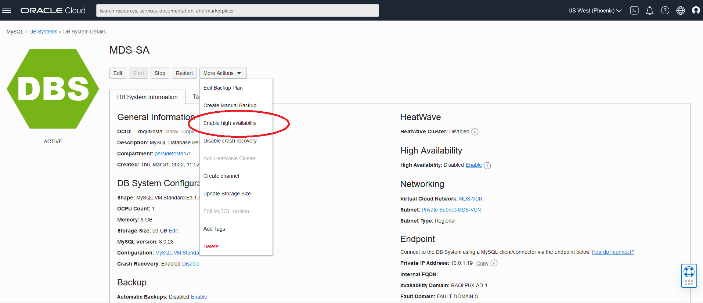
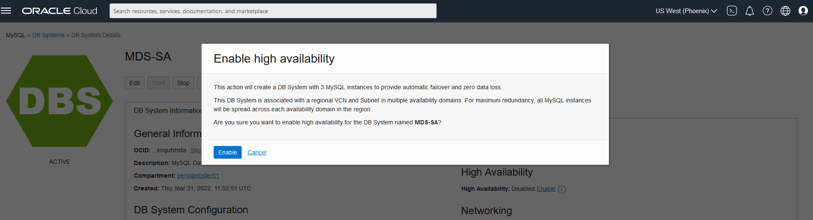
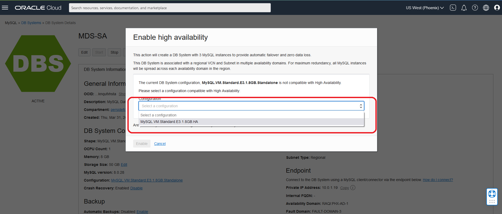
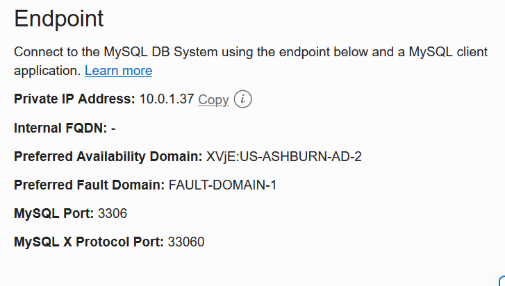
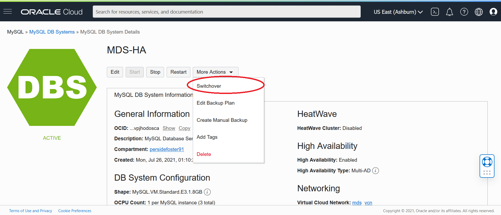
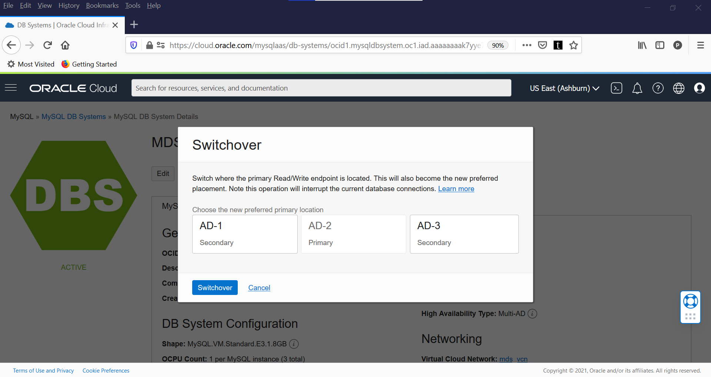
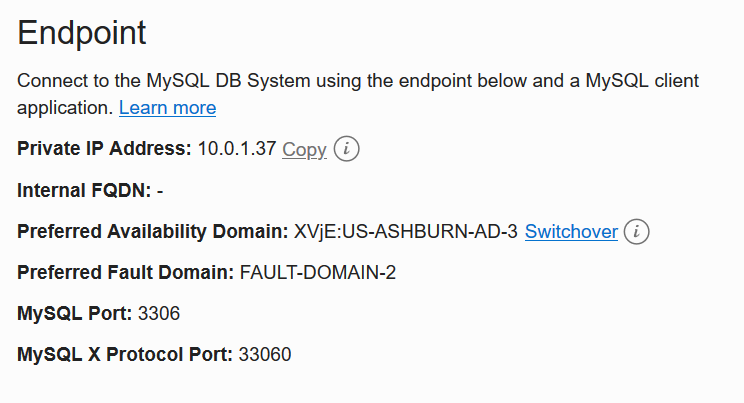

# Connect to Standalone and High Availability Db Systems

## Introduction

We will use Oracle Database Development Tools to access the HeatWave Databases;  

_Estimated Lab Time:_ 30 minutes


### Objectives


### Prerequisites

- An Oracle Trial or Paid Cloud Account
- Some Experience with MySQL Shell
- Must Complete Lab 3

## Task 1: Set up Oracle Database Development Tools Connections

In this lab, you will be guided through the following tasks:

- Setup  Vault
- Setup Secret
- Create private endpoin
- Create Connection
- Create Bastion 

1. USe Database Tools SQL Worksheet

   a. To display a list of databases, Enter the following command at the prompt:
    ````
    <copy>SHOW DATABASES;</copy>
    ````  

   b. To display the database version, current_date, and user enter the following command at the prompt:
      ````
    <copy>SELECT VERSION(), CURRENT_DATE, USER();</copy>
    ````  
   c. To display MySQL user and host from user table enter the following command at the prompt:
       ````
    <copy>SELECT USER, HOST FROM mysql.user;</copy>
      ````

## Task 2:  Launch MySQL Shell Download, unpack, Import the Sakila sample dataset

1. Download Sakila sample dataset

      ````
      <copy> https://downloads.mysql.com/docs/sakila-db.zip </copy>
      ````  

2. Unzip  Sakila Sample Dataset.

3. Connect to MDS-SA  using MySQL Shell

4. Import  Sakila schema 

      Select all from sakila-schema.sql and paste MySQL shell

5. Import  Sakila data.

      Select all from sakila-data.sql and paste MySQL shell

   a. List all of the databases

      ````
      <copy>show databases;</copy>
      ```` 
   
   b. Point to Sakila schema

      ````
      <copy> use sakila</copy>
       ```` 
   
   c. List Sakila tables

      ````
      <copy>show tables;</copy>
      ```` 
   d. Display Sakila  actors

      ````
      <copy>select * from sakila.actor limit 3;</copy>
      ```` 
   e. Display Sakila countries

      ````
      <copy>SELECT country_id, country from country WHERE country = 'Afghanistan' OR 'Bangladesh' OR 'China';</copy>
      ```` 

## Task 2: Convert Standalone database to High Availability database

Use the Console to enable or disable high availability on a DB system
   1. Open the navigation menu. Under Databases >MySQL > DB Systems
    

   2. Click the **MDS-SA** Standalone Dabase link

   3. Click the **More Actions** button

   4. Select **Enable high availability**
        

   5. Click the **Enable** button
           

   6. Select the HA-compatible configuration **MySQL.VM.Standard.E3.1.8GB.HA** and click Enable.
                 

      The configuration is updating. The DB System  will enter the UPDATING state. 

      The selected configuration will be applied to the DB System.

      The secondary instances will be  cloned from the primary instance. 

**This conversion will take a while Go to the next Lab and come back in 15 minutes** 

## Task 3: Switchover MySQL Database  High Availability

To switch from the current primary instance to one of the secondary instances, do the following:

1. Open the navigation menu  Database > MySQL > DB Systems
2. Choose **(root)** Compartment.
3. In the list of DB Systems, Click MDS-SA DB System to display the details page and do the following:
    * Save the current endpoint values for a before and after comparisson of the switch
      
    * Select Switchover from the More Actions menu. The Switchover dialog is displayed
        
    * Switch the PRimary from AD-1 to AD-2  
    * Click Switchover to begin the switch process.
      
    * The DB System's status changes to Updating, and the selected instance becomes the primary.
          

4. To view the new praimary database go back to **Task 4**

## Acknowledgements

- **Author** - Perside Foster, MySQL Solution Engineering

- **Contributors** - Mandy Pang, Principal Product Manager, Salil Pradhan, Principal Product Manager, Nick Mader, MySQL Global Channel Enablement & Strategy Manager
- **Last Updated By/Date** - Perside Foster, MySQL Solution Engineering, May 2022

