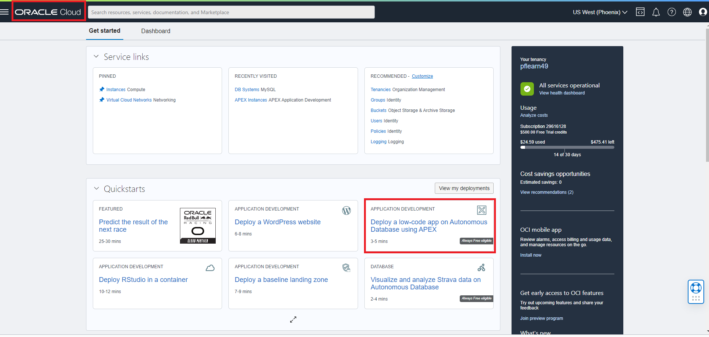
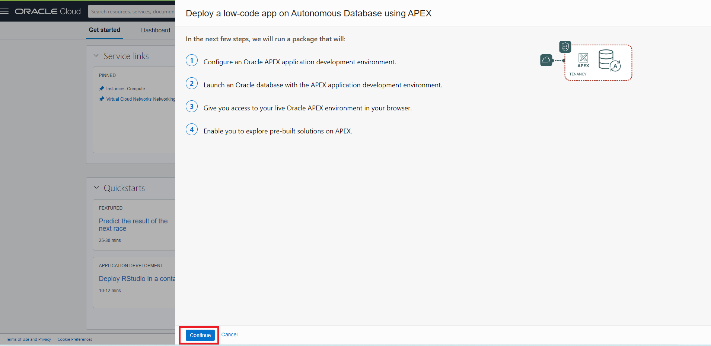
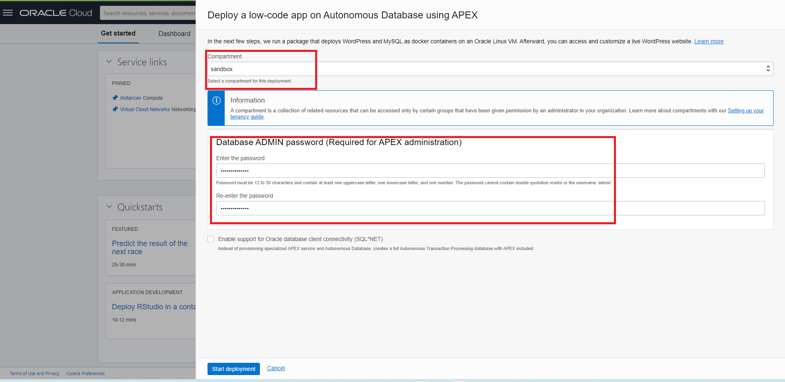
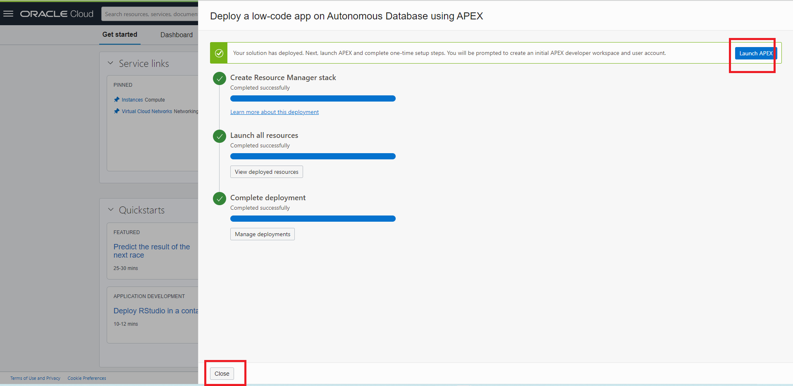
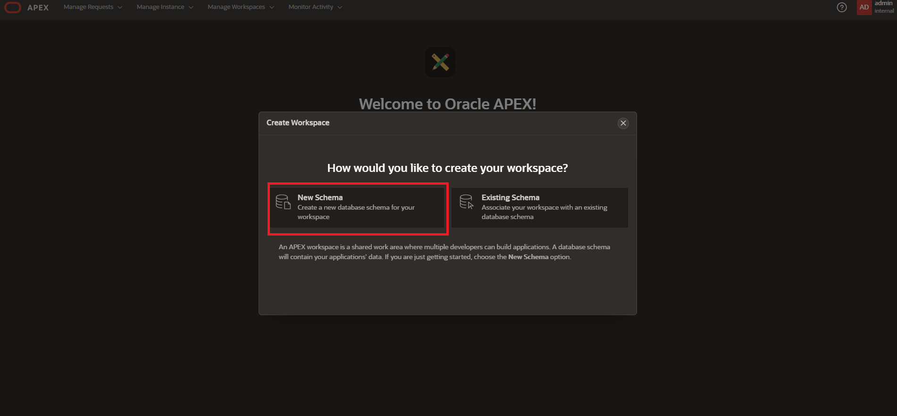
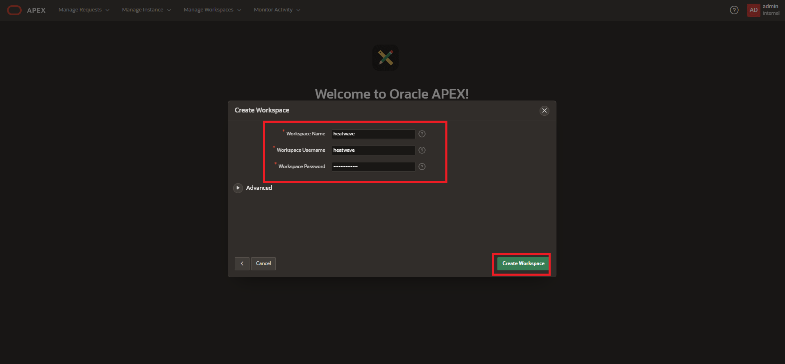
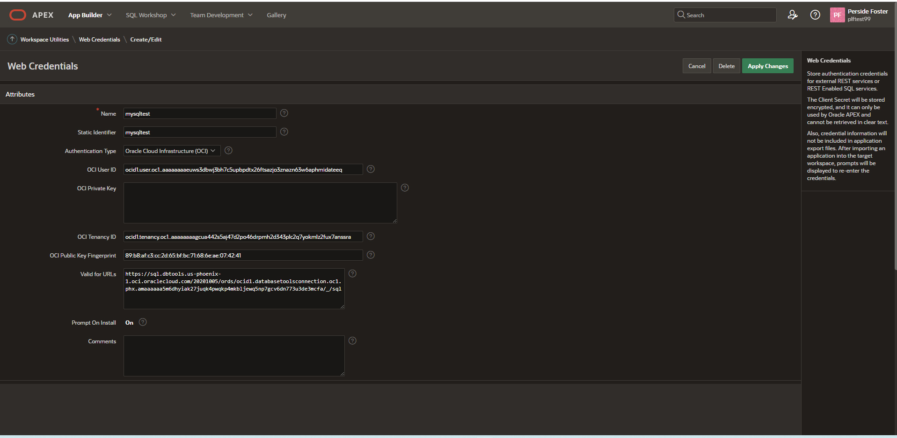
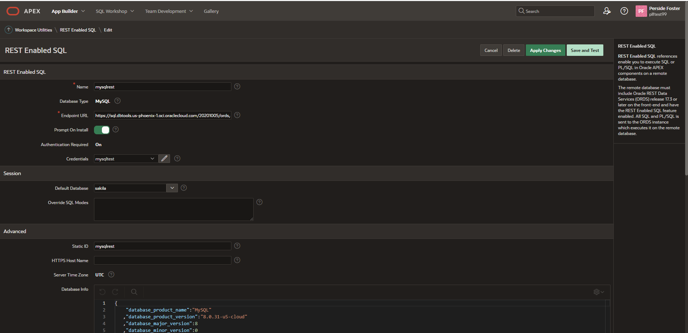

# Develop MySQL HeatWave Apps with Oracle APEX

## Introduction

The Oracle Database Development Tools team launched the Database Tools service in OCI providing instance web browser to create connections to the MySQL Database Service in OCI. 

Using APEX, developers can quickly develop and deploy compelling apps that solve real problems and provide immediate value. You don't need to be an expert in a vast array of technologies to deliver sophisticated solutions. Focus on solving the problem and let APEX take care of the rest.[https://apex.oracle.com/en/platform/why-oracle-apex/](https://apex.oracle.com/en/platform/why-oracle-apex/)

**Tasks Guide** 
[https://medium.com/oracledevs/get-insight-on-mysql-data-using-apex-22-1-7fe613c76ca5e](https://medium.com/oracledevs/get-insight-on-mysql-data-using-apex-22-1-7fe613c76ca5)

## Task 1 Setup MySQL Support in Database Tools in OCI

1. [https://peterobrien.blog/2022/06/15/](https://peterobrien.blog/2022/06/15/)

1. Menu: Identity & Security>  
    - Create Vault: **MDS-HW**
    - Create Key **MDS-HW**
    - Create Secret **MDS-HW**  Secret is admin login **password** 
2. Menu: Developer>Database Tools
    - Create Private Endpoints **MDS-HW**
3. Menu: Developer>Database Tools
    - Create Connection **MDS-HW**
4. Run SQL Worksheet

## Task 2 Set REST Enabled SQL Service URL
1. [https://peterobrien.blog/2022/06/15/how-to-use-the-oracle-database-tools-service-to-provide-data-to-apex/](https://peterobrien.blog/2022/06/15/how-to-use-the-oracle-database-tools-service-to-provide-data-to-apex/)

    **Note** The pattern is https://sql.dbtools.< region >.oci.oraclecloud.com/20201005/ords/< connection ocid >/_/sql
    **Example** https://sql.dbtools.us-ashburn-1.oci.oraclecloud.com/20201005/ords/ocid1.databasetoolsconnection.oc1.iad.amaaaaaao27h4wiamnbgbmuznwvg4nenu4j7nzbecnvpmzgs2fkgiugwueyq/_/sql
2. Set APEX Worspace Web Credentials
3. APEX REST Enabled SQL Reference 

## Task 3 Create and Configure APEX

1. Create and Launch APEX

2. Create Workspace

3. Create Web Credentials

## Learn More

How to use the Oracle Database Tools Service to provide MySQL data to APEX - [APEX and the MySQL Database Service](https://asktom.oracle.com/pls/apex/asktom.search?oh=18245).

## Acknowledgements

- **Author** - Perside Foster, MySQL Solution Engineering
- **Contributors** - Airton Lastori, Principal Product Manager, Nick Mader, MySQL Global Channel Enablement & Strategy Manager
- **Last Updated By/Date** - Perside Foster, MySQL Solution Engineering, Oct 2022
