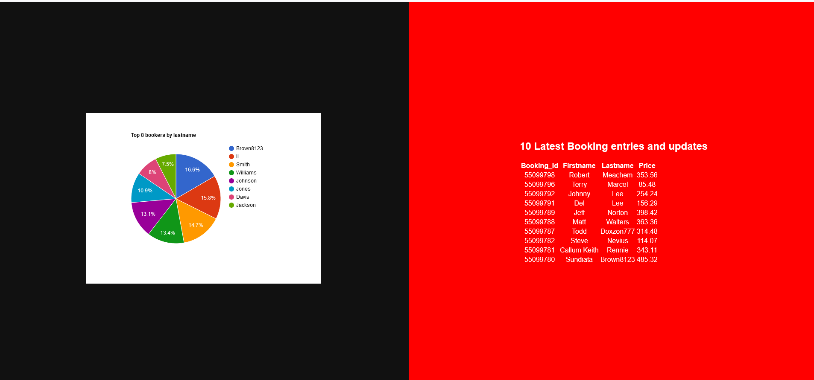

# Use MySQL HeatWave For Development  

## Introduction

MySQL HeatWave can easily be used for development tasks with existing Oracle services, such as Oracle Cloud Analytics. New applications can also be created with the LAMP or other software stacks.


_Estimated Lab Time:_ 40 minutes

### Objectives

In this lab, you will be guided through the following tasks:

- Install Apache and PHP and create PHP / MYSQL Connect Application
- Create  

### Prerequisites

- An Oracle Trial or Paid Cloud Account
- Some Experience with MySQL Shell
- Completed Lab 5

## **TASK 1:** Install and test PHP MySQL Application

Estimated Time: 20 minutes

**Subtask 1 – Install App Server (APACHE)**

1. If not already connected with SSH, on Command Line, connect to the Compute instance using SSH ... be sure replace the  "private key file"  and the "new compute instance ip"

     ````
    <copy>ssh -i private_key_file opc@new_compute_instance_ip</copy>
     ````

2.	Install app server

    a. Install Apache
    
    ````
    <copy>sudo yum install httpd -y </copy>
    ````
    b. Enable Apache

    ````
    <copy>sudo systemctl enable httpd</copy>
    ````
    c. Start Apache

    ````
    <copy>sudo systemctl restart httpd</copy>
    ````
    d. Setup firewall

    ````
    <copy>sudo firewall-cmd --permanent --add-port=80/tcp</copy>
    ````
    
    e. Reload firewall

    ````
    <copy>sudo firewall-cmd --reload</copy>
    ````

3.	From a browser test apache from your loacal machine using the Public IP Address of your Compute Instance

    **Example: http://129.213....**

**Subtask 2 – Install PHP**   

1.	Install php:

    a. Install php:7.4

    ````
    <copy> sudo dnf module install php:7.4 -y</copy>
    ````
     
    b. Install associated php libraries

    ````
    <copy>sudo yum install php-cli php-mysqlnd php-zip php-gd php-mbstring php-xml php-json -y</copy>
    ````

    c. View  php / mysql libraries

    ````
    <copy>php -m |grep mysql</copy>
    ````
    d. View php version

    ````
    <copy>php -v</copy>
    ````
    e. Restart Apache

    ````
    <copy>sudo systemctl restart httpd</copy>
    ````

2.	Create test php file (info.php)

    ````
    <copy>sudo nano /var/www/html/info.php</copy>
    ````
3. Add the following code to the editor and save the file (ctr + o) (ctl + x)

    ````
    <copy><?php
phpinfo();
?></copy>
    ````
4. From your local machine, browse the page info.php

   Example: http://129.213.167.../info.php

## **TASK 2:** Subtask 3 – Create MDS / PHP connect app

1. Security update"   set SELinux to allow Apache to connect to MySQL

    ````
    <copy> sudo setsebool -P httpd_can_network_connect 1 </copy>
    ````

2.	Create config.php

    ````
    <copy>cd /var/www/html</copy>
    ````

    ````
    <copy>sudo nano config.php</copy>
    ````
3. Add the following code to the editor and save the file (ctr + o) (ctl + x)

    ````
    <copy><?php
// Database credentials
define('DB_SERVER', '10.0.1...');// MDS server IP address
define('DB_USERNAME', 'admin');
define('DB_PASSWORD', 'Welcome#12345');
define('DB_NAME', 'airportdb');
//Attempt to connect to MySQL database
$link = mysqli_connect(DB_SERVER, DB_USERNAME, DB_PASSWORD, DB_NAME);
// Check connection
if($link === false){
    die("ERROR: Could not connect. " . mysqli_connect_error());
}
// Print host information
echo 'Successfull Connect.';
echo 'Host info: ' . mysqli_get_host_info($link);
?>
</copy>
    ````

    - Test Config.php on Web sever http://150.230..../config.php

4.	Create dbtest.php

    ````
    <copy>cd /var/www/html</copy>
    ````

    ````
    <copy>sudo nano dbtest.php</copy>
    ````

5. Add the following code to the editor and save the file (ctr + o) (ctl + x)

    ````
    <copy><?php
require_once "config.php";
$query = "select firstname, lastname, count(booking.passenger_id) as count_bookings from passenger, booking
where booking.passenger_id = passenger.passenger_id
and passenger.lastname = 'Aldrin' or (passenger.firstname = 'Neil' and passenger.lastname = 'Armstrong')
and booking.price > 400.00 group by firstname, lastname;";
if ($stmt = $link->prepare($query)) {
   $stmt->execute();
   $stmt->bind_result($firstname,$lastname,$count_bookings);
   echo "<table>";
        echo "<tr>";
        echo "<th>Firstname</th>";
        echo "<th>Lastname</th>";
        echo "<th>Count</th>";
    echo "</tr>";

    while ($stmt->fetch()) {
        echo "<tr>";
           echo "<td>" . $firstname ."</td>";
           echo "<td>" . $lastname . "</td>";
           echo "<td>" . $count_bookings . "</td>";
        echo "</tr>";
     }

    $stmt->close();
}
?>

</copy>
    ````

6. From your local  machine connect to dbhwtest.php

    Example: http://129.213.167..../dbtest.php  

## **TASK 3:** Create Google Chart Application

1. Go to the development folder

    ````
    <copy>cd /var/www/html</copy>
    ````
2. Create mydbchart.php file

    ````
    <copy>sudo nano mydbchart.php</copy>
    ````
3. Click on this link to **Download file [dbchart.php](files/dbchart.php)**  to your local machine
2. Open dbchart.php from your local machine

    

4. copy all of the content of dbchart.php file from your local machine
    - add the content to the mydbchart.php file that you are  creating

        
    - Remember to replace the IP daadress,username, and password (lines 2 and 98 )
        - $con = mysqli_connect('30.0...','admin','Welcome#123','airportdb');
        - $link = mysqli_connect('30.0...','admin','Welcome#123','airportdb');
        
    - Save the mydbchart.php 


3.	From your local  machine connect to dbhwtest.php

    Example: http://129.213.167..../mydbchart.php
    

## TASK 4: Create HeatWave ML Web App

1. Go to the development folder

    ```bash
    <copy>cd /var/www/html</copy>
    ```

2. Create application folder 

    ```bash
    <copy>sudo mkdir airportapp</copy>
    ```

3. Change to application folder 

    ```bash
    <copy>cd /var/www/html/airportapp</copy>
    ```

4. Download application code

    ```bash
    <copy> sudo wget https://objectstorage.us-ashburn-1.oraclecloud.com/p/GpSI2eEwfsNM2ogTncD7WQkTlnLh-jAo7V3YgrkUQYuKfDfzRe1S-40d5Al9lMax/n/idazzjlcjqzj/b/airportdb-bucket-10282022/o/airportapp.zip</copy>
    ```

5. unzip Application code

    ```bash
    <copy>sudo unzip airportapp.zip</copy>
    ```

6. Replace the database IP in config.php file with your heatwave database IP and save the file.

    ```bash
    <copy>sudo nano config.php</copy>
    ```

7. Run the application as follows:

    computeIP/airportapp/eureka_index.php

    

## Acknowledgements
* **Author** - Perside Foster, MySQL Solution Engineering, Harsh Nayak , MySQL Solution Engineering 
* **Contributors** - Salil Pradhan, MySQL Principal Product Manager,  Nick Mader, MySQL Global Channel Enablement & Strategy Manager
* **Last Updated By/Date** - Perside Foster, MySQL Solution Engineering, Sept 2022