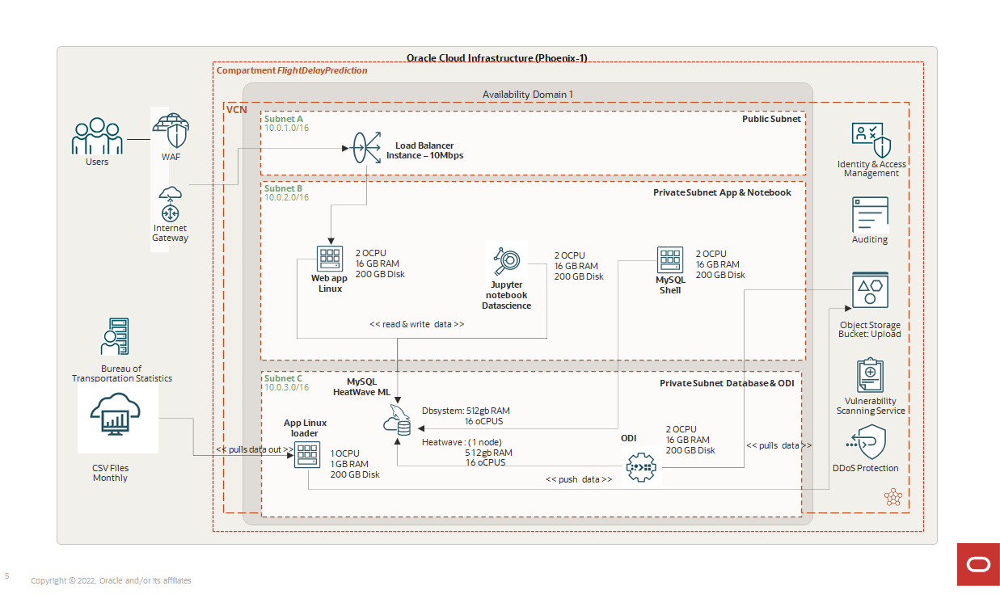

# Introduction

## About this Workshop

HeatWave is a fully managed database service that lets developers quickly
develop and deploy secure cloud-native applications using the world’s most
popular open source database. MySQL HeatWave is the only MySQL service
with a massively-scalable, integrated, real-time query accelerator, and a fully
automated in-database machine learning engine. This service overcomes the
limitations of traditional data warehouse, analytics and machine learning
environments that use periodic long-running ETL batch jobs to refresh the
data. MySQL HeatWave provides a unified MySQL database platform for
OLTP, OLAP and machine learning.

In this workshop, you will learn how to create a MySQL HeatWave Cluster, connect to the cluster using MySQL Shell and MySQL Workbench, run queries on HeatWave, run Analytics workloads, use the capabilities of HeatWave Machine Learning (ML), and create LAMP applications.

Overall this workshop will show you how easy it is to create and manage MySQL HeatWave and how MySQL HeatWave enables you to make informed business-critical decisions with real-time insights.

_Estimated Lab Time:_ 5 hours +

### About Product/Technology

**SINGLE MySQL DATABASE FOR OLTP AND OLAP**
MySQL HeatWave is the only MySQL service that provides a single solution for running OLTP and OLAP workloads. It
enables customers to run both OLTP and OLAP workloads in MySQL, within a single database platform, without the need to
ETL data to a separate database for analytic processing. No changes to existing applications are necessary. *
MySQL Database Service with HeatWave is a fully managed service, optimized for Oracle Cloud Infrastructure. It enables you to:

**HEATWAVE ML: NATIVE IN-DATABASE MACHINE LEARNING**
HeatWave ML delivers native, in-database machine learning, enabling developers and data analysts to build, train, deploy,
and explain machine learning models within MySQL HeatWave.

- Instantly provision MySQL instances and connect to a production-ready, pre-configured MySQL database.
- Run OLTP, OLAP and Machine Learning workloads directly on a single MySQL platform without the need of ETL, and no change in your applications.
- Efficiently run mixed and analytics workloads with the best price performance. HeatWave is 6.5X faster than Amazon Redshift at half the cost, 7X faster than Snowflake at one-fifth the cost, and 1400X faster than Amazon Aurora at half the cost.
- Make more informed business decisions by getting real-time insights from your operational data.
- Free up time of developers, DBAs, and DevOps to focus on value-added tasks that are core to your business.
- Access to dozens of additional Oracle Cloud Services enabling organizations to embrace the shift to the cloud.

**Lab Setup**
  

### Objectives

In this lab, you will be guided through the following steps:

- Create MySQL Database for HeatWave (DB System) instance
- Create SSH Key on Oracle Cloud Infrastructure Cloud Shell 
- Setup Compute instance
- Connect to DB System using MySQL Shell through Compute Instance and Cloud Shell 
- Create and Load sample schema(airportdb) in MySQL Database 
- Add HeatWave cluster to DB System
- Load sample data to HeatWave Cluster
- Run queries in HeatWave and MySQL and see the performance improvement in HeatWave!
- Run MySQL Autopilot to get performance improvement suggestions
- Create and Use HeatWave Machne Learning Models
- Run queries again in HeatWave and see the improvement!
- Use Bastion to access MySQL Shell for VS Code
- Perform development tasks
  - Use Workbench
  - Create LAMP test application
  - Use Oracle Anayltics Cloud

### Prerequisites

- An Oracle Free Tier, Paid or LiveLabs Cloud Account
- Some Experience with MySQL Shell - [MySQL Site](https://dev.MySQL.com/doc/MySQL-shell/8.0/en/).

## Acknowledgements

- **Author** - Perside Foster, MySQL Solution Engineering

- **Contributors** - Mandy Pang, Principal Product Manager, Salil Pradhan, Principal Product Manager, Nick Mader, MySQL Global Channel Enablement & Strategy Manager
- **Last Updated By/Date** - Perside Foster, MySQL Solution Engineering, March 2023
