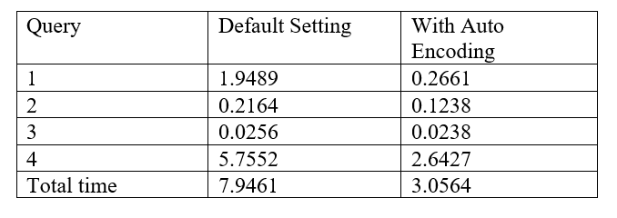
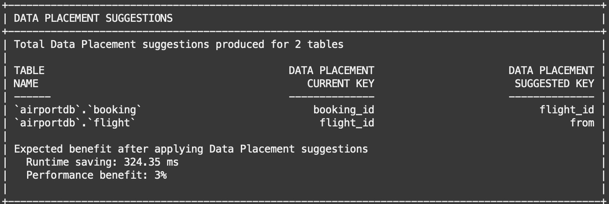
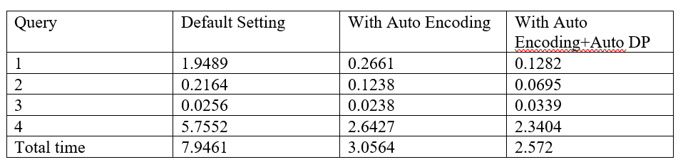

# Run MySQL HeatWave Autopilot

## Introduction

MySQL Autopilot provides machine learning automation that improves performance, scalability, and ease of use of HeatWave. It automates the database lifecycle operations including provisioning, data loading, query processing, and error handling. For example:
- Auto Encoding recommends string column encodings for improving query performance and reducing the amount of memory required on HeatWave nodes.
- Auto Data Placement recommends data placement keys for optimizing JOIN and GROUP BY query performance.
In this lab, you will learn how to use two of the MySQL Autopilot advisors (Auto Encoding and Auto Data Placement) to optimize HeatWave memory usage and performance for your workload

_Estimated Time:_ 10 minutes


### Objectives

In this lab, you will be guided through the following tasks:

- Improve Heatwave memory usage using Auto Encoding advisor
- Improve query performance using Auto Data Placement advisor

### Prerequisites

- An Oracle Trial or Paid Cloud Account
- Some Experience with MySQL Shell
- Completed Task 4

## Task 1: Improve Query performance and Heatwave memory usage using Auto Encoding

1. If not already connected with SSH, connect to Compute instance using Cloud Shell

    (Example: **ssh -i ~/.ssh/id_rsa opc@132.145.170...**)

2. On command Line, connect to MySQL using the MySQL Shell client tool with the following command:

    ```
    <copy>mysqlsh -uadmin -p -h 10.0.1... --sql </copy>
    ```
3.	Change to the airport database   

    Enter the following command at the prompt
    ```
    <copy>USE airportdb;</copy>
    ```

4. If not already on turn on  the `use_secondary_engine`

    Enter the following command at the prompt
     ```
    <copy>SET SESSION use_secondary_engine=ON;</copy>
    ```

5.	Run the following four queries and record the runtime:

 **Query 1)** Find per-company average age of passengers from Switzerland, Italy and France

    ```
<copy>SELECT
    airline.airlinename,
    AVG(DATEDIFF(departure, birthdate) / 365.25) AS avg_age,
    COUNT(*) AS nb_people
FROM
    booking,
    flight,
    airline,
    passengerdetails
WHERE
    booking.flight_id = flight.flight_id
        AND airline.airline_id = flight.airline_id
        AND booking.passenger_id = passengerdetails.passenger_id
        AND country IN ('SWITZERLAND' , 'FRANCE', 'ITALY')
GROUP BY airline.airlinename
ORDER BY airline.airlinename , avg_age
LIMIT 10;
</copy>
    ```
**Query 2)** Find top 10 companies selling the biggest amount of tickets for planes taking off from US airports
    ```
<copy>SELECT
    airline.airlinename,
    SUM(booking.price) AS price_tickets,
    COUNT(*) AS nb_tickets
FROM
    booking,
    flight,
    airline,
    airport_geo
WHERE
    booking.flight_id = flight.flight_id
        AND airline.airline_id = flight.airline_id
        AND flight.from = airport_geo.airport_id
        AND airport_geo.country = 'UNITED STATES'
GROUP BY airline.airlinename
ORDER BY nb_tickets DESC , airline.airlinename
LIMIT 10;
</copy>
    ```
**Query 3)** Ticket price greater than 500, grouped by price
    ```
    <copy> -- Query c) Ticket price greater than 500, grouped by price
SELECT
    booking.price, COUNT(*)
FROM
    booking
WHERE
    booking.price > 500
GROUP BY booking.price
ORDER BY booking.price
LIMIT 10; </copy>
    ```
**Query 4)** Ticket price greater than 400, grouped by firstname , lastname
    ```
<copy>SELECT
    firstname,
    lastname,
    COUNT(booking.passenger_id) AS count_bookings
FROM
    passenger,
    booking
WHERE
    booking.passenger_id = passenger.passenger_id
        AND passenger.lastname = 'Aldrin'
        OR (passenger.firstname = 'Neil'
        AND passenger.lastname = 'Armstrong')
        AND booking.price > 400.00
GROUP BY firstname , lastname;
</copy>
    ```

6. Run Auto Encoding advisor to see if there are any recommendations for string column encodings

    ```
    <copy>call sys.heatwave_advisor(json_object('target_schema', JSON_ARRAY('airportdb'), 'auto_enc', json_object('mode', 'recommend') ));</copy>
    ```
7.	To apply the suggestion, access the auto-generated script

    ```
    <copy>SET SESSION group_concat_max_len = 1000000;</copy>
    ```
    ```
    <copy>SELECT GROUP_CONCAT(log->>"$.sql" SEPARATOR '\n') AS "SQL Script" FROM sys.heatwave_advisor_report WHERE type = "sql" ORDER BY id;</copy>
    ```
8.	Copy and paste auto-generated script to apply AutoEncoding changes
9.	Run the same queries in step 1 and record the time. You can see that total query runtime has improved.

    **Your results should look like this:**
    

## Task 2: Improve Query performance using Auto Data Placement

1. Run MySQL Autopilot Auto Data Placement advisor to get suggestions on data placement keys.

    ```
<copy>call sys.heatwave_advisor(json_object('target_schema', JSON_ARRAY('airportdb'), 'auto_dp', json_object('benefit_threshold',0) ));</copy>
    ```


2. To apply the suggestion, access the auto-generated script

    ```
<copy>SET SESSION group_concat_max_len = 1000000;
SELECT GROUP_CONCAT(log->>"$.sql" SEPARATOR '\n') AS "SQL Script" FROM sys.heatwave_advisor_report WHERE type = "sql" ORDER BY id;
</copy>
    ```

3. Copy and paste auto-generated script to apply data placement changes

4.	Run the query in Task 1 step 1 again. You can see that total query runtime has improved.

    

## Learn More

* [Oracle Cloud Infrastructure MySQL Database Service Documentation ](https://docs.cloud.oracle.com/en-us/iaas/MySQL-database)
* [MySQL Database Documentation](https://www.MySQL.com)

## Acknowledgements

* **Author** - Perside Foster, MySQL Solution Engineering
* **Contributors** - Mandy Pang, MySQL Principal Product Manager,  Priscila Galvao, MySQL Solution Engineering, Nick Mader, MySQL Global Channel Enablement & Strategy Manager
* **Last Updated By/Date** - Perside Foster, MySQL Solution Engineering, May 2022
