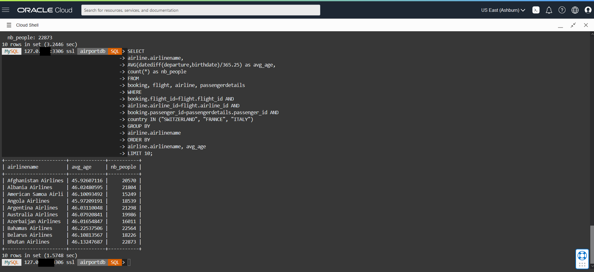

# Run Queries with MySQL Shell

## Introduction

In this lab, you will run queries in HeatWave and in MySQL. You will see the query performance improvements on HeatWave compare to MySQL.

_Estimated Time:_ 10 minutes

### Objectives

In this lab, you will be guided through the following tasks:

- Run Queries with MySQL Shell

### Prerequisites

- An Oracle Trial or Paid Cloud Account
- Some Experience with MySQL Shell
- Completed Task 3

## Task 1: Run Queries in HeatWave

1. If not already connected with SSH, connect to Compute instance using Cloud Shell

    (Example: **ssh -i ~/.ssh/id_rsa opc@132.145.170...**)

2. On command Line, connect to MySQL using the MySQL Shell client tool with the following command:

    ```bash
    <copy>mysqlsh -uadmin -p -h 10.0.1... --sql </copy>
    ```

3. Change to the airport database

    Enter the following command at the prompt

    ```bash
    <copy>USE airportdb;</copy>
    ```

4. **Query 1** - Find per-company average age of passengers from Switzerland, Italy and France

5. Before running a query, use EXPLAIN to verify that the query can be offloaded to the HeatWave cluster. You should see "Use secondary engine RAPID" in the explain plan. For example:

    ```bash
    <copy>EXPLAIN SELECT
    airline.airlinename,
    AVG(datediff(departure,birthdate)/365.25) as avg_age,
    count(*) as nb_people
FROM
    booking, flight, airline, passengerdetails
WHERE
    booking.flight_id=flight.flight_id AND
    airline.airline_id=flight.airline_id AND
    booking.passenger_id=passengerdetails.passenger_id AND
    country IN ("SWITZERLAND", "FRANCE", "ITALY")
GROUP BY
    airline.airlinename
ORDER BY
    airline.airlinename, avg_age
LIMIT 10\G</copy>
    ```

    

6. After verifying that the query can be offloaded, run the query and note the execution time. Enter the following command at the prompt:

     ```bash
    <copy>SELECT
    airline.airlinename,
    AVG(datediff(departure,birthdate)/365.25) as avg_age,
    count(*) as nb_people
FROM
    booking, flight, airline, passengerdetails
WHERE
    booking.flight_id=flight.flight_id AND
    airline.airline_id=flight.airline_id AND
    booking.passenger_id=passengerdetails.passenger_id AND
    country IN ("SWITZERLAND", "FRANCE", "ITALY")
GROUP BY
    airline.airlinename
ORDER BY
    airline.airlinename, avg_age
LIMIT 10;
</copy>
    ```
    

7. To compare the HeatWave execution time with MySQL DB System execution time, disable the `use_secondary_engine` variable to see how long it takes to run the same query on the MySQL DB System. For example:

    Enter the following command at the prompt:

     ```bash
    <copy>SET SESSION use_secondary_engine=OFF;</copy>
    ```

8. Enter the following command at the prompt:

     ```bash
    <copy>SELECT
    airline.airlinename,
    AVG(datediff(departure,birthdate)/365.25) as avg_age,
    count(*) as nb_people
FROM
    booking, flight, airline, passengerdetails
WHERE
    booking.flight_id=flight.flight_id AND
    airline.airline_id=flight.airline_id AND
    booking.passenger_id=passengerdetails.passenger_id AND
    country IN ("SWITZERLAND", "FRANCE", "ITALY")
GROUP BY
    airline.airlinename
ORDER BY
    airline.airlinename, avg_age
LIMIT 10;</copy>
    ```
    

9. To see if `use_secondary_engine` is enabled (=ON)

    Enter the following command at the prompt:
    
     ```bash
    <copy>SHOW VARIABLES LIKE 'use_secondary_engine%';</copy>
    ```

10. Run additional queries. Remember to turn on and off the `use_secondary_engine`  to compare the execution time.

    (Example  **SET SESSION `use_secondary_engine`=On;**)

    (Example  **SET SESSION `use_secondary_engine`=Off;**)

11. Enter the following command at the prompt

     ```bash
    <copy>SET SESSION use_secondary_engine=ON;</copy>
    ```

12. **Query 2** -  Find top 10 companies selling the biggest amount of tickets for planes taking off from US airports.	Run Pricing Summary Report Query:

    ```bash
    <copy> SELECT
    airline.airlinename,
    SUM(booking.price) as price_tickets,
    count(*) as nb_tickets
FROM
    booking, flight, airline, airport_geo
WHERE
    booking.flight_id=flight.flight_id AND
    airline.airline_id=flight.airline_id AND
    flight.from=airport_geo.airport_id AND
    airport_geo.country = "UNITED STATES"
GROUP BY
    airline.airlinename
ORDER BY
    nb_tickets desc, airline.airlinename
LIMIT 10;
    </copy>
    ```

13. Enter the following command at the prompt:

     ```bash
    <copy>SET SESSION use_secondary_engine=OFF;</copy>
    ```

    Run Query b again:

    ```bash
    <copy> SELECT
    airline.airlinename,
    SUM(booking.price) as price_tickets,
    count(*) as nb_tickets
FROM
    booking, flight, airline, airport_geo
WHERE
    booking.flight_id=flight.flight_id AND
    airline.airline_id=flight.airline_id AND
    flight.from=airport_geo.airport_id AND
    airport_geo.country = "UNITED STATES"
GROUP BY
    airline.airlinename
ORDER BY
    nb_tickets desc, airline.airlinename
LIMIT 10;
    </copy>
    ```

14. **Query 3** - Give me the number of bookings that Neil Armstrong and Buzz Aldrin made for a price of > $400.00

    ```bash
    <copy>SET SESSION use_secondary_engine=ON;</copy>
    ```

    ```bash
    <copy>SELECT
    firstname,
    lastname,
    COUNT(booking.passenger_id) AS count_bookings
FROM
    passenger,
    booking
WHERE
    booking.passenger_id = passenger.passenger_id
        AND passenger.lastname = 'Aldrin'
        OR (passenger.firstname = 'Neil'
        AND passenger.lastname = 'Armstrong')
        AND booking.price > 400.00
GROUP BY firstname , lastname;</copy>
    ```

    ```bash
    <copy>SET SESSION use_secondary_engine=OFF;</copy>
    ```

    ```bash
    <copy>SELECT
    firstname,
    lastname,
    COUNT(booking.passenger_id) AS count_bookings
FROM
    passenger,
    booking
WHERE
    booking.passenger_id = passenger.passenger_id
        AND passenger.lastname = 'Aldrin'
        OR (passenger.firstname = 'Neil'
        AND passenger.lastname = 'Armstrong')
        AND booking.price > 400.00
GROUP BY firstname , lastname;</copy>
    ```

15. Keep HeatWave processing enabled

    ```bash
    <copy>SET SESSION use_secondary_engine=ON;</copy>
    ```

## Learn More

- [Oracle Cloud Infrastructure MySQL Database Service Documentation](https://docs.cloud.oracle.com/en-us/iaas/MySQL-database)
- [MySQL Database Documentation](https://www.MySQL.com)

## Acknowledgements

- **Author** - Perside Foster, MySQL Solution Engineering

- **Contributors** - Mndy Pang, Principal Product Manager, Salil Pradhan, Principal Product Manager, Nick Mader, MySQL Global Channel Enablement & Strategy Manager
- **Last Updated By/Date** - Perside Foster, MySQL Solution Engineering, May 2022
