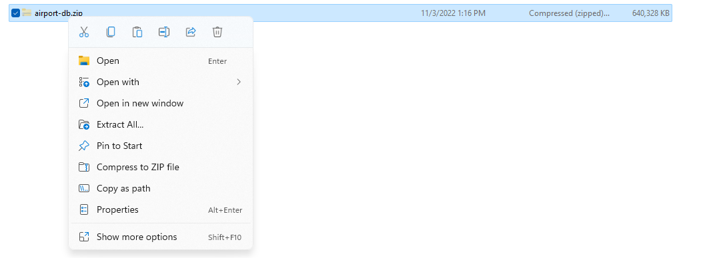
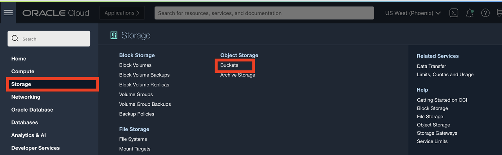
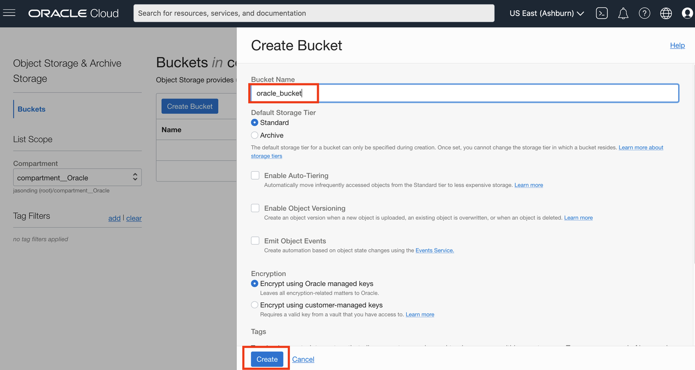

# Create Object Storage bucket and upload airportdb data


## Introduction

**Create and Load object Storage Bucket**

Create Object Storage Bucket and load Airport Sample database.

_Estimated Time:_ 15 minutes

### Objectives

In this lab, you will be guided through the following tasks:

- Download and unzip airportdb data
- Create Object Storage bucket
- Upload airportdb data


### Prerequisites

- An Oracle Free Tier or Paid Cloud Account
- A web browser
- Login to OCI to and on OCI Dashboard (

## Task 1: Download and unzip airportdb data to your local machine

Download the airportdb sample database  The download is approximately 640 MBs in size.

1. From Windows Local machine click  this  link from your browser:

    [https://downloads.mysql.com/docs/airport-db.zip](https://downloads.mysql.com/docs/airport-db.zip) 

    Use Extract all to create zip folder airport-db

    

2. From Linux or Mac Enter from terminal

    ```bash
    <copy>wget https://downloads.mysql.com/docs/airport-db.zip</copy>
    ```

    Unzip  the airportdb sample database  

    ```bash
    <copy>unzip airport-db.zip</copy>
    ```

## Task 2: Create Object Storage bucket

1. Sign in to OCI using your tenant name, user name and password.
2. Once signed in select the compartment assigned to you from drop down menu on left part of the screen
3. From the Console navigation menu, click **Storage**.
4. Under Object Storage, click Buckets

    **NOTE:** Ensure the correct Compartment is selected : Select **heatwave**

    

5. Click Create Bucket. The Create Bucket pane is displayed.
6. Enter a Bucket Name **airport-bucket**
7. Under Default Storage Tier, click Standard. Leave all the other fields at their default values.
8. Click Create

    

## Task 3: Upload airportdb data

1. In the Buckets page, click the **airport-bucket** name to load images into. The bucket's details page is displayed.
2. Under Resources, click Objects to display the list of objects in the bucket.
3. Click ***More Actions**  
    - selet **Create New Folder** 
    - Set the name to  **airport-bd**
    - Click the **Create** button
    - Click the created folder

4. Click Upload. The Upload Objects pane is displayed.
5. Select all of the files from the unzippe airport-db local folder 
    - Click open to load all of the ylocal files
    - Click the Upload button
       

    - Wait for the **Abort** to change into **close**
       

    - Click the **close** button

**You may now proceed to the next lab**

## Acknowledgements

- **Author** - Perside Foster, MySQL Solution Engineering, Harsh Nayak , MySQL Solution Engineering 
- **Contributors** - Frédéric Descamps, MySQL Community  Manager, Orlando Gentil, Principal Training Lead and Evangelist
- **Last Updated By/Date** - Perside Foster, MySQL Solution Engineering, November 2022

