# Build E5 OCI Infrastructure with Bootstrap and Ansible

## Introduction

In this setup lab, you will use a temporary bootstrap instance as the Ansible controller for the workshop environment. You will create a VCN, launch the bootstrap host, install required software, configure OCI credentials, run the provisioning playbook with `VM.Standard.E5.Flex`, and verify access to the three instances used in later labs: `olvm`, `olkvm01`, and `olkvm02`.

If your instructor or workshop owner already provided a working E5 environment, skip this lab and begin with Lab 2.

Estimated Time: 45-60 minutes, including 20-35 minutes for the Ansible provisioning run.

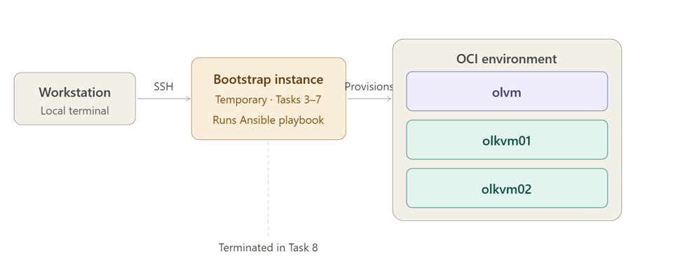

*A temporary bootstrap instance runs the Ansible playbook that provisions the OLVM manager and two KVM hosts on OCI. The bootstrap instance is terminated after the cluster SSH keys are copied to your local machine.*

<!-- ### Video Walkthrough

This walkthrough video is silent and does not include audio narration.

[](video:https://objectstorage.us-ashburn-1.oraclecloud.com/n/idhwewbjlvpy/b/olvm-on-oci/o/videos%2Fvideos_olvm-on-oci-lab1-no-presenter.mp4) -->

### Objectives

In this lab, you will:

- Verify that VLAN support (Layer 2 network virtualization) is enabled for the tenancy
- Create a VCN for the bootstrap deployment
- Launch a temporary bootstrap compute instance
- Install required software on the bootstrap host
- Configure OCI credentials and generate SSH keys used by automation
- Run the Ansible playbook that provisions `olvm`, `olkvm01`, and `olkvm02`
- Verify deployed instances and copy the required SSH keys to your local machine
- Enforce Instance Metadata Service Version 2 (IMDSv2) only on all three deployed instances
- Terminate the temporary bootstrap instance after validation is complete

### Prerequisites

This lab assumes you have:

- An OCI tenancy with sufficient quotas for the workshop instances
- **VLAN support (Layer 2 network virtualization) enabled for the tenancy and target region** - see Task 1 below
- A target compartment for lab resources
- Access to the OCI Console
- Your SSH public key for the initial bootstrap instance login
- A local terminal (Windows PowerShell, macOS Terminal, or Linux terminal)

> **Important:** This lab builds the base environment used by every later lab. Continue to Lab 2 only after the setup checkpoint passes.

## Task 1: Verify VLAN Support Is Available

The Ansible provisioning playbook creates an OCI VLAN for the Layer 2 network used by guest virtual machines. If VLAN support is not available in your target region, the playbook will fail.

1. Sign in to the OCI Console and switch to the workshop target region.

2. Go to **Networking -> Virtual Cloud Networks** and open any existing VCN, or create a temporary one.

3. Under the VCN **Resources** menu, look for **VLANs**.

    - If **VLANs** is visible and you can access or create VLAN resources, continue with Task 2.
    - If **VLANs** is not visible, first confirm you are in the correct region, compartment, and IAM group. If those are correct, continue with the steps below to request VLAN support before proceeding.

4. To request VLAN support, go to **Governance & Administration -> Tenancy Management -> Limits, Quotas and Usage** and search for **VLAN** under the **Networking** category.

5. If a VLAN limit increase option is available, submit the request. If VLANs are not listed, open an Oracle Support request with the following text:

    > Please enable Layer 2 network virtualization / VLAN support for tenancy `<tenancy-OCID>` in region `<region>`. This is required to deploy Oracle Linux Virtualization Manager (OLVM) on OCI.

6. Wait for confirmation before continuing. Do not proceed to Task 2 until VLANs are visible in the target region.

## Task 2: Create Bootstrap VCN (VCN Wizard)

1. In the OCI Console, navigate to **Networking -> Virtual Cloud Networks**.

2. Click **Actions -> Start VCN Wizard**.

3. Select **Create VCN with Internet Connectivity**.

4. Enter values similar to the following:

    | Field | Value |
    |---|---|
    | VCN Name | `bootstrap-vcn` |
    | Compartment | *your compartment* |
    | VCN CIDR Block | `10.0.0.0/16` |
    | Public Subnet CIDR | `10.0.0.0/24` |
    | Private Subnet CIDR | `10.0.1.0/24` |

    **Networking guidance:**
    - Use the public subnet only for the temporary bootstrap instance.
    - Leave the route tables, security lists, and DHCP options created by the wizard at their defaults.
    - Do not add any VNC ingress rule. Lab 2 uses SSH tunneling to the OLVM manager instead.

5. Click **Next -> Review -> Create**.

6. Wait until all VCN resources show **Available** before you continue. This normally takes 2-5 minutes.


## Task 3: Launch Bootstrap Instance

1. In the OCI Console, navigate to **Compute -> Instances -> Create Instance**.

2. Use values similar to the following:

    | Field | Value |
    |---|---|
    | Name | `bootstrap` |
    | Compartment | *your compartment* |
    | Image | Oracle Linux 9 |
    | Shape | Flexible VM shape such as `VM.Standard.E5.Flex` with `1 OCPU` and `12-16 GB` memory |
    | VCN | `bootstrap-vcn` |
    | Subnet | Public Subnet |
    | Primary VNIC Name | `bootstrap-vnic` (or keep the autogenerated default if this field is hidden) |
    | Private IP | Auto-assign |
    | Assign Public IP | Yes |
    | SSH Keys | Upload your public key |

    **Why these values matter:**
    - `Assign Public IP = Yes` is required because you will SSH to this temporary host from your local machine.
    - Leave the bootstrap host on the public subnet and keep the private IP on auto-assign.
    - Do not add a secondary VNIC or custom private IP for the bootstrap host.
    - Use the standard Oracle Linux 9 image for the bootstrap host instead of the Cloud Developer image.

3. Click **Create** and wait for the instance state to become **Running**.

4. Record the bootstrap instance **Public IP**.

5. From a local terminal (Windows PowerShell, macOS Terminal, or Linux terminal) connect to the bootstrap instance:

    ```bash
    <copy>ssh -i ~/.ssh/<your-key> opc@<bootstrap-public-ip></copy>
    ```

    > **Warning:** The bootstrap instance is temporary. Do not terminate it until the playbook completes, the cluster keys are copied to your local machine, and you have verified SSH access to `olvm`.

## Task 4: Set Up Bootstrap Software

1. Install the prerequisite packages:

    ```bash
    <copy>sudo dnf install -y python3 python3-pip python3-setuptools python3-pip-wheel git
    python3 --version
    git --version</copy>
    ```

2. Install the OCI CLI:

    ```bash
    <copy>sudo dnf -y install oraclelinux-developer-release-el9
    sudo dnf install -y python39-oci-cli
    oci --version</copy>
    ```

3. Create and activate a Python virtual environment:

    ```bash
    <copy>python3 -m venv --system-site-packages ~/venv-olvm
    source ~/venv-olvm/bin/activate
    python --version
    which python</copy>
    ```

4. Install the OCI SDK, Ansible, and `jmespath` into the virtual environment:

    ```bash
    <copy>python -m pip install --upgrade pip
    pip install oci ansible==6.7.0 jmespath
    ansible --version
    python -c "import oci; print(oci.__version__)"</copy>
    ```

5. Clone the lab repository:

    ```bash
    <copy>git clone https://github.com/oracle-devrel/linux-virt-labs.git
    cd ~/linux-virt-labs/olvm</copy>
    ```

6. Install the required Ansible collections:

    ```bash
    <copy>ansible-galaxy collection install -r requirements.yml --force
    ansible-galaxy collection install community.general:6.6.0 --force
    ansible-galaxy collection install community.crypto:1.9.0 --force</copy>
    ```

## Task 5: Configure OCI Credentials

1. Run the OCI CLI configuration workflow:

    Use this cheat sheet when `oci setup config` prompts for OCI values:

    - **User OCID:** Profile menu -> **User Settings** -> Copy next to the OCID
    - **Tenancy OCID:** Profile menu -> **Tenancy: _your tenancy_** -> Copy next to the OCID
    - **Region Identifier:** The region shown in the Console header, for example `us-ashburn-1`
        > **Note:** During OCI setup, you will be presented with a region index list. Find the matching region and enter its index. Example: `71: us-ashburn-1`.

    - **Compartment OCID:** **Identity & Security -> Compartments -> _your compartment_ -> Copy** next to the OCID

    ```bash
    <copy>oci setup config</copy>
    ```

    When the command completes, note the output values:

    - **Fingerprint** identifies the API signing key that was created for this bootstrap host.
    - **Config written to `/home/opc/.oci/config`** confirms the OCI CLI configuration file was saved locally.

    `oci setup config` also creates the public key that you must upload to your OCI user before the CLI can authenticate successfully.

2. Display and copy the full generated public API key, including the `BEGIN PUBLIC KEY` and `END PUBLIC KEY` lines.

    ```bash
    <copy>ls /home/opc/.oci
    cat /home/opc/.oci/oci_api_key_public.pem</copy>
    ```

3. Upload the copied public API key to your OCI user:

    - In the OCI Console, click the profile menu and open **User Settings**.
    - Open **Token and Keys** -> **API Keys** -> **Add API Key**.
    - In the **Add API Key** dialog, choose **Paste Public Keys**.
    - Paste the full contents of `/home/opc/.oci/oci_api_key_public.pem` into the dialog.
    - Save the key and wait 2-5 minutes for the new API key to propagate.

    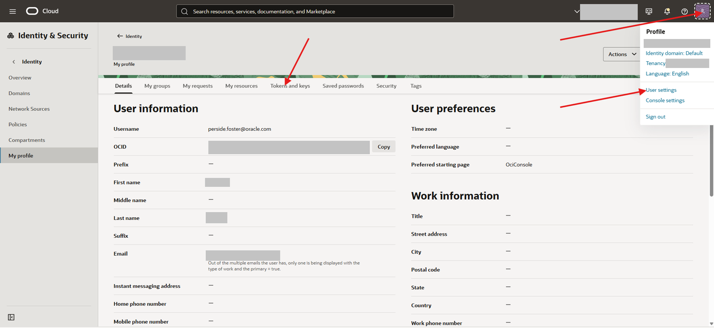

    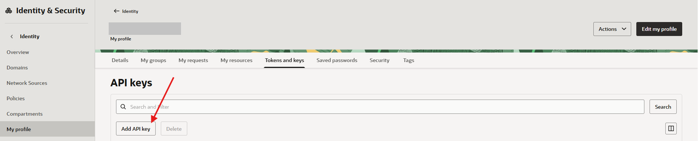

    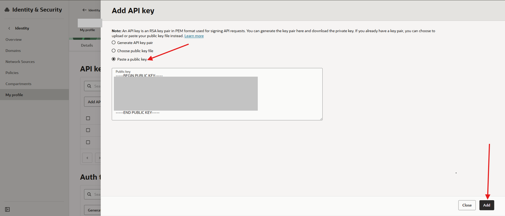

    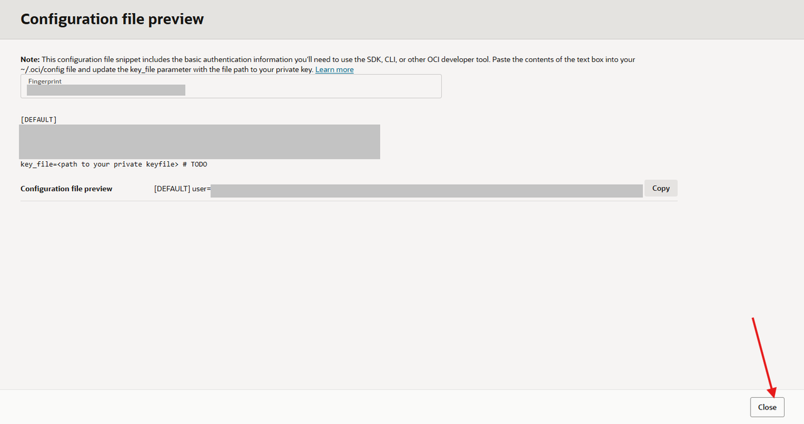

    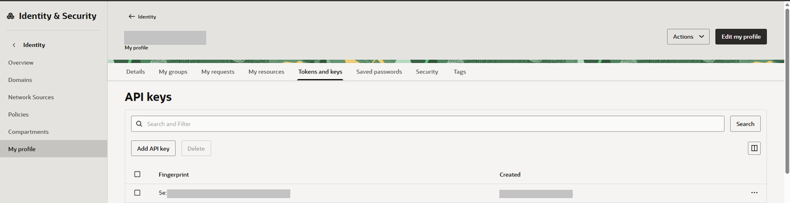

4. Run a quick validation command. If the command returns a short list of regions, the OCI CLI authentication is working correctly.

    ```bash
    <copy>oci iam region list | head</copy>
    ```

    If this command fails immediately after `oci setup config`, wait 2-5 minutes for the key registration to propagate and try again.
    If it still fails, confirm the key appears under **User Settings** -> **Token and Keys** -> **API Keys**, then rerun the command.

    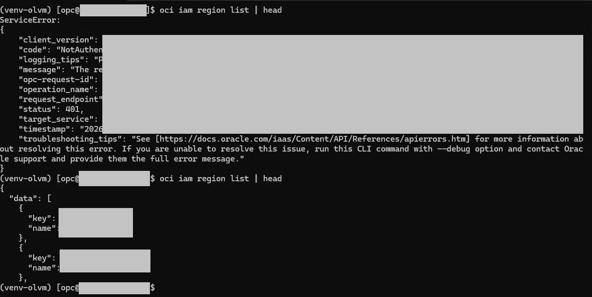

## Task 6: Create OCI Components and Run the Playbook

1. Generate the SSH key pair used by the automation:

    ```bash
    <copy>ssh-keygen -t rsa -b 2048 -f ~/.ssh/id_rsa -N ""</copy>
    ```

2. Set the compartment OCID:

    ```bash
    <copy>export OCI_COMPARTMENT_OCID="<your-compartment-ocid>"</copy>
    ```

3. Display the compartment variable to verify it was set:

    ```bash
    <copy>echo "$OCI_COMPARTMENT_OCID"</copy>
    ```

4. Create `instances.yml`:

    ```bash
    <copy>cd ~/linux-virt-labs/olvm

    cat > instances.yml <<'EOF'
    compute_instances:
      1:
        instance_name: "olvm"
        type: "engine"
        instance_ocpus: 2
        instance_memory: 32
      2:
        instance_name: "olkvm01"
        type: "kvm"
        instance_ocpus: 8
        instance_memory: 64
      3:
        instance_name: "olkvm02"
        type: "kvm"
        instance_ocpus: 8
        instance_memory: 64
    use_vnc_on_engine: false
    blk_volume_size_in_gbs: 512
    EOF

    cat instances.yml</copy>
    ```

    > **Notes:**
    - `use_vnc_on_engine: false` disables VNC on the OLVM manager. This lab uses SSH tunneling to access the OLVM portal instead.
    - **Block volume sizing:** `blk_volume_size_in_gbs` makes the provisioned block volume size configurable during deployment. This workshop uses `512` GB as a defined, lower-cost value instead of the larger default allocation of `1 TB`, while still providing enough capacity for the lab environment. If your environment requires more storage, you can increase this value before running the playbook.

5. Create the `hosts` inventory so Ansible uses the virtual environment Python:

    ```bash
    <copy>cat <<'EOF' > hosts
    localhost ansible_connection=local ansible_python_interpreter=/home/opc/venv-olvm/bin/python
    EOF

    cat hosts</copy>
    ```

6. Apply the workshop reliability safeguards before running the playbook.

    The downloaded upstream automation attempts to run its SSH waiting task on the new server. If a server is still starting, Ansible cannot connect to run that task. Replace the task with Ansible's connection-aware waiting module, which safely retries from the Ansible controller for up to 15 minutes.

    ```bash
    <copy>cat > check_instance_available.yml <<'EOF'
    ---
    - name: Configure new instances
      hosts: engine:kvm:!localhost
      gather_facts: false
      any_errors_fatal: true
      vars_files:
        - default_vars.yml
        - oci_vars.yml

      tasks:
        - name: Wait for systems to become reachable using SSH
          ansible.builtin.wait_for_connection:
            delay: 15
            timeout: 900
            connect_timeout: 10
            sleep: 10
        - name: Get a set of all available facts
          ansible.builtin.setup:
    EOF

    sed '/    - name: Pause play to interact with the servers/,$d' \
      create_instance.yml > deploy_instance.yml

    grep -A 6 "wait_for_connection" check_instance_available.yml
    tail -n 8 deploy_instance.yml</copy>
    ```

    The generated `deploy_instance.yml` ends after printing the instance details. It cannot enter the upstream automatic resource-removal play. Resource removal remains available separately through `terminate_instance.yml` when the workshop is finished.

7. Run the Ansible playbook to create the OCI infrastructure and OLVM instances.

    The playbook uses the `instances.yml` file created in the previous step and overrides the compute shape to `VM.Standard.E5.Flex`.

    ```bash
    <copy>ansible-playbook deploy_instance.yml -i hosts -e "@instances.yml" -e instance_shape=VM.Standard.E5.Flex</copy>
    ```

    **Expected runtime:** 20-35 minutes. If the playbook runs for more than 45 minutes or shows no new task output for more than 10 minutes, stop and contact the instructor or workshop owner before changing the environment manually.

    > **If provisioning fails:** Stop at the failed task and capture the output. The deployment-only playbook will not delete the OCI resources. Do not rerun it against a partially created environment.

    To remove a partial deployment before trying again, run:

    ```bash
    <copy>ansible-playbook terminate_instance.yml -i hosts -e "@instances.yml"</copy>
    ```

    Confirm in the OCI Console that the workshop instances, volumes, VCN, gateways, subnets, VLAN, and security resources have been removed. Then begin a clean deployment.

    **Expected result:** A successful run reaches `PLAY [Print instances]` and displays the `olvm`, `olkvm01`, and `olkvm02` public and private IP addresses.

    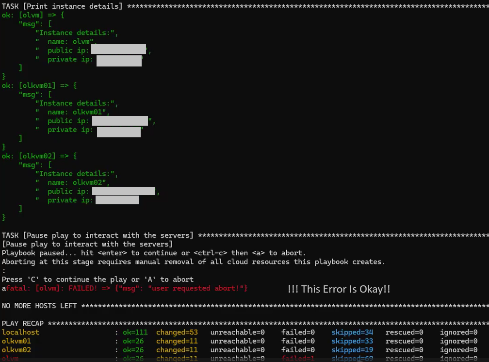

8. Record **both public and private IPs** for:

    - `olvm`
    - `olkvm01`
    - `olkvm02`

## Task 7: Verify and Access Deployed Instances

1. From your local computer, copy the cluster SSH private key from the bootstrap host. Replace `<bootstrap-login-key>` with the filename of the private key that you used to sign in to the bootstrap instance. Do not use `olvm-cluster-id_rsa` as the bootstrap login key because that is the file you are downloading.

    In Windows PowerShell, run:

    ```powershell
    <copy>scp -i "$HOME\.ssh\<bootstrap-login-key>" "opc@<bootstrap-public-ip>:~/.ssh/id_rsa" "$HOME\.ssh\olvm-cluster-id_rsa"</copy>
    ```

    In macOS Terminal or a Linux terminal, run:

    ```bash
    <copy>scp -i ~/.ssh/<bootstrap-login-key> opc@<bootstrap-public-ip>:~/.ssh/id_rsa ~/.ssh/olvm-cluster-id_rsa</copy>
    ```

2. Copy the cluster SSH public key:

    In Windows PowerShell, run:

    ```powershell
    <copy>scp -i "$HOME\.ssh\<bootstrap-login-key>" "opc@<bootstrap-public-ip>:~/.ssh/id_rsa.pub" "$HOME\.ssh\olvm-cluster-id_rsa.pub"</copy>
    ```

    In macOS Terminal or a Linux terminal, run:

    ```bash
    <copy>scp -i ~/.ssh/<bootstrap-login-key> opc@<bootstrap-public-ip>:~/.ssh/id_rsa.pub ~/.ssh/olvm-cluster-id_rsa.pub</copy>
    ```

3. Verify that you can SSH to the OLVM manager from your local machine:

    In Windows PowerShell, run:

    ```powershell
    <copy>ssh -i "$HOME\.ssh\olvm-cluster-id_rsa" oracle@<olvm-public-ip> "hostname -f"</copy>
    ```

    In macOS Terminal or a Linux terminal, run:

    ```bash
    <copy>ssh -i ~/.ssh/olvm-cluster-id_rsa oracle@<olvm-public-ip> "hostname -f"</copy>
    ```

4. Add an ingress rule to allow HTTPS access to the OLVM Administration Portal from your local browser. Navigate using this path:

    **MENU -> Networking -> Virtual cloud networks -> OLV-VCN -> Subnets -> Public Subnet -> Security -> Default Security List -> Security Rules -> Add Ingress Rules**

    **Select Default Security List for OLV-VCN**. If two entries appear with the same name, select the one created most recently.

    Enter the following values:

    | Field | Value |
    |---|---|
    | Source CIDR | `0.0.0.0/0` |
    | IP Protocol | TCP |
    | Destination Port Range | `443` |
    | Description | `Allow HTTPS access to OLVM Administration Portal` |

    For a more restrictive rule, use your workstation public IP address with `/32` instead of `0.0.0.0/0`.

    - Click **Add Ingress Rules**

    > **Note:** OCI security list changes take effect immediately — no reboot is required.

    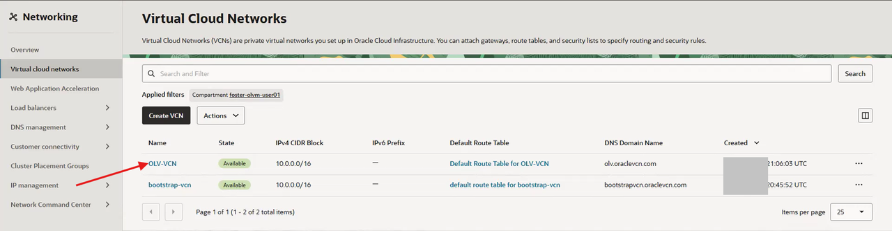

    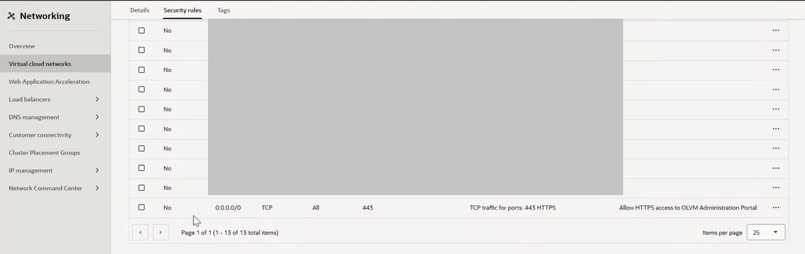

5. Connect to `olvm` as `oracle`.

    In Windows PowerShell, run:

    ```powershell
    <copy>ssh -i "$HOME\.ssh\olvm-cluster-id_rsa" oracle@<olvm-public-ip></copy>
    ```

    In macOS Terminal or a Linux terminal, run:

    ```bash
    <copy>ssh -i ~/.ssh/olvm-cluster-id_rsa oracle@<olvm-public-ip></copy>
    ```

6. From the `olvm` terminal, verify passwordless SSH to `olkvm01`:

    ```bash
    <copy>ssh olkvm01 hostname -f</copy>
    ```

7. Verify passwordless SSH to `olkvm02`:

    ```bash
    <copy>ssh olkvm02 hostname -f</copy>
    ```

    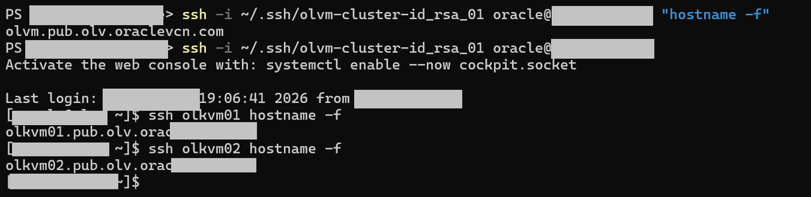

8. After you confirm SSH access to `olvm` and both KVM hosts, return to the bootstrap instance and enforce Instance Metadata Service Version 2 (IMDSv2) only on all three deployed instances.

    > **Why:** OCI instances accept both the legacy `/v1` and the `/v2` Instance Metadata Service endpoints by default. IMDSv1 has no built-in request authentication, which makes it more vulnerable to SSRF-style attacks. Oracle Linux 8 platform images support IMDSv2. Because you have now verified access to all three hosts, you can safely disable the legacy `/v1` endpoint. This command uses the OCI CLI already configured on the bootstrap instance and does not reboot the instances.

    ```bash
    <copy>for name in olvm olkvm01 olkvm02; do
      instance_id=$(oci compute instance list \
        --compartment-id "$OCI_COMPARTMENT_OCID" \
        --display-name "$name" \
        --lifecycle-state RUNNING \
        --query "data[0].id" --raw-output)

      echo "Setting IMDSv2-only on $name ($instance_id)"

      oci compute instance update \
        --instance-id "$instance_id" \
        --instance-options '{"areLegacyImdsEndpointsDisabled": true}' \
        --force
    done
    sleep 60</copy>
    ```

9. Verify that each instance now enforces IMDSv2 only:

    ```bash
    <copy>for name in olvm olkvm01 olkvm02; do
      instance_id=$(oci compute instance list \
        --compartment-id "$OCI_COMPARTMENT_OCID" \
        --display-name "$name" \
        --lifecycle-state RUNNING \
        --query "data[0].id" --raw-output)

      echo "$name:"
      oci compute instance get --instance-id "$instance_id" \
        --query "data.\"instance-options\""
    done</copy>
    ```

    **Expected output** for each instance:

    ```json
    {
      "are-legacy-imds-endpoints-disabled": true
    }
    ```

    If any instance shows `false` or `null`, re-run the update command in the previous step for that instance name.

10. After the IMDSv2 verification succeeds, you are ready to terminate the bootstrap instance in the next task. You can skip the Terminate task for later if you intentionally want to retain the bootstrap instance for troubleshooting.

## Task 8: Terminate the Bootstrap Instance

1. Return to the OCI Console and navigate to **Compute -> Instances**.

2. Confirm that all of the following are true before you continue:

    - You copied `olvm-cluster-id_rsa` and `olvm-cluster-id_rsa.pub` to your local machine.
    - You verified local SSH access to `olvm`.
    - You no longer need any files or shell history from the bootstrap instance.

3. Select the `bootstrap` instance.

4. Click **More Actions -> Terminate**.

5. In the confirmation dialog, decide whether to delete the boot volume:

    - Select **Permanently delete the attached boot volume** if you want to fully clean up the temporary bootstrap resources.
    - Leave it unchecked only if you want to preserve the instance for troubleshooting.

6. Click **Terminate Instance**.

7. Wait until the instance state changes to **Terminated**.

## Set Up OLVM Infrastructure Checkpoint

At this point, you should have:

- VLAN support (Layer 2 network virtualization) confirmed active for the tenancy and region
- OCI credentials configured on the bootstrap host
- Three deployed instances: `olvm`, `olkvm01`, and `olkvm02`
- Public and private IPs recorded for all three instances
- IMDSv2 enforced (legacy `/v1` metadata endpoints disabled) on all three instances
- The cluster SSH private key copied to your local machine
- Verified local SSH access to the OLVM manager
- Verified SSH from `olvm` to both KVM hosts
- Bootstrap instance terminated, unless you intentionally kept it for troubleshooting

Continue to Lab 2 after all checkpoint items above are complete.

You may now **proceed to the next lab**

## Learn More

- Oracle Linux Virtualization Manager install lab (official): https://docs.oracle.com/en/learn/olvm-install/index.html

## Acknowledgements

- - **Author** - Shawn Kelley, Mark Atkinson, John Priest, Perside Foster
- **Contributor** - Marvin Kim
- **Last Updated By/Date** - Perside Foster, Jul 2026
