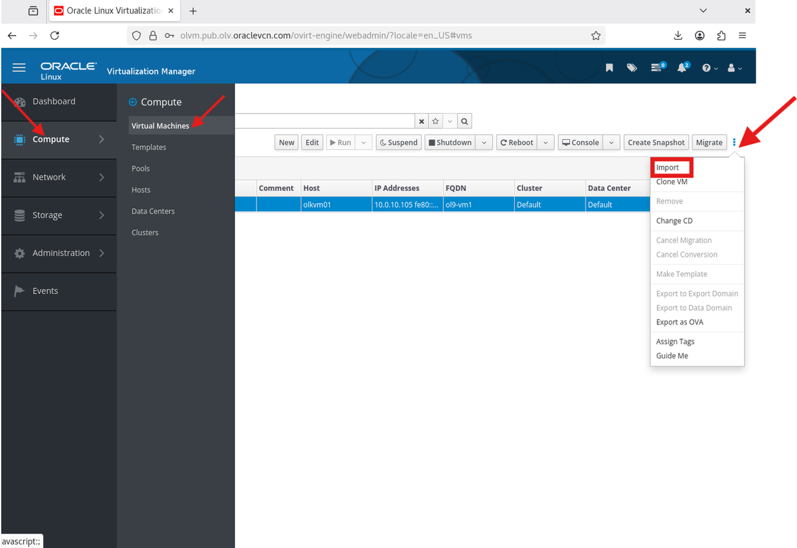

# Deploy Multi Tier Application

## Introduction

In this lab, you will import two prebuilt OVAs: one for a MySQL database VM and one for a Java web application VM. You will run both application VMs on the same KVM host so the beginner E5 lab has a reliable application path.

Estimated Time: 15-30 minutes, including OVA download, import, and application startup time.

### Video Walkthrough

This walkthrough video is silent and does not include audio narration.

[](video:https://objectstorage.us-ashburn-1.oraclecloud.com/n/idhwewbjlvpy/b/olvm-on-oci/o/videos%2Fvideos_olvm-on-oci-lab6-no-presenter.mp4)

### Objectives

In this lab, you will:

- Import and start the `ol9-mysql` database VM
- Import and start the `ol9-webapp` application VM
- Verify connectivity between the application VMs on `l2-vm-network`
- Validate the Employee Directory application in the browser

### Prerequisites

This lab assumes you have:

- Completed the Lab 4 checkpoint
- A working `l2-vm-network`
- `olkvm01` has `10.0.10.254/24` on `l2-vm-network`
- `olkvm02` has `10.0.10.253/24` on `l2-vm-network`
- An active shared storage domain
- Access to the Administration Portal from your local browser

> **Important:** Complete the database VM import and validation before you start the web application VM import. Do not run both imports in parallel during the workshop.
>
> **Important:** In this E5 workshop topology, guest VMs on `l2-vm-network` are reached through the KVM host where the VM is running. Check the VM **Host** column before using SSH.
>
> **Important:** For this beginner E5 lab, run both application VMs on the same KVM host. Cross-host guest VM traffic on `l2-vm-network` is not used as a required success path in this lab.

## Task 1: Download the `ol9-mysql` OVA

1. From the manager terminal, download `ol9-mysql.ova` to `olkvm01`:

    ```bash
    <copy>ssh olkvm01 "curl -L https://objectstorage.us-ashburn-1.oraclecloud.com/n/idhwewbjlvpy/b/olvm-on-oci/o/ova-e4-shape%2Fol9-mysql.ova -o /tmp/ol9-mysql.ova"</copy>
    ```

    **Expected time:** 10-20 minutes. Wait for the `curl` command to complete before continuing to Task 2.

## Task 2: Import the `ol9-mysql` OVA

1. In the **Administration Portal**, navigate to **Compute -> Virtual Machines -> Import**.

    

2. Set **Data Center** to **Default**.

3. Set **Source** to **Virtual Appliance (OVA)**.

4. Set **Host** to **olkvm01**.

5. Set **File Path** to `/tmp`.

6. Click **Load**.

7. Under **Virtual Machines on Source**, select `ol9-mysql.ova`.

8. Move it to **Virtual Machines to Import** with the arrow button.

9. Click **Next**.

10. Select `ol9-mysql`, open **Network Interfaces**, and set both **Network Name** and **Profile Name** to `l2-vm-network`.

11. Click **OK**.

12. Wait for the `ol9-mysql` VM status to show **Down** before you continue.

    **Expected time:** 10-15 minutes.

## Task 3: Start and Test the `ol9-mysql` VM

1. Select `ol9-mysql`.

2. Click the drop-down arrow next to **Run**, then click **Run Once**.

3. In the **Run Once** dialog, select the host option and choose `olkvm01`.

4. Click **OK**.

5. Wait for the VM status to change to **Up**.

6. In the Virtual Machines list, check the **Host** column for `ol9-mysql`.

    For this lab, `ol9-mysql` should run on `olkvm01`.

7. From the manager terminal, connect to the database VM (username: **opc** / password: **oracle**).

    If `ol9-mysql` is running on `olkvm01`, run:

    ```bash
    <copy>ssh -tt olkvm01 "ssh opc@10.0.10.100"</copy>
    ```

    If `ol9-mysql` is running on `olkvm02`, shut it down and start it again with **Run Once** on `olkvm01`. If you need to connect before restarting it, run:

    ```bash
    <copy>ssh -tt olkvm02 "ssh opc@10.0.10.100"</copy>
    ```

    If SSH times out, verify the KVM host has the `l2-vm-network` static address configured in Lab 4:

    ```bash
    <copy>ssh olkvm01 "ip -4 -br addr show l2-vm-network"
    ssh olkvm02 "ip -4 -br addr show l2-vm-network"</copy>
    ```

    Expected values are `10.0.10.254/24` on `olkvm01` and `10.0.10.253/24` on `olkvm02`. If either address is missing, return to **Compute -> Hosts -> <host> -> Network Interfaces -> Setup Host Networks**, click the orange pencil on `l2-vm-network`, and set the static IPv4 address from Lab 4.

8. Verify MySQL and the sample data:

    ```bash
    <copy>mysql -u empapp -pWelcome#123 employee_db -e "SELECT COUNT(*) as employee_count FROM employees;"</copy>
    ```

    You should see a count of **8** employee records.

9. Exit the database VM:

    ```bash
    <copy>exit</copy>
    ```

## Task 4: Download the `ol9-webapp` OVA

1. From the manager terminal, download `ol9-webapp.ova` to `olkvm01`:

    ```bash
    <copy>ssh olkvm01 "curl -L https://objectstorage.us-ashburn-1.oraclecloud.com/n/idhwewbjlvpy/b/olvm-on-oci/o/ova-e4-shape%2Fol9-webapp.ova -o /tmp/ol9-webapp.ova"</copy>
    ```

    **Expected time:** 10-20 minutes. Wait for the `curl` command to complete before continuing to Task 5.

## Task 5: Import the `ol9-webapp` OVA

1. In the **Administration Portal**, navigate to **Compute -> Virtual Machines -> Import**.

2. Set **Data Center** to **Default**.

3. Set **Source** to **Virtual Appliance (OVA)**.

4. Set **Host** to **olkvm01**.

5. Set **File Path** to `/tmp`.

6. Click **Load**.

7. Under **Virtual Machines on Source**, select `ol9-webapp.ova`.

8. Move it to **Virtual Machines to Import** with the arrow button.

9. Click **Next**.

10. Select `ol9-webapp`, open **Network Interfaces**, and set both **Network Name** and **Profile Name** to `l2-vm-network`.

11. Click **OK**.

12. Wait for the `ol9-webapp` VM status to show **Down** before you continue.

    **Expected time:** 10-15 minutes.

## Task 6: Start and Test the `ol9-webapp` VM

1. Select `ol9-webapp`.

2. Click the drop-down arrow next to **Run**, then click **Run Once**.

3. In the **Run Once** dialog, select the host option and choose `olkvm01`.

4. Click **OK**.

5. Wait for the VM status to change to **Up**.

6. In the Virtual Machines list, check the **Host** column for `ol9-webapp`.

    For this lab, `ol9-webapp` should run on `olkvm01`, the same host as `ol9-mysql`.

7. From the manager terminal, connect to the application VM (username: **opc** / password: **oracle**).

    If `ol9-webapp` is running on `olkvm01`, run:

    ```bash
    <copy>ssh -tt olkvm01 "ssh opc@10.0.10.101"</copy>
    ```

    If `ol9-webapp` is running on `olkvm02`, shut it down and start it again with **Run Once** on `olkvm01`. If you need to connect before restarting it, run:

    ```bash
    <copy>ssh -tt olkvm02 "ssh opc@10.0.10.101"</copy>
    ```

8. Verify that the application responds:

    ```bash
    <copy>curl -s http://localhost:8080/employee-app/ | grep -q "Welcome to Employee Directory" && echo "Application is responding" || echo "Application check failed"</copy>
    ```

    If this check fails immediately after boot, wait 2-3 minutes for Tomcat to finish starting and try again.

9. Verify connectivity to the MySQL VM:

    ```bash
    <copy>ping -c 3 10.0.10.100</copy>
    ```

10. Exit the application VM:

    ```bash
    <copy>exit</copy>
    ```


## Task 7: Access the Application from Your Local Browser

1. In the Virtual Machines list, check the **Host** column for `ol9-webapp`.

    For the required lab path, `ol9-webapp` should be running on `olkvm01`. Use `olkvm01` for the tunnel command.

2. From a **new** local PowerShell window, create an SSH tunnel to the webapp VM.

    This tunnel is needed because your browser cannot reach the VM VLAN directly. The tunnel connects your laptop to the OLVM manager first, then to the KVM host, and finally forwards local port `8080` to the web application VM.

    If `ol9-webapp` is running on `olkvm01`, run:

    ```powershell
    <copy>ssh -i C:\Users\<you>\.ssh\olvm-cluster-id_rsa -o IdentitiesOnly=yes -o ProxyCommand="ssh -i C:\Users\<you>\.ssh\olvm-cluster-id_rsa -o IdentitiesOnly=yes -W %h:%p oracle@<olvm-public-ip>" -L 8080:10.0.10.101:8080 -N oracle@olkvm01</copy>
    ```

    If you intentionally kept `ol9-webapp` on `olkvm02`, run:

    ```powershell
    <copy>ssh -i C:\Users\<you>\.ssh\olvm-cluster-id_rsa -o IdentitiesOnly=yes -o ProxyCommand="ssh -i C:\Users\<you>\.ssh\olvm-cluster-id_rsa -o IdentitiesOnly=yes -W %h:%p oracle@<olvm-public-ip>" -L 8080:10.0.10.101:8080 -N oracle@olkvm02</copy>
    ```

    Leave this window open. The tunnel is active as long as this session remains connected.

3. From your local browser, navigate to:

    ```
    <copy>http://localhost:8080/employee-app/</copy>
    ```

4. Wait 2-5 minutes for the application to finish loading if needed.

5. Verify the application:

    - The home page displays **Welcome to Employee Directory**
    - Clicking **View Employees** opens the employee list
    - The employee list shows eight records

    


## Deploy Multi Tier Application Checkpoint

At this point, you should have:

- `ol9-mysql` running and returning 8 employee records
- `ol9-webapp` running on the same KVM host as `ol9-mysql`
- Network connectivity between `10.0.10.101` and `10.0.10.100`
- The Employee Directory application visible in the browser

You may now **proceed to the next lab**

## Learn More

- Oracle Linux Virtualization Manager install lab (official): https://docs.oracle.com/en/learn/olvm-install/index.html

## Acknowledgements

- **Author** - Shawn Kelley, Perside Foster
- **Contributor** - Marvin Kim
- **Last Updated By/Date** - Perside Foster, May 20, 2026
