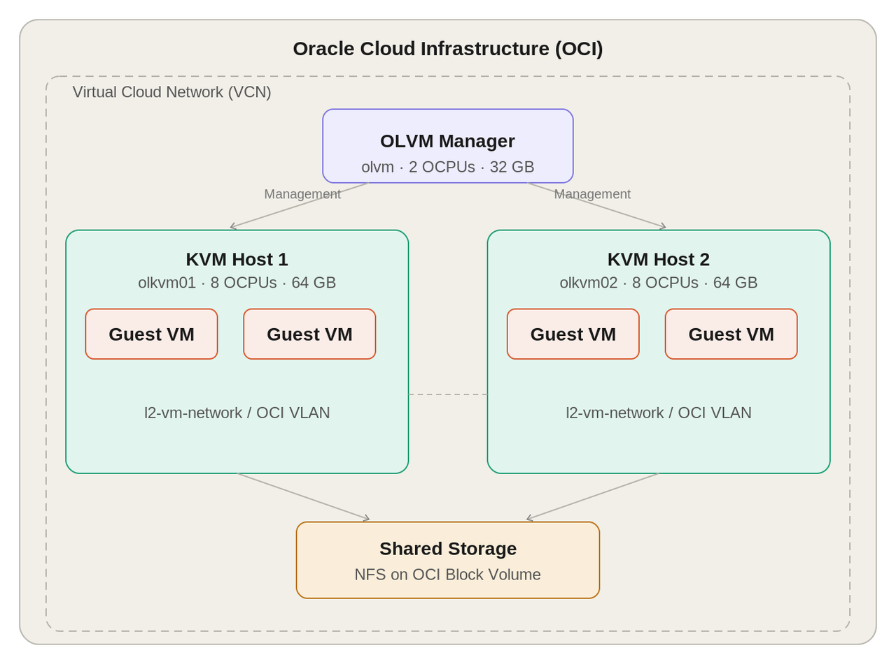

# Introduction

## About this Workshop

Oracle Linux Virtualization Manager (OLVM) provides KVM-based virtualization and centralized management for Oracle Linux environments. In this beginner workshop, you will deploy OLVM on Oracle Cloud Infrastructure (OCI), configure a two-host KVM cluster, set up networking and storage, deploy a multi-tier application, and perform live migration.

> **Note: This tutorial is only for testing and evaluation purposes; Oracle Linux Virtualization Manager support for OCI is under development and is not supported to manage OCI systems.**

**Estimated Workshop Time:** 5-6 hours of hands-on work, including the Ansible setup lab.

### Audience and Delivery Model

This workshop is designed for instructor-led enablement sessions for Oracle solution engineers and partners. It has been validated in guided delivery.

If you complete the workshop outside a guided session, use each checkpoint before moving on. Do not assume a later lab can be started safely while an earlier lab is still completing long-running work.

### Workshop Flow

This workshop is organized into the following labs:

1. **Lab 1: Build E5 OCI Infrastructure with Ansible** - Use a temporary bootstrap instance and Ansible to build the E5 OCI environment.
2. **Lab 2: Deploy OLVM Engine** - Connect to the manager via SSH, install the OLVM engine, and validate portal access.
3. **Lab 3: Configure KVM Cluster** - Add `olkvm01` and `olkvm02` to the default cluster and wait for both hosts to reach `Up`.
4. **Lab 4: Set Up Networking, Storage, and VM** - Create the VM network, add shared storage, import the Oracle Linux template, and validate the first VM.
5. **Lab 5: Deploy Multi Tier Application** - Import the application OVAs, power on the database and web application VMs, and validate the Employee Directory application.
6. **Lab 6: Perform Live Migration** - Migrate a running VM between hosts with no planned downtime.

**End Result:** A working OLVM deployment on OCI with a two-host KVM cluster, shared storage, multiple virtual machines, and a running Employee Directory application.

### Workshop Rules

Follow these rules throughout the workshop:

- Complete the labs in order.
- Do not start Lab 4 until both KVM hosts in Lab 3 show status `Up`.
- Do not start Lab 5 until Lab 4 confirms the logical network, KVM host `l2-vm-network` addresses, storage domain, template import, and test VM are all working.
- Treat the documented wait times as part of the workshop. Long-running tasks are expected.
- If a step runs materially longer than the documented range and you cannot verify progress, stop and contact the instructor or workshop owner before changing the environment manually.
- In the E5 topology, guest VMs on `l2-vm-network` are accessed through the KVM host shown in the VM **Host** column. The `olvm` manager controls the VMs, but it is not used as the direct network path to guest VM IP addresses.
- In Lab 5, keep the Employee Directory database VM and web application VM on the same KVM host. Cross-host application networking is not part of the beginner path.

### Objectives

In this workshop, you will:

- Deploy Oracle Linux Virtualization Manager (OLVM) Engine and verify portal access
- Add and configure KVM hosts in a cluster
- Configure logical networking for virtual machines
- Verify the OCI and OLVM network paths used by the manager, KVM hosts, and virtual machines
- Configure shared storage domains and import VM templates
- Deploy and validate virtual machines
- Deploy a multi-tier application and perform live migration

### Prerequisites

This workshop assumes you have:

- Access to an Oracle Cloud Infrastructure tenancy and the target compartment for the lab
- Permission to create OCI networking, compute, and storage resources required by the workshop
- A local SSH client from Windows PowerShell, macOS Terminal, or a Linux terminal
- 4-5 hours available for the hands-on portion
- A note-taking tool for recording hostnames, IP addresses, and credentials
- Basic familiarity with Linux command line usage, SSH, and terminal workflows

### Required: OCI IAM Policies

Before starting the workshop, confirm that your OCI user has permission to create the compute, networking, and storage resources used by the lab.

Lab 1 builds the lab infrastructure with Ansible and includes a setup checkpoint for the generated instances and SSH access.

The simplest IAM policy model is to create a dedicated compartment for the workshop and grant the lab group full access inside only that compartment:

```text
Allow group <group-name> to manage all-resources in compartment <compartment-name>
```

If your tenancy requires narrower policies, use these as a starting point:

```text
Allow group <group-name> to manage instance-family in compartment <compartment-name>
Allow group <group-name> to manage virtual-network-family in compartment <compartment-name>
Allow group <group-name> to manage volume-family in compartment <compartment-name>
Allow group <group-name> to read app-catalog-listings in tenancy
```

The workshop user must be able to create the required OCI resources in the target compartment.

### Required: OCI Service Limits and Quotas

Before workshop day, confirm that the target OCI tenancy, region, and compartment have enough available service limits for compute, memory, block storage, public IPs, VCN networking, and VLANs. If your tenancy is new, restricted, or close to its service limits, ask your tenancy administrator to review OCI **Limits, Quotas and Usage** before starting the workshop.

The OLVM hosts are provisioned with `VM.Standard.E5.Flex` shapes:

- `olvm`: `2 OCPUs`, `32 GB` memory
- `olkvm01`: `8 OCPUs`, `64 GB` memory
- `olkvm02`: `8 OCPUs`, `64 GB` memory

This E5 version of the workshop builds the environment with Ansible. E4 shapes are no longer available in many OCI regions, and the E5 path depends on the correct VNIC, VLAN, route-table, and shared-volume layout.

The instructor or workshop owner should verify service limits before the workshop. If a quota or service limit is insufficient, OCI may fail while creating the compute, networking, VLAN, or block volume resources before class.

### Required: Layer 2 Network Virtualization / VLAN Support

This workshop creates a VLAN inside an OCI Virtual Cloud Network (VCN). The VLAN provides the Layer 2 network used by the virtual machines that run on the KVM hosts.

Before workshop day, confirm with your tenancy administrator that VLAN / Layer 2 network virtualization is available in the target OCI region and compartment. Lab 1 includes this check before the OLVM labs begin.

If VLANs are not available, submit a support or service-limit request before starting the workshop. Lab 1 cannot be completed if the required VLAN capability is not enabled.

## About Product/Technology

**Oracle Linux Virtualization Manager (OLVM)** is an open-source, enterprise-grade virtualization management platform for Oracle Linux KVM environments. It provides a centralized web-based portal for deploying, monitoring, and managing KVM-based virtual machines across one or more hypervisor hosts. OLVM is supported by Oracle and integrates with Oracle Linux.

**KVM, or Kernel-based Virtual Machine,** is the hypervisor built into the Linux kernel. It provides the virtualization layer that allows Oracle Linux hosts to run virtual machines.

**Oracle Cloud Infrastructure (OCI)** is Oracle's cloud platform. In this workshop, OCI provides the compute instances, networking, and storage resources used to host the OLVM environment.

**Ansible** is an automation tool used to define and provision infrastructure consistently. Lab 1 uses an Ansible playbook to create the workshop infrastructure so each participant starts with a consistent environment.

**OCI VLANs** provide the Layer 2 network used by guest virtual machines. This network allows VMs running on the KVM hosts to communicate through the workshop's virtualized network path.

   
   *Workshop topology for OLVM on OCI, including the OLVM manager, two KVM hosts, guest VMs, OCI VLAN-based Layer 2 VM networking, and shared storage.*

## Learn More

- Oracle Linux Virtualization Manager install lab (official): <https://docs.oracle.com/en/learn/olvm-install/index.html>

- Oracle Linux Virtualization Manager Documentation: <https://docs.oracle.com/en/virtualization/oracle-linux-virtualization-manager/>

## Acknowledgements

- **Author** - Shawn Kelley, Mark Atkinson, John Priest, Perside Foster
- **Contributor** - Marvin Kim
- **Last Updated By/Date** - Perside Foster, Jul 2026
