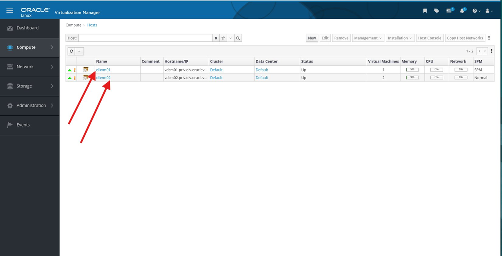

# Configure KVM Cluster

## Introduction

In this lab, you will prepare both KVM hosts and add them to the OLVM default cluster. When the lab is complete, `olkvm01` and `olkvm02` should both reach `Up` status and be ready for networking, storage, and VM placement.

Estimated Time: 45-60 minutes, including host installation and status transitions.

### Video Walkthrough

This walkthrough video is silent and does not include audio narration.

[](video:https://objectstorage.us-ashburn-1.oraclecloud.com/n/idhwewbjlvpy/b/olvm-on-oci/o/videos%2Fvideos_olvm-on-oci-lab3-no-presenter.mp4)

### Objectives

In this lab, you will:

- Configure the required repositories on both KVM hosts
- Add `olkvm01` and `olkvm02` to the **Default** cluster in the Administration Portal
- Wait for both hosts to reach **Up** status
- Confirm both hosts are ready for Lab 4

### Prerequisites

This lab assumes you have:

- Completed the Lab 2 checkpoint
- Access to the OLVM Administration Portal
- SSH access to the OLVM manager from your local machine
- SSH connectivity from `olvm` to both KVM hosts

> **Important:** Do not start Lab 4 until both hosts show status `Up`. Starting network or storage tasks while a host is still installing can leave the environment inconsistent.

## Task 1: Configure the First KVM Host (`olkvm01`)

1. From your local PowerShell window, connect to the OLVM manager:

    ```bash
    <copy>ssh -i C:\Users\<you>\.ssh\olvm-cluster-id_rsa oracle@<olvm-public-ip></copy>
    ```

2. Connect to `olkvm01` and install the required packages:

    ```bash
    <copy>ssh olkvm01
    sudo dnf install -y oracle-ovirt-release-45-el8 kernel-uek-modules-extra
    sudo dnf update -y oracle-ovirt-release-45-el8</copy>
    ```

3. Reboot `olkvm01`:

    ```bash
    <copy>sudo reboot</copy>
    ```

    Your SSH session to `olkvm01` will close.

4. After 2-5 minutes, reconnect to `olkvm01`:

    ```bash
    <copy>ssh olkvm01</copy>
    ```

5. Clean DNF and run the pre-check:

    ```bash
    <copy>sudo dnf clean all</copy>
    ```

    ```bash
    <copy>sudo /usr/local/bin/olvm-pre-check.py</copy>
    ```

    If the pre-check reports extra enabled repositories, disable them and rerun the check:

    ```bash
    <copy>sudo dnf config-manager --set-disabled ol8_MySQL84 ol8_MySQL84_tools_community ol8_MySQL_connectors_community ol8_ksplice ol8_oci_included
    sudo /usr/local/bin/olvm-pre-check.py</copy>
    ```

6. Exit back to the manager host:

    ```bash
    <copy>exit</copy>
    ```

## Task 2: Add `olkvm01` to the Cluster

1. Switch to the **Administration Portal** in Firefox.

2. Navigate to **Compute -> Hosts**.

    

3. Click **New**.

4. Select the **Default** data center from the **Host Cluster** drop-down list.

5. For **Name**, enter:

    ```bash
    <copy>olkvm01</copy>
    ```

6. For **Hostname**, enter the private management FQDN:

    ```
    <copy>vdsm01.priv.olv.oraclevcn.com</copy>
    ```

    Do not use the `olkvm01.pub.olv.oraclevcn.com` name in this field. OLVM must manage the KVM host through the private management network.

    If you accidentally use the public hostname and the host becomes **Non Responsive**, remove that host entry from OLVM and add `olkvm01` again with `vdsm01.priv.olv.oraclevcn.com`.

7. Under **Authentication**, select **SSH Public Key**.

8. Switch back to the terminal and copy the engine public key to the host:

    ```bash
    <copy>sudo ssh-keygen -y -f /etc/pki/ovirt-engine/keys/engine_id_rsa | ssh olkvm01 -T "sudo tee -a /root/.ssh/authorized_keys"</copy>
    ```

9. Return to the browser and click **OK**.

10. When the **Power Management Configuration** dialog appears, click **OK** again. OCI instances do not use power management in this lab.

11. The host status moves through **Installing** and **Initializing** before it reaches **Up**.

    **Expected time:** 10-20 minutes.

    If the host does not reach **Up** after 25 minutes, stop and contact the instructor or workshop owner before changing the host manually.

12. Wait for `olkvm01` to show status **Up** before you continue.

## Task 3: Configure the Second KVM Host (`olkvm02`)

1. From the manager terminal, connect to `olkvm02` and install the required packages:

    ```bash
    <copy>ssh olkvm02
    sudo dnf install -y oracle-ovirt-release-45-el8 kernel-uek-modules-extra
    sudo dnf update -y oracle-ovirt-release-45-el8</copy>
    ```

2. Reboot `olkvm02`:

    ```bash
    <copy>sudo reboot</copy>
    ```

    Your SSH session to `olkvm02` will close.

3. After 2-5 minutes, reconnect to `olkvm02`:

    ```bash
    <copy>ssh olkvm02</copy>
    ```

4. Clean DNF and run the pre-check:

    ```bash
    <copy>sudo dnf clean all</copy>
    ```

    ```bash
    <copy>sudo /usr/local/bin/olvm-pre-check.py</copy>
    ```

    If the pre-check reports extra enabled repositories, disable them and rerun the check:

    ```bash
    <copy>sudo dnf config-manager --set-disabled ol8_MySQL84 ol8_MySQL84_tools_community ol8_MySQL_connectors_community ol8_ksplice ol8_oci_included
    sudo /usr/local/bin/olvm-pre-check.py</copy>
    ```

5. Exit back to the manager host:

    ```bash
    <copy>exit</copy>
    ```

## Task 4: Add `olkvm02` to the Cluster

1. In the **Administration Portal**, navigate to **Compute -> Hosts -> New**.

2. Select the **Default** data center from the **Host Cluster** drop-down list.

3. For **Name**, enter:

    ```
    <copy>olkvm02</copy>
    ```

4. For **Hostname**, enter the private management FQDN:

    ```
    <copy>vdsm02.priv.olv.oraclevcn.com</copy>
    ```

    Do not use the `olkvm02.pub.olv.oraclevcn.com` name in this field. OLVM must manage the KVM host through the private management network.

    If you accidentally use the public hostname and the host becomes **Non Responsive**, remove that host entry from OLVM and add `olkvm02` again with `vdsm02.priv.olv.oraclevcn.com`.

5. Under **Authentication**, select **SSH Public Key**.

6. Switch to the terminal and copy the engine public key to the host:

    ```bash
    <copy>sudo ssh-keygen -y -f /etc/pki/ovirt-engine/keys/engine_id_rsa | ssh olkvm02 -T "sudo tee -a /root/.ssh/authorized_keys"</copy>
    ```

7. Return to the browser and click **OK**, then click **OK** again in the power management dialog.

8. Wait for `olkvm02` to show status **Up** before you continue.

    

    **Expected time:** 10-20 minutes.

    If the host does not reach **Up** after 25 minutes, stop and contact the instructor or workshop owner before changing the host manually.

## Configure KVM Cluster Checkpoint

At this point, you should have:

- `olkvm01` showing status **Up**
- `olkvm02` showing status **Up**
- Both hosts in the **Default** cluster
- No host installation tasks still running

You are ready for Lab 4 only when all checkpoint items above are complete.

You may now **proceed to the next lab**

## Learn More

- Oracle Linux Virtualization Manager install lab (official): https://docs.oracle.com/en/learn/olvm-install/index.html

## Acknowledgements

- **Author** - Shawn Kelley, Perside Foster
- **Contributor** - Marvin Kim
- **Last Updated By/Date** - Perside Foster, May 20, 2026
