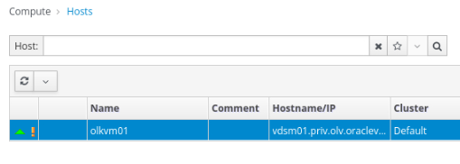

# Perform Live Migration

## Introduction

Live migration moves a running virtual machine from one KVM host to another without planned downtime. In this beginner lab, you will migrate the standalone `ol9-vm1` test VM created in Lab 4. The Employee Directory application VMs stay together on the same host from Lab 5.

Estimated Time: 10-15 minutes

### Video Walkthrough

This walkthrough video is silent and does not include audio narration.

[](video:https://objectstorage.us-ashburn-1.oraclecloud.com/n/idhwewbjlvpy/b/olvm-on-oci/o/videos%2Fvideos_olvm-on-oci-lab8-no-presenter.mp4)

### Objectives

In this lab, you will:

- Verify both KVM hosts are ready for migration
- Confirm `ol9-vm1` is running before migration
- Migrate `ol9-vm1` from one KVM host to the other
- Verify the VM remains reachable after migration

### Prerequisites

This lab assumes you have:

- Completed the Lab 5 checkpoint
- Both KVM hosts showing status **Up**
- A working shared storage domain
- `ol9-vm1` imported from the Oracle Linux template in Lab 4
- Access to the Administration Portal from your local browser

> **Important:** Do not migrate only one Employee Directory application VM in the beginner path. Lab 5 keeps the application database and web VMs on the same KVM host for reliable application connectivity.

## Task 1: Refresh the OLVM Engine

1. From the `olvm` terminal, restart the OLVM engine:

    ```bash
    <copy>sudo systemctl restart ovirt-engine</copy>
    ```

2. Wait 2-3 minutes for the engine to restart.

3. Refresh the Administration Portal in your browser and sign in again if prompted.

## Task 2: Verify Migration Prerequisites

1. In the Administration Portal, go to **Compute -> Hosts**.

2. Verify that both hosts show status **Up**:

    - `olkvm01`
    - `olkvm02`

    

3. Go to **Compute -> Virtual Machines**.

4. Locate `ol9-vm1`.

5. If `ol9-vm1` is **Down**, start it on `olkvm01`:

    - Select `ol9-vm1`
    - Click the drop-down arrow next to **Run**
    - Click **Run Once**
    - Select the host option and choose `olkvm01`
    - Click **OK**

6. Wait until `ol9-vm1` shows status **Up**.

7. Record the current **Host** column for `ol9-vm1`. You will migrate the VM to the other host.

## Task 3: Perform Live Migration

1. In **Compute -> Virtual Machines**, select `ol9-vm1`.

2. Click **Migrate**.

3. In the **Migrate Virtual Machine** dialog, select the other host as the destination.

    - If `ol9-vm1` is running on `olkvm01`, select `olkvm02`
    - If `ol9-vm1` is running on `olkvm02`, select `olkvm01`

4. Click **Migrate**.

5. Watch the VM status while migration runs. It may show **Migrating From** or **Migrating To**.

    **Expected time:** 30-90 seconds.

6. Wait until `ol9-vm1` returns to status **Up**.

## Task 4: Verify Migration Success

1. In the Virtual Machines list, confirm that `ol9-vm1` now shows the destination host in the **Host** column.

2. From the `olvm` terminal, test connectivity through the destination KVM host.

    If `ol9-vm1` migrated to `olkvm01`, run:

    ```bash
    <copy>ssh olkvm01 "ping -c 3 10.0.10.105"</copy>
    ```

    If `ol9-vm1` migrated to `olkvm02`, run:

    ```bash
    <copy>ssh olkvm02 "ping -c 3 10.0.10.105"</copy>
    ```

3. Connect to the migrated VM through the destination KVM host.

    If `ol9-vm1` migrated to `olkvm01`, run:

    ```bash
    <copy>ssh -tt olkvm01 "ssh opc@10.0.10.105"</copy>
    ```

    If `ol9-vm1` migrated to `olkvm02`, run:

    ```bash
    <copy>ssh -tt olkvm02 "ssh opc@10.0.10.105"</copy>
    ```

4. Verify you are connected to `ol9-vm1`:

    ```bash
    <copy>hostname
    ip -br addr</copy>
    ```

5. Exit the VM:

    ```bash
    <copy>exit</copy>
    ```

## Perform Live Migration Checkpoint

At this point, you should have:

- `ol9-vm1` successfully migrated from one KVM host to the other
- `ol9-vm1` still showing status **Up**
- The VM reachable through the destination KVM host
- The Employee Directory application left unchanged from Lab 5

## Conclusion

Congratulations. You completed the beginner OLVM on OCI E5 workshop. You built the OCI infrastructure with Ansible, deployed OLVM, configured a two-host KVM cluster, created VM networking and shared storage, deployed the Employee Directory application, and performed live migration.

## Learn More

- Oracle Linux Virtualization Manager install lab (official): https://docs.oracle.com/en/learn/olvm-install/index.html
- Oracle Luna Labs: https://luna.oracle.com/

## Acknowledgements

- **Author** - Shawn Kelley, Perside Foster
- **Contributor** - Marvin Kim
- **Last Updated By/Date** - Perside Foster, May 20, 2026
