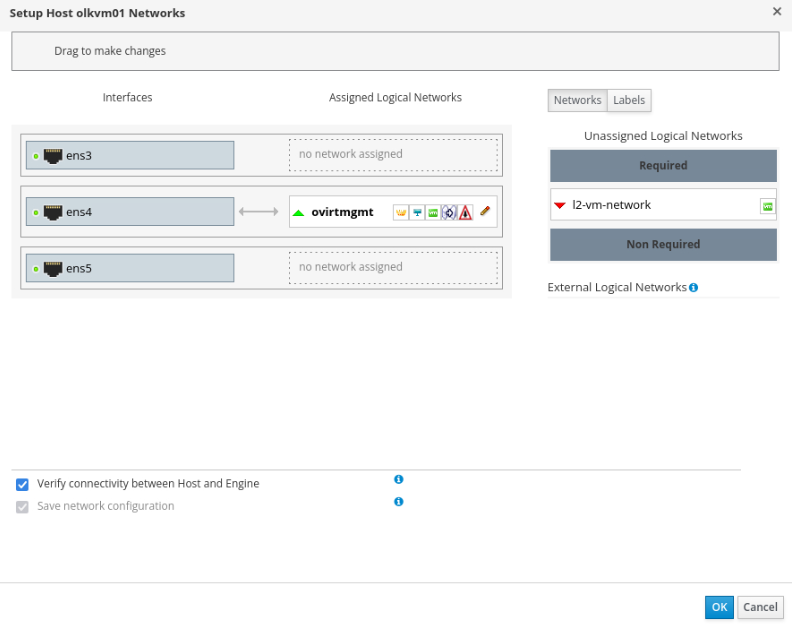
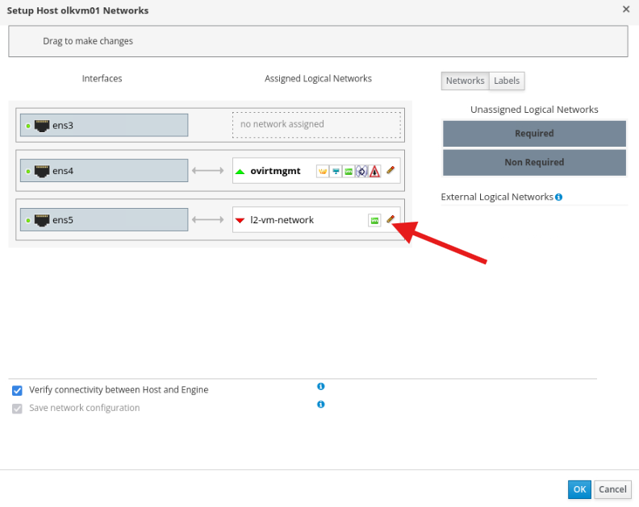
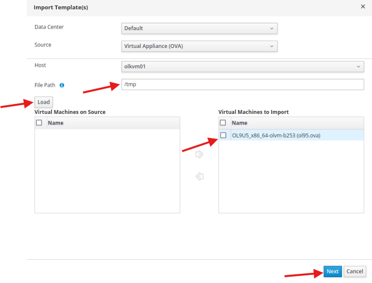

# Set Up Networking, Storage, and VM

## Introduction

In this lab, you will create the logical network for guest traffic, add shared storage, import an Oracle Linux template, and deploy a test VM to verify the environment before you move on to Lab 5.

Estimated Time: 40-60 minutes, including OVA download and template import time.

### Video Walkthrough

This walkthrough video is silent and does not include audio narration.

[](video:https://objectstorage.us-ashburn-1.oraclecloud.com/n/idhwewbjlvpy/b/olvm-on-oci/o/videos%2Fvideos_olvm-on-oci-lab4-no-presenter.mp4)

### Objectives

In this lab, you will:

- Create the `l2-vm-network` logical network
- Assign that network to both KVM hosts with static host addresses
- Add a shared Fibre Channel storage domain
- Import an Oracle Linux template
- Create and validate the `ol9-vm1` test VM

### Prerequisites

This lab assumes you have:

- Completed the Lab 3 checkpoint
- Both KVM hosts showing status **Up**
- Access to the Administration Portal
- SSH access to the OLVM manager from your local machine

> **Important:** Do not start this lab while either host is still `Installing`, `Initializing`, or `Non Operational`.
>
> **Important:** Do not start Lab 5 until this lab's checkpoint is complete.

## Task 1: Create a Logical Network

1. In the **Administration Portal**, navigate to **Network -> Networks**.

2. Click **New**.

3. Leave **Data Center** set to **Default**.

4. For **Name**, enter:

    ```
    <copy>l2-vm-network</copy>
    ```

5. Leave **VM Network** selected.

6. Click **OK**.

## Task 2: Assign the Logical Network to `olkvm01`

1. Navigate to **Compute -> Hosts**.

2. Click the `olkvm01` host name.

3. Open the **Network Interfaces** tab.

4. Click **Setup Host Networks**.

    

5. Drag `l2-vm-network` from **Unassigned Logical Networks** on the left side into the physical interface box on the right side (for example, `ens5`).

    > **Tip:** Look for the interface that does **not** already have `ovirtmgmt` assigned to it. That is the correct interface for VM traffic.

    

6. In the same **Setup Host Networks** dialog, configure the `l2-vm-network` address for `olkvm01`.

    Click the orange pencil on the `l2-vm-network` row, open **IPv4**, and enter:

    | Field | Value |
    |---|---|
    | Boot Protocol | `Static` |
    | Address | `10.0.10.254` |
    | Netmask | `255.255.255.0` |
    | Gateway | Leave blank |
    | DNS Servers | Leave blank |

    This address is used as the KVM-host access and test address for the VM network. Do not configure a gateway or DNS server on `l2-vm-network`.

7. Click **OK** and wait for the network setup task to finish before you continue.

## Task 3: Assign the Logical Network to `olkvm02`

1. Navigate to **Compute -> Hosts**.

2. Click the `olkvm02` host name.

3. Open the **Network Interfaces** tab.

4. Click **Setup Host Networks**.

5. Drag `l2-vm-network` from **Unassigned Logical Networks** to the physical interface box on the right, using the same interface you used for `olkvm01`.

6. In the same **Setup Host Networks** dialog, configure the `l2-vm-network` address for `olkvm02`.

    Click the orange pencil on the `l2-vm-network` row, open **IPv4**, and enter:

    | Field | Value |
    |---|---|
    | Boot Protocol | `Static` |
    | Address | `10.0.10.253` |
    | Netmask | `255.255.255.0` |
    | Gateway | Leave blank |
    | DNS Servers | Leave blank |

    This address makes `olkvm02` usable as the access host when OLVM runs a VM on `olkvm02`.

7. Click **OK** and wait for the network setup task to finish before you continue.

## Task 4: Add a Fibre Channel Data Domain

1. Navigate to **Storage -> Domains**.

2. Click **New Domain**.

3. For **Name**, enter:

    ```
    <copy>amd-storage-domain-01</copy>
    ```

4. Set **Data Center** to **Default**.

5. Set **Domain Function** to **Data**.

6. Set **Storage Type** to **Fibre Channel**.

7. Set **Host to Use** to **olkvm01**.

8. When the available LUNs appear, click **Add** next to the first LUN ID.

9. Click **OK**.

10. Use **Tasks** in the upper-right corner to monitor progress.

11. Wait for **Cross Data Center Status** to show **Active** before you continue.

    **Expected time:** 5-10 minutes.

    If the domain is still not active after 15 minutes, or the LUN list never appears, stop and contact the instructor or workshop owner before changing the storage configuration manually.

## Task 5: Import a Virtual Machine Template

> **Important:** Start the OVA download in the terminal **before** clicking Load in the browser. The browser dialog will return no results if the file is not yet present on the host.

1. Switch to the manager terminal and make sure you are on the `olvm` host.

2. Download the OVA template to `olkvm01`:

    ```bash
    <copy>ssh olkvm01 "curl -L https://yum.oracle.com/templates/OracleLinux/OL9/u5/x86_64/OL9U5_x86_64-olvm-b253.ova -o /tmp/ol95.ova"</copy>
    ```

    **Expected time:** 10-20 minutes, depending on download speed. Wait for the `curl` command to complete and return you to the shell prompt before continuing.

3. Navigate to **Compute -> Templates -> Import**.

4. Keep the default values for **Data Center** and **Source**, and select **olkvm01** for **Host**.

5. For **File Path**, enter:

    ```bash
    <copy>/tmp</copy>
    ```

    

6. Click **Load**.

7. In **Virtual Machines on Source**, select the OVA template.

8. Click the **Right Arrow** to move it to **Virtual Machines to Import**.

9. Click **Next**.

10. Review the template information, then click **OK**.

11. Wait for the template import status to show **OK** before you continue.

    **Expected time:** 10-20 minutes.

    Do not create the test VM until the import finishes successfully.

## Task 6: Create a Test Virtual Machine (`ol9-vm1`)

1. Navigate to **Compute -> Virtual Machines -> New**.

2. Set **Template** to `OL9U5x8664-olvm-b253`.

3. Set **Operating System** to `Oracle Linux 9.x x64`.

4. Set **Name** to `ol9-vm1`.

5. Set `nic1` to `l2-vm-network`.

    If the dialog shows **vNIC Profile**, select `l2-vm-network` there.

6. Click **Show Advanced Options**.

7. Open **Initial Run** and select **Use Cloud-Init/Sysprep**.

    The password and static IP settings in the next steps are applied by Cloud-Init during the first boot. If this option is not selected, the VM can start but may not receive the expected IP address or password.

8. Open **Initial Run -> Authentication** and enter:

    - **User Name:** `opc`
    - **Password / Verify Password:** `oracle`

9. Open **Networks** and enter:

    - **DNS Servers:** `169.254.169.254`  (OCI Internet and VCN Resolver)
    - Check **In-guest Network Interface Name**, then click **Add New**
    - **Name:** `eth0`
    - **IPv4 Boot Protocol:** `Static`
    - **IPv4 Address:** `10.0.10.105`
    - **IPv4 Netmask:** `255.255.255.0`
    - **IPv4 Gateway:** `10.0.10.1`

    `10.0.10.1` is the VLAN gateway for the VM network. Use it as the gateway, not as the DNS server.

10. Click **OK**.

11. Use **Tasks** in the upper-right corner to monitor VM creation.

12. Wait until `ol9-vm1` appears in the **Virtual Machines** list with status **Down**.

    Do not click **Run** until the VM creation task finishes.

## Task 7: Run the Test Virtual Machine

1. Select `ol9-vm1` and click **Run**.

2. Wait for the VM status to change to **Up**.

3. In the Virtual Machines list, check the **Host** column for `ol9-vm1`.

    The VM can run on either `olkvm01` or `olkvm02`. If the VM is running on `olkvm02`, verifying only `olkvm01` is not enough. The host shown in this column must have `l2-vm-network` assigned and up.

4. Open the `ol9-vm1` **Network Interfaces** tab and confirm `nic1` is using `l2-vm-network`.

    The interface should be plugged and linked. If `nic1` is missing, unplugged, unlinked, or using the wrong profile, shut down the VM, edit the VM network interface, select `l2-vm-network`, then start the VM again.

5. From your local PowerShell window, connect to the OLVM manager.

    ```bash
    <copy>ssh -i C:\Users\<you>\.ssh\olvm-cluster-id_rsa oracle@<olvm-public-ip></copy>
    ```

6. Confirm the KVM host has an address on `l2-vm-network`.

    If `ol9-vm1` is running on `olkvm01`, run:

    ```bash
    <copy>ssh olkvm01 "ip -4 -br addr show l2-vm-network"</copy>
    ```

    If `ol9-vm1` is running on `olkvm02`, run:

    ```bash
    <copy>ssh olkvm02 "ip -4 -br addr show l2-vm-network"</copy>
    ```

    Record the IPv4 address before the `/`. For example, if the output shows `10.0.10.254/24`, record `10.0.10.254`.

    Expected values from Tasks 2 and 3 are:

    | KVM Host | Expected `l2-vm-network` Address |
    |---|---|
    | `olkvm01` | `10.0.10.254/24` |
    | `olkvm02` | `10.0.10.253/24` |

7. Connect to `ol9-vm1` through the KVM host shown in the **Host** column.

    If `ol9-vm1` is running on `olkvm01`, run:

    ```bash
    <copy>ssh -tt olkvm01 "ssh opc@10.0.10.105"</copy>
    ```

    If `ol9-vm1` is running on `olkvm02`, run:

    ```bash
    <copy>ssh -tt olkvm02 "ssh opc@10.0.10.105"</copy>
    ```

    Log in with the password defined in Task 6.

    If SSH times out, keep the `olvm` terminal open and run these checks. Replace `olkvm01` with `olkvm02` if the VM is running on `olkvm02`.

    ```bash
    <copy>ssh olkvm01 "ping -c 3 10.0.10.105"
    ssh olkvm01 "ip -br addr | grep l2-vm-network"</copy>
    ```

    Use the results to choose the next action:

    | Result | Meaning | Next Action |
    |---|---|---|
    | Ping from the KVM host succeeds, SSH fails | VM network works, but guest SSH or login is not ready | Recreate `ol9-vm1` from Task 6 and confirm **Use Cloud-Init/Sysprep** is selected before first boot |
    | Ping from the KVM host fails | VM is not reachable on `l2-vm-network` | Confirm `nic1` is plugged, linked, and using `l2-vm-network`; then recreate `ol9-vm1` if needed |

    Do not continue troubleshooting from the browser console during a beginner workshop.

8. Verify the network settings:

    ```bash
    <copy>ip -br addr
    ip route</copy>
    ```

    The output should show `10.0.10.105` on the guest network interface. It should also show the static route settings that Cloud-Init applied during first boot.

9. Verify the VM can reach the KVM host on `l2-vm-network`.

    ```bash
    <copy>ping -c 3 <kvm-l2-ip></copy>
    ```

    Replace `<kvm-l2-ip>` with the address you recorded in step 6.

    This ping should succeed. Do not use `10.0.10.1`, DNS, or internet access as the success test in this lab. Guest internet access is not required for Lab 5.

10. Exit the VM:

    ```bash
    <copy>exit</copy>
    ```
## Set Up Networking, Storage, and VM Checkpoint

At this point, you should have:

- `l2-vm-network` assigned to both hosts
- `olkvm01` has `10.0.10.254/24` on `l2-vm-network`
- `olkvm02` has `10.0.10.253/24` on `l2-vm-network`
- The Fibre Channel storage domain in **Active** state
- The Oracle Linux template imported successfully
- `ol9-vm1` running with IP address `10.0.10.105`
- Verified `ol9-vm1` can reach its KVM host on `l2-vm-network`

You are ready for Lab 5 only when all checkpoint items above are complete.

You may now **proceed to the next lab**

## Learn More

- Oracle Linux Virtualization Manager install lab (official): https://docs.oracle.com/en/learn/olvm-install/index.html

## Acknowledgements

- **Author** - Shawn Kelley, Perside Foster
- **Contributor** - Marvin Kim
- **Last Updated By/Date** - Perside Foster, May 20, 2026
