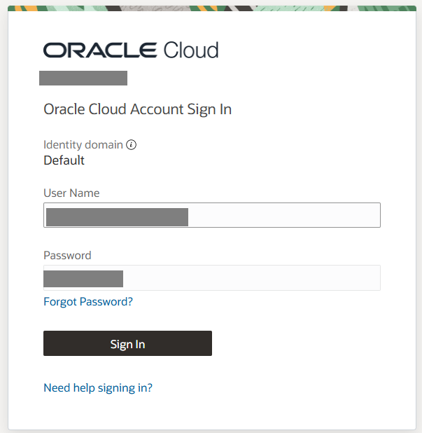
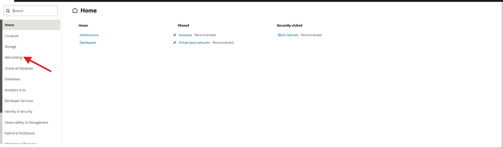
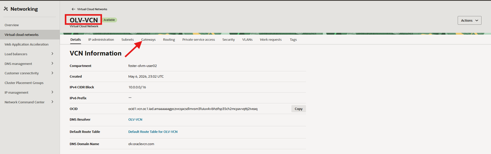
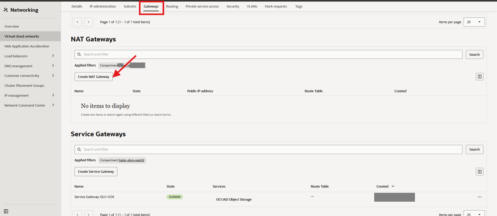
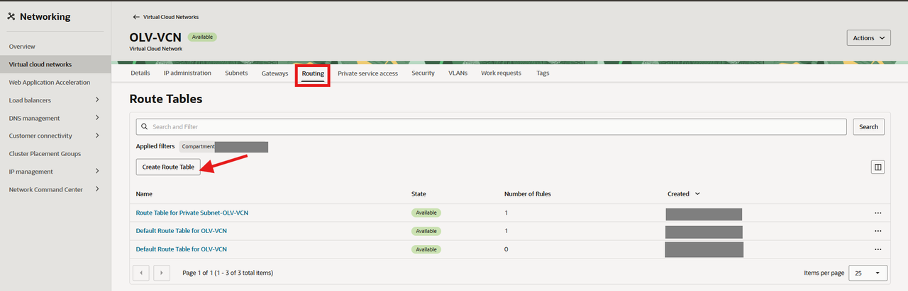
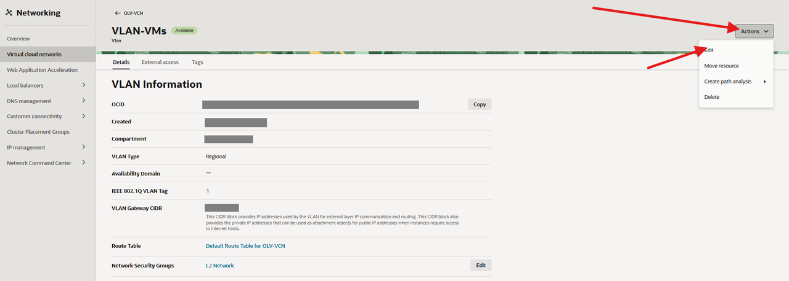
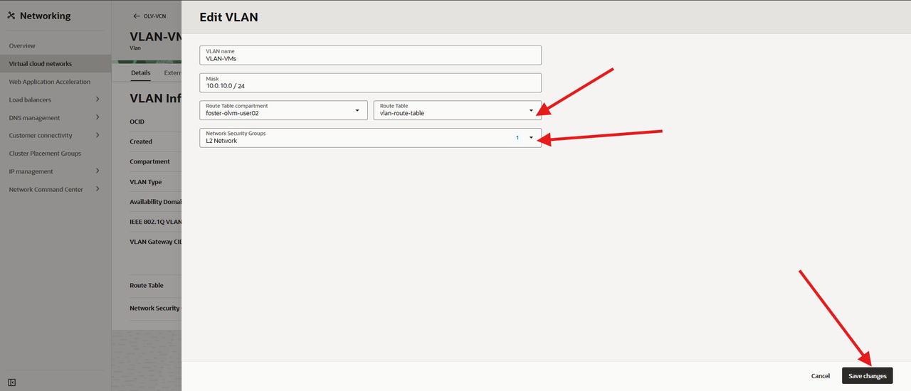
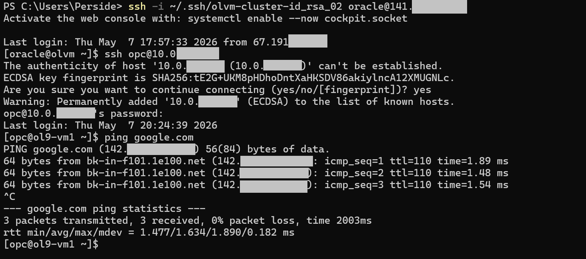

# Optional: Configure OCI NAT Gateway for VM Internet Access

## Introduction

In this optional lab, you will explore outbound internet access for VMs on the VLAN. This lab is not required for the multi-tier application lab. The application lab uses internal `l2-vm-network` connectivity between VMs.

> **OCI-specific step:**
> In a real on-prem OLVM deployment, physical routers and firewalls provide internet access for VLAN-based VM networks.
> In OCI, VLANs are isolated by default, so you configure a NAT Gateway to enable outbound connectivity.

### Objectives

In this lab, you will:

- Create an OCI NAT Gateway for outbound VM traffic
- Create a route table that sends `0.0.0.0/0` traffic to the NAT Gateway
- Associate the route table with the VLAN used by the OLVM VMs
- Access a VM on the VLAN by jumping through the KVM host running the VM

Estimated Time: 15-25 minutes

> **Important:** Do not use this lab as the success test for Lab 4 or the prerequisite for Lab 6. Lab 4 validates VM network access through the KVM hosts, and Lab 6 validates application traffic inside `l2-vm-network`.

### Video Walkthrough

This walkthrough video is silent and does not include audio narration.

[](video:https://objectstorage.us-ashburn-1.oraclecloud.com/n/idhwewbjlvpy/b/olvm-on-oci/o/videos%2Fvideos_olvm-on-oci-lab5-no-presenter.mp4)

## Prerequisites

This lab assumes you have:

- Completed Lab 4 or later so the OLV-VCN and VLAN already exist
- Access to the Luna Desktop and the workshop OCI Console link
- The SSH private key and public IP address for the `olvm` host
- Permission to create OCI NAT Gateways and Route Tables in the target compartment

## Task 1: Create a NAT Gateway

1. From your browser, sign in to OCI.

    


2. From the OCI Console navigation menu, click **Networking -> Virtual Cloud Networks**.

    

3. Click the name of your Virtual Cloud Network (VCN) in the table. Then click the **Gateway** tab.
    - **Name:** `OLV-VCN`

    

4. From the `OLV-VCN` `Gateways page` click **NAT Gateways** tab.

    

5. Click **Create NAT Gateway**.

6. Configure the NAT Gateway:

    - **Name:** `vm-nat-gateway`
    - **Create In Compartment:** leave the default value
    - **Ephemeral Public IP Address:** selected by default

7. Click **Create NAT Gateway**.

    The NAT Gateway is created and displays in the list.

## Task 2: Create a Route Table for the VLAN

1. From the `OLV-VCN` page click **Routing** tab.

    

2. Click **Create Route Table**.

3. Configure the route table:

    - **Name:** `vlan-route-table`
    - **Create In Compartment:** leave the default value

4. Click **+ Another Route Rule** and configure the route:

    - **Target Type:** NAT Gateway
    - **Destination CIDR Block:** `0.0.0.0/0`
    - **Target NAT Gateway:** `vm-nat-gateway`

5. Click the **Create** button.

## Task 3: Associate the Route Table with the VLAN


1. From the `OLV-VCN` page click **VLANs** tab, then click the name of the VLAN in the table.

    


2. Click **Edit**.

    

3. Under **Route Table**, select `vlan-route-table`.

    

4. Click **Save Changes**.


## Task 4: Access a VLAN VM through the KVM host

The NAT Gateway only allows the VMs to reach the internet; it does not open a path for you to SSH directly into a VM from your laptop. To reach a VM on the 10.0.10.x network from your laptop, first connect to the `olvm` host, then jump through the KVM host that is running the VM.

1. From your laptop, open a terminal and connect to the `olvm` host by using the private key you created earlier.

    ```powershell
    ssh -i ~/.ssh/olvm-cluster-id_rsa oracle@<olvm-public-ip>
    ```

    Replace `<olvm-public-ip>` with the public IP address of your `olvm` instance.

2. From the `olvm` host, connect to the VM through the KVM host shown in the **Host** column for `ol9-vm1`.

    If `ol9-vm1` is running on `olkvm01`, run:

    ```bash
    <copy>ssh -tt olkvm01 "ssh opc@10.0.10.105"</copy>
    ```

    If `ol9-vm1` is running on `olkvm02`, run:

    ```bash
    <copy>ssh -tt olkvm02 "ssh opc@10.0.10.105"</copy>
    ```

3. If prompted, type `yes` to accept the host key.

4. Enter the `opc` user password for the VM if prompted.

5. Verify that you are connected to the VM and that outbound internet access works through the NAT Gateway.

    ```bash
    <copy>ip route
    getent hosts yum.oracle.com
    curl -I https://yum.oracle.com</copy>
    ```

    The name lookup and `curl` command should succeed. If SSH through the KVM host works but these commands fail, the VM is alive and the remaining issue is usually the VLAN route table association or NAT Gateway route rule.

    

6. Exit the VM:

    ```bash
    <copy>exit</copy>
    ```

## Optional OCI NAT Gateway Checkpoint

At this point, you should have:

- Created the `vm-nat-gateway` NAT Gateway
- Created the `vlan-route-table` route table
- Added a `0.0.0.0/0` route that targets the NAT Gateway
- Associated the route table with the VLAN used by the OLVM VMs
- Verified that a VLAN VM can be reached through its KVM host
- Verified that the VLAN VM has outbound internet access through the NAT Gateway

You may now **proceed to the next lab**

## Acknowledgements

- **Author** - Shawn Kelley, Perside Foster
- **Contributor** - Marvin Kim
- **Last Updated By/Date** - Perside Foster, May 8, 2026
