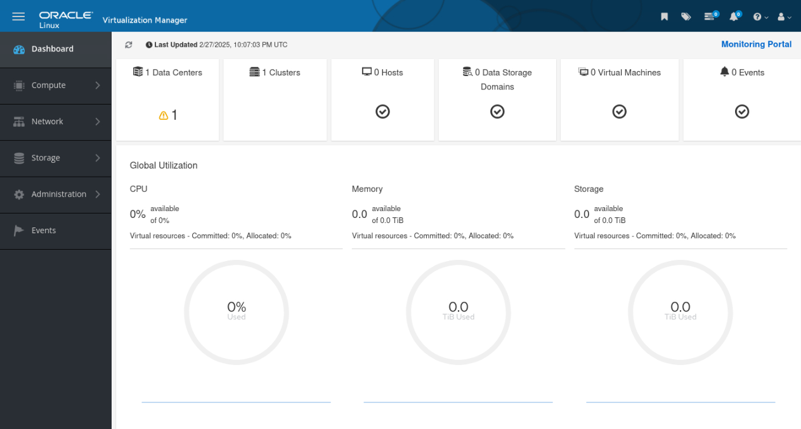

# Deploy OLVM Engine

## Introduction

In this lab, you will connect to the manager host created in Lab 1, install the required OLVM packages, run `engine-setup`, and validate access to the Administration Portal directly from your local browser.

Estimated Time: 40-60 minutes, including package download and engine setup time.

### Video Walkthrough

This walkthrough video is silent and does not include audio narration.

[](video:https://objectstorage.us-ashburn-1.oraclecloud.com/n/idhwewbjlvpy/b/olvm-on-oci/o/videos%2Fvideos_olvm-on-oci-lab2-no-presenter.mp4)

### Objectives

In this lab, you will:

- Connect to the OLVM manager using SSH from your local terminal
- Install the required OLVM repositories and engine packages
- Run `engine-setup` and record the `admin@ovirt` password
- Log in to the Administration Portal from your local browser and verify the deployment

### Prerequisites

This lab assumes you have:

- Completed the Lab 1 checkpoint
- Recorded the public IP address for `olvm`
- Created or retained the `olvm-cluster-id_rsa` private key on your local machine
- A local PowerShell terminal available
- A local browser (Chrome, Firefox, or Edge)

> **Important:** The Administration Portal is accessed directly from your local browser over HTTPS. No VNC client or SSH tunnel is required.

### Connection Reference

Use these connection paths throughout this and later labs:

- **Local machine -> OLVM manager shell:** `ssh -i C:\Users\<you>\.ssh\olvm-cluster-id_rsa oracle@<olvm-public-ip>`
- **Manager shell -> KVM hosts:** `ssh olkvm01` or `ssh olkvm02`
- **Manager shell -> guest VMs in later labs:** check the VM **Host** column, then use `ssh -tt <kvm-host> "ssh opc@<vm-ip>"`
- **Administration Portal (local browser):** `https://<olvm-fqdn>/ovirt-engine`

## Task 1: Connect to the Manager via SSH

1. From your local Windows machine, open a **PowerShell** window.

2. Connect to the OLVM manager:

    ```powershell
    <copy>ssh -i C:\Users\<you>\.ssh\olvm-cluster-id_rsa oracle@<olvm-public-ip></copy>
    ```

3. Verify you are on the correct host:

    ```bash
    <copy>hostname -f</copy>
    ```

    Record the FQDN output. You will need it in Task 3 to access the Administration Portal.

## Task 2: Install the Engine

1. Install the required packages:

    ```bash
    <copy>sudo dnf install -y oracle-ovirt-release-45-el8 kernel-uek-modules-extra</copy>
    ```

2. Reboot the system:

    ```bash
    <copy>sudo reboot</copy>
    ```

    **Important:** Your SSH session will disconnect during the reboot. Wait 2-3 minutes for the system to come back online, then reconnect before continuing.

3. Reconnect to the manager after reboot:

    ```powershell
    <copy>ssh -i C:\Users\<you>\.ssh\olvm-cluster-id_rsa oracle@<olvm-public-ip></copy>
    ```

4. Prepare DNF and verify the OLVM repositories are available:

    ```bash
    <copy>sudo dnf clean all
    sudo dnf repolist | egrep 'ovirt|kvm|gluster|UEKR7|baseos|appstream|addons'</copy>
    ```

5. Run the OLVM pre-check script:

    ```bash
    <copy>sudo /usr/local/bin/olvm-pre-check.py</copy>
    ```

    If the pre-check reports extra enabled repositories, disable them and rerun the check:

    ```bash
    <copy>sudo dnf config-manager --set-disabled ol8_MySQL84 ol8_MySQL84_tools_community ol8_MySQL_connectors_community ol8_ksplice ol8_oci_included
    sudo /usr/local/bin/olvm-pre-check.py</copy>
    ```

6. Install the OLVM engine package:

    ```bash
    <copy>sudo dnf install -y ovirt-engine</copy>
    ```

    This package install can take 10-15 minutes depending on repository speed.

7. Run the OLVM engine setup:

    ```bash
    <copy>sudo engine-setup --accept-defaults</copy>
    ```

    **Expected runtime:** 5-10 minutes.

    `engine-setup` still prompts you to set the `admin@ovirt` password. Use a strong password that includes uppercase, lowercase, a number, and a special character.

    > **Critical:** Write down the `admin@ovirt` password before you continue.

8. Open port 443 on the OS firewall to allow browser access to the Administration Portal:

    ```bash
    <copy>sudo firewall-cmd --zone=public --permanent --add-service=https
    sudo firewall-cmd --reload</copy>
    ```

9. Verify the rule is active:

    ```bash
    <copy>sudo firewall-cmd --list-services</copy>
    ```

    The output should include `https`.

## Task 3: Update Your Local Hosts File

The OLVM Administration Portal must be accessed using the engine's fully qualified domain name (FQDN). Because that FQDN is an internal OCI DNS name, your local browser cannot resolve it. Adding a single entry to your local hosts file maps the FQDN to the public IP of the `olvm` instance, which lets your browser reach the portal directly.

1. From your SSH session on the `olvm` instance, get the engine FQDN:

    ```bash
    <copy>hostname -f</copy>
    ```

    Record the FQDN. For example, `olvm.pub.olv.oraclevcn.com`.

2. On your local machine, edit the hosts file using the instructions for your operating system:

    **Windows:**
    - Type `cmd` in the Start menu, right-click **Command Prompt**, and select **Run as administrator**
    - Run the following command:

        ```bash
        <copy>notepad C:\Windows\System32\drivers\etc\hosts</copy>
        ```

    **macOS:**    
    ```bash
    <copy>sudo nano /etc/hosts</copy>
    ```

    **Linux:**
    ```bash
    <copy>sudo nano /etc/hosts</copy>
    ```

3. Add a line at the bottom of the file that maps the public IP of the `olvm` instance to the engine FQDN:

    ```
    <olvm-public-ip>   <olvm-fqdn>
    ```

    Example:

    ```
    141.148.13.243   olvm.pub.olv.oraclevcn.com
    ```

4. Save the file and close the editor.

## Task 4: Log in to the Administration Portal

1. Open your local browser. Firefox is recommended for this lab.

2. Navigate to the Administration Portal using the engine FQDN:

    ```
    <copy>https://<olvm-fqdn>/ovirt-engine</copy>
    ```

    For example: `https://olvm.pub.olv.oraclevcn.com/ovirt-engine`

    

3. Your browser displays a certificate warning because the lab uses a self-signed certificate. Click **Advanced -> Accept the Risk and Continue** (Firefox) or **Advanced -> Proceed** (Chrome/Edge).

4. On the landing page, click **Engine CA Certificate** to download it.

5. Import the certificate into your browser:

    **Firefox:**
    - Open browser menu -> **Settings**
    - Search for **cert**
    - Click **View Certificates... -> Import**
    - Select the downloaded certificate file
    - Check **Trust this CA to identify websites**
    - Click **OK**

    **Chrome / Edge:**
    - Open **Settings -> Privacy and Security -> Security -> Manage certificates**
    - Click **Import** and follow the wizard
    - Select the downloaded certificate file
    - Place it in the **Trusted Root Certification Authorities** store

6. Return to `https://<olvm-fqdn>/ovirt-engine` and click **Administration Portal**.

7. Sign in with:

    - Username: `admin@ovirt`
    - Password: the password you created during `engine-setup`

    The Administration Portal should open successfully. If the page is still starting, wait 1-2 minutes and refresh once.

    

## Deploy OLVM Engine Checkpoint

At this point, you should have:

- SSH access to the OLVM manager from your local machine
- OLVM engine installed and configured
- The Administration Portal accessible from your local browser
- The `admin@ovirt` password recorded

Keep your SSH session and browser open for Labs 3-5.

You may now **proceed to the next lab**

## Learn More

- Oracle Linux Virtualization Manager install lab (official): https://docs.oracle.com/en/learn/olvm-install/index.html

## Acknowledgements

- **Author** - Shawn Kelley, Perside Foster
- **Contributor** - Marvin Kim
- **Last Updated By/Date** - Perside Foster, May 20, 2026
