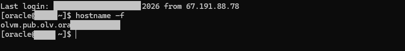
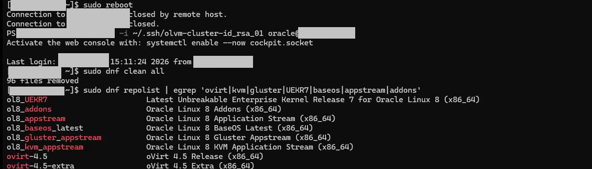
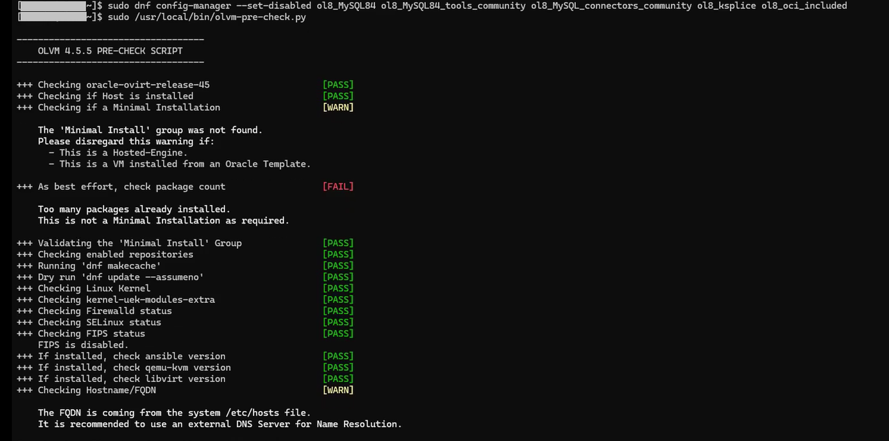
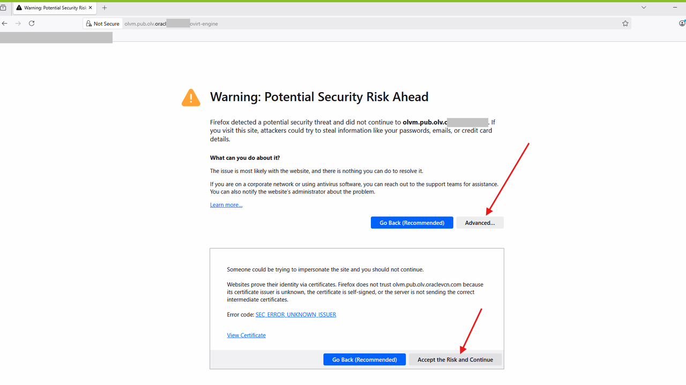
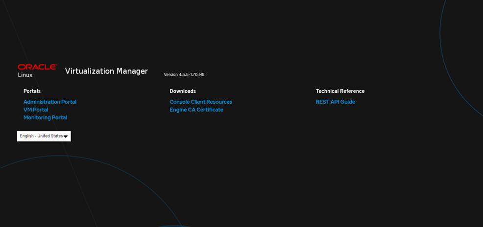
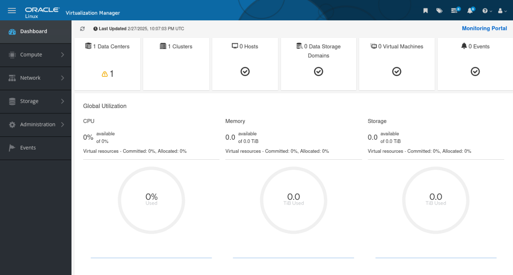

# Install Oracle Linux Virtualization Manager

## Introduction

In this lab, you will connect to the `olvm` host created in Lab 1, install the required Oracle Linux Virtualization Manager packages, run `engine-setup`, and validate access to the Administration Portal directly from your local browser. Oracle Linux Virtualization Manager is not running until `engine-setup` completes in Task 2.

Estimated Time: 40-60 minutes, including package download and engine setup time.

<!-- ### Video Walkthrough

This walkthrough video is silent and does not include audio narration.

[](video:https://objectstorage.us-ashburn-1.oraclecloud.com/n/idhwewbjlvpy/b/olvm-on-oci/o/videos%2Fvideos_olvm-on-oci-lab2-no-presenter.mp4)  -->

### Objectives

In this lab, you will:

- Connect to the `olvm` host using SSH from your local terminal
- Install the required Oracle Linux Virtualization Manager repositories and engine packages
- Run `engine-setup` and record the `admin@ovirt` password
- Log in to the Administration Portal from your local browser and verify the deployment

### Prerequisites

This lab assumes you have:

- Completed the Lab 1 checkpoint, including Task 7 access validation and the TCP 443 ingress rule for the Administration Portal
- Recorded the public IP address for `olvm`
- Downloaded and retained the `olvm-cluster-id_rsa` private key on your local machine
- A local terminal (Windows PowerShell, macOS Terminal, or Linux terminal)
- A local browser (Chrome, Firefox, or Edge)

> **Important:** The Administration Portal is accessed directly from your local browser over HTTPS. No VNC client or SSH tunnel is required.


### Connection Reference

Use these connection paths throughout this and later labs:

- **Windows PowerShell -> `olvm` host shell:** `ssh -i "$HOME\.ssh\olvm-cluster-id_rsa" oracle@<olvm-public-ip>`
- **macOS or Linux -> `olvm` host shell:** `ssh -i ~/.ssh/olvm-cluster-id_rsa oracle@<olvm-public-ip>`
- **`olvm` host shell -> Oracle Linux KVM hosts:** `ssh olkvm01` or `ssh olkvm02`
- **`olvm` host shell -> guest VMs in later labs:** check the VM **Host** column, then use `ssh -tt <Oracle Linux KVM-host> "ssh opc@<vm-ip>"`
- **Administration Portal (local browser):** `https://<olvm-fqdn>/ovirt-engine`


## Task 1: Connect to the `olvm` Host via SSH

1. From your local machine, open a terminal.

2. Connect to the `olvm` host. Oracle Linux Virtualization Manager is installed later in Task 2.

    In Windows PowerShell, run:

    ```powershell
    <copy>ssh -i "$HOME\.ssh\olvm-cluster-id_rsa" oracle@<olvm-public-ip></copy>
    ```

    In macOS Terminal or a Linux terminal, run:

    ```bash
    <copy>ssh -i ~/.ssh/olvm-cluster-id_rsa oracle@<olvm-public-ip></copy>
    ```

3. Verify you are on the correct host:

    ```bash
    <copy>hostname -f</copy>
    ```

    

    Record the FQDN output. You will need it in Task 3 to access the Administration Portal.

## Task 2: Install the Engine

1. Install the required packages:

    ```bash
    <copy>sudo dnf install -y oracle-ovirt-release-45-el8 kernel-uek-modules-extra</copy>
    ```

2. Reboot the system:

    ```bash
    <copy>sudo reboot</copy>
    ```

    **Important:** Your SSH session will disconnect during the reboot. Wait 2-3 minutes for the system to come back online, then reconnect before continuing.

3. Reconnect to the `olvm` host after reboot.

    In Windows PowerShell, run:

    ```powershell
    <copy>ssh -i "$HOME\.ssh\olvm-cluster-id_rsa" oracle@<olvm-public-ip></copy>
    ```

    In macOS Terminal or a Linux terminal, run:

    ```bash
    <copy>ssh -i ~/.ssh/olvm-cluster-id_rsa oracle@<olvm-public-ip></copy>
    ```

4. Prepare DNF and verify the Oracle Linux Virtualization Manager repositories are available:

    ```bash
    <copy>sudo dnf clean all
    sudo dnf repolist | egrep 'ovirt|Oracle Linux KVM|gluster|UEKR7|baseos|appstream|addons'</copy>
    ```

    

5. Run the Oracle Linux Virtualization Manager pre-check script:

    ```bash
    <copy>sudo /usr/local/bin/olvm-pre-check.py</copy>
    ```

    The `olvm` host uses an Oracle Cloud Infrastructure image, not an Oracle Linux 8 Minimal installation. Therefore, the pre-check displays an expected minimal-install warning and an expected best-effort package-count failure. The script itself states that the minimal-install warning can be disregarded for a VM installed from an Oracle template. Do not change the host image to address these expected messages.

    - If the pre-check reports extra enabled repositories, disable them and rerun the check:

    ```bash
    <copy>sudo dnf config-manager --set-disabled ol8_MySQL84 ol8_MySQL84_tools_community ol8_MySQL_connectors_community ol8_ksplice ol8_oci_included</copy>
    ```

    - Rerun the check:

    ```bash
    <copy>sudo /usr/local/bin/olvm-pre-check.py</copy>
    ```

    

6. Install the Oracle Linux Virtualization Manager engine package:

    ```bash
    <copy>sudo dnf install -y ovirt-engine</copy>
    ```

    This package install can take 10-15 minutes depending on repository speed.

7. Run the Oracle Linux Virtualization Manager engine setup:

    ```bash
    <copy>sudo engine-setup --accept-defaults</copy>
    ```

    **Expected runtime:** 5-10 minutes.

    `engine-setup` still prompts you to set the `admin@ovirt` password. Use a strong password that includes uppercase, lowercase, a number, and a special character.

    > **Critical:** Write down the `admin@ovirt` password before you continue.

    **Behind the scenes, engine-setup:**
    - **Configures PostgreSQL database** - Creates ovirt_engine database, sets up users and permissions
    - **Configures Apache and WildFly** - Sets up the web and application server components for the Administration Portal and REST API
    - **Generates SSL certificates** - Creates CA and host certificates for secure communications
    - **Configures firewall** - Opens required ports (443 for HTTPS, 5432 for PostgreSQL)
    - **Creates admin user** - Sets up admin@ovirt user in the internal authentication domain
    - **Initializes oVirt Engine** - Deploys the engine web application and starts services
    - **Creates default data center and cluster** - Named "Default" by default

8. Open port 443 on the OS firewall to allow browser access to the Administration Portal:

    ```bash
    <copy>sudo firewall-cmd --zone=public --permanent --add-service=https
    sudo firewall-cmd --reload</copy>
    ```

9. Verify the rule is active:

    ```bash
    <copy>sudo firewall-cmd --list-services</copy>
    ```

    The output should include `https`.

## Task 3: Update Your Local Hosts File

The Oracle Linux Virtualization Manager Administration Portal must be accessed using the engine's fully qualified domain name (FQDN). Because that FQDN is an internal OCI DNS name, your local browser cannot resolve it. Adding a single entry to your local hosts file maps the FQDN to the public IP of the `olvm` instance, which lets your browser reach the portal directly.

1. From your SSH session on the `olvm` instance, get the engine FQDN:

    ```bash
    <copy>hostname -f</copy>
    ```

    Record the FQDN. For example, `olvm.pub.olv.oraclevcn.com`.

2. On your local machine, edit the hosts file using the instructions for your operating system:

    - **Windows:**
        - Type `cmd` in the Start menu, right-click **Command Prompt**, and select **Run as administrator**
        - Run the following command:

        ```bash
        <copy>notepad C:\Windows\System32\drivers\etc\hosts</copy>
        ```

    - **macOS:**

        ```bash
        <copy>sudo nano /etc/hosts</copy>
        ```

    - **Linux:**

        ```bash
        <copy>sudo nano /etc/hosts</copy>
        ```

3. Add a line at the bottom of the file that maps the public IP of the `olvm` instance to the engine FQDN:

    ```bash
    <copy><olvm-public-ip>   <olvm-fqdn></copy>
    ```

    **Example:** 141.148.xx.xxx   olvm.pub.olv.oracxxxx.com
  
4. Save the file and close the editor.

## Task 4: Log in to the Administration Portal

1. Open your local browser. Firefox is recommended for this lab.

2. Navigate to the Administration Portal using the engine FQDN:

    ```bash
    <copy>https://<olvm-fqdn>/ovirt-engine</copy>
    ```

    For example: `https://olvm.pub.olv.oraclevcn.com/ovirt-engine`

3. Your browser displays a certificate warning because the lab uses a self-signed certificate. Click **Advanced -> Accept the Risk and Continue** (_Firefox is recommended_) or **Advanced -> Proceed** (Chrome).

    

4. On the landing page, click **Engine CA Certificate** to download it.

    

5. Import the certificate into your browser:

    **Firefox:**
    - Open browser menu -> **Settings**
    - Search for **cert**
    - Click **View Certificates... -> Import**
    - Select the downloaded certificate file
    - Check **Trust this CA to identify websites**
    - Click **OK**

    **Chrome / Edge:**
    - Open **Settings -> Privacy and Security -> Security -> Manage certificates**
    - Click **Import** and follow the wizard
    - Select the downloaded certificate file
    - Place it in the **Trusted Root Certification Authorities** store

6. Return to `https://<olvm-fqdn>/ovirt-engine` and click **Administration Portal**.

7. Sign in with:

    - Username: `admin@ovirt`
    - Password: the password you created during `engine-setup`

    The Administration Portal should open successfully. If the page is still starting, wait 1-2 minutes and refresh once.

    

## Deploy Oracle Linux Virtualization Manager Engine Checkpoint

At this point, you should have:

- SSH access to the Oracle Linux Virtualization Manager manager from your local machine
- Oracle Linux Virtualization Manager engine installed and configured
- The Administration Portal accessible from your local browser
- The `admin@ovirt` password recorded

Keep your SSH session and browser open for Labs 3-5.

You may now **proceed to the next lab**

## Learn More

- Oracle Linux Virtualization Manager install lab (official): https://docs.oracle.com/en/learn/olvm-install/index.html

## Acknowledgements

- **Author** - Shawn Kelley, Mark Atkinson, John Priest, Perside Foster
- **Contributor** - Marvin Kim
- **Last Updated By/Date** - Perside Foster, Jul 2026
