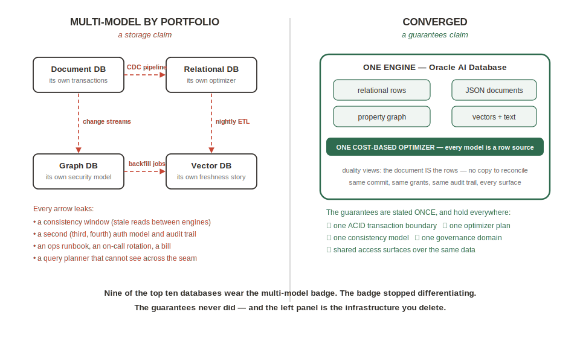
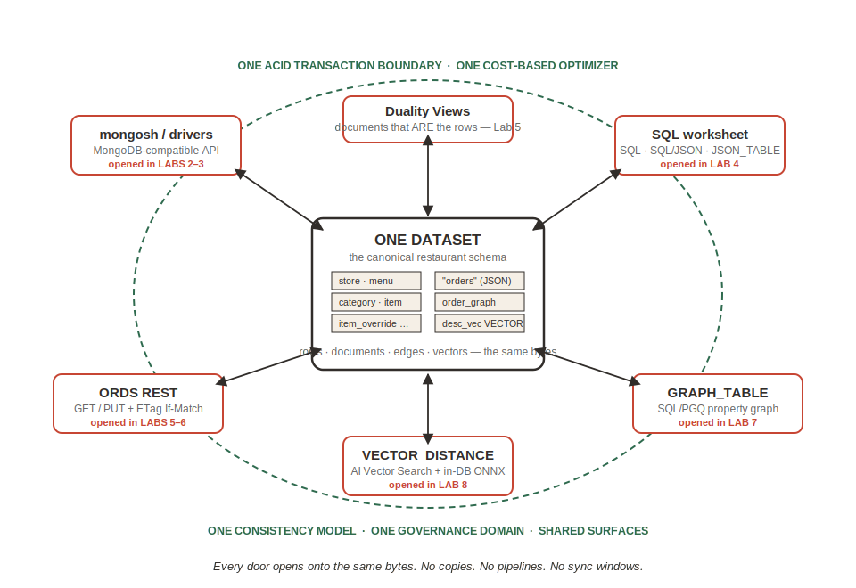

# Introduction

## About This Workshop

**Multi-model is a storage claim. Converged is a guarantees claim.**

Nine of the top ten databases on DB-Engines carry the "multi-model" label — the label stopped differentiating. The guarantees never did: one ACID transaction boundary, one cost-based optimizer, one consistency model, one governance domain, and shared access surfaces over the *same* data.

In this workshop you will not hear that thesis — you will **run** it, in three acts, on a single restaurant data model:

- **Act I — The Bet.** You build the classic document-world model: one embedded menu document per store, using unchanged `mongosh` against Oracle Autonomous AI Database. The 90% (point reads, object-shaped data) feels great — until one corporate price change rewrites the whole fleet, an analytics question needs a triple-`$unwind` pipeline, and one drifted copy of the data quietly stops being true.
- **Act II — The Truth.** You discover the collection your Mongo shell created **is already a SQL-queryable table** — same bytes, no import, no CDC — and shred it into a canonical relational schema where the drift is structurally impossible.
- **Act III — The Projections.** You get your document back as a JSON Relational Duality View assembled live from the canonical rows, add per-field write governance the engine enforces against every API, read the same data through REST, project a property graph over orders your own Mongo shell wrote, and finish with semantic vector search — capped by one SQL statement that joins graph, relational, and vector access in a single optimizer plan.

Every lab layers on the artifacts of the one before it. You leave with the same document ergonomics you walked in with — plus one copy of the truth underneath every surface.

Estimated Workshop Time: 90 minutes (about 60 minutes hands-on)

### Objectives

By the end of this workshop you will be able to:

* Name the access-surface options on Oracle AI Database — MongoDB-compatible API, SQL and SQL/JSON, JSON Relational Duality Views, ORDS REST, property graph (SQL/PGQ), and AI Vector Search — and choose between them
* Explain what makes Oracle's surface unique: every API is a door into the *same data*, with no copies, no CDC, and no sync windows
* Distinguish a converged database from a multi-model database using the five guarantees, each of which you will witness hands-on
* Apply the three-dials methodology (pattern complexity, read/write mix, update-size vs read-size) to choose between a pure document, a single collection, and canonical relational with a projected document

Surfaces named but not exercised in this session: SODA, Oracle Text full-text search, and spatial — they ride the same engine and the same guarantees.

### Prerequisites

This workshop assumes:

* A laptop with a current Chrome, Firefox, or Edge browser
* An Oracle Autonomous AI Database 26ai instance (provisioned for you in the LiveLabs sandbox, or your own — see the Get Started lab)
* No Oracle background and no MongoDB background required — every step is copy-paste-and-run with an explanation of what you are seeing

### A note on honesty

Two things we do on purpose. First, in Lab 2 we plant one deliberately drifted document — because that is what production drift looks like, and the point is that a schemaless engine has no opinion about it. Second, nothing in this workshop asks you to measure execution time on your lab instance: shared free-tier timings are unpredictable, so every observable is a **count** you can verify exactly, and every timing claim points at published, reproducible benchmarks you can run yourself.

## Learn More

* [Converged database vs multi-model database — what's the difference?](https://blogs.oracle.com/developers/converged-database-vs-multi-model-database-whats-the-difference)
* [JSON Relational Duality documentation](https://docs.oracle.com/en/database/oracle/oracle-database/23/jsnvu/)
* [Oracle Database API for MongoDB](https://docs.oracle.com/en/database/oracle/mongodb-api/)

## Acknowledgements
* **Author** - Rick Houlihan, Field CTO, Oracle Data & AI Platform
* **Contributors** - Oracle AI World lab working session team
* **Last Updated By/Date** - Rick Houlihan, July 2026
