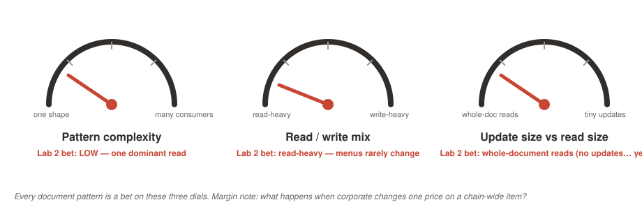

# Ship It Like It's 2015 — The Embedded Menu (MongoDB API)

## Introduction

You are the lead developer for a five-store restaurant franchise, and you model it the way the document world taught us all: **one embedded document per store** — menus inside the store, categories inside the menus, items inside the categories. The whole application object in one read.

This lab is the bet. You place it with unchanged MongoDB tooling running against Oracle Autonomous AI Database, and you enjoy exactly what made document databases famous. Write the margin note now: *what happens when corporate changes one price?*

Estimated Lab Time: 8 minutes

### Objectives

* Create and seed the `stores` collection through the MongoDB API
* Run the point read and projected read that make the document model feel great
* Record the three-dials bet you just placed

### Prerequisites

* Completed **Lab 1** — `mongosh` connected to your database, and the SQL worksheet open

## Task 1: Seed the Franchise

1. In **mongosh**, paste the seed. Five stores; note that **all five sell the Classic Cheeseburger (`item_id: 1000`)** — chain menu, chain item. That detail becomes load-bearing in Lab 3.

    Two deliberate wrinkles, both of which real franchises have. **Downtown lists item 1000 as "Lunch Classic"** — a location marketing the chain's burger under its own name, not drift. And **the Airport charges its own prices**: 14.99 for that burger against the chain's 12.99. Everything else inherits from corporate. Lab 4 gives those local decisions a place to live; Lab 5 shows the engine letting a location change its own name and price while refusing to let it rewrite the chain catalog.

    ```
    <copy>
    try { db.stores.deleteMany({}); } catch (e) { /* first run: nothing to clear */ }
    db.stores.insertMany([
      {"_id": "s_100", "name": "Burger Palace Downtown", "menus": [{"menu_id": 10, "name": "All Day Menu", "start_time": "00:00", "end_time": "23:59", "active": true, "categories": [{"category_id": 100, "name": "Burgers", "items": [{"item_id": 1000, "name": "Lunch Classic", "description": "Char-grilled smash patty, aged cheddar, brioche bun", "price": 12.99, "active": true}, {"item_id": 1001, "name": "Bacon Double Stack", "description": "Two smash patties, thick-cut bacon, smoked gouda", "price": 15.99, "active": true}]}, {"category_id": 101, "name": "Sides", "items": [{"item_id": 1002, "name": "French Fries", "description": "Twice-fried golden potato fries with sea salt", "price": 4.99, "active": true}, {"item_id": 1003, "name": "Garden Salad", "description": "Crisp greens, heirloom tomato, house vinaigrette", "price": 8.99, "active": true}]}]}]},
      {"_id": "s_101", "name": "Burger Palace Uptown", "menus": [{"menu_id": 11, "name": "All Day Menu", "start_time": "00:00", "end_time": "23:59", "active": true, "categories": [{"category_id": 110, "name": "Burgers", "items": [{"item_id": 1000, "name": "Classic Cheeseburger", "description": "Char-grilled smash patty, aged cheddar, brioche bun", "price": 12.99, "active": true}, {"item_id": 1001, "name": "Bacon Double Stack", "description": "Two smash patties, thick-cut bacon, smoked gouda", "price": 15.99, "active": true}, {"item_id": 1004, "name": "Black Bean Chipotle Burger", "description": "Smoky black bean patty, fiery chipotle aioli, no meat", "price": 11.99, "active": true}]}, {"category_id": 111, "name": "Sides", "items": [{"item_id": 1002, "name": "French Fries", "description": "Twice-fried golden potato fries with sea salt", "price": 4.99, "active": true}, {"item_id": 1003, "name": "Garden Salad", "description": "Crisp greens, heirloom tomato, house vinaigrette", "price": 8.99, "active": true}]}]}]},
      {"_id": "s_102", "name": "Burger Palace Riverside", "menus": [{"menu_id": 12, "name": "All Day Menu", "start_time": "00:00", "end_time": "23:59", "active": true, "categories": [{"category_id": 120, "name": "Burgers", "items": [{"item_id": 1000, "name": "Classic Cheeseburger", "description": "Char-grilled smash patty, aged cheddar, brioche bun", "price": 12.99, "active": true}, {"item_id": 1005, "name": "Buffalo Chicken Sandwich", "description": "Crispy chicken thigh, cayenne hot sauce, blue cheese", "price": 13.49, "active": true}]}, {"category_id": 121, "name": "Sides", "items": [{"item_id": 1002, "name": "French Fries", "description": "Twice-fried golden potato fries with sea salt", "price": 4.99, "active": true}, {"item_id": 1006, "name": "Chocolate Malt Shake", "description": "Hand-spun chocolate malt, whole milk, whipped cream", "price": 5.99, "active": true}]}]}]},
      {"_id": "s_103", "name": "Burger Palace Campus", "menus": [{"menu_id": 13, "name": "All Day Menu", "start_time": "00:00", "end_time": "23:59", "active": true, "categories": [{"category_id": 130, "name": "Burgers", "items": [{"item_id": 1000, "name": "Classic Cheeseburger", "description": "Char-grilled smash patty, aged cheddar, brioche bun", "price": 12.99, "active": true}, {"item_id": 1004, "name": "Black Bean Chipotle Burger", "description": "Smoky black bean patty, fiery chipotle aioli, no meat", "price": 11.99, "active": true}, {"item_id": 1005, "name": "Buffalo Chicken Sandwich", "description": "Crispy chicken thigh, cayenne hot sauce, blue cheese", "price": 13.49, "active": true}]}, {"category_id": 131, "name": "Sides", "items": [{"item_id": 1002, "name": "French Fries", "description": "Twice-fried golden potato fries with sea salt", "price": 4.99, "active": true}, {"item_id": 1003, "name": "Garden Salad", "description": "Crisp greens, heirloom tomato, house vinaigrette", "price": 8.99, "active": true}, {"item_id": 1006, "name": "Chocolate Malt Shake", "description": "Hand-spun chocolate malt, whole milk, whipped cream", "price": 5.99, "active": true}]}]}]},
      {"_id": "s_104", "name": "Burger Palace Airport", "menus": [{"menu_id": 14, "name": "All Day Menu", "start_time": "00:00", "end_time": "23:59", "active": true, "categories": [{"category_id": 140, "name": "Burgers", "items": [{"item_id": "1000", "name": "Classic Cheeseburger", "description": "Char-grilled smash patty, aged cheddar, brioche bun", "price": 14.99, "active": true}, {"item_id": "1005", "name": "Buffalo Chicken Sandwich", "description": "Crispy chicken thigh, cayenne hot sauce, blue cheese", "price": 14.99, "active": true}]}, {"category_id": 141, "name": "Sides", "items": [{"item_id": "1002", "name": "French Fries", "description": "Twice-fried golden potato fries with sea salt", "price": 6.49, "active": true}]}]}]}
    ]);
    print("stores inserted: " + db.stores.countDocuments({}));
    </copy>
    ```

    **What you should see:** `insertedCount: 5` (mongosh prints it as `insertedIds` with five entries and `acknowledged: true`).

    > Look closely at `s_104`: an old ingest script wrote its `item_id` as the **string** `"1000"`. Nothing complained. Remember that.

## Task 2: Enjoy the 90%

1. The point read that made document databases famous:

    ```
    <copy>
    db.stores.findOne({ _id: "s_100" })
    </copy>
    ```

    **What you should see:** the entire Burger Palace menu in one read. That's just your application object — no joins, no ORM, no mapping layer. This is Part 1 of the Ask Tom sessions in one line: *store data the way you use it* — see the reference link under Learn More.

2. A projected read — just names and prices:

    ```
    <copy>
    db.stores.findOne(
      { _id: "s_100" },
      { name: 1, "menus.categories.items.name": 1, "menus.categories.items.price": 1 }
    )
    </copy>
    ```

    **What you should see:** the same document, trimmed to the fields you asked for.

## Task 3: Record the Bet



You just set three dials, whether you meant to or not:

| Dial | Your setting |
|---|---|
| Pattern complexity | LOW — one dominant read (the store's menu) |
| Read/write mix | Read-heavy — menus rarely change |
| Update size vs read size | Whole-document reads; and, so far, no updates |

The embedded model is the *correct* choice for these settings. Every document pattern is a bet on these dials. Margin note for Lab 3: **what happens when corporate changes one price on a chain-wide item?**

> A JSON collection created through the MongoDB API is also reachable through **SODA**, Oracle's native document API — same collection, another door. We don't exercise SODA today.

## Learn More

* [Modeling for the Access Pattern (Ask Tom series)](https://www.youtube.com/watch?v=uJdUnB_cb1c)

You may now **proceed to the next lab**.

## Acknowledgements
* **Author** - Rick Houlihan, Field CTO, Oracle Data & AI Platform
* **Last Updated By/Date** - Hermann Baer, August 2026
