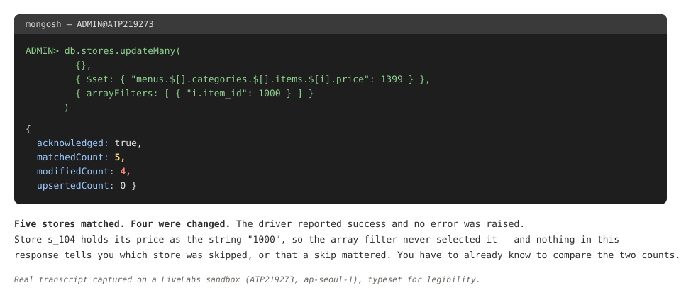
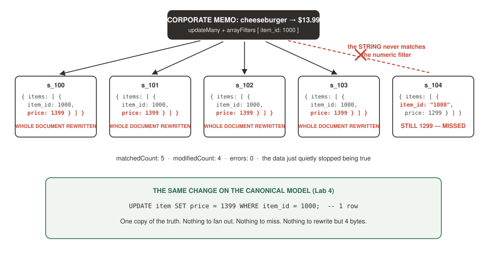
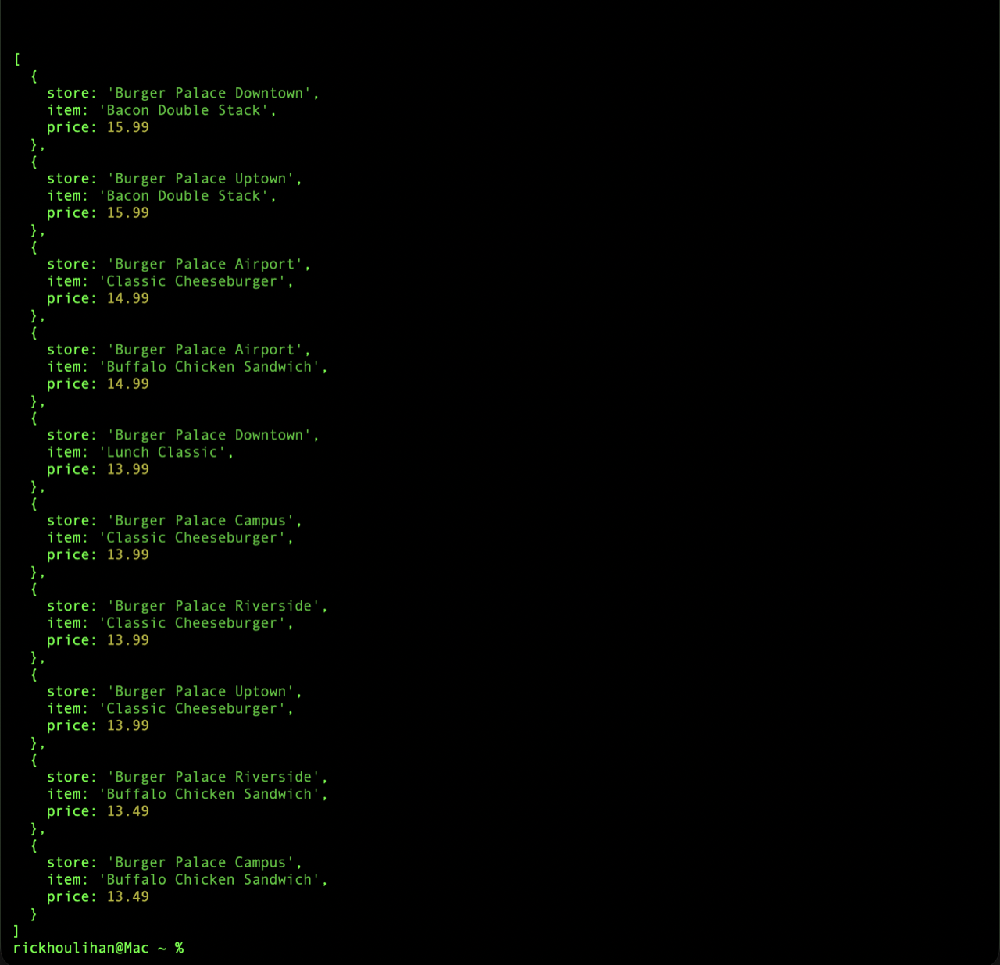

# Corporate Changes One Price — The Bet Inverts

## Introduction

Corporate just raised the Classic Cheeseburger to $13.99 chain-wide. One number. In this lab you feel the embedded bet invert on all three dials at once: the one-number change becomes a fleet-wide document rewrite, a simple analytics question becomes a fan-out pipeline, and the drifted copy you planted in Lab 2 quietly lies to you.

Estimated Lab Time: 6 minutes

### Objectives

* Run the chain-wide price change and read the write-amplification observable
* Run cross-store analytics as an aggregation pipeline and feel the fan-out
* Discover silent type drift — and understand why the engine had no opinion

## Task 1: One Number, Fleet-Wide Rewrite

1. In **mongosh**, apply corporate's change to the price for all stores:

    ```
    <copy>
    db.stores.updateMany(
      {},
      { $set: { "menus.$[].categories.$[].items.$[i].price": 13.99 } },
      { arrayFilters: [ { "i.item_id": 1000 } ] }
    )
    </copy>
    ```

    **What you should see:**

    ```
    matchedCount: 5, modifiedCount: 4
    ```

    > **If you see 4, your lab is working perfectly** — Task 3 shows why it isn't 5.

    

    Sit with that response for a second, because it is the most important thing in this lab:
      - There is no error. 
      - There is no warning. 
      - There is no list of which document was skipped. 
      
    The only evidence that something went wrong is that **two numbers in the response disagree** — and you have to already know to compare them.

2. Read the observable. Every *modified* store document was **rewritten in its entirety** to move one 4-byte number. Here that's 4 documents. All five stores sell this item — you saw that in Lab 2 — so at a 7,500-store franchise this same statement is 7,500 full-document rewrites on append-only storage. Write amplification is not a benchmark claim; you just counted it. (For measured at-scale numbers, run the open-source DocBench and sbe-cte-bench harnesses — we deliberately do not measure execution time on shared lab instances.)



## Task 2: The Analytics Ask

1. The finance team wants the top-10 most expensive items across all stores. In the document model, that is a fan-out:

    ```
    <copy>
    db.stores.aggregate([
      { $unwind: "$menus" },
      { $unwind: "$menus.categories" },
      { $unwind: "$menus.categories.items" },
      { $sort:  { "menus.categories.items.price": -1 } },
      { $limit: 10 },
      { $project: { _id: 0,
                    store: "$name",
                    item:  "$menus.categories.items.name",
                    price: "$menus.categories.items.price" } }
    ])
    </copy>
    ```

    **What you should see:** ten rows — every document exploded three levels deep, sorted, and trimmed. It works. It also touches every byte of every store document to answer a question about ten items.

    


2. Look at the top ten and the price of the Classic Cheeseburger per store. Something is off.

## Task 3: Spot the Lie

1. `s_104` never moved. It still shows the cheeseburger at 14.99 — the price it carried before the memo — while every other location went to 13.99. Corporate's change simply did not reach it. Find out why:

    ```
    <copy>
    db.stores.find(
      { "menus.categories.items.item_id": "1000" },
      { name: 1 }
    )
    </copy>
    ```

    **What you should see:** `s_104` — the only store whose ingest script stored `item_id` as the **string** `"1000"`. Your `arrayFilters` matched the number `1000`, so the update skipped it. Nothing errored. Nothing warned. The data just quietly stopped being true.

2. Honest framing, because it matters: **we planted this drift** — it is what production drift looks like, not a comment on anyone's team. You can avoid these kinds of error with JSON Schema enforcement that could have caught the type mismatch.

    However, a native document storage makes such a drift *possible*: five embedded copies of one fact. One copy was never validated against the others because, for documents with embeddings, they are unrelated fields in unrelated documents.

3. Re-read your three dials from Lab 2. Corporate's memo turned all three: a tiny update against whole-document rewrites, a cross-entity read against an embedded hierarchy, and N copies against one truth. The bet inverted. Lab 4 changes the physics.

### Stretch (fast finishers): the fleet at scale

Clone your fleet to 5,000 stores, re-run the same `updateMany`, and read `modifiedCount` and the collection's data size before and after. Counts only — we do not measure wall-clock time on shared lab instances. Paste the whole block into **mongosh**:

```
<copy>
const clones = [];
const template = db.stores.findOne({ _id: "s_100" });
for (let i = 0; i < 4995; i++) {
  const doc = JSON.parse(JSON.stringify(template));
  doc._id = "sx_" + (1000 + i);
  clones.push(doc);
}
db.stores.insertMany(clones);
print("fleet size now: " + db.stores.countDocuments({}));

const res = db.stores.updateMany(
  {},
  { $set: { "menus.$[].categories.$[].items.$[i].price": 14.01 } },
  { arrayFilters: [ { "i.item_id": 1000 } ] }
);
print("matchedCount: "  + res.matchedCount);
print("modifiedCount: " + res.modifiedCount + "  <- full-document rewrites to move one number");

// Clean up the clones and restore the 13.99 state the later labs expect
db.stores.deleteMany({ _id: { $regex: "^sx_" } });
db.stores.updateMany(
  {},
  { $set: { "menus.$[].categories.$[].items.$[i].price": 13.99 } },
  { arrayFilters: [ { "i.item_id": 1000 } ] }
);
print("restored fleet: " + db.stores.countDocuments({}) + " stores, price back to 13.99");
</copy>
```

**What you should see:** ~5,000 stores, `modifiedCount` in the thousands, every one of those rewrites to move a single number — then the cleanup line restoring five stores at 13.99.

## Learn More

* [DocBench — OSON vs BSON field-traversal harness (open source)](https://github.com/oracle-samples)
* [sbe-cte-bench — 14 reproducible aggregation scenarios](https://github.com/oracle-samples)

## Acknowledgements
* **Author** - Rick Houlihan, Field CTO, Oracle Data & AI Platform
* **Last Updated By/Date** - Hermann Baer, August 2026
