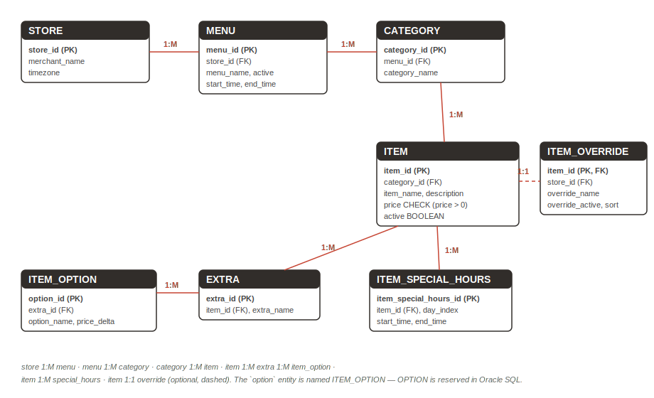

# Model the Domain — One Truth (Canonical Schema + SQL/JSON)

## Introduction

The resolution starts with a pivot no bolt-on multi-model system can offer: the collection your Mongo shell created **is already a table**. In this lab you query it from SQL, see the drift from the relational side, then shred it into the canonical restaurant schema from the Ask Tom sessions — seven core entities plus the optional `item_override` extension, eight tables — where the drift becomes structurally impossible and the analytics ask becomes five lines.

Estimated Lab Time: 11 minutes

### Objectives

* Query the mongosh-created collection directly from SQL — same bytes, no import, no CDC
* Create the canonical relational schema with real constraints
* Shred the documents into canonical rows with `JSON_TABLE`
* Replay corporate's change as a one-row `UPDATE` and re-run analytics as a five-line join

## Task 1: The Pivot — Your Collection Is a Table

1. In the **SQL worksheet**, run:

    ```
    <copy>
    SELECT s.data.name.string() AS store_name
    FROM   "stores" s;
    </copy>
    ```

    **What you should see:** your five store names. Same bytes your Mongo shell wrote. No export, no import, no pipeline.

    > **The namespace lesson (once, now):** collections created through the MongoDB API are **case-sensitive**, so in SQL you address them as quoted identifiers — `"stores"`, not `stores`. Two worlds, one namespace. Every shared object in this workshop uses quoted lowercase names for exactly this reason.

2. See the drift from the SQL side — every embedded copy of item 1000, its price, and the JSON type it was stored with:

    ```
    <copy>
    SELECT s.data."_id".string()      AS store_id,
           jt.item_id,
           jt.item_type,
           jt.price
    FROM   "stores" s,
           JSON_TABLE(s.data, '$.menus[*].categories[*].items[*]'
             COLUMNS (
               item_id   VARCHAR2(10) PATH '$.item_id',
               item_type VARCHAR2(10) PATH '$.item_id.type()',
               price     NUMBER       PATH '$.price'
             )) jt
    WHERE  jt.item_id IN ('1000')
    ORDER  BY store_id;
    </copy>
    ```

    **What you should see:** five rows — four `number` at 1399 and one `string` at 1299. SQL can *read* the documents, but no query can fix "five copies" being the model.

## Task 2: Create the Canonical Schema

1. Paste and run the canonical DDL as a script (also in `scripts/03_canonical_ddl.sql`). Seven core entities plus the optional 1:1 `item_override` — eight tables, 3NF, with primary keys, foreign keys, and a `CHECK` constraint. (The Ask Tom entity `option` is named `item_option` here — `OPTION` is a reserved word in Oracle SQL.)

    ```
    <copy>
    DROP VIEW  IF EXISTS "store_menu_dv";
    DROP VIEW  IF EXISTS "location_item_dv";
    DROP TABLE IF EXISTS item_option        CASCADE CONSTRAINTS;
    DROP TABLE IF EXISTS extra              CASCADE CONSTRAINTS;
    DROP TABLE IF EXISTS item_special_hours CASCADE CONSTRAINTS;
    DROP TABLE IF EXISTS item_override      CASCADE CONSTRAINTS;
    DROP TABLE IF EXISTS item               CASCADE CONSTRAINTS;
    DROP TABLE IF EXISTS category           CASCADE CONSTRAINTS;
    DROP TABLE IF EXISTS menu               CASCADE CONSTRAINTS;
    DROP TABLE IF EXISTS store              CASCADE CONSTRAINTS;

    CREATE TABLE store (
      store_id      VARCHAR2(10)  PRIMARY KEY,
      merchant_name VARCHAR2(100) NOT NULL,
      timezone      VARCHAR2(40)  DEFAULT 'America/Los_Angeles' NOT NULL
    );

    CREATE TABLE menu (
      menu_id    NUMBER       PRIMARY KEY,
      store_id   VARCHAR2(10) NOT NULL REFERENCES store,
      menu_name  VARCHAR2(50) NOT NULL,
      active     BOOLEAN      DEFAULT TRUE NOT NULL,
      start_time VARCHAR2(5)  DEFAULT '00:00' NOT NULL,
      end_time   VARCHAR2(5)  DEFAULT '23:59' NOT NULL
    );

    CREATE TABLE category (
      category_id   NUMBER       PRIMARY KEY,
      menu_id       NUMBER       NOT NULL REFERENCES menu,
      category_name VARCHAR2(50) NOT NULL
    );

    CREATE TABLE item (
      item_id     NUMBER        PRIMARY KEY,
      category_id NUMBER        NOT NULL REFERENCES category,
      item_name   VARCHAR2(100) NOT NULL,
      description VARCHAR2(400),
      price       NUMBER        NOT NULL CHECK (price > 0),
      active      BOOLEAN       DEFAULT TRUE NOT NULL
    );

    CREATE TABLE extra (
      extra_id   NUMBER       PRIMARY KEY,
      item_id    NUMBER       NOT NULL REFERENCES item,
      extra_name VARCHAR2(50) NOT NULL
    );

    CREATE TABLE item_option (
      option_id   NUMBER       PRIMARY KEY,
      extra_id    NUMBER       NOT NULL REFERENCES extra,
      option_name VARCHAR2(50) NOT NULL,
      price_delta NUMBER       DEFAULT 0 NOT NULL
    );

    CREATE TABLE item_special_hours (
      item_special_hours_id NUMBER      PRIMARY KEY,
      item_id               NUMBER      NOT NULL REFERENCES item,
      day_index             NUMBER(1)   NOT NULL,
      start_time            VARCHAR2(5) NOT NULL,
      end_time              VARCHAR2(5) NOT NULL
    );

    CREATE TABLE item_override (
      item_id          NUMBER       PRIMARY KEY REFERENCES item,
      store_id         VARCHAR2(10) NOT NULL REFERENCES store,
      override_name    VARCHAR2(100),
      override_active  BOOLEAN,
      override_sort_id NUMBER
    );
    </copy>
    ```

    

2. Entry gate — one query, one answer:

    ```
    <copy>
    SELECT COUNT(*) AS application_tables
    FROM   user_tables
    WHERE  table_name IN ('STORE','MENU','CATEGORY','ITEM','EXTRA',
                          'ITEM_OPTION','ITEM_SPECIAL_HOURS','ITEM_OVERRIDE');
    </copy>
    ```

    **What you should see:** `8`. (The `"stores"` collection table is still there too — on purpose.)

## Task 3: Shred the Documents Into the Truth

1. Run the shred as a script (also in `scripts/03_shred.sql`). It starts with deletes so a re-run from any partial state is clean, de-duplicates each item into **one corporate row** with deterministic rules (`MAX(price)` — corporate's latest change wins; resolving drift is a decision the migration must own — and `MIN(name)` for the corporate name), and converts `s_100`'s local rename into an `item_override` row. Note how `JSON_TABLE ... NESTED` walks the same path your `$unwind` pipeline did — declaratively.

    See `scripts/03_shred.sql` for the full statement set; paste it from the guide's script pack and run it as a script.

    **What you should see:** the script's final state check returns `ITEMS: 6  PRICE_1000: 1399  OVERRIDES: 1`. Five embedded copies of the cheeseburger became **one row** — the drifted string copy was normalized on conversion and lost the argument to `MAX(price)`.

## Task 4: Replay Corporate's Change — and the Analytics Ask

1. Corporate's memo, the canonical way:

    ```
    <copy>
    UPDATE item SET price = 1399 WHERE item_id = 1000;
    COMMIT;
    </copy>
    ```

    **What you should see:** `1 row updated.` One row. Done. Compare Lab 3: `modifiedCount: 4` full-document rewrites and one silent miss.

2. The analytics ask, verbatim from the Ask Tom deck — five lines, no fan-out:

    ```
    <copy>
    SELECT s.merchant_name, m.menu_name, c.category_name, i.item_name, i.price
    FROM   item i
      JOIN category c ON c.category_id = i.category_id
      JOIN menu m     ON m.menu_id     = c.menu_id
      JOIN store s    ON s.store_id    = m.store_id
    WHERE  i.active
    ORDER  BY i.price DESC
    FETCH FIRST 10 ROWS ONLY;
    </copy>
    ```

    **What you should see:** the top-10 list — with the cheeseburger at 1399 everywhere, because there is only one price to be wrong.

3. Try to break it. The engine now has an opinion:

    ```
    <copy>
    INSERT INTO item (item_id, category_id, item_name, price)
    VALUES (9999, 100, 'Free Burger', -1);
    </copy>
    ```

    **What you should see:** `ORA-02290: check constraint violated`. Remember this error number — in Lab 5 you will see the *same* error through a completely different door.

But notice what you gave up: Lab 2's one-read application object is gone. Lab 5 gets it back — without giving up anything you just gained.

## Learn More

* [JSON_TABLE and SQL/JSON](https://docs.oracle.com/en/database/oracle/oracle-database/23/adjsn/)

## Acknowledgements
* **Author** - Rick Houlihan, Field CTO, Oracle Data & AI Platform
* **Last Updated By/Date** - Rick Houlihan, July 2026
