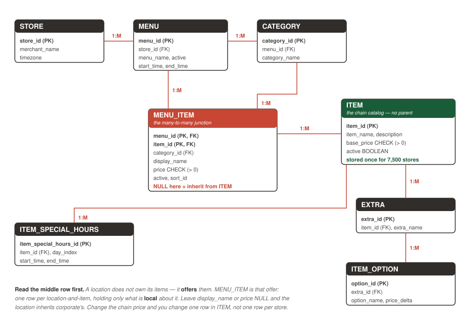

# Model the Domain — One Truth (Canonical Schema + SQL/JSON)

## Introduction

The resolution starts with a pivot no bolt-on multi-model system can offer: the collection your Mongo shell created **is already a table**. In this lab you query it from SQL, see the drift from the relational side, then shred it into the canonical restaurant schema from the Ask Tom sessions — a chain catalog plus the `menu_item` junction that says which location offers what, eight tables — where the drift becomes structurally impossible and the analytics ask becomes five lines.

Estimated Lab Time: 11 minutes

### Objectives

* Query the mongosh-created collection directly from SQL — same bytes, no import, no CDC
* Create the canonical relational schema with real constraints
* Shred the documents into canonical rows with `JSON_TABLE`
* Replay corporate's change as a one-row `UPDATE` and re-run analytics as a five-line join

## Task 1: The Pivot — Your Collection Is a Table

1. In the **SQL worksheet**, run:

    ```
    <copy>
    SELECT s.data.name.string() AS store_name
    FROM   "stores" s;
    </copy>
    ```

    **What you should see:** your five store names. Same bytes your Mongo shell wrote. No export, no import, no pipeline.

    > **The namespace lesson (once, now):** MongoDB collection names are case-sensitive; SQL identifiers are folded to upper case unless you quote them. Those two rules should collide — and Oracle resolves the collision for you. When the MongoDB API creates the collection `stores`, the database creates a table named `stores` **and** an `STORES` synonym pointing at it; create `ORDERS` from SQL and you get an `orders` synonym for free. So `"stores"`, `stores`, `STORES` and `"STORES"` all reach the same object, and `db.stores` in mongosh reaches it too. Two worlds, one namespace — genuinely one.
    >
    > We still write shared objects as quoted lowercase throughout this workshop, by convention rather than necessity: the name you read in the SQL is then byte-for-byte the name you type in mongosh, which is one less thing to hold in your head for the next hour.

2. See the drift from the SQL side — every embedded copy of item 1000, its price, and the JSON type it was stored with:

    ```
    <copy>
    SELECT s.data."_id".string()      AS store_id,
           jt.item_id,
           jt.item_type,
           jt.price
    FROM   "stores" s,
           JSON_TABLE(s.data, '$.menus[*].categories[*].items[*]'
             COLUMNS (
               item_id   VARCHAR2(10) PATH '$.item_id',
               item_type VARCHAR2(10) PATH '$.item_id.type()',
               price     NUMBER       PATH '$.price'
             )) jt
    WHERE  jt.item_id IN ('1000')
    ORDER  BY store_id;
    </copy>
    ```

    **What you should see:** five rows — four `number` at 1399 and one `string` at 1299. SQL can *read* the documents, but no query can fix "five copies" being the model.

## Task 2: Create the Canonical Schema

1. Paste and run the canonical DDL as a script (also in `scripts/03_canonical_ddl.sql`). Eight tables, 3NF. The shape that matters: **`item` is the chain catalog and has no parent** — an item belongs to the *chain*, not to a store — and **`menu_item`** is the many-to-many that records which location offers it, under what local name, at what local price. That junction is the whole franchise. (The Ask Tom entity `option` is named `item_option` here — `OPTION` is a reserved word in Oracle SQL.)

    ```
    <copy>
    DROP VIEW  IF EXISTS "store_menu_dv";
    DROP VIEW  IF EXISTS pos_menu_v;
    DROP TABLE IF EXISTS item_option        CASCADE CONSTRAINTS;
    DROP TABLE IF EXISTS extra              CASCADE CONSTRAINTS;
    DROP TABLE IF EXISTS item_special_hours CASCADE CONSTRAINTS;
    DROP TABLE IF EXISTS menu_item          CASCADE CONSTRAINTS;
    DROP TABLE IF EXISTS category           CASCADE CONSTRAINTS;
    DROP TABLE IF EXISTS menu               CASCADE CONSTRAINTS;
    DROP TABLE IF EXISTS item               CASCADE CONSTRAINTS;
    DROP TABLE IF EXISTS store              CASCADE CONSTRAINTS;
    CREATE TABLE store (
      store_id      VARCHAR2(10)  PRIMARY KEY,
      merchant_name VARCHAR2(100) NOT NULL,
      timezone      VARCHAR2(40)  DEFAULT 'America/Los_Angeles' NOT NULL
    );
    CREATE TABLE item (
      item_id     NUMBER        PRIMARY KEY,
      item_name   VARCHAR2(100) NOT NULL,
      description VARCHAR2(400),
      base_price  NUMBER        NOT NULL CHECK (base_price > 0),
      active      BOOLEAN       DEFAULT TRUE NOT NULL
    );
    CREATE TABLE menu (
      menu_id    NUMBER       PRIMARY KEY,
      store_id   VARCHAR2(10) NOT NULL REFERENCES store,
      menu_name  VARCHAR2(50) NOT NULL,
      active     BOOLEAN      DEFAULT TRUE NOT NULL,
      start_time VARCHAR2(5)  DEFAULT '00:00' NOT NULL,
      end_time   VARCHAR2(5)  DEFAULT '23:59' NOT NULL
    );
    CREATE TABLE category (
      category_id   NUMBER       PRIMARY KEY,
      menu_id       NUMBER       NOT NULL REFERENCES menu,
      category_name VARCHAR2(50) NOT NULL
    );
    CREATE TABLE menu_item (
      menu_id      NUMBER        NOT NULL REFERENCES menu,
      item_id      NUMBER        NOT NULL REFERENCES item,
      category_id  NUMBER        NOT NULL REFERENCES category,
      display_name VARCHAR2(100),
      price        NUMBER        CHECK (price > 0),
      active       BOOLEAN,
      sort_id      NUMBER,
      CONSTRAINT menu_item_pk PRIMARY KEY (menu_id, item_id)
    );
    CREATE INDEX menu_item_item_ix ON menu_item (item_id);
    CREATE INDEX menu_item_cat_ix  ON menu_item (category_id);
    CREATE TABLE extra (
      extra_id   NUMBER       PRIMARY KEY,
      item_id    NUMBER       NOT NULL REFERENCES item,
      extra_name VARCHAR2(50) NOT NULL
    );
    CREATE TABLE item_option (
      option_id   NUMBER       PRIMARY KEY,
      extra_id    NUMBER       NOT NULL REFERENCES extra,
      option_name VARCHAR2(50) NOT NULL,
      price_delta NUMBER       DEFAULT 0 NOT NULL
    );
    CREATE TABLE item_special_hours (
      item_special_hours_id NUMBER      PRIMARY KEY,
      item_id               NUMBER      NOT NULL REFERENCES item,
      day_index             NUMBER(1)   NOT NULL,
      start_time            VARCHAR2(5) NOT NULL,
      end_time              VARCHAR2(5) NOT NULL
    );
    </copy>
    ```

    

2. Entry gate — one query, one answer:

    ```
    <copy>
    SELECT COUNT(*) AS application_tables
    FROM   user_tables
    WHERE  table_name IN ('STORE','MENU','CATEGORY','ITEM','MENU_ITEM','EXTRA',
                          'ITEM_OPTION','ITEM_SPECIAL_HOURS');
    </copy>
    ```

    **What you should see:** `8`. (The `"stores"` collection table is still there too — on purpose.)

## Task 3: Shred the Documents Into the Truth

1. Paste the shred into the **SQL worksheet** and run it as a script (also in `scripts/03_shred.sql`). It starts with deletes so a re-run from any partial state is clean, collapses the embedded copies into **one corporate catalog row per item**, then records every location's offering in `menu_item`. The corporate name and price are the values held by a **majority** of the locations selling that item — not the first one seen. That rule matters: a single location's rename must not become the chain's name, and if an item were sold at only one location that overrode its price, corporate price would be *unrecoverable* from the documents. Note how `JSON_TABLE ... NESTED` walks the same path your `$unwind` pipeline did — declaratively.

    ```
    <copy>
    DELETE FROM item_option;
    DELETE FROM extra;
    DELETE FROM item_special_hours;
    DELETE FROM menu_item;
    DELETE FROM category;
    DELETE FROM menu;
    DELETE FROM item;
    DELETE FROM store;
    INSERT INTO store (store_id, merchant_name)
    SELECT s.data."_id".string(), s.data.name.string() FROM "stores" s;
    INSERT INTO menu (menu_id, store_id, menu_name, start_time, end_time)
    SELECT jt.menu_id, jt.store_id, jt.menu_name, jt.st, jt.en
    FROM   "stores" s,
           JSON_TABLE(s.data, '$'
             COLUMNS (
               store_id VARCHAR2(10) PATH '$._id',
               NESTED PATH '$.menus[*]'
               COLUMNS (
                 menu_id   NUMBER       PATH '$.menu_id',
                 menu_name VARCHAR2(50) PATH '$.name',
                 st        VARCHAR2(5)  PATH '$.start_time',
                 en        VARCHAR2(5)  PATH '$.end_time'))) jt;
    INSERT INTO category (category_id, menu_id, category_name)
    SELECT DISTINCT jt.category_id, jt.menu_id, jt.category_name
    FROM   "stores" s,
           JSON_TABLE(s.data, '$.menus[*]'
             COLUMNS (
               menu_id NUMBER PATH '$.menu_id',
               NESTED PATH '$.categories[*]'
               COLUMNS (
                 category_id   NUMBER       PATH '$.category_id',
                 category_name VARCHAR2(50) PATH '$.name'))) jt;
    INSERT INTO item (item_id, item_name, description, base_price)
    WITH flat AS (
      SELECT TO_NUMBER(jt.item_id) AS item_id, jt.store_id,
             jt.item_name, jt.description, jt.price
      FROM   "stores" s,
             JSON_TABLE(s.data, '$'
               COLUMNS (
                 store_id VARCHAR2(10) PATH '$._id',
                 NESTED PATH '$.menus[*].categories[*].items[*]'
                 COLUMNS (
                   item_id     VARCHAR2(10)  PATH '$.item_id',
                   item_name   VARCHAR2(100) PATH '$.name',
                   description VARCHAR2(400) PATH '$.description',
                   price       NUMBER        PATH '$.price'))) jt
    ), ranked_name AS (
      SELECT item_id, item_name,
             ROW_NUMBER() OVER (PARTITION BY item_id
                                ORDER BY COUNT(*) DESC, MIN(store_id)) rn
      FROM flat GROUP BY item_id, item_name
    ), ranked_price AS (
      SELECT item_id, price,
             ROW_NUMBER() OVER (PARTITION BY item_id
                                ORDER BY COUNT(*) DESC, MIN(store_id)) rn
      FROM flat GROUP BY item_id, price
    )
    SELECT n.item_id, n.item_name, MAX(f.description), p.price
    FROM   ranked_name n
      JOIN ranked_price p ON p.item_id = n.item_id AND p.rn = 1
      JOIN flat f         ON f.item_id = n.item_id
    WHERE  n.rn = 1
    GROUP  BY n.item_id, n.item_name, p.price;
    INSERT INTO menu_item (menu_id, item_id, category_id, display_name, price)
    SELECT jt.menu_id, TO_NUMBER(jt.item_id), jt.category_id,
           CASE WHEN jt.item_name <> i.item_name  THEN jt.item_name END,
           CASE WHEN jt.price     <> i.base_price THEN jt.price     END
    FROM   "stores" s,
           JSON_TABLE(s.data, '$.menus[*]'
             COLUMNS (
               menu_id NUMBER PATH '$.menu_id',
               NESTED PATH '$.categories[*]'
               COLUMNS (
                 category_id NUMBER PATH '$.category_id',
                 NESTED PATH '$.items[*]'
                 COLUMNS (
                   item_id     VARCHAR2(10)  PATH '$.item_id',
                   item_name   VARCHAR2(100) PATH '$.name',
                   price       NUMBER        PATH '$.price')))) jt
      JOIN item i ON i.item_id = TO_NUMBER(jt.item_id);
    COMMIT;
    </copy>
    ```

    **What you should see:** the final state check returns `ITEMS: 6  PRICE_1000: 1399  OVERRIDES: 1`. Five embedded copies of the cheeseburger became **one row** — the drifted string copy was normalized on conversion and lost the argument to `MAX(price)`.

## Task 4: Replay Corporate's Change — and the Analytics Ask

1. Corporate's memo, the canonical way:

    ```
    <copy>
    UPDATE item SET base_price = 1399 WHERE item_id = 1000;
    COMMIT;
    </copy>
    ```

    **What you should see:** `1 row updated.` One row. Done. Compare Lab 3: `modifiedCount: 4` full-document rewrites and one silent miss.

2. The analytics ask, verbatim from the Ask Tom deck — five lines, no fan-out:

    ```
    <copy>
    SELECT s.merchant_name, m.menu_name, c.category_name, i.item_name, i.price
    FROM   item i
      JOIN category c ON c.category_id = i.category_id
      JOIN menu m     ON m.menu_id     = c.menu_id
      JOIN store s    ON s.store_id    = m.store_id
    WHERE  i.active
    ORDER  BY i.price DESC
    FETCH FIRST 10 ROWS ONLY;
    </copy>
    ```

    **What you should see:** the top-10 list — with the cheeseburger at 1399 everywhere, because there is only one price to be wrong.

3. Try to break it. The engine now has an opinion:

    ```
    <copy>
    INSERT INTO item (item_id, category_id, item_name, price)
    VALUES (9999, 100, 'Free Burger', -1);
    </copy>
    ```

    **What you should see:** `ORA-02290: check constraint violated`. Remember this error number — in Lab 5 you will see the *same* error through a completely different door.

But notice what you gave up: Lab 2's one-read application object is gone. Lab 5 gets it back — without giving up anything you just gained.

## Learn More

* [JSON_TABLE and SQL/JSON](https://docs.oracle.com/en/database/oracle/oracle-database/23/adjsn/)

## Acknowledgements
* **Author** - Rick Houlihan, Field CTO, Oracle Data & AI Platform
* **Last Updated By/Date** - Rick Houlihan, July 2026
