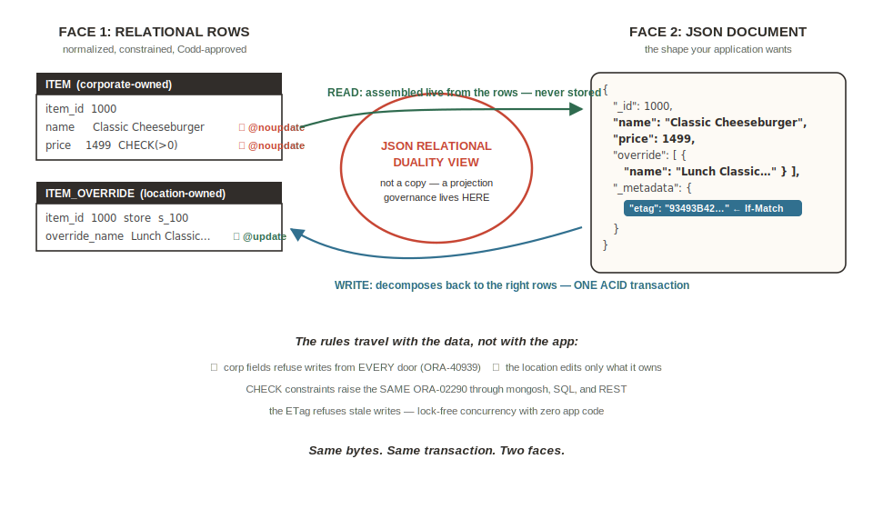

# Lab 5: Get the Document Back — Duality Views and Governance

## Introduction

In Lab 4 you traded your document ergonomics for one copy of the truth. This lab ends the trade-off: a **JSON Relational Duality View** gives you back Lab 2's document read — same nesting, assembled live from the canonical rows — and adds things the embedded model never had: per-field write governance the engine enforces against *every* API, and one consistency model you can witness across surfaces in the same commit.

Estimated Lab Time: 11 minutes

### Objectives

* Create two duality views: the store menu document and a governance-annotated location view
* Recover the Lab 2 document read through the MongoDB API
* Witness the cross-surface commit: one SQL row update, every document projection current
* Prove one enforcement domain: the same `ORA-02290` through mongosh that SQL got in Lab 4
* Read the same document through REST — the third door

## Task 1: Create the Views (SQL — one paste)

1. In the **SQL worksheet**, run `scripts/04_duality_views.sql` as a script. It creates both views with explicit updatability annotations — duality views are **read-only by default**; you grant writes per table, which *is* the governance posture — and REST-enables the first view. The core of it:

    ```
    <copy>
    CREATE OR REPLACE JSON RELATIONAL DUALITY VIEW "store_menu_dv" AS
    store @insert @update @delete
    {
      _id   : store_id,
      name  : merchant_name,
      menus : menu @insert @update
      [ {
          _id        : menu_id,
          name       : menu_name,
          categories : category @insert @update
          [ {
              _id   : category_id,
              name  : category_name,
              items : item @insert @update
              [ {
                  _id   : item_id,
                  name  : item_name,
                  price : price,
                  desc  : description
              } ]
          } ]
      } ]
    };

    CREATE OR REPLACE JSON RELATIONAL DUALITY VIEW "location_item_dv" AS
    item @noinsert @noupdate @nodelete
    {
      _id   : item_id,
      name  : item_name,
      price : price,
      desc  : description,
      override : item_override @insert @update @delete
      {
        _id    : item_id,
        store  : store_id,
        name   : override_name,
        active : override_active,
        sort   : override_sort_id
      },
      schedule : item_special_hours @insert @update @delete
      [ {
        _id   : item_special_hours_id,
        day   : day_index,
        start : start_time,
        end   : end_time
      } ]
    };

    BEGIN
      ORDS.ENABLE_SCHEMA;
      ORDS.ENABLE_OBJECT(p_object => 'store_menu_dv', p_object_type => 'VIEW');
    END;
    /
    </copy>
    ```

    **What you should see:** both views created, PL/SQL procedure completed.

    > **Shape note (validated live):** the 1:1 `override` child projects as a **one-element array** in the duality document on current Autonomous Database — write it via the `override.0.…` path. Whether a 1:1 child projects as a singleton object or a one-element array is version-dependent; the build-phase rehearsal pins it for the target image.



## Task 2: The Document Comes Back (mongosh)

1. In **mongosh**:

    ```
    <copy>
    db.store_menu_dv.findOne({ _id: "s_100" })
    </copy>
    ```

    **What you should see:** **a document, not `null`** — Burger Palace, same nesting you built by hand in Lab 2 (items keyed `_id` per duality convention, plus a `_metadata` block with an `etag`). If you get `null`, the view name case doesn't match — call a proctor; the views must be created quoted-lowercase.

    The difference from Lab 2: this document is **assembled live from the canonical rows**. It is not a copy of anything. *Documents that ARE the relational data.*

## Task 3: The Cross-Surface Commit Witness

1. In the **SQL worksheet** — corporate raises the price again:

    ```
    <copy>
    UPDATE item SET price = 1499 WHERE item_id = 1000;
    COMMIT;
    </copy>
    ```

2. Back in **mongosh** — every store's document, one paste:

    ```
    <copy>
    db.store_menu_dv.find(
      {},
      { name: 1, "menus.categories.items.name": 1, "menus.categories.items.price": 1 }
    )
    </copy>
    ```

    **What you should see:** the projection already shows **1499** — current on the same commit, no refresh, no pipeline. And notice something your embedding instincts didn't expect: item 1000 now appears on exactly **one** menu. In Lab 2 you had five copies to chase (and missed one); the canonical model homes each item **once**, so there is exactly one price that can ever be wrong. Say it with us: *same bytes, same transaction, two faces.* Compare Lab 3's `updateMany` — and its silent miss.

    > Meanwhile `db.stores` — the Lab 2 collection — still holds the old embedded world, drift and all. It stays, on purpose, as a **museum piece**: that contrast *is* the lab.

## Task 4: Governance the Engine Enforces (mongosh — one script)

1. Run the four probes in `scripts/04_governance_tests.mongo.js` (paste as one block):

    ```
    <copy>
    // 1. Location manager tries to change the corporate price via the location view
    try {
      db.location_item_dv.updateOne({ _id: 1000 }, { $set: { price: 99 } });
    } catch (e) { print("corp field write: " + e.message); }

    // 2. Location manager edits the field they own - succeeds.
    //    Note the array path: the 1:1 override child projects as a
    //    ONE-ELEMENT ARRAY in the duality document.
    db.location_item_dv.updateOne(
      { _id: 1000 },
      { $set: { "override.0.name": "Lunch Classic Special" } }
    );

    // 3. Negative price through the updatable menu view - meets the CHECK constraint
    try {
      db.store_menu_dv.updateOne(
        { _id: "s_100" },
        { $set: { "menus.0.categories.0.items.0.price": -1 } }
      );
    } catch (e) { print("negative price: " + e.message); }
    </copy>
    ```

    **What you should see** (captured live on Autonomous Database):
    - Probe 1 **rejected by the engine**: `ORA-40939: Cannot update table 'ITEM' in JSON Relational Duality View 'location_item_dv': Missing UPDATE annotation or NOUPDATE annotation specified.` — governance enforced below every API.
    - Probe 2 succeeds (`modifiedCount: 1`) — the location owns its override.
    - Probe 3 rejected with a two-line error ending in the star of the show:
      ```
      ORA-42692: Cannot update JSON Relational Duality View 'RESTO'.'store_menu_dv': Error while updating table 'ITEM'
      ORA-02290: check constraint violated
      ```
      The *same* `ORA-02290` your SQL insert hit in Lab 4. One rulebook, every door. *There is no per-surface validation layer to drift out of agreement, because there is nothing to keep in agreement.*

2. In the **SQL worksheet**, watch the document write land as a relational row:

    ```
    <copy>
    SELECT item_id, store_id, override_name FROM item_override;
    </copy>
    ```

    **What you should see:** one row — `1000, s_100, Lunch Classic Special` (`modifiedCount: 1` above — the value changed from the shred's original). The mongosh `$set` decomposed to an `UPDATE` on a table, in one ACID transaction. Governance lives in the view, not in app code.

    > Identity check, worth ten seconds: everything you have done this session — mongosh writes, SQL DDL, and (next task) REST reads — executes as the **same database user under one privilege model and one audit trail**. On a polyglot stack that is three user stores and three audit systems.

## Task 5: The Third Door — REST

1. In **Cloud Shell** (not mongosh — use a second tab or `exit` first), read the same document through ORDS. Substitute your Database Actions hostname and schema credentials:

    ```
    <copy>
    curl -s -u 'USERNAME:PASSWORD' \
      "https://HOST.adb.REGION.oraclecloudapps.com/ords/USERNAME/store_menu_dv/s_100"
    </copy>
    ```

    **What you should see:** the same Burger Palace document, third door — with `"_metadata": { "etag": ... }`. That etag powers lock-free optimistic concurrency, which is Lab 6 (optional) — the write choreography with `If-Match` and the teaching `412`.

### Stretch (fast finishers): the read-only computed view

Run `scripts/04_pos_menu_v.sql` — the deck's *read-only* POS menu view with `COALESCE` override resolution and a time-window filter pinned to 13:00 so everyone sees the Lunch menu regardless of timezone. It teaches the distinction this room always asks about: **updatable duality views map 1:1; read-only views compute, filter, and COALESCE freely** — that's the trade for updatability.

## Learn More

* [JSON Relational Duality Views — annotations and updatability](https://docs.oracle.com/en/database/oracle/oracle-database/23/jsnvu/)

## Acknowledgements
* **Author** - Rick Houlihan, Field CTO, Oracle Data & AI Platform
* **Last Updated By/Date** - Rick Houlihan, July 2026
