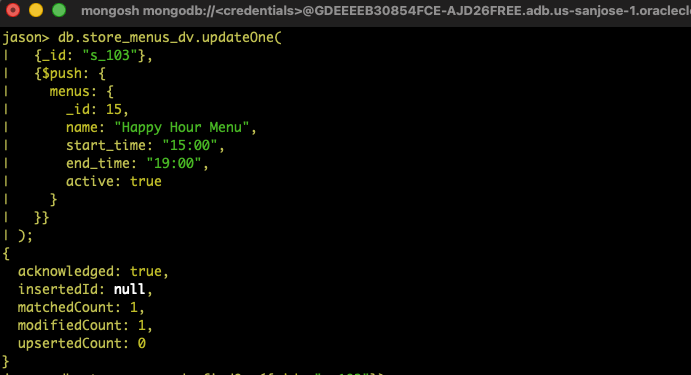
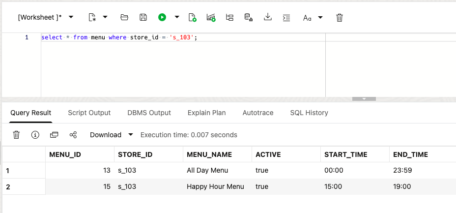
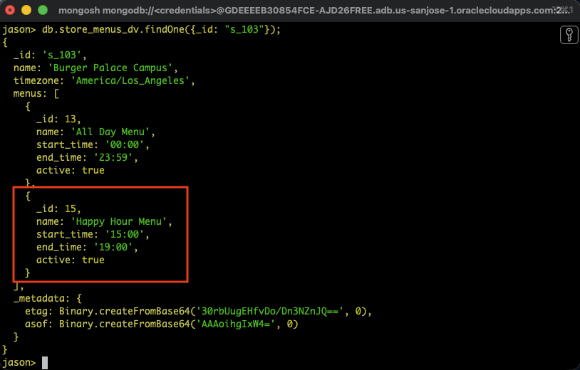
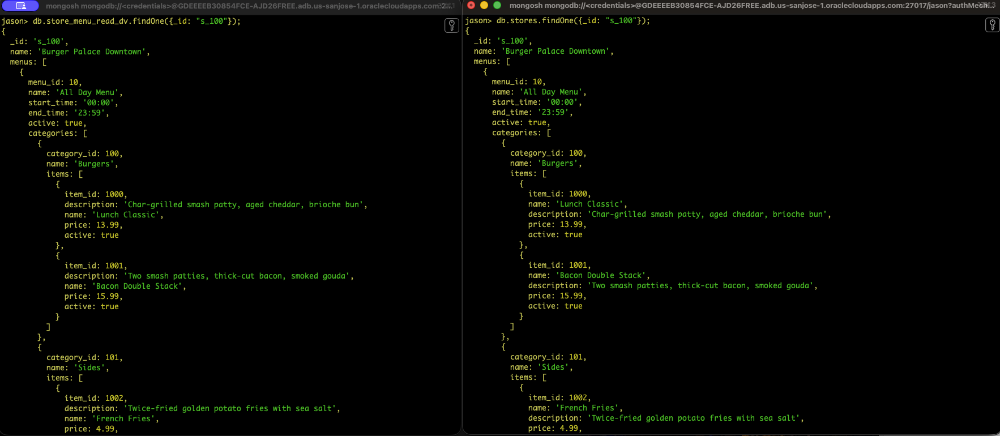
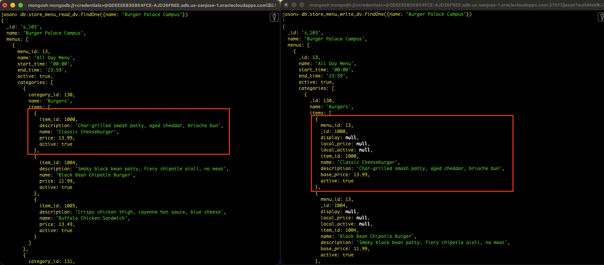
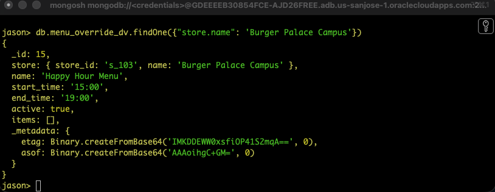
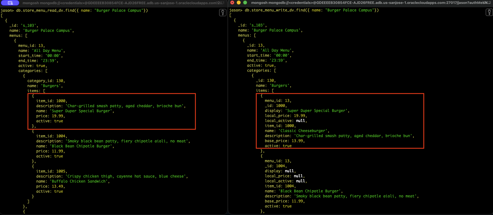
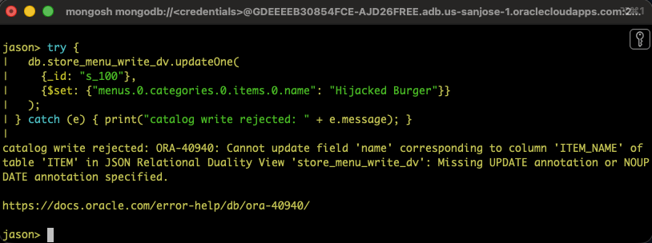
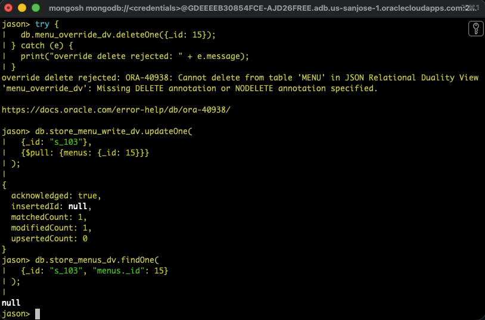
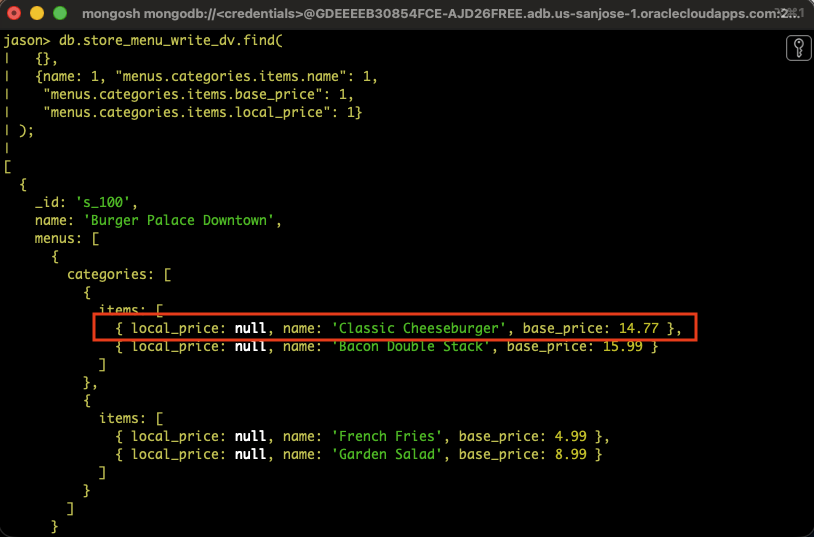

# Get the Document Back — Duality Views and Governance

## Introduction

In Lab 4 you traded your document ergonomics for one relational copy of the truth. This lab ends the trade-off: a **JSON Relational Duality View** gives you back Lab 2's document read — same nesting, assembled live from the canonical rows — and adds things the embedded model never had: per-field write governance the engine enforces against *every* API, appropriate JSON document projections for different application modules, proper handling of the Corporate menu and local overrides, and one consistency model you can witness across surfaces in the same commit.

The canonical schema stores one chain catalog and each location's menu offering separately. You will create several Duality Views - JSON document projections - giving the store manager application three deliberate data API interfaces over that same data:

* a writable store/menu/category/menu-item document
* an exact-shape read document with effective values
* a narrow view for changing local menu-item overrides

The catalog `item` table is never writable through these views. Managing core items is reserved for Corporate, but would follow a similar schema. Oracle enforces that rule, together with the relational foreign keys and check constraints,for SQL, MongoDB, and REST alike.

Estimated Lab Time: 10 minutes

### Objectives

* A quick recap of the concept of Duality Views
* Assemble the original `store → menus → categories → items` document shape with the local store overrides
* Keep the store, menu, category, and menu-item levels writable
* Keep the chain catalog read-only
* Manage local name, price, and active overrides explicitly
* See view governance and relational constraints reject invalid MongoDB writes

### Prerequisites

* Completed **Lab 4** — the original eight-table canonical schema exists and
  has been populated from the `stores` JSON collection

## Task 0: A Short Recap of Duality Views

A JSON Relational Duality View is a live document projection over relational tables. It does not copy the data: reads assemble the document from rows, and write annotations determine which tables or fields an application may change. Different views can expose the same rows in different shapes for different jobs. You can control the visibility of attributes as well, just as generate attributes at runtime for read and write operations.

This small read-only view is the simplest example — one store document with its store information and menus:

```sql
<copy>
CREATE OR REPLACE JSON RELATIONAL DUALITY VIEW "store_menus_dv" AS
store {
  _id      : store_id,
  name     : merchant_name,
  timezone,
  menus : menu @insert @update [{
    _id        : menu_id,
    name       : menu_name,
    start_time,
    end_time,
    active
  }]
};
</copy>
```
This view combines the store and menu information in its object-document model definition. It allows the insertion and update of menus but no modification to the store information. 

Let us quickly insert a new menu:

```javascript
<copy>
db.store_menus_dv.updateOne(
  {_id: "s_103"},
  {$push: {
    menus: {
      _id: 15,
      name: "Happy Hour Menu",
      start_time: "15:00",
      end_time: "19:00",
      active: true
    }
  }}
);
</copy>
```



This operation added a new store menu in the underlying relational menu table for store "s_103":

```sql
<copy>
select * from menu where store_id = 's_103';
</copy>
```



Look at the menus for store `s_103`, and you will see the new menu option for this store as part of the business object:

```javascript
<copy>
db.store_menus_dv.findOne({_id: "s_103"});
</copy>
```


In the following sections, we will create different duality views on top of the canonical relational schema. The views have different attribute exposure and data governance enforcement, ensuring a proper business object representation and manipulation for the store manager application.

## Task 1: Create a JSON document representation matching the original json collection

The first view gives us the same store menu view as the JSON collection, including the identical JSON documents as initially stored, where local overrides of price and item name silently change the content without proper identification. Since this view does not distinguish whether the item information is coming from Corporate or from a local store, this JSON collection representation is read only.

```sql
<copy>
CREATE OR REPLACE JSON RELATIONAL DUALITY VIEW "store_menu_read_dv" AS
store {
  _id   : store_id,
  name  : merchant_name,
  menus : menu [{
    menu_id,
    name : menu_name,
    start_time,
    end_time,
    active,
    categories : category [{
      category_id,
      name : category_name,
      items : menu_item [{
        menu_id     : menu_id @hidden,
        category_id : category_id @hidden,
        item @unnest {
          item_id,
          description,
          name @generated(sql: "coalesce(display_name, item_name)"),
          price @generated(sql: "coalesce(price, base_price)"),
          active @generated(sql: "coalesce(active, active)")
        }
      }]
    }]
  }]
};
</copy>
```

Compare the output of both this duality View and the initial JSON collection "stores" side-by-side. Run the following statements in **mongosh**:

```javascript
<copy>
db.stores.findOne({_id: "s_100})
db.store_menu_read_dv.findOne({_id: "s_100})
</copy>
```



## Task 2: Create a Duality View exposing the business model of chain items with local override

The second duality view exposes more of the inner working of our chain stores: it exposes both the Corporate item prices and labeling, as well as the local overrides explicitly. The read view hides those implementation columns and computes the effective `name`, `price`, and `active` values.

Run the following in your **SQL Worksheet**:

```sql
<copy>
CREATE OR REPLACE JSON RELATIONAL DUALITY VIEW "store_menu_write_dv" AS
store @insert @update @delete {
  _id   : store_id,
  name  : merchant_name,
  menus : menu @insert @update @delete [{
    _id        : menu_id,
    name       : menu_name,
    start_time,
    end_time,
    active,
    categories : category @insert @update @delete [{
      _id  : category_id,
      name : category_name,
      items : menu_item @insert @update @delete [{
        menu_id      : menu_id,
        _id          : item_id,
        display      : display_name,
        local_price  : price,
        local_active : active,
        item @unnest @noinsert @noupdate @nodelete {
          item_id,
          name        : item_name,
          description,
          base_price,
          active
        }
      }]
    }]
  }]
};
</copy>
```
This Duality View lets you:
- create a menu
- add/remove categories
- add/remove catalog items from a menu
- set local display/price/active values

Let's look at the initial read-only Duality View and its writeable counterpart side by side. Remember, these are two collections when accessed with a document store API such as mongosh, but the data is only stored **once**. One source of truth.

Run the following statements in **mongosh**:

```javascript
<copy>
db.store_menu_write_dv.findOne({name: "Burger Palace Campus"})
db.store_menu_read_dv.findOne({name: "Burger Palace Campus"})
</copy>
```



Remember this item.

## Task 3: Manage a Local Override using a purpose-build data API with Duality Views

This view lets you manage the menu items of a given store as a branch manager. The functionality this view provides is solely to manage the local menus of a store. For any item, you can change
- display
- local_price
- local_active

Issue the following statement in your **SQL Worksheet**:
```sql
<copy>
CREATE OR REPLACE JSON RELATIONAL DUALITY VIEW "menu_override_dv" AS
menu @noinsert @noupdate @nodelete {
  _id : menu_id,

  store @noinsert @noupdate @nodelete {
    _id  : store_id,
    name : merchant_name
  },

  name       : menu_name,
  start_time,
  end_time,
  active,

  items : menu_item @update [{
    menu_id,
    _id             : item_id,
    category_id,
    override_name   : display_name,
    override_price  : price,
    override_active : active,

    item @unnest @noinsert @noupdate @nodelete {
      item_id,
      name        : item_name,
      description,
      base_price,
      active
    }
  }]
};
</copy>
```

Let's have a look at one store and see whether it has any local override, meaning menu items that digress from the Corporate catalog.

Run the following statements in **mongosh**:

```javascript
<copy>
db.menu_override_dv.findOne({"store.name": 'Burger Palace Campus'})
</copy>
```

As you will see, there are no items that have an override. This matches the output of the previous duality view (see screenshot above), where the menu reflects the Corporate items.



Our store **Burger Palace Campus** decided to digress from the Corporate menu, going in big on fancy burgers. The store manager decides to override the menu temporarily. This can be done very easily and safely with the menu override view.

Run the following statements in **mongosh**:

```javascript
<copy>
db.menu_override_dv.updateOne(
  {
    "store.name": "Burger Palace Campus",
    "items.name": "Classic Cheeseburger"
  },
  {
    $set: {
      "items.$[i].override_name": "Super Duper Special Burger",
      "items.$[i].override_price": 19.99
    }
  },
  {
    arrayFilters: [
      {"i.name": "Classic Cheeseburger"}
    ]
  }
);
</copy>
```

This change is instantly reflected in the published read only menu, and the inner workings can be seen in the writeable view. Run the following statements in **mongosh**:

```javascript
<copy>
db.store_menu_write_dv.findOne({name: "Burger Palace Campus"})
db.store_menu_read_dv.findOne({name: "Burger Palace Campus"})
</copy>
```




## Task 4: Watch the Rules Reject Invalid Writes (mongosh)

Using Duality Views as data API interface allows you to have fine-grained control over individual attributes within a single JSON document. Unlike document stores, you do not have to code such rules in the application layer but can rely on the security enforced in the database. The following section illustrates this with simple examples.

Let's try to change a Corporate item as part of the menu maintenance in a store. It will fail. Run the following statements in **mongosh**:

```javascript
<copy>
try {
  db.store_menu_write_dv.updateOne(
    {_id: "s_100"},
    {$set: {"menus.0.categories.0.items.0.name": "Hijacked Burger"}}
  );
} catch (e) { print("catalog write rejected: " + e.message); }
</copy>
```



Now let's try to manage the menus. Remember that we added a new **Happy Hour** menu (id 15) just recently? Well, it turns out we are not ready for it, and we want to remove it.

The store manager, having limited override privileges, tries it with their interface `menu_override_dv`, and it fails. It requires the power of a regional manager with access to `store_menu_write_dv` to accomplish this. Run the following statements in **mongosh**:

```javascript
<copy>
try {
  db.menu_override_dv.deleteOne({_id: 15});
} catch (e) {
  print("override delete rejected: " + e.message);
}

db.store_menu_write_dv.updateOne(
  {_id: "s_103"},
  {$pull: {menus: {_id: 15}}}
);

db.store_menus_dv.findOne(
  {_id: "s_103", "menus._id": 15}
);
</copy>
```



## Task 5: Witness One Catalog Update Everywhere (SQL + mongosh)

Corporate decided to raise the price for **Classical Cheeseburgers** again to $14.77. With the canonical model and the relational storage, this is ONE row update, that will be atomically reflected to any store and menu that adheres to the Corporate menu items and pricing.

Issue the following statement in your **SQL Worksheet**:

```sql
<copy>
UPDATE item SET base_price = 14.77 WHERE item_id = 1000;
COMMIT;
</copy>
```

Run the following statements in **mongosh**:

```javascript
<copy>
db.store_menu_write_dv.find(
  {},
  {name: 1, "menus.categories.items.name": 1,
   "menus.categories.items.base_price": 1,
   "menus.categories.items.local_price": 1}
);
</copy>
```



Stores without a local override show the new catalog price immediately. A store with a local override keeps its deliberate local value. Both views are projections of the same relational rows; no document copy or synchronization job is involved.

## Learn More

* [JSON Relational Duality Views — annotations and updatability](https://docs.oracle.com/en/database/oracle/oracle-database/23/jsnvu/)

You may now **proceed to the next lab**.

## Acknowledgements
* **Author** - Rick Houlihan, Field CTO, Oracle Data & AI Platform
* **Last Updated By/Date** - Hermann Baer, August 2026
