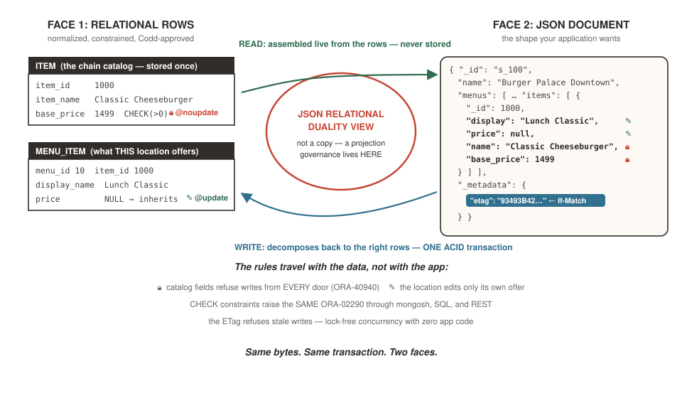

# Get the Document Back — Duality Views and Governance

## Introduction

In Lab 4 you traded your document ergonomics for one copy of the truth. This lab ends the trade-off: a **JSON Relational Duality View** gives you back Lab 2's document read — same nesting, assembled live from the canonical rows — and adds things the embedded model never had: per-field write governance the engine enforces against *every* API, and one consistency model you can witness across surfaces in the same commit.

Estimated Lab Time: 11 minutes

### Objectives

* Create the store-menu duality view, with the chain catalog flattened in read-only
* Recover the Lab 2 document read through the MongoDB API
* Witness the cross-surface commit: one SQL row update, every document projection current
* Prove one enforcement domain: the same `ORA-02290` through mongosh that SQL got in Lab 4, and a catalog write refused outright
* Read the same document through REST — the third door

## Task 1: Create the Views (SQL — one paste)

1. In the **SQL worksheet**, paste this and run it as a script. Duality views are **read-only by default**; you grant writes per table, which *is* the governance posture. Read the annotations as the franchise rule: `menu_item` is `@update` — the location owns its price and display name — while the `item` catalog block is `@unnest @noupdate`, so its columns appear as ordinary fields in the document but **cannot be written through it**. `@unnest` is what keeps the document the same shape you built by hand in Lab 2.

    ```
    <copy>
    CREATE OR REPLACE JSON RELATIONAL DUALITY VIEW "store_menu_dv" AS
    store @insert @update @delete
    {
      _id   : store_id
      name  : merchant_name
      menus : menu @insert @update
      [ {
          _id  : menu_id
          name : menu_name
          categories : category @insert @update
          [ {
              _id   : category_id
              name  : category_name
              items : menu_item @insert @update @delete
              [ {
                  menu_id : menu_id
                  _id     : item_id
                  price   : price
                  display : display_name
                  item @unnest @noinsert @noupdate @nodelete
                  {
                    item_id     : item_id
                    name        : item_name
                    description : description
                    base_price  : base_price
                  }
              } ]
          } ]
      } ]
    };
    BEGIN
      ORDS.ENABLE_SCHEMA;
      ORDS.ENABLE_OBJECT(p_object => 'store_menu_dv', p_object_type => 'VIEW');
    END;
    /
    SELECT COUNT(*) AS store_docs FROM "store_menu_dv";
    </copy>
    ```

    **What you should see:** the view created, PL/SQL procedure completed, and the state check returning `STORE_DOCS 5`.

    > **Shape note (verified live on 26ai):** an `@unnest` block must project **its own linking column and the referenced table's full primary key**, or creation fails — first `ORA-42650`, then `ORA-40607`. That is why `item_id` appears on both sides.



## Task 2: The Document Comes Back (mongosh)

1. In **mongosh**:

    ```
    <copy>
    db.store_menu_dv.findOne({ _id: "s_100" })
    </copy>
    ```

    **What you should see:** **a document, not `null`** — Burger Palace, same nesting you built by hand in Lab 2 (items keyed `_id` per duality convention, plus a `_metadata` block with an `etag`). If you get `null`, the views did not get created — go back to Task 1 and check the script ran clean.

    The difference from Lab 2: this document is **assembled live from the canonical rows**. It is not a copy of anything. *Documents that ARE the relational data.*

## Task 3: The Cross-Surface Commit Witness

1. In the **SQL worksheet** — corporate raises the price again:

    ```
    <copy>
    UPDATE item SET base_price = 14.99 WHERE item_id = 1000;
    COMMIT;
    </copy>
    ```

2. Back in **mongosh** — every store's document, one paste:

    ```
    <copy>
    db.store_menu_dv.find(
      {},
      { name: 1, "menus.categories.items.name": 1, "menus.categories.items.price": 1 }
    )
    </copy>
    ```

    **What you should see:** **every location that inherits the corporate price now shows 14.99** — on the same commit, no refresh, no pipeline. Four of the five move; the Airport keeps **14.99** of its own because it set a local override, and a corporate change must not silently overwrite a deliberate local decision.

    That is the shape of the win. In Lab 3 the same change was `modifiedCount: 4` full-document rewrites with one silent miss. Here it was **one row** — `UPDATE item SET base_price` — and the chain catalog is stored exactly once, so there is exactly one price that can ever be wrong. At 7,500 locations it is still one row.

    > Meanwhile `db.stores` — the Lab 2 collection — still holds the old embedded world, drift and all. It stays, on purpose, as a **museum piece**: that contrast *is* the lab.

## Task 4: Governance the Engine Enforces (mongosh — one script)

1. Paste these probes into **mongosh** as one block:

    ```
    <copy>
    // 1. The location changes its own local price - ALLOWED (@update on menu_item)
    db.store_menu_dv.updateOne(
      { _id: "s_102" },
      { $set: { "menus.0.categories.0.items.0.price": 13.50 } }
    );

    // 2. The location tries to rewrite the CHAIN CATALOG name - REJECTED
    try {
      db.store_menu_dv.updateOne(
        { _id: "s_102" },
        { $set: { "menus.0.categories.0.items.0.name": "Hijacked Burger" } }
      );
    } catch (e) { print("catalog write: " + e.message); }

    // 3. Negative price through the document API - meets the CHECK constraint
    try {
      db.store_menu_dv.updateOne(
        { _id: "s_102" },
        { $set: { "menus.0.categories.0.items.0.price": -1 } }
      );
    } catch (e) { print("negative price: " + e.message); }
    </copy>
    ```

    **What you should see** (captured live on Autonomous Database):
    - Probe 1 succeeds — the location owns its own price (`menu_item` is `@update`).
    - Probe 2 **rejected by the engine**: `ORA-40940: Cannot update field 'name' corresponding to column 'ITEM_NAME' of table 'ITEM' … Missing UPDATE annotation` — the chain catalog is not the location's to rewrite. Note the code: **ORA-40940** is the *field*-level refusal; `ORA-40939` is its table-level sibling.
    - Probe 3 rejected with a two-line error ending in the star of the show:
      ```
      ORA-42692: Cannot update JSON Relational Duality View 'RESTO'.'store_menu_dv': Error while updating table 'ITEM'
      ORA-02290: check constraint violated
      ```
      The *same* `ORA-02290` your SQL insert hit in Lab 4. One rulebook, every door. *There is no per-surface validation layer to drift out of agreement, because there is nothing to keep in agreement.*

2. In the **SQL worksheet**, watch the document write land as a relational row:

    ```
    <copy>
    SELECT m.store_id, mi.item_id, mi.display_name, mi.price
FROM   menu_item mi JOIN menu m ON m.menu_id = mi.menu_id
WHERE  mi.display_name IS NOT NULL OR mi.price IS NOT NULL
ORDER  BY m.store_id, mi.item_id;
    </copy>
    ```

    **What you should see:** the local deviations, and only those — Downtown's renamed burger and the Airport's three premium prices. Everything else inherits from the catalog and stores no row of its own. The mongosh `$set` decomposed to an `UPDATE` on a table, in one ACID transaction. Governance lives in the view, not in app code.

    > Identity check, worth ten seconds: everything you have done this session — mongosh writes, SQL DDL, and (next task) REST reads — executes as the **same database user under one privilege model and one audit trail**. On a polyglot stack that is three user stores and three audit systems.

## Task 5: The Third Door — REST

1. In a **terminal** (not mongosh — open a second terminal window, or `exit` first), read the same document through ORDS with `curl`. Substitute your Database Actions hostname and schema credentials:

    ```
    <copy>
    curl -s -u 'USERNAME:PASSWORD' \
      "https://HOST.adb.REGION.oraclecloudapps.com/ords/USERNAME/store_menu_dv/s_100"
    </copy>
    ```

    **What you should see:** the same Burger Palace document, third door — with `"_metadata": { "etag": ... }`. That etag powers lock-free optimistic concurrency, which is Lab 6 (optional) — the write choreography with `If-Match` and the teaching `412`.

### Stretch (fast finishers): the read-only computed view

The deck's *read-only* POS menu view: `COALESCE` override resolution and a time-window filter pinned to 13:00, so everyone sees the Lunch menu regardless of conference timezone. Paste it into the **SQL worksheet**:

    ```
    <copy>
    CREATE OR REPLACE VIEW pos_menu_v AS
    SELECT JSON {
             '_id'  : s.store_id,
             'name' : s.merchant_name,
             'menu' : ( SELECT JSON {
                          '_id'   : m.menu_id,
                          'name'  : m.menu_name,
                          'items' : [ SELECT JSON {
                                        '_id'    : i.item_id,
                                        'name'   : COALESCE(mi.display_name, i.item_name),
                                        'price'  : COALESCE(mi.price,        i.base_price),
                                        'active' : COALESCE(mi.active,       i.active) }
                                      FROM menu_item mi
                                      JOIN item i ON i.item_id = mi.item_id
                                      WHERE mi.menu_id = m.menu_id ]
                        }
                        FROM menu m
                        WHERE m.store_id = s.store_id
                        AND   m.active
                        AND   '13:00' BETWEEN m.start_time AND m.end_time )
           } AS json_doc
    FROM   store s;
    SELECT json_serialize(p.json_doc PRETTY) FROM pos_menu_v p
    WHERE  json_value(p.json_doc, '$._id') = 's_100';
    </copy>
    ```

**What you should see:** Burger Palace's lunch menu with the item named **Lunch Classic Special** — the override resolved by `COALESCE`, computed at read time. This teaches the distinction this room always asks about: **updatable duality views map 1:1; read-only views compute, filter, and COALESCE freely** — that's the trade for updatability.

## Learn More

* [JSON Relational Duality Views — annotations and updatability](https://docs.oracle.com/en/database/oracle/oracle-database/23/jsnvu/)

## Acknowledgements
* **Author** - Rick Houlihan, Field CTO, Oracle Data & AI Platform
* **Last Updated By/Date** - Rick Houlihan, July 2026
