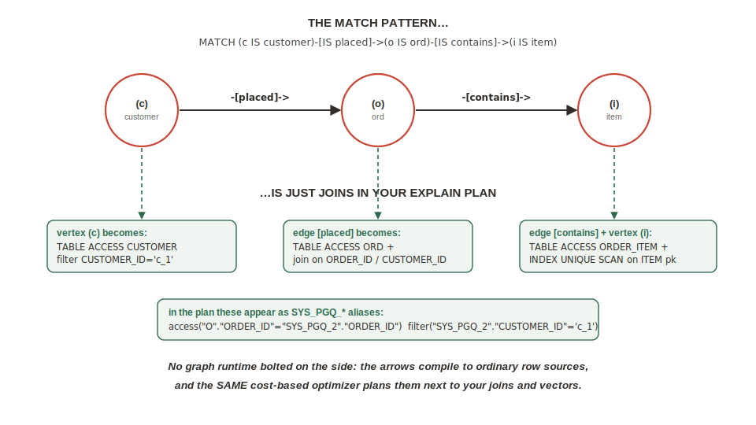

# Lab 7: Orders and the Upsell Graph (SQL/PGQ)

## Introduction

Not everything should be a duality view — and knowing when *not* to project is the methodology working. Orders run the dials the other way: one lifecycle, write-heavy while building, read whole at checkout. That's a **pure document**, stored native, with menu data snapshotted at the moment of sale. *Menu = reference truth (normalized, projected). Order = transaction truth (frozen). Same database, two strategies, one methodology.*

Then the payoff: a **property graph** projected over the orders your own Mongo shell wrote, answering the oldest upsell question in the business — *do you want fries with that?* — as a two-hop MATCH. No graph database, no export, no pipeline.

Estimated Lab Time: 7 minutes

### Objectives

* Create a JSON collection table for orders and seed it through the MongoDB API
* Flatten the order documents into graph tables with `JSON_TABLE`
* Create a property graph and run a co-order recommendation with `GRAPH_TABLE ... MATCH`

## Task 1: Orders as Native Documents

1. In the **SQL worksheet** — warm up Lab 8 first (background, non-blocking; continue immediately), then create the collection:

    ```
    <copy>
    @scripts/06_model_bg_reload.sql
    CREATE JSON COLLECTION TABLE "orders";
    </copy>
    ```

    (If your worksheet doesn't support `@`, paste `scripts/06_model_bg_reload.sql` yourself — it is a no-op when the `MENU_MODEL` is already loaded, which the preflight confirmed.)

    Quoted lowercase again — so `db.orders` in mongosh binds to **this** table, not a second accidental collection. Two worlds, one namespace.

2. In **mongosh**, seed 40 orders (also in `scripts/06_orders_seed.mongo.js`) — the script builds them deterministically, heavily co-ordering the Classic Cheeseburger with French Fries, line items snapshotting the current 1499 price:

    Paste the whole of `scripts/06_orders_seed.mongo.js` into mongosh.

    **What you should see:** `insertedCount: 40` (as `acknowledged: true` with 40 ids, `ord_8001`–`ord_8040`).

3. Entry gate, from **SQL**:

    ```
    <copy>
    SELECT COUNT(*) AS orders_loaded FROM "orders";
    </copy>
    ```

    **What you should see:** `40`. The documents mongosh just wrote, counted by SQL, zero copies in between.

## Task 2: Project the Graph

1. Run `scripts/06_graph.sql` as a script. It flattens the collection into three graph tables — `ord` (order header), `customer` (distinct customers), and `order_item` (line items, with a `line_no` so duplicate items stay unique) — then declares the graph over them. The graph DDL:

    ```
    <copy>
    CREATE PROPERTY GRAPH order_graph
      VERTEX TABLES (
        customer KEY (customer_id),
        ord      KEY (order_id),
        item     KEY (item_id) PROPERTIES (item_id, item_name)
      )
      EDGE TABLES (
        ord AS placed KEY (order_id)
          SOURCE      KEY (customer_id) REFERENCES customer (customer_id)
          DESTINATION KEY (order_id)    REFERENCES ord (order_id)
          LABEL placed,
        order_item AS contains KEY (order_id, line_no)
          SOURCE      KEY (order_id) REFERENCES ord (order_id)
          DESTINATION KEY (item_id)  REFERENCES item (item_id)
          LABEL contains
      );
    </copy>
    ```

    A flatten is *a projection step, not a second source of truth* — the orders collection remains the transaction record. Note the `contains` edge lands on the canonical `item` table from Lab 4: the graph spans document-born data **and** relational truth in one declaration.

2. The recommendation — who ordered the cheeseburger (item 1000) also ordered… Read the MATCH pattern like arrows on a whiteboard: customer → placed → order → contains → item, twice, sharing the customer:

    ```
    <copy>
    SELECT y_name, COUNT(*) AS together
    FROM GRAPH_TABLE (order_graph
      MATCH (c IS customer)-[IS placed]->(o1 IS ord)-[IS contains]->(x IS item),
            (c IS customer)-[IS placed]->(o2 IS ord)-[IS contains]->(y IS item)
      WHERE x.item_id = 1000 AND y.item_id <> 1000
      COLUMNS (y.item_name AS y_name))
    GROUP BY y_name
    ORDER BY together DESC
    FETCH FIRST 5 ROWS ONLY;
    </copy>
    ```

    **What you should see:** **French Fries on top** — the kiosk upsell as a two-hop MATCH, over documents your own mongosh session wrote three minutes ago, joined to the relational item table, on one engine.

    

    > On a polyglot stack this module is: Mongo → change streams/Debezium → a graph database, with its own consistency timeline to operate and pay for. Here it was two pastes.

### Stretch (fast finishers): predict, then run

Before you run it — which item co-orders most with the Szechuan Tofu Stir-Fry (`item_id 2001`)? Change `1000` to `2001` in the MATCH and check your prediction.

## Learn More

* [SQL/PGQ property graphs in Oracle Database](https://docs.oracle.com/en/database/oracle/property-graph/)

## Acknowledgements
* **Author** - Rick Houlihan, Field CTO, Oracle Data & AI Platform
* **Last Updated By/Date** - Rick Houlihan, July 2026
