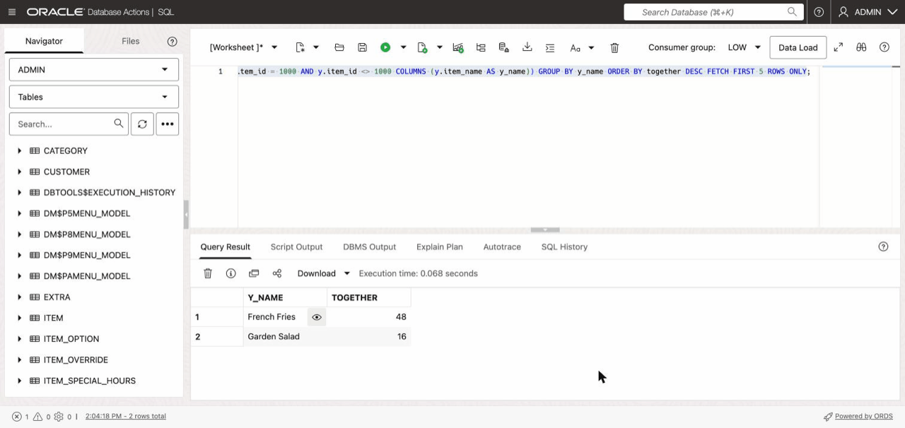
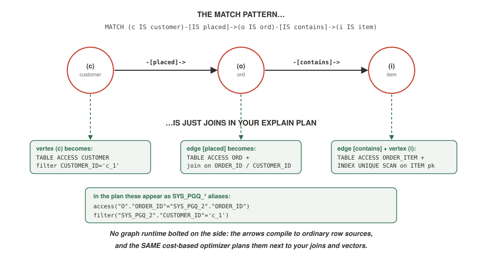

# Orders and the Upsell Graph (SQL/PGQ)

## Introduction

Not everything should be a duality view — and knowing when *not* to project is the methodology working. Orders run the dials the other way: one lifecycle, write-heavy while building, read whole at checkout. That's a **pure document**, stored native, with menu data snapshotted at the moment of sale. *Menu = reference truth (normalized, projected). Order = transaction truth (frozen). Same database, two strategies, one methodology.*

Then the payoff: a **property graph** projected over the orders your own Mongo shell wrote, answering the oldest upsell question in the business — *do you want fries with that?* — as a two-hop MATCH. No graph database, no export, no pipeline.

Estimated Lab Time: 7 minutes

### Objectives

* Create a JSON collection table for orders and seed it through the MongoDB API
* Flatten the order documents into graph tables with `JSON_TABLE`
* Create a property graph and run a co-order recommendation with `GRAPH_TABLE ... MATCH`

## Task 1: Orders as Native Documents

1. First, start the embedding model loading — Lab 8 needs it, and doing it now means it is ready by the time you get there. In the **SQL worksheet**, paste this and run it as a script (also in `scripts/06_model_bg_reload.sql`).

    It downloads Oracle's augmented MiniLM ONNX model directly into the database and loads it as `MENU_MODEL`. Nothing is downloaded to your laptop, and no embedding service or API key is involved. If your environment already has the model, it says so and does nothing.

    ```
    <copy>
    SET SERVEROUTPUT ON
    DECLARE
      model_count NUMBER;
    BEGIN
      SELECT COUNT(*) INTO model_count
      FROM   user_mining_models
      WHERE  model_name = 'MENU_MODEL';

      IF model_count > 0 THEN
        DBMS_OUTPUT.PUT_LINE('MENU_MODEL already present - nothing to do.');
      ELSE
        DBMS_CLOUD.GET_OBJECT(
          object_uri     => 'https://adwc4pm.objectstorage.us-ashburn-1.oci.customer-oci.com/p/eLddQappgBJ7jNi6Guz9m9LOtYe2u8LWY19GfgU8flFK4N9YgP4kTlrE9Px3pE12/n/adwc4pm/b/OML-Resources/o/all_MiniLM_L12_v2.onnx',
          directory_name => 'DATA_PUMP_DIR',
          file_name      => 'all_MiniLM_L12_v2.onnx');

        DBMS_VECTOR.LOAD_ONNX_MODEL(
          directory  => 'DATA_PUMP_DIR',
          file_name  => 'all_MiniLM_L12_v2.onnx',
          model_name => 'MENU_MODEL');

        DBMS_OUTPUT.PUT_LINE('MENU_MODEL loaded.');
      END IF;
    END;
    /

    SELECT model_name, algorithm, mining_function
    FROM   user_mining_models
    WHERE  model_name = 'MENU_MODEL';
    </copy>
    ```

    **What you should see:** `MENU_MODEL loaded.` (or `already present`), then a row showing `MENU_MODEL`. It takes about a minute.

2. Now create the collection that will hold orders:

    ```
    <copy>
    CREATE JSON COLLECTION TABLE "orders";
    </copy>
    ```

    Quoted lowercase again — the house convention from Lab 4, so the name you read here is the name you type in mongosh. (Oracle's case-alias synonym means `db.orders` would find an unquoted `ORDERS` too.)

3. In **mongosh**, seed 40 orders — ten customers, four orders each. They are built deterministically, so every attendee gets the same graph, and line items snapshot the catalog price at the moment of sale.

    Notice the shape of the data: customers belong to **ordering cohorts**, and each cohort only orders at locations that actually sell its items. That is not decoration. `GRAPH_TABLE` finds co-orders through a shared *customer*, not a shared order — so if every customer ordered a bit of everything, "people who ordered X also ordered Y" would collapse into "Y is the most popular item on the menu." Diners have habits. Model them, or the graph has nothing to say. Paste the whole block (also in `scripts/06_orders_seed.mongo.js`):

    ```
    <copy>
    const CATALOG = {
      "1000": {
        "name": "Classic Cheeseburger",
        "price": 1299
      },
      "1001": {
        "name": "Bacon Double Stack",
        "price": 1599
      },
      "1002": {
        "name": "French Fries",
        "price": 499
      },
      "1003": {
        "name": "Garden Salad",
        "price": 899
      },
      "1004": {
        "name": "Black Bean Chipotle Burger",
        "price": 1199
      },
      "1005": {
        "name": "Buffalo Chicken Sandwich",
        "price": 1349
      },
      "1006": {
        "name": "Chocolate Malt Shake",
        "price": 599
      }
    };
    const COHORTS = [
      {
        "name": "classic",
        "customers": [
          "c_1",
          "c_2",
          "c_3",
          "c_4"
        ],
        "stores": [
          "s_100",
          "s_101",
          "s_102",
          "s_104"
        ],
        "baskets": [
          [
            1000,
            1002
          ],
          [
            1000,
            1002
          ],
          [
            1000,
            1002
          ],
          [
            1000,
            1003
          ]
        ]
      },
      {
        "name": "veggie",
        "customers": [
          "c_5",
          "c_6",
          "c_7"
        ],
        "stores": [
          "s_101",
          "s_103"
        ],
        "baskets": [
          [
            1004,
            1003
          ],
          [
            1004,
            1003
          ],
          [
            1004,
            1003
          ],
          [
            1004,
            1002
          ]
        ]
      },
      {
        "name": "indulgent",
        "customers": [
          "c_8",
          "c_9",
          "c_10"
        ],
        "stores": [
          "s_100",
          "s_101"
        ],
        "baskets": [
          [
            1001,
            1006
          ],
          [
            1001,
            1006
          ],
          [
            1001,
            1006
          ],
          [
            1001,
            1002
          ]
        ]
      }
    ];
    const orders = [];
    let n = 0;
    for (const co of COHORTS) {
      co.customers.forEach((cust, ci) => {
        co.baskets.forEach((basket, bi) => {
          n += 1;
          const store = co.stores[(ci + bi) % co.stores.length];
          const items = basket.map(id => ({ item_id: id, name: CATALOG[id].name, price: CATALOG[id].price }));
          orders.push({
            _id: "ord_" + (8000 + n), customer_id: cust, store_id: store,
            cohort: co.name, status: "closed",
            opened_at: "2026-07-20T12:" + String(n).padStart(2, "0") + ":00Z",
            items: items, total: items.reduce((s, i) => s + i.price, 0)
          });
        });
      });
    }
    db.orders.deleteMany({});
    db.orders.insertMany(orders);
    print("orders inserted: " + db.orders.countDocuments({}));
    </copy>
    ```

    **What you should see:** `acknowledged: true` with 40 ids (`ord_8001`–`ord_8040`), then `orders inserted: 40`.

4. Entry gate, from **SQL**:

    ```
    <copy>
    SELECT COUNT(*) AS orders_loaded FROM "orders";
    </copy>
    ```

    **What you should see:** `40`. The documents mongosh just wrote, counted by SQL, zero copies in between.

## Task 2: Project the Graph

1. In the **SQL worksheet**, paste this and run it as a script (also in `scripts/06_graph.sql`). It flattens the collection into three graph tables — `ord` (order header), `customer` (distinct customers), and `order_item` (line items, with a `line_no` so duplicate items stay unique) — then declares the graph over them:

    ```
    <copy>
    DROP PROPERTY GRAPH IF EXISTS order_graph;
    DROP TABLE IF EXISTS order_item CASCADE CONSTRAINTS;
    DROP TABLE IF EXISTS ord        CASCADE CONSTRAINTS;
    DROP TABLE IF EXISTS customer   CASCADE CONSTRAINTS;
    CREATE TABLE ord AS
    SELECT o.data."_id".string() AS order_id,
           o.data.customer_id.string() AS customer_id,
           o.data.store_id.string()    AS store_id
    FROM "orders" o;
    ALTER TABLE ord ADD CONSTRAINT ord_pk PRIMARY KEY (order_id);
    CREATE TABLE customer AS
    SELECT DISTINCT o.data.customer_id.string() AS customer_id FROM "orders" o;
    ALTER TABLE customer ADD CONSTRAINT customer_pk PRIMARY KEY (customer_id);
    CREATE TABLE order_item AS
    SELECT jt.order_id, jt.line_no, jt.item_id, jt.item_name
    FROM "orders" o,
         JSON_TABLE(o.data, '$'
           COLUMNS (
             order_id VARCHAR2(20) PATH '$._id',
             NESTED PATH '$.items[*]'
             COLUMNS (
               line_no   FOR ORDINALITY,
               item_id   NUMBER        PATH '$.item_id',
               item_name VARCHAR2(100) PATH '$.name'))) jt;
    ALTER TABLE order_item ADD CONSTRAINT order_item_pk PRIMARY KEY (order_id, line_no);
    CREATE INDEX order_item_item_ix ON order_item (item_id);
    CREATE INDEX ord_customer_ix    ON ord (customer_id);
    CREATE PROPERTY GRAPH order_graph
      VERTEX TABLES (
        customer KEY (customer_id),
        ord      KEY (order_id),
        item     KEY (item_id) PROPERTIES (item_id, item_name)
      )
      EDGE TABLES (
        ord AS placed KEY (order_id)
          SOURCE      KEY (customer_id) REFERENCES customer (customer_id)
          DESTINATION KEY (order_id)    REFERENCES ord (order_id)
          LABEL placed,
        order_item AS contains KEY (order_id, line_no)
          SOURCE      KEY (order_id) REFERENCES ord (order_id)
          DESTINATION KEY (item_id)  REFERENCES item (item_id)
          LABEL contains
      );
    </copy>
    ```

    **What you should see:** three tables created and `Property graph ORDER_GRAPH created.` — no errors. (The `DROP ... IF EXISTS` lines at the top make this safe to re-run.)

    A flatten is *a projection step, not a second source of truth* — the orders collection remains the transaction record. Note the `contains` edge lands on the canonical `item` table from Lab 4: the graph spans document-born data **and** relational truth in one declaration.

2. The recommendation — who ordered the cheeseburger (item 1000) also ordered… Read the MATCH pattern like arrows on a whiteboard: customer → placed → order → contains → item, twice, sharing the customer:

    ```
    <copy>
    SELECT y_name, COUNT(*) AS together
    FROM GRAPH_TABLE (order_graph
      MATCH (c IS customer)-[IS placed]->(o1 IS ord)-[IS contains]->(x IS item),
            (c IS customer)-[IS placed]->(o2 IS ord)-[IS contains]->(y IS item)
      WHERE x.item_id = 1000 AND y.item_id <> 1000
      COLUMNS (y.item_name AS y_name))
    GROUP BY y_name
    ORDER BY together DESC
    FETCH FIRST 5 ROWS ONLY;
    </copy>
    ```

    **What you should see:** **French Fries on top with 48**, then Garden Salad with 16 — and *nothing else*. The kiosk upsell as a two-hop MATCH, over documents your own mongosh session wrote three minutes ago, joined to the relational item table, on one engine.

    

    That short result list is the cohort design paying off: the only people who order the core burger are the classic crowd, so the only things that can come back are what that crowd eats. A graph over undifferentiated customers would have returned the whole menu in popularity order.

    

    > On a polyglot stack this module is: Mongo → change streams/Debezium → a graph database, with its own consistency timeline to operate and pay for. Here it was two pastes.

### Stretch (fast finishers): predict, then run

Before you run it — which item co-orders most with the Black Bean Chipotle Burger (`item_id 1004`)? Change `1000` to `1004` in the MATCH and check your prediction.

**What you should see:** **Garden Salad with 36**, then French Fries with 12. The cheeseburger does not appear at all — the veggie crowd and the classic crowd are different people, and the graph knows it.

## Learn More

* [SQL/PGQ property graphs in Oracle Database](https://docs.oracle.com/en/database/oracle/property-graph/)

## Acknowledgements
* **Author** - Rick Houlihan, Field CTO, Oracle Data & AI Platform
* **Last Updated By/Date** - Rick Houlihan, July 2026
