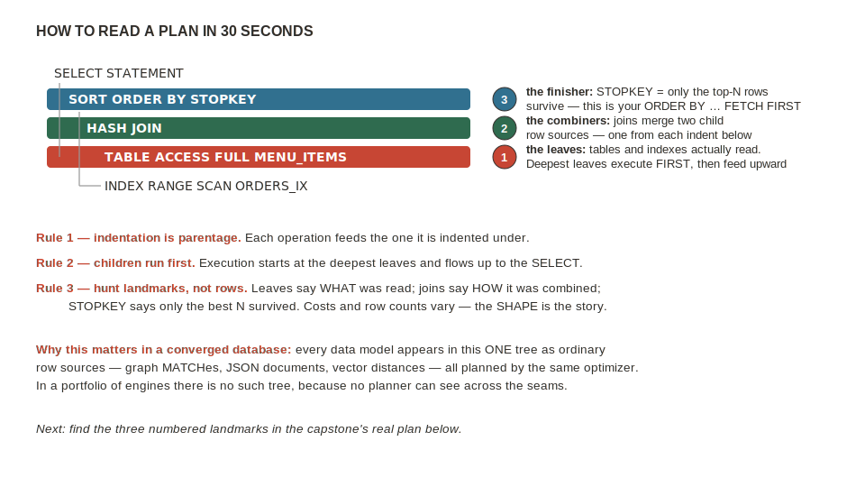
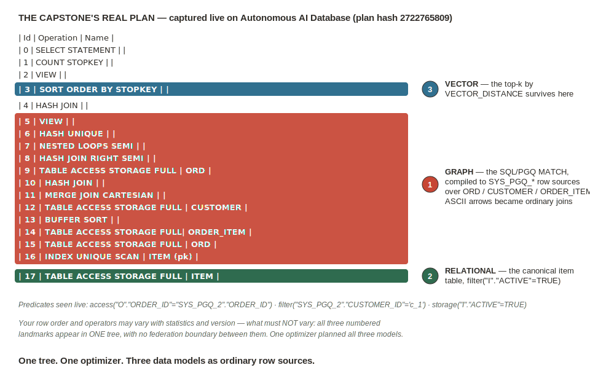

# Lab 8: Meaning, Not Keywords — and the One-Statement Finale

## Introduction

"Find me something like spicy vegetarian noodles" is a question about *meaning*, not keywords. In this lab you add AI Vector Search to the **same** `item` table you built in Lab 4 — with an ONNX embedding model that runs *inside* the database — and prove the claim vector-sync pipelines can't make: a brand-new item is findable by meaning **on the same commit**.

Then the finale: one SQL statement that walks the co-order graph from Lab 7, joins the relational truth from Lab 4, and ranks by vector distance — planned as **one tree by one optimizer**. That is the difference between a multi-model checkbox and a converged guarantee.

Estimated Lab Time: 9 minutes

### Objectives

* Add a `VECTOR` column and embed the menu in place with an in-database ONNX model
* Run semantic search filtered by a relational predicate in the same statement
* Prove same-commit freshness with an insert-then-search
* Run the graph + relational + vector capstone and read its single `EXPLAIN PLAN` tree

## Task 1: Embed the Menu in Place

1. In the **SQL worksheet** (all steps also in `scripts/07_vector.sql`) — verify the model, add the column, embed:

    ```
    <copy>
    SELECT model_name FROM user_mining_models;

    ALTER TABLE item ADD (desc_vec VECTOR(384, FLOAT32));

    UPDATE item
    SET    desc_vec = VECTOR_EMBEDDING(menu_model
                        USING item_name || ' ' || description AS data);
    COMMIT;
    </copy>
    ```

    **What you should see:** `MENU_MODEL`, then the column added, then 6 rows updated. No embedding service, no API key, no copy pipeline — the vector is generated where the row already lives. (If `MENU_MODEL` is missing and the Lab 7 background load hasn't finished, `scripts/07_vector_fallback.sql` ships precomputed vectors for every item *and* every query string in this lab.)

## Task 2: Search by Meaning

1. Ask for something no menu item contains as keywords:

    ```
    <copy>
    SELECT item_name, price
    FROM   item
    WHERE  active
    ORDER  BY VECTOR_DISTANCE(desc_vec,
             VECTOR_EMBEDDING(menu_model USING 'spicy vegetarian noodles' AS data),
             COSINE)
    FETCH FIRST 5 ROWS ONLY;
    </copy>
    ```

    **What you should see:** **Szechuan Tofu Stir-Fry** at the top — zero shared keywords with your query — filtered by the relational `active` predicate in the same statement. (Without a vector index this runs as an exact search; at menu scale that's correct and instant. Creating an HNSW index and `FETCH APPROX` is the production variant.)

## Task 3: The Freshness Proof — Insert, Then Search

1. This is the beat a bolt-on vector pipeline cannot replicate. Insert a brand-new item, embedding it **in the same transaction**, then immediately search:

    ```
    <copy>
    INSERT INTO item (item_id, category_id, item_name, description, price, active)
    VALUES (2003, 120, 'Vegan Dan Dan Noodles',
            'Hand-pulled noodles, spicy sesame-chili sauce, plant-based, no meat',
            1299, TRUE);

    UPDATE item
    SET    desc_vec = VECTOR_EMBEDDING(menu_model
                        USING item_name || ' ' || description AS data)
    WHERE  item_id = 2003;
    COMMIT;

    SELECT item_name, price
    FROM   item
    WHERE  active
    ORDER  BY VECTOR_DISTANCE(desc_vec,
             VECTOR_EMBEDDING(menu_model USING 'spicy vegetarian noodles' AS data),
             COSINE)
    FETCH FIRST 5 ROWS ONLY;
    </copy>
    ```

    **What you should see:** **Vegan Dan Dan Noodles** now in the results — in the live validation run it took the **#1 spot** (it is semantically closer to the probe than anything else on the menu) — committed and findable by meaning in the same breath. No sync window, no backfill job, no eventually-consistent index. Fresh on the commit.

## Task 4: The One-Statement Finale

1. Recommend to a customer what their co-order neighbors eat, ranked by meaning — graph, relational, and vector in one statement (also in `scripts/07_capstone.sql`):

    ```
    <copy>
    WITH ring AS (
      -- GRAPH: items ordered by customers who co-ordered with customer c_1
      SELECT DISTINCT gt.item_id
      FROM GRAPH_TABLE (order_graph
        MATCH (c IS customer)-[IS placed]->(o IS ord)-[IS contains]->(i IS item)
        WHERE c.customer_id = 'c_1'
        COLUMNS (i.item_id AS item_id)) gt
    )
    SELECT i.item_name, i.price               -- RELATIONAL: canonical truth
    FROM   ring r
      JOIN item i ON i.item_id = r.item_id
    WHERE  i.active
    ORDER  BY VECTOR_DISTANCE(i.desc_vec,     -- VECTOR: ranked by meaning
             VECTOR_EMBEDDING(menu_model USING 'vegan-friendly noodles' AS data),
             COSINE)
    FETCH FIRST 5 ROWS ONLY;
    </copy>
    ```

    **What you should see:** a ranked recommendation list drawn from the customer's co-order neighborhood, ordered by semantic similarity to a preference string.

2. Before you read your first plan, thirty seconds of anatomy:

    

3. Now look at how the engine ran it:

    ```
    <copy>
    EXPLAIN PLAN FOR
    WITH ring AS (
      SELECT DISTINCT gt.item_id
      FROM GRAPH_TABLE (order_graph
        MATCH (c IS customer)-[IS placed]->(o IS ord)-[IS contains]->(i IS item)
        WHERE c.customer_id = 'c_1'
        COLUMNS (i.item_id AS item_id)) gt
    )
    SELECT i.item_name, i.price
    FROM   ring r JOIN item i ON i.item_id = r.item_id
    WHERE  i.active
    ORDER  BY VECTOR_DISTANCE(i.desc_vec,
             VECTOR_EMBEDDING(menu_model USING 'vegan-friendly noodles' AS data),
             COSINE)
    FETCH FIRST 5 ROWS ONLY;

    SELECT * FROM dbms_xplan.display();
    </copy>
    ```

    **What you should see:** one plan tree. Use the annotated expected-plan figure to find three things in yours: **(1)** the scans of the graph tables (`ORDER_ITEM` / `ORD` — that's the GRAPH_TABLE match), **(2)** the access of the canonical `ITEM` table (RELATIONAL), **(3)** the `SORT ORDER BY STOPKEY` at the top — the vector top-k (VECTOR). Exact rows vary with statistics; the three elements in a single tree do not. Three models, row sources in **one tree**, planned by **one optimizer**, over data a Mongo driver wrote.

    

    One transaction boundary. One optimizer. One consistency model. One governance domain. Shared surfaces. You didn't hear the five guarantees — you ran them.

### Stretch (fast finishers): predict, then run

Change the probe to `'kid-friendly comfort food'` and predict the top result before you run it.

## Learn More

* [AI Vector Search users guide](https://docs.oracle.com/en/database/oracle/oracle-database/23/vecse/)
* [Converged database vs multi-model database — what's the difference?](https://blogs.oracle.com/developers/converged-database-vs-multi-model-database-whats-the-difference)

## Acknowledgements
* **Author** - Rick Houlihan, Field CTO, Oracle Data & AI Platform
* **Last Updated By/Date** - Rick Houlihan, July 2026
