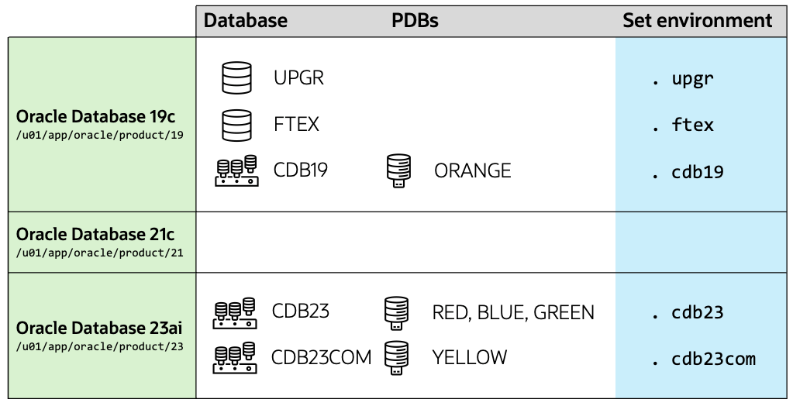

# Introduction and Overview

## About this Workshop

In this lab, you will familiarize with patching of Oracle Database. you will use AutoUpgrade to patch in the easiest way and explore the more advanced options. All exercises will guide you through out-of-place patching and show the best practices. 

Estimated Workshop Time: 120 minutes

### Objectives

In this workshop, you will:

* Patch Oracle Database
* Explore different methods of patching
* Investigate patching internals

## About the workshop contents

This workshop comes with pre-installed Oracle homes and pre-created databases.
You can switch between environments with the shortcuts shown in the last column of the below diagram.

The lab contains a number of labs that you should perform in the specified order. 

* You start by exploring patching concepts
* Then you use simple methods to patch databases
* Before moving to advanced topics
* And patching internals

## Patching methods and processes

### AutoUpgrade

- AutoUpgrade was originally developed to facilitate easier upgrades of Oracle Database. By demand of our customers, it was enhanced to also patch Oracle Database using the same easy methodology that our customers liked. The aim of AutoUpgrade is to fully automate maintenance activites and perform them according to our best practices - include all pre- and post-tasks. It can patch many databases in parallel and allows all sorts of customizations needed in today's complex environments. AutoUpgrade works on all supported platforms, for non-CDB and CDBs, for all or only selected pluggable databases.

### OPatch

- OPatch is a common utility used by many products in Oracle, including Oracle Database. OPatch patches the Oracle home, so the binaries that you use to run an Oracle Database instance. OPatch only patches the files inside the Oracle home.

### Datapatch

- Datapatch patches the database itself. Most often, patches requires changes inside the database. This could be changes to existing objects (tables, views, packages) or completely new objects. Datapatch uses *apply scripts* to make those changes. OPatch updates the apply scripts and places them in the Oracle home.

You may *proceed to the next lab*.

## Learn More

* Webinar, [Release and Patching Strategies for Oracle Database 23ai](https://www.youtube.com/watch?v=sF-rmD78zIo)
* Webinar, [One-Button Patching – makes life easier for every Oracle DBA](https://youtu.be/brnBavVLyM0)

## Acknowledgments

* **Author** - Daniel Overby Hansen
* **Contributors** - Rodrigo Jorge, Mike Dietrich
* **Last Updated By/Date** - Daniel Overby Hansen, January 2025