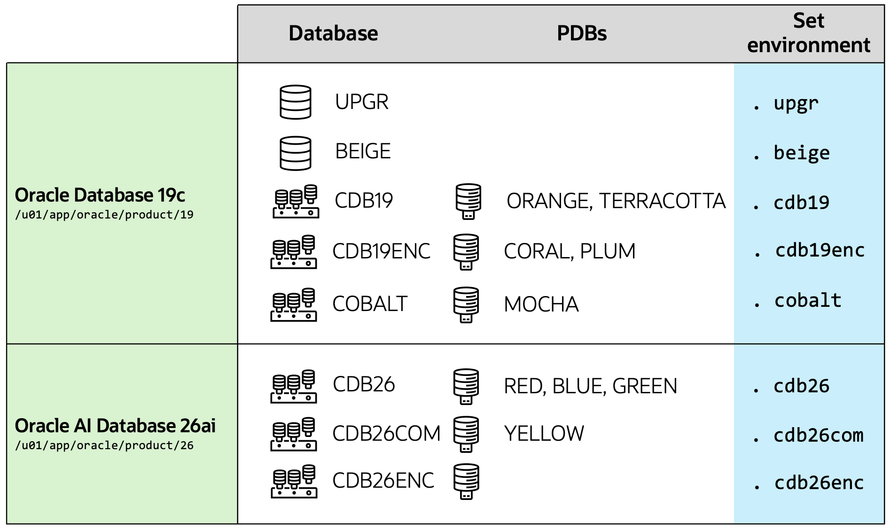

# Introduction and Overview

## About This Workshop

In this workshop, you will familiarize yourself with patching Oracle AI Database. You will use AutoUpgrade to simplify patching and explore more advanced options. The exercises will guide you through out-of-place patching and demonstrate best practices.

Estimated Workshop Time: 90 minutes

### Objectives

In this workshop, you will:

* Patch Oracle AI Database
* Explore different patching methods
* Investigate patching internals

## About the Workshop Contents

This workshop comes with preinstalled Oracle homes and precreated databases.

You can switch between environments with the shortcuts shown in the last column of the diagram below.

The workshop contains:
* 11 labs total
* 9 labs on the main track
* 2 optional labs

Guidance:
* Start by completing labs 1 through 9 in the specified order.
* Then, you can complete the optional labs in any order.

## Patching Methods and Processes

### AutoUpgrade

* AutoUpgrade was originally developed to facilitate easier upgrades of Oracle AI Database. Based on customer demand, AutoUpgrade was enhanced to patch Oracle AI Database using the same approach. AutoUpgrade aims to automate maintenance activities according to best practices, including all pre- and post-patching tasks. It can patch many databases in parallel and supports the customization required in complex environments. AutoUpgrade works on all supported platforms and supports non-CDBs, CDBs, and either all or selected PDBs. There is no separate license requirement for using AutoUpgrade. It's available to all users of Oracle AI Database.

### OPatch

* OPatch is a common utility used by many Oracle products, including Oracle AI Database. OPatch patches the Oracle home, including the binaries used to run an Oracle AI Database instance. OPatch patches only the files in the Oracle home.

### Datapatch

* Datapatch patches the database itself. Most often, patches require changes inside the database. These changes can modify existing objects (tables, views, and packages) or create new objects. Datapatch uses *apply scripts* to apply those changes. OPatch updates these apply scripts in the Oracle home.

You may now [*proceed to the next lab*](#next).

## Learn More

* Webinar, [Release and Patching Strategies for Oracle Database 23ai](https://www.youtube.com/watch?v=sF-rmD78zIo)
* Webinar, [One-Button Patching - makes life easier for every Oracle DBA](https://youtu.be/brnBavVLyM0)

## Acknowledgments

* **Author** - Daniel Overby Hansen
* **Contributors** - Rodrigo Jorge, Alex Zaballa, Mike Dietrich, Alejandro Diaz
* **Last Updated By/Date** - Daniel Overby Hansen, September 2026

