# Lab 2: Checks in the 19.18 Environment

## Introduction 
You will use this lab to check several things in the 19.18 environment while the installation in the 19.19 environment progresses. At the end of this lab, you will complete the installation of the new Oracle Home from the previous lab.

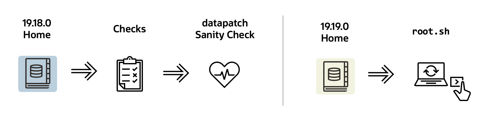


Estimated Time: 15 minutes

### Objectives

Generic Checks

### Prerequisites

This lab assumes you have:

- Connected to the lab
- Switch to the other tab titled "__19.18.0 Home__" 


## Task 1: Checks

1. Set the Source Database Environment

    ```
    <copy>
    . cdb2
    </copy>
    ```

    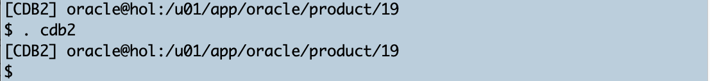

2. Current Installed Patches
Check the installed patches in the current 19.18.0 home:
 
    ```
    <copy>
    $ORACLE_HOME/OPatch/opatch lspatches
    </copy>
    ```

    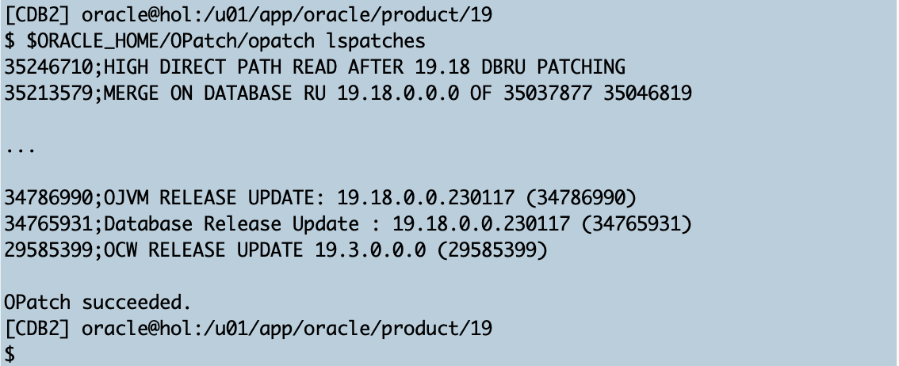

    <details>
    <summary>*click here to see the full opatch output*</summary>

      ``` text
    [CDB2] oracle@hol:/u01/app/oracle/product/19
    $ $ORACLE_HOME/OPatch/opatch lspatches
    35246710;HIGH DIRECT PATH READ AFTER 19.18 DBRU PATCHING
    35213579;MERGE ON DATABASE RU 19.18.0.0.0 OF 35037877 35046819
    35162446;NEED BEHAVIOR CHANGE TO BE SWITCHED OFF
    35160800;GG IE FAILS WITH ORA-14400 AT SYSTEM.LOGMNRC_USER AFTER ORACLE DB UPGRADE TO 19.18DBRU
    35156936;ORA-7445 [KFFBNEW()+351]  AFTER CONVERT TO ASM FLEX DISKGROUP
    34974052;DIRECT NFS CONNECTION RESET MESSAGES
    34879016;ALL SESSIONS HANG DUE TO INST_RCV BUFFER IS NOT GETTING WRITE PERMISSION
    34871935;SBI  QUEUE BUILDUP - SESSIONS SPIKE WITH GC CURRENT REQUEST  (6-DEC-2022)
    34861493;RESYNC CATALOG FAILED IN ZDLRA CATALOG AFTER PROTECTED DATABASE PATCHED TO 19.17
    34810252;SPIN OFF FOR BUG 34808861 [ORA-00600  INTERNAL ERROR CODE, ARGUMENTS  [KFDS_GETSEGREUSEENQ01] TERMINATED ALL DB INSTANCES
    34793099;STRESS FA CDB CREATION FAILS ON 19.17 WITH THE ORA-00704  BOOTSTRAP PROCESS FAILURE WHILE OPENING PDB$SEED
    34783802;PARALLEL QUERY ON PARTITIONED TABLE RETURNS WRONG RESULT
    34557500;CTWR CAUSED MULTIPLE INSTANCES IN HUNG STATE ON THE RAC STANDBY DATABASE
    34340632;AQAH  SMART MONITORING &amp; RESILIENCY IN QUEUE KGL MEMORY USAGE
    33973908;DBWR NOT PICKING UP WRITES FOR SOME TIME
    32727143;TRANSACTION-LEVEL CONTENT ISOLATION FOR TRANSACTION-DURATION GLOBAL TEMPORARY TABLES
    31222103;STRESS RAC ATPD FAN EVENTS ARE NOT GETTING PROCESSED WITH 21C GI AND 19.4 DB
    34972375;DATAPUMP BUNDLE PATCH 19.18.0.0.0
    34786990;OJVM RELEASE UPDATE: 19.18.0.0.230117 (34786990)
    34765931;Database Release Update : 19.18.0.0.230117 (34765931)
    29585399;OCW RELEASE UPDATE 19.3.0.0.0 (29585399)

    OPatch succeeded.
    [CDB2] oracle@hol:/u01/app/oracle/product/19
    $
      ```
    </details>

3. Current Java Version </br>
Check the current JDK version:

    ```
    <copy>
    $ORACLE_HOME/jdk/bin/java -version
    </copy>
    ```

    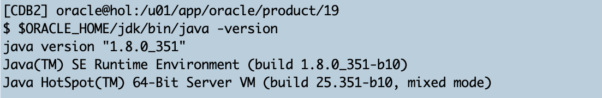


4. Current Perl Version <br>
Check the current PERL version:

    ```
    <copy>
    $ORACLE_HOME/perl/bin/perl -version
    </copy>
    ```

    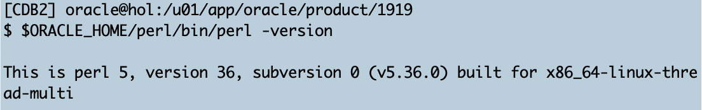

    <details>
    <summary>*click here to see the full Perl output*</summary>

      ``` text
    [CDB2] oracle@hol:/u01/app/oracle/product/19
    $ $ORACLE_HOME/perl/bin/perl -version

    This is perl 5, version 36, subversion 0 (v5.36.0) built for x86_64-linux-thread-multi

    Copyright 1987-2022, Larry Wall

    Perl may be copied only under the terms of either the Artistic License or the
    GNU General Public License, which may be found in the Perl 5 source kit.

    Complete documentation for Perl, including FAQ lists, should be found on
    this system using "man perl" or "perldoc perl".  If you have access to the
    Internet, point your browser at https://www.perl.org/, the Perl Home Page.

    [CDB2] oracle@hol:/u01/app/oracle/product/19
    $
      ```
    </details>

    Take notice of the current version "__This is perl 5, version 36, subversion 0 (v5.36.0) built for x86_64-linux-thread-multi__". 
    You will check afterward whether the patch updated the PERL version as well. </br>


5. Current Time Zone </br> 
Then check the current time zone version in the container database. Open SQL*Plus:
    ```
    <copy>
    sqlplus / as sysdba
    </copy>
    ```

    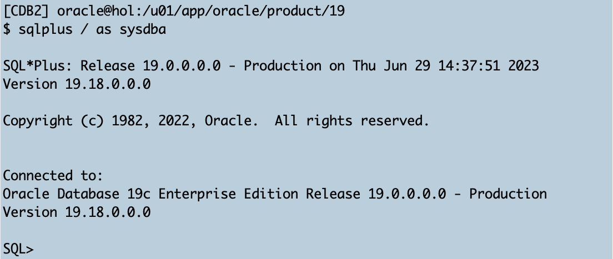

    and execute the SQL:

    ```
    <copy>
    column VALUE$ format a8
    select VALUE$, CON_ID from containers(SYS.PROPS$) 
    where NAME='DST_PRIMARY_TT_VERSION' order by CON_ID;
    </copy>

    Hit ENTER/RETURN to execute ALL commands.
    ```

    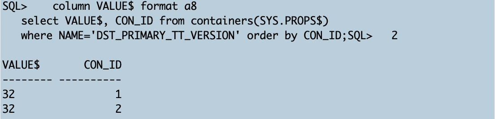

    Currently, the database uses the default timezone version deployed with Oracle Database 19c.


    Exit from SQL*Plus:

    ```
    <copy>
    exit
    </copy>
    ```

    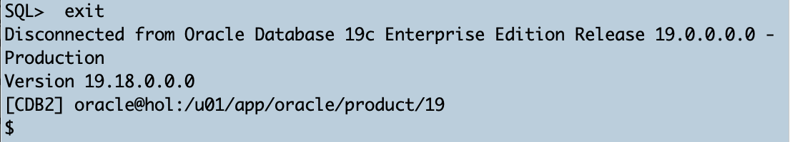

6. Datapatch Sanity Check <br>
And finally, you will do a `datapatch` sanity check:

    ```
    <copy>
    $ORACLE_HOME/OPatch/datapatch -sanity_checks
    </copy>
    ```

    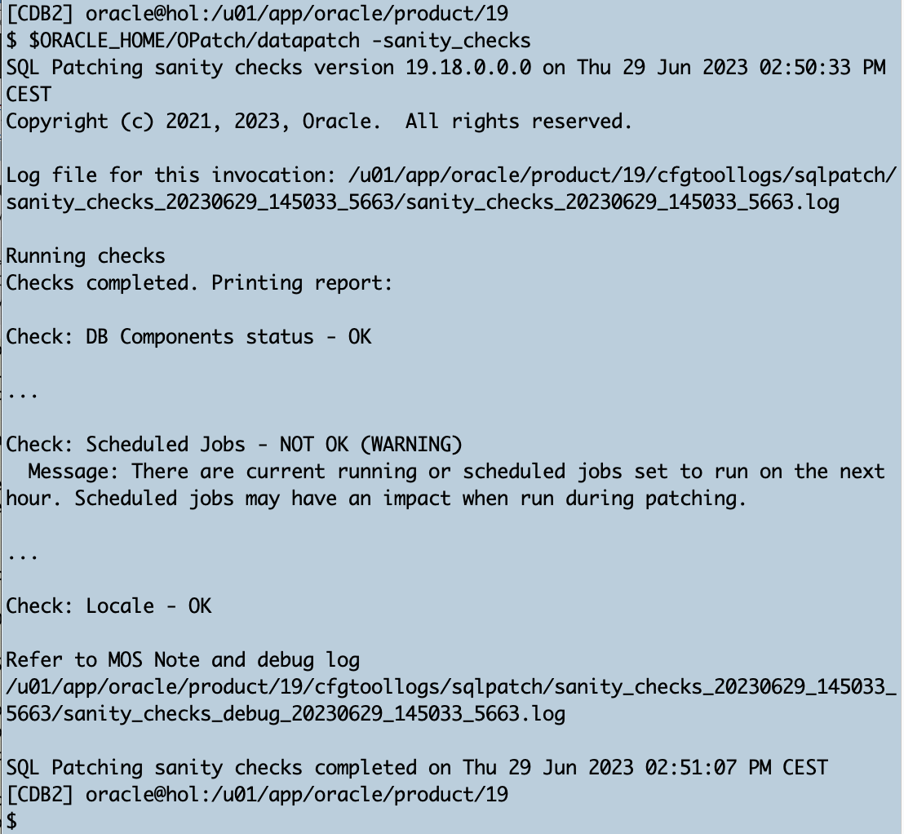


    <details>
    <summary>*click here to see the full datapatch sanity check output*</summary>

    ``` text
    [CDB2] oracle@hol:/u01/app/oracle/product/19
    $ $ORACLE_HOME/OPatch/datapatch -sanity_checks
    SQL Patching sanity checks version 19.18.0.0.0 on Thu 29 Jun 2023 02:50:33 PM CEST
    Copyright (c) 2021, 2023, Oracle.  All rights reserved.

    Log file for this invocation: /u01/app/oracle/product/19/cfgtoollogs/sqlpatch/sanity_checks_20230629_145033_5663/sanity_checks_20230629_145033_5663.log

    Running checks
    Checks completed. Printing report:

    Check: DB Components status - OK
    Check: PDB Violations - OK
    Check: System invalid objects - OK
    Check: Tablespace Status - OK
    Check: Backup jobs - OK
    Check: Temp Datafile exists - OK
    Check: Datapump running - OK
    Check: Container status - OK
    Check: Encryption wallet - OK
    Check: Dictionary statistics gathering - OK
    Check: Scheduled Jobs - NOT OK (WARNING)
      Message: There are current running or scheduled jobs set to run on the next hour. Scheduled jobs may have an impact when run during patching.
      CDB$ROOT:
        JOB_NAME,NEXT_RUN_DATE,SCHEMA_NAME,STATE
        CLEANUP_ONLINE_IND_BUILD,29-JUN-23 03.31.11.107160 PM +02:00,SYS,SCHEDULED
        CLEANUP_ONLINE_PMO,29-JUN-23 03.31.51.696187 PM +02:00,SYS,SCHEDULED
        CLEANUP_TAB_IOT_PMO,29-JUN-23 03.31.21.515067 PM +02:00,SYS,SCHEDULED
    Check: Optim dictionary upgrade parameter - OK
    Check: Queryable Inventory locks - OK
    Check: Queryable Inventory package - OK
    Check: Queryable Inventory external table - OK
    Check: Imperva processes - OK
    Check: Guardium processes - OK
    Check: Locale - OK

    Refer to MOS Note and debug log
    /u01/app/oracle/product/19/cfgtoollogs/sqlpatch/sanity_checks_20230629_145033_5663/sanity_checks_debug_20230629_145033_5663.log

    SQL Patching sanity checks completed on Thu 29 Jun 2023 02:51:07 PM CEST
    [CDB2] oracle@hol:/u01/app/oracle/product/19
    $
    [CDB2] oracle@hol:/u01/app/oracle/product/19
    $
    ```
    </details>

    Except for the scheduler warning, everything looks good.


## Task 2: Finish the Patch Installation

At this point, the installer should be done installing the patches. Switch to the tab titled "__19.19.0 Home__". You should see the following output:

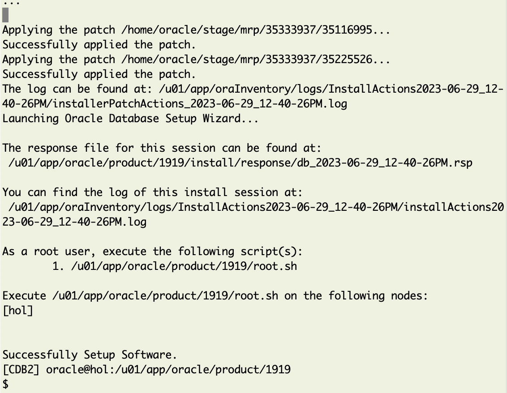

<details>
 <summary>*click here to see the full runInstaller output*</summary>

  ``` text
[CDB2] oracle@hol:/u01/app/oracle/product/1919
$ ./runInstaller -applyRU /home/oracle/stage/ru/35042068  \
>  -applyOneOffs /home/oracle/stage/ojvm/35050341,/home/oracle/stage/dpbp/35261302,/home/oracle/stage/mrp/35333937/34340632,/home/oracle/stage/mrp/35333937/35012562,/home/oracle/stage/mrp/35333937/35037877,/home/oracle/stage/mrp/35333937/35116995,/home/oracle/stage/mrp/35333937/35225526 \
>    -silent -ignorePrereqFailure -waitforcompletion \
>     oracle.install.option=INSTALL_DB_SWONLY \
>     UNIX_GROUP_NAME=oinstall \
>     INVENTORY_LOCATION=/u01/app/oraInventory \
>     ORACLE_HOME=/u01/app/oracle/product/1919 \
>     ORACLE_BASE=/u01/app/oracle \
>     oracle.install.db.InstallEdition=EE \
>     oracle.install.db.OSDBA_GROUP=dba \
>     oracle.install.db.OSOPER_GROUP=dba \
>     oracle.install.db.OSBACKUPDBA_GROUP=dba \
>     oracle.install.db.OSDGDBA_GROUP=dba \
>     oracle.install.db.OSKMDBA_GROUP=dba \
>     oracle.install.db.OSRACDBA_GROUP=dba \
>     SECURITY_UPDATES_VIA_MYORACLESUPPORT=false \
>     DECLINE_SECURITY_UPDATES=true

Preparing the home to patch...
Applying the patch /home/oracle/stage/ru/35042068...
Successfully applied the patch.
Applying the patch /home/oracle/stage/ojvm/35050341...
Successfully applied the patch.
Applying the patch /home/oracle/stage/dpbp/35261302...
Successfully applied the patch.
Applying the patch /home/oracle/stage/mrp/35333937/34340632...
Successfully applied the patch.
Applying the patch /home/oracle/stage/mrp/35333937/35012562...
Successfully applied the patch.
Applying the patch /home/oracle/stage/mrp/35333937/35037877...
Successfully applied the patch.
Applying the patch /home/oracle/stage/mrp/35333937/35116995...
Successfully applied the patch.
Applying the patch /home/oracle/stage/mrp/35333937/35225526...
Successfully applied the patch.
The log can be found at: /u01/app/oraInventory/logs/InstallActions2023-06-29_12-40-26PM/installerPatchActions_2023-06-29_12-40-26PM.log
Launching Oracle Database Setup Wizard...

The response file for this session can be found at:
 /u01/app/oracle/product/1919/install/response/db_2023-06-29_12-40-26PM.rsp

You can find the log of this install session at:
 /u01/app/oraInventory/logs/InstallActions2023-06-29_12-40-26PM/installActions2023-06-29_12-40-26PM.log

As a root user, execute the following script(s):
	1. /u01/app/oracle/product/1919/root.sh

Execute /u01/app/oracle/product/1919/root.sh on the following nodes:
[hol]


Successfully Setup Software.
[CDB2] oracle@hol:/u01/app/oracle/product/1919
$
  ```
</details>

1. Logon as root </br>
  Normally you're now executing the root.sh script. In the lab environment switching to root is forbidden. So you'not going to execute the next steps, instead we post the output you would get:

    ```
    su root
    ```

    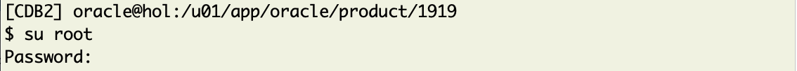

    and enter the root password.

    After logging in, you see:

    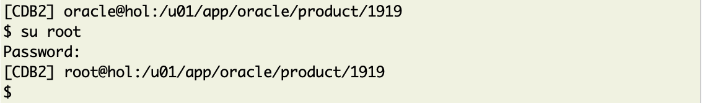

    The command prompt changed to "__[CDB2] root@hol:/u01/app/oracle/product/1919__".

2. Execute root.sh </br>
    

    ```
     /u01/app/oracle/product/1919/root.sh
    ```

    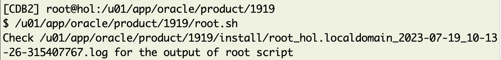

    When you open the log file you'll see what the root.sh script did:
    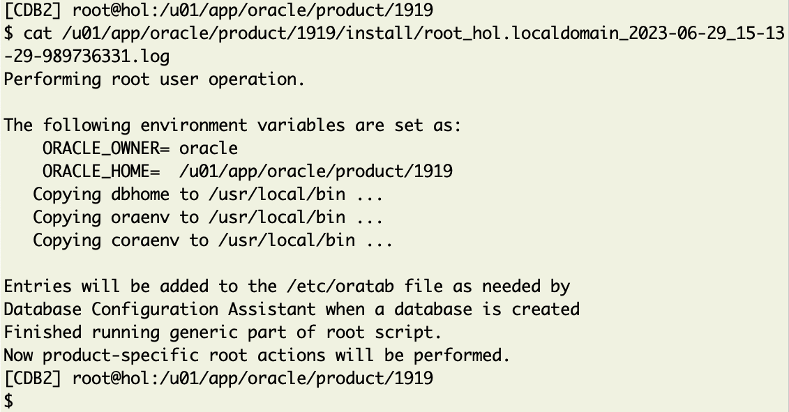


3. Exit from root </br>


    ```
    exit
     ```

    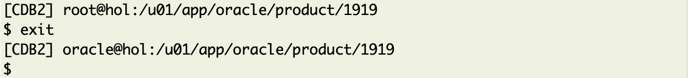

    The command prompt changes from __root@__ back to __oracle@__.

4. Check </br> 
Confirm that you are `oracle` again:

    ```
    whoami
    ```

    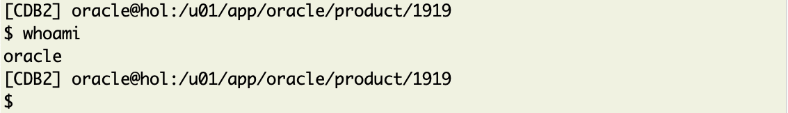

You may now *proceed to the next lab*


## Acknowledgments
* **Author** - Mike Dietrich 
* **Contributors** Klaus Gronau, Daniel Overby Hansen  
* **Last Updated By/Date** - Klaus Gronau, June 2023