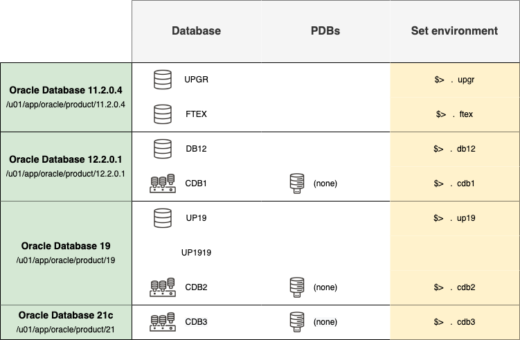

# Lab 1: Introduction and Overview

## About this Workshop
In this Database Patching lab you will make yourself familiar with the options of a completely unattended installation including patches. Then you'll do out-of-place patching of database with AutoUpgrade. The final step in contrast will be an in-place patching operation causing more downtime.

The patching does include not only a Release Update (RU) but also the Oracle Java Virtual Machine Bundle (OJVM), a Monthly Recommended Patch (MRP) and the Data Pump Bundle Patch (DPBP). You will cleanup, and you will do a rollback to the previous bundle as well.

## Lab Environment

This lab is preloaded with four different Oracle Homes and seven databases.
You can switch between environments with the shortcuts shown in the last column of the below diagram.

The four different Oracle Homes are:

- Oracle 11.2.0.4 – /u01/app/oracle/product/11.2.0.4
- Oracle 12.2.0.1 – /u01/app/oracle/product/12.2.0.1
- Oracle 19c      – /u01/app/oracle/product/19
- Oracle 21c      – /u01/app/oracle/product/21

The workshop also contains 7 different databases for running various upgrade and migration scenarios. This lab will use "UP19" 19c (non-CDB) and CDB2 19c (CDB) databases as source.

- UPGR – 11.2.0.4 database (non-CDB)
- FTEX – 11.2.0.4 database (non-CDB)
- DB12 – 12.2.0.1 database (non-CDB)
- CDB1 – 12.2.0.1 database (CDB)
- UP19 – 19c database (non-CDB)
- CDB2 – 19c database (CDB)
- CDB3 – 21c database (CDB)

### Software installed
- Release Update 19.18.0
- Data Pump Bundle Patch 19.18.0
- Oracle JVM 19.18.0
- Monthly Recommended Patch 19.18.0.0.20230516

The current Oracle Home is: `/u01/app/oracle/product/19`

### Databases for this Lab
- CDB2 - Container database
- UP19 - non-CDB database

You may *proceed to the next lab*.

## Acknowledgements
* **Author** - Mike Dietrich 
* **Contributors** Klaus Gronau, Daniel Overby Hansen  
* **Last Updated By/Date** - Klaus Gronau, June 2023