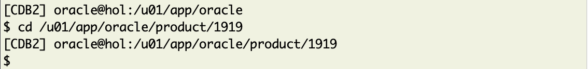
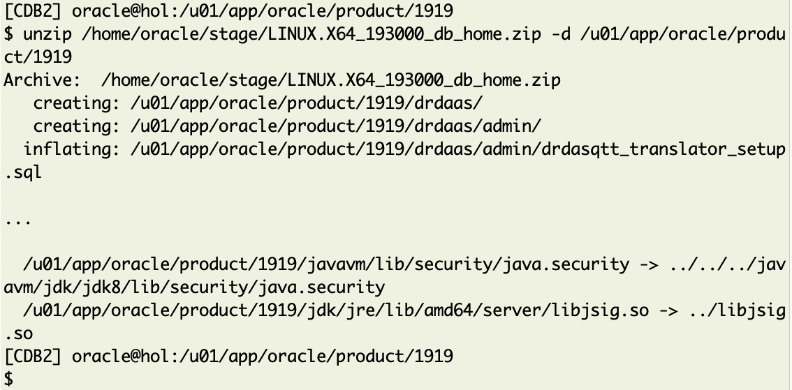
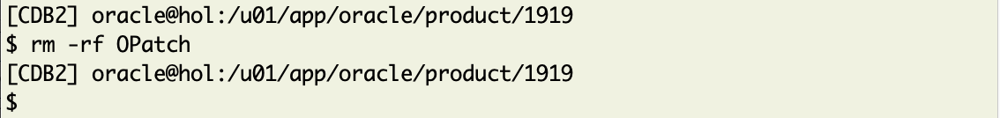

# Lab 2 - Installation and Patching

## Introduction 

In this lab exercise you will install Oracle Database 19.19.0 into a separate home and patch it fully unattended in one single operation. Out-of-place patching is the preferred method, not only for the Database home but also for the Grid Infrastructure Home.

**This is the list of software and patches you are going to install now:**
* 19.3.0 base release
* New opatch version
* 19.19.0 Release Update
* 19.19.0 Oracle JVM Bundle
* 19.19.0 Data Pump Bundle Patch
* 19.19.0.0.230516 Monthly Recommended Patch 1 for 19.19.0

## Task 1 - Base Release Installation
Create now the new Oracle Home for 19.19.0, unzip the base release and refresh opatch. 

Start by **double-clicking at the "patching" icon** on the desktop:


It will open an xterm (Terminal Window) with two open tabs.

### Step 2: Setting the Environment
Switch to the tab called "19.18.0 TARGET Home". All variables will be set when executing: 

  ```
    <copy>
     . cdb1919
    </copy>
  ```


### Step 2: Create the new Oracle Home Directory

  ```
    <copy>
     mkdir /u01/app/oracle/product/1919
    </copy>
  ```


### Step 3: Change into new Oracle_Home

  ```
    <copy>
     cd /u01/app/oracle/product/1919
    </copy>
  ```


### Step 4: Unzip Base Image
As next step, unzip the 19.3.0 base image from the staging location into this directory.

  ```
    <copy>
     unzip /home/oracle/stage/LINUX.X64_193000_db_home.zip -d /u01/app/oracle/product/1919
    </copy>
  ```


### Step 5: OPatch
Then remove the OPatch directory 

  ```
    <copy>
      rm -rf OPatch
    </copy>
  ```


and unzip the new OPatch from staging into this new Oracle Home. This step is important since older OPatch versions won't have the features we are using today.

  ```
    <copy>
     unzip /home/oracle/stage/p6880880_210000_Linux-x86-64.zip -d /u01/app/oracle/product/1919/
    </copy>
  ```


## Task 2 - Patch Installation

The patches you are going to install are all unpacked into separate directories.

  ``` text
/home/oracle/stage
├── dpbp
│   ├── 35261302
│   └── PatchSearch.xml
├── mrp
│   ├── 35333937
│   │   ├── 34340632
│   │   ├── 35012562
│   │   ├── 35037877
│   │   ├── 35116995
│   │   └── 35225526
│   └── PatchSearch.xml
├── ojvm
│   ├── 35050341
│   └── PatchSearch.xml
└── ru
    ├── 35042068
    └── PatchSearch.xml
  ```


To install all the patches in one single action, you will use the `-applyRU` and `-applyOneOffs` option of the Oracle Universal Installer. Since MRPs were unknown to the OUI a while ago you need to call every included patch separately.

You can either copy & paste the entire command or call a script. Open only one of the next two choices, copy the command and paste it into your target termina tab.

<details>
 <summary>*click here to copy the whole runInstaller command*</summary>

  ``` text
      <copy>
    ./runInstaller -applyRU /home/oracle/stage/ru/35042068  \
 -applyOneOffs /home/oracle/stage/ojvm/35050341,/home/oracle/stage/dpbp/35261302,/home/oracle/stage/mrp/35333937/34340632,/home/oracle/stage/mrp/35333937/35012562,/home/oracle/stage/mrp/35333937/35037877,/home/oracle/stage/mrp/35333937/35116995,/home/oracle/stage/mrp/35333937/35225526 \
   -silent -ignorePrereqFailure -waitforcompletion \
    oracle.install.option=INSTALL_DB_SWONLY \
    UNIX_GROUP_NAME=oinstall \
    INVENTORY_LOCATION=/u01/app/oraInventory \
    ORACLE_HOME=/u01/app/oracle/product/1919 \
    ORACLE_BASE=/u01/app/oracle \
    oracle.install.db.InstallEdition=EE \
    oracle.install.db.OSDBA_GROUP=dba \
    oracle.install.db.OSOPER_GROUP=dba \
    oracle.install.db.OSBACKUPDBA_GROUP=dba \
    oracle.install.db.OSDGDBA_GROUP=dba \
    oracle.install.db.OSKMDBA_GROUP=dba \
    oracle.install.db.OSRACDBA_GROUP=dba \
    SECURITY_UPDATES_VIA_MYORACLESUPPORT=false \
    DECLINE_SECURITY_UPDATES=true
    </copy>
  ```

</details>

or

<details>
 <summary>*click here to copy the command used execute the script*</summary>

  ``` text
    <copy>
     . /home/oracle/patch/install_patch.sh
    </copy>
  ```
</details>


The installation will take approximately 10 minutes. 

<details>
 <summary>*click here to see the full output*</summary>

  ``` text
[CDB2] oracle@hol:/u01/app/oracle/product/1919
$ ./runInstaller -applyRU /home/oracle/stage/ru/35042068  \
>  -applyOneOffs /home/oracle/stage/ojvm/35050341,/home/oracle/stage/dpbp/35261302,/home/oracle/stage/mrp/35333937/34340632,/home/oracle/stage/mrp/35333937/35012562,/home/oracle/stage/mrp/35333937/35037877,/home/oracle/stage/mrp/35333937/35116995,/home/oracle/stage/mrp/35333937/35225526 \
>    -silent -ignorePrereqFailure -waitforcompletion \
>     oracle.install.option=INSTALL_DB_SWONLY \
>     UNIX_GROUP_NAME=oinstall \
>     INVENTORY_LOCATION=/u01/app/oraInventory \
>     ORACLE_HOME=/u01/app/oracle/product/1919 \
>     ORACLE_BASE=/u01/app/oracle \
>     oracle.install.db.InstallEdition=EE \
>     oracle.install.db.OSDBA_GROUP=dba \
>     oracle.install.db.OSOPER_GROUP=dba \
>     oracle.install.db.OSBACKUPDBA_GROUP=dba \
>     oracle.install.db.OSDGDBA_GROUP=dba \
>     oracle.install.db.OSKMDBA_GROUP=dba \
>     oracle.install.db.OSRACDBA_GROUP=dba \
>     SECURITY_UPDATES_VIA_MYORACLESUPPORT=false \
>     DECLINE_SECURITY_UPDATES=true

Preparing the home to patch...
Applying the patch /home/oracle/stage/ru/35042068...
Successfully applied the patch.
Applying the patch /home/oracle/stage/ojvm/35050341...
Successfully applied the patch.
Applying the patch /home/oracle/stage/dpbp/35261302...
Successfully applied the patch.
Applying the patch /home/oracle/stage/mrp/35333937/34340632...
Successfully applied the patch.
Applying the patch /home/oracle/stage/mrp/35333937/35012562...
Successfully applied the patch.
Applying the patch /home/oracle/stage/mrp/35333937/35037877...
Successfully applied the patch.
Applying the patch /home/oracle/stage/mrp/35333937/35116995...
Successfully applied the patch.
Applying the patch /home/oracle/stage/mrp/35333937/35225526...
Successfully applied the patch.
The log can be found at: /u01/app/oraInventory/logs/InstallActions2023-06-29_12-40-26PM/installerPatchActions_2023-06-29_12-40-26PM.log
Launching Oracle Database Setup Wizard...

The response file for this session can be found at:
 /u01/app/oracle/product/1919/install/response/db_2023-06-29_12-40-26PM.rsp

You can find the log of this install session at:
 /u01/app/oraInventory/logs/InstallActions2023-06-29_12-40-26PM/installActions2023-06-29_12-40-26PM.log

As a root user, execute the following script(s):
	1. /u01/app/oracle/product/1919/root.sh

Execute /u01/app/oracle/product/1919/root.sh on the following nodes:
[hol]


Successfully Setup Software.
[CDB2] oracle@hol:/u01/app/oracle/product/1919
$
  ```
</details>

Once the installation is completed, you will need to execute `root.sh` at the end of the following lab. </br>

In the mean time while the patch is installed you may *proceed to the next lab*.


## Acknowledgements
* **Author** - Mike Dietrich 
* **Contributors** Klaus Gronau, Daniel Overby Hansen  
* **Last Updated By/Date** - Klaus Gronau, June 2023