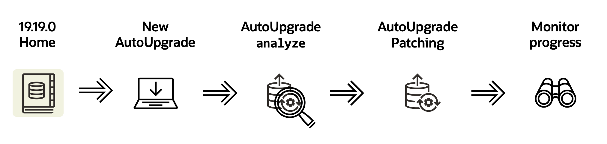
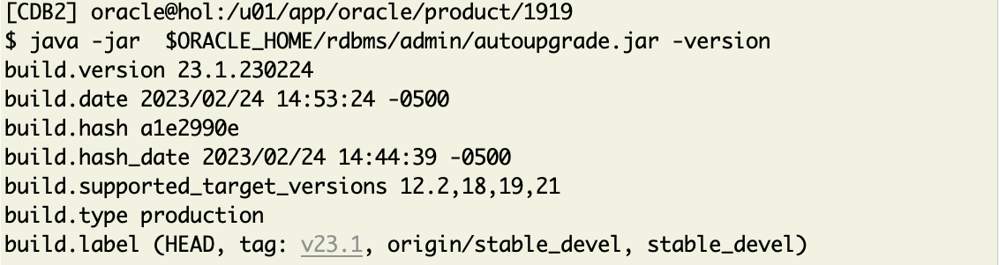
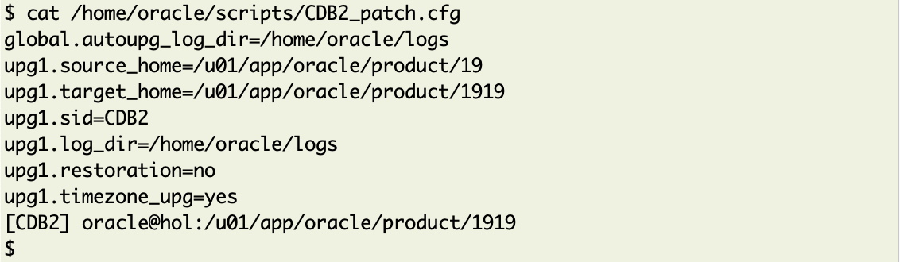
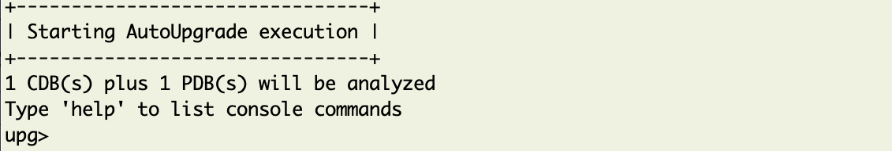
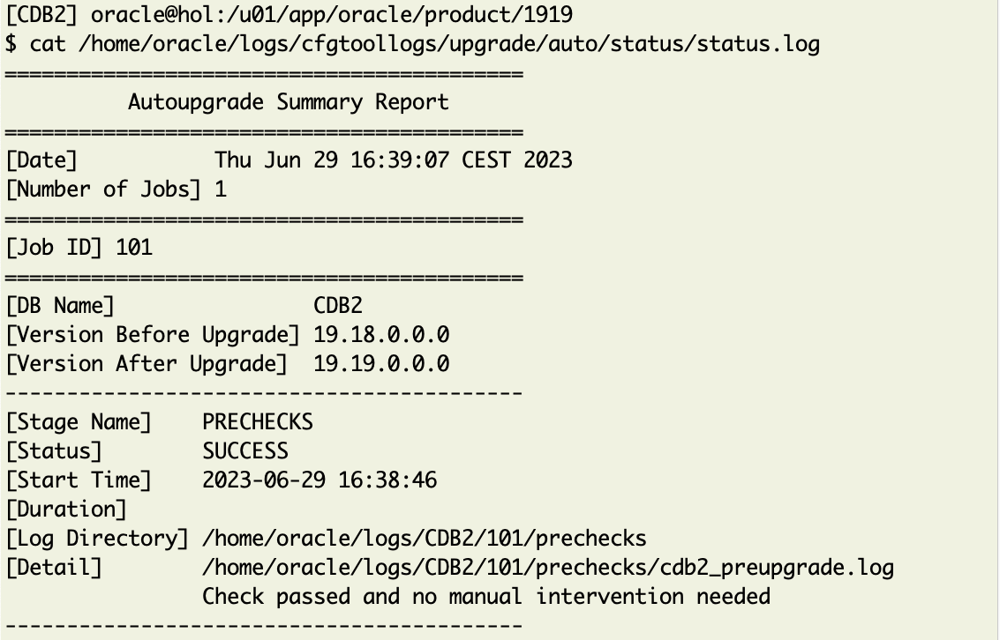
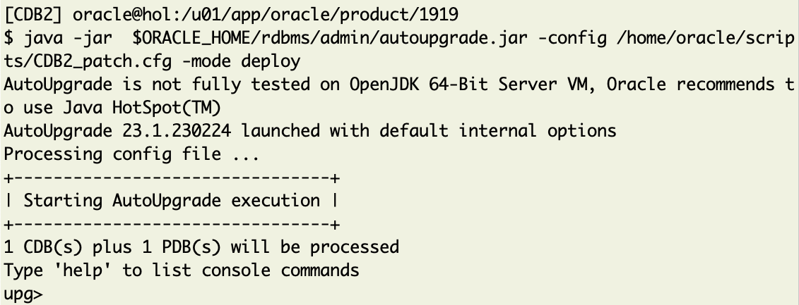
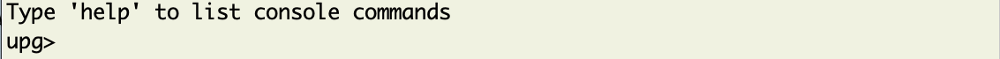
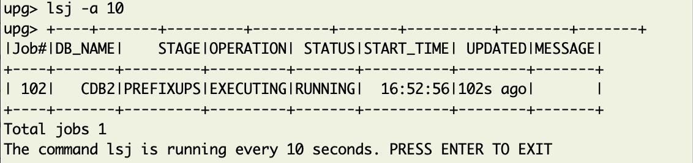

# Lab 4: Using AutoUpgrade for Patching

## Introduction 
In this lab exercise you will patch the CDB2 database from 19.18.0 to 19.19.0 with just two commands.



Estimated Time: 5 minutes (runs unattended for 20 minutes)

### Objectives

Autoupgrade for patching

### Prerequisites

This lab assumes you have:

- Connected to the lab
- Activate the tab __19.19.0 Home__


## Task 1: Update AutoUpgrade

Copy a more recent version of AutoUpgrade into your 19.19.0 home:

  ```
    <copy>
     cp -f /home/oracle/stage/autoupgrade.jar $ORACLE_HOME/rdbms/admin/autoupgrade.jar 
    </copy>
  ```


## Task 2: Check AutoUpgrade Version

Then check the version:

  ```
    <copy>
     java -jar  $ORACLE_HOME/rdbms/admin/autoupgrade.jar -version
    </copy>
  ```



## Tak 3: Preconfigured AutoUpgrade Config File

A simple config file for AutoUpgrade is provided already for your convenience:
  ```
    <copy>
     cat /home/oracle/scripts/CDB2_patch.cfg
    </copy>
  ```


## Task 4: Analyze with AutoUpgrade

Now you will do an analysis run first. 

  ```
    <copy>
     java -jar  $ORACLE_HOME/rdbms/admin/autoupgrade.jar -config /home/oracle/scripts/CDB2_patch.cfg -mode analyze
    </copy>
  ```


Don't get confused when it displays something like


Autoupgrade is not awaiting any input from you. Just lean back - it will complete within less than half a minute.


<details>
 <summary>*click here to see the full output*</summary>

 
</details>

## Task 5: AutoUpgrade Log File

Check the logfile for any additional tasks. See the last line:

  ```
    <copy>
     cat /home/oracle/logs/cfgtoollogs/upgrade/auto/status/status.log
    </copy>
  ```


<details>

 <summary>*click here to see the full status log output*</summary>


</details>

No additional tasks are needed. You can progress.


## Task 6: AutoUpgrade Deploy

You can start AutoUpgrade now in deploy mode.
It will lift the database into the new 19.19 home and execute all necessary tasks.

  ```
    <copy>
     java -jar  $ORACLE_HOME/rdbms/admin/autoupgrade.jar -config /home/oracle/scripts/CDB2_patch.cfg -mode deploy
    </copy>
  ```


Again you see the autoupgrade command prompt


and this time you can use it to monitor  the autoupgrade progress.

## Task 7: AutoUpgrade Progress
You can monitor it in the job interface easily with a refresh interval:
  ```
    <copy>
     lsj -a 10
    </copy>
  ```

It will do an automatic refresh from now on.




__As this job will run for about 30 minutes, you may now *proceed to the next lab*__.

Once the job is finished you'll see an output similar to:


## Acknowledgments
* **Author** - Mike Dietrich 
* **Contributors** Klaus Gronau, Daniel Overby Hansen  
* **Last Updated By/Date** - Klaus Gronau, June 2023