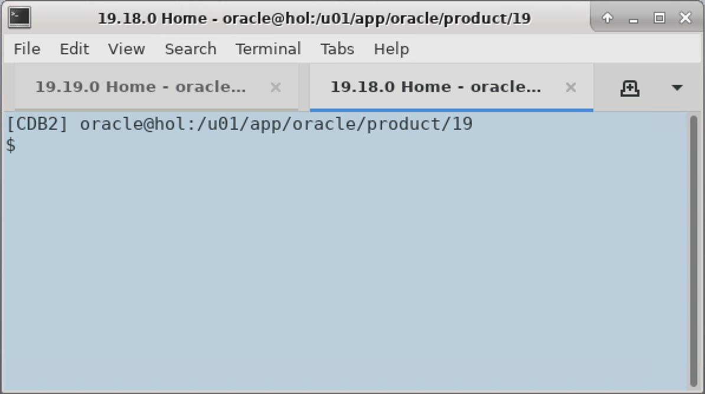
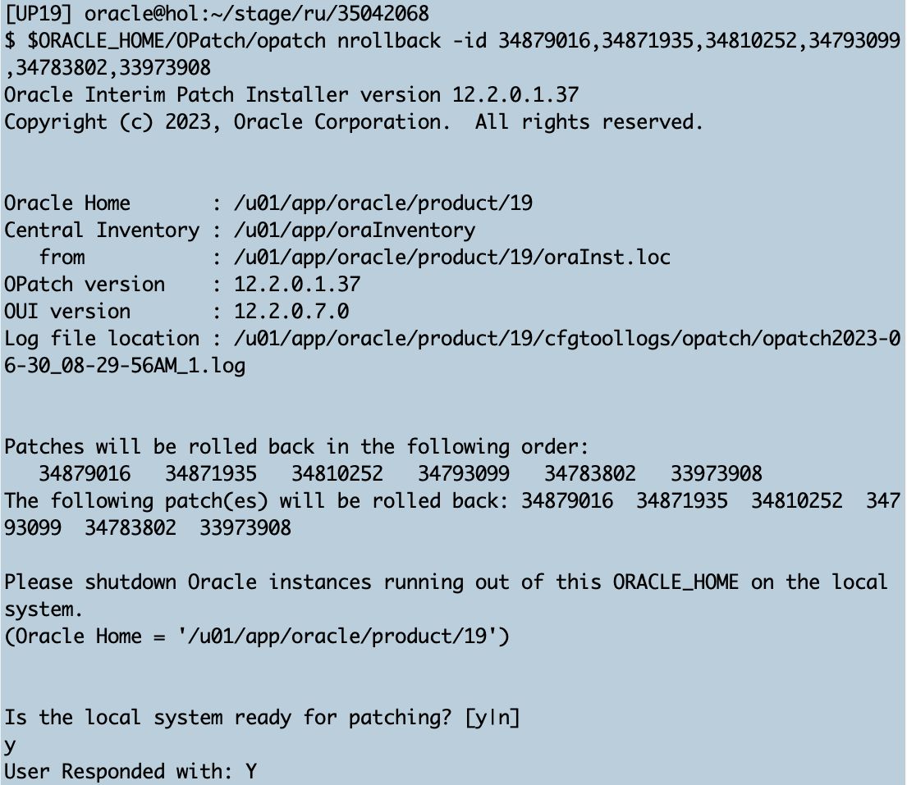
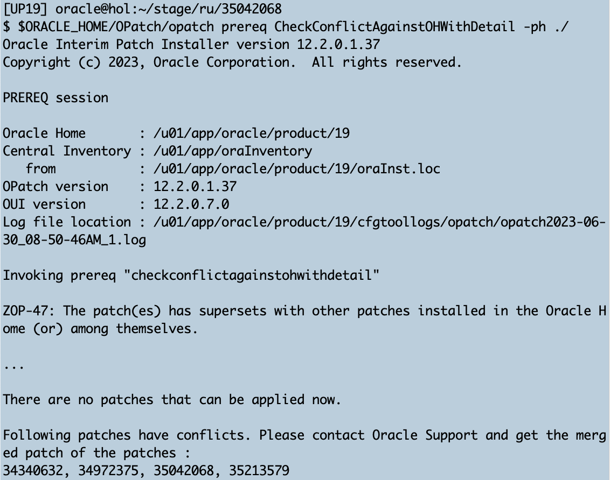
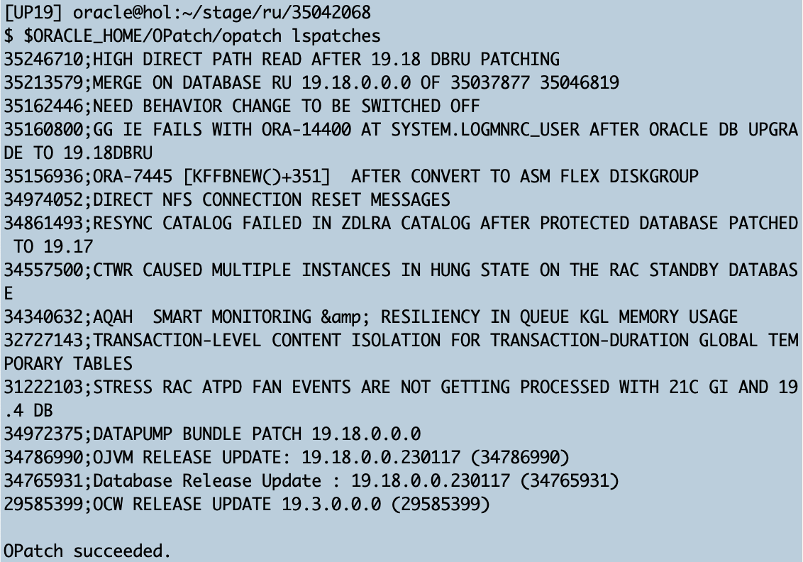
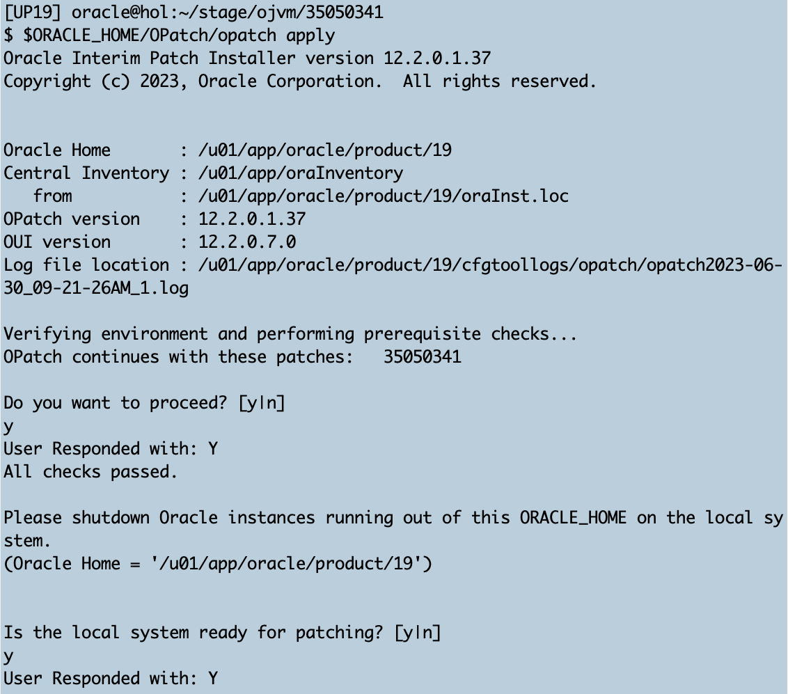
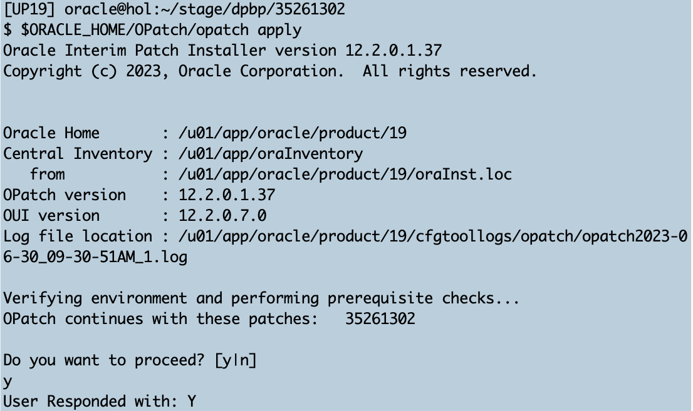
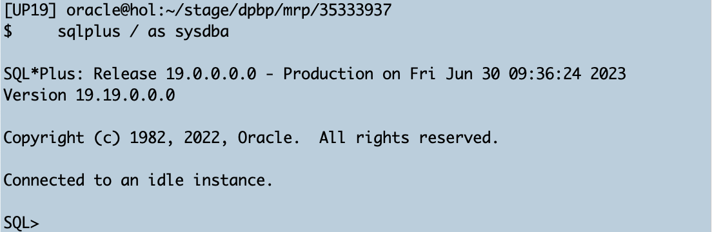
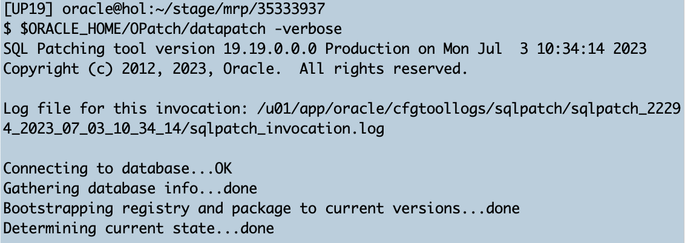

# Lab 5: In-Place Patching

## Introduction 
The benefit of the out-of-place patching method is not only that the previous home is preserved for a potential fallback but it only allows much shorter downtime. In order to see the difference you could patch now the 19.18.0 home in-place.

Estimated Time: 25 minutes

### Objectives

Patching an existing Oracle_Home

### Prerequisites

This lab assumes you have:

- Connected to the lab

- Please switch to the other tab titled "__19.18.0 Home__",



## Task 1: Checks for in-place patching


1. Environment </br>
Set the environment for the UP19 database. It is currently shutdown since it needs to be shutdown while we patch.

    ```
    <copy>
    . up19
    </copy>
    ```

    

2. Switch to 19.19 RU Directory </br>
Then enter the patch directory for the Release Update 19.19.0:

    ```
    <copy>
    cd /home/oracle/stage/ru/35042068
    </copy>
    ```

    

3. Patch Conflict Checker </br>
Start running the patching conflict check:

    ```
    <copy>
    $ORACLE_HOME/OPatch/opatch prereq CheckConflictAgainstOHWithDetail -ph ./ 
    </copy>
    ```

    You will receive a very long output listing several thousands of bug numbers fixed by the RU. We cut the output off here:

    

    <details>
    <summary>*click here to see the full opatch conflict checker output*</summary>

    ``` text
    [UP19] oracle@hol:~/stage/ru/35042068
    $ $ORACLE_HOME/OPatch/opatch prereq CheckConflictAgainstOHWithDetail -ph ./
    Oracle Interim Patch Installer version 12.2.0.1.37
    Copyright (c) 2023, Oracle Corporation.  All rights reserved.

    PREREQ session

    Oracle Home       : /u01/app/oracle/product/19
    Central Inventory : /u01/app/oraInventory
      from           : /u01/app/oracle/product/19/oraInst.loc
    OPatch version    : 12.2.0.1.37
    OUI version       : 12.2.0.7.0
    Log file location : /u01/app/oracle/product/19/cfgtoollogs/opatch/opatch2023-06-30_08-14-57AM_1.log

    Invoking prereq "checkconflictagainstohwithdetail"

    ZOP-47: The patch(es) has supersets with other patches installed in the Oracle Home (or) among themselves.

    Prereq "checkConflictAgainstOHWithDetail" failed.

    The details are:
    Reason -
    Superset Patch 35042068 has
    Subset Patch 34765931 which has overlay patches [34810252,34861493,35213579,34871935,35246710,34557500,35156936,34879016,34783802,33973908,34793099,31222103,32727143,34974052,35160800,34972375,34340632,35162446] and these overlay patches conflict with Superset Patch
    Subset Patch 34765931 which has overlay patches [34810252,34861493,35213579,34871935,35246710,34557500,35156936,34879016,34783802,33973908,34793099,31222103,32727143,34974052,35160800,34972375,34340632,35162446] and these overlay patches conflict with Superset Patch

    OPatch recommends any one of the following actions
      - Please rebuild the superset patch to make sure it supersedes all the relevent patch(es) which are conflicting.
    The rebuilt patch should contain bug fix [31314885, 34050156, 29947145, 32005046, 33417828, 32005048, 30834110, 31529594, 31769267, 29293072, 29706141, 31843716, 29516727, 30710783, 28774416, 29470880, 29872720, 33674065, 28522750, 30000518, 30618406, 29696242, 30987724, 29631749, 32032653, 32007698, 30332893, 33382620, 29617414, 33315801, 29443250, 32940714, 33662079, 29643721, 30114534, 33572061, 32258021, 32284325, 34100969, 31075960, 30847442, 30987717, 35123499, 30848773, 31200854, 29907942, 32915747, 33357655, 29629430, 30619728, 34377917, 31113089, 31175365, 29294382, 33850535, 31062645, 30053036, 32614583, 29924479, 29253871, 29906607, 34453303, 30305264, 30380511, 31163379, 31200845, 17395507, 33218694, 33355007, 29228869, 33909729, 32196943, 31138371, 33976581, 28167557, 29858420, 30025814, 34287904, 30228567, 31500719, 31047022, 33544836, 33807727, 33674035, 33358968, 30763272, 34110342, 33926252, 33291305, 30241567, 34743869, 29167374, 30734707, 29481584, 32300098, 28966444, 32813767, 30062819, 31968431, 29456538, 31099981, 29154057, 30973137, 32639860, 33229327, 29516766, 33182152, 29353271, 32550894, 30265523, 32246090, 32385068, 25675134, 32881853, 31468060, 30379537, 31956435, 33848294, 29048858, 31098661, 32243814, 32754845, 30973127, 30329209, 33596056, 30179038, 30722705, 32097125, 31816158, 27691701, 29756444, 31908750, 30986423, 29312734, 30317209, 32548580, 32602599, 33940540, 29557261, 30629139, 30973113, 33748852, 34797666, 29821130, 30307883, 33473989, 33915586, 32005053, 29444524, 32171622, 34352605, 29167342, 30074820, 34100909, 31247532, 30782414, 32061173, 31375865, 31354026, 30179012, 34299927, 34340632, 29252510, 29770750, 30644766, 31555800, 34001147, 30668754, 30194612, 32061146, 30055640, 31841147, 33334957, 31543810, 29991257, 30925419, 31171828, 32074450, 29515476, 32469225, 33902235, 29470814, 28718302, 33177660, 29541769, 33334945, 33333616, 30440712, 28781599, 31398505, 31595025, 30313749, 30529790, 30642124, 31355339, 31927930, 34027770, 30937410, 20289608, 31638733, 30403763, 31122876, 33334972, 29438736, 29768487, 32457252, 32517405, 29220079, 33013379, 30413137, 34224381, 23020668, 31110887, 30654131, 31602782, 32644392, 28912691, 32968221, 29864261, 31331372, 33409376, 29865590, 33447602, 28294563, 34464036, 27004798, 34207825, 29642451, 29497053, 32248649, 33319353, 17562236, 32505439, 33657553, 31445356, 33899867, 28835937, 30043610, 32843576, 30204542, 32995863, 28593127, 28974902, 32236685, 34280456, 30372081, 32259322, 34310878, 30127805, 32606093, 30146969, 31403565, 29680700, 34364656, 34291104, 27935464, 29485099, 31770289, 31331354, 31399883, 31457334, 34191733, 28808314, 30183920, 32982562, 29539413, 33151089, 32307586, 30980280, 18943905, 32205514, 33704431, 34844505, 30469579, 34376629, 32682703, 34309870, 30600230, 29891916, 33773883, 29666451, 34549588, 28889730, 29864203, 31099926, 32446565, 34211059, 29552402, 31516265, 31980125, 33152388, 29780140, 31145525, 29653132, 29541742, 29341209, 30540109, 32121326, 32915760, 29343861, 29811720, 30031613, 31317032, 31597668, 31796882, 34027791, 31356601, 32983871, 33151063, 31516255, 30476768, 26587659, 32138257, 29913805, 32012137, 29463798, 30830555, 34825329, 32201936, 31548675, 34256822, 30221115, 31835300, 34575765, 33907094, 32228188, 29590666, 30060267, 30692473, 29232117, 29222784, 31663788, 32910846, 32416652, 34863611, 32165887, 32416655, 31823327, 33741444, 21528318, 31458739, 33211160, 32705800, 33580595, 29449477, 31043483, 34497838, 33729789, 31002923, 32747680, 32177869, 30692462, 34104403, 28869215, 30693791, 33247240, 34320104, 32482131, 33020510, 31204412, 33843368, 30175478, 29928040, 32189869, 31381701, 29005748, 32404638, 29665168, 34575784, 28958094, 34472508, 29623323, 31469418, 30399906, 33099666, 30828205, 29943670, 32201903, 34259077, 31763030, 32453611, 33956182, 32999329, 28958088, 29233415, 34142701, 34711434, 32038780, 29173140, 30841241, 30233105, 34647902, 28402823, 31195838, 30602828, 34709158, 32529483, 34599777, 30006705, 31822026, 33715183, 28984313, 29232154, 28730079, 31902662, 29385652, 29203604, 31915968, 33048074, 33308736, 30096138, 31560348, 32236601, 29870065, 29450421, 33878003, 31753692, 30300363, 29554997, 29869086, 32761932, 31988833, 34142725, 30414491, 30954062, 32748974, 30174102, 34585151, 33448908, 34358718, 31080474, 29941062, 31656601, 31950244, 30437149, 28642551, 30980317, 29181743, 33364820, 32093558, 28696373, 34139110, 32356545, 29788820, 33410321, 30993604, 33703196, 30727629, 33440178, 32567750, 31560323, 31517502, 29689145, 28974999, 30300342, 29175765, 34039802, 25033515, 29677173, 31903962, 34039805, 32816003, 29346057, 29906678, 30662651, 30769454, 33380058, 30101186, 31872320, 29871360, 34742578, 31951599, 33273598, 29192419, 19884953, 32695999, 29869052, 32229431, 27460010, 30846063, 28826113, 30998475, 27359770, 29904002, 30560513, 29972176, 33625059, 32296259, 30703610, 28875089, 33909666, 30126470, 30834068, 32700989, 29547867, 29932953, 30379468, 32351767, 32811131, 27359766, 34369457, 34641746, 30662634, 29955625, 32013403, 31745233, 29696310, 30509277, 28209985, 30931311, 32165814, 29391438, 33339868, 29858376, 28406374, 30114489, 30523538, 30223712, 29180455, 28872829, 28983095, 31734583, 30822078, 31054177, 29718198, 28955883, 33056579, 29444602, 30620805, 31380443, 33891059, 33367076, 32212635, 33242408, 32363711, 31649447, 33069889, 29703932, 33145153, 30114477, 30973143, 29040032, 33663305, 32567788, 29418341, 31193292, 30474167, 30336383, 30210429, 31500699, 29136111, 34031036, 29312672, 30617002, 32255753, 31787057, 30619665, 33315835, 34075499, 31290300, 34256867, 34358785, 31067483, 26995275, 30898939, 31109924, 32094825, 33500486, 34229250, 28996376, 31648120, 30164714, 31338769, 31632605, 32266406, 29871312, 29192468, 29972134, 32589147, 33836203, 31711889, 34417794, 30919691, 27697886, 30956647, 31349426, 29658056, 31108603, 30522285, 29325993, 30277589, 31945701, 33454753, 30066352, 31591421, 31747818, 29407637, 30606345, 31722558, 33032579, 29707493, 29706160, 29405012, 31067456, 33314523, 33127312, 31000312, 31224819, 29944963, 33764147, 33157157, 29251259, 30973197, 32441671, 32338736, 29522561, 30276243, 32987308, 29599008, 29744400, 30932674, 31113177, 32255762, 30449194, 31710587, 33297599, 29039089, 30307814, 28757960, 30944643, 34495234, 31093712, 28755309, 31648157, 32312131, 30193262, 30024618, 27700413, 29628200, 33735435, 33850434, 29379978, 30330123, 33850437, 34262719, 28647544, 31326998, 31668694, 32499155, 29240668, 32385141, 31592707, 32044767, 32397113, 33241118, 30305163, 30283296, 31516164, 30457697, 31050557, 32926513, 29782823, 30228422, 34555251, 30605215, 29557144, 31108644, 28646200, 32386482, 30633938, 31732095, 34633291, 31440426, 29959025, 30254726, 31860193, 30936251, 30699770, 31795696, 29604257, 30582035, 31716873, 33837484, 30645938, 32753472, 33927483, 30000664, 32778725, 28888327, 29616244, 33746114, 33939477, 32992004, 32184844, 31163498, 31516184, 31945659, 29124104, 32800539, 32914508, 32224583, 28436173, 32006467, 33228119, 31769373, 31958958, 31974187, 32122574, 30242724, 28852325, 31326977, 34038365, 30906407, 30215130, 34314448, 32184855, 32535106, 30657906, 29961353, 31591409, 31567719, 29186605, 34567240, 31494264, 31629056, 34567246, 31591400, 30545040, 31728858, 32915847, 30124026, 19138896, 32931078, 29846525, 30657940, 29048728, 29353389, 31362408, 31691030, 21374587, 32285563, 32939883, 34089934, 33507953, 30751171, 33874455, 29407488, 30028182, 30042490, 33303725, 32374431, 32225899, 28802066, 31969646, 32615776, 32879655, 33974068, 32068709, 31495564, 30528547, 33346851, 34830056, 34022834, 29782866, 29655855, 30138600, 28965231, 32284241, 33824185, 29418165, 33986030, 32893951, 30809087, 33808955, 28089605, 31957674, 29311528, 31471589, 29521187, 32260290, 33792885, 29392966, 32158561, 30948278, 32535156, 32853080, 31998189, 32535159, 33848148, 30457633, 32727143, 29683039, 29887045, 32712916, 31998181, 33416405, 30685163, 34051355, 29530909, 29492127, 30355490, 31632663, 32550751, 29708876, 32381605, 32423985, 34261458, 31151483, 31066082, 30782300, 29558452, 29920804, 31757357, 28371123, 29494788, 34090927, 28454215, 29653246, 29227602, 30880774, 31643308, 32656275, 33784447, 33998060, 31119368, 29452936, 31156301, 32662165, 31032725, 31517417, 29792213, 31258344, 33190761, 31120361, 34141328, 34424728, 29655895, 31957683, 27101798, 29396481, 31878314, 32471642, 31375772, 33598703, 34761787, 29281112, 30374570, 33473815, 34129689, 29328305, 32098535, 32205455, 32501930, 30954071, 33627820, 33927405, 34520519, 30194710, 30403881, 29876358, 29894021, 34094476, 29155208, 33452091, 33574722, 31374449, 35100889, 28752923, 32356628, 34845920, 33153797, 34861159, 33523189, 30403877, 33460521, 33904798, 31829366, 29355913, 29565611, 34387451, 34784422, 31995937, 34052641, 30764405, 34797733, 29504682, 33108317, 34400786, 34710181, 33631068, 33026796, 29834506, 29048792, 33376694, 34219922, 28201045, 34349149, 32758260, 30631393, 32656231, 29443187, 29937655, 33163187, 31752502, 33446226, 34291231, 32734299, 28553981, 31260692, 28622202, 32317012, 29215658, 32356609, 32619298, 28294439, 32051896, 27155644, 30994996, 29216984, 33491676, 32703155, 30992330, 30493331, 33464061, 33434256, 33110642, 34153367, 30596694, 30260595, 30740444, 30740440, 31458537, 30570083, 32305034, 33670617, 30781032, 32151098, 26960568, 28905615, 30694947, 30285843, 32574796, 32432078, 30157766, 33123985, 29726695, 28891941, 29679856, 32403509, 32531627, 32843672, 32730701, 32484945, 33982541, 29865658, 30781041, 30127904, 30086992, 29327044, 29431192, 30527275, 31103804, 31794336, 33598728, 33062419, 32519995, 33206701, 32361175, 33886487, 29851020, 33163159, 31727560, 32020701, 30714151, 31572267, 34549471, 31547220, 34485723, 30726204, 32518679, 34220991, 34281906, 30523601, 34070561, 34117618, 32531647, 31458634, 31709647, 28513129, 20661314, 29589544, 30145712, 33352794, 20319830, 28770865, 29635427, 29219273, 29437379, 29779196, 29841687, 30029519, 28627033, 30968781, 31590099, 32391021, 30681697, 32520994, 29488996, 29412066, 31747935, 34837452, 29877608, 30198239, 31824504, 30350543, 31939767, 29222892, 30326882, 29474348, 31155085, 32495572, 32325525, 33388715, 29451660, 30297905, 30421706, 31752492, 28971177, 30236964, 32634996, 31306470, 31722646, 30527198, 33550827, 31711997, 29725421, 29346138, 31586862, 29725425, 33832583, 28538439, 30879708, 32957606, 33868507, 31925134, 33352740, 29815341, 32038844, 29891853, 32495545, 32705734, 33061152, 29452977, 29891857, 27989365, 29385774, 27130348, 29413382, 31205834, 33897055, 32078078, 31421316, 30175587, 31849859, 32216027, 34220961, 32759503, 31976738, 29700125, 32177701, 31591384, 33190694, 30060330, 31775101, 30510347, 30576112, 31488464, 31336298, 31925162, 32387818, 29304314, 28570589, 31393600, 34056235, 31305114, 29452953, 29689255, 30624243, 28882146, 32066061, 29701425, 33981298, 31866388, 30413294, 30716863, 32379303, 29661722, 33729692, 31230775, 34220943, 30776416, 25756945, 30564139, 32254399, 32830405, 34446152, 32529396, 34777391, 32909936, 31625579, 31902517, 31156383, 28959493, 28767240, 30048688, 31600291, 32619327, 30419450, 28544270, 32889096, 30777759, 31662504, 29312753, 29175638, 32103427, 29125380, 33068672, 34262797, 34653621, 34430618, 30393653, 31307715, 31950145, 29150338, 31886848, 29180559, 30266791, 31025520, 28390273, 33555673, 29324735, 29024795, 29125374, 33169254, 32541049, 31410607, 31253451, 32115403, 30704826, 31747989, 34752011, 32297469, 30420452, 25415139, 33663444, 35046819, 32593955, 30382982, 31038817, 32092312, 31013531, 29869149, 30769312, 34058858, 32682586, 33403040, 32918041, 32693242, 28904380, 29457807, 28815355, 31026870, 32937167, 29286037, 34716391, 29828644, 29907870, 29511771, 34010877, 28714720, 31367364, 32393612, 31163534, 32338897, 31422620, 33622927, 31872230, 29010126, 31606474, 33681238, 30049966, 32038812, 29225076, 30289458, 32476437, 34557851, 30394974, 32067356, 32848531, 31025531, 30571306, 31026860, 30306407, 34715072, 31113249, 32298782, 27207214, 22748979, 30968737, 32200524, 31489731, 32753371, 28980910, 30619787, 31605119, 31675860, 30224950, 31620748, 29961360, 31325584, 32435911, 33613169, 31290427, 32324219, 31999453, 29408853, 32267610, 16664572, 27658166, 27801144, 32139432, 30276144, 34671488, 28598022, 34301118, 31790757, 31181380, 32127448, 31675852, 33496433, 31181375, 34172434, 34284147, 34800180, 1297945, 34603342, 34670162, 27742354, 30534351, 31691089, 33601195, 30930149, 21119541, 29424094, 32325574, 33963458, 29024732, 31266779, 30252156, 30606451, 33766686, 32394986, 32962162, 29138641, 30277451, 33382529, 32625160, 31054031, 33115438, 30806757, 31192039, 28672457, 33314422, 30873527, 29997326, 31946936, 29219205, 29250059, 29846688, 30919804, 31035287, 30747820, 33976796, 34048076, 28636532, 29629650, 33837343, 28878865, 30264405, 31289115, 29240307, 31189749, 34933484, 31402031, 32829060, 29884958, 33037531, 30812574, 28625873, 33470254, 33573142, 33548186, 32207920, 31816343, 32651773, 28865544, 31367188, 30328168, 25562258, 29355654, 31417990, 30253761, 30447994, 32247141, 28461031, 28104176, 30136102, 33723325, 29860994, 29683189, 30290700, 31427345, 32675756, 32651769, 30012737, 31141792, 34135867, 32099580, 30560365, 29934048, 30596320, 32087597, 31326608, 32573703, 32996974, 31829639, 28891867, 29241651, 29330361, 31415324, 33507610, 33495575, 33749984, 29934052, 31098870, 31454972, 32735915, 33393503, 31517395, 34212105, 28776811, 29530812, 34395591, 31905033, 33736618, 31050896, 29971027, 31783782, 33599734, 29229955, 30265703, 31741938, 31176451, 28625862, 32878039, 30193584, 31878605, 30102774, 31556950, 31831950, 32374566, 30998662, 32098237, 34191990, 31897786, 30251130, 31236624, 34370261, 29846645, 28922227, 34086300, 33789142, 31483466, 32956092, 33194363, 28876253, 29872937, 31494132, 31402078, 28978664, 32098224, 29269171, 30252458, 31315923, 30598919, 30419024, 31828378, 29629681, 33520658, 33706800, 32561791, 33176523, 30331759, 30294267, 32765738, 29960325, 28977322, 31830685, 28589644, 33141890, 33777176, 28965376, 31542356, 28989306, 32099539, 33663113, 31429971, 31926811, 31542347, 34088989, 30277733, 30644530, 34993116, 32561759, 30835219, 32075580, 29033145, 33126290, 30710506, 31061504, 31414023, 32104610, 30239480, 30517516, 33888932, 30460922, 32505634, 25404117, 29254930, 29961609, 33398383, 29962939, 31043747, 32444159, 29515240, 30073744, 31471441, 31854692, 33050587, 29452813, 32404933, 32219988, 29426521, 34281503, 29641373, 30131286, 31815099, 31812824, 29245160, 30295549, 30180208, 30867685, 32740421, 30283579, 30283577, 31123976, 33048277, 34126068, 29033164, 29452809, 30156569, 32626756, 29015273, 33607081, 29667994, 33632051, 30155241, 33422596, 34609482, 31644775, 28693954, 31926848, 33563718, 30283581, 30313989, 31573457, 28125947, 32190573, 28578945, 29517883, 28553649, 33460870, 31737059, 28279176, 30227400, 30580813, 24597536, 31430910, 33292896, 33261707, 28755084, 29937956, 33848060, 32794261, 31343110, 29486181, 34552940, 28630381, 29205918, 29046482, 31223382, 33758069, 29385429, 32857908, 33188597, 27126938, 32062227, 33536140, 30118279, 32697157, 31654116, 32897184, 34225479, 30657875, 30481004, 29413205, 31839038, 30193506, 30783551, 30193505, 31585491, 32504340, 27489107, 29199635, 29779368, 30645896, 29361472, 29887111, 31357737, 32248405, 30343750, 29332966, 32037237, 31654125, 32516336, 31654122, 33362391, 29708915, 29030927, 31966094, 31654119, 30253705, 29584693, 30681521, 31855996, 30083100, 30530585, 31119057, 31638943, 33457235, 30169841, 31752633, 31654133, 33019726, 32237778, 31073586, 33970659, 32108115, 30131253, 30496957, 31668768, 31637607, 31810213, 32856640, 33845824, 32844640, 24971456, 32079097, 32080081, 32542641, 31261641, 29245137, 28740863, 31625618, 29725476, 29541517, 29498198, 30084458, 30992477, 28436414, 28865569, 33718848, 31793126, 34151061, 29962927, 29470636, 34424661, 31006792, 33387654, 28946233, 31086869, 30681516, 30782266, 32602735, 32008716, 33898336, 33718837, 29676089, 30043930, 32578616, 34512077, 31298871, 29463553, 31620829, 33464378, 30161094, 34055289, 33387767, 28872645, 29211895, 33955060, 32402243, 32426213, 29130219, 33833783, 33538807, 31925462, 31834214, 33159956, 32338953, 34525391, 31145389, 32064826, 31661369, 29350762, 32081381, 31659065, 30638712, 31525783, 30006985, 33085296, 31709777, 32103383, 29664087, 29208260, 34129964, 32874571, 33097276, 34322521, 31511142, 31980296, 29222534, 31169366, 33489699, 34115338, 30373541, 31104809, 32951181, 33886297, 33870702, 34001406, 34183461, 29672507, 30373550, 32178966, 33261786, 32176303, 33578015, 29500928, 32013253, 30174394, 29839481, 29143516, 29299049, 33423815, 31043695, 34611735, 34724986, 31475085, 32366154, 29452864, 29131539, 29132869, 34892381, 29223859, 31001859, 31386394, 31992270, 34698179, 32153619, 33591046, 29623592, 30118261, 34539998, 22325312, 29749469, 31042337, 29488894, 32704765, 7391838, 33832499, 29173373, 32170190, 30058149, 32342172, 31696043, 29749471, 32014520, 28112563, 29965207, 32427583, 31195600, 30323219, 31004077, 32338919, 32629028, 34352389, 30336530, 32368789, 32152341, 29320900, 28643654, 32368792, 34220609, 32552043, 31709739, 32402292, 33677721, 29500963, 32958616, 31489672, 31949490, 33099872, 33464358, 30856923, 31847541, 32716726, 31637680, 30650404, 32218552, 28810381, 29118543, 29221248, 32325611, 33144001, 29511611, 27629928, 31477695, 29373418, 30312546, 32818436, 34974052, 32166950, 32441834, 33132050, 33993386, 27091809, 30133841, 34282948, 31974424, 29194827, 31171631, 32757219, 30438224, 32760868, 31115502, 33211334, 33463044, 33283122, 31771745, 32225742, 26499997, 31719167, 31662625, 27979632, 32363981, 29683211, 31933914, 34382203, 32524841, 31897854, 33242622, 32746508, 31707190, 32866089, 30591475, 34471029, 31997107, 32940440, 30898748, 30929206, 33001615, 34382212, 30733270, 28430240, 30186319, 32746515, 34157133, 32465894, 29379552, 31945928, 28720418, 32015820, 33935707, 27899093, 30208327, 32170162, 33964867, 29522358, 33531364, 29787766, 31078391, 32374616, 28672124, 29367561, 23094775, 33825303, 32268800, 30018903, 29445707, 28928462, 32201743, 29928210, 28572834, 32710534, 30235919, 32941792, 30662417, 31703614, 33840911, 30187627, 30420105, 30421439, 32464584, 30288491, 33976856, 26003708, 32196738, 29785169, 29378287, 32465853, 33012307, 28804517, 31454988, 29616414, 31490604, 32230213, 33026949, 34069804, 29350712, 29124368, 29450273, 33840940, 29684518, 32311019, 34485657, 29223833, 30235979, 30621910, 32172777, 30966205, 30035444, 32172773, 29769901, 30151636, 30619414, 32535520, 32922635, 29942554, 31327896, 33840932, 30347215, 30092859, 29463528, 28198802, 32935932, 29744637, 31025859, 34430514, 32172783, 29391237, 30835184, 31451019, 23606241, 33126216, 29773197, 34299775, 30222669, 30512690, 32453888, 33513526, 29325765, 29629745, 29943879, 32893686, 31788594, 32255529, 32850514, 29524985, 32851841, 29337742, 32057639, 30223990, 31114265, 32509271, 29392554, 30180195, 33615478, 34145178, 29773185, 32880390, 31537736, 32490804, 32169151, 32297373, 31536401, 28954762, 30362850, 30997375, 27175854, 32223045, 32306556, 29743448, 33355136, 32249674, 32867469, 33050622, 32121014, 29471857, 31843842, 33050626, 30265615, 30076058, 30317386, 33101058, 34443644, 33036321, 32970478, 30393944, 30265608, 33607127, 28714461, 32318528, 30998759, 34570620, 32056529, 32069834, 30317397, 31919563, 30215351, 29471860, 31047169, 28547926, 29558238, 30735736, 33585244, 31073424, 33152652, 28521330, 29947242, 30470402, 31381389, 32625356, 32903625, 30932923, 31032904, 31404550, 30650297, 30253608, 30342371, 29844131, 30419196, 33227044, 31313444, 33957705, 32109384, 33482137, 29469565, 30663591, 33927256, 32213696, 29469563, 29510278, 32044533, 32123673, 29420254, 31301460, 29366406, 33266449, 31907565, 33849209, 30305395, 30518923, 30612199, 31578202, 29869404, 32506809, 28940179, 28854733, 31393386, 32362698, 25986062, 28564479, 30304037, 34045719, 32133039, 31584056, 29457502, 28370061, 30251003, 31433092, 32287989, 29845449, 29034331, 31841210, 32432245, 32396085, 29434869, 34339511, 28815123, 31176502, 31842545, 28740799, 33278440, 33532755, 34062228, 30432101, 32260010, 31222103, 32359044, 28952168, 31429844, 29379750, 30740250, 30421476, 33063919, 31783872, 27929509, 30434793, 32073027, 34444997, 28395302, 33852881, 34007432, 32259063, 32686338, 31555539, 30506991, 30506996, 29061959, 31843845, 30600184, 30657706, 32639950, 32879447, 28715727, 32021877, 33417987, 30517635, 32108094, 33862262, 31331265, 31469001, 33863597, 30194972, 31497951, 31044951, 32291139, 33421125, 32238935, 34400514, 30600173, 34080081, 29833406, 31907510, 31258101, 30470495, 29754196, 34052869, 31599990, 31461990, 31043630, 29373588, 33819404, 30698289, 30842277, 29199733, 34567061, 31585351, 34142884, 31572006, 29809792, 29360285, 32008819, 29475386, 31429809, 30368917, 33633469, 29033052, 30300523, 32291114, 33011078, 35156936, 30398770, 29282233, 32702005, 34899985, 29780459, 31684080, 33176672, 28740708, 29792433, 30215302, 29962834, 33604939, 31889222, 28933079, 29360252, 33505158, 30441959, 30668407, 32596355, 34166857, 32766916, 30384152, 32061018, 30015070, 34111708, 32219835, 30300538, 31218904, 31892856, 28601957, 33616923, 30083216, 31788704, 33797504, 30396120, 31535073, 30155388, 31980216, 33888856, 31982879, 32330269, 33320455, 30313848, 32505557, 33656104, 29306790, 32189400, 30101541, 33759204, 29186456, 29202104, 31800757, 31417844, 29444275, 29822714, 33306161, 29965052, 29444282, 29216746, 32794120, 29648928, 32783456, 34177554, 29608000, 30217982, 31611125, 32164112, 31061482, 32516220, 32249640, 29398863, 29203443, 32584375, 31587966, 31484603, 31559085, 34425846, 30950786, 30595114, 30155320, 31056909, 31032913, 32386683, 25804908, 29015118, 30085897, 34250510, 31572046, 32263923, 30284751, 31146727, 32597637, 29471832, 32403748, 29269228, 29664161, 30596488, 31585319, 29504492, 31992242, 34200295, 29299082, 32831451, 33874274, 30096570, 29216723, 31559079, 31725154, 33774856, 29608023, 30992597, 32190419, 29515134, 33061339, 32715346, 31145403, 33904512, 29203425, 32397350, 33761538, 30155338, 29748325, 29791152, 32584347, 31073440, 32036045, 32983750, 32052992, 27950978, 32802926, 32969466, 34363214, 28771947, 31447733, 33273638, 29487407, 29500826, 30374739, 30941056, 30844839, 31620944, 27302372, 32218498, 33668078, 31434421, 31218837, 29875200, 32025328, 28861861, 30221237, 28414968, 30464655, 34450853, 31951628, 34116531, 30592859, 31422440, 29464779, 30681462, 31374283, 34116534, 29260956, 29913934, 31563933, 30335127, 33743745, 33337385, 34229104, 29580983, 28479352, 34171382, 31271032, 29182901, 32182097, 28719348, 31306248, 33754410, 29890740, 31489590, 29697928, 31182451, 32946711, 32426315, 32898672, 30324466, 33247372, 30992670, 32760795, 29592946, 32898678, 31721557, 30235878, 30807888, 30580887, 31446431, 33005241, 30402386, 30373419, 32040971, 33537630, 31860406, 32127227, 32164218, 29185193, 33084064, 29916198, 30783395, 29350868, 30325786, 30408515, 30925828, 32670769, 28643718, 19080742, 29306713, 31774019, 31890230, 29913966, 30440651, 29452736, 34154847, 29119733, 29452739, 31607937, 32945404, 33085361, 34987218, 30437003, 32580852, 27221350, 30901889, 32553241, 34027965, 23220873, 29528368, 33537652, 28755011, 33551931, 31115653, 28811560, 30524736, 32401086, 30186476, 34639116, 29287130, 33388927, 29773205, 29901961, 31708529, 34376468, 33760298, 28896556, 32312412, 30384121, 30887989, 33423728, 30509112, 32040940, 31776659, 32386720, 30637319, 28811592, 8476681, 29748285, 29181620, 30079949, 31409483, 29539027, 27131416, 29021063, 21629064, 31243859, 31042208, 31824792, 33952976, 29386835, 34139217, 33803836, 31763356, 33273682, 33615505, 30221298, 32413042, 33964963, 31435735, 31350348, 31092581, 29207073, 29881050, 32818545, 33246099, 32398714, 30173113, 30639996, 30777519, 32157050, 30318638, 31255869, 33936939, 31254535, 34405413, 30035598, 31847489, 34019478, 30487387, 34214908, 28697526, 28751498, 31453585, 32067130, 29180313, 30288343, 29450193, 30887976, 33236729, 28734910, 30778855, 34320078, 32202976, 32875931, 27639208, 30446820, 29671363, 29785251, 31139643, 33988926, 30651621, 30573703, 30649310, 23645975, 29247906, 31526903, 30349714, 27828892, 31338673, 30263013, 33367184, 30561737, 28431445, 28487818, 30930339, 31525609, 28940281, 33379172, 30618230, 31883124, 29797209, 29816887, 30760739, 29534218, 31605370, 32747738, 31338686, 32195333, 31567441, 33779786, 32711741, 29785239, 30874660, 31769530, 31771836, 34462893, 33313374, 29803593, 30080988, 32003908, 28889389, 31673406, 27525303, 33975649, 29194981, 29450162, 30277648, 30661000, 32033795, 34485525, 31933842, 29008035, 29223967, 31945827, 30174401, 31933846, 34710427, 28703812, 31829617, 33279810, 30078675, 32811069, 30978304, 29476702, 30675651, 31933837, 32987206, 33055560, 33801237, 29997553, 31745528, 32440681, 31494095, 31817634, 29930457, 29523511, 29591661, 31769511, 28173612, 32951258, 28558645, 29175829, 32510116, 32608821, 30222512, 30651674, 33988974, 30223847, 32880490, 32512780, 28373960, 30120608, 31066265, 32548704, 30047531, 31798001, 33000440, 30663646, 33879054, 33278509, 29265780, 32157078, 33093807, 27275126, 33043590, 31834191, 32104578, 30619525, 32157075, 33470077, 31066250, 33879044, 33415279, 29193681, 31580437, 31440252, 29872983, 29591641, 32057755, 32380591, 30942353, 31985032, 34460273, 29804875, 33101055, 33466822, 33470092, 31758846, 29390011, 26978857, 27941110, 29324568, 30391272, 33555482, 29512890, 30047510, 33030293, 32522117, 32425097, 30169254, 30585407, 30446436, 32396154, 29198913, 29502561, 29708324, 34018423, 33044062, 31474315, 29351044, 29376346, 31097760, 31046188, 33652291, 32848816, 30790441, 21888352, 31578994, 27369515, 31360314, 32533019, 32764690, 30765486, 32607812, 30947294, 31424070, 29810013, 30549789, 24559425, 32835524, 29810012, 31449354, 32022867, 34627975, 29501218, 31873155, 32684009, 33998365, 34697861, 30961566, 30851951, 31360323, 32573942, 30422487, 32823545, 29540862, 33308244, 33106897, 31683708, 30081546, 30398251, 30398257, 34761284, 29490032, 29685137, 30308772, 33562255, 28715655, 30104722, 31706956, 29592011, 31657462, 29850930, 35023651, 32788660, 34773273, 33245879, 31935970, 31475635, 32809234, 33549281, 33069366, 34453799, 31219047, 29865188, 28765983, 30614497, 33641592, 34260455, 32087331, 28831971, 30284219, 30955702, 32900208, 33390695, 33801197, 35034357, 34284415, 32050048, 30408128, 31492191, 34680126, 32022814, 31463613, 31833948, 32008586, 33652234, 29250317, 30561404, 31657483, 31508229, 35047664, 33711151, 30116753, 33142533, 34720762, 33876739, 34719772, 30490578, 30409469, 31523836, 32433687, 32583315, 30866141, 33004888, 34775863, 32749028, 32913527, 32740694, 34422617, 32307983, 29951620, 30146593, 31385668, 30489582, 29633936, 30998847, 28855922, 30409472, 30243720, 32638991, 32672057, 34785211, 30081580, 33498804, 31819633, 31492171, 32707211, 26860844, 29632611, 30559129, 34600007, 29011936, 30686131, 26476244, 29248012, 31384324, 30356461, 32734800, 29224065, 31006953, 32064682, 31820632, 29687763, 30825656, 29123324, 32317306, 30006280, 30080266, 20083476, 34349447, 31855307, 31530985, 29758661, 31699230, 33750791, 33997092, 33490023, 29657960, 30248564, 30740115, 30974813, 31869954, 30430921, 30657624, 30044507, 33195096, 22387320, 33970841, 30388853, 30753432, 32165367, 29056024, 31530995, 33027553, 31897178, 31932042, 31494794, 29378913, 34700255, 31216823, 31869966, 30092254, 32254063, 32701048, 33564809, 32583355, 33580079, 32316070, 29213320, 29366940, 32443087, 32738356, 29796916, 31383049, 28795734, 28632796, 33864784, 31820662, 28632799, 32343678, 32431067, 32342345, 30135899, 33389651, 33537225, 32879990, 32220709, 33027539, 28970122, 32164053, 32279351, 33994833, 30080297, 33437800, 28769456, 28910498, 34333986, 31371071, 28922485, 34560327, 33294845, 31845955, 33490031, 30430932, 32366303, 29449852, 33441073, 30092280, 31542956, 32431049, 30285540, 31258697, 34373173, 30122523, 32112822, 33282871, 33003575, 33027525, 31067913, 33676296, 29879723, 30614411, 34107171, 29508751, 31439905, 31031955, 29449845, 29129497, 32425205, 29213351, 30990034, 32249509, 30644358, 29044086, 30289074, 31553674, 29436522, 30021830, 29394140, 29391925, 31915444, 31155305, 30062429, 31341138, 31603625, 33647739, 29340333, 32153396, 30598746, 29902659, 29423227, 32728984, 30122583, 32602990, 26611353, 28867992, 29436514, 34248786, 29039510, 29450812, 29867728, 31215548, 33239980, 28828390, 30416603, 29255178, 32753946, 34222165, 32415846, 29477015, 34107143, 28933158, 30671958, 31527381, 31582179, 34572347, 29657973, 31869944, 32583375, 30007536, 30433177, 32483966, 33647716, 33689561, 29602831, 30404639, 29212012, 31927510, 31193695, 30729839, 33075246, 27957203, 31214119, 29281527, 29041739, 32068187, 33910272, 31112209, 31995577, 32425124, 30249927, 29716871, 29587488, 29558926, 33303486, 34239023, 31166083, 29129450, 32231356, 28708585, 33404069, 32218369, 30012181, 33684692, 30051783, 31178051, 34115571, 28092783, 31178058, 30819756, 33239946, 29931230, 32068190, 32004977, 29818794, 34458689, 33567156, 29027456, 31766534, 30224650, 28983486, 30200680, 30568896, 23066463, 29829453, 30191952, 33240921, 33416041, 33088535, 29384740, 32312586, 29497588, 33493957, 30178990, 30578221, 33821569, 30062364, 29304640, 31089259, 30074349, 31066554, 31994206, 34428819, 33833554, 31903523, 31067892, 31377206, 29970861, 30953157, 32439726, 29586143, 30364835, 31571415, 32933936, 33136601, 31204878, 30210027, 30495483, 30832775, 31570161, 27381279, 32756125, 28572667, 27897090, 31650046, 30247305, 34470389, 32301856, 31779833, 33314115, 29041775, 31753202, 31867331, 34011029, 31089270, 32268669, 31767852, 32142788, 28930944, 33090848, 29637526, 31090262, 32795712, 33314122, 32968634, 31754546, 34276007, 27729678, 28492006, 33052585, 29053783, 32631551, 30110518, 31503349, 29191541, 32732179, 32771735, 31938116, 32293615, 29707099, 33912872, 30327810, 31628975, 32883252, 33064565, 29180893, 29384781, 31867351, 35154281, 29782284, 27423500, 30608583, 31529967, 34001696, 33203951, 30652813, 33661960, 31557160, 32643533, 29508681, 33165183, 32015642, 31124213, 34343228, 29304692, 30139392, 31940458, 29161597, 29190235, 34351706, 29543034, 29891533, 29637560, 29453109, 31939461, 29453104, 34271144, 29453105, 30278402, 30475041, 34381597, 32462153, 30338591, 32523750, 33382224, 33218194, 30357698, 31653913, 32068110, 30477691, 31637094, 30593899, 30979701, 32287797, 31533113, 34414246, 30734362, 31653917, 32425194, 34821386, 31653916, 34284480, 33628592, 33603291, 31939486, 28625580, 29269825, 33459161, 34171631, 31048741, 29472204, 33912833, 32620859, 31444516, 34845369, 31634805, 30477685, 31907042, 34394887, 32918394, 33814415, 31711479, 32104402, 31765296, 30337245, 30652853, 33315432, 31265773, 30382646, 33146001, 31939494, 29429466, 31994298, 32409942, 29486848, 32184577, 29233810, 29663813, 32961142, 30277120, 32606531, 32422965, 32034766, 33220466, 33532470, 34465871, 31638398, 29521688, 30789427, 30593863, 33146055, 31450392, 30980733, 33106822, 33666803, 34798577, 34279907, 33206160, 29515834, 27764052, 29221891, 29460252, 34132089, 33304775, 32763283, 28523644, 29442400, 32588298, 29405462, 29886809, 30392011, 32087287, 30965111, 30523137, 27277677, 28720204, 32452792, 29472235, 29021352, 30441687, 33189199, 28138566, 32335257, 34567785, 32546408, 33900807, 30393317, 31908345, 29973012, 33998441, 33245940, 31765246, 32522472, 32218395, 34696612, 31652641, 34523306, 29763158, 33033425, 32323277, 30723671, 33316711, 32389047, 30735624, 29123297, 33345269, 30637270, 32408640, 29232533, 31535782, 33198902, 33973155, 30807723, 31765257, 29503827, 32846272, 20721183, 29708353, 34215091, 30097092, 29558975, 30651570, 33303419, 33779494, 26108369, 29399100, 30195667, 31234765, 30195668, 30946072, 31222780, 31862359, 32698508, 33690676, 34387852, 32559543, 31132732, 33524097, 33105656, 31323484, 30973698, 34833503, 33448450, 29721418, 30322980, 30371909, 29891383, 32274403, 30689988, 29033200, 32648248, 33647820, 33687039, 18697534, 29363151, 31619276, 31287296, 28922532, 30220932, 34580665, 31221454, 33196475, 26440142, 30104850, 29274428, 33117641, 30559218, 30960356, 29399121, 27458357, 34187150, 29323946, 31620252, 33749626, 30484801, 34808536, 32112798, 29047850, 31759565, 31234790, 29950220, 31807516, 31898326, 32248131, 31360214, 28999046, 32214782, 31621569, 30206675, 32190284, 32237489, 32561841, 34858818, 34259505, 30460842, 31795231, 30549883, 30549881, 33450736, 33474769, 32576097, 30561590, 33185773, 33893127, 31656263, 29149829, 33512062, 33755486, 31710272, 29360911, 29221942, 29287705, 31523728, 30892319, 29178385, 34235520, 30421204, 29010517, 31185224, 28880864, 29607797, 31408732, 29009513, 33521864, 30127522, 30045983, 29632751, 32710750, 31118486, 28990681, 33766130, 31845803, 34172950, 34172951, 33532517, 31143415, 33390561, 33653695, 30204042, 34695366, 28910586, 29034587, 33127032, 33599665, 29429264, 31220188, 30409590, 30559252, 29390785, 32214743, 31047333, 31049995, 32661293, 32698569, 31705704, 31479072, 32392724, 34681314, 30103551, 29787292, 30103553, 31479075, 33916311, 34085116, 33737627, 31511771, 31577569, 33651003, 31209735, 29443559, 30285457, 29309698, 30686017, 34236850, 28793062, 33334404, 30116854, 32823692, 29323999, 31888964, 34720854, 34236849, 31523736, 31348711, 31821835, 28589509, 30308624, 32585832, 31999024, 32584505, 31922580, 31947861, 30490671, 33082407, 29515766, 29436454, 32379775, 33454299, 31130156, 31542851, 31921267, 34276035, 29014076, 28643583, 30893601, 31728440, 31440813, 29588732, 28957260, 28958590, 31728444, 32366461, 31728447, 30403412, 28745367, 33454288, 28836716, 31244165, 31414524, 29033280, 29655416, 30671813, 31193745, 32386877, 34051770, 34012165, 30739013, 29552773, 33025005, 31360282, 34958012, 31615736, 29249412, 29493821, 33049012, 29293574, 32889434, 34691800, 30172925, 31071080, 33065979, 31658819, 30506794, 33660838, 33906975, 29841267, 31570054, 29292253, 32294851, 31178103, 31730766, 29339452, 33955371, 29795712, 29549154, 29514479, 30505497, 31897023, 19958239, 33308107, 28960863, 28144569, 33001094, 33378856, 29201494, 30801510, 31914003, 34164486, 31086954, 29282898, 29255273, 33280121, 30175180, 29685276, 31402598, 32415989, 30472891, 33660816, 31844560, 32517797, 29914544, 30446583, 28946574, 30350177, 29341782, 30483521, 28397317, 31216995, 33635886, 34289391, 32355765, 30458593, 32740515, 32630060, 31156767, 33622575, 29614931, 29915848, 30657566, 31916644, 31760592, 31844557, 32602871, 31632273, 30458568, 32401333, 31240626, 29144995, 29311927, 29267292, 29549104, 31917967, 29437712, 32740503, 32224140, 32740506, 33192939, 30259120, 29871098, 34446545, 32427953, 33808574, 31833896, 30960314, 31455051, 31456383, 31766675, 32577408, 29638928, 32827206, 33123404, 35065501, 32492075, 33123402, 32129659, 33354968, 31077117, 28758722, 30565004, 30225837, 33366942, 31626493, 34042088, 34042084, 29715647, 29932430, 33796040, 29546817, 32180918, 30645590, 32196492, 34305086, 31479106, 29254031, 34330060, 30352715, 33191584, 31741359, 29444906, 29189302, 32655446, 29189307, 29843831, 28837979, 32309046, 27684864, 29448498, 33858700, 31316250, 34195569, 30006411, 30953266, 31662131, 30819629, 29384864, 33456848, 33034846, 32512918, 30074469, 28902135, 33212112, 28541606, 30135942, 32285086, 29472176, 30074472, 31533050, 31904739, 33580212, 30225844, 30147928, 32842823, 32002411, 29472170, 30978554, 29472172, 34104747, 29384854, 34645605, 31825410, 29201539, 24669730, 33329960, 31201001, 30097115, 30618056, 33161726, 31569057, 30248520, 27453490, 33660782, 30619383, 30759573, 30887777, 31124363, 30977294, 31091469, 34215118, 29160174, 30513848, 29304781, 33354933, 28606598, 29614987, 30036258, 29242017, 29599300, 30248531, 28721497, 30224544, 28558489, 32606489, 28023467, 28710734, 29353718, 30761878, 28957292, 29285197, 30494259, 30236554, 32206227, 31662143, 33292175, 28504631, 33292174, 32907741, 27260704, 30253090, 31800139, 30761871, 29003407, 31113682, 31626438, 31994145, 29132938, 30670584, 28326928, 29423156, 30681222, 34397170, 29739576, 28594086, 33201415, 29467622, 32167923, 33525448, 29202850, 28708400, 28898967, 33538767, 28927452, 31881527, 34331370, 29549071, 29450761, 29611020, 31970188, 34276149, 28591817, 31377129, 29817547, 32509318, 28659098, 29407932, 28914144, 31009032, 32057565, 32735980, 29873665, 30394509, 28661333, 35246710, 33627360, 31306867, 32692372, 34224955, 33628693, 30140425, 29387073, 31836113, 32122197, 29557556, 31523646, 28351919, 32913610, 32318820, 32523613, 32522300, 33382108, 29461420, 31011361, 30836129, 33871761, 30577071, 32605116, 31976303, 32361677, 30625121, 30293935, 32183102, 29233953, 30345593, 30734242, 32834394, 33214707, 33570800, 29462767, 30500582, 28892794, 31609974, 28990738, 31433749, 29363090, 30381207, 30398099, 28534493, 33513447, 29429336, 34363828, 34349515, 31359366, 31764089, 33974560, 29358509, 34160874, 17275499, 28661362, 33308199, 29720133, 31887709, 28534475, 30983064, 34056691, 29174753, 32707007, 34236929, 30012235, 29507270, 33110192, 30051804, 32578792, 30475115, 26284288, 30253035, 33305995, 32069508, 31119846, 33513434, 32104324, 34894430, 30094929, 29719146, 28763291, 30477767, 33997202, 30338434, 31766696, 29273168, 29399046, 29933718, 30043398, 30094948, 30126145, 32245850, 33871795, 33501425, 33895721, 22580355, 29598046, 31652763, 31789335, 30724881, 31323383, 30013535, 32986577, 26280704, 29232653, 31091402, 29162749, 28938167, 28922608, 29598039, 33218259, 29649694, 29889184, 31650112, 32760906, 29598040, 29962248, 29908777, 22725871, 30536237, 33460450, 31476736, 31820842, 28463226, 29912286, 31886695, 33726841, 33689330, 34097491, 31657681, 33779360, 30195773, 27622946, 33142739, 29032234, 29775393, 31312450, 32331889, 32940955, 33779364, 29339155, 29122254, 30651231, 31069059, 32455219, 32123331, 29389408, 31425167, 32292180, 30317005, 32075130, 31716510, 33015716, 29503631, 24356932, 29848849, 30741263, 31527199, 29937565, 30652595, 28842408, 31848391, 29516943, 32328231, 33841850, 33297275, 30500297, 34530272, 28795563, 32215991, 29710858, 28794230, 34261536, 28600107, 32316252, 33916249, 34638404, 29252790, 34146987, 31324442, 28210681, 33473795, 34146985, 31374738, 32937338, 32330540, 32595551, 30229683, 29173817, 33652008, 31500971, 32251671, 31771302, 33513037, 30079495, 30295110, 32380842, 33142764, 32214654, 32902635, 28988482, 30412863, 32750264, 32148662, 33116481, 28475242, 32776891, 29122224, 30843271, 26352615, 34004063, 32762231, 32331841, 33713578, 29032276, 29744225, 29782501, 34392047, 31476701, 31021068, 29390435, 27458493, 33490293, 29896510, 30381614, 30240010, 30343370, 34120395, 29240759, 29431485, 29889358, 31758344, 31106140, 34489508, 32090725, 33406991, 32249371, 33032299, 33069583, 29225168, 30354034, 32190132, 29111598, 30412885, 28694872, 28817449, 31047697, 28694877, 29455424, 27917890, 29656819, 31820859, 34056918, 34477555, 34627724, 30368668, 33780312, 34871935, 30931981, 33127141, 31523620, 29527610, 32035902, 29897863, 33906897, 32191451, 32431251, 33141420, 34017363, 30295137, 30825419, 31859067, 33725523, 31398721, 31409912, 33916206, 30537584, 31235797, 30622755, 32504786, 29417173, 35162446, 28873575, 29411037, 31360146, 34561402, 33646203, 29056270, 29942096, 32775512, 31398761, 31727231, 33278133, 32130485, 29423016, 30397100, 30483217, 33526315, 30006472, 34174125, 29667527, 30602230, 24957575, 30183715, 31054874, 22729345, 29900203, 30259469, 31957564, 31360155, 29270585, 33877868, 30973715, 33037136, 29769549, 31909807, 30658702, 32775526, 34020905, 33826285, 34060122, 31627856, 28813931, 31030898, 31626528, 32053746, 28499269, 30007797, 28644549, 31727229, 30314837, 32526118, 28271693, 32191427, 31658943, 32843754, 33038479, 31041540, 29630221, 31119467, 32396326, 32077706, 34658861, 33037150, 30460558, 32341260, 30417732, 32842415, 32041799, 33527663, 32763544, 29549040, 29656843, 31527103, 34806060, 35096413, 29756274, 32431290, 30345926, 31168440, 15931756, 33676061, 30222187, 34559114, 28567819, 29678217, 29693847, 31233170, 33281785, 25979242, 30398422, 33292429, 25467237, 29423003, 28994307, 33525014, 33435454, 30898381, 27933036, 32124607, 32304293, 33409163, 32936005, 34410488, 29541973, 30671720, 32366536, 28795551, 31217946, 29202461, 32601882, 30905604, 33038422, 31097961, 33340595, 30218956, 34289040, 29139070, 30718862, 31143146, 30344614, 29040739, 33922061, 34349276, 33787804, 32124611, 30073314, 33279489, 29339101, 29353432, 32267171, 30458233, 30331356, 29014385, 32212062, 30345950, 31855526, 34308796, 34006614, 28145995, 30447589, 34132318, 32341217, 30898366, 34158902, 29413634, 34749799, 29196151, 30271114, 33775825, 30573236, 28771564, 33225584, 31668312, 31771370, 29738400, 32225353, 32926653, 28655209, 29967386, 32213376, 33109335, 34850178, 30946141, 30246179, 32565722, 32212041, 31515163, 29256279, 30175291, 30518447, 33549008, 29052726, 30773797, 31941948, 29588580, 29141341, 29372541, 29397841, 31561886, 31788104, 29993717, 33647498, 30808869, 30845806, 30099852, 29181923, 30442749, 30224868, 31182793, 32563114, 30363716, 29793141, 32057291, 30923514, 31483949, 33583859, 30923517, 32071582, 32509606, 30848097, 32715845, 33695100, 31444353, 29613733, 33390925, 31854285, 31282037, 29002488, 29129691, 33922026, 29793151, 32400076, 34609883, 31559563, 33237523, 34127787, 31903786, 30773696, 29497311, 32897679, 29420834, 31739198, 29564592, 29027694, 29564593, 31419363, 31443030, 31613275, 33390917, 33165391, 33875167, 34370607, 33022926, 19697993, 32130504, 28915561, 29142667, 30211567, 29167940, 30936831, 30729604, 30252098, 29741976, 30544629, 31584555, 28649388, 29794462, 32563106, 32450344, 31753478, 33556254, 29932780, 29624408, 34561380, 33860900, 34162108, 31420337, 30325407, 30165892, 30874337, 34536480, 33352629, 30260523, 31114671, 29407804, 31728486, 31777410, 32046587, 29049014, 31626572, 32898971, 31182756, 33787884, 33075452, 30641900, 34303814, 33987911, 31560592, 31078757, 30165876, 31675568, 31728477, 30961824, 31140940, 34651385, 29141316, 30586493, 33021642, 29764644, 31127969, 30910255, 31127968, 33527739, 29372562, 32829563, 34724535, 29509777, 31431005, 31487491, 30163243, 31953989, 28572407, 32243148, 29885781, 30236883, 31964610, 30086596, 32631787, 29789911, 30234227, 30910264, 28897512, 29715703, 31878256, 33846662, 32831855, 30610667, 31753425, 30910267, 32563151, 34080691, 30165897, 29317756, 32070206, 27195935, 31127961, 32551177, 29738374, 28867698, 33484387, 30538818, 31389006, 31535516, 29336843, 32035899, 29361801, 32915909, 33546839, 28133903, 33443834, 33514440, 28776431, 32674819, 31903713, 33617685, 30566054, 32628131, 29312889, 19630878, 33458082, 32159343, 34314510, 32731035, 32475694, 29003738, 33495024, 29142609, 33767425, 34272249, 32035893, 30153885, 31420316, 28561704, 31336371, 14570574, 29806964, 31773909, 31886745, 30500224, 31409964, 31836454, 32920489, 30591028, 34744980, 28390177, 29388020, 30324180, 31523548, 30848028, 31564060, 31101386, 32186983, 31408636, 31420320, 29519131, 29117642, 29192685, 34286896, 29873751, 33987976, 31393991, 31859143, 31667096, 30308947, 29968703, 30252005, 31735662, 32147340, 32874995, 29846126, 32011888, 31832901, 29311588, 31523578, 30501574, 29388094, 33534891, 32999541, 29721576, 29020271, 30748707, 33870373, 30537533, 32686850, 28451312, 29872401, 30825391, 29647176, 31487441, 31608753, 31335037, 31509279, 29158139, 33218392, 29962590, 32323488, 33631959, 29858121, 32921786, 31777489, 33618962, 31650202, 32190190, 24561942, 31820926, 29587299, 32245711, 32720344, 30852945, 28565296, 31649223, 34465619, 30195684, 31748944, 31011690, 30722105, 31088115, 32318914, 29388072, 31805303, 33702922, 29532112, 30183696, 29275461, 31434915, 30852954, 31723651, 33503732, 32406222, 32806856, 29148799, 33628304, 27880025, 29336899, 28909769, 33731488, 30736718, 31112088, 29262143, 30209222, 31523585, 32733671, 30412921, 29599243, 29919789, 33003817, 29919782, 30453442, 30068792, 32010593, 33172549, 31908571, 29346211, 30567372, 32150818, 33738702, 31771468, 31783451, 29745624, 29429087, 30421009, 31987278, 32076599, 32620919, 28919145, 31016413, 29604002, 32762155, 30421026, 34491739, 29391849, 32009754, 32925421, 29019121, 23734075, 29746962, 33270914, 29924147, 29992299, 31489936, 32468643, 31437030, 28795452, 29912135, 30960590, 29390501, 30879169, 28922767, 30217562, 31783422, 32008408, 31682766, 33319065, 32249207, 30903129, 29417084, 29900186, 32697431, 31476603, 32125845, 29123482, 30332505, 30728196, 26352569, 31945407, 33871591, 29948154, 33522941, 31233235, 31745130, 31353098, 33205229, 30839961, 29924181, 31174337, 34097324, 28907196, 29352298, 33195330, 33347947, 31863890, 32052587, 32150854, 32316326, 32355912, 33768567, 29123432, 30409339, 33375194, 30613035, 25883179, 29847627, 28530697, 31771410, 32668907, 29897720, 30357897, 32668900, 29208732, 31933451, 32456625, 30815994, 29457978, 27597359, 32810125, 30254525, 31287091, 31493153, 32076561, 29757651, 33026533, 30448917, 30368534, 34296307, 34704162, 30881407, 33322672, 31324507, 33254019, 32596705, 31886547, 32457974, 15959416, 32149848, 32022711, 30381525, 34549620, 31667180, 29429017, 9002767, 31398617, 33218518, 34453468, 29515534, 28612239, 34157543, 31511519, 30284369, 30838605, 32250232, 33140218, 29503543, 31145804, 29951759, 32809152, 33388473, 28945421, 32250238, 32649749, 33770883, 31107577, 31862593, 30928455, 34020888, 32914711, 33139230, 31133839, 33056383, 33615198, 29366818, 28941901, 17777718, 32855878, 34373053, 33279339, 34519783, 30596024, 30062736, 30598682, 29655668, 29901419, 31600023, 30923597, 29527595, 31362692, 29811616, 31517652, 32300849, 29757687, 34023045, 28605066, 31956113, 29793318, 33219840, 30286961, 32089820, 30376986, 32255029, 27710072, 31246583, 32649737, 32908946, 31558194, 31754980, 33387120, 30517214, 32993522, 31441916, 31832785, 31313812, 33282971, 34476155, 32413512, 33335941, 30659940, 28729900, 33111729, 32143669, 31398663, 33726788, 34176645, 33540746, 33474916, 31441920, 32891500, 30387666, 17468475, 29053902, 30442805, 34724582, 30345809, 32751438, 32010707, 33967599, 30374345, 32492343, 28620697, 29853485, 28503081, 29769695, 32793286, 32539300, 29795957, 33092087, 33139277, 32613788, 29681987, 30532811, 34773547, 31386696, 30671606, 31932196, 29494934, 30019864, 33351136, 30073422, 32081074, 29394014, 33863150, 30331254, 33038537, 26819036, 29967223, 30484623, 32437538, 29625804, 29214561, 28156781, 30098719, 29413544, 30857721, 30361070, 34598617, 31585789, 29378834, 30973877, 25677036, 31843476, 34350364, 32255073, 33323903, 31003137, 31215422, 34248685, 32539322, 33809642, 32353343, 29002273, 29184297, 31283557, 31843462, 30705448, 29413517, 33390717, 30157526, 28072567, 33050205, 34574650, 32300822, 29725115, 34146833, 29625827, 33622325, 33224375, 30272329, 32677000, 35157812, 29514284, 32900165, 30832466, 28185286, 31215438, 31396027, 31971792, 32914795, 32601769, 30246053, 30556807, 30684902, 28956145, 31554610, 31688978, 34737946, 33544375, 28546290, 30072018, 33225678, 30936942, 31711720, 33531067, 34700660, 33338247, 32208691, 32298173, 30771009, 31356954, 30952191, 30300030, 29360672, 30909329, 30236746, 29944660, 28215483, 32655691, 29462594, 30670328, 33032400, 31433579, 31471856, 34421053, 29180721, 34394707, 31113426, 29692694, 31597727, 29231133, 31926203, 33937866, 31064025, 30633395, 30657365, 30874270, 30072038, 33480765, 32385832, 33708958, 31547445, 31753582, 29969985, 32095658, 28187837, 32016884, 30718841, 33568355, 26127355, 30109839, 30442884, 29329807, 32219318, 28747846, 29397996, 31228670, 31254929, 32196265, 30544752, 32105468, 30442874, 34013753, 31764239, 29232449, 31420295, 29559908, 30862285, 31486061, 28572544, 32045377, 32131774, 33479703, 31904960, 29437594, 30985906, 32243007, 34103647, 31462082, 31964519, 31434870, 28572533, 30619138, 30670369, 31499370, 28381939, 31812352, 28138847, 30059106, 31242976, 20867658, 30059109, 31855484, 33720650, 29625876, 32184235, 30234132, 33190454, 29511980, 30711386, 32128142, 33821234, 30628834, 28432345, 30750991, 29412269, 29817784, 31547480, 34023117, 29268412, 30403284, 31193511, 30964194, 32117490, 32231049, 32095610, 21245711, 29256426, 30363658, 30387628, 31866141, 31993051, 30710088, 34525691, 32895105, 31740252, 29892973, 31674380, 32003551, 30619112, 29329848, 34078255, 29397954, 34484622, 34748613, 28618343, 31813662, 30188631, 32969863, 31754887, 31904933, 33088863, 31866159, 29677051, 31601385, 33315590, 29885890, 33899027, 34066286, 30609799, 33998706, 33428191, 31848331, 29892982, 29051263, 29206109, 31009271, 31632534, 33730024, 32498459, 29221745, 30312094, 32421958, 30978747, 30977411, 31760721, 34171779, 29146077, 30477588, 31536731, 32806915, 33394330, 34132182, 23734111, 30554178, 32057333, 33847898, 31475378, 33275880, 33299877, 32173543, 30887501, 31092921, 31760738, 30712670, 29417113, 31536703, 31708175, 30500344, 29298220, 29004934, 31265651, 29364177, 32509584, 29456714, 31305309, 31676927, 33558960, 29557336, 32124594, 29364171, 30368482, 30711370, 31100172, 33974788, 33172631, 30336032, 33545633, 30149035, 30394738, 33916081, 29948165, 33304830, 30724679, 31938288, 34079542, 28663782, 31208287, 30464250, 29117526, 29720373, 33467715, 30952104, 33770960, 30695670, 29559981, 29805772, 32072944, 30291536, 30324059, 31162457, 29347620, 30628899, 30737970, 31553289, 33705050, 30068871, 29135383, 31790500, 34525626, 32973035, 32831901, 26497655, 32105412, 30549637, 31010218, 33473564, 29775473, 31908482, 33484230, 32220364, 31559415, 28692275, 31747706, 29522662, 29249289, 32099153, 33460265, 34128961, 31848365, 33316815, 32719288, 30652515, 31676941, 34168185, 29020147, 30609737, 31291986, 34194445, 29431402, 32533225, 33696508, 32746831, 33370332, 33804758, 30193165, 34368448, 29276889, 30067565, 30801296, 33303555, 33931668, 31192261, 31823051, 28607632, 28337860, 31862611, 34879016, 32834168, 30200758, 30224725, 35012866, 30367193, 33473583, 31708133, 33172679, 33860895, 28263142, 30254576, 31907137, 33545698, 28849776, 30494087, 30681085, 32607991, 34482043, 30101090, 32007076, 29286229, 32920547, 32088478, 30182498, 31077365, 31434805, 34115674, 29286220, 33785175, 28824482, 28692282, 32118727, 32647170, 34396210, 30044108, 32847975, 33755161, 32303160, 31952046, 29968085, 32697781, 30677633, 30626046, 28392179, 29247183, 31405300, 33246700, 29766679, 30106901, 30147473, 32718316, 31574150, 31598146, 34432402, 29434301, 35024528, 29206631, 29765347, 32556165, 28592647, 33727922, 29536342, 29424999, 28805242, 31953394, 29825525, 29206605, 32064239, 33185231, 29792959, 34257221, 30767654, 33149578, 31992953, 29346943, 28968211, 32315173, 31270711, 30492786, 29386125, 31672605, 31196272, 32468791, 30491456, 33841610, 30068101, 29625065, 32847962, 33929317, 32090518, 33186578, 33816674, 33163877, 29523055, 31333156, 31952052, 33870133, 30363193, 32568124, 29472618, 32342750, 34043824, 32480419, 30082402, 30513353, 29547010, 32113791, 29461971, 29892388, 32148419, 31383464, 32527621, 31851383, 30314198, 29027914, 29881643, 32833378, 30008456, 30257908, 32797115, 34420448, 33896760, 30218317, 33630464, 29663368, 29259119, 31404014, 30856358, 29410311, 33932921, 30839836, 31435163, 31532339, 32305792, 35037877, 29020423, 29765393, 29938225, 29511064, 33677163, 32414944, 33842953, 29902299, 31532308, 29891075, 31207446, 28694639, 32426900, 33838019, 33380871, 30827849, 29026606, 29321689, 33575100, 32610185, 27595082, 28974083, 32659438, 32568163, 30233934, 31432906, 29027940, 29248495, 24596874, 29205323, 32082098, 29134447, 29374179, 34539284, 31763905, 29813503, 31965391, 30815852, 30008463, 26139817, 30275784, 31333105, 34386836, 21533734, 30690686, 30365745, 29956016, 32143562, 30377729, 29868639, 30225443, 30225439, 32323600, 31564760, 33878970, 28734355, 29806390, 31576738, 34739733, 29761837, 30790047, 33726682, 30716001, 30687047, 32414996, 28760662, 30320029, 30622528, 30575697, 32888458, 29223110, 31125918, 32364147, 29338453, 31988079, 31720839, 31096846, 31858833, 32449622, 32852484, 29717659, 28572165, 31552755, 31792465, 32552602, 33596874, 31510910, 31677460, 30473634, 32095380, 33270427, 32492452, 33852315, 34839112, 30819340, 29237744, 30997960, 33989017, 29213775, 27162036, 31990386, 33197296, 30335987, 30945005, 29421059, 30886188, 34884598, 34048685, 29489436, 32525039, 32922090, 32888472, 29225758, 29885182, 34118219, 33907942, 26777814, 28994542, 30134103, 33727983, 30549368, 32178217, 33455225, 31640197, 29758203, 31574122, 34782556, 31492588, 34415933, 32294566, 28854212, 30375109, 33142123, 30634548, 31934254, 32054806, 34769588, 31153120, 28901126, 33541736, 29758217, 30858919, 31772002, 29491784, 30237477, 33528779, 30557803, 29393291, 30634559, 31677479, 29505225, 31564795, 31192739, 31293484, 29772514, 31094228, 28505321, 30308368, 31425761, 29773842, 32509814, 32412340, 33780182, 30658533, 30249432, 29869906, 31411163, 28855520, 32810668, 29833984, 33808204, 32725484, 31834871, 32239730, 29446319, 31688127, 30621255, 32225117, 31065701, 33514172, 32875118, 29435652, 33667790, 30364481, 30898131, 32492422, 29560019, 33514179, 29785831, 34470753, 30009710, 33467243, 29177543, 30192853, 29944035, 30076604, 30179894, 31094249, 30214826, 29026582, 30141240, 33268162, 30658555, 30696821, 29632265, 32345001, 30483065, 32589990, 30633259, 29430866, 32588656, 33798328, 29747493, 34732383, 28788272, 33065437, 32550051, 34009154, 30495035, 28205555, 31250221, 31492655, 33890586, 31527726, 30822919, 27589260, 31883845, 30521788, 31705178, 29024028, 29529147, 29695841, 31694070, 34860551, 32097962, 31008240, 30341713, 31200057, 30117593, 31793713, 30458080, 32852504, 32144917, 32587305, 30518114, 32486528, 29797726, 30887435, 29368253, 31833585, 31985738, 32336990, 31010554, 32726772, 31501139, 29190663, 29417884, 29957412, 33028462, 28318139, 30128231, 29301139, 33180354, 30431867, 31110021, 34744334, 33557344, 28993295, 31051075, 31327278, 33974835, 31401831, 34137360, 33367909, 31364383, 29783142, 32930423, 31201366, 28386259, 31552738, 30027649, 31731407, 33318949, 30933117, 34091587, 30142527, 32743290, 33749367, 33750344, 29213879, 28938422, 29325105, 30213540, 30851448, 31909295, 30921136, 31640240, 28646939, 31387033, 30155837, 29668253, 31391991, 32588691, 32881057, 30922450, 31327259, 29037290, 31051056, 31162915, 33474386, 28607316, 32603092, 31664203, 34173003, 31425800, 30960736, 34810252, 29517168, 34162325, 33708879, 33925702, 33876296, 31177193, 30200237, 32492382, 28204262, 33821145, 29213850, 33065415, 33972204, 33763679, 33821129, 34162335, 33252648, 29000000, 30027638, 27751111, 31009545, 29695821, 29352724, 32508585, 28410431, 34605269, 33457842, 33456516, 33371121, 29279658, 30292305, 34944894, 30581448, 30196358, 31685989, 31159382, 30116203, 31262275, 30978868, 29965888, 32769880, 34126600, 30282918, 30610406, 29452251, 33563167, 29741319, 31442332, 29592433, 30965554, 31683337, 29812166, 30503943, 31118844, 29838773, 30027614, 32034318, 29169073, 34207008, 29779901, 29989845, 32857370, 30232638, 32369041, 32782851, 32407783, 29851733, 28806517, 33731212, 25804387, 33309178, 33408858, 29001305, 31118809, 33191073, 33009321, 31004719, 33221340, 31496174, 33523982, 34436025, 30940259, 31683311, 31557518, 32009334, 10123661, 31196310, 32251364, 33973593, 29303712, 30441277, 30281615, 31304573, 32498569, 34053296, 32290949, 31737603, 31583865, 29526966, 30155814, 31303249, 31417336, 29581771, 30840791, 31670014, 30326115, 30840793, 32389497, 29754640, 33000980, 31058548, 29157051, 30641755, 32298004, 30665720, 32012975, 31009590, 29838740, 32048921, 31669064, 28652776, 33744512, 30045484, 32290990, 31088341, 28710469, 31683373, 30495078, 28541070, 30229030, 31657084, 32685743, 33023671, 32345050, 33311488, 29482021, 30285166, 29470059, 31257740, 31839779, 34564274, 28791852, 28789533, 28951493, 30826474, 28789531, 34137325, 32419774, 28909992, 28031385, 32088132, 29429895, 28640772, 32431413, 30923732, 34859550, 29032457, 30640436, 32770812, 33136252, 27378053, 31912834, 33274012, 32515708, 29332292, 33076129, 29881575, 27692173, 30781970, 32406479, 34659006, 33009351, 25148135, 30682289, 31321092, 31927078, 31755451, 34606514, 28682796, 31143870, 29205419, 31798702, 28640918, 32253937, 30388341, 33071321, 33427991, 32718204, 30729278, 30513480, 30351059, 30032233, 32480528, 33882024, 30185852, 30377692, 31521504, 33147065, 29939400, 34612360, 30904672, 30274324, 29970273, 29194205, 29273570, 31171096, 29813650, 29675446, 31485340, 30894554, 28704412, 29319441, 29500257, 28692103, 32733845, 33883347, 28844738, 31534841, 30323820, 33476928, 31396609, 32480510, 31195090, 32295794, 30939317, 32618819, 31599363, 33325981, 33251188, 32417274, 29789426, 32075009, 29580394, 30033547, 33827202, 31196395, 33196009, 29970298, 33917203, 33021036, 32480541, 29903454, 30883877, 33120828, 29172618, 33488913, 32075020, 29007353, 29255705, 33135083, 32924796, 33290765, 29813671, 30939307, 33096609, 33107872, 29022986, 30311826, 31270847, 32557354, 31647789, 29765493, 30207519, 31798742, 32646044, 29550530, 29814995, 33058363, 31015330, 30314079, 31809729, 30363088, 33628258, 29761911, 28313275, 32868116, 29554092, 30691857, 31094183, 32583692, 29622936, 33047645, 32038054, 33906515, 31184370, 32442229, 31450653, 31546864, 8460502, 32124334, 32481807, 29205463, 29008669, 34406030, 32327201, 29262887, 32646025, 29472511, 35089117, 30870513, 32684387, 29273539, 31510891, 32634049, 28379065, 30616776, 30206220, 31852574, 28044739, 29007321, 32342824, 29135649, 34096213, 34524915, 31658464, 32216930, 27243840, 31029936, 29716491, 31268557, 33131526, 29122367, 32786308, 32786309, 33950698, 30345201, 31358511, 33186650, 31711155, 30159536, 30480872, 31977257, 30676209, 29303918, 30236092, 32076305, 30412772, 33492136, 30328690, 28542455, 29970261, 33907815, 31310564, 34865504, 27825962, 32382021, 29747648, 33539504, 30334563, 30418926, 31053669, 31396695, 32423100, 33695048, 31720942, 34098862, 30874084, 32931941, 34096200, 29248552, 31206201, 30664266, 30200034, 33329493, 29466674, 29747653, 32257449, 33105276, 32647307, 28993353, 31538363, 30720844, 33865537, 29960884, 29388830, 30689557, 30616738, 33480124, 29868736, 31553968, 29705793, 30240930, 34163576, 29285503, 31677587, 34379814, 31588631, 34852202, 29261547, 29261548, 33510735, 30159511, 31923463, 30447498, 33355766, 34098840, 30858877, 31383396, 33679838, 33379714, 31785445, 28387574, 29934557, 34870095, 31705356, 34060268, 28621781, 33095358, 29177466, 29663494, 30585141, 29038528, 32244187, 31177204, 31084778, 29687459, 30364329, 32143492, 31863250, 30252977, 30958493, 30858810, 30390635, 30735091, 27768096, 25809128, 32565870, 30038392, 32576508, 29337294, 30520662, 32424465, 31249406, 33196035, 34383066, 31922161, 34145715, 32283798, 33541865, 30518349, 32589819, 31311830, 34215503, 33726590, 30323849, 34216873, 32425778, 30335832, 33611438, 31845403, 30240972, 31688241, 34371061, 29236573, 32185296, 31039337, 30917976, 30857501, 32740987, 29190740, 30110224, 30505029, 29704426, 33301919, 33469785, 31177221, 30556523, 31883739, 30039796, 33865495, 30404357, 32841994, 31844137, 30582819, 32173376, 32233406, 30890971, 32172050, 32209784, 32689123, 30568514, 33039277, 29314539, 29466707, 31388201, 32967871, 33546789, 28204104, 33504902, 26001677, 29819753, 30658421, 31768866, 29224605, 29302565, 29618074, 33889459, 31807179, 28181021, 30876666, 30786641, 33330508, 30372782, 30155999, 29921318, 31455597, 34492025, 30294865, 32372725, 24336782, 29695964, 31653634, 31481893, 33990166, 29253184, 32069160, 29343086, 28322973, 31603380, 31528962, 29597158, 32576534, 32118543, 33786208, 28362187, 29404483, 29615824, 32980826, 32739966, 33166116, 30786655, 29633697, 30052740, 31997611, 20007421, 31653647, 29831404, 34530839, 32042926, 33373693, 34164828, 29909658, 31493840, 30495133, 31958038, 33306852, 31503674, 29290110, 32551246, 34238278, 30909596, 32715945, 32953258, 32498602, 33606850, 32436342, 29508998, 29212611, 29771242, 33811659, 32071457, 29695987, 27627811, 33066892, 28777478, 31541905, 30735153, 31947385, 31327391, 34188859, 30238715, 28700945, 30154633, 31503688, 31552615, 33053538, 30483140, 30334484, 29989783, 29722389, 26951566, 30972841, 32246756, 30921259, 29908389, 27679005, 34715960, 31630946, 31513011, 31744832, 32335769, 33891752, 31827605, 31997658, 30987088, 32105239, 34366429, 30417648, 32642587, 31772070, 29279751, 33420490, 29352867, 31996331, 31997660, 29920025, 27614573, 29327892, 31983029, 29603884, 33810360, 32117253, 33553902, 30214769, 29850566, 29873206, 29417719, 33808041, 34401276, 33100352, 33684377, 30748411, 30972817, 32309488, 31327349, 25913778, 33775544, 31705265, 31706595, 29887840, 34743170, 32769786, 26963540, 32161381, 33763570, 34533061, 28589194, 34701323, 34300648, 31786697, 29990779, 31676324, 29154725, 30099302, 30200132, 29404425, 32072747, 31353610, 32991527, 28951533, 29325257, 33527630, 30772069, 31960389, 33065526, 34103857, 30749722, 31417242, 30864607, 31798669, 28986257, 32388247, 33010444, 31021157, 31171147, 34115836, 34521072, 30630930, 32405239, 33232128, 28945701, 33397605, 33677196, 32111046, 28710385, 29368310, 29199163, 30104348, 31388288, 33973695, 32417227, 34183998, 29850552, 27428898, 32219179, 33960379, 31781897, 32046412, 32289858, 30358416, 31780567, 33373644, 34451554, 34155072, 32628221, 30497765, 29542084, 33708795, 28127569, 30556581, 30940382, 29613245, 32290812, 28862532, 33617587, 32443531, 30666902, 31767598, 32912726, 33440899, 29217472, 30657196, 29485877, 30001105, 32628237, 31456857, 32264556, 29652809, 31262388, 30544595, 32455516, 30409207, 32545415, 30965649, 31220549, 30256542, 31091868, 32544124, 30285026, 29255718, 33631820, 32474686, 33421721, 31245856, 33192462, 31532176, 35079707, 33522799, 31021109, 32720458, 30316667, 32995072, 31485386, 29331066, 32345178, 33035710, 29332395, 32533461, 29878076, 28986231, 30159488, 31472077, 30881161, 30537403, 34731121, 29398192, 30104378, 30537405, 31556139, 33207143, 29033655, 31257826, 29651520, 30083807, 34182692, 28962271, 29129712, 33150645, 28778754, 31158151, 31571742, 34013946, 29382641, 34762290, 30801050, 34589443, 29296257, 31358474, 35001966, 31502301, 28986207, 30070506, 28988864, 30243216, 31828999, 32417242, 31545477, 33532136, 28001632, 31047740, 29651517, 32329914, 30868186, 33021100, 29367019, 31346493, 31754240, 31633224, 32822436, 33435012, 32629859, 31750889, 32102854, 30480591, 31786838, 30031027, 34117188, 31106577, 32834426, 29688867, 29791880, 29490256, 30816938, 32378953, 30159690, 30629799, 33516571, 28248841, 31635875, 33120920, 31821701, 28819640, 30196629, 29436727, 32514516, 33817746, 31028986, 30870439, 33207342, 34042759, 32515850, 32039059, 29389889, 31039627, 30883785, 31522708, 28994721, 29158680, 32718547, 32113530, 31507107, 32390629, 32936424, 30346847, 30436406, 29525467, 30095952, 22553815, 31657211, 27439716, 32913791, 28530171, 32973406, 31105225, 31671512, 33208644, 31761510, 30895727, 30217206, 30274662, 33566856, 31935717, 33932721, 31487844, 31850227, 33334340, 27195575, 29299844, 33566851, 29274564, 33309324, 29914449, 26247450, 30927440, 32130083, 32216841, 29411427, 29473708, 30871792, 28567417, 33667505, 32755517, 32991289, 32077318, 33965211, 32821107, 29237575, 29927756, 34498028, 30018017, 31796208, 31634510, 30691731, 28833912, 30346867, 31161382, 31507129, 32936402, 28489419, 30244831, 31545400, 32455650, 29387274, 31947732, 32579075, 28452123, 27785931, 28670402, 30846782, 31487826, 28957723, 27722357, 33105354, 30442266, 33517865, 29952700, 28276054, 29939795, 31508460, 30158313, 31003659, 33631562, 30148999, 30010995, 31723226, 34347024, 29926466, 34113634, 29472404, 29472405, 34787623, 29472408, 32241889, 31395222, 33827120, 33660093, 32281066, 29472402, 32666862, 33282605, 30068384, 32428097, 33323634, 31039618, 25905368, 32743511, 31699090, 33271941, 33462620, 31599215, 30616406, 28849494, 29592215, 30883715, 34083290, 31807431, 31002346, 31645288, 33447015, 31001017, 31762819, 33045137, 29472411, 29119077, 30285341, 32000837, 31876867, 34028486, 31014323, 33353474, 32296941, 34330202, 29507616, 34161298, 29633753, 29856890, 32711099, 32017671, 32665550, 30946595, 29587765, 30599405, 31395247, 32877550, 30599407, 30720736, 32071183, 29326233, 32016340, 30363311, 31539566, 30450787, 32907975, 29435474, 32067937, 31062010, 28854004, 29971888, 29881839, 29447460, 33312932, 29670713, 31075323, 30108012, 32609394, 27873364, 30810765, 31117282, 32474827, 29897418, 32580082, 29006318, 29159936, 29262512, 31785572, 30871716, 34318537, 32425862, 31590826, 31412209, 32890532, 30732711, 31664399, 30148966, 34288172, 34367505, 30362003, 31366716, 28078186, 28350595, 33751431, 31526250, 34034279, 29423491, 34229833, 33214493, 31541864, 30299934, 28994783, 29377804, 29970587, 31760278, 32179306, 29195279, 29292378, 31773582, 33558391, 30507313, 27036163, 34499374, 34827391, 32197147, 33714495, 30165493, 31063315, 29772761, 32340392, 34261947, 31538274, 29587720, 30820155, 29409149, 29956222, 34470542, 29388524, 29715220, 33243077, 30833454, 28663289, 32017635, 34131435, 33811601, 32097767, 28234255, 30110370, 29159909, 19147630, 28820669, 28844656, 30236399, 29856859, 30423135, 31898257, 30588738, 31180519, 31917856, 28897123, 29163156, 31957152, 32736370, 34810533, 34670941, 32549277, 30707740, 29657744, 29644426, 31541895, 30148929, 33666228, 29831567, 30308578, 30661939, 30121009, 31552563, 31706758, 29656400, 29817278, 34234394, 29411469, 30972887, 31156898, 32864241, 33827191, 33667548, 29237538, 29281691, 30109365, 29969557, 31226448, 32323816, 31905861, 34272626, 33651993, 34239253, 29304853, 28663239, 32996071, 29670782, 31827912, 30599377, 34543938, 29971936, 31213034, 29532532, 32587567, 31781944, 30225718, 31327046, 31125773, 31571688, 33824830, 29416339, 29618190, 30339605, 29932310, 31792615, 32009197, 31653758, 31162711, 29405651, 32208326, 33178223, 29345382, 31417192, 31541805, 29164446, 32459153, 29716602, 31249008, 29971951, 30393110, 30763970, 25607716, 31972671, 32382207, 29859068, 33166242, 32460136, 29644464, 30534827, 33636345, 32436460, 33027377, 30038576, 30127145, 30622393, 30814285, 30026596, 31532084, 29692115, 29254177, 33479415, 29229164, 31481750, 32018953, 32304712, 33417145, 32460145, 32550281, 32117115, 29757099, 29353821, 30013243, 30751968, 32956896, 21232786, 28802734, 31303032, 33942062, 32023471, 30749644, 30972959, 30545556, 30099420, 32105135, 29255431, 32838028, 30352623, 29860028, 33764761, 34673162, 29860022, 31628753, 29920376, 33040335, 30834705, 29214960, 29255435, 29717901, 29958925, 28722229, 30474774, 32417301, 31553813, 29598338, 30972947, 34242857, 32700396, 30249738, 33960464, 29495171, 34505752, 30611527, 30972951, 29048178, 30364613, 34714760, 28597221, 29521862, 34045021, 31544097, 33624356, 28271258, 29655164, 31251325, 32214195, 34088194, 31252659, 31377487, 29492939, 29213613, 32046125, 33064324, 29892604, 31595632, 29032607, 29383695, 34174543, 29458132, 32161260, 32035483, 33181881, 29200316, 31137765, 31191224, 32174571, 29395657, 32073710, 29945645, 32131401, 33315230, 30461458, 32641593, 32506166, 28938698, 34713413, 33178248, 27782078, 33590551, 32804604, 31765068, 29190474, 32569745, 30431698, 30099454, 29676921, 33834239, 34580955, 32207088, 31468705, 29360950, 30255528, 27934711, 29663601, 29485731, 31418442, 32012788, 29892634, 33504626, 33346378, 31864947, 30865805, 32925703, 29116779, 33450599, 31671568, 32998659, 28921844, 33499867, 30254206, 30630829, 28998369, 32804609, 31800053, 32544464, 29925177, 32755493, 30357463, 30533580, 34024924, 29461791, 31800059, 31696853, 29962160, 33233560, 30544247, 34523596, 33635094, 29472446, 34039170, 34137513, 28602253, 33357029, 33835574, 30595860, 31044145, 31670263, 31825324, 32858446, 32220017, 33860501, 28880218, 34027199, 33706074, 31034794, 28741374, 27126122, 33943313, 29637362, 32498783, 30327678, 31939263, 27244999, 31880154, 32277793, 29384960, 33418443, 32768752, 33456703, 29544552, 32685989, 31498559, 31274074, 32829937, 30039800, 27908460, 34023644, 34462113, 32473465, 30502415, 34552065, 27254335, 18534283, 34149515, 30670096, 31306927, 34577339, 30814266, 32817950, 30416034, 30923940, 31965574, 29875919, 27661222, 29908639, 30988444, 32828636, 33817717, 28482048, 31840992, 21639146, 28482049, 32498752, 33161424, 32555120, 33047827, 31486557, 30032376, 29555239, 31057402, 33022563, 31965542, 30641541, 30987105, 30582500, 32345272, 26758837, 28986326, 32731498, 31305624, 32210660, 29431985, 33207247, 29170232, 33008265, 29497778, 34011657, 33418439, 32208346, 33207240, 34601469, 34649403, 29901021, 31850132, 33907659, 32568259, 30032484, 32478452, 29465177, 30953836, 31094374, 28821847, 28771022, 29538631, 30868010, 32466474, 29661028, 28442896, 33653008, 33514038, 29441196, 30768636, 30261244, 31657324, 31563138, 32102722, 28694526, 30490014, 31511940, 31258995, 30539866, 33679665, 31851449, 31940176, 32428189, 29350052, 30346729, 33334218, 29751094, 29169215, 31825151, 30170104, 31155634, 32872839, 29375355, 31635980, 29351386, 29916975, 29413956, 32449909, 31923622, 34142034, 30142907, 29387337, 30515886, 30273212, 30449837, 30285251, 32253703, 29333500, 26476323, 32936537, 32101419, 31499700, 31028883, 34524704, 29056560, 33907663, 26500553, 31026220, 31196164, 29184666, 30423218, 31358308, 29387329, 30730026, 31551142, 29901025, 33992920, 31309379, 31535955, 33783710, 31635963, 32441128, 23296836, 31360469, 33072854, 30006159, 33392996, 31734007, 29661065, 30513285, 30914272, 32947268, 33131742, 29182019, 29454470, 29581460, 33116125, 30080111, 32947264, 29454471, 29274623, 31934301, 33538063, 29195337, 30018126, 32659574, 30579051, 27166935, 30691604, 31004871, 31822951, 33692669, 30159760, 29454467, 32179209, 32409009, 32503790, 29454469, 29454468, 29462957, 30549223, 33589647, 28698087, 29274627, 32540706, 33951799, 30345432, 32114746, 34027056, 28709063, 33976016, 32761294, 33896412, 33872487, 29172826, 31002223, 31789178, 31668033, 31888731, 34763780, 34003077, 34774426, 30057718, 29454450, 27261477, 33858183, 35066263, 33480392, 29608888, 30479647, 30498824, 29358828, 33896423, 29399336, 30858671, 28772390, 31789167, 31936983, 31734017, 33590607, 31734012, 34210475, 29145214, 29455773, 33059891, 33116131, 31668026, 34210478, 30603211, 29038728, 28979289, 32474926, 29842369, 29338348, 33129473, 29830374, 31128086, 32966389, 30920082, 34204673, 33282502, 31215854, 33402847, 33282504, 32993998, 32761229, 29606261, 31181989, 32678737, 33401519, 29051702, 31312976, 29160824, 31142377, 30389821, 34504292, 30406709, 32119565, 26203132, 31101840, 29038730, 31869601, 34408490, 31348922, 31935672, 34724125, 31372498, 32198396, 32538436, 33364012, 33179718, 34203331, 31972615, 32322629, 32941096, 29353960, 34738737, 33354662, 31960603, 29163073, 27207959, 33312823, 33038120, 31729557, 32690400, 30159752, 32841689, 34102850, 30549255, 31256383, 29957493, 31479272, 31663189, 31961940, 30996991, 31165038, 31758083, 31226534, 30333443, 33392926, 33961800, 30352581, 30972966, 32121885, 17428816, 31784352, 31437448, 32321317, 32610271, 30213590, 30007450, 32321319, 29620564, 28936114, 29843692, 30299817, 31125849, 31985961, 30576853, 33625822, 31193936, 29525366, 31112530, 29782211, 26800890, 28645570, 34205962, 29387310, 29110526, 29524043, 33601849, 30624864, 31945038, 32042706, 31718842, 29757264, 30665399, 29164376, 31038220, 29829339, 31746054, 29281796, 29377986, 34072411, 33613829, 30135731, 32199681, 32097882, 34458786, 30624874, 33244297, 29902330, 28899663, 31412130, 30996945, 30810680, 31065838, 34071111, 29450936, 29745288, 32491443, 33853330, 30890752, 32133898, 31240864, 29902327, 29024054, 30808364, 34197142, 34682800, 29325087, 32490128, 30564898, 29165682, 32198368, 33142479, 33538009, 29944159, 33343993, 32465193, 26577716, 33527359, 30177597, 30309798, 32875003, 28547068, 32060577, 33866585, 30404117, 31046619, 35074697, 33113848, 29932202, 29694869, 31728160, 31818080, 32712220, 33444647, 30164238, 34226067, 30087509, 33533239, 29152357, 30189535, 31730485, 32058260, 31627587, 32187775, 33075133, 29742926, 32549168, 33429020, 33787325, 30230183, 32636938, 31009680, 29266248, 33214554, 29176318, 32173142, 30522998, 29921559, 30188215, 32107621, 30863115, 30946768, 31364001, 31174836, 29141685, 31528724, 31582244, 31843028, 32174492, 30763851, 31905839, 30189516, 33534589, 34278993, 29805368, 31867037, 33726388, 32916025, 29050357, 33327118, 33997826, 33649782, 33304435, 27019512, 34619587, 29598233, 31021324, 31084921, 34240339, 25560538, 32534925, 27086374, 30815495, 30839451, 30486896, 33533269, 30890720, 28813317, 32943694, 29013475, 30382364, 33788643, 34162419, 28193268, 29497696, 34186437, 34543854, 30556326, 29598226, 32010275, 34414328, 29599552, 31376011, 31898193, 33983204, 28876926, 30404153, 23125587, 32307046, 32676084, 34596388, 30319080, 25869323, 29807964, 30785101, 32346649, 31035916, 33317740, 33600479, 29626732, 32546937, 33431382, 29201787, 32214080, 34215356, 34396087, 30153533, 32653470, 31528738, 29061016, 32652143, 31584853, 30319099, 34534178, 33684125, 29212433, 30074250, 33810107, 32107664, 34687665, 33317752, 33395219, 30237640, 30889723, 30340540, 31250152, 33281287, 29495057, 29601461, 30431717, 29188255, 33662706, 31743771, 28791576, 29521748, 32587472, 33497160, 34595033, 32175780, 33557278, 31728149, 32347957, 30321398, 29278218, 29754951, 31250120, 32660528, 33810130, 30153552, 29338315, 29874761, 29002784, 32518029, 30178839, 30431703, 30352532, 34202065, 34175766, 28535127, 29128693, 34700228, 31202536, 35146774, 31701910, 29218570, 29357424, 33523831, 32035536, 33276748, 32443744, 31864818, 30371623, 34078687, 30229126, 31172233, 32755356, 31417007, 31522560, 34167286, 30098251, 32556311, 30773164, 30052928, 32138782, 30206493, 28665943, 29472319, 30074296, 31670353, 30816760, 30001331, 30611603, 32022223, 30999219, 30327581, 30039959, 34453970, 31766499, 29687718, 32803416, 33485134, 31251489, 32417438, 34137400, 32754044, 33660169, 31431326, 33799368, 33287418, 34092979, 30165503, 32344099, 32455742, 28986481, 29321489, 29794174, 33575022, 31184230, 31796277, 33358233, 32174405, 31813214, 28742555, 32627140, 25661172, 29791916, 33384505, 33846103, 31118702, 32341820, 32101499, 31004844, 34452628, 31668065, 28882751, 31429020, 31668061, 32569603, 31723323, 33424192, 33589667, 29687727, 30104555, 31535870, 29624124, 32370367, 32629772, 32828738, 30316897, 33034619, 30479715, 29428230, 32916080, 31473148, 32804760, 33251482, 30142802, 32697859, 29230252, 31953449, 32124176, 30870248, 34066652, 29217294, 34592878, 30396974, 30987243, 33421972, 33035954, 30142815, 29429566, 30183367, 28777214, 29836424, 31373825, 31533274, 30142812, 14735102, 30396946, 31991705, 32277643, 34511443, 29950018, 31360529, 32930360, 33921860, 30242120, 29430524, 31206070, 31695693, 31892029, 33559848, 34743331, 28882784, 29812489, 29205281, 30057799, 31373837, 30368048, 31839888, 33059924, 30356060, 32603152, 34648006, 31172207, 27962025, 31504723, 32442404, 33846146, 33034642, 29196725, 33161535, 28985114, 31766462, 28681153, 34664941, 31373843, 33090781, 30696566, 30755348, 31487775, 32012891, 31234983, 33822187, 29555105, 33674755, 31725941, 33020016, 29306478, 29332763, 29766207, 32766407, 28917080, 31430735, 32127911, 33253466, 31954223, 30679804, 31266236, 31049215, 30976603, 29483723, 30493656, 31442714, 29844275, 30539519, 30443393, 30981182, 31612535, 33381775, 31653080, 31649818, 31649819, 32363212, 30076197, 30339049, 29203122, 30565805, 29559446, 30136346, 33884314, 31394544, 29483712, 32390855, 31495254, 30993198, 32489206, 29870533, 30100354, 32309723, 29356711, 32983419, 33289442, 28785531, 34468807, 29434777, 32101305, 27666312, 32230953, 30377347, 28052648, 31025267, 30593046, 32266906, 31429770, 31026591, 32677702, 30008035, 29597716, 32182783, 29815713, 30149658, 31254243, 33566611, 33896341, 34125814, 30148343, 29205767, 33631337, 32193431, 30557386, 29332771, 31357581, 29780507, 31429784, 32079739, 31942258, 30516868, 31405751, 31613838, 28383667, 30989951, 33656608, 28338211, 29844226, 30138948, 33745318, 29017265, 34635564, 31674801, 30847871, 32055733, 34771499, 29168219, 32801303, 31040847, 32465209, 32436721, 33402361, 29158899, 29356782, 29768899, 27907898, 29203166, 30084606, 28945994, 34485380, 31942274, 34556258, 32512145, 32043743, 29821582, 29928427, 32228677, 31404487, 30392987, 33542695, 31194049, 29845530, 32593590, 29707896, 31783991, 32755731, 29331493, 29356752, 29506942, 30779240, 33193293, 33883017, 29536794, 31783985, 32227352, 31376708, 29297863, 30040157, 32657251, 33621993, 31052809, 31430722, 30150606, 32028155, 33329192, 29483771, 29229754, 31567403, 30654558, 31293867, 32338220, 33645932, 29874090, 26668264, 30821297, 34233694, 32096252, 31701239, 32097589, 31254297, 34329853, 30860803, 32334745, 30610097, 34131640, 30241920, 30295790, 28749853, 30155489, 33305150, 33446788, 32718721, 29543956, 33109981, 32806112, 32461726, 29961847, 33913384, 28690694, 34884137, 29579919, 31794631, 34861493, 34237240, 22066547, 34413701, 28608211, 29505668, 32120453, 31410289, 34339279, 29893287, 32346733, 31823716, 32258423, 30294465, 32436757, 33613512, 32284725, 33097433, 33601538, 28651078, 33655399, 33110992, 32598406, 30475813, 32633251, 29542643, 33011198, 33937333, 32972716, 34510828, 30193736, 31925765, 33060161, 32259785, 31764866, 29516300, 30181756, 29609434, 31019407, 30492380, 30380907, 32214021, 29162095, 33205781, 33828243, 33973908, 30822502, 33344767, 30202349, 32198292, 31094688, 33031619, 29922225, 33531929, 33699798, 30610052, 31739891, 29432176, 30466081, 31387426, 31488085, 29318410, 28364580, 32132464, 22813401, 32004148, 34269674, 34624814, 31165577, 31573269, 32905994, 33656679, 30143470, 32229919, 29356704, 31134430, 29850083, 34226553, 26785852, 32704119, 28435333, 32917969, 33973922, 29050765, 28717406, 29273812, 32203354, 29597754, 32506309, 32608297, 29635717, 30202388, 33305175, 34042949, 32434131, 30764976, 33199431, 30003187, 32635881, 29120223, 29146810, 32322738, 29273847, 29362596, 27751518, 32410175, 16750494, 30510718, 30835853, 28760206, 30070064, 25416731, 30213031, 32017422, 30454090, 30763639, 29609468, 31387443, 31476093, 34730930, 29386557, 31890516, 31423645, 33028013, 29542580, 33547527, 29437029, 34588602, 30041514, 33960647, 29748336, 30763754, 32107505, 30310195, 30305603, 32252294, 30946876, 34733234, 32505009, 29647770, 31718000, 30041501, 32659930, 32474997, 33409759, 33866472, 31249696, 31758939, 29059011, 30624792, 32047226, 32344168, 29554554, 30866988, 34310304, 29888621, 31660283, 33157547, 34710569, 30198598, 29440651, 34711897, 33865116, 30889607, 28537481, 32289552, 33016007, 29809837, 32675095, 32587793, 31263980, 31860760, 33120284, 32887649, 34147169, 33561845, 29391030, 32621309, 29174004, 32520645, 33957025, 32162391, 20479545, 29062692, 29750673, 31512262, 31537521, 32035268, 32121803, 32952285, 31720344, 33548869, 31309867, 31821129, 30613971, 31489481, 34119948, 27967484, 31732311, 31183413, 31987922, 33918190, 27362994, 33458732, 30507032, 30788973, 31788785, 33985986, 34423163, 29725781, 29110805, 32622612, 33319802, 29966778, 29426320, 29723113, 32848060, 29110802, 33511523, 34551359, 34576656, 29838337, 31010976, 31220837, 29386502, 30017836, 30998035, 32132504, 32358760, 31580374, 32833812, 28682182, 31006011, 33407135, 34655977, 33407139, 30202407, 30395132, 31900476, 25030027, 32807517, 29183912, 31094625, 31774132, 30660412, 32635931, 32520691, 31846454, 32332107, 32790012, 33945794, 28461789, 29700460, 31680709, 31788761, 30029806, 30970518, 20922160, 32393137, 33145583, 31538891, 32174321, 31776785, 30613937, 30946896, 31220850, 29261906, 30199890, 32766397, 30295808, 32006703, 34587326, 32573197, 34173450, 29785311, 32357412, 34562023, 29851308, 30282501, 30283832, 33865165, 31464165, 20313356, 33421440, 32089051, 29024448, 31095972, 31706000, 32486955, 34513107, 24916492, 29548722, 32222473, 34244448, 29356698, 32221141, 30767277, 32801337, 29827647, 30455427, 33350643, 33253504, 31220881, 33351978, 31477424, 27745728, 29265448, 29265446, 31617492, 34684487, 29126345, 33000516, 32176922, 33195897, 29329087, 32377901, 31628155, 29493122, 31182159, 31870150, 30299367, 33517703, 28526715, 29331380, 30390279, 32780676, 31816631, 30347410, 33933784, 28604647, 30210884, 33080651, 34369015, 28502773, 30132708, 31870164, 31339643, 32594965, 32724505, 28918429, 31974693, 30804646, 30263377, 29125036, 29451386, 30219222, 28985272, 31731076, 32001851, 34369008, 34385931, 33181281, 33809062, 31930204, 32252213, 34060829, 30033040, 29840619, 31833172, 29701755, 32208144, 29802382, 29966768, 34574048, 30187866, 32737827, 29645167, 31403177, 31555346, 29031575, 32542063, 34052378, 31314323, 31195430, 29313525, 33239083, 34557500, 30274090, 28387185, 29701720, 33945728, 29882454, 32344199, 30895426, 29043554, 31230250, 32368161, 31581627, 32055692, 35099667, 32240272, 32700548, 30839315, 32080655, 34221772, 29903190, 29410834, 32881462, 33102477, 28839869, 31857143, 30655906, 31326320, 28569897, 30946843, 32813351, 34605643, 29314867, 29464616, 30869131, 31495297, 30629643, 32467812, 32851615, 33994084, 34630604, 29056894, 31720377, 31616104, 32602194, 33607613, 30702732, 29301566, 33380472, 31616101, 29378029, 32538824, 32303657, 30318943, 32994080, 30233536, 31661586, 29742223, 27406105, 32641748, 33776598, 28357349, 33835379, 32067675, 30485255, 34599377, 30714715, 29695425, 29882427, 32639432, 27998559, 32252262, 29915182, 29628647, 31758960, 29512773, 32614157, 34416002, 29342099, 33187513, 30860768, 29548687, 34456728, 29780633, 31190624, 33886871, 30858444, 31625959, 32362016, 33089096, 34740434, 33292950, 31052735, 30770717, 30186706, 33049866, 28863487, 33164865, 34648786, 31013127, 29168137, 34532111, 33886862, 30226244, 33037895, 33381652, 32539914, 28707931, 29002927, 31691480, 33150236, 31126053, 30137792, 30008125, 32258388, 31126058, 31279670, 32894842, 33952245, 32616678, 31313214, 31315876, 32004299, 27044246, 31431969, 33515115, 34533431, 31662925, 29030184, 31431964, 29229844, 31431971, 31918462, 30909907, 32857881, 33253370, 32615310, 29217856, 29483626, 31649958, 29471633, 32095097, 26256280, 30191274, 31942144, 31038447, 32205825, 30125765, 35001525, 34130289, 29203227, 30047702, 29934158, 34292131, 25541233, 32880225, 34339332, 34394126, 30240547, 31431975, 32539936, 31431973, 30909918, 31649962, 31647304, 32797486, 28808656, 32856546, 32704013, 29128935, 30605676, 31764913, 31942136, 22252368, 30150710, 31907792, 32327690, 29931956, 33632754, 30277884, 29716029, 29765035, 29435966, 31768490, 31768497, 28851467, 30593104, 32756914, 33964258, 24338134, 32102542, 33553452, 28942118, 33354011, 30389229, 32376614, 31943497, 28851458, 34053514, 32294031, 31518371, 35154926, 31714645, 28189466, 32658481, 32140800, 31290017, 31211220, 32096397, 28863432, 30365265, 33504432, 32376603, 29845691, 32195946, 30617626, 34113754, 30209736, 32114541, 32028269, 33035201, 28129791, 29893132, 30679707, 31505088, 32536006, 33230882, 32603319, 31109506, 29496977, 33990559, 31381174, 29133470, 31981751, 32440067, 33216590, 30392870, 31471119, 33174203, 31027747, 32512048, 33065089, 25632308, 30860741, 31981745, 34106567, 30123138, 32464021, 33564109, 32855257, 30241807, 32119339, 30808109, 29385339, 28593682, 29923452, 30071446, 34045081, 31787655, 30336742, 33817457, 33331329, 33816129, 30781461, 31377936, 31993795, 30823744, 33061595, 29386660, 32832521, 30166257, 30679771, 29530515, 30178250, 31642462, 30810418, 31876138, 32186186, 29007775, 29110790, 29610506, 34600787, 32006883, 34101781, 29110797, 31824934, 29285956, 32663019, 33727406, 29444072, 32645139, 34829425, 31776994, 30708735, 31680713, 33558251, 32284608, 29476473, 32818230, 33356602, 33601673, 30448355, 29457370, 30914411, 31666449, 32215240, 34054814, 28818063, 33329027, 33741730, 32017568, 29748513, 33422675, 31549468, 32549351, 28925634, 30719419, 33828137, 29858929, 31390936, 32017570, 32374050, 32676350, 29245063, 29820341, 31188398, 31665107, 30448348, 31204002, 32903472, 33356612, 33215225, 31992428, 32362066, 29375984, 33571225, 32362072, 29051953, 31597104, 29386635, 33332612, 31390955, 31610024, 29598981, 29893197, 31748000, 29372069, 33318311, 29297915, 33584585, 29122745, 33048591, 30589914, 30143593, 32621140, 29487150, 31653167, 29246337, 29505589, 29399959, 29583018, 30028599, 29217848, 33420096, 32034085, 33060212, 34481738, 30082145, 30238211, 30253835, 30463938, 32818242, 30241829, 30424347, 32999086, 33782200, 34600757, 25997810, 30776929, 30750219, 30915781, 32121673, 29110783, 29487189, 34101724, 31562484, 29049673, 30083488, 30938413, 34538232, 31840180, 29875459, 31334961, 29946101, 24687075, 29559395, 32131010, 23311885, 24833686, 31848903, 30635302, 30981240, 25655012, 31050103, 29217828, 29724497, 30436326, 28109326, 30053501, 30692760, 29446669, 29457312, 29531836, 28587723, 29947428, 34411019, 31786282, 31261467, 29851474, 27063461, 31846318, 33476482, 31248496, 31655807, 32690581, 32507542, 29374604, 32483115, 32987004, 31019249, 31220912, 29050560, 30932330, 30751639, 33842364, 33004172, 30635326, 35075794, 29036278, 33738135, 32737774, 31021542, 29177886, 30003356, 32097604, 29210455, 30130240, 30740997, 30026016, 34175987, 29939075, 30309098, 33434602, 34286361, 30257412, 32061648, 29849139, 31718134, 31046830, 33558317, 29528184, 30815269, 33221061, 33902539, 33522372, 32520525, 32435493, 33625597, 32443935, 32212916, 29542474, 30117220, 31617523, 30028649, 32497756, 30431504, 28298401, 29426241, 29399938, 33499125, 32700455, 32598380, 33698504, 31683044, 29439522, 32651063, 29910218, 34539633, 33447957, 34447012, 30634026, 29936841, 30674959, 30575243, 31008542, 33813849, 30436399, 34411060, 31219975, 33794290, 33711938, 29048289, 29773459, 31864184, 31525463, 30360383, 30635360, 31950577, 31196812, 32609512, 34208822, 29530440, 31453375, 33584637, 34309486, 32622507, 33982111, 31074032, 31888148, 34250357, 35160800, 29141886, 32417632, 31465389, 31424838, 31642556, 31913650, 32371828, 30447060, 31491634, 29247712, 29838485, 29542449, 31973203, 28485837, 29276272, 28857552, 29374627, 33625559, 31063380, 32006824, 33823203, 29849100, 31805812, 29361319, 30324649, 31022858, 30931068, 29375941, 34801889, 31876192, 29784106, 32863795, 30269428, 32471100, 30839253, 33777718, 34207506, 34088299, 30004660, 31695062, 33284571, 29348358, 28471215, 32114561, 30803210, 32302470, 30922936, 33709660, 31194264, 30829844, 30896685, 29928340, 31974597, 33440442, 29483685, 33295267, 30786237, 32230775, 29266899, 33089130, 33234302, 30431582, 31244968, 30519188, 31883343, 29899384, 31370500, 33090110, 30328209, 30815204, 33576132, 30305568, 32766252, 30046497, 33324226, 32800137, 33590420, 29851401, 29302963, 31383814, 30466214, 31715935, 29483672, 30870043, 34891346, 32671437, 30160025, 31099312, 33049915, 33090127, 33235620, 31114116, 29814455, 32653669, 32223669, 32092797, 29314949, 30173370, 27636387, 31313177, 33934979, 31914943, 30058453, 31382518, 32239137, 29801164, 30646077, 29827792, 33115892, 33049925, 29495684, 32223654, 32428330, 32114572, 34589885, 31871384, 30064268, 30210753, 31685612, 32908249, 29338913, 32037962, 32531259, 29669241, 29967980, 30076253, 31569867, 32669149, 33338891, 31003759, 33426135, 31756465, 32048616, 30277887, 27860754, 30088229, 31087361, 31165722, 31242319, 32908241, 33240195, 31339744, 29438277, 31070528, 30090568, 31630551, 33862860, 28986696, 29312310, 33720017, 31431986, 29242884, 30528935, 29044763, 30117209, 34765783, 32642994, 33451134, 29452576, 33636280, 30034456, 29641736, 34220568, 33648273, 29252218, 32654962, 34405224, 30047765, 32671481, 33181349, 31815227, 34257821, 29553141, 29967911, 32939376, 34174611, 31757775, 34444824, 29603460, 31845092, 33393671, 31393208, 31686979, 29713810, 31138106, 30896620, 29451224, 30896615, 34684300, 31756415, 32837435, 29900824, 31429692, 30361635, 30008198, 31127457, 32500117, 32526703, 33954999, 29056767, 31279605, 31870010, 25607406, 29157389, 30460095, 34874803, 30484042, 32455961, 33441786, 32781826, 29839715, 29171683, 28985362, 29211724, 30922996, 32597099, 31313117, 29524599, 30190090, 34396450, 30529940, 34559964, 29677733, 29831196, 26565187, 31396980, 33735790, 31050433, 32477479, 29716194, 32639663, 29127957, 32376774, 31103065, 29971481, 29012609, 29113305, 29766435, 29139956, 30352278, 34879878, 34557307, 31008907, 31942473, 35133091, 30059821, 29319558, 31623413, 29701937, 31941148, 30940868, 30940869, 32375438, 32465495, 30208723, 33949153, 34457911, 31533833, 30469777, 33089192, 31917494, 33492066, 31344046, 29548592, 34177216, 32652605, 34329645, 30758943, 33241692, 28657026, 29626154, 34993572, 28937717, 33464843, 33585591, 30861988, 32846876, 34406370, 31863118, 28981871, 32297849, 31763707, 32883853, 29499077, 32120283, 34793099, 34659326, 32097387, 29331209, 30403902, 32909292, 32096059, 30963567, 29609603, 31037421, 32490416, 31840490, 32869560, 29470205, 34244123, 27392968, 34221484, 34487786, 32084068, 29525886, 33988339, 31459369, 29048605, 30008214, 32338476, 32899387, 30275578, 29344541, 30595408, 34009751, 29903357, 30432470, 29451085, 33621739, 23294761, 33161035, 29356547, 34373784, 29779793, 29382815, 34557355, 28838385, 29882729, 30974207, 32664665, 31394341, 31394347, 34358131, 29194367, 30275569, 31255369, 33337807, 29737941, 32032887, 27044169, 29167111, 31001490, 34469934, 30262248, 31416213, 34317656, 30528637, 29856420, 30749181, 31585040, 34634012, 32676659, 29803948, 32936859, 30584767, 31086467, 32465466, 32195815, 33022043, 34569338, 29168433, 29181078, 29483532, 32602344, 32995206, 28673945, 31127043, 31394365, 31458049, 33148063, 32563940, 30719327, 32909255, 31586381, 32409344, 31429501, 33247862, 30192691, 31377808, 30275548, 29651183, 29249991, 31045929, 33121866, 33227337, 29504103, 27329690, 29222031, 30980023, 30891792, 32603619, 32915110, 31462969, 32108566, 30439985, 32290399, 31092233, 33988388, 31575649, 31834611, 34691455, 33513906, 31124821, 29463047, 30342878, 30630391, 31005003, 29690795, 34366627, 30927821, 28705231, 34830523, 29259320, 33230975, 31225538, 34238326, 31794882, 31887130, 29584261, 29416700, 34129587, 30101847, 29922461, 32619195, 34653168, 32423678, 32259535, 32656130, 33704635, 29351662, 33121880, 31748182, 30009528, 32017215, 29530414, 31188038, 32822847, 30956374, 27951757, 32469004, 31935336, 30528687, 29529436, 31852482, 34241948, 32183809, 33559245, 28876639, 28689483, 31448680, 30564343, 32108576, 33216667, 30403989, 33397495, 31533817, 32375493, 29597536, 32734171, 33702035, 34153238, 30594167, 31450942, 29634643, 31110225, 33427823, 33913103, 30967084, 31435308, 31623463, 33204663, 30180643, 30389507, 31334606, 34270419, 30665036, 33084323, 30054980, 30891760, 29611991, 29746003, 31588933, 28887305, 33771433, 33403843, 29635990, 26739322, 31310624, 33504158, 32087956, 33902465, 29517443, 30240858, 33715322, 29663191, 32459632, 16662822, 30225265, 31191614, 30710917, 32587994, 30293345, 30294671, 28850084, 26173091, 29518767, 32784403, 32005215, 31462940, 29773633, 25143018, 31575665, 31212282, 34454035, 32350182, 30551000, 31986905, 29306226, 30179644, 33598840, 31875140, 33714000, 30166352, 33517445, 33813801, 30637841, 31063769, 30414679, 30095591, 29145730, 28807247, 31448642, 29189889, 31031240, 30751527, 31721880, 28932914, 29875565, 32472589, 34070446, 30281428, 31679900, 30095499, 32382667, 32710165, 34449511, 31525310, 33511329, 32290313, 31628311, 30662803, 32339801, 33131149, 30203929, 31400754, 31768505, 34106830, 32038996, 30255143, 32379001, 33637219, 33536640, 32252036, 30577591, 29645349, 32471251, 29352947, 32864736, 29415493, 29327972, 28375383, 30196195, 30751521, 26897528, 31161861, 31642639, 31986836, 31959253, 26516556, 29313347, 30508100, 32138478, 28956908, 32801192, 29337310, 31757824, 32966688, 34173655, 30078934, 32394660, 31834677, 31667940, 26872233, 32125160, 30270744, 30321076, 30829779, 32530202, 34034799, 31869348, 30269748, 32712791, 34198944, 30945772, 30408872, 29620042, 31684494, 30739876, 30840150, 31292298, 32357665, 33766937, 32930665, 30116085, 31804838, 34286049, 34003643, 31315495, 31580122, 32609886, 32976022, 33559316, 31512044, 29211457, 32430745, 29722026, 32485859, 33360246, 34475838, 31858621, 30408808, 31018218, 29163567, 32356340, 32722118, 33028286, 29043725, 34692403, 33055827, 31006259, 31492856, 30131645, 31081558, 32235513, 34448235, 29668005, 30267155, 31105733, 29325356, 32988028, 33359279, 29531654, 31736095, 33043854, 33727390, 31961578, 33072392, 31721863, 28905312, 30128047, 30132989, 29785544, 32472561, 31678629, 29402131, 31998861, 33114640, 30497057, 32203068, 29785550, 31339457, 32417766, 30523750, 28962775, 30336996, 31044504, 31287741, 30686809, 30565595, 33800450, 33523393, 29724658, 33560308, 29921214, 29242561, 33751080, 32113113, 30919403, 31429590, 33811111, 34221568, 31341746, 33101334, 31594725, 33800460, 34122000, 31996264, 32593845, 31515911, 28827682, 29537829, 33580746, 33349880, 31895670, 34816203, 26621826, 29591343, 32682430, 30533132, 31315441, 34123350, 29657399, 30147195, 31697741, 33510077, 32555592, 29292837, 29394749, 29230565, 31798323, 34136651, 34105578, 29163524, 30045273, 31555126, 28279612, 32579529, 32789228, 30207473, 31533799, 34264633, 34547912, 31416250, 29302614, 33510062, 31515929, 31568423, 29151520, 30184102, 31755245, 32556891, 29632095, 31503934, 30346330, 30920427, 29343156, 32243985, 29179097, 31701429, 31912638, 29113282, 31767237, 29614206, 29927360, 33812475, 29394761, 30075037, 33251111, 29523216, 31001455, 31865822, 31404263, 30431235, 29279854, 34162936, 32280901, 33849726, 32139728, 32955962, 31173887, 29591311, 31767204, 32626384, 30117335, 27497101, 32125142, 25792962, 30706073, 31369444, 33263108, 31555173, 29827852, 30045242, 32593886, 30406227, 31852506, 33137328, 29382784, 29965603, 33710568, 33862735, 30305880, 30846263, 33289734, 33676842, 32754574, 30487697, 32302561, 30529915, 29554351, 30957739, 31756568, 29470291, 29940373, 31840516, 31079204, 34045429, 32593877, 29438150, 31631985, 30360653, 32427173, 29938063, 28658263, 29494245, 30474386, 31871692, 34105531, 29200700, 34208572, 31484385, 28905390, 32254686, 35020339, 28955606, 29314636, 33288427, 32394623, 33136016, 29195758, 31567124, 28985478, 32512438, 32427158, 31069872, 29155099, 32343092, 30944402, 30528731, 33909838, 30159329, 29115857, 31992615, 32387555, 30950326, 30414714, 33402456, 33211942, 31943691, 33010173, 32580378, 29753244, 30913399, 31214928, 31712260, 34726380, 33022140, 28484299, 32041003, 33621893, 30631523, 32665836, 30414725, 31304945, 31965012, 32806069, 29216312, 30758836, 31497550, 30937340, 30389414, 29843277, 31574267, 28303692, 32984625, 34052471, 28279456, 31827339, 31917378, 32319410, 32579371, 26789742, 30493518, 32183756, 28403019, 29243958, 27004828, 33354275, 32376872, 33596361, 32803807, 33633875, 29946388, 30198905, 33909842, 29181153, 31154794, 31304975, 32042352, 31142749, 31600894, 30135396, 30809267, 33633883, 28900506, 32229625, 30545281, 29869887, 32363549, 32784393, 34177162, 31124914, 33899902, 34545238, 31977024, 29246163, 29549730, 30047931, 32103628, 30391794, 31639082, 32856375, 32728216, 31404130, 29203041, 30937391, 31459242, 31672507, 31700234, 29329042, 30582221, 34677088, 31870196, 32758096, 29592595, 33121934, 29869877, 34511870, 33034103, 30540407, 31841696, 32868344, 31870190, 30655504, 32284485, 30327149, 30656839, 30147307, 31459231, 32242601, 30147308, 29548427, 30644889, 29356634, 32936988, 31661879, 29690806, 29843238, 29409455, 31799858, 32803850, 32340885, 34203713, 32603564, 29284458, 30051176, 29285788, 34064415, 30084971, 29305093, 30275434, 32285789, 33482590, 32338579, 29194493, 31485507, 34457840, 29548413, 29158990, 31087679, 32116952, 29869857, 31661865, 32984679, 34203704, 34558586, 33621871, 29398488, 32795016, 30359614, 32941509, 26957541, 29915217, 30339103, 33425127, 29536445, 30431274, 29638285, 27654410, 34511846, 33381839, 29489546, 31876368, 29716227, 34572899, 27582210, 34596863, 29559187, 30939934, 33757064, 30538141, 31008858, 33941967, 29935685, 31575529, 32675227, 33987170, 30902655, 32247420, 34238452, 33783365, 30323658, 30383286, 31835805, 34697338, 29171942, 31809510, 30710807, 28948554, 32985908, 28950868, 29234123, 31112972, 33384092, 31377701, 33317279, 33332891, 28846759, 29273735, 31092129, 31549221, 33742827, 34696015, 31508712, 33305254, 30764663, 32109796, 29351786, 31919952, 28925880, 30765995, 31677345, 33018951, 29997937, 28949888, 29018655, 30980115, 29856506, 31680985, 31293791, 29403307, 30925316, 33434897, 29518604, 32850174, 29607136, 29062848, 33843512, 29307638, 32961939, 29543605, 32060164, 29260452, 33470563, 31793691, 23763462, 33561671, 31907962, 31666684, 29060216, 30914674, 31574244, 32659983, 33969303, 29247415, 32236798, 30763305, 30865346, 29687214, 33402406, 30167787, 30740669, 32562587, 28965084, 31521701, 32818019, 33247795, 31622250, 29861075, 34696043, 28064977, 29062868, 31986808, 31750577, 31748233, 33797970, 31153485, 32234148, 29687220, 30822207, 33969309, 31750581, 33558058, 27841399, 28007516, 32946347, 34328460, 29050886, 29062860, 33131335, 30535905, 29348176, 34239739, 32704231, 30081055, 31835854, 32550589, 33397350, 31489032, 33457584, 29260407, 29722092, 31249689, 29345937, 31322720, 30192729, 32586534, 31048025, 32321765, 34239708, 32234161, 32258136, 27411022, 32972633, 28863263, 33558087, 33046179, 33941905, 32044903, 31792397, 33398674, 34866621, 29006621, 30551123, 32119144, 31437886, 31936588, 30479252, 32017301, 32018632, 32875482, 28965095, 30053748, 30282591, 32285717, 33471858, 30992120, 28628592, 29416688, 30510527, 29301463, 29761678, 31489137, 31515869, 31082719, 32367151, 33561708, 31515879, 30713133, 28642899, 32368480, 30270647, 30828350, 32189952, 32734021, 29248835, 31082726, 34148591, 28781754, 29669413, 29848084, 30486436, 30789904, 34070318, 34467295, 31158341, 28857364, 29351735, 30764706, 30497120, 32175329, 29048498, 31960124, 30993518, 33474080, 29710188, 33904963, 32544740, 30880913, 29657422, 30576393, 31696577, 25093917, 29351708, 29722167, 30461123, 30244340, 32506473, 30679595, 31031133, 31032463, 33307945, 29031600, 30040511, 29876989, 30448182, 31580079, 29248858, 29836096, 30117469, 29910402, 31172642, 33794088, 33498037, 28319114, 29351716, 32074728, 31732672, 32965460, 33282110, 31387123, 33027087, 28905457, 31399131, 30371264, 33294139, 34783802, 31479772, 32706821, 29771032, 33770079, 30412188, 30462439, 32427226, 30623138, 28639299, 32724654, 29796335, 30649766, 29922435, 34672192, 29442936, 28718469, 30014200, 33420249, 32074708, 29812084, 29351771, 30283932, 29338780, 30623142, 28513333, 30565699, 32737969, 34551005, 31959140, 28845346, 32485961, 30727759, 32544784, 31640139, 33667166, 33422877, 33668496, 33867451, 32417870, 31605737, 32345785, 28555193, 29351749, 31021780, 28935293, 33522170, 21965541, 31900585, 29163437, 30956571, 31338249, 31718346, 33294123, 31146338, 32977489, 31717010, 32471346, 32750940, 34400193, 31287871, 34196203, 32290227, 29405996, 32048412, 29044954, 34071627, 29278684, 30662736, 34099185, 33360117, 30587001, 29325497, 30088421, 33670793, 28785273, 31701517, 30390382, 32936961, 31454428, 32140616, 31115201, 30056058, 30470947, 33921441, 31956920, 34111239, 29796378, 31142815, 29024552, 30494900, 33009224, 29755821, 31129851, 29163415, 30776676, 31518068, 31352517, 32115642, 30106748, 30045389, 30985027, 31985494, 32936950, 32156194, 33982392, 34191370, 31105896, 33880474, 30647133, 31557663, 28498976, 29423826, 31685882, 32376922, 32153909, 34153098, 29766503, 32011107, 32079573, 31466433, 29139761, 29928564, 32652573, 34822118, 29055644, 33867491, 32995242, 25806201, 33682799, 29043651, 28942455, 29700770, 31997457, 31506095, 31170082, 29198092, 29453681, 29453682, 31603199, 31166801, 30534549, 33952532, 29182517, 30329751, 31194015, 30198861, 29903299, 33510171, 30635183, 30727701, 30208690, 33337799, 29677927, 33790553, 32381403, 32609730, 32211423, 32868369, 29483452, 30004856, 32453583, 30222975, 33425046, 31039928, 34104105, 27957963, 34136552, 29139780, 28884931, 31913839, 29277317, 29494101, 27829722, 29970081, 30173556, 31416193, 31630794, 30787365, 34448189, 34461154, 29001888, 32171791, 33409841, 33624052, 31944980, 31858580, 29665940, 30329737, 32139659, 32243882, 29182535, 32870681, 31913828, 30087165, 29313417, 25092651, 31055142, 34263456, 34619921, 27846298, 33921410, 30528704, 31344097, 31916096, 29881478, 30846159, 32042256, 33664976, 32700675, 33065343, 31281708, 31683260, 31158380, 30572816, 33289604, 34348856, 30072905, 30973085, 30806984, 29765219, 29115794, 29193207, 34136598, 30906274, 30558561, 30919587, 33100195, 31401919, 30733563, 32292805, 31431771, 29454978, 29802695, 31044460, 27786168, 31201611, 31756650, 30474497, 29255973, 30105458, 29593820, 32012400, 33548709, 30274188, 33349744, 28816871, 29241345, 29181231, 32379140, 31197969, 30485126, 30218044, 34521241, 32181149, 31368027, 32578113, 33664959, 30758854, 32838533, 29013832, 34605306, 31531079].
      - Please rollback the relevant overlay patches of the subset patches which are conflicting and apply the superset patch
    Summary of Conflict Analysis:

    There are no patches that can be applied now.

    Following patches have conflicts. Please contact Oracle Support and get the merged patch of the patches :
    34340632, 34972375, 35042068, 35213579

    Following patches will be rolled back from Oracle Home on application of the patches in the given list :
    34879016, 34871935, 34810252, 34793099, 34783802, 33973908

    Conflicts/Supersets for each patch are:

    Patch : 35042068

      Bug Superset of 35162446
      Super set bugs are:
      35162446

      Bug Superset of 34783802
      Super set bugs are:
      34783802

      Bug Superset of 34879016
      Super set bugs are:
      34879016

      Bug Superset of 34810252
      Super set bugs are:
      34810252

      Bug Superset of 32727143
      Super set bugs are:
      32727143

      Bug Superset of 35246710
      Super set bugs are:
      35246710

      Bug Superset of 34557500
      Super set bugs are:
      34557500

      Bug Superset of 31222103
      Super set bugs are:
      31222103

      Bug Superset of 35160800
      Super set bugs are:
      35160800

      Bug Superset of 34861493
      Super set bugs are:
      34861493

      Bug Conflict with 35213579
      Conflicting bugs are:
      35046819

      Bug Superset of 34974052
      Super set bugs are:
      34974052

      Conflict with 34972375
      Conflict details:
      /u01/app/oracle/product/19/rdbms/admin/catmetviews.sql
      /u01/app/oracle/product/19/rdbms/admin/catpdeps.sql
      /u01/app/oracle/product/19/rdbms/xml/xsl/kutable.xsl
      /u01/app/oracle/product/19/rdbms/admin/catpspec.sql
      /u01/app/oracle/product/19/rdbms/xml/xsl/kucommon.xsl
      /u01/app/oracle/product/19/rdbms/admin/catnomta.sql
      /u01/app/oracle/product/19/rdbms/admin/c18.sql
      /u01/app/oracle/product/19/rdbms/admin/catmetinsert.sql
      /u01/app/oracle/product/19/rdbms/admin/catdwgrd.sql
      /u01/app/oracle/product/19/rdbms/admin/catmettypes.sql
      /u01/app/oracle/product/19/rdbms/admin/prvtbpm.plb
      /u01/app/oracle/product/19/rdbms/xml/xsl/kulob.xsl
      /u01/app/oracle/product/19/rdbms/admin/catmetloadxsl.sql
      /u01/app/oracle/product/19/rdbms/admin/dbmsplts.sql
      /u01/app/oracle/product/19/rdbms/admin/prvtbpw.plb
      /u01/app/oracle/product/19/rdbms/admin/prvtplts.plb
      /u01/app/oracle/product/19/rdbms/xml/xsl/kuconstr.xsl
      /u01/app/oracle/product/19/rdbms/admin/catmetgrant1.sql
      /u01/app/oracle/product/19/rdbms/admin/catmet2.sql
      /u01/app/oracle/product/19/rdbms/xml/xsl/kustbphy.xsl
      /u01/app/oracle/product/19/rdbms/admin/prvtbpf.plb
      /u01/app/oracle/product/19/rdbms/admin/prvtbpui.plb
      /u01/app/oracle/product/19/rdbms/admin/prvthpui.plb

      Conflict with 34340632
      Conflict details:
      /u01/app/oracle/product/19/lib/libserver19.a:kwssh.o
      /u01/app/oracle/product/19/lib/libserver19.a:kwsc.o
      /u01/app/oracle/product/19/lib/libserver19.a:kwqdl.o
      /u01/app/oracle/product/19/lib/libserver19.a:kwqa.o
      /u01/app/oracle/product/19/lib/libserver19.a:kspt.o
      /u01/app/oracle/product/19/lib/libserver19.a:kwsd.o
      /u01/app/oracle/product/19/lib/libserver19.a:kwssi.o
      /u01/app/oracle/product/19/lib/libserver19.a:kwse.o
      /u01/app/oracle/product/19/lib/libserver19.a:kwsexq.o
      /u01/app/oracle/product/19/lib/libserver19.a:kwsnsm.o
      /u01/app/oracle/product/19/lib/libserver19.a:kwscp.o
      /u01/app/oracle/product/19/lib/libserver19.a:kwqs.o
      /u01/app/oracle/product/19/lib/libserver19.a:kpond.o
      /u01/app/oracle/product/19/lib/libserver19.a:kwsdly.o
      /u01/app/oracle/product/19/lib/libserver19.a:kwssa.o
      /u01/app/oracle/product/19/lib/libserver19.a:kwsbpt.o
      /u01/app/oracle/product/19/lib/libserver19.a:kwslb.o
      /u01/app/oracle/product/19/lib/libserver19.a:kwqid.o
      /u01/app/oracle/product/19/lib/libserver19.a:kwsmcld.o
      /u01/app/oracle/product/19/lib/libserver19.a:kpon.o
      /u01/app/oracle/product/19/lib/libserver19.a:kwqic.o
      /u01/app/oracle/product/19/lib/libserver19.a:kwsmc.o
      /u01/app/oracle/product/19/lib/libserver19.a:kwspt.o
      /u01/app/oracle/product/19/lib/libserver19.a:kwsmcv.o
      /u01/app/oracle/product/19/lib/libserver19.a:kwqi.o
      /u01/app/oracle/product/19/lib/libserver19.a:kwqj.o
      /u01/app/oracle/product/19/lib/libserver19.a:kwsmcx.o

      Bug Superset of 34871935
      Super set bugs are:
      34871935

      Bug Superset of 35156936
      Super set bugs are:
      35156936

      Bug Superset of 34793099
      Super set bugs are:
      34793099

      Bug Superset of 33973908
      Super set bugs are:
      33973908

    OPatch succeeded.
    ```
    </details>


### Attention

Part of the output is the following paragraph:

    ``` 
    - Please rollback the relevant overlay patches of the subset patches which are conflicting and apply the superset patch
    Summary of Conflict Analysis:

    There are no patches that can be applied now.

    Following patches have conflicts. Please contact Oracle Support and get the merged patch of the patches : 
    34340632, 34972375, 35042068, 35213579
    ```

Why do you need to rollback anything?
The reason is that Release Updates will be merged automatically. But in this case the 19.18.0 home has additional patches applied. And those need to be rolled back at first.

## Task 2: Patch rollback

Do you want to go this route? Really?

If not, you have our full sympathy - and we'd ask you to continue straight to the next lab for cleanup and final checks.

In case you'd like to learn about the complexities of in-place patching instead, then continue in the current lab.

1. Evaluate Patches to Roll Back </br> 
Then you need to check at first which patches need to be rolled back.

    These are the patches opatch told you needing rollback:

    ```
    Following patches will be rolled back from Oracle Home on application of the patches in the given list : 
    34879016, 34871935, 34810252, 34793099, 34783802, 33973908
    ```

    - 34879016
    - 34871935
    - 34810252
    - 34793099
    - 34783802
    - 33973908

    Now you can follow the opatch advice and just rollback the entire list of patches. Just make sure you remove the spaces between "comma" and "patchnumber":

2. Rollback Patches 

    ```
    <copy>
    $ORACLE_HOME/OPatch/opatch nrollback -id 34879016,34871935,34810252,34793099,34783802,33973908
    </copy>
    ```

    Opatch will ask you if you want to continue rolling back the patches - answer with "__y__":

    

    Opatch continues to roll back the listed patches.

    <details>
    <summary>*click here to see the opatch rollback output*</summary>

    ``` text
    [UP19] oracle@hol:~/stage/ru/35042068
    $ $ORACLE_HOME/OPatch/opatch nrollback -id 34879016,34871935,34810252,34793099,34783802,33973908
    Oracle Interim Patch Installer version 12.2.0.1.37
    Copyright (c) 2023, Oracle Corporation.  All rights reserved.


    Oracle Home       : /u01/app/oracle/product/19
    Central Inventory : /u01/app/oraInventory
      from           : /u01/app/oracle/product/19/oraInst.loc
    OPatch version    : 12.2.0.1.37
    OUI version       : 12.2.0.7.0
    Log file location : /u01/app/oracle/product/19/cfgtoollogs/opatch/opatch2023-06-30_08-29-56AM_1.log


    Patches will be rolled back in the following order:
      34879016   34871935   34810252   34793099   34783802   33973908
    The following patch(es) will be rolled back: 34879016  34871935  34810252  34793099  34783802  33973908

    Please shutdown Oracle instances running out of this ORACLE_HOME on the local system.
    (Oracle Home = '/u01/app/oracle/product/19')


    Is the local system ready for patching? [y|n]
    y
    User Responded with: Y

    Rolling back patch 34879016...

    RollbackSession rolling back interim patch '34879016' from OH '/u01/app/oracle/product/19'

    Patching component oracle.rdbms, 19.0.0.0.0...
    RollbackSession removing interim patch '34879016' from inventory

    Rolling back patch 34871935...

    RollbackSession rolling back interim patch '34871935' from OH '/u01/app/oracle/product/19'

    Patching component oracle.rdbms, 19.0.0.0.0...
    RollbackSession removing interim patch '34871935' from inventory

    Rolling back patch 34810252...

    RollbackSession rolling back interim patch '34810252' from OH '/u01/app/oracle/product/19'

    Patching component oracle.rdbms, 19.0.0.0.0...
    RollbackSession removing interim patch '34810252' from inventory

    Rolling back patch 34793099...

    RollbackSession rolling back interim patch '34793099' from OH '/u01/app/oracle/product/19'

    Patching component oracle.rdbms, 19.0.0.0.0...
    RollbackSession removing interim patch '34793099' from inventory

    Rolling back patch 34783802...

    RollbackSession rolling back interim patch '34783802' from OH '/u01/app/oracle/product/19'

    Patching component oracle.rdbms, 19.0.0.0.0...
    RollbackSession removing interim patch '34783802' from inventory

    Rolling back patch 33973908...

    RollbackSession rolling back interim patch '33973908' from OH '/u01/app/oracle/product/19'

    Patching component oracle.rdbms, 19.0.0.0.0...
    RollbackSession removing interim patch '33973908' from inventory
    Log file location: /u01/app/oracle/product/19/cfgtoollogs/opatch/opatch2023-06-30_08-29-56AM_1.log

    OPatch succeeded.
    [UP19] oracle@hol:~/stage/ru/35042068
    ```
    </details>


## Task 3: More Rollback Required

1. Additional Rollback Required </br>
Unfortunately, we are not done yet with rollback activities. </br>
When you check again:

    ```
    <copy>
    $ORACLE_HOME/OPatch/opatch prereq CheckConflictAgainstOHWithDetail -ph ./
    </copy>
    ```

    

    <details>
    <summary>*click here to see the full opatch conflict checker output*</summary>

    ``` text
    [UP19] oracle@hol:~/stage/ru/35042068
    $ $ORACLE_HOME/OPatch/opatch prereq CheckConflictAgainstOHWithDetail -ph ./
    Oracle Interim Patch Installer version 12.2.0.1.37
    Copyright (c) 2023, Oracle Corporation.  All rights reserved.

    PREREQ session

    Oracle Home       : /u01/app/oracle/product/19
    Central Inventory : /u01/app/oraInventory
      from           : /u01/app/oracle/product/19/oraInst.loc
    OPatch version    : 12.2.0.1.37
    OUI version       : 12.2.0.7.0
    Log file location : /u01/app/oracle/product/19/cfgtoollogs/opatch/opatch2023-06-30_08-50-46AM_1.log

    Invoking prereq "checkconflictagainstohwithdetail"

    ZOP-47: The patch(es) has supersets with other patches installed in the Oracle Home (or) among themselves.

    Prereq "checkConflictAgainstOHWithDetail" failed.

    The details are:
    Reason -
    Superset Patch 35042068 has
    Subset Patch 34765931 which has overlay patches [34861493,35213579,31222103,34557500,35246710,32727143,34974052,35156936,35160800,34972375,34340632,35162446] and these overlay patches conflict with Superset Patch
    Subset Patch 34765931 which has overlay patches [34861493,35213579,31222103,34557500,35246710,32727143,34974052,35156936,35160800,34972375,34340632,35162446] and these overlay patches conflict with Superset Patch

    OPatch recommends any one of the following actions
      - Please rebuild the superset patch to make sure it supersedes all the relevent patch(es) which are conflicting.
    The rebuilt patch should contain bug fix [31314885, 34050156, 29947145, 32005046, 33417828, 32005048, 30834110, 31529594, 31769267, 29293072, 29706141, 31843716, 29516727, 30710783, 28774416, 29470880, 29872720, 33674065, 28522750, 30000518, 30618406, 29696242, 30987724, 29631749, 32032653, 32007698, 30332893, 33382620, 29617414, 33315801, 29443250, 32940714, 33662079, 29643721, 30114534, 33572061, 32258021, 32284325, 34100969, 31075960, 30847442, 30987717, 35123499, 30848773, 31200854, 29907942, 32915747, 33357655, 29629430, 30619728, 34377917, 31113089, 31175365, 29294382, 33850535, 31062645, 30053036, 32614583, 29924479, 29253871, 29906607, 34453303, 30305264, 30380511, 31163379, 31200845, 17395507, 33218694, 33355007, 29228869, 33909729, 32196943, 31138371, 33976581, 28167557, 29858420, 30025814, 34287904, 30228567, 31500719, 31047022, 33544836, 33807727, 33674035, 33358968, 30763272, 34110342, 33926252, 33291305, 30241567, 34743869, 29167374, 30734707, 29481584, 32300098, 28966444, 32813767, 30062819, 31968431, 29456538, 31099981, 29154057, 30973137, 32639860, 33229327, 29516766, 33182152, 29353271, 32550894, 30265523, 32246090, 32385068, 25675134, 32881853, 31468060, 30379537, 31956435, 33848294, 29048858, 31098661, 32243814, 32754845, 30973127, 30329209, 33596056, 30179038, 30722705, 32097125, 31816158, 27691701, 29756444, 31908750, 30986423, 29312734, 30317209, 32548580, 32602599, 33940540, 29557261, 30629139, 30973113, 33748852, 34797666, 29821130, 30307883, 33473989, 33915586, 32005053, 29444524, 32171622, 34352605, 29167342, 30074820, 34100909, 31247532, 30782414, 32061173, 31375865, 31354026, 30179012, 34299927, 34340632, 29252510, 29770750, 30644766, 31555800, 34001147, 30668754, 30194612, 32061146, 30055640, 31841147, 33334957, 31543810, 29991257, 30925419, 31171828, 32074450, 29515476, 32469225, 33902235, 29470814, 28718302, 33177660, 29541769, 33334945, 33333616, 30440712, 28781599, 31398505, 31595025, 30313749, 30529790, 30642124, 31355339, 31927930, 34027770, 30937410, 20289608, 31638733, 30403763, 31122876, 33334972, 29438736, 29768487, 32457252, 32517405, 29220079, 33013379, 30413137, 34224381, 23020668, 31110887, 30654131, 31602782, 32644392, 28912691, 32968221, 29864261, 31331372, 33409376, 29865590, 33447602, 28294563, 34464036, 27004798, 34207825, 29642451, 29497053, 32248649, 33319353, 17562236, 32505439, 33657553, 31445356, 33899867, 28835937, 30043610, 32843576, 30204542, 32995863, 28593127, 28974902, 32236685, 34280456, 30372081, 32259322, 34310878, 30127805, 32606093, 30146969, 31403565, 29680700, 34364656, 34291104, 27935464, 29485099, 31770289, 31331354, 31399883, 31457334, 34191733, 28808314, 30183920, 32982562, 29539413, 33151089, 32307586, 30980280, 18943905, 32205514, 33704431, 34844505, 30469579, 34376629, 32682703, 34309870, 30600230, 29891916, 33773883, 29666451, 34549588, 28889730, 29864203, 31099926, 32446565, 34211059, 29552402, 31516265, 31980125, 33152388, 29780140, 31145525, 29653132, 29541742, 29341209, 30540109, 32121326, 32915760, 29343861, 29811720, 30031613, 31317032, 31597668, 31796882, 34027791, 31356601, 32983871, 33151063, 31516255, 30476768, 26587659, 32138257, 29913805, 32012137, 29463798, 30830555, 34825329, 32201936, 31548675, 34256822, 30221115, 31835300, 34575765, 33907094, 32228188, 29590666, 30060267, 30692473, 29232117, 29222784, 31663788, 32910846, 32416652, 34863611, 32165887, 32416655, 31823327, 33741444, 21528318, 31458739, 33211160, 32705800, 33580595, 29449477, 31043483, 34497838, 33729789, 31002923, 32747680, 32177869, 30692462, 34104403, 28869215, 30693791, 33247240, 34320104, 32482131, 33020510, 31204412, 33843368, 30175478, 29928040, 32189869, 31381701, 29005748, 32404638, 29665168, 34575784, 28958094, 34472508, 29623323, 31469418, 30399906, 33099666, 30828205, 29943670, 32201903, 34259077, 31763030, 32453611, 33956182, 32999329, 28958088, 29233415, 34142701, 34711434, 32038780, 29173140, 30841241, 30233105, 34647902, 28402823, 31195838, 30602828, 34709158, 32529483, 34599777, 30006705, 31822026, 33715183, 28984313, 29232154, 28730079, 31902662, 29385652, 29203604, 31915968, 33048074, 33308736, 30096138, 31560348, 32236601, 29870065, 29450421, 33878003, 31753692, 30300363, 29554997, 29869086, 32761932, 31988833, 34142725, 30414491, 30954062, 32748974, 30174102, 34585151, 33448908, 34358718, 31080474, 29941062, 31656601, 31950244, 30437149, 28642551, 30980317, 29181743, 33364820, 32093558, 28696373, 34139110, 32356545, 29788820, 33410321, 30993604, 33703196, 30727629, 33440178, 32567750, 31560323, 31517502, 29689145, 28974999, 30300342, 29175765, 34039802, 25033515, 29677173, 31903962, 34039805, 32816003, 29346057, 29906678, 30662651, 30769454, 33380058, 30101186, 31872320, 29871360, 34742578, 31951599, 33273598, 29192419, 19884953, 32695999, 29869052, 32229431, 27460010, 30846063, 28826113, 30998475, 27359770, 29904002, 30560513, 29972176, 33625059, 32296259, 30703610, 28875089, 33909666, 30126470, 30834068, 32700989, 29547867, 29932953, 30379468, 32351767, 32811131, 27359766, 34369457, 34641746, 30662634, 29955625, 32013403, 31745233, 29696310, 30509277, 28209985, 30931311, 32165814, 29391438, 33339868, 29858376, 28406374, 30114489, 30523538, 30223712, 29180455, 28872829, 28983095, 31734583, 30822078, 31054177, 29718198, 28955883, 33056579, 29444602, 30620805, 31380443, 33891059, 33367076, 32212635, 33242408, 32363711, 31649447, 33069889, 29703932, 33145153, 30114477, 30973143, 29040032, 33663305, 32567788, 29418341, 31193292, 30474167, 30336383, 30210429, 31500699, 29136111, 34031036, 29312672, 30617002, 32255753, 31787057, 30619665, 33315835, 34075499, 31290300, 34256867, 34358785, 31067483, 26995275, 30898939, 31109924, 32094825, 33500486, 34229250, 28996376, 31648120, 30164714, 31338769, 31632605, 32266406, 29871312, 29192468, 29972134, 32589147, 33836203, 31711889, 34417794, 30919691, 27697886, 30956647, 31349426, 29658056, 31108603, 30522285, 29325993, 30277589, 31945701, 33454753, 30066352, 31591421, 31747818, 29407637, 30606345, 31722558, 33032579, 29707493, 29706160, 29405012, 31067456, 33314523, 33127312, 31000312, 31224819, 29944963, 33764147, 33157157, 29251259, 30973197, 32441671, 32338736, 29522561, 30276243, 32987308, 29599008, 29744400, 30932674, 31113177, 32255762, 30449194, 31710587, 33297599, 29039089, 30307814, 28757960, 30944643, 34495234, 31093712, 28755309, 31648157, 32312131, 30193262, 30024618, 27700413, 29628200, 33735435, 33850434, 29379978, 30330123, 33850437, 34262719, 28647544, 31326998, 31668694, 32499155, 29240668, 32385141, 31592707, 32044767, 32397113, 33241118, 30305163, 30283296, 31516164, 30457697, 31050557, 32926513, 29782823, 30228422, 34555251, 30605215, 29557144, 31108644, 28646200, 32386482, 30633938, 31732095, 34633291, 31440426, 29959025, 30254726, 31860193, 30936251, 30699770, 31795696, 29604257, 30582035, 31716873, 33837484, 30645938, 32753472, 33927483, 30000664, 32778725, 28888327, 29616244, 33746114, 33939477, 32992004, 32184844, 31163498, 31516184, 31945659, 29124104, 32800539, 32914508, 32224583, 28436173, 32006467, 33228119, 31769373, 31958958, 31974187, 32122574, 30242724, 28852325, 31326977, 34038365, 30906407, 30215130, 34314448, 32184855, 32535106, 30657906, 29961353, 31591409, 31567719, 29186605, 34567240, 31494264, 31629056, 34567246, 31591400, 30545040, 31728858, 32915847, 30124026, 19138896, 32931078, 29846525, 30657940, 29048728, 29353389, 31362408, 31691030, 21374587, 32285563, 32939883, 34089934, 33507953, 30751171, 33874455, 29407488, 30028182, 30042490, 33303725, 32374431, 32225899, 28802066, 31969646, 32615776, 32879655, 33974068, 32068709, 31495564, 30528547, 33346851, 34830056, 34022834, 29782866, 29655855, 30138600, 28965231, 32284241, 33824185, 29418165, 33986030, 32893951, 30809087, 33808955, 28089605, 31957674, 29311528, 31471589, 29521187, 32260290, 33792885, 29392966, 32158561, 30948278, 32535156, 32853080, 31998189, 32535159, 33848148, 30457633, 32727143, 29683039, 29887045, 32712916, 31998181, 33416405, 30685163, 34051355, 29530909, 29492127, 30355490, 31632663, 32550751, 29708876, 32381605, 32423985, 34261458, 31151483, 31066082, 30782300, 29558452, 29920804, 31757357, 28371123, 29494788, 34090927, 28454215, 29653246, 29227602, 30880774, 31643308, 32656275, 33784447, 33998060, 31119368, 29452936, 31156301, 32662165, 31032725, 31517417, 29792213, 31258344, 33190761, 31120361, 34141328, 34424728, 29655895, 31957683, 27101798, 29396481, 31878314, 32471642, 31375772, 33598703, 34761787, 29281112, 30374570, 33473815, 34129689, 29328305, 32098535, 32205455, 32501930, 30954071, 33627820, 33927405, 34520519, 30194710, 30403881, 29876358, 29894021, 34094476, 29155208, 33452091, 33574722, 31374449, 35100889, 28752923, 32356628, 34845920, 33153797, 34861159, 33523189, 30403877, 33460521, 33904798, 31829366, 29355913, 29565611, 34387451, 34784422, 31995937, 34052641, 30764405, 34797733, 29504682, 33108317, 34400786, 34710181, 33631068, 33026796, 29834506, 29048792, 33376694, 34219922, 28201045, 34349149, 32758260, 30631393, 32656231, 29443187, 29937655, 33163187, 31752502, 33446226, 34291231, 32734299, 28553981, 31260692, 28622202, 32317012, 29215658, 32356609, 32619298, 28294439, 32051896, 27155644, 30994996, 29216984, 33491676, 32703155, 30992330, 30493331, 33464061, 33434256, 33110642, 34153367, 30596694, 30260595, 30740444, 30740440, 31458537, 30570083, 32305034, 33670617, 30781032, 32151098, 26960568, 28905615, 30694947, 30285843, 32574796, 32432078, 30157766, 33123985, 29726695, 28891941, 29679856, 32403509, 32531627, 32843672, 32730701, 32484945, 33982541, 29865658, 30781041, 30127904, 30086992, 29327044, 29431192, 30527275, 31103804, 31794336, 33598728, 33062419, 32519995, 33206701, 32361175, 33886487, 29851020, 33163159, 31727560, 32020701, 30714151, 31572267, 34549471, 31547220, 34485723, 30726204, 32518679, 34220991, 34281906, 30523601, 34070561, 34117618, 32531647, 31458634, 31709647, 28513129, 20661314, 29589544, 30145712, 33352794, 20319830, 28770865, 29635427, 29219273, 29437379, 29779196, 29841687, 30029519, 28627033, 30968781, 31590099, 32391021, 30681697, 32520994, 29488996, 29412066, 31747935, 34837452, 29877608, 30198239, 31824504, 30350543, 31939767, 29222892, 30326882, 29474348, 31155085, 32495572, 32325525, 33388715, 29451660, 30297905, 30421706, 31752492, 28971177, 30236964, 32634996, 31306470, 31722646, 30527198, 33550827, 31711997, 29725421, 29346138, 31586862, 29725425, 33832583, 28538439, 30879708, 32957606, 33868507, 31925134, 33352740, 29815341, 32038844, 29891853, 32495545, 32705734, 33061152, 29452977, 29891857, 27989365, 29385774, 27130348, 29413382, 31205834, 33897055, 32078078, 31421316, 30175587, 31849859, 32216027, 34220961, 32759503, 31976738, 29700125, 32177701, 31591384, 33190694, 30060330, 31775101, 30510347, 30576112, 31488464, 31336298, 31925162, 32387818, 29304314, 28570589, 31393600, 34056235, 31305114, 29452953, 29689255, 30624243, 28882146, 32066061, 29701425, 33981298, 31866388, 30413294, 30716863, 32379303, 29661722, 33729692, 31230775, 34220943, 30776416, 25756945, 30564139, 32254399, 32830405, 34446152, 32529396, 34777391, 32909936, 31625579, 31902517, 31156383, 28959493, 28767240, 30048688, 31600291, 32619327, 30419450, 28544270, 32889096, 30777759, 31662504, 29312753, 29175638, 32103427, 29125380, 33068672, 34262797, 34653621, 34430618, 30393653, 31307715, 31950145, 29150338, 31886848, 29180559, 30266791, 31025520, 28390273, 33555673, 29324735, 29024795, 29125374, 33169254, 32541049, 31410607, 31253451, 32115403, 30704826, 31747989, 34752011, 32297469, 30420452, 25415139, 33663444, 35046819, 32593955, 30382982, 31038817, 32092312, 31013531, 29869149, 30769312, 34058858, 32682586, 33403040, 32918041, 32693242, 28904380, 29457807, 28815355, 31026870, 32937167, 29286037, 34716391, 29828644, 29907870, 29511771, 34010877, 28714720, 31367364, 32393612, 31163534, 32338897, 31422620, 33622927, 31872230, 29010126, 31606474, 33681238, 30049966, 32038812, 29225076, 30289458, 32476437, 34557851, 30394974, 32067356, 32848531, 31025531, 30571306, 31026860, 30306407, 34715072, 31113249, 32298782, 27207214, 22748979, 30968737, 32200524, 31489731, 32753371, 28980910, 30619787, 31605119, 31675860, 30224950, 31620748, 29961360, 31325584, 32435911, 33613169, 31290427, 32324219, 31999453, 29408853, 32267610, 16664572, 27658166, 27801144, 32139432, 30276144, 34671488, 28598022, 34301118, 31790757, 31181380, 32127448, 31675852, 33496433, 31181375, 34172434, 34284147, 34800180, 1297945, 34603342, 34670162, 27742354, 30534351, 31691089, 33601195, 30930149, 21119541, 29424094, 32325574, 33963458, 29024732, 31266779, 30252156, 30606451, 33766686, 32394986, 32962162, 29138641, 30277451, 33382529, 32625160, 31054031, 33115438, 30806757, 31192039, 28672457, 33314422, 30873527, 29997326, 31946936, 29219205, 29250059, 29846688, 30919804, 31035287, 30747820, 33976796, 34048076, 28636532, 29629650, 33837343, 28878865, 30264405, 31289115, 29240307, 31189749, 34933484, 31402031, 32829060, 29884958, 33037531, 30812574, 28625873, 33470254, 33573142, 33548186, 32207920, 31816343, 32651773, 28865544, 31367188, 30328168, 25562258, 29355654, 31417990, 30253761, 30447994, 32247141, 28461031, 28104176, 30136102, 33723325, 29860994, 29683189, 30290700, 31427345, 32675756, 32651769, 30012737, 31141792, 34135867, 32099580, 30560365, 29934048, 30596320, 32087597, 31326608, 32573703, 32996974, 31829639, 28891867, 29241651, 29330361, 31415324, 33507610, 33495575, 33749984, 29934052, 31098870, 31454972, 32735915, 33393503, 31517395, 34212105, 28776811, 29530812, 34395591, 31905033, 33736618, 31050896, 29971027, 31783782, 33599734, 29229955, 30265703, 31741938, 31176451, 28625862, 32878039, 30193584, 31878605, 30102774, 31556950, 31831950, 32374566, 30998662, 32098237, 34191990, 31897786, 30251130, 31236624, 34370261, 29846645, 28922227, 34086300, 33789142, 31483466, 32956092, 33194363, 28876253, 29872937, 31494132, 31402078, 28978664, 32098224, 29269171, 30252458, 31315923, 30598919, 30419024, 31828378, 29629681, 33520658, 33706800, 32561791, 33176523, 30331759, 30294267, 32765738, 29960325, 28977322, 31830685, 28589644, 33141890, 33777176, 28965376, 31542356, 28989306, 32099539, 33663113, 31429971, 31926811, 31542347, 34088989, 30277733, 30644530, 34993116, 32561759, 30835219, 32075580, 29033145, 33126290, 30710506, 31061504, 31414023, 32104610, 30239480, 30517516, 33888932, 30460922, 32505634, 25404117, 29254930, 29961609, 33398383, 29962939, 31043747, 32444159, 29515240, 30073744, 31471441, 31854692, 33050587, 29452813, 32404933, 32219988, 29426521, 34281503, 29641373, 30131286, 31815099, 31812824, 29245160, 30295549, 30180208, 30867685, 32740421, 30283579, 30283577, 31123976, 33048277, 34126068, 29033164, 29452809, 30156569, 32626756, 29015273, 33607081, 29667994, 33632051, 30155241, 33422596, 34609482, 31644775, 28693954, 31926848, 33563718, 30283581, 30313989, 31573457, 28125947, 32190573, 28578945, 29517883, 28553649, 33460870, 31737059, 28279176, 30227400, 30580813, 24597536, 31430910, 33292896, 33261707, 28755084, 29937956, 33848060, 32794261, 31343110, 29486181, 34552940, 28630381, 29205918, 29046482, 31223382, 33758069, 29385429, 32857908, 33188597, 27126938, 32062227, 33536140, 30118279, 32697157, 31654116, 32897184, 34225479, 30657875, 30481004, 29413205, 31839038, 30193506, 30783551, 30193505, 31585491, 32504340, 27489107, 29199635, 29779368, 30645896, 29361472, 29887111, 31357737, 32248405, 30343750, 29332966, 32037237, 31654125, 32516336, 31654122, 33362391, 29708915, 29030927, 31966094, 31654119, 30253705, 29584693, 30681521, 31855996, 30083100, 30530585, 31119057, 31638943, 33457235, 30169841, 31752633, 31654133, 33019726, 32237778, 31073586, 33970659, 32108115, 30131253, 30496957, 31668768, 31637607, 31810213, 32856640, 33845824, 32844640, 24971456, 32079097, 32080081, 32542641, 31261641, 29245137, 28740863, 31625618, 29725476, 29541517, 29498198, 30084458, 30992477, 28436414, 28865569, 33718848, 31793126, 34151061, 29962927, 29470636, 34424661, 31006792, 33387654, 28946233, 31086869, 30681516, 30782266, 32602735, 32008716, 33898336, 33718837, 29676089, 30043930, 32578616, 34512077, 31298871, 29463553, 31620829, 33464378, 30161094, 34055289, 33387767, 28872645, 29211895, 33955060, 32402243, 32426213, 29130219, 33833783, 33538807, 31925462, 31834214, 33159956, 32338953, 34525391, 31145389, 32064826, 31661369, 29350762, 32081381, 31659065, 30638712, 31525783, 30006985, 33085296, 31709777, 32103383, 29664087, 29208260, 34129964, 32874571, 33097276, 34322521, 31511142, 31980296, 29222534, 31169366, 33489699, 34115338, 30373541, 31104809, 32951181, 33886297, 33870702, 34001406, 34183461, 29672507, 30373550, 32178966, 33261786, 32176303, 33578015, 29500928, 32013253, 30174394, 29839481, 29143516, 29299049, 33423815, 31043695, 34611735, 34724986, 31475085, 32366154, 29452864, 29131539, 29132869, 34892381, 29223859, 31001859, 31386394, 31992270, 34698179, 32153619, 33591046, 29623592, 30118261, 34539998, 22325312, 29749469, 31042337, 29488894, 32704765, 7391838, 33832499, 29173373, 32170190, 30058149, 32342172, 31696043, 29749471, 32014520, 28112563, 29965207, 32427583, 31195600, 30323219, 31004077, 32338919, 32629028, 34352389, 30336530, 32368789, 32152341, 29320900, 28643654, 32368792, 34220609, 32552043, 31709739, 32402292, 33677721, 29500963, 32958616, 31489672, 31949490, 33099872, 33464358, 30856923, 31847541, 32716726, 31637680, 30650404, 32218552, 28810381, 29118543, 29221248, 32325611, 33144001, 29511611, 27629928, 31477695, 29373418, 30312546, 32818436, 34974052, 32166950, 32441834, 33132050, 33993386, 27091809, 30133841, 34282948, 31974424, 29194827, 31171631, 32757219, 30438224, 32760868, 31115502, 33211334, 33463044, 33283122, 31771745, 32225742, 26499997, 31719167, 31662625, 27979632, 32363981, 29683211, 31933914, 34382203, 32524841, 31897854, 33242622, 32746508, 31707190, 32866089, 30591475, 34471029, 31997107, 32940440, 30898748, 30929206, 33001615, 34382212, 30733270, 28430240, 30186319, 32746515, 34157133, 32465894, 29379552, 31945928, 28720418, 32015820, 33935707, 27899093, 30208327, 32170162, 33964867, 29522358, 33531364, 29787766, 31078391, 32374616, 28672124, 29367561, 23094775, 33825303, 32268800, 30018903, 29445707, 28928462, 32201743, 29928210, 28572834, 32710534, 30235919, 32941792, 30662417, 31703614, 33840911, 30187627, 30420105, 30421439, 32464584, 30288491, 33976856, 26003708, 32196738, 29785169, 29378287, 32465853, 33012307, 28804517, 31454988, 29616414, 31490604, 32230213, 33026949, 34069804, 29350712, 29124368, 29450273, 33840940, 29684518, 32311019, 34485657, 29223833, 30235979, 30621910, 32172777, 30966205, 30035444, 32172773, 29769901, 30151636, 30619414, 32535520, 32922635, 29942554, 31327896, 33840932, 30347215, 30092859, 29463528, 28198802, 32935932, 29744637, 31025859, 34430514, 32172783, 29391237, 30835184, 31451019, 23606241, 33126216, 29773197, 34299775, 30222669, 30512690, 32453888, 33513526, 29325765, 29629745, 29943879, 32893686, 31788594, 32255529, 32850514, 29524985, 32851841, 29337742, 32057639, 30223990, 31114265, 32509271, 29392554, 30180195, 33615478, 34145178, 29773185, 32880390, 31537736, 32490804, 32169151, 32297373, 31536401, 28954762, 30362850, 30997375, 27175854, 32223045, 32306556, 29743448, 33355136, 32249674, 32867469, 33050622, 32121014, 29471857, 31843842, 33050626, 30265615, 30076058, 30317386, 33101058, 34443644, 33036321, 32970478, 30393944, 30265608, 33607127, 28714461, 32318528, 30998759, 34570620, 32056529, 32069834, 30317397, 31919563, 30215351, 29471860, 31047169, 28547926, 29558238, 30735736, 33585244, 31073424, 33152652, 28521330, 29947242, 30470402, 31381389, 32625356, 32903625, 30932923, 31032904, 31404550, 30650297, 30253608, 30342371, 29844131, 30419196, 33227044, 31313444, 33957705, 32109384, 33482137, 29469565, 30663591, 33927256, 32213696, 29469563, 29510278, 32044533, 32123673, 29420254, 31301460, 29366406, 33266449, 31907565, 33849209, 30305395, 30518923, 30612199, 31578202, 29869404, 32506809, 28940179, 28854733, 31393386, 32362698, 25986062, 28564479, 30304037, 34045719, 32133039, 31584056, 29457502, 28370061, 30251003, 31433092, 32287989, 29845449, 29034331, 31841210, 32432245, 32396085, 29434869, 34339511, 28815123, 31176502, 31842545, 28740799, 33278440, 33532755, 34062228, 30432101, 32260010, 31222103, 32359044, 28952168, 31429844, 29379750, 30740250, 30421476, 33063919, 31783872, 27929509, 30434793, 32073027, 34444997, 28395302, 33852881, 34007432, 32259063, 32686338, 31555539, 30506991, 30506996, 29061959, 31843845, 30600184, 30657706, 32639950, 32879447, 28715727, 32021877, 33417987, 30517635, 32108094, 33862262, 31331265, 31469001, 33863597, 30194972, 31497951, 31044951, 32291139, 33421125, 32238935, 34400514, 30600173, 34080081, 29833406, 31907510, 31258101, 30470495, 29754196, 34052869, 31599990, 31461990, 31043630, 29373588, 33819404, 30698289, 30842277, 29199733, 34567061, 31585351, 34142884, 31572006, 29809792, 29360285, 32008819, 29475386, 31429809, 30368917, 33633469, 29033052, 30300523, 32291114, 33011078, 35156936, 30398770, 29282233, 32702005, 34899985, 29780459, 31684080, 33176672, 28740708, 29792433, 30215302, 29962834, 33604939, 31889222, 28933079, 29360252, 33505158, 30441959, 30668407, 32596355, 34166857, 32766916, 30384152, 32061018, 30015070, 34111708, 32219835, 30300538, 31218904, 31892856, 28601957, 33616923, 30083216, 31788704, 33797504, 30396120, 31535073, 30155388, 31980216, 33888856, 31982879, 32330269, 33320455, 30313848, 32505557, 33656104, 29306790, 32189400, 30101541, 33759204, 29186456, 29202104, 31800757, 31417844, 29444275, 29822714, 33306161, 29965052, 29444282, 29216746, 32794120, 29648928, 32783456, 34177554, 29608000, 30217982, 31611125, 32164112, 31061482, 32516220, 32249640, 29398863, 29203443, 32584375, 31587966, 31484603, 31559085, 34425846, 30950786, 30595114, 30155320, 31056909, 31032913, 32386683, 25804908, 29015118, 30085897, 34250510, 31572046, 32263923, 30284751, 31146727, 32597637, 29471832, 32403748, 29269228, 29664161, 30596488, 31585319, 29504492, 31992242, 34200295, 29299082, 32831451, 33874274, 30096570, 29216723, 31559079, 31725154, 33774856, 29608023, 30992597, 32190419, 29515134, 33061339, 32715346, 31145403, 33904512, 29203425, 32397350, 33761538, 30155338, 29748325, 29791152, 32584347, 31073440, 32036045, 32983750, 32052992, 27950978, 32802926, 32969466, 34363214, 28771947, 31447733, 33273638, 29487407, 29500826, 30374739, 30941056, 30844839, 31620944, 27302372, 32218498, 33668078, 31434421, 31218837, 29875200, 32025328, 28861861, 30221237, 28414968, 30464655, 34450853, 31951628, 34116531, 30592859, 31422440, 29464779, 30681462, 31374283, 34116534, 29260956, 29913934, 31563933, 30335127, 33743745, 33337385, 34229104, 29580983, 28479352, 34171382, 31271032, 29182901, 32182097, 28719348, 31306248, 33754410, 29890740, 31489590, 29697928, 31182451, 32946711, 32426315, 32898672, 30324466, 33247372, 30992670, 32760795, 29592946, 32898678, 31721557, 30235878, 30807888, 30580887, 31446431, 33005241, 30402386, 30373419, 32040971, 33537630, 31860406, 32127227, 32164218, 29185193, 33084064, 29916198, 30783395, 29350868, 30325786, 30408515, 30925828, 32670769, 28643718, 19080742, 29306713, 31774019, 31890230, 29913966, 30440651, 29452736, 34154847, 29119733, 29452739, 31607937, 32945404, 33085361, 34987218, 30437003, 32580852, 27221350, 30901889, 32553241, 34027965, 23220873, 29528368, 33537652, 28755011, 33551931, 31115653, 28811560, 30524736, 32401086, 30186476, 34639116, 29287130, 33388927, 29773205, 29901961, 31708529, 34376468, 33760298, 28896556, 32312412, 30384121, 30887989, 33423728, 30509112, 32040940, 31776659, 32386720, 30637319, 28811592, 8476681, 29748285, 29181620, 30079949, 31409483, 29539027, 27131416, 29021063, 21629064, 31243859, 31042208, 31824792, 33952976, 29386835, 34139217, 33803836, 31763356, 33273682, 33615505, 30221298, 32413042, 33964963, 31435735, 31350348, 31092581, 29207073, 29881050, 32818545, 33246099, 32398714, 30173113, 30639996, 30777519, 32157050, 30318638, 31255869, 33936939, 31254535, 34405413, 30035598, 31847489, 34019478, 30487387, 34214908, 28697526, 28751498, 31453585, 32067130, 29180313, 30288343, 29450193, 30887976, 33236729, 28734910, 30778855, 34320078, 32202976, 32875931, 27639208, 30446820, 29671363, 29785251, 31139643, 33988926, 30651621, 30573703, 30649310, 23645975, 29247906, 31526903, 30349714, 27828892, 31338673, 30263013, 33367184, 30561737, 28431445, 28487818, 30930339, 31525609, 28940281, 33379172, 30618230, 31883124, 29797209, 29816887, 30760739, 29534218, 31605370, 32747738, 31338686, 32195333, 31567441, 33779786, 32711741, 29785239, 30874660, 31769530, 31771836, 34462893, 33313374, 29803593, 30080988, 32003908, 28889389, 31673406, 27525303, 33975649, 29194981, 29450162, 30277648, 30661000, 32033795, 34485525, 31933842, 29008035, 29223967, 31945827, 30174401, 31933846, 34710427, 28703812, 31829617, 33279810, 30078675, 32811069, 30978304, 29476702, 30675651, 31933837, 32987206, 33055560, 33801237, 29997553, 31745528, 32440681, 31494095, 31817634, 29930457, 29523511, 29591661, 31769511, 28173612, 32951258, 28558645, 29175829, 32510116, 32608821, 30222512, 30651674, 33988974, 30223847, 32880490, 32512780, 28373960, 30120608, 31066265, 32548704, 30047531, 31798001, 33000440, 30663646, 33879054, 33278509, 29265780, 32157078, 33093807, 27275126, 33043590, 31834191, 32104578, 30619525, 32157075, 33470077, 31066250, 33879044, 33415279, 29193681, 31580437, 31440252, 29872983, 29591641, 32057755, 32380591, 30942353, 31985032, 34460273, 29804875, 33101055, 33466822, 33470092, 31758846, 29390011, 26978857, 27941110, 29324568, 30391272, 33555482, 29512890, 30047510, 33030293, 32522117, 32425097, 30169254, 30585407, 30446436, 32396154, 29198913, 29502561, 29708324, 34018423, 33044062, 31474315, 29351044, 29376346, 31097760, 31046188, 33652291, 32848816, 30790441, 21888352, 31578994, 27369515, 31360314, 32533019, 32764690, 30765486, 32607812, 30947294, 31424070, 29810013, 30549789, 24559425, 32835524, 29810012, 31449354, 32022867, 34627975, 29501218, 31873155, 32684009, 33998365, 34697861, 30961566, 30851951, 31360323, 32573942, 30422487, 32823545, 29540862, 33308244, 33106897, 31683708, 30081546, 30398251, 30398257, 34761284, 29490032, 29685137, 30308772, 33562255, 28715655, 30104722, 31706956, 29592011, 31657462, 29850930, 35023651, 32788660, 34773273, 33245879, 31935970, 31475635, 32809234, 33549281, 33069366, 34453799, 31219047, 29865188, 28765983, 30614497, 33641592, 34260455, 32087331, 28831971, 30284219, 30955702, 32900208, 33390695, 33801197, 35034357, 34284415, 32050048, 30408128, 31492191, 34680126, 32022814, 31463613, 31833948, 32008586, 33652234, 29250317, 30561404, 31657483, 31508229, 35047664, 33711151, 30116753, 33142533, 34720762, 33876739, 34719772, 30490578, 30409469, 31523836, 32433687, 32583315, 30866141, 33004888, 34775863, 32749028, 32913527, 32740694, 34422617, 32307983, 29951620, 30146593, 31385668, 30489582, 29633936, 30998847, 28855922, 30409472, 30243720, 32638991, 32672057, 34785211, 30081580, 33498804, 31819633, 31492171, 32707211, 26860844, 29632611, 30559129, 34600007, 29011936, 30686131, 26476244, 29248012, 31384324, 30356461, 32734800, 29224065, 31006953, 32064682, 31820632, 29687763, 30825656, 29123324, 32317306, 30006280, 30080266, 20083476, 34349447, 31855307, 31530985, 29758661, 31699230, 33750791, 33997092, 33490023, 29657960, 30248564, 30740115, 30974813, 31869954, 30430921, 30657624, 30044507, 33195096, 22387320, 33970841, 30388853, 30753432, 32165367, 29056024, 31530995, 33027553, 31897178, 31932042, 31494794, 29378913, 34700255, 31216823, 31869966, 30092254, 32254063, 32701048, 33564809, 32583355, 33580079, 32316070, 29213320, 29366940, 32443087, 32738356, 29796916, 31383049, 28795734, 28632796, 33864784, 31820662, 28632799, 32343678, 32431067, 32342345, 30135899, 33389651, 33537225, 32879990, 32220709, 33027539, 28970122, 32164053, 32279351, 33994833, 30080297, 33437800, 28769456, 28910498, 34333986, 31371071, 28922485, 34560327, 33294845, 31845955, 33490031, 30430932, 32366303, 29449852, 33441073, 30092280, 31542956, 32431049, 30285540, 31258697, 34373173, 30122523, 32112822, 33282871, 33003575, 33027525, 31067913, 33676296, 29879723, 30614411, 34107171, 29508751, 31439905, 31031955, 29449845, 29129497, 32425205, 29213351, 30990034, 32249509, 30644358, 29044086, 30289074, 31553674, 29436522, 30021830, 29394140, 29391925, 31915444, 31155305, 30062429, 31341138, 31603625, 33647739, 29340333, 32153396, 30598746, 29902659, 29423227, 32728984, 30122583, 32602990, 26611353, 28867992, 29436514, 34248786, 29039510, 29450812, 29867728, 31215548, 33239980, 28828390, 30416603, 29255178, 32753946, 34222165, 32415846, 29477015, 34107143, 28933158, 30671958, 31527381, 31582179, 34572347, 29657973, 31869944, 32583375, 30007536, 30433177, 32483966, 33647716, 33689561, 29602831, 30404639, 29212012, 31927510, 31193695, 30729839, 33075246, 27957203, 31214119, 29281527, 29041739, 32068187, 33910272, 31112209, 31995577, 32425124, 30249927, 29716871, 29587488, 29558926, 33303486, 34239023, 31166083, 29129450, 32231356, 28708585, 33404069, 32218369, 30012181, 33684692, 30051783, 31178051, 34115571, 28092783, 31178058, 30819756, 33239946, 29931230, 32068190, 32004977, 29818794, 34458689, 33567156, 29027456, 31766534, 30224650, 28983486, 30200680, 30568896, 23066463, 29829453, 30191952, 33240921, 33416041, 33088535, 29384740, 32312586, 29497588, 33493957, 30178990, 30578221, 33821569, 30062364, 29304640, 31089259, 30074349, 31066554, 31994206, 34428819, 33833554, 31903523, 31067892, 31377206, 29970861, 30953157, 32439726, 29586143, 30364835, 31571415, 32933936, 33136601, 31204878, 30210027, 30495483, 30832775, 31570161, 27381279, 32756125, 28572667, 27897090, 31650046, 30247305, 34470389, 32301856, 31779833, 33314115, 29041775, 31753202, 31867331, 34011029, 31089270, 32268669, 31767852, 32142788, 28930944, 33090848, 29637526, 31090262, 32795712, 33314122, 32968634, 31754546, 34276007, 27729678, 28492006, 33052585, 29053783, 32631551, 30110518, 31503349, 29191541, 32732179, 32771735, 31938116, 32293615, 29707099, 33912872, 30327810, 31628975, 32883252, 33064565, 29180893, 29384781, 31867351, 35154281, 29782284, 27423500, 30608583, 31529967, 34001696, 33203951, 30652813, 33661960, 31557160, 32643533, 29508681, 33165183, 32015642, 31124213, 34343228, 29304692, 30139392, 31940458, 29161597, 29190235, 34351706, 29543034, 29891533, 29637560, 29453109, 31939461, 29453104, 34271144, 29453105, 30278402, 30475041, 34381597, 32462153, 30338591, 32523750, 33382224, 33218194, 30357698, 31653913, 32068110, 30477691, 31637094, 30593899, 30979701, 32287797, 31533113, 34414246, 30734362, 31653917, 32425194, 34821386, 31653916, 34284480, 33628592, 33603291, 31939486, 28625580, 29269825, 33459161, 34171631, 31048741, 29472204, 33912833, 32620859, 31444516, 34845369, 31634805, 30477685, 31907042, 34394887, 32918394, 33814415, 31711479, 32104402, 31765296, 30337245, 30652853, 33315432, 31265773, 30382646, 33146001, 31939494, 29429466, 31994298, 32409942, 29486848, 32184577, 29233810, 29663813, 32961142, 30277120, 32606531, 32422965, 32034766, 33220466, 33532470, 34465871, 31638398, 29521688, 30789427, 30593863, 33146055, 31450392, 30980733, 33106822, 33666803, 34798577, 34279907, 33206160, 29515834, 27764052, 29221891, 29460252, 34132089, 33304775, 32763283, 28523644, 29442400, 32588298, 29405462, 29886809, 30392011, 32087287, 30965111, 30523137, 27277677, 28720204, 32452792, 29472235, 29021352, 30441687, 33189199, 28138566, 32335257, 34567785, 32546408, 33900807, 30393317, 31908345, 29973012, 33998441, 33245940, 31765246, 32522472, 32218395, 34696612, 31652641, 34523306, 29763158, 33033425, 32323277, 30723671, 33316711, 32389047, 30735624, 29123297, 33345269, 30637270, 32408640, 29232533, 31535782, 33198902, 33973155, 30807723, 31765257, 29503827, 32846272, 20721183, 29708353, 34215091, 30097092, 29558975, 30651570, 33303419, 33779494, 26108369, 29399100, 30195667, 31234765, 30195668, 30946072, 31222780, 31862359, 32698508, 33690676, 34387852, 32559543, 31132732, 33524097, 33105656, 31323484, 30973698, 34833503, 33448450, 29721418, 30322980, 30371909, 29891383, 32274403, 30689988, 29033200, 32648248, 33647820, 33687039, 18697534, 29363151, 31619276, 31287296, 28922532, 30220932, 34580665, 31221454, 33196475, 26440142, 30104850, 29274428, 33117641, 30559218, 30960356, 29399121, 27458357, 34187150, 29323946, 31620252, 33749626, 30484801, 34808536, 32112798, 29047850, 31759565, 31234790, 29950220, 31807516, 31898326, 32248131, 31360214, 28999046, 32214782, 31621569, 30206675, 32190284, 32237489, 32561841, 34858818, 34259505, 30460842, 31795231, 30549883, 30549881, 33450736, 33474769, 32576097, 30561590, 33185773, 33893127, 31656263, 29149829, 33512062, 33755486, 31710272, 29360911, 29221942, 29287705, 31523728, 30892319, 29178385, 34235520, 30421204, 29010517, 31185224, 28880864, 29607797, 31408732, 29009513, 33521864, 30127522, 30045983, 29632751, 32710750, 31118486, 28990681, 33766130, 31845803, 34172950, 34172951, 33532517, 31143415, 33390561, 33653695, 30204042, 34695366, 28910586, 29034587, 33127032, 33599665, 29429264, 31220188, 30409590, 30559252, 29390785, 32214743, 31047333, 31049995, 32661293, 32698569, 31705704, 31479072, 32392724, 34681314, 30103551, 29787292, 30103553, 31479075, 33916311, 34085116, 33737627, 31511771, 31577569, 33651003, 31209735, 29443559, 30285457, 29309698, 30686017, 34236850, 28793062, 33334404, 30116854, 32823692, 29323999, 31888964, 34720854, 34236849, 31523736, 31348711, 31821835, 28589509, 30308624, 32585832, 31999024, 32584505, 31922580, 31947861, 30490671, 33082407, 29515766, 29436454, 32379775, 33454299, 31130156, 31542851, 31921267, 34276035, 29014076, 28643583, 30893601, 31728440, 31440813, 29588732, 28957260, 28958590, 31728444, 32366461, 31728447, 30403412, 28745367, 33454288, 28836716, 31244165, 31414524, 29033280, 29655416, 30671813, 31193745, 32386877, 34051770, 34012165, 30739013, 29552773, 33025005, 31360282, 34958012, 31615736, 29249412, 29493821, 33049012, 29293574, 32889434, 34691800, 30172925, 31071080, 33065979, 31658819, 30506794, 33660838, 33906975, 29841267, 31570054, 29292253, 32294851, 31178103, 31730766, 29339452, 33955371, 29795712, 29549154, 29514479, 30505497, 31897023, 19958239, 33308107, 28960863, 28144569, 33001094, 33378856, 29201494, 30801510, 31914003, 34164486, 31086954, 29282898, 29255273, 33280121, 30175180, 29685276, 31402598, 32415989, 30472891, 33660816, 31844560, 32517797, 29914544, 30446583, 28946574, 30350177, 29341782, 30483521, 28397317, 31216995, 33635886, 34289391, 32355765, 30458593, 32740515, 32630060, 31156767, 33622575, 29614931, 29915848, 30657566, 31916644, 31760592, 31844557, 32602871, 31632273, 30458568, 32401333, 31240626, 29144995, 29311927, 29267292, 29549104, 31917967, 29437712, 32740503, 32224140, 32740506, 33192939, 30259120, 29871098, 34446545, 32427953, 33808574, 31833896, 30960314, 31455051, 31456383, 31766675, 32577408, 29638928, 32827206, 33123404, 35065501, 32492075, 33123402, 32129659, 33354968, 31077117, 28758722, 30565004, 30225837, 33366942, 31626493, 34042088, 34042084, 29715647, 29932430, 33796040, 29546817, 32180918, 30645590, 32196492, 34305086, 31479106, 29254031, 34330060, 30352715, 33191584, 31741359, 29444906, 29189302, 32655446, 29189307, 29843831, 28837979, 32309046, 27684864, 29448498, 33858700, 31316250, 34195569, 30006411, 30953266, 31662131, 30819629, 29384864, 33456848, 33034846, 32512918, 30074469, 28902135, 33212112, 28541606, 30135942, 32285086, 29472176, 30074472, 31533050, 31904739, 33580212, 30225844, 30147928, 32842823, 32002411, 29472170, 30978554, 29472172, 34104747, 29384854, 34645605, 31825410, 29201539, 24669730, 33329960, 31201001, 30097115, 30618056, 33161726, 31569057, 30248520, 27453490, 33660782, 30619383, 30759573, 30887777, 31124363, 30977294, 31091469, 34215118, 29160174, 30513848, 29304781, 33354933, 28606598, 29614987, 30036258, 29242017, 29599300, 30248531, 28721497, 30224544, 28558489, 32606489, 28023467, 28710734, 29353718, 30761878, 28957292, 29285197, 30494259, 30236554, 32206227, 31662143, 33292175, 28504631, 33292174, 32907741, 27260704, 30253090, 31800139, 30761871, 29003407, 31113682, 31626438, 31994145, 29132938, 30670584, 28326928, 29423156, 30681222, 34397170, 29739576, 28594086, 33201415, 29467622, 32167923, 33525448, 29202850, 28708400, 28898967, 33538767, 28927452, 31881527, 34331370, 29549071, 29450761, 29611020, 31970188, 34276149, 28591817, 31377129, 29817547, 32509318, 28659098, 29407932, 28914144, 31009032, 32057565, 32735980, 29873665, 30394509, 28661333, 35246710, 33627360, 31306867, 32692372, 34224955, 33628693, 30140425, 29387073, 31836113, 32122197, 29557556, 31523646, 28351919, 32913610, 32318820, 32523613, 32522300, 33382108, 29461420, 31011361, 30836129, 33871761, 30577071, 32605116, 31976303, 32361677, 30625121, 30293935, 32183102, 29233953, 30345593, 30734242, 32834394, 33214707, 33570800, 29462767, 30500582, 28892794, 31609974, 28990738, 31433749, 29363090, 30381207, 30398099, 28534493, 33513447, 29429336, 34363828, 34349515, 31359366, 31764089, 33974560, 29358509, 34160874, 17275499, 28661362, 33308199, 29720133, 31887709, 28534475, 30983064, 34056691, 29174753, 32707007, 34236929, 30012235, 29507270, 33110192, 30051804, 32578792, 30475115, 26284288, 30253035, 33305995, 32069508, 31119846, 33513434, 32104324, 34894430, 30094929, 29719146, 28763291, 30477767, 33997202, 30338434, 31766696, 29273168, 29399046, 29933718, 30043398, 30094948, 30126145, 32245850, 33871795, 33501425, 33895721, 22580355, 29598046, 31652763, 31789335, 30724881, 31323383, 30013535, 32986577, 26280704, 29232653, 31091402, 29162749, 28938167, 28922608, 29598039, 33218259, 29649694, 29889184, 31650112, 32760906, 29598040, 29962248, 29908777, 22725871, 30536237, 33460450, 31476736, 31820842, 28463226, 29912286, 31886695, 33726841, 33689330, 34097491, 31657681, 33779360, 30195773, 27622946, 33142739, 29032234, 29775393, 31312450, 32331889, 32940955, 33779364, 29339155, 29122254, 30651231, 31069059, 32455219, 32123331, 29389408, 31425167, 32292180, 30317005, 32075130, 31716510, 33015716, 29503631, 24356932, 29848849, 30741263, 31527199, 29937565, 30652595, 28842408, 31848391, 29516943, 32328231, 33841850, 33297275, 30500297, 34530272, 28795563, 32215991, 29710858, 28794230, 34261536, 28600107, 32316252, 33916249, 34638404, 29252790, 34146987, 31324442, 28210681, 33473795, 34146985, 31374738, 32937338, 32330540, 32595551, 30229683, 29173817, 33652008, 31500971, 32251671, 31771302, 33513037, 30079495, 30295110, 32380842, 33142764, 32214654, 32902635, 28988482, 30412863, 32750264, 32148662, 33116481, 28475242, 32776891, 29122224, 30843271, 26352615, 34004063, 32762231, 32331841, 33713578, 29032276, 29744225, 29782501, 34392047, 31476701, 31021068, 29390435, 27458493, 33490293, 29896510, 30381614, 30240010, 30343370, 34120395, 29240759, 29431485, 29889358, 31758344, 31106140, 34489508, 32090725, 33406991, 32249371, 33032299, 33069583, 29225168, 30354034, 32190132, 29111598, 30412885, 28694872, 28817449, 31047697, 28694877, 29455424, 27917890, 29656819, 31820859, 34056918, 34477555, 34627724, 30368668, 33780312, 34871935, 30931981, 33127141, 31523620, 29527610, 32035902, 29897863, 33906897, 32191451, 32431251, 33141420, 34017363, 30295137, 30825419, 31859067, 33725523, 31398721, 31409912, 33916206, 30537584, 31235797, 30622755, 32504786, 29417173, 35162446, 28873575, 29411037, 31360146, 34561402, 33646203, 29056270, 29942096, 32775512, 31398761, 31727231, 33278133, 32130485, 29423016, 30397100, 30483217, 33526315, 30006472, 34174125, 29667527, 30602230, 24957575, 30183715, 31054874, 22729345, 29900203, 30259469, 31957564, 31360155, 29270585, 33877868, 30973715, 33037136, 29769549, 31909807, 30658702, 32775526, 34020905, 33826285, 34060122, 31627856, 28813931, 31030898, 31626528, 32053746, 28499269, 30007797, 28644549, 31727229, 30314837, 32526118, 28271693, 32191427, 31658943, 32843754, 33038479, 31041540, 29630221, 31119467, 32396326, 32077706, 34658861, 33037150, 30460558, 32341260, 30417732, 32842415, 32041799, 33527663, 32763544, 29549040, 29656843, 31527103, 34806060, 35096413, 29756274, 32431290, 30345926, 31168440, 15931756, 33676061, 30222187, 34559114, 28567819, 29678217, 29693847, 31233170, 33281785, 25979242, 30398422, 33292429, 25467237, 29423003, 28994307, 33525014, 33435454, 30898381, 27933036, 32124607, 32304293, 33409163, 32936005, 34410488, 29541973, 30671720, 32366536, 28795551, 31217946, 29202461, 32601882, 30905604, 33038422, 31097961, 33340595, 30218956, 34289040, 29139070, 30718862, 31143146, 30344614, 29040739, 33922061, 34349276, 33787804, 32124611, 30073314, 33279489, 29339101, 29353432, 32267171, 30458233, 30331356, 29014385, 32212062, 30345950, 31855526, 34308796, 34006614, 28145995, 30447589, 34132318, 32341217, 30898366, 34158902, 29413634, 34749799, 29196151, 30271114, 33775825, 30573236, 28771564, 33225584, 31668312, 31771370, 29738400, 32225353, 32926653, 28655209, 29967386, 32213376, 33109335, 34850178, 30946141, 30246179, 32565722, 32212041, 31515163, 29256279, 30175291, 30518447, 33549008, 29052726, 30773797, 31941948, 29588580, 29141341, 29372541, 29397841, 31561886, 31788104, 29993717, 33647498, 30808869, 30845806, 30099852, 29181923, 30442749, 30224868, 31182793, 32563114, 30363716, 29793141, 32057291, 30923514, 31483949, 33583859, 30923517, 32071582, 32509606, 30848097, 32715845, 33695100, 31444353, 29613733, 33390925, 31854285, 31282037, 29002488, 29129691, 33922026, 29793151, 32400076, 34609883, 31559563, 33237523, 34127787, 31903786, 30773696, 29497311, 32897679, 29420834, 31739198, 29564592, 29027694, 29564593, 31419363, 31443030, 31613275, 33390917, 33165391, 33875167, 34370607, 33022926, 19697993, 32130504, 28915561, 29142667, 30211567, 29167940, 30936831, 30729604, 30252098, 29741976, 30544629, 31584555, 28649388, 29794462, 32563106, 32450344, 31753478, 33556254, 29932780, 29624408, 34561380, 33860900, 34162108, 31420337, 30325407, 30165892, 30874337, 34536480, 33352629, 30260523, 31114671, 29407804, 31728486, 31777410, 32046587, 29049014, 31626572, 32898971, 31182756, 33787884, 33075452, 30641900, 34303814, 33987911, 31560592, 31078757, 30165876, 31675568, 31728477, 30961824, 31140940, 34651385, 29141316, 30586493, 33021642, 29764644, 31127969, 30910255, 31127968, 33527739, 29372562, 32829563, 34724535, 29509777, 31431005, 31487491, 30163243, 31953989, 28572407, 32243148, 29885781, 30236883, 31964610, 30086596, 32631787, 29789911, 30234227, 30910264, 28897512, 29715703, 31878256, 33846662, 32831855, 30610667, 31753425, 30910267, 32563151, 34080691, 30165897, 29317756, 32070206, 27195935, 31127961, 32551177, 29738374, 28867698, 33484387, 30538818, 31389006, 31535516, 29336843, 32035899, 29361801, 32915909, 33546839, 28133903, 33443834, 33514440, 28776431, 32674819, 31903713, 33617685, 30566054, 32628131, 29312889, 19630878, 33458082, 32159343, 34314510, 32731035, 32475694, 29003738, 33495024, 29142609, 33767425, 34272249, 32035893, 30153885, 31420316, 28561704, 31336371, 14570574, 29806964, 31773909, 31886745, 30500224, 31409964, 31836454, 32920489, 30591028, 34744980, 28390177, 29388020, 30324180, 31523548, 30848028, 31564060, 31101386, 32186983, 31408636, 31420320, 29519131, 29117642, 29192685, 34286896, 29873751, 33987976, 31393991, 31859143, 31667096, 30308947, 29968703, 30252005, 31735662, 32147340, 32874995, 29846126, 32011888, 31832901, 29311588, 31523578, 30501574, 29388094, 33534891, 32999541, 29721576, 29020271, 30748707, 33870373, 30537533, 32686850, 28451312, 29872401, 30825391, 29647176, 31487441, 31608753, 31335037, 31509279, 29158139, 33218392, 29962590, 32323488, 33631959, 29858121, 32921786, 31777489, 33618962, 31650202, 32190190, 24561942, 31820926, 29587299, 32245711, 32720344, 30852945, 28565296, 31649223, 34465619, 30195684, 31748944, 31011690, 30722105, 31088115, 32318914, 29388072, 31805303, 33702922, 29532112, 30183696, 29275461, 31434915, 30852954, 31723651, 33503732, 32406222, 32806856, 29148799, 33628304, 27880025, 29336899, 28909769, 33731488, 30736718, 31112088, 29262143, 30209222, 31523585, 32733671, 30412921, 29599243, 29919789, 33003817, 29919782, 30453442, 30068792, 32010593, 33172549, 31908571, 29346211, 30567372, 32150818, 33738702, 31771468, 31783451, 29745624, 29429087, 30421009, 31987278, 32076599, 32620919, 28919145, 31016413, 29604002, 32762155, 30421026, 34491739, 29391849, 32009754, 32925421, 29019121, 23734075, 29746962, 33270914, 29924147, 29992299, 31489936, 32468643, 31437030, 28795452, 29912135, 30960590, 29390501, 30879169, 28922767, 30217562, 31783422, 32008408, 31682766, 33319065, 32249207, 30903129, 29417084, 29900186, 32697431, 31476603, 32125845, 29123482, 30332505, 30728196, 26352569, 31945407, 33871591, 29948154, 33522941, 31233235, 31745130, 31353098, 33205229, 30839961, 29924181, 31174337, 34097324, 28907196, 29352298, 33195330, 33347947, 31863890, 32052587, 32150854, 32316326, 32355912, 33768567, 29123432, 30409339, 33375194, 30613035, 25883179, 29847627, 28530697, 31771410, 32668907, 29897720, 30357897, 32668900, 29208732, 31933451, 32456625, 30815994, 29457978, 27597359, 32810125, 30254525, 31287091, 31493153, 32076561, 29757651, 33026533, 30448917, 30368534, 34296307, 34704162, 30881407, 33322672, 31324507, 33254019, 32596705, 31886547, 32457974, 15959416, 32149848, 32022711, 30381525, 34549620, 31667180, 29429017, 9002767, 31398617, 33218518, 34453468, 29515534, 28612239, 34157543, 31511519, 30284369, 30838605, 32250232, 33140218, 29503543, 31145804, 29951759, 32809152, 33388473, 28945421, 32250238, 32649749, 33770883, 31107577, 31862593, 30928455, 34020888, 32914711, 33139230, 31133839, 33056383, 33615198, 29366818, 28941901, 17777718, 32855878, 34373053, 33279339, 34519783, 30596024, 30062736, 30598682, 29655668, 29901419, 31600023, 30923597, 29527595, 31362692, 29811616, 31517652, 32300849, 29757687, 34023045, 28605066, 31956113, 29793318, 33219840, 30286961, 32089820, 30376986, 32255029, 27710072, 31246583, 32649737, 32908946, 31558194, 31754980, 33387120, 30517214, 32993522, 31441916, 31832785, 31313812, 33282971, 34476155, 32413512, 33335941, 30659940, 28729900, 33111729, 32143669, 31398663, 33726788, 34176645, 33540746, 33474916, 31441920, 32891500, 30387666, 17468475, 29053902, 30442805, 34724582, 30345809, 32751438, 32010707, 33967599, 30374345, 32492343, 28620697, 29853485, 28503081, 29769695, 32793286, 32539300, 29795957, 33092087, 33139277, 32613788, 29681987, 30532811, 34773547, 31386696, 30671606, 31932196, 29494934, 30019864, 33351136, 30073422, 32081074, 29394014, 33863150, 30331254, 33038537, 26819036, 29967223, 30484623, 32437538, 29625804, 29214561, 28156781, 30098719, 29413544, 30857721, 30361070, 34598617, 31585789, 29378834, 30973877, 25677036, 31843476, 34350364, 32255073, 33323903, 31003137, 31215422, 34248685, 32539322, 33809642, 32353343, 29002273, 29184297, 31283557, 31843462, 30705448, 29413517, 33390717, 30157526, 28072567, 33050205, 34574650, 32300822, 29725115, 34146833, 29625827, 33622325, 33224375, 30272329, 32677000, 35157812, 29514284, 32900165, 30832466, 28185286, 31215438, 31396027, 31971792, 32914795, 32601769, 30246053, 30556807, 30684902, 28956145, 31554610, 31688978, 34737946, 33544375, 28546290, 30072018, 33225678, 30936942, 31711720, 33531067, 34700660, 33338247, 32208691, 32298173, 30771009, 31356954, 30952191, 30300030, 29360672, 30909329, 30236746, 29944660, 28215483, 32655691, 29462594, 30670328, 33032400, 31433579, 31471856, 34421053, 29180721, 34394707, 31113426, 29692694, 31597727, 29231133, 31926203, 33937866, 31064025, 30633395, 30657365, 30874270, 30072038, 33480765, 32385832, 33708958, 31547445, 31753582, 29969985, 32095658, 28187837, 32016884, 30718841, 33568355, 26127355, 30109839, 30442884, 29329807, 32219318, 28747846, 29397996, 31228670, 31254929, 32196265, 30544752, 32105468, 30442874, 34013753, 31764239, 29232449, 31420295, 29559908, 30862285, 31486061, 28572544, 32045377, 32131774, 33479703, 31904960, 29437594, 30985906, 32243007, 34103647, 31462082, 31964519, 31434870, 28572533, 30619138, 30670369, 31499370, 28381939, 31812352, 28138847, 30059106, 31242976, 20867658, 30059109, 31855484, 33720650, 29625876, 32184235, 30234132, 33190454, 29511980, 30711386, 32128142, 33821234, 30628834, 28432345, 30750991, 29412269, 29817784, 31547480, 34023117, 29268412, 30403284, 31193511, 30964194, 32117490, 32231049, 32095610, 21245711, 29256426, 30363658, 30387628, 31866141, 31993051, 30710088, 34525691, 32895105, 31740252, 29892973, 31674380, 32003551, 30619112, 29329848, 34078255, 29397954, 34484622, 34748613, 28618343, 31813662, 30188631, 32969863, 31754887, 31904933, 33088863, 31866159, 29677051, 31601385, 33315590, 29885890, 33899027, 34066286, 30609799, 33998706, 33428191, 31848331, 29892982, 29051263, 29206109, 31009271, 31632534, 33730024, 32498459, 29221745, 30312094, 32421958, 30978747, 30977411, 31760721, 34171779, 29146077, 30477588, 31536731, 32806915, 33394330, 34132182, 23734111, 30554178, 32057333, 33847898, 31475378, 33275880, 33299877, 32173543, 30887501, 31092921, 31760738, 30712670, 29417113, 31536703, 31708175, 30500344, 29298220, 29004934, 31265651, 29364177, 32509584, 29456714, 31305309, 31676927, 33558960, 29557336, 32124594, 29364171, 30368482, 30711370, 31100172, 33974788, 33172631, 30336032, 33545633, 30149035, 30394738, 33916081, 29948165, 33304830, 30724679, 31938288, 34079542, 28663782, 31208287, 30464250, 29117526, 29720373, 33467715, 30952104, 33770960, 30695670, 29559981, 29805772, 32072944, 30291536, 30324059, 31162457, 29347620, 30628899, 30737970, 31553289, 33705050, 30068871, 29135383, 31790500, 34525626, 32973035, 32831901, 26497655, 32105412, 30549637, 31010218, 33473564, 29775473, 31908482, 33484230, 32220364, 31559415, 28692275, 31747706, 29522662, 29249289, 32099153, 33460265, 34128961, 31848365, 33316815, 32719288, 30652515, 31676941, 34168185, 29020147, 30609737, 31291986, 34194445, 29431402, 32533225, 33696508, 32746831, 33370332, 33804758, 30193165, 34368448, 29276889, 30067565, 30801296, 33303555, 33931668, 31192261, 31823051, 28607632, 28337860, 31862611, 34879016, 32834168, 30200758, 30224725, 35012866, 30367193, 33473583, 31708133, 33172679, 33860895, 28263142, 30254576, 31907137, 33545698, 28849776, 30494087, 30681085, 32607991, 34482043, 30101090, 32007076, 29286229, 32920547, 32088478, 30182498, 31077365, 31434805, 34115674, 29286220, 33785175, 28824482, 28692282, 32118727, 32647170, 34396210, 30044108, 32847975, 33755161, 32303160, 31952046, 29968085, 32697781, 30677633, 30626046, 28392179, 29247183, 31405300, 33246700, 29766679, 30106901, 30147473, 32718316, 31574150, 31598146, 34432402, 29434301, 35024528, 29206631, 29765347, 32556165, 28592647, 33727922, 29536342, 29424999, 28805242, 31953394, 29825525, 29206605, 32064239, 33185231, 29792959, 34257221, 30767654, 33149578, 31992953, 29346943, 28968211, 32315173, 31270711, 30492786, 29386125, 31672605, 31196272, 32468791, 30491456, 33841610, 30068101, 29625065, 32847962, 33929317, 32090518, 33186578, 33816674, 33163877, 29523055, 31333156, 31952052, 33870133, 30363193, 32568124, 29472618, 32342750, 34043824, 32480419, 30082402, 30513353, 29547010, 32113791, 29461971, 29892388, 32148419, 31383464, 32527621, 31851383, 30314198, 29027914, 29881643, 32833378, 30008456, 30257908, 32797115, 34420448, 33896760, 30218317, 33630464, 29663368, 29259119, 31404014, 30856358, 29410311, 33932921, 30839836, 31435163, 31532339, 32305792, 35037877, 29020423, 29765393, 29938225, 29511064, 33677163, 32414944, 33842953, 29902299, 31532308, 29891075, 31207446, 28694639, 32426900, 33838019, 33380871, 30827849, 29026606, 29321689, 33575100, 32610185, 27595082, 28974083, 32659438, 32568163, 30233934, 31432906, 29027940, 29248495, 24596874, 29205323, 32082098, 29134447, 29374179, 34539284, 31763905, 29813503, 31965391, 30815852, 30008463, 26139817, 30275784, 31333105, 34386836, 21533734, 30690686, 30365745, 29956016, 32143562, 30377729, 29868639, 30225443, 30225439, 32323600, 31564760, 33878970, 28734355, 29806390, 31576738, 34739733, 29761837, 30790047, 33726682, 30716001, 30687047, 32414996, 28760662, 30320029, 30622528, 30575697, 32888458, 29223110, 31125918, 32364147, 29338453, 31988079, 31720839, 31096846, 31858833, 32449622, 32852484, 29717659, 28572165, 31552755, 31792465, 32552602, 33596874, 31510910, 31677460, 30473634, 32095380, 33270427, 32492452, 33852315, 34839112, 30819340, 29237744, 30997960, 33989017, 29213775, 27162036, 31990386, 33197296, 30335987, 30945005, 29421059, 30886188, 34884598, 34048685, 29489436, 32525039, 32922090, 32888472, 29225758, 29885182, 34118219, 33907942, 26777814, 28994542, 30134103, 33727983, 30549368, 32178217, 33455225, 31640197, 29758203, 31574122, 34782556, 31492588, 34415933, 32294566, 28854212, 30375109, 33142123, 30634548, 31934254, 32054806, 34769588, 31153120, 28901126, 33541736, 29758217, 30858919, 31772002, 29491784, 30237477, 33528779, 30557803, 29393291, 30634559, 31677479, 29505225, 31564795, 31192739, 31293484, 29772514, 31094228, 28505321, 30308368, 31425761, 29773842, 32509814, 32412340, 33780182, 30658533, 30249432, 29869906, 31411163, 28855520, 32810668, 29833984, 33808204, 32725484, 31834871, 32239730, 29446319, 31688127, 30621255, 32225117, 31065701, 33514172, 32875118, 29435652, 33667790, 30364481, 30898131, 32492422, 29560019, 33514179, 29785831, 34470753, 30009710, 33467243, 29177543, 30192853, 29944035, 30076604, 30179894, 31094249, 30214826, 29026582, 30141240, 33268162, 30658555, 30696821, 29632265, 32345001, 30483065, 32589990, 30633259, 29430866, 32588656, 33798328, 29747493, 34732383, 28788272, 33065437, 32550051, 34009154, 30495035, 28205555, 31250221, 31492655, 33890586, 31527726, 30822919, 27589260, 31883845, 30521788, 31705178, 29024028, 29529147, 29695841, 31694070, 34860551, 32097962, 31008240, 30341713, 31200057, 30117593, 31793713, 30458080, 32852504, 32144917, 32587305, 30518114, 32486528, 29797726, 30887435, 29368253, 31833585, 31985738, 32336990, 31010554, 32726772, 31501139, 29190663, 29417884, 29957412, 33028462, 28318139, 30128231, 29301139, 33180354, 30431867, 31110021, 34744334, 33557344, 28993295, 31051075, 31327278, 33974835, 31401831, 34137360, 33367909, 31364383, 29783142, 32930423, 31201366, 28386259, 31552738, 30027649, 31731407, 33318949, 30933117, 34091587, 30142527, 32743290, 33749367, 33750344, 29213879, 28938422, 29325105, 30213540, 30851448, 31909295, 30921136, 31640240, 28646939, 31387033, 30155837, 29668253, 31391991, 32588691, 32881057, 30922450, 31327259, 29037290, 31051056, 31162915, 33474386, 28607316, 32603092, 31664203, 34173003, 31425800, 30960736, 34810252, 29517168, 34162325, 33708879, 33925702, 33876296, 31177193, 30200237, 32492382, 28204262, 33821145, 29213850, 33065415, 33972204, 33763679, 33821129, 34162335, 33252648, 29000000, 30027638, 27751111, 31009545, 29695821, 29352724, 32508585, 28410431, 34605269, 33457842, 33456516, 33371121, 29279658, 30292305, 34944894, 30581448, 30196358, 31685989, 31159382, 30116203, 31262275, 30978868, 29965888, 32769880, 34126600, 30282918, 30610406, 29452251, 33563167, 29741319, 31442332, 29592433, 30965554, 31683337, 29812166, 30503943, 31118844, 29838773, 30027614, 32034318, 29169073, 34207008, 29779901, 29989845, 32857370, 30232638, 32369041, 32782851, 32407783, 29851733, 28806517, 33731212, 25804387, 33309178, 33408858, 29001305, 31118809, 33191073, 33009321, 31004719, 33221340, 31496174, 33523982, 34436025, 30940259, 31683311, 31557518, 32009334, 10123661, 31196310, 32251364, 33973593, 29303712, 30441277, 30281615, 31304573, 32498569, 34053296, 32290949, 31737603, 31583865, 29526966, 30155814, 31303249, 31417336, 29581771, 30840791, 31670014, 30326115, 30840793, 32389497, 29754640, 33000980, 31058548, 29157051, 30641755, 32298004, 30665720, 32012975, 31009590, 29838740, 32048921, 31669064, 28652776, 33744512, 30045484, 32290990, 31088341, 28710469, 31683373, 30495078, 28541070, 30229030, 31657084, 32685743, 33023671, 32345050, 33311488, 29482021, 30285166, 29470059, 31257740, 31839779, 34564274, 28791852, 28789533, 28951493, 30826474, 28789531, 34137325, 32419774, 28909992, 28031385, 32088132, 29429895, 28640772, 32431413, 30923732, 34859550, 29032457, 30640436, 32770812, 33136252, 27378053, 31912834, 33274012, 32515708, 29332292, 33076129, 29881575, 27692173, 30781970, 32406479, 34659006, 33009351, 25148135, 30682289, 31321092, 31927078, 31755451, 34606514, 28682796, 31143870, 29205419, 31798702, 28640918, 32253937, 30388341, 33071321, 33427991, 32718204, 30729278, 30513480, 30351059, 30032233, 32480528, 33882024, 30185852, 30377692, 31521504, 33147065, 29939400, 34612360, 30904672, 30274324, 29970273, 29194205, 29273570, 31171096, 29813650, 29675446, 31485340, 30894554, 28704412, 29319441, 29500257, 28692103, 32733845, 33883347, 28844738, 31534841, 30323820, 33476928, 31396609, 32480510, 31195090, 32295794, 30939317, 32618819, 31599363, 33325981, 33251188, 32417274, 29789426, 32075009, 29580394, 30033547, 33827202, 31196395, 33196009, 29970298, 33917203, 33021036, 32480541, 29903454, 30883877, 33120828, 29172618, 33488913, 32075020, 29007353, 29255705, 33135083, 32924796, 33290765, 29813671, 30939307, 33096609, 33107872, 29022986, 30311826, 31270847, 32557354, 31647789, 29765493, 30207519, 31798742, 32646044, 29550530, 29814995, 33058363, 31015330, 30314079, 31809729, 30363088, 33628258, 29761911, 28313275, 32868116, 29554092, 30691857, 31094183, 32583692, 29622936, 33047645, 32038054, 33906515, 31184370, 32442229, 31450653, 31546864, 8460502, 32124334, 32481807, 29205463, 29008669, 34406030, 32327201, 29262887, 32646025, 29472511, 35089117, 30870513, 32684387, 29273539, 31510891, 32634049, 28379065, 30616776, 30206220, 31852574, 28044739, 29007321, 32342824, 29135649, 34096213, 34524915, 31658464, 32216930, 27243840, 31029936, 29716491, 31268557, 33131526, 29122367, 32786308, 32786309, 33950698, 30345201, 31358511, 33186650, 31711155, 30159536, 30480872, 31977257, 30676209, 29303918, 30236092, 32076305, 30412772, 33492136, 30328690, 28542455, 29970261, 33907815, 31310564, 34865504, 27825962, 32382021, 29747648, 33539504, 30334563, 30418926, 31053669, 31396695, 32423100, 33695048, 31720942, 34098862, 30874084, 32931941, 34096200, 29248552, 31206201, 30664266, 30200034, 33329493, 29466674, 29747653, 32257449, 33105276, 32647307, 28993353, 31538363, 30720844, 33865537, 29960884, 29388830, 30689557, 30616738, 33480124, 29868736, 31553968, 29705793, 30240930, 34163576, 29285503, 31677587, 34379814, 31588631, 34852202, 29261547, 29261548, 33510735, 30159511, 31923463, 30447498, 33355766, 34098840, 30858877, 31383396, 33679838, 33379714, 31785445, 28387574, 29934557, 34870095, 31705356, 34060268, 28621781, 33095358, 29177466, 29663494, 30585141, 29038528, 32244187, 31177204, 31084778, 29687459, 30364329, 32143492, 31863250, 30252977, 30958493, 30858810, 30390635, 30735091, 27768096, 25809128, 32565870, 30038392, 32576508, 29337294, 30520662, 32424465, 31249406, 33196035, 34383066, 31922161, 34145715, 32283798, 33541865, 30518349, 32589819, 31311830, 34215503, 33726590, 30323849, 34216873, 32425778, 30335832, 33611438, 31845403, 30240972, 31688241, 34371061, 29236573, 32185296, 31039337, 30917976, 30857501, 32740987, 29190740, 30110224, 30505029, 29704426, 33301919, 33469785, 31177221, 30556523, 31883739, 30039796, 33865495, 30404357, 32841994, 31844137, 30582819, 32173376, 32233406, 30890971, 32172050, 32209784, 32689123, 30568514, 33039277, 29314539, 29466707, 31388201, 32967871, 33546789, 28204104, 33504902, 26001677, 29819753, 30658421, 31768866, 29224605, 29302565, 29618074, 33889459, 31807179, 28181021, 30876666, 30786641, 33330508, 30372782, 30155999, 29921318, 31455597, 34492025, 30294865, 32372725, 24336782, 29695964, 31653634, 31481893, 33990166, 29253184, 32069160, 29343086, 28322973, 31603380, 31528962, 29597158, 32576534, 32118543, 33786208, 28362187, 29404483, 29615824, 32980826, 32739966, 33166116, 30786655, 29633697, 30052740, 31997611, 20007421, 31653647, 29831404, 34530839, 32042926, 33373693, 34164828, 29909658, 31493840, 30495133, 31958038, 33306852, 31503674, 29290110, 32551246, 34238278, 30909596, 32715945, 32953258, 32498602, 33606850, 32436342, 29508998, 29212611, 29771242, 33811659, 32071457, 29695987, 27627811, 33066892, 28777478, 31541905, 30735153, 31947385, 31327391, 34188859, 30238715, 28700945, 30154633, 31503688, 31552615, 33053538, 30483140, 30334484, 29989783, 29722389, 26951566, 30972841, 32246756, 30921259, 29908389, 27679005, 34715960, 31630946, 31513011, 31744832, 32335769, 33891752, 31827605, 31997658, 30987088, 32105239, 34366429, 30417648, 32642587, 31772070, 29279751, 33420490, 29352867, 31996331, 31997660, 29920025, 27614573, 29327892, 31983029, 29603884, 33810360, 32117253, 33553902, 30214769, 29850566, 29873206, 29417719, 33808041, 34401276, 33100352, 33684377, 30748411, 30972817, 32309488, 31327349, 25913778, 33775544, 31705265, 31706595, 29887840, 34743170, 32769786, 26963540, 32161381, 33763570, 34533061, 28589194, 34701323, 34300648, 31786697, 29990779, 31676324, 29154725, 30099302, 30200132, 29404425, 32072747, 31353610, 32991527, 28951533, 29325257, 33527630, 30772069, 31960389, 33065526, 34103857, 30749722, 31417242, 30864607, 31798669, 28986257, 32388247, 33010444, 31021157, 31171147, 34115836, 34521072, 30630930, 32405239, 33232128, 28945701, 33397605, 33677196, 32111046, 28710385, 29368310, 29199163, 30104348, 31388288, 33973695, 32417227, 34183998, 29850552, 27428898, 32219179, 33960379, 31781897, 32046412, 32289858, 30358416, 31780567, 33373644, 34451554, 34155072, 32628221, 30497765, 29542084, 33708795, 28127569, 30556581, 30940382, 29613245, 32290812, 28862532, 33617587, 32443531, 30666902, 31767598, 32912726, 33440899, 29217472, 30657196, 29485877, 30001105, 32628237, 31456857, 32264556, 29652809, 31262388, 30544595, 32455516, 30409207, 32545415, 30965649, 31220549, 30256542, 31091868, 32544124, 30285026, 29255718, 33631820, 32474686, 33421721, 31245856, 33192462, 31532176, 35079707, 33522799, 31021109, 32720458, 30316667, 32995072, 31485386, 29331066, 32345178, 33035710, 29332395, 32533461, 29878076, 28986231, 30159488, 31472077, 30881161, 30537403, 34731121, 29398192, 30104378, 30537405, 31556139, 33207143, 29033655, 31257826, 29651520, 30083807, 34182692, 28962271, 29129712, 33150645, 28778754, 31158151, 31571742, 34013946, 29382641, 34762290, 30801050, 34589443, 29296257, 31358474, 35001966, 31502301, 28986207, 30070506, 28988864, 30243216, 31828999, 32417242, 31545477, 33532136, 28001632, 31047740, 29651517, 32329914, 30868186, 33021100, 29367019, 31346493, 31754240, 31633224, 32822436, 33435012, 32629859, 31750889, 32102854, 30480591, 31786838, 30031027, 34117188, 31106577, 32834426, 29688867, 29791880, 29490256, 30816938, 32378953, 30159690, 30629799, 33516571, 28248841, 31635875, 33120920, 31821701, 28819640, 30196629, 29436727, 32514516, 33817746, 31028986, 30870439, 33207342, 34042759, 32515850, 32039059, 29389889, 31039627, 30883785, 31522708, 28994721, 29158680, 32718547, 32113530, 31507107, 32390629, 32936424, 30346847, 30436406, 29525467, 30095952, 22553815, 31657211, 27439716, 32913791, 28530171, 32973406, 31105225, 31671512, 33208644, 31761510, 30895727, 30217206, 30274662, 33566856, 31935717, 33932721, 31487844, 31850227, 33334340, 27195575, 29299844, 33566851, 29274564, 33309324, 29914449, 26247450, 30927440, 32130083, 32216841, 29411427, 29473708, 30871792, 28567417, 33667505, 32755517, 32991289, 32077318, 33965211, 32821107, 29237575, 29927756, 34498028, 30018017, 31796208, 31634510, 30691731, 28833912, 30346867, 31161382, 31507129, 32936402, 28489419, 30244831, 31545400, 32455650, 29387274, 31947732, 32579075, 28452123, 27785931, 28670402, 30846782, 31487826, 28957723, 27722357, 33105354, 30442266, 33517865, 29952700, 28276054, 29939795, 31508460, 30158313, 31003659, 33631562, 30148999, 30010995, 31723226, 34347024, 29926466, 34113634, 29472404, 29472405, 34787623, 29472408, 32241889, 31395222, 33827120, 33660093, 32281066, 29472402, 32666862, 33282605, 30068384, 32428097, 33323634, 31039618, 25905368, 32743511, 31699090, 33271941, 33462620, 31599215, 30616406, 28849494, 29592215, 30883715, 34083290, 31807431, 31002346, 31645288, 33447015, 31001017, 31762819, 33045137, 29472411, 29119077, 30285341, 32000837, 31876867, 34028486, 31014323, 33353474, 32296941, 34330202, 29507616, 34161298, 29633753, 29856890, 32711099, 32017671, 32665550, 30946595, 29587765, 30599405, 31395247, 32877550, 30599407, 30720736, 32071183, 29326233, 32016340, 30363311, 31539566, 30450787, 32907975, 29435474, 32067937, 31062010, 28854004, 29971888, 29881839, 29447460, 33312932, 29670713, 31075323, 30108012, 32609394, 27873364, 30810765, 31117282, 32474827, 29897418, 32580082, 29006318, 29159936, 29262512, 31785572, 30871716, 34318537, 32425862, 31590826, 31412209, 32890532, 30732711, 31664399, 30148966, 34288172, 34367505, 30362003, 31366716, 28078186, 28350595, 33751431, 31526250, 34034279, 29423491, 34229833, 33214493, 31541864, 30299934, 28994783, 29377804, 29970587, 31760278, 32179306, 29195279, 29292378, 31773582, 33558391, 30507313, 27036163, 34499374, 34827391, 32197147, 33714495, 30165493, 31063315, 29772761, 32340392, 34261947, 31538274, 29587720, 30820155, 29409149, 29956222, 34470542, 29388524, 29715220, 33243077, 30833454, 28663289, 32017635, 34131435, 33811601, 32097767, 28234255, 30110370, 29159909, 19147630, 28820669, 28844656, 30236399, 29856859, 30423135, 31898257, 30588738, 31180519, 31917856, 28897123, 29163156, 31957152, 32736370, 34810533, 34670941, 32549277, 30707740, 29657744, 29644426, 31541895, 30148929, 33666228, 29831567, 30308578, 30661939, 30121009, 31552563, 31706758, 29656400, 29817278, 34234394, 29411469, 30972887, 31156898, 32864241, 33827191, 33667548, 29237538, 29281691, 30109365, 29969557, 31226448, 32323816, 31905861, 34272626, 33651993, 34239253, 29304853, 28663239, 32996071, 29670782, 31827912, 30599377, 34543938, 29971936, 31213034, 29532532, 32587567, 31781944, 30225718, 31327046, 31125773, 31571688, 33824830, 29416339, 29618190, 30339605, 29932310, 31792615, 32009197, 31653758, 31162711, 29405651, 32208326, 33178223, 29345382, 31417192, 31541805, 29164446, 32459153, 29716602, 31249008, 29971951, 30393110, 30763970, 25607716, 31972671, 32382207, 29859068, 33166242, 32460136, 29644464, 30534827, 33636345, 32436460, 33027377, 30038576, 30127145, 30622393, 30814285, 30026596, 31532084, 29692115, 29254177, 33479415, 29229164, 31481750, 32018953, 32304712, 33417145, 32460145, 32550281, 32117115, 29757099, 29353821, 30013243, 30751968, 32956896, 21232786, 28802734, 31303032, 33942062, 32023471, 30749644, 30972959, 30545556, 30099420, 32105135, 29255431, 32838028, 30352623, 29860028, 33764761, 34673162, 29860022, 31628753, 29920376, 33040335, 30834705, 29214960, 29255435, 29717901, 29958925, 28722229, 30474774, 32417301, 31553813, 29598338, 30972947, 34242857, 32700396, 30249738, 33960464, 29495171, 34505752, 30611527, 30972951, 29048178, 30364613, 34714760, 28597221, 29521862, 34045021, 31544097, 33624356, 28271258, 29655164, 31251325, 32214195, 34088194, 31252659, 31377487, 29492939, 29213613, 32046125, 33064324, 29892604, 31595632, 29032607, 29383695, 34174543, 29458132, 32161260, 32035483, 33181881, 29200316, 31137765, 31191224, 32174571, 29395657, 32073710, 29945645, 32131401, 33315230, 30461458, 32641593, 32506166, 28938698, 34713413, 33178248, 27782078, 33590551, 32804604, 31765068, 29190474, 32569745, 30431698, 30099454, 29676921, 33834239, 34580955, 32207088, 31468705, 29360950, 30255528, 27934711, 29663601, 29485731, 31418442, 32012788, 29892634, 33504626, 33346378, 31864947, 30865805, 32925703, 29116779, 33450599, 31671568, 32998659, 28921844, 33499867, 30254206, 30630829, 28998369, 32804609, 31800053, 32544464, 29925177, 32755493, 30357463, 30533580, 34024924, 29461791, 31800059, 31696853, 29962160, 33233560, 30544247, 34523596, 33635094, 29472446, 34039170, 34137513, 28602253, 33357029, 33835574, 30595860, 31044145, 31670263, 31825324, 32858446, 32220017, 33860501, 28880218, 34027199, 33706074, 31034794, 28741374, 27126122, 33943313, 29637362, 32498783, 30327678, 31939263, 27244999, 31880154, 32277793, 29384960, 33418443, 32768752, 33456703, 29544552, 32685989, 31498559, 31274074, 32829937, 30039800, 27908460, 34023644, 34462113, 32473465, 30502415, 34552065, 27254335, 18534283, 34149515, 30670096, 31306927, 34577339, 30814266, 32817950, 30416034, 30923940, 31965574, 29875919, 27661222, 29908639, 30988444, 32828636, 33817717, 28482048, 31840992, 21639146, 28482049, 32498752, 33161424, 32555120, 33047827, 31486557, 30032376, 29555239, 31057402, 33022563, 31965542, 30641541, 30987105, 30582500, 32345272, 26758837, 28986326, 32731498, 31305624, 32210660, 29431985, 33207247, 29170232, 33008265, 29497778, 34011657, 33418439, 32208346, 33207240, 34601469, 34649403, 29901021, 31850132, 33907659, 32568259, 30032484, 32478452, 29465177, 30953836, 31094374, 28821847, 28771022, 29538631, 30868010, 32466474, 29661028, 28442896, 33653008, 33514038, 29441196, 30768636, 30261244, 31657324, 31563138, 32102722, 28694526, 30490014, 31511940, 31258995, 30539866, 33679665, 31851449, 31940176, 32428189, 29350052, 30346729, 33334218, 29751094, 29169215, 31825151, 30170104, 31155634, 32872839, 29375355, 31635980, 29351386, 29916975, 29413956, 32449909, 31923622, 34142034, 30142907, 29387337, 30515886, 30273212, 30449837, 30285251, 32253703, 29333500, 26476323, 32936537, 32101419, 31499700, 31028883, 34524704, 29056560, 33907663, 26500553, 31026220, 31196164, 29184666, 30423218, 31358308, 29387329, 30730026, 31551142, 29901025, 33992920, 31309379, 31535955, 33783710, 31635963, 32441128, 23296836, 31360469, 33072854, 30006159, 33392996, 31734007, 29661065, 30513285, 30914272, 32947268, 33131742, 29182019, 29454470, 29581460, 33116125, 30080111, 32947264, 29454471, 29274623, 31934301, 33538063, 29195337, 30018126, 32659574, 30579051, 27166935, 30691604, 31004871, 31822951, 33692669, 30159760, 29454467, 32179209, 32409009, 32503790, 29454469, 29454468, 29462957, 30549223, 33589647, 28698087, 29274627, 32540706, 33951799, 30345432, 32114746, 34027056, 28709063, 33976016, 32761294, 33896412, 33872487, 29172826, 31002223, 31789178, 31668033, 31888731, 34763780, 34003077, 34774426, 30057718, 29454450, 27261477, 33858183, 35066263, 33480392, 29608888, 30479647, 30498824, 29358828, 33896423, 29399336, 30858671, 28772390, 31789167, 31936983, 31734017, 33590607, 31734012, 34210475, 29145214, 29455773, 33059891, 33116131, 31668026, 34210478, 30603211, 29038728, 28979289, 32474926, 29842369, 29338348, 33129473, 29830374, 31128086, 32966389, 30920082, 34204673, 33282502, 31215854, 33402847, 33282504, 32993998, 32761229, 29606261, 31181989, 32678737, 33401519, 29051702, 31312976, 29160824, 31142377, 30389821, 34504292, 30406709, 32119565, 26203132, 31101840, 29038730, 31869601, 34408490, 31348922, 31935672, 34724125, 31372498, 32198396, 32538436, 33364012, 33179718, 34203331, 31972615, 32322629, 32941096, 29353960, 34738737, 33354662, 31960603, 29163073, 27207959, 33312823, 33038120, 31729557, 32690400, 30159752, 32841689, 34102850, 30549255, 31256383, 29957493, 31479272, 31663189, 31961940, 30996991, 31165038, 31758083, 31226534, 30333443, 33392926, 33961800, 30352581, 30972966, 32121885, 17428816, 31784352, 31437448, 32321317, 32610271, 30213590, 30007450, 32321319, 29620564, 28936114, 29843692, 30299817, 31125849, 31985961, 30576853, 33625822, 31193936, 29525366, 31112530, 29782211, 26800890, 28645570, 34205962, 29387310, 29110526, 29524043, 33601849, 30624864, 31945038, 32042706, 31718842, 29757264, 30665399, 29164376, 31038220, 29829339, 31746054, 29281796, 29377986, 34072411, 33613829, 30135731, 32199681, 32097882, 34458786, 30624874, 33244297, 29902330, 28899663, 31412130, 30996945, 30810680, 31065838, 34071111, 29450936, 29745288, 32491443, 33853330, 30890752, 32133898, 31240864, 29902327, 29024054, 30808364, 34197142, 34682800, 29325087, 32490128, 30564898, 29165682, 32198368, 33142479, 33538009, 29944159, 33343993, 32465193, 26577716, 33527359, 30177597, 30309798, 32875003, 28547068, 32060577, 33866585, 30404117, 31046619, 35074697, 33113848, 29932202, 29694869, 31728160, 31818080, 32712220, 33444647, 30164238, 34226067, 30087509, 33533239, 29152357, 30189535, 31730485, 32058260, 31627587, 32187775, 33075133, 29742926, 32549168, 33429020, 33787325, 30230183, 32636938, 31009680, 29266248, 33214554, 29176318, 32173142, 30522998, 29921559, 30188215, 32107621, 30863115, 30946768, 31364001, 31174836, 29141685, 31528724, 31582244, 31843028, 32174492, 30763851, 31905839, 30189516, 33534589, 34278993, 29805368, 31867037, 33726388, 32916025, 29050357, 33327118, 33997826, 33649782, 33304435, 27019512, 34619587, 29598233, 31021324, 31084921, 34240339, 25560538, 32534925, 27086374, 30815495, 30839451, 30486896, 33533269, 30890720, 28813317, 32943694, 29013475, 30382364, 33788643, 34162419, 28193268, 29497696, 34186437, 34543854, 30556326, 29598226, 32010275, 34414328, 29599552, 31376011, 31898193, 33983204, 28876926, 30404153, 23125587, 32307046, 32676084, 34596388, 30319080, 25869323, 29807964, 30785101, 32346649, 31035916, 33317740, 33600479, 29626732, 32546937, 33431382, 29201787, 32214080, 34215356, 34396087, 30153533, 32653470, 31528738, 29061016, 32652143, 31584853, 30319099, 34534178, 33684125, 29212433, 30074250, 33810107, 32107664, 34687665, 33317752, 33395219, 30237640, 30889723, 30340540, 31250152, 33281287, 29495057, 29601461, 30431717, 29188255, 33662706, 31743771, 28791576, 29521748, 32587472, 33497160, 34595033, 32175780, 33557278, 31728149, 32347957, 30321398, 29278218, 29754951, 31250120, 32660528, 33810130, 30153552, 29338315, 29874761, 29002784, 32518029, 30178839, 30431703, 30352532, 34202065, 34175766, 28535127, 29128693, 34700228, 31202536, 35146774, 31701910, 29218570, 29357424, 33523831, 32035536, 33276748, 32443744, 31864818, 30371623, 34078687, 30229126, 31172233, 32755356, 31417007, 31522560, 34167286, 30098251, 32556311, 30773164, 30052928, 32138782, 30206493, 28665943, 29472319, 30074296, 31670353, 30816760, 30001331, 30611603, 32022223, 30999219, 30327581, 30039959, 34453970, 31766499, 29687718, 32803416, 33485134, 31251489, 32417438, 34137400, 32754044, 33660169, 31431326, 33799368, 33287418, 34092979, 30165503, 32344099, 32455742, 28986481, 29321489, 29794174, 33575022, 31184230, 31796277, 33358233, 32174405, 31813214, 28742555, 32627140, 25661172, 29791916, 33384505, 33846103, 31118702, 32341820, 32101499, 31004844, 34452628, 31668065, 28882751, 31429020, 31668061, 32569603, 31723323, 33424192, 33589667, 29687727, 30104555, 31535870, 29624124, 32370367, 32629772, 32828738, 30316897, 33034619, 30479715, 29428230, 32916080, 31473148, 32804760, 33251482, 30142802, 32697859, 29230252, 31953449, 32124176, 30870248, 34066652, 29217294, 34592878, 30396974, 30987243, 33421972, 33035954, 30142815, 29429566, 30183367, 28777214, 29836424, 31373825, 31533274, 30142812, 14735102, 30396946, 31991705, 32277643, 34511443, 29950018, 31360529, 32930360, 33921860, 30242120, 29430524, 31206070, 31695693, 31892029, 33559848, 34743331, 28882784, 29812489, 29205281, 30057799, 31373837, 30368048, 31839888, 33059924, 30356060, 32603152, 34648006, 31172207, 27962025, 31504723, 32442404, 33846146, 33034642, 29196725, 33161535, 28985114, 31766462, 28681153, 34664941, 31373843, 33090781, 30696566, 30755348, 31487775, 32012891, 31234983, 33822187, 29555105, 33674755, 31725941, 33020016, 29306478, 29332763, 29766207, 32766407, 28917080, 31430735, 32127911, 33253466, 31954223, 30679804, 31266236, 31049215, 30976603, 29483723, 30493656, 31442714, 29844275, 30539519, 30443393, 30981182, 31612535, 33381775, 31653080, 31649818, 31649819, 32363212, 30076197, 30339049, 29203122, 30565805, 29559446, 30136346, 33884314, 31394544, 29483712, 32390855, 31495254, 30993198, 32489206, 29870533, 30100354, 32309723, 29356711, 32983419, 33289442, 28785531, 34468807, 29434777, 32101305, 27666312, 32230953, 30377347, 28052648, 31025267, 30593046, 32266906, 31429770, 31026591, 32677702, 30008035, 29597716, 32182783, 29815713, 30149658, 31254243, 33566611, 33896341, 34125814, 30148343, 29205767, 33631337, 32193431, 30557386, 29332771, 31357581, 29780507, 31429784, 32079739, 31942258, 30516868, 31405751, 31613838, 28383667, 30989951, 33656608, 28338211, 29844226, 30138948, 33745318, 29017265, 34635564, 31674801, 30847871, 32055733, 34771499, 29168219, 32801303, 31040847, 32465209, 32436721, 33402361, 29158899, 29356782, 29768899, 27907898, 29203166, 30084606, 28945994, 34485380, 31942274, 34556258, 32512145, 32043743, 29821582, 29928427, 32228677, 31404487, 30392987, 33542695, 31194049, 29845530, 32593590, 29707896, 31783991, 32755731, 29331493, 29356752, 29506942, 30779240, 33193293, 33883017, 29536794, 31783985, 32227352, 31376708, 29297863, 30040157, 32657251, 33621993, 31052809, 31430722, 30150606, 32028155, 33329192, 29483771, 29229754, 31567403, 30654558, 31293867, 32338220, 33645932, 29874090, 26668264, 30821297, 34233694, 32096252, 31701239, 32097589, 31254297, 34329853, 30860803, 32334745, 30610097, 34131640, 30241920, 30295790, 28749853, 30155489, 33305150, 33446788, 32718721, 29543956, 33109981, 32806112, 32461726, 29961847, 33913384, 28690694, 34884137, 29579919, 31794631, 34861493, 34237240, 22066547, 34413701, 28608211, 29505668, 32120453, 31410289, 34339279, 29893287, 32346733, 31823716, 32258423, 30294465, 32436757, 33613512, 32284725, 33097433, 33601538, 28651078, 33655399, 33110992, 32598406, 30475813, 32633251, 29542643, 33011198, 33937333, 32972716, 34510828, 30193736, 31925765, 33060161, 32259785, 31764866, 29516300, 30181756, 29609434, 31019407, 30492380, 30380907, 32214021, 29162095, 33205781, 33828243, 33973908, 30822502, 33344767, 30202349, 32198292, 31094688, 33031619, 29922225, 33531929, 33699798, 30610052, 31739891, 29432176, 30466081, 31387426, 31488085, 29318410, 28364580, 32132464, 22813401, 32004148, 34269674, 34624814, 31165577, 31573269, 32905994, 33656679, 30143470, 32229919, 29356704, 31134430, 29850083, 34226553, 26785852, 32704119, 28435333, 32917969, 33973922, 29050765, 28717406, 29273812, 32203354, 29597754, 32506309, 32608297, 29635717, 30202388, 33305175, 34042949, 32434131, 30764976, 33199431, 30003187, 32635881, 29120223, 29146810, 32322738, 29273847, 29362596, 27751518, 32410175, 16750494, 30510718, 30835853, 28760206, 30070064, 25416731, 30213031, 32017422, 30454090, 30763639, 29609468, 31387443, 31476093, 34730930, 29386557, 31890516, 31423645, 33028013, 29542580, 33547527, 29437029, 34588602, 30041514, 33960647, 29748336, 30763754, 32107505, 30310195, 30305603, 32252294, 30946876, 34733234, 32505009, 29647770, 31718000, 30041501, 32659930, 32474997, 33409759, 33866472, 31249696, 31758939, 29059011, 30624792, 32047226, 32344168, 29554554, 30866988, 34310304, 29888621, 31660283, 33157547, 34710569, 30198598, 29440651, 34711897, 33865116, 30889607, 28537481, 32289552, 33016007, 29809837, 32675095, 32587793, 31263980, 31860760, 33120284, 32887649, 34147169, 33561845, 29391030, 32621309, 29174004, 32520645, 33957025, 32162391, 20479545, 29062692, 29750673, 31512262, 31537521, 32035268, 32121803, 32952285, 31720344, 33548869, 31309867, 31821129, 30613971, 31489481, 34119948, 27967484, 31732311, 31183413, 31987922, 33918190, 27362994, 33458732, 30507032, 30788973, 31788785, 33985986, 34423163, 29725781, 29110805, 32622612, 33319802, 29966778, 29426320, 29723113, 32848060, 29110802, 33511523, 34551359, 34576656, 29838337, 31010976, 31220837, 29386502, 30017836, 30998035, 32132504, 32358760, 31580374, 32833812, 28682182, 31006011, 33407135, 34655977, 33407139, 30202407, 30395132, 31900476, 25030027, 32807517, 29183912, 31094625, 31774132, 30660412, 32635931, 32520691, 31846454, 32332107, 32790012, 33945794, 28461789, 29700460, 31680709, 31788761, 30029806, 30970518, 20922160, 32393137, 33145583, 31538891, 32174321, 31776785, 30613937, 30946896, 31220850, 29261906, 30199890, 32766397, 30295808, 32006703, 34587326, 32573197, 34173450, 29785311, 32357412, 34562023, 29851308, 30282501, 30283832, 33865165, 31464165, 20313356, 33421440, 32089051, 29024448, 31095972, 31706000, 32486955, 34513107, 24916492, 29548722, 32222473, 34244448, 29356698, 32221141, 30767277, 32801337, 29827647, 30455427, 33350643, 33253504, 31220881, 33351978, 31477424, 27745728, 29265448, 29265446, 31617492, 34684487, 29126345, 33000516, 32176922, 33195897, 29329087, 32377901, 31628155, 29493122, 31182159, 31870150, 30299367, 33517703, 28526715, 29331380, 30390279, 32780676, 31816631, 30347410, 33933784, 28604647, 30210884, 33080651, 34369015, 28502773, 30132708, 31870164, 31339643, 32594965, 32724505, 28918429, 31974693, 30804646, 30263377, 29125036, 29451386, 30219222, 28985272, 31731076, 32001851, 34369008, 34385931, 33181281, 33809062, 31930204, 32252213, 34060829, 30033040, 29840619, 31833172, 29701755, 32208144, 29802382, 29966768, 34574048, 30187866, 32737827, 29645167, 31403177, 31555346, 29031575, 32542063, 34052378, 31314323, 31195430, 29313525, 33239083, 34557500, 30274090, 28387185, 29701720, 33945728, 29882454, 32344199, 30895426, 29043554, 31230250, 32368161, 31581627, 32055692, 35099667, 32240272, 32700548, 30839315, 32080655, 34221772, 29903190, 29410834, 32881462, 33102477, 28839869, 31857143, 30655906, 31326320, 28569897, 30946843, 32813351, 34605643, 29314867, 29464616, 30869131, 31495297, 30629643, 32467812, 32851615, 33994084, 34630604, 29056894, 31720377, 31616104, 32602194, 33607613, 30702732, 29301566, 33380472, 31616101, 29378029, 32538824, 32303657, 30318943, 32994080, 30233536, 31661586, 29742223, 27406105, 32641748, 33776598, 28357349, 33835379, 32067675, 30485255, 34599377, 30714715, 29695425, 29882427, 32639432, 27998559, 32252262, 29915182, 29628647, 31758960, 29512773, 32614157, 34416002, 29342099, 33187513, 30860768, 29548687, 34456728, 29780633, 31190624, 33886871, 30858444, 31625959, 32362016, 33089096, 34740434, 33292950, 31052735, 30770717, 30186706, 33049866, 28863487, 33164865, 34648786, 31013127, 29168137, 34532111, 33886862, 30226244, 33037895, 33381652, 32539914, 28707931, 29002927, 31691480, 33150236, 31126053, 30137792, 30008125, 32258388, 31126058, 31279670, 32894842, 33952245, 32616678, 31313214, 31315876, 32004299, 27044246, 31431969, 33515115, 34533431, 31662925, 29030184, 31431964, 29229844, 31431971, 31918462, 30909907, 32857881, 33253370, 32615310, 29217856, 29483626, 31649958, 29471633, 32095097, 26256280, 30191274, 31942144, 31038447, 32205825, 30125765, 35001525, 34130289, 29203227, 30047702, 29934158, 34292131, 25541233, 32880225, 34339332, 34394126, 30240547, 31431975, 32539936, 31431973, 30909918, 31649962, 31647304, 32797486, 28808656, 32856546, 32704013, 29128935, 30605676, 31764913, 31942136, 22252368, 30150710, 31907792, 32327690, 29931956, 33632754, 30277884, 29716029, 29765035, 29435966, 31768490, 31768497, 28851467, 30593104, 32756914, 33964258, 24338134, 32102542, 33553452, 28942118, 33354011, 30389229, 32376614, 31943497, 28851458, 34053514, 32294031, 31518371, 35154926, 31714645, 28189466, 32658481, 32140800, 31290017, 31211220, 32096397, 28863432, 30365265, 33504432, 32376603, 29845691, 32195946, 30617626, 34113754, 30209736, 32114541, 32028269, 33035201, 28129791, 29893132, 30679707, 31505088, 32536006, 33230882, 32603319, 31109506, 29496977, 33990559, 31381174, 29133470, 31981751, 32440067, 33216590, 30392870, 31471119, 33174203, 31027747, 32512048, 33065089, 25632308, 30860741, 31981745, 34106567, 30123138, 32464021, 33564109, 32855257, 30241807, 32119339, 30808109, 29385339, 28593682, 29923452, 30071446, 34045081, 31787655, 30336742, 33817457, 33331329, 33816129, 30781461, 31377936, 31993795, 30823744, 33061595, 29386660, 32832521, 30166257, 30679771, 29530515, 30178250, 31642462, 30810418, 31876138, 32186186, 29007775, 29110790, 29610506, 34600787, 32006883, 34101781, 29110797, 31824934, 29285956, 32663019, 33727406, 29444072, 32645139, 34829425, 31776994, 30708735, 31680713, 33558251, 32284608, 29476473, 32818230, 33356602, 33601673, 30448355, 29457370, 30914411, 31666449, 32215240, 34054814, 28818063, 33329027, 33741730, 32017568, 29748513, 33422675, 31549468, 32549351, 28925634, 30719419, 33828137, 29858929, 31390936, 32017570, 32374050, 32676350, 29245063, 29820341, 31188398, 31665107, 30448348, 31204002, 32903472, 33356612, 33215225, 31992428, 32362066, 29375984, 33571225, 32362072, 29051953, 31597104, 29386635, 33332612, 31390955, 31610024, 29598981, 29893197, 31748000, 29372069, 33318311, 29297915, 33584585, 29122745, 33048591, 30589914, 30143593, 32621140, 29487150, 31653167, 29246337, 29505589, 29399959, 29583018, 30028599, 29217848, 33420096, 32034085, 33060212, 34481738, 30082145, 30238211, 30253835, 30463938, 32818242, 30241829, 30424347, 32999086, 33782200, 34600757, 25997810, 30776929, 30750219, 30915781, 32121673, 29110783, 29487189, 34101724, 31562484, 29049673, 30083488, 30938413, 34538232, 31840180, 29875459, 31334961, 29946101, 24687075, 29559395, 32131010, 23311885, 24833686, 31848903, 30635302, 30981240, 25655012, 31050103, 29217828, 29724497, 30436326, 28109326, 30053501, 30692760, 29446669, 29457312, 29531836, 28587723, 29947428, 34411019, 31786282, 31261467, 29851474, 27063461, 31846318, 33476482, 31248496, 31655807, 32690581, 32507542, 29374604, 32483115, 32987004, 31019249, 31220912, 29050560, 30932330, 30751639, 33842364, 33004172, 30635326, 35075794, 29036278, 33738135, 32737774, 31021542, 29177886, 30003356, 32097604, 29210455, 30130240, 30740997, 30026016, 34175987, 29939075, 30309098, 33434602, 34286361, 30257412, 32061648, 29849139, 31718134, 31046830, 33558317, 29528184, 30815269, 33221061, 33902539, 33522372, 32520525, 32435493, 33625597, 32443935, 32212916, 29542474, 30117220, 31617523, 30028649, 32497756, 30431504, 28298401, 29426241, 29399938, 33499125, 32700455, 32598380, 33698504, 31683044, 29439522, 32651063, 29910218, 34539633, 33447957, 34447012, 30634026, 29936841, 30674959, 30575243, 31008542, 33813849, 30436399, 34411060, 31219975, 33794290, 33711938, 29048289, 29773459, 31864184, 31525463, 30360383, 30635360, 31950577, 31196812, 32609512, 34208822, 29530440, 31453375, 33584637, 34309486, 32622507, 33982111, 31074032, 31888148, 34250357, 35160800, 29141886, 32417632, 31465389, 31424838, 31642556, 31913650, 32371828, 30447060, 31491634, 29247712, 29838485, 29542449, 31973203, 28485837, 29276272, 28857552, 29374627, 33625559, 31063380, 32006824, 33823203, 29849100, 31805812, 29361319, 30324649, 31022858, 30931068, 29375941, 34801889, 31876192, 29784106, 32863795, 30269428, 32471100, 30839253, 33777718, 34207506, 34088299, 30004660, 31695062, 33284571, 29348358, 28471215, 32114561, 30803210, 32302470, 30922936, 33709660, 31194264, 30829844, 30896685, 29928340, 31974597, 33440442, 29483685, 33295267, 30786237, 32230775, 29266899, 33089130, 33234302, 30431582, 31244968, 30519188, 31883343, 29899384, 31370500, 33090110, 30328209, 30815204, 33576132, 30305568, 32766252, 30046497, 33324226, 32800137, 33590420, 29851401, 29302963, 31383814, 30466214, 31715935, 29483672, 30870043, 34891346, 32671437, 30160025, 31099312, 33049915, 33090127, 33235620, 31114116, 29814455, 32653669, 32223669, 32092797, 29314949, 30173370, 27636387, 31313177, 33934979, 31914943, 30058453, 31382518, 32239137, 29801164, 30646077, 29827792, 33115892, 33049925, 29495684, 32223654, 32428330, 32114572, 34589885, 31871384, 30064268, 30210753, 31685612, 32908249, 29338913, 32037962, 32531259, 29669241, 29967980, 30076253, 31569867, 32669149, 33338891, 31003759, 33426135, 31756465, 32048616, 30277887, 27860754, 30088229, 31087361, 31165722, 31242319, 32908241, 33240195, 31339744, 29438277, 31070528, 30090568, 31630551, 33862860, 28986696, 29312310, 33720017, 31431986, 29242884, 30528935, 29044763, 30117209, 34765783, 32642994, 33451134, 29452576, 33636280, 30034456, 29641736, 34220568, 33648273, 29252218, 32654962, 34405224, 30047765, 32671481, 33181349, 31815227, 34257821, 29553141, 29967911, 32939376, 34174611, 31757775, 34444824, 29603460, 31845092, 33393671, 31393208, 31686979, 29713810, 31138106, 30896620, 29451224, 30896615, 34684300, 31756415, 32837435, 29900824, 31429692, 30361635, 30008198, 31127457, 32500117, 32526703, 33954999, 29056767, 31279605, 31870010, 25607406, 29157389, 30460095, 34874803, 30484042, 32455961, 33441786, 32781826, 29839715, 29171683, 28985362, 29211724, 30922996, 32597099, 31313117, 29524599, 30190090, 34396450, 30529940, 34559964, 29677733, 29831196, 26565187, 31396980, 33735790, 31050433, 32477479, 29716194, 32639663, 29127957, 32376774, 31103065, 29971481, 29012609, 29113305, 29766435, 29139956, 30352278, 34879878, 34557307, 31008907, 31942473, 35133091, 30059821, 29319558, 31623413, 29701937, 31941148, 30940868, 30940869, 32375438, 32465495, 30208723, 33949153, 34457911, 31533833, 30469777, 33089192, 31917494, 33492066, 31344046, 29548592, 34177216, 32652605, 34329645, 30758943, 33241692, 28657026, 29626154, 34993572, 28937717, 33464843, 33585591, 30861988, 32846876, 34406370, 31863118, 28981871, 32297849, 31763707, 32883853, 29499077, 32120283, 34659326, 34793099, 32097387, 29331209, 30403902, 32909292, 32096059, 30963567, 29609603, 31037421, 32490416, 31840490, 32869560, 29470205, 34244123, 27392968, 34221484, 34487786, 32084068, 29525886, 33988339, 31459369, 29048605, 30008214, 32338476, 32899387, 30275578, 29344541, 30595408, 34009751, 29903357, 30432470, 29451085, 33621739, 23294761, 33161035, 29356547, 34373784, 29779793, 29382815, 34557355, 28838385, 29882729, 30974207, 32664665, 31394341, 31394347, 34358131, 29194367, 30275569, 31255369, 33337807, 29737941, 32032887, 27044169, 29167111, 31001490, 34469934, 30262248, 31416213, 34317656, 30528637, 29856420, 30749181, 31585040, 34634012, 32676659, 29803948, 32936859, 30584767, 31086467, 32465466, 32195815, 33022043, 34569338, 29168433, 29181078, 29483532, 32602344, 32995206, 28673945, 31127043, 31394365, 31458049, 33148063, 32563940, 30719327, 32909255, 31586381, 32409344, 31429501, 33247862, 30192691, 31377808, 30275548, 29651183, 29249991, 31045929, 33121866, 33227337, 29504103, 27329690, 29222031, 30980023, 30891792, 32603619, 32915110, 31462969, 32108566, 30439985, 32290399, 31092233, 33988388, 31575649, 31834611, 34691455, 33513906, 31124821, 29463047, 30342878, 30630391, 31005003, 29690795, 34366627, 30927821, 28705231, 34830523, 29259320, 33230975, 31225538, 34238326, 31794882, 31887130, 29584261, 29416700, 34129587, 30101847, 29922461, 32619195, 34653168, 32423678, 32259535, 32656130, 33704635, 29351662, 33121880, 31748182, 30009528, 32017215, 29530414, 31188038, 32822847, 30956374, 27951757, 32469004, 31935336, 30528687, 29529436, 31852482, 34241948, 32183809, 33559245, 28876639, 28689483, 31448680, 30564343, 32108576, 33216667, 30403989, 33397495, 31533817, 32375493, 29597536, 32734171, 33702035, 34153238, 30594167, 31450942, 29634643, 31110225, 33427823, 33913103, 30967084, 31435308, 31623463, 33204663, 30180643, 30389507, 31334606, 34270419, 30665036, 33084323, 30054980, 30891760, 29611991, 29746003, 31588933, 28887305, 33771433, 33403843, 29635990, 26739322, 31310624, 33504158, 32087956, 33902465, 29517443, 30240858, 33715322, 29663191, 32459632, 16662822, 30225265, 31191614, 30710917, 32587994, 30293345, 30294671, 28850084, 26173091, 29518767, 32784403, 32005215, 31462940, 29773633, 25143018, 31575665, 31212282, 34454035, 32350182, 30551000, 31986905, 29306226, 30179644, 33598840, 31875140, 33714000, 30166352, 33517445, 33813801, 30637841, 31063769, 30414679, 30095591, 29145730, 28807247, 31448642, 29189889, 31031240, 30751527, 31721880, 28932914, 29875565, 32472589, 34070446, 30281428, 31679900, 30095499, 32382667, 32710165, 34449511, 31525310, 33511329, 32290313, 31628311, 30662803, 32339801, 33131149, 30203929, 31400754, 31768505, 34106830, 32038996, 30255143, 32379001, 33637219, 33536640, 32252036, 30577591, 29645349, 32471251, 29352947, 32864736, 29415493, 29327972, 28375383, 30196195, 30751521, 26897528, 31161861, 31642639, 31986836, 31959253, 26516556, 29313347, 30508100, 32138478, 28956908, 32801192, 29337310, 31757824, 32966688, 34173655, 30078934, 32394660, 31834677, 31667940, 26872233, 32125160, 30270744, 30321076, 30829779, 32530202, 34034799, 31869348, 30269748, 32712791, 34198944, 30945772, 30408872, 29620042, 31684494, 30739876, 30840150, 31292298, 32357665, 33766937, 32930665, 30116085, 31804838, 34286049, 34003643, 31315495, 31580122, 32609886, 32976022, 33559316, 31512044, 29211457, 32430745, 29722026, 32485859, 33360246, 34475838, 31858621, 30408808, 31018218, 29163567, 32356340, 32722118, 33028286, 29043725, 34692403, 33055827, 31006259, 31492856, 30131645, 31081558, 32235513, 34448235, 29668005, 30267155, 31105733, 29325356, 32988028, 33359279, 29531654, 31736095, 33043854, 33727390, 31961578, 33072392, 31721863, 28905312, 30128047, 30132989, 29785544, 32472561, 31678629, 29402131, 31998861, 33114640, 30497057, 32203068, 29785550, 31339457, 32417766, 30523750, 28962775, 30336996, 31044504, 31287741, 30686809, 30565595, 33800450, 33523393, 29724658, 33560308, 29921214, 29242561, 33751080, 32113113, 30919403, 31429590, 33811111, 34221568, 31341746, 33101334, 31594725, 33800460, 34122000, 31996264, 32593845, 31515911, 28827682, 29537829, 33580746, 33349880, 31895670, 34816203, 26621826, 29591343, 32682430, 30533132, 31315441, 34123350, 29657399, 30147195, 31697741, 33510077, 32555592, 29292837, 29394749, 29230565, 31798323, 34136651, 34105578, 29163524, 30045273, 31555126, 28279612, 32579529, 32789228, 30207473, 31533799, 34264633, 34547912, 31416250, 29302614, 33510062, 31515929, 31568423, 29151520, 30184102, 31755245, 32556891, 29632095, 31503934, 30346330, 30920427, 29343156, 32243985, 29179097, 31701429, 31912638, 29113282, 31767237, 29614206, 29927360, 33812475, 29394761, 30075037, 33251111, 29523216, 31001455, 31865822, 31404263, 30431235, 29279854, 34162936, 32280901, 33849726, 32139728, 32955962, 31173887, 29591311, 31767204, 32626384, 30117335, 27497101, 32125142, 25792962, 30706073, 31369444, 33263108, 31555173, 29827852, 30045242, 32593886, 30406227, 31852506, 33137328, 29382784, 29965603, 33710568, 33862735, 30305880, 30846263, 33289734, 33676842, 32754574, 30487697, 32302561, 30529915, 29554351, 30957739, 31756568, 29470291, 29940373, 31840516, 31079204, 34045429, 32593877, 29438150, 31631985, 30360653, 32427173, 29938063, 28658263, 29494245, 30474386, 31871692, 34105531, 29200700, 34208572, 31484385, 28905390, 32254686, 35020339, 28955606, 29314636, 33288427, 32394623, 33136016, 29195758, 31567124, 28985478, 32512438, 32427158, 31069872, 29155099, 32343092, 30944402, 30528731, 33909838, 30159329, 29115857, 31992615, 32387555, 30950326, 30414714, 33402456, 33211942, 31943691, 33010173, 32580378, 29753244, 30913399, 31214928, 31712260, 34726380, 33022140, 28484299, 32041003, 33621893, 30631523, 32665836, 30414725, 31304945, 31965012, 32806069, 29216312, 30758836, 31497550, 30937340, 30389414, 29843277, 31574267, 28303692, 32984625, 34052471, 28279456, 31827339, 31917378, 32319410, 32579371, 26789742, 30493518, 32183756, 28403019, 29243958, 27004828, 33354275, 32376872, 33596361, 32803807, 33633875, 29946388, 30198905, 33909842, 29181153, 31154794, 31304975, 32042352, 31142749, 31600894, 30135396, 30809267, 33633883, 28900506, 32229625, 30545281, 29869887, 32363549, 32784393, 34177162, 31124914, 33899902, 34545238, 31977024, 29246163, 29549730, 30047931, 32103628, 30391794, 31639082, 32856375, 32728216, 31404130, 29203041, 30937391, 31459242, 31672507, 31700234, 29329042, 30582221, 34677088, 31870196, 32758096, 29592595, 33121934, 29869877, 34511870, 33034103, 30540407, 31841696, 32868344, 31870190, 30655504, 32284485, 30327149, 30656839, 30147307, 31459231, 32242601, 30147308, 29548427, 30644889, 29356634, 32936988, 31661879, 29690806, 29843238, 29409455, 31799858, 32803850, 32340885, 34203713, 32603564, 29284458, 30051176, 29285788, 34064415, 30084971, 29305093, 30275434, 32285789, 33482590, 32338579, 29194493, 31485507, 34457840, 29548413, 29158990, 31087679, 32116952, 29869857, 31661865, 32984679, 34203704, 34558586, 33621871, 29398488, 32795016, 30359614, 32941509, 26957541, 29915217, 30339103, 33425127, 29536445, 30431274, 29638285, 27654410, 34511846, 33381839, 29489546, 31876368, 29716227, 34572899, 27582210, 34596863, 29559187, 30939934, 33757064, 30538141, 31008858, 33941967, 29935685, 31575529, 32675227, 33987170, 30902655, 32247420, 34238452, 33783365, 30323658, 30383286, 31835805, 34697338, 29171942, 31809510, 30710807, 28948554, 32985908, 28950868, 29234123, 31112972, 33384092, 31377701, 33317279, 33332891, 28846759, 29273735, 31092129, 31549221, 33742827, 34696015, 31508712, 33305254, 30764663, 32109796, 29351786, 31919952, 28925880, 30765995, 31677345, 33018951, 29997937, 28949888, 29018655, 30980115, 29856506, 31680985, 31293791, 29403307, 30925316, 33434897, 29518604, 32850174, 29607136, 29062848, 33843512, 29307638, 32961939, 29543605, 32060164, 29260452, 33470563, 31793691, 23763462, 33561671, 31907962, 31666684, 29060216, 30914674, 31574244, 32659983, 33969303, 29247415, 32236798, 30763305, 30865346, 29687214, 33402406, 30167787, 30740669, 32562587, 28965084, 31521701, 32818019, 33247795, 31622250, 29861075, 34696043, 28064977, 29062868, 31986808, 31750577, 31748233, 33797970, 31153485, 32234148, 29687220, 30822207, 33969309, 31750581, 33558058, 27841399, 28007516, 32946347, 34328460, 29050886, 29062860, 33131335, 30535905, 29348176, 34239739, 32704231, 30081055, 31835854, 32550589, 33397350, 31489032, 33457584, 29260407, 29722092, 31249689, 29345937, 31322720, 30192729, 32586534, 31048025, 32321765, 34239708, 32234161, 32258136, 27411022, 32972633, 28863263, 33558087, 33046179, 33941905, 32044903, 31792397, 33398674, 34866621, 29006621, 30551123, 32119144, 31437886, 31936588, 30479252, 32017301, 32018632, 32875482, 28965095, 30053748, 30282591, 32285717, 33471858, 30992120, 28628592, 29416688, 30510527, 29301463, 29761678, 31489137, 31515869, 31082719, 32367151, 33561708, 31515879, 30713133, 28642899, 32368480, 30270647, 30828350, 32189952, 32734021, 29248835, 31082726, 34148591, 28781754, 29669413, 29848084, 30486436, 30789904, 34070318, 34467295, 31158341, 28857364, 29351735, 30764706, 30497120, 32175329, 29048498, 31960124, 30993518, 33474080, 29710188, 33904963, 32544740, 30880913, 29657422, 30576393, 31696577, 25093917, 29351708, 29722167, 30461123, 30244340, 32506473, 30679595, 31031133, 31032463, 33307945, 29031600, 30040511, 29876989, 30448182, 31580079, 29248858, 29836096, 30117469, 29910402, 31172642, 33794088, 33498037, 28319114, 29351716, 32074728, 31732672, 32965460, 33282110, 31387123, 33027087, 28905457, 31399131, 30371264, 33294139, 34783802, 31479772, 32706821, 29771032, 33770079, 30412188, 30462439, 32427226, 30623138, 28639299, 32724654, 29796335, 30649766, 29922435, 34672192, 29442936, 28718469, 30014200, 33420249, 32074708, 29812084, 29351771, 30283932, 29338780, 30623142, 28513333, 30565699, 32737969, 34551005, 31959140, 28845346, 32485961, 30727759, 32544784, 31640139, 33667166, 33422877, 33668496, 33867451, 32417870, 31605737, 32345785, 28555193, 29351749, 31021780, 28935293, 33522170, 21965541, 31900585, 29163437, 30956571, 31338249, 31718346, 33294123, 31146338, 32977489, 31717010, 32471346, 32750940, 34400193, 31287871, 34196203, 32290227, 29405996, 32048412, 29044954, 34071627, 29278684, 30662736, 34099185, 33360117, 30587001, 29325497, 30088421, 33670793, 28785273, 31701517, 30390382, 32936961, 31454428, 32140616, 31115201, 30056058, 30470947, 33921441, 31956920, 34111239, 29796378, 31142815, 29024552, 30494900, 33009224, 29755821, 31129851, 29163415, 30776676, 31518068, 31352517, 32115642, 30106748, 30045389, 30985027, 31985494, 32936950, 32156194, 33982392, 34191370, 31105896, 33880474, 30647133, 31557663, 28498976, 29423826, 31685882, 32376922, 32153909, 34153098, 29766503, 32011107, 32079573, 31466433, 29139761, 29928564, 32652573, 34822118, 29055644, 33867491, 32995242, 25806201, 33682799, 29043651, 28942455, 29700770, 31997457, 31506095, 31170082, 29198092, 29453681, 29453682, 31603199, 31166801, 30534549, 33952532, 29182517, 30329751, 31194015, 30198861, 29903299, 33510171, 30635183, 30727701, 30208690, 33337799, 29677927, 33790553, 32381403, 32609730, 32211423, 32868369, 29483452, 30004856, 32453583, 30222975, 33425046, 31039928, 34104105, 27957963, 34136552, 29139780, 28884931, 31913839, 29277317, 29494101, 27829722, 29970081, 30173556, 31416193, 31630794, 30787365, 34448189, 34461154, 29001888, 32171791, 33409841, 33624052, 31944980, 31858580, 29665940, 30329737, 32139659, 32243882, 29182535, 32870681, 31913828, 30087165, 29313417, 25092651, 31055142, 34263456, 34619921, 27846298, 33921410, 30528704, 31344097, 31916096, 29881478, 30846159, 32042256, 33664976, 32700675, 33065343, 31281708, 31683260, 31158380, 30572816, 33289604, 34348856, 30072905, 30973085, 30806984, 29765219, 29115794, 29193207, 34136598, 30906274, 30558561, 30919587, 33100195, 31401919, 30733563, 32292805, 31431771, 29454978, 29802695, 31044460, 27786168, 31201611, 31756650, 30474497, 29255973, 30105458, 29593820, 32012400, 33548709, 30274188, 33349744, 28816871, 29241345, 29181231, 32379140, 31197969, 30485126, 30218044, 34521241, 32181149, 31368027, 32578113, 33664959, 30758854, 32838533, 29013832, 34605306, 31531079].
      - Please rollback the relevant overlay patches of the subset patches which are conflicting and apply the superset patch
    Summary of Conflict Analysis:

    There are no patches that can be applied now.

    Following patches have conflicts. Please contact Oracle Support and get the merged patch of the patches :
    34340632, 34972375, 35042068, 35213579

    Conflicts/Supersets for each patch are:

    Patch : 35042068

      Bug Superset of 35162446
      Super set bugs are:
      35162446

      Bug Superset of 32727143
      Super set bugs are:
      32727143

      Bug Superset of 34557500
      Super set bugs are:
      34557500

      Bug Superset of 34861493
      Super set bugs are:
      34861493

      Bug Superset of 34974052
      Super set bugs are:
      34974052

      Bug Conflict with 35213579
      Conflicting bugs are:
      35046819

      Bug Superset of 35160800
      Super set bugs are:
      35160800

      Bug Superset of 31222103
      Super set bugs are:
      31222103

      Conflict with 34340632
      Conflict details:
      /u01/app/oracle/product/19/lib/libserver19.a:kwssh.o
      /u01/app/oracle/product/19/lib/libserver19.a:kwsc.o
      /u01/app/oracle/product/19/lib/libserver19.a:kwqdl.o
      /u01/app/oracle/product/19/lib/libserver19.a:kwqa.o
      /u01/app/oracle/product/19/lib/libserver19.a:kspt.o
      /u01/app/oracle/product/19/lib/libserver19.a:kwsd.o
      /u01/app/oracle/product/19/lib/libserver19.a:kwssi.o
      /u01/app/oracle/product/19/lib/libserver19.a:kwse.o
      /u01/app/oracle/product/19/lib/libserver19.a:kwsexq.o
      /u01/app/oracle/product/19/lib/libserver19.a:kwsnsm.o
      /u01/app/oracle/product/19/lib/libserver19.a:kwscp.o
      /u01/app/oracle/product/19/lib/libserver19.a:kwqs.o
      /u01/app/oracle/product/19/lib/libserver19.a:kpond.o
      /u01/app/oracle/product/19/lib/libserver19.a:kwsdly.o
      /u01/app/oracle/product/19/lib/libserver19.a:kwssa.o
      /u01/app/oracle/product/19/lib/libserver19.a:kwsbpt.o
      /u01/app/oracle/product/19/lib/libserver19.a:kwslb.o
      /u01/app/oracle/product/19/lib/libserver19.a:kwqid.o
      /u01/app/oracle/product/19/lib/libserver19.a:kwsmcld.o
      /u01/app/oracle/product/19/lib/libserver19.a:kpon.o
      /u01/app/oracle/product/19/lib/libserver19.a:kwqic.o
      /u01/app/oracle/product/19/lib/libserver19.a:kwsmc.o
      /u01/app/oracle/product/19/lib/libserver19.a:kwspt.o
      /u01/app/oracle/product/19/lib/libserver19.a:kwsmcv.o
      /u01/app/oracle/product/19/lib/libserver19.a:kwqi.o
      /u01/app/oracle/product/19/lib/libserver19.a:kwqj.o
      /u01/app/oracle/product/19/lib/libserver19.a:kwsmcx.o

      Conflict with 34972375
      Conflict details:
      /u01/app/oracle/product/19/rdbms/admin/catmetviews.sql
      /u01/app/oracle/product/19/rdbms/admin/catpdeps.sql
      /u01/app/oracle/product/19/rdbms/xml/xsl/kutable.xsl
      /u01/app/oracle/product/19/rdbms/admin/catpspec.sql
      /u01/app/oracle/product/19/rdbms/xml/xsl/kucommon.xsl
      /u01/app/oracle/product/19/rdbms/admin/catnomta.sql
      /u01/app/oracle/product/19/rdbms/admin/c18.sql
      /u01/app/oracle/product/19/rdbms/admin/catmetinsert.sql
      /u01/app/oracle/product/19/rdbms/admin/catdwgrd.sql
      /u01/app/oracle/product/19/rdbms/admin/catmettypes.sql
      /u01/app/oracle/product/19/rdbms/admin/prvtbpm.plb
      /u01/app/oracle/product/19/rdbms/xml/xsl/kulob.xsl
      /u01/app/oracle/product/19/rdbms/admin/catmetloadxsl.sql
      /u01/app/oracle/product/19/rdbms/admin/dbmsplts.sql
      /u01/app/oracle/product/19/rdbms/admin/prvtbpw.plb
      /u01/app/oracle/product/19/rdbms/admin/prvtplts.plb
      /u01/app/oracle/product/19/rdbms/xml/xsl/kuconstr.xsl
      /u01/app/oracle/product/19/rdbms/admin/catmetgrant1.sql
      /u01/app/oracle/product/19/rdbms/admin/catmet2.sql
      /u01/app/oracle/product/19/rdbms/xml/xsl/kustbphy.xsl
      /u01/app/oracle/product/19/rdbms/admin/prvtbpf.plb
      /u01/app/oracle/product/19/rdbms/admin/prvtbpui.plb
      /u01/app/oracle/product/19/rdbms/admin/prvthpui.plb

      Bug Superset of 35246710
      Super set bugs are:
      35246710

      Bug Superset of 35156936
      Super set bugs are:
      35156936

    OPatch succeeded.
    ```
    </details>

    You will see that there are still conflicts:
    ```
    Following patches have conflicts. Please contact Oracle Support and get the merged patch of the patches : 
    34340632, 34972375, 35042068, 35213579
    ```

    Now this message is even more misleading since the third of the patches listed isn't even in the Oracle Home. You would find out if you'd try to remove it. We skip this part and rather run an opatch lsinventory which tells us what is installed right now.

2. Opatch lspatches Output 

    ```
    <copy>
    $ORACLE_HOME/OPatch/opatch lspatches
    </copy>
    ```

    


    Now I can tell you that the Data Pump Bundle Patch must be removed since it is a huge collection of one-off fixes. And the MRP installed into the 19.18.0 home must be removed as well. It doesn't identify itself as MRP but lists the one-off patches instead. You need to remove all of them as well before you can proceed.

3. Opatch nrollback

    ```
    <copy>
    $ORACLE_HOME/OPatch/opatch nrollback -id 34340632,34972375,35213579
    </copy>
    ```

    Opatch asks you again if the system is ready for patching; answer with "__y__":

    


    <details>
    <summary>*click here to see the second full opatch rollback output*</summary>

    ``` text
    [UP19] oracle@hol:~/stage/ru/35042068
    $ $ORACLE_HOME/OPatch/opatch nrollback -id 34340632,34972375,35213579
    Oracle Interim Patch Installer version 12.2.0.1.37
    Copyright (c) 2023, Oracle Corporation.  All rights reserved.


    Oracle Home       : /u01/app/oracle/product/19
    Central Inventory : /u01/app/oraInventory
      from           : /u01/app/oracle/product/19/oraInst.loc
    OPatch version    : 12.2.0.1.37
    OUI version       : 12.2.0.7.0
    Log file location : /u01/app/oracle/product/19/cfgtoollogs/opatch/opatch2023-06-30_08-59-19AM_1.log


    Patches will be rolled back in the following order:
      34340632   34972375   35213579
    The following patch(es) will be rolled back: 34340632  34972375  35213579

    Please shutdown Oracle instances running out of this ORACLE_HOME on the local system.
    (Oracle Home = '/u01/app/oracle/product/19')


    Is the local system ready for patching? [y|n]
    y
    User Responded with: Y

    Rolling back patch 34340632...

    RollbackSession rolling back interim patch '34340632' from OH '/u01/app/oracle/product/19'

    Patching component oracle.rdbms, 19.0.0.0.0...
    RollbackSession removing interim patch '34340632' from inventory

    Rolling back patch 34972375...

    RollbackSession rolling back interim patch '34972375' from OH '/u01/app/oracle/product/19'

    Patching component oracle.rdbms.dbscripts, 19.0.0.0.0...

    Patching component oracle.rdbms, 19.0.0.0.0...
    RollbackSession removing interim patch '34972375' from inventory

    Rolling back patch 35213579...

    RollbackSession rolling back interim patch '35213579' from OH '/u01/app/oracle/product/19'

    Patching component oracle.rdbms, 19.0.0.0.0...
    RollbackSession removing interim patch '35213579' from inventory
    Log file location: /u01/app/oracle/product/19/cfgtoollogs/opatch/opatch2023-06-30_08-59-19AM_1.log

    OPatch succeeded.
    [UP19] oracle@hol:~/stage/ru/35042068
    $
    ```
    </details>


    Once they are removed, the conflict check passes, and you can continue.

## Task 4: Apply RU 19.19.0
You see, it is a lot of extra work to patch in-place. So far, you did only cleanup. But now, finally, you can start applying the patches. You will start with the Release Update 19.19.0

1. Change Directory

    ```
    <copy>
    cd /home/oracle/stage/ru/35042068
    </copy>
    ```

    

2. Run Opatch

    ```
    <copy>
    $ORACLE_HOME/OPatch/opatch apply
    </copy>
    ```

    Also here opatch asks you if you want to continue - answer again with "__y__":

    

    and it asks you if the system is ready for patching which you can answer with "__y__" as well:

    

    <details>
    <summary>*click here to see the full opatch apply output*</summary>

    ``` text
    [UP19] oracle@hol:~/stage/ru/35042068
    $ $ORACLE_HOME/OPatch/opatch apply
    Oracle Interim Patch Installer version 12.2.0.1.37
    Copyright (c) 2023, Oracle Corporation.  All rights reserved.


    Oracle Home       : /u01/app/oracle/product/19
    Central Inventory : /u01/app/oraInventory
      from           : /u01/app/oracle/product/19/oraInst.loc
    OPatch version    : 12.2.0.1.37
    OUI version       : 12.2.0.7.0
    Log file location : /u01/app/oracle/product/19/cfgtoollogs/opatch/opatch2023-06-30_09-05-24AM_1.log

    Verifying environment and performing prerequisite checks...
    OPatch continues with these patches:   35042068

    Do you want to proceed? [y|n]
    y
    User Responded with: Y
    All checks passed.

    Please shutdown Oracle instances running out of this ORACLE_HOME on the local system.
    (Oracle Home = '/u01/app/oracle/product/19')


    Is the local system ready for patching? [y|n]
    y
    User Responded with: Y
    Backing up files...
    Applying interim patch '35042068' to OH '/u01/app/oracle/product/19'
    ApplySession: Optional component(s) [ oracle.network.gsm, 19.0.0.0.0 ] , [ oracle.rdbms.ic, 19.0.0.0.0 ] , [ oracle.rdbms.tg4db2, 19.0.0.0.0 ] , [ oracle.tfa, 19.0.0.0.0 ] , [ oracle.ons.cclient, 19.0.0.0.0 ] , [ oracle.network.cman, 19.0.0.0.0 ] , [ oracle.rdbms.tg4sybs, 19.0.0.0.0 ] , [ oracle.sdo.companion, 19.0.0.0.0 ] , [ oracle.rdbms.tg4ifmx, 19.0.0.0.0 ] , [ oracle.options.olap.api, 19.0.0.0.0 ] , [ oracle.rdbms.tg4tera, 19.0.0.0.0 ] , [ oracle.oid.client, 19.0.0.0.0 ] , [ oracle.options.olap, 19.0.0.0.0 ] , [ oracle.ons.eons.bwcompat, 19.0.0.0.0 ] , [ oracle.rdbms.tg4msql, 19.0.0.0.0 ] , [ oracle.net.cman, 19.0.0.0.0 ] , [ oracle.xdk.companion, 19.0.0.0.0 ] , [ oracle.jdk, 1.8.0.191.0 ]  not present in the Oracle Home or a higher version is found.

    Patching component oracle.rsf, 19.0.0.0.0...

    Patching component oracle.nlsrtl.rsf.core, 19.0.0.0.0...

    Patching component oracle.slax.rsf, 19.0.0.0.0...

    Patching component oracle.ordim.jai, 19.0.0.0.0...

    Patching component oracle.bali.jewt, 11.1.1.6.0...

    Patching component oracle.bali.ewt, 11.1.1.6.0...

    Patching component oracle.help.ohj, 11.1.1.7.0...

    Patching component oracle.rdbms.locator, 19.0.0.0.0...

    Patching component oracle.perlint.expat, 2.0.1.0.4...

    Patching component oracle.rdbms.util, 19.0.0.0.0...

    Patching component oracle.rdbms.rsf, 19.0.0.0.0...

    Patching component oracle.rdbms, 19.0.0.0.0...

    Patching component oracle.assistants.acf, 19.0.0.0.0...

    Patching component oracle.assistants.deconfig, 19.0.0.0.0...

    Patching component oracle.assistants.server, 19.0.0.0.0...

    Patching component oracle.blaslapack, 19.0.0.0.0...

    Patching component oracle.buildtools.rsf, 19.0.0.0.0...

    Patching component oracle.ctx, 19.0.0.0.0...

    Patching component oracle.dbdev, 19.0.0.0.0...

    Patching component oracle.dbjava.ic, 19.0.0.0.0...

    Patching component oracle.dbjava.jdbc, 19.0.0.0.0...

    Patching component oracle.dbjava.ucp, 19.0.0.0.0...

    Patching component oracle.duma, 19.0.0.0.0...

    Patching component oracle.javavm.client, 19.0.0.0.0...

    Patching component oracle.ldap.owm, 19.0.0.0.0...

    Patching component oracle.ldap.rsf, 19.0.0.0.0...

    Patching component oracle.ldap.security.osdt, 19.0.0.0.0...

    Patching component oracle.marvel, 19.0.0.0.0...

    Patching component oracle.network.rsf, 19.0.0.0.0...

    Patching component oracle.odbc.ic, 19.0.0.0.0...

    Patching component oracle.ons, 19.0.0.0.0...

    Patching component oracle.ons.ic, 19.0.0.0.0...

    Patching component oracle.oracore.rsf, 19.0.0.0.0...

    Patching component oracle.perlint, 5.28.1.0.0...

    Patching component oracle.precomp.common.core, 19.0.0.0.0...

    Patching component oracle.precomp.rsf, 19.0.0.0.0...

    Patching component oracle.rdbms.crs, 19.0.0.0.0...

    Patching component oracle.rdbms.dbscripts, 19.0.0.0.0...

    Patching component oracle.rdbms.deconfig, 19.0.0.0.0...

    Patching component oracle.rdbms.oci, 19.0.0.0.0...

    Patching component oracle.rdbms.rsf.ic, 19.0.0.0.0...

    Patching component oracle.rdbms.scheduler, 19.0.0.0.0...

    Patching component oracle.rhp.db, 19.0.0.0.0...

    Patching component oracle.sdo, 19.0.0.0.0...

    Patching component oracle.sdo.locator.jrf, 19.0.0.0.0...

    Patching component oracle.sqlplus, 19.0.0.0.0...

    Patching component oracle.sqlplus.ic, 19.0.0.0.0...

    Patching component oracle.wwg.plsql, 19.0.0.0.0...

    Patching component oracle.xdk.xquery, 19.0.0.0.0...

    Patching component oracle.javavm.server, 19.0.0.0.0...

    Patching component oracle.xdk.parser.java, 19.0.0.0.0...

    Patching component oracle.odbc, 19.0.0.0.0...

    Patching component oracle.ctx.rsf, 19.0.0.0.0...

    Patching component oracle.oraolap, 19.0.0.0.0...

    Patching component oracle.rdbms.hsodbc, 19.0.0.0.0...

    Patching component oracle.network.client, 19.0.0.0.0...

    Patching component oracle.ctx.atg, 19.0.0.0.0...

    Patching component oracle.rdbms.install.common, 19.0.0.0.0...

    Patching component oracle.oraolap.dbscripts, 19.0.0.0.0...

    Patching component oracle.ldap.rsf.ic, 19.0.0.0.0...

    Patching component oracle.install.deinstalltool, 19.0.0.0.0...

    Patching component oracle.ldap.client, 19.0.0.0.0...

    Patching component oracle.rdbms.rman, 19.0.0.0.0...

    Patching component oracle.ovm, 19.0.0.0.0...

    Patching component oracle.rdbms.drdaas, 19.0.0.0.0...

    Patching component oracle.rdbms.hs_common, 19.0.0.0.0...

    Patching component oracle.oraolap.api, 19.0.0.0.0...

    Patching component oracle.network.listener, 19.0.0.0.0...

    Patching component oracle.rdbms.dv, 19.0.0.0.0...

    Patching component oracle.sdo.locator, 19.0.0.0.0...

    Patching component oracle.nlsrtl.rsf, 19.0.0.0.0...

    Patching component oracle.xdk.rsf, 19.0.0.0.0...

    Patching component oracle.xdk, 19.0.0.0.0...

    Patching component oracle.dbtoolslistener, 19.0.0.0.0...

    Patching component oracle.rdbms.install.plugins, 19.0.0.0.0...

    Patching component oracle.ldap.ssl, 19.0.0.0.0...

    Patching component oracle.rdbms.lbac, 19.0.0.0.0...

    Patching component oracle.mgw.common, 19.0.0.0.0...

    Patching component oracle.precomp.lang, 19.0.0.0.0...

    Patching component oracle.precomp.common, 19.0.0.0.0...

    Patching component oracle.jdk, 1.8.0.201.0...
    Patch 35042068 successfully applied.
    Sub-set patch [34861493] has become inactive due to the application of a super-set patch [35042068].
    Sub-set patch [31222103] has become inactive due to the application of a super-set patch [35042068].
    Sub-set patch [35246710] has become inactive due to the application of a super-set patch [35042068].
    Sub-set patch [34557500] has become inactive due to the application of a super-set patch [35042068].
    Sub-set patch [35156936] has become inactive due to the application of a super-set patch [35042068].
    Sub-set patch [34974052] has become inactive due to the application of a super-set patch [35042068].
    Sub-set patch [32727143] has become inactive due to the application of a super-set patch [35042068].
    Sub-set patch [35160800] has become inactive due to the application of a super-set patch [35042068].
    Sub-set patch [34765931] has become inactive due to the application of a super-set patch [35042068].
    Sub-set patch [35162446] has become inactive due to the application of a super-set patch [35042068].
    Please refer to Doc ID 2161861.1 for any possible further required actions.
    Log file location: /u01/app/oracle/product/19/cfgtoollogs/opatch/opatch2023-06-30_09-05-24AM_1.log

    OPatch succeeded.
    [UP19] oracle@hol:~/stage/ru/35042068
    $
    ```
    </details>

## Task 5: Apply the OJVM 19.19.0 Bundle Patch

Now you need to apply the OJVM Bundle Patch on top.

1. Change Directory

    ```
    <copy>
    cd /home/oracle/stage/ojvm/35050341/ 
    </copy>
    ```

    

2. Opatch Apply

    ```
    <copy>
    $ORACLE_HOME/OPatch/opatch apply 
    </copy>
    ```

    Same procedure - opatch asks you if you want to proceed and the system is ready for patching. Answer both with "__y__":

    

    <details>
    <summary>*click here to see the full OJVM patch apply*</summary>

    ``` text
    [UP19] oracle@hol:~/stage/ojvm/35050341
    $ $ORACLE_HOME/OPatch/opatch apply
    Oracle Interim Patch Installer version 12.2.0.1.37
    Copyright (c) 2023, Oracle Corporation.  All rights reserved.


    Oracle Home       : /u01/app/oracle/product/19
    Central Inventory : /u01/app/oraInventory
      from           : /u01/app/oracle/product/19/oraInst.loc
    OPatch version    : 12.2.0.1.37
    OUI version       : 12.2.0.7.0
    Log file location : /u01/app/oracle/product/19/cfgtoollogs/opatch/opatch2023-06-30_09-21-26AM_1.log

    Verifying environment and performing prerequisite checks...
    OPatch continues with these patches:   35050341

    Do you want to proceed? [y|n]
    y
    User Responded with: Y
    All checks passed.

    Please shutdown Oracle instances running out of this ORACLE_HOME on the local system.
    (Oracle Home = '/u01/app/oracle/product/19')


    Is the local system ready for patching? [y|n]
    y
    User Responded with: Y
    Backing up files...
    Applying interim patch '35050341' to OH '/u01/app/oracle/product/19'

    Patching component oracle.javavm.server, 19.0.0.0.0...

    Patching component oracle.javavm.server.core, 19.0.0.0.0...

    Patching component oracle.rdbms.dbscripts, 19.0.0.0.0...

    Patching component oracle.rdbms, 19.0.0.0.0...

    Patching component oracle.javavm.client, 19.0.0.0.0...

    Patch 35050341 successfully applied.
    Sub-set patch [34786990] has become inactive due to the application of a super-set patch [35050341].
    Please refer to Doc ID 2161861.1 for any possible further required actions.
    OPatch Session completed with warnings.
    Log file location: /u01/app/oracle/product/19/cfgtoollogs/opatch/opatch2023-06-30_09-21-26AM_1.log

    OPatch completed with warnings.
    ```
    </details>


## Task 6: Apply the Data Pump Bundle Patch 19.19.0
Next step is to apply the Data Pump Bundle Patch for 19.19.0. You could do this online while the database is up and running. But since we want all patches to be in place when we execute `datapatch` later on, it is best to apply it right now.

1. Change Directory

    ```
    <copy>
    cd /home/oracle/stage/dpbp/35261302/ 
    </copy>
    ```


2. Opatch Apply

    ```
    <copy>
    $ORACLE_HOME/OPatch/opatch apply 
    </copy>
    ```

    

    <details>
    <summary>*click here to see the full final backup log file*</summary>

    ``` text
    [UP19] oracle@hol:~/stage/dpbp/35261302
    $ $ORACLE_HOME/OPatch/opatch apply
    Oracle Interim Patch Installer version 12.2.0.1.37
    Copyright (c) 2023, Oracle Corporation.  All rights reserved.


    Oracle Home       : /u01/app/oracle/product/19
    Central Inventory : /u01/app/oraInventory
      from           : /u01/app/oracle/product/19/oraInst.loc
    OPatch version    : 12.2.0.1.37
    OUI version       : 12.2.0.7.0
    Log file location : /u01/app/oracle/product/19/cfgtoollogs/opatch/opatch2023-06-30_09-30-51AM_1.log

    Verifying environment and performing prerequisite checks...
    OPatch continues with these patches:   35261302

    Do you want to proceed? [y|n]
    y
    User Responded with: Y
    All checks passed.
    Backing up files...
    Applying interim patch '35261302' to OH '/u01/app/oracle/product/19'

    Patching component oracle.rdbms, 19.0.0.0.0...

    Patching component oracle.rdbms.dbscripts, 19.0.0.0.0...
    Patch 35261302 successfully applied.
    Log file location: /u01/app/oracle/product/19/cfgtoollogs/opatch/opatch2023-06-30_09-30-51AM_1.log

    OPatch succeeded.
      ```
    </details>


## Task 7: Apply the MRP1 for 19.19.0
Now you see a significant difference to the other processes. Since MRPs are a conjunction of one-off patches, you will use `opatch napply` now.

1. Change Directory

    ```
    <copy>
    cd /home/oracle/stage/mrp/35333937 
    </copy>
    ```

    

2. Opatch napply

    ```
    <copy>
    $ORACLE_HOME/OPatch/opatch napply /home/oracle/stage/mrp/35333937 -verbose 
    </copy>
    ```

    You already know the procedure - when opatch asks if you want to continue or when it asks if the system is ready for patching, answer with "__y__":

    

    <details>
    <summary>*click here to see the full final backup log file*</summary>

    ``` text
    $ $ORACLE_HOME/OPatch/opatch napply /home/oracle/stage/mrp/35333937 -verbose


    [UP19] oracle@hol:~/stage/mrp/35333937
    $ $ORACLE_HOME/OPatch/opatch napply /home/oracle/stage/mrp/35333937 -verbose
    Oracle Interim Patch Installer version 12.2.0.1.37
    Copyright (c) 2023, Oracle Corporation.  All rights reserved.

    Environment:
      OPatch.ORACLE_HOME=/u01/app/oracle/product/19
      oracle.installer.invPtrLoc=/u01/app/oracle/product/19/oraInst.loc
      oracle.installer.oui_loc=/u01/app/oracle/product/19/oui
      oracle.installer.library_loc=/u01/app/oracle/product/19/oui/lib/linux64
      oracle.installer.startup_location=/u01/app/oracle/product/19/oui
      OPatch.PLATFORM_ID=
      os.name=Linux
      OPatch.NO_FUSER=
      OPatch.SKIP_VERIFY=null
      OPatch.SKIP_VERIFY_SPACE=null
      oracle.installer.clusterEnabled=false
      TRACING.ENABLED=null
      TRACING.LEVEL=null
      OPatch.DEBUG=false
      OPATCH_VERSION=12.2.0.1.37
      Bundled OPatch Property File=properties
      Minimum OUI version: 10.2
      OPatch.PATH=/u01/app/oracle/product/19/bin:/u01/app/oracle/product/19/bin:/usr/lib64/qt-3.3/bin:/usr/local/bin:/usr/bin:/usr/local/sbin:/usr/sbin:/home/oracle/.local/bin:/home/oracle/bin
      OPatch.MW_HOME=
      OPatch.WL_HOME=
      OPatch.COMMON_COMPONENTS_HOME=


    Oracle Home       : /u01/app/oracle/product/19
    Central Inventory : /u01/app/oraInventory
      from           : /u01/app/oracle/product/19/oraInst.loc
    OPatch version    : 12.2.0.1.37
    OUI version       : 12.2.0.7.0
    Log file location : /u01/app/oracle/product/19/cfgtoollogs/opatch/opatch2023-06-30_09-32-12AM_1.log

    Verifying environment and performing prerequisite checks...
    Lock the home to access inventory.

    Running prerequisite check "CheckMinimumOPatchVersion" ...

    All patches can be applied using this OPatch.
    Prerequisite check "CheckMinimumOPatchVersion" passed.

    Running prerequisite check "CheckPatchingModel" ...
    Prerequisite check "CheckPatchingModel" passed.

    Running prerequisite check "CheckPatchsetUpdateCompatible" ...
    All the Patch Set Updates are compatible.

    Running prerequisite check "CheckPatchsetUpdateComponents" ...

    All the components to be upgraded can be done successfully.
    All the Patchset Updates have proper components to be upgraded..

    Running prerequisite check "CheckFusionAppsCompatible" ...
    OPatch is compatible with OUI for Fusion Apps patching.

    Running prerequisite check "CheckForInputValues" ...
    Input values is present for the all the actions of the given patches.

    Running prerequisite check "CheckSystemSpace" ...

    Finding the total space needed...

    Total space needed for the patches are: 32925128

    Checking if enough space is present on the disk...

    Required amount of space is availale on the disk
    Enough system space is available.

    Running prerequisite check "CheckSystemCommandAvailable" ...

    Fuser command is needed

    Archive command is needed

    Make commands is needed

    All the required commands are available.
    All the required system commands are present.

    Fuser command is needed

    Archive command is needed

    Make commands is needed

    All the required commands are available.
    All the required system commands are present.

    Fuser command is needed

    Archive command is needed

    Make commands is needed

    All the required commands are available.
    All the required system commands are present.

    All the required commands are available.
    All the required system commands are present.

    Fuser command is needed

    Archive command is needed

    Make commands is needed

    All the required commands are available.
    All the required system commands are present.

    Running prerequisite check "CheckPatchApplicableOnCurrentPlatform" ...

    Patch [PatchObject: loc.= /home/oracle/stage/mrp/35333937/34340632, , patch ID= 34340632, cooked patch ID= 34340632_Apr_7_2023_04_47_28,
    [PatchComponent: name= oracle.rdbms, version=19.0.0.0.0, required=false, language=en, CopyActions=No Copy Actions, JarActions=No Jar Actions, ArchiveActions=[ArchiveAction: archiveName="libserver19.a", path="lib", objectName="lib/libserver19.a/kwqa.o", lineNumber="3", childPath="/kwqa.o", parentPath="%ORACLE_HOME%/lib/libserver19.a", sourcePath="%patch_path%/files/lib/libserver19.a/kwqa.o" rawArchiveAction="<archive backup_in_zip="false" name="libserver19.a" object_name="lib/libserver19.a/kwqa.o" path="%ORACLE_HOME%/lib" shaolue="D84E96AEBF33E277BCCFF15DB50283A27188D8EF" />"],[ArchiveAction: archiveName="libserver19.a", path="lib", objectName="lib/libserver19.a/kwqdl.o", lineNumber="4", childPath="/kwqdl.o", parentPath="%ORACLE_HOME%/lib/libserver19.a", sourcePath="%patch_path%/files/lib/libserver19.a/kwqdl.o" rawArchiveAction="<archive backup_in_zip="false" name="libserver19.a" object_name="lib/libserver19.a/kwqdl.o" path="%ORACLE_HOME%/lib" shaolue="B41A116B8594B4B4FF8D4A731A6FEF3847CC9B92" />"],[ArchiveAction: archiveName="libserver19.a", path="lib", objectName="lib/libserver19.a/kwqi.o", lineNumber="5", childPath="/kwqi.o", parentPath="%ORACLE_HOME%/lib/libserver19.a", sourcePath="%patch_path%/files/lib/libserver19.a/kwqi.o" rawArchiveAction="<archive backup_in_zip="false" name="libserver19.a" object_name="lib/libserver19.a/kwqi.o" path="%ORACLE_HOME%/lib" shaolue="F6FAB85CCA6FC8743996886069C08ABA3D7DB66C" />"],[ArchiveAction: archiveName="libserver19.a", path="lib", objectName="lib/libserver19.a/kwqic.o", lineNumber="6", childPath="/kwqic.o", parentPath="%ORACLE_HOME%/lib/libserver19.a", sourcePath="%patch_path%/files/lib/libserver19.a/kwqic.o" rawArchiveAction="<archive backup_in_zip="false" name="libserver19.a" object_name="lib/libserver19.a/kwqic.o" path="%ORACLE_HOME%/lib" shaolue="FDFB5FCE56CF66B64FF29E4E2AB92890DBEF9DCC" />"],[ArchiveAction: archiveName="libserver19.a", path="lib", objectName="lib/libserver19.a/kwqid.o", lineNumber="7", childPath="/kwqid.o", parentPath="%ORACLE_HOME%/lib/libserver19.a", sourcePath="%patch_path%/files/lib/libserver19.a/kwqid.o" rawArchiveAction="<archive backup_in_zip="false" name="libserver19.a" object_name="lib/libserver19.a/kwqid.o" path="%ORACLE_HOME%/lib" shaolue="D20B92C535798298942B697C630A59F99E407D75" />"],[ArchiveAction: archiveName="libserver19.a", path="lib", objectName="lib/libserver19.a/kwqj.o", lineNumber="8", childPath="/kwqj.o", parentPath="%ORACLE_HOME%/lib/libserver19.a", sourcePath="%patch_path%/files/lib/libserver19.a/kwqj.o" rawArchiveAction="<archive backup_in_zip="false" name="libserver19.a" object_name="lib/libserver19.a/kwqj.o" path="%ORACLE_HOME%/lib" shaolue="7162DBDC957AE2798B1C8C5AF6779D987A864779" />"],[ArchiveAction: archiveName="libserver19.a", path="lib", objectName="lib/libserver19.a/kwqs.o", lineNumber="9", childPath="/kwqs.o", parentPath="%ORACLE_HOME%/lib/libserver19.a", sourcePath="%patch_path%/files/lib/libserver19.a/kwqs.o" rawArchiveAction="<archive backup_in_zip="false" name="libserver19.a" object_name="lib/libserver19.a/kwqs.o" path="%ORACLE_HOME%/lib" shaolue="7FD50A3D0E12C79CA816ED72A2703619B4760EFA" />"],[ArchiveAction: archiveName="libserver19.a", path="lib", objectName="lib/libserver19.a/kwsbpt.o", lineNumber="10", childPath="/kwsbpt.o", parentPath="%ORACLE_HOME%/lib/libserver19.a", sourcePath="%patch_path%/files/lib/libserver19.a/kwsbpt.o" rawArchiveAction="<archive backup_in_zip="false" name="libserver19.a" object_name="lib/libserver19.a/kwsbpt.o" path="%ORACLE_HOME%/lib" shaolue="EF448E2A12AEABB1FAF84B37B673EDF213D5B5BD" />"],[ArchiveAction: archiveName="libserver19.a", path="lib", objectName="lib/libserver19.a/kwscp.o", lineNumber="11", childPath="/kwscp.o", parentPath="%ORACLE_HOME%/lib/libserver19.a", sourcePath="%patch_path%/files/lib/libserver19.a/kwscp.o" rawArchiveAction="<archive backup_in_zip="false" name="libserver19.a" object_name="lib/libserver19.a/kwscp.o" path="%ORACLE_HOME%/lib" shaolue="22A65DCD5054A871CA67DC1DFC0F3AED611206B8" />"],[ArchiveAction: archiveName="libserver19.a", path="lib", objectName="lib/libserver19.a/kwsc.o", lineNumber="12", childPath="/kwsc.o", parentPath="%ORACLE_HOME%/lib/libserver19.a", sourcePath="%patch_path%/files/lib/libserver19.a/kwsc.o" rawArchiveAction="<archive backup_in_zip="false" name="libserver19.a" object_name="lib/libserver19.a/kwsc.o" path="%ORACLE_HOME%/lib" shaolue="7EF8D96F6C173FAEB3125FC2829790011A28FED7" />"],[ArchiveAction: archiveName="libserver19.a", path="lib", objectName="lib/libserver19.a/kwsd.o", lineNumber="13", childPath="/kwsd.o", parentPath="%ORACLE_HOME%/lib/libserver19.a", sourcePath="%patch_path%/files/lib/libserver19.a/kwsd.o" rawArchiveAction="<archive backup_in_zip="false" name="libserver19.a" object_name="lib/libserver19.a/kwsd.o" path="%ORACLE_HOME%/lib" shaolue="0C85039F97D759826E3A1817A0C0C2EE0994AF3D" />"],[ArchiveAction: archiveName="libserver19.a", path="lib", objectName="lib/libserver19.a/kwsdly.o", lineNumber="14", childPath="/kwsdly.o", parentPath="%ORACLE_HOME%/lib/libserver19.a", sourcePath="%patch_path%/files/lib/libserver19.a/kwsdly.o" rawArchiveAction="<archive backup_in_zip="false" name="libserver19.a" object_name="lib/libserver19.a/kwsdly.o" path="%ORACLE_HOME%/lib" shaolue="E41703D9F5DB748CC6F04A003787BFB40AE7FD10" />"],[ArchiveAction: archiveName="libserver19.a", path="lib", objectName="lib/libserver19.a/kwse.o", lineNumber="15", childPath="/kwse.o", parentPath="%ORACLE_HOME%/lib/libserver19.a", sourcePath="%patch_path%/files/lib/libserver19.a/kwse.o" rawArchiveAction="<archive backup_in_zip="false" name="libserver19.a" object_name="lib/libserver19.a/kwse.o" path="%ORACLE_HOME%/lib" shaolue="E88CACAB0F45DFC2B3EB01549D6E1610E7DEAD6A" />"],[ArchiveAction: archiveName="libserver19.a", path="lib", objectName="lib/libserver19.a/kwsexq.o", lineNumber="16", childPath="/kwsexq.o", parentPath="%ORACLE_HOME%/lib/libserver19.a", sourcePath="%patch_path%/files/lib/libserver19.a/kwsexq.o" rawArchiveAction="<archive backup_in_zip="false" name="libserver19.a" object_name="lib/libserver19.a/kwsexq.o" path="%ORACLE_HOME%/lib" shaolue="161FF0E8DB90433E8CE4CCC45FA0CAB666EC3131" />"],[ArchiveAction: archiveName="libserver19.a", path="lib", objectName="lib/libserver19.a/kwslb.o", lineNumber="17", childPath="/kwslb.o", parentPath="%ORACLE_HOME%/lib/libserver19.a", sourcePath="%patch_path%/files/lib/libserver19.a/kwslb.o" rawArchiveAction="<archive backup_in_zip="false" name="libserver19.a" object_name="lib/libserver19.a/kwslb.o" path="%ORACLE_HOME%/lib" shaolue="196805DBCE2830477D12036668C7C681038E10E2" />"],[ArchiveAction: archiveName="libserver19.a", path="lib", objectName="lib/libserver19.a/kwsmc.o", lineNumber="18", childPath="/kwsmc.o", parentPath="%ORACLE_HOME%/lib/libserver19.a", sourcePath="%patch_path%/files/lib/libserver19.a/kwsmc.o" rawArchiveAction="<archive backup_in_zip="false" name="libserver19.a" object_name="lib/libserver19.a/kwsmc.o" path="%ORACLE_HOME%/lib" shaolue="E70CF68AE39F38A18224C46E1273A0F2FF1DAC29" />"],[ArchiveAction: archiveName="libserver19.a", path="lib", objectName="lib/libserver19.a/kwsmcld.o", lineNumber="19", childPath="/kwsmcld.o", parentPath="%ORACLE_HOME%/lib/libserver19.a", sourcePath="%patch_path%/files/lib/libserver19.a/kwsmcld.o" rawArchiveAction="<archive backup_in_zip="false" name="libserver19.a" object_name="lib/libserver19.a/kwsmcld.o" path="%ORACLE_HOME%/lib" shaolue="419D0B214E1199CAD0FA6459827684EF09CD740E" />"],[ArchiveAction: archiveName="libserver19.a", path="lib", objectName="lib/libserver19.a/kwsmcv.o", lineNumber="20", childPath="/kwsmcv.o", parentPath="%ORACLE_HOME%/lib/libserver19.a", sourcePath="%patch_path%/files/lib/libserver19.a/kwsmcv.o" rawArchiveAction="<archive backup_in_zip="false" name="libserver19.a" object_name="lib/libserver19.a/kwsmcv.o" path="%ORACLE_HOME%/lib" shaolue="31744AAA9FD3BB78B81F46905931616C18F3BB4E" />"],[ArchiveAction: archiveName="libserver19.a", path="lib", objectName="lib/libserver19.a/kwsmcx.o", lineNumber="21", childPath="/kwsmcx.o", parentPath="%ORACLE_HOME%/lib/libserver19.a", sourcePath="%patch_path%/files/lib/libserver19.a/kwsmcx.o" rawArchiveAction="<archive backup_in_zip="false" name="libserver19.a" object_name="lib/libserver19.a/kwsmcx.o" path="%ORACLE_HOME%/lib" shaolue="74F1A7E7277B687B0754E05C4880ABC5E493B565" />"],[ArchiveAction: archiveName="libserver19.a", path="lib", objectName="lib/libserver19.a/kwspt.o", lineNumber="22", childPath="/kwspt.o", parentPath="%ORACLE_HOME%/lib/libserver19.a", sourcePath="%patch_path%/files/lib/libserver19.a/kwspt.o" rawArchiveAction="<archive backup_in_zip="false" name="libserver19.a" object_name="lib/libserver19.a/kwspt.o" path="%ORACLE_HOME%/lib" shaolue="234CBB871979E7E63A9D82C872E9A20B97CCB473" />"],[ArchiveAction: archiveName="libserver19.a", path="lib", objectName="lib/libserver19.a/kwssh.o", lineNumber="23", childPath="/kwssh.o", parentPath="%ORACLE_HOME%/lib/libserver19.a", sourcePath="%patch_path%/files/lib/libserver19.a/kwssh.o" rawArchiveAction="<archive backup_in_zip="false" name="libserver19.a" object_name="lib/libserver19.a/kwssh.o" path="%ORACLE_HOME%/lib" shaolue="9B0E81CE955E5E79640F8AF60AC938DD435AD492" />"],[ArchiveAction: archiveName="libserver19.a", path="lib", objectName="lib/libserver19.a/kwsnsm.o", lineNumber="24", childPath="/kwsnsm.o", parentPath="%ORACLE_HOME%/lib/libserver19.a", sourcePath="%patch_path%/files/lib/libserver19.a/kwsnsm.o" rawArchiveAction="<archive backup_in_zip="false" name="libserver19.a" object_name="lib/libserver19.a/kwsnsm.o" path="%ORACLE_HOME%/lib" shaolue="E3B80E687761BCF488DB188A73D3ECCBCD99B213" />"],[ArchiveAction: archiveName="libserver19.a", path="lib", objectName="lib/libserver19.a/kwssa.o", lineNumber="25", childPath="/kwssa.o", parentPath="%ORACLE_HOME%/lib/libserver19.a", sourcePath="%patch_path%/files/lib/libserver19.a/kwssa.o" rawArchiveAction="<archive backup_in_zip="false" name="libserver19.a" object_name="lib/libserver19.a/kwssa.o" path="%ORACLE_HOME%/lib" shaolue="F102435E45FA0E8B2597B542D0CF757FDC340BBD" />"],[ArchiveAction: archiveName="libserver19.a", path="lib", objectName="lib/libserver19.a/kwssi.o", lineNumber="26", childPath="/kwssi.o", parentPath="%ORACLE_HOME%/lib/libserver19.a", sourcePath="%patch_path%/files/lib/libserver19.a/kwssi.o" rawArchiveAction="<archive backup_in_zip="false" name="libserver19.a" object_name="lib/libserver19.a/kwssi.o" path="%ORACLE_HOME%/lib" shaolue="0EB150C0F520F700DB22ACEC85A28C72FAF9313A" />"],[ArchiveAction: archiveName="libserver19.a", path="lib", objectName="lib/libserver19.a/kwssnmap.o", lineNumber="27", childPath="/kwssnmap.o", parentPath="%ORACLE_HOME%/lib/libserver19.a", sourcePath="%patch_path%/files/lib/libserver19.a/kwssnmap.o" rawArchiveAction="<archive backup_in_zip="false" name="libserver19.a" object_name="lib/libserver19.a/kwssnmap.o" path="%ORACLE_HOME%/lib" shaolue="C53F8995A5DC862520C7B76FD19B6AC919C3AB52" />"],[ArchiveAction: archiveName="libserver19.a", path="lib", objectName="lib/libserver19.a/kpon.o", lineNumber="28", childPath="/kpon.o", parentPath="%ORACLE_HOME%/lib/libserver19.a", sourcePath="%patch_path%/files/lib/libserver19.a/kpon.o" rawArchiveAction="<archive backup_in_zip="false" name="libserver19.a" object_name="lib/libserver19.a/kpon.o" path="%ORACLE_HOME%/lib" shaolue="70E0F41116E5ADF9FE5BDDE41DA5CCF27FF0C320" />"],[ArchiveAction: archiveName="libserver19.a", path="lib", objectName="lib/libserver19.a/kpond.o", lineNumber="29", childPath="/kpond.o", parentPath="%ORACLE_HOME%/lib/libserver19.a", sourcePath="%patch_path%/files/lib/libserver19.a/kpond.o" rawArchiveAction="<archive backup_in_zip="false" name="libserver19.a" object_name="lib/libserver19.a/kpond.o" path="%ORACLE_HOME%/lib" shaolue="4DD71AB17C5B9B29DD44051AFD8AC0F449B9BE91" />"],[ArchiveAction: archiveName="libserver19.a", path="lib", objectName="lib/libserver19.a/kspt.o", lineNumber="30", childPath="/kspt.o", parentPath="%ORACLE_HOME%/lib/libserver19.a", sourcePath="%patch_path%/files/lib/libserver19.a/kspt.o" rawArchiveAction="<archive backup_in_zip="false" name="libserver19.a" object_name="lib/libserver19.a/kspt.o" path="%ORACLE_HOME%/lib" shaolue="B56D9FB8EF7157F01B9CBC32723E7B2F3D465885" />"], DeleteActions=No Delete Actions, DeleteJarActions=No DeleteJar Actions, PluginActions =No Plugin Actions, No External Plugin Actions, MakeActions=[MakeAction: changeDirectory="rdbms/lib", makeFile="ins_rdbms.mk", makeTarget="ioracle", lineNumber="31", parentPath="%ORACLE_HOME%/rdbms/lib/ins_rdbms.mk" rawMakeAction="<make change_dir="%ORACLE_HOME%/rdbms/lib" make_file="ins_rdbms.mk" make_target="ioracle" />"], StringSubsActions=No StringSubs Actions,"]
    Plugin-actions=false
    [PatchInventory: PatchID= 34340632, isMiniPatchSet = false, CreationDate = Apr_7_2023_04_47_28, [ Bug = [Bug : id= 34340632, desc= AQAH  SMART MONITORING &amp; RESILIENCY IN QUEUE KGL MEMORY USAGE, base= true], ], [ Platform = (Platform : ID= 226, desc= Linux x86-64), , [ Executables =  (bin/oracle), ], Instance_shutdown = true], Instance shutdown message = , Online_rac_installable= true, sql_patch= false, sql_patch_database_startup_mode= , fmw_rolling= false, fmw_feature_bearing= false, SQl_migrate= false], Patch Type : singleton], Product Family : db], Patching Model : one-off], Language Supported by the Patch : en], Translatable? : false], Not Rollbackable? : false], Patch Description : AQAH  SMART MONITORING &amp; RESILIENCY IN QUEUE KGL MEMORY USAGE}, Unique Patch Identifier : 25180767], Applicable Product Type : ], [ Prereq Bugs = ], [ Prereq Oneoffs = 35042068 ], [ WLS Prereq Oneoffs = ], [ Coreq Oneoffs = ], [ Overlay Oneoffs = 35042068 ], [ System component List = ], [ Application shutdown List = ], [ Products = ], [ Components to be upgraded = ], [ Applicable Target Entities = ] ] : Platform ID matched is 226

    Patch [PatchObject: loc.= /home/oracle/stage/mrp/35333937/35012562, , patch ID= 35012562, cooked patch ID= 35012562_Apr_7_2023_19_25_43,
    [PatchComponent: name= oracle.rdbms, version=19.0.0.0.0, required=false, language=en, CopyActions=No Copy Actions, JarActions=No Jar Actions, ArchiveActions=[ArchiveAction: archiveName="libserver19.a", path="lib", objectName="lib/libserver19.a/kko.o", lineNumber="3", childPath="/kko.o", parentPath="%ORACLE_HOME%/lib/libserver19.a", sourcePath="%patch_path%/files/lib/libserver19.a/kko.o" rawArchiveAction="<archive backup_in_zip="false" name="libserver19.a" object_name="lib/libserver19.a/kko.o" path="%ORACLE_HOME%/lib" shaolue="24E671E9A8084A6EDC6212ED51B208D24F36FDD0" />"],[ArchiveAction: archiveName="libserver19.a", path="lib", objectName="lib/libserver19.a/qksbg.o", lineNumber="4", childPath="/qksbg.o", parentPath="%ORACLE_HOME%/lib/libserver19.a", sourcePath="%patch_path%/files/lib/libserver19.a/qksbg.o" rawArchiveAction="<archive backup_in_zip="false" name="libserver19.a" object_name="lib/libserver19.a/qksbg.o" path="%ORACLE_HOME%/lib" shaolue="5AD5E4D4A3FB80649AB8BE0F9CFBB6670803AC32" />"],[ArchiveAction: archiveName="libserver19.a", path="lib", objectName="lib/libserver19.a/qkscr.o", lineNumber="5", childPath="/qkscr.o", parentPath="%ORACLE_HOME%/lib/libserver19.a", sourcePath="%patch_path%/files/lib/libserver19.a/qkscr.o" rawArchiveAction="<archive backup_in_zip="false" name="libserver19.a" object_name="lib/libserver19.a/qkscr.o" path="%ORACLE_HOME%/lib" shaolue="F7727F7A2895ED3934EC21AFEB50A8DD0790F5D2" />"],[ArchiveAction: archiveName="libserver19.a", path="lib", objectName="lib/libserver19.a/qksfm.o", lineNumber="6", childPath="/qksfm.o", parentPath="%ORACLE_HOME%/lib/libserver19.a", sourcePath="%patch_path%/files/lib/libserver19.a/qksfm.o" rawArchiveAction="<archive backup_in_zip="false" name="libserver19.a" object_name="lib/libserver19.a/qksfm.o" path="%ORACLE_HOME%/lib" shaolue="FDB807E1A16E95DA921AB340432E4BE4B108FC40" />"], DeleteActions=No Delete Actions, DeleteJarActions=No DeleteJar Actions, PluginActions =No Plugin Actions, No External Plugin Actions, MakeActions=[MakeAction: changeDirectory="rdbms/lib", makeFile="ins_rdbms.mk", makeTarget="ioracle", lineNumber="7", parentPath="%ORACLE_HOME%/rdbms/lib/ins_rdbms.mk" rawMakeAction="<make change_dir="%ORACLE_HOME%/rdbms/lib" make_file="ins_rdbms.mk" make_target="ioracle" />"], StringSubsActions=No StringSubs Actions,"]
    Plugin-actions=false
    [PatchInventory: PatchID= 35012562, isMiniPatchSet = false, CreationDate = Apr_7_2023_19_25_43, [ Bug = [Bug : id= 35012562, desc= OR EXPANSION IS NOT PICKED UP IN QUERY WITH CONTAINS OPERATOR AFTER UPGRADE TO 19C, base= true], ], [ Platform = (Platform : ID= 226, desc= Linux x86-64), , [ Executables =  (bin/oracle), ], Instance_shutdown = true], Instance shutdown message = , Online_rac_installable= true, sql_patch= false, sql_patch_database_startup_mode= , fmw_rolling= false, fmw_feature_bearing= false, SQl_migrate= false], Patch Type : singleton], Product Family : db], Patching Model : one-off], Language Supported by the Patch : en], Translatable? : false], Not Rollbackable? : false], Patch Description : OR EXPANSION IS NOT PICKED UP IN QUERY WITH CONTAINS OPERATOR AFTER UPGRADE TO 19C}, Unique Patch Identifier : 25172325], Applicable Product Type : ], [ Prereq Bugs = ], [ Prereq Oneoffs = 35042068 ], [ WLS Prereq Oneoffs = ], [ Coreq Oneoffs = ], [ Overlay Oneoffs = 35042068 ], [ System component List = ], [ Application shutdown List = ], [ Products = ], [ Components to be upgraded = ], [ Applicable Target Entities = ] ] : Platform ID matched is 226

    Patch [PatchObject: loc.= /home/oracle/stage/mrp/35333937/35037877, , patch ID= 35037877, cooked patch ID= 35037877_Apr_7_2023_06_46_37,
    [PatchComponent: name= oracle.rdbms, version=19.0.0.0.0, required=false, language=en, CopyActions=No Copy Actions, JarActions=No Jar Actions, ArchiveActions=[ArchiveAction: archiveName="libserver19.a", path="lib", objectName="lib/libserver19.a/kzp.o", lineNumber="3", childPath="/kzp.o", parentPath="%ORACLE_HOME%/lib/libserver19.a", sourcePath="%patch_path%/files/lib/libserver19.a/kzp.o" rawArchiveAction="<archive backup_in_zip="false" name="libserver19.a" object_name="lib/libserver19.a/kzp.o" path="%ORACLE_HOME%/lib" shaolue="23F0205BA55C7049006333E46BCC26771553100C" />"], DeleteActions=No Delete Actions, DeleteJarActions=No DeleteJar Actions, PluginActions =No Plugin Actions, No External Plugin Actions, MakeActions=[MakeAction: changeDirectory="rdbms/lib", makeFile="ins_rdbms.mk", makeTarget="ioracle", lineNumber="4", parentPath="%ORACLE_HOME%/rdbms/lib/ins_rdbms.mk" rawMakeAction="<make change_dir="%ORACLE_HOME%/rdbms/lib" make_file="ins_rdbms.mk" make_target="ioracle" />"], StringSubsActions=No StringSubs Actions,"]
    Plugin-actions=false
    [PatchInventory: PatchID= 35037877, isMiniPatchSet = false, CreationDate = Apr_7_2023_06_46_37, [ Bug = [Bug : id= 35037877, desc= EM CODE IS BROKEN IN 19.18, base= true], ], [ Platform = (Platform : ID= 226, desc= Linux x86-64), , [ Executables =  (bin/oracle), ], Instance_shutdown = true], Instance shutdown message = , Online_rac_installable= true, sql_patch= false, sql_patch_database_startup_mode= , fmw_rolling= false, fmw_feature_bearing= false, SQl_migrate= false], Patch Type : singleton], Product Family : db], Patching Model : one-off], Language Supported by the Patch : en], Translatable? : false], Not Rollbackable? : false], Patch Description : EM CODE IS BROKEN IN 19.18}, Unique Patch Identifier : 25162522], Applicable Product Type : ], [ Prereq Bugs = ], [ Prereq Oneoffs = 35042068 ], [ WLS Prereq Oneoffs = ], [ Coreq Oneoffs = ], [ Overlay Oneoffs = 35042068 ], [ System component List = ], [ Application shutdown List = ], [ Products = ], [ Components to be upgraded = ], [ Applicable Target Entities = ] ] : Platform ID matched is 226

    Genereic Platform ID 0is specified for patch : 35116995

    Patch [PatchObject: loc.= /home/oracle/stage/mrp/35333937/35225526, , patch ID= 35225526, cooked patch ID= 35225526_Apr_11_2023_00_01_06,
    [PatchComponent: name= oracle.rdbms, version=19.0.0.0.0, required=false, language=en, CopyActions=No Copy Actions, JarActions=No Jar Actions, ArchiveActions=[ArchiveAction: archiveName="libserver19.a", path="lib", objectName="lib/libserver19.a/kks1.o", lineNumber="3", childPath="/kks1.o", parentPath="%ORACLE_HOME%/lib/libserver19.a", sourcePath="%patch_path%/files/lib/libserver19.a/kks1.o" rawArchiveAction="<archive backup_in_zip="false" name="libserver19.a" object_name="lib/libserver19.a/kks1.o" path="%ORACLE_HOME%/lib" shaolue="552BF367564839871524388B8B67BB62EFC1A9D7" />"], DeleteActions=No Delete Actions, DeleteJarActions=No DeleteJar Actions, PluginActions =No Plugin Actions, No External Plugin Actions, MakeActions=[MakeAction: changeDirectory="rdbms/lib", makeFile="ins_rdbms.mk", makeTarget="ioracle", lineNumber="4", parentPath="%ORACLE_HOME%/rdbms/lib/ins_rdbms.mk" rawMakeAction="<make change_dir="%ORACLE_HOME%/rdbms/lib" make_file="ins_rdbms.mk" make_target="ioracle" />"], StringSubsActions=No StringSubs Actions,"]
    Plugin-actions=false
    [PatchInventory: PatchID= 35225526, isMiniPatchSet = false, CreationDate = Apr_11_2023_00_01_06, [ Bug = [Bug : id= 35225526, desc= FRA E18POD EPM | ORA-00942  TABLE OR VIEW DOES NOT EXIST WHEN RUNNING SELECT QUERY, base= true], ], [ Platform = (Platform : ID= 226, desc= Linux x86-64), , [ Executables =  (bin/oracle), ], Instance_shutdown = true], Instance shutdown message = , Online_rac_installable= true, sql_patch= false, sql_patch_database_startup_mode= , fmw_rolling= false, fmw_feature_bearing= false, SQl_migrate= false], Patch Type : singleton], Product Family : db], Patching Model : one-off], Language Supported by the Patch : en], Translatable? : false], Not Rollbackable? : false], Patch Description : FRA E18POD EPM | ORA-00942  TABLE OR VIEW DOES NOT EXIST WHEN RUNNING SELECT QUERY}, Unique Patch Identifier : 25186445], Applicable Product Type : ], [ Prereq Bugs = ], [ Prereq Oneoffs = 35042068 ], [ WLS Prereq Oneoffs = ], [ Coreq Oneoffs = ], [ Overlay Oneoffs = 35042068 ], [ System component List = ], [ Application shutdown List = ], [ Products = ], [ Components to be upgraded = ], [ Applicable Target Entities = ] ] : Platform ID matched is 226
    All the given patches are applicable on the current platform.

    Running prerequisite check "CheckApplicable" ...

    The patch components are applicable.
    Proceeding for the patch actions checks.

    All the patches components, actions are applicable.

    The patch components are applicable.
    Proceeding for the patch actions checks.

    All the patches components, actions are applicable.

    The patch components are applicable.
    Proceeding for the patch actions checks.

    All the patches components, actions are applicable.

    The patch components are applicable.
    Proceeding for the patch actions checks.

    All the patches components, actions are applicable.

    The patch components are applicable.
    Proceeding for the patch actions checks.

    All the patches components, actions are applicable.
    All the components & actions of the given patches are applicable.
    No auto-rollback of Patchset Updates due to oneoffs has been checked.

    Running prerequisite check "CheckActiveFilesAndExecutables" ...

    Invoking fuser on the executable list...
    Invoking fuser on "/u01/app/oracle/product/19/bin/oracle"

    There are no active executables.
    None of the executables are active.

    Invoking fuser on the executable list...

    There are no active executables.
    None of the executables are active.

    Invoking fuser on the executable list...

    There are no active executables.
    None of the executables are active.

    Invoking fuser on the executable list...

    There are no active executables.
    None of the executables are active.

    Invoking fuser on the executable list...

    There are no active executables.
    None of the executables are active.

    Running prerequisite check "CheckPatchApplyDependents" ...
    All the required patch(es) are present in the Oracle Home.

    Running prerequisite check "CheckMultipleTranslationPatches" ...
    OPatch continues with these patches:   34340632  35012562  35037877  35116995  35225526

    Do you want to proceed? [y|n]
    y
    User Responded with: Y
    Running Prerequisite check "CheckApplicableProduct"...

    Create a merged patch using patch 34340632
    Add component oracle.rdbms, 19.0.0.0.0
      add ArchiveAction for libserver19.a
      add ArchiveAction for libserver19.a
      add ArchiveAction for libserver19.a
      add ArchiveAction for libserver19.a
      add ArchiveAction for libserver19.a
      add ArchiveAction for libserver19.a
      add ArchiveAction for libserver19.a
      add ArchiveAction for libserver19.a
      add ArchiveAction for libserver19.a
      add ArchiveAction for libserver19.a
      add ArchiveAction for libserver19.a
      add ArchiveAction for libserver19.a
      add ArchiveAction for libserver19.a
      add ArchiveAction for libserver19.a
      add ArchiveAction for libserver19.a
      add ArchiveAction for libserver19.a
      add ArchiveAction for libserver19.a
      add ArchiveAction for libserver19.a
      add ArchiveAction for libserver19.a
      add ArchiveAction for libserver19.a
      add ArchiveAction for libserver19.a
      add ArchiveAction for libserver19.a
      add ArchiveAction for libserver19.a
      add ArchiveAction for libserver19.a
      add ArchiveAction for libserver19.a
      add ArchiveAction for libserver19.a
      add ArchiveAction for libserver19.a
      add ArchiveAction for libserver19.a
      add MakeAction for ioracle
    Running Prerequisite check "CheckApplicableProduct"...

    Create a merged patch using patch 35012562
    Running Prerequisite check "CheckApplicableProduct"...

    Create a merged patch using patch 35037877
    Running Prerequisite check "CheckApplicableProduct"...

    Create a merged patch using patch 35116995
    Add component oracle.rdbms.dbscripts, 19.0.0.0.0
    Running Prerequisite check "CheckApplicableProduct"...

    Create a merged patch using patch 35225526

    NApply: backed-up files are under "/u01/app/oracle/product/19/.patch_storage/NApply/2023-06-30_09-32-12AM"

    All checks passed.

    Please shutdown Oracle instances running out of this ORACLE_HOME on the local system.
    (Oracle Home = '/u01/app/oracle/product/19')


    Is the local system ready for patching? [y|n]
    y
    User Responded with: Y
    Backing up files...
    Back up Oracle Home Inventory from "/u01/app/oracle/product/19/inventory/ContentsXML/comps.xml" to "/u01/app/oracle/product/19/.patch_storage/NApply/2023-06-30_09-32-12AM/backup/inventory/ContentsXML/comps.xml".
    Create restore file "/u01/app/oracle/product/19/.patch_storage/NApply/2023-06-30_09-32-12AM/restore.sh".
    Creating script "/u01/app/oracle/product/19/.patch_storage/NApply/2023-06-30_09-32-12AM/restore.sh"...

    Bugs fixed by this patch 34340632:
      34340632: AQAH  SMART MONITORING &amp; RESILIENCY IN QUEUE KGL MEMORY USAGE

    Applying interim patch '34340632' to OH '/u01/app/oracle/product/19'
    Creating mode file for apply
    ApplySession: back up files for system roll-back
    Executing '/usr/bin/ar -t /u01/app/oracle/product/19/lib/libserver19.a'
    Executing '/usr/bin/ar  -xc  /u01/app/oracle/product/19/lib/libserver19.a kwssa.o kwssnmap.o kwsnsm.o kwssh.o kpond.o kwssi.o kwsmc.o kwsmcld.o kwsexq.o kwqid.o kwqic.o kwqs.o kwspt.o kwqi.o kwqj.o kwsdly.o kwsc.o kwqa.o kwse.o kwsd.o kwslb.o kpon.o kspt.o kwsmcx.o kwsmcv.o kwsbpt.o kwscp.o kwqdl.o'

    Patching component oracle.rdbms, 19.0.0.0.0...
        ArchiveAction: src = "/home/oracle/stage/mrp/35333937/34340632/files/lib/libserver19.a/kwqa.o", dst = "/u01/app/oracle/product/19/lib/libserver19.a"
        ArchiveAction: src = "/home/oracle/stage/mrp/35333937/34340632/files/lib/libserver19.a/kwqdl.o", dst = "/u01/app/oracle/product/19/lib/libserver19.a"
        ArchiveAction: src = "/home/oracle/stage/mrp/35333937/34340632/files/lib/libserver19.a/kwqi.o", dst = "/u01/app/oracle/product/19/lib/libserver19.a"
        ArchiveAction: src = "/home/oracle/stage/mrp/35333937/34340632/files/lib/libserver19.a/kwqic.o", dst = "/u01/app/oracle/product/19/lib/libserver19.a"
        ArchiveAction: src = "/home/oracle/stage/mrp/35333937/34340632/files/lib/libserver19.a/kwqid.o", dst = "/u01/app/oracle/product/19/lib/libserver19.a"
        ArchiveAction: src = "/home/oracle/stage/mrp/35333937/34340632/files/lib/libserver19.a/kwqj.o", dst = "/u01/app/oracle/product/19/lib/libserver19.a"
        ArchiveAction: src = "/home/oracle/stage/mrp/35333937/34340632/files/lib/libserver19.a/kwqs.o", dst = "/u01/app/oracle/product/19/lib/libserver19.a"
        ArchiveAction: src = "/home/oracle/stage/mrp/35333937/34340632/files/lib/libserver19.a/kwsbpt.o", dst = "/u01/app/oracle/product/19/lib/libserver19.a"
        ArchiveAction: src = "/home/oracle/stage/mrp/35333937/34340632/files/lib/libserver19.a/kwscp.o", dst = "/u01/app/oracle/product/19/lib/libserver19.a"
        ArchiveAction: src = "/home/oracle/stage/mrp/35333937/34340632/files/lib/libserver19.a/kwsc.o", dst = "/u01/app/oracle/product/19/lib/libserver19.a"
        ArchiveAction: src = "/home/oracle/stage/mrp/35333937/34340632/files/lib/libserver19.a/kwsd.o", dst = "/u01/app/oracle/product/19/lib/libserver19.a"
        ArchiveAction: src = "/home/oracle/stage/mrp/35333937/34340632/files/lib/libserver19.a/kwsdly.o", dst = "/u01/app/oracle/product/19/lib/libserver19.a"
        ArchiveAction: src = "/home/oracle/stage/mrp/35333937/34340632/files/lib/libserver19.a/kwse.o", dst = "/u01/app/oracle/product/19/lib/libserver19.a"
        ArchiveAction: src = "/home/oracle/stage/mrp/35333937/34340632/files/lib/libserver19.a/kwsexq.o", dst = "/u01/app/oracle/product/19/lib/libserver19.a"
        ArchiveAction: src = "/home/oracle/stage/mrp/35333937/34340632/files/lib/libserver19.a/kwslb.o", dst = "/u01/app/oracle/product/19/lib/libserver19.a"
        ArchiveAction: src = "/home/oracle/stage/mrp/35333937/34340632/files/lib/libserver19.a/kwsmc.o", dst = "/u01/app/oracle/product/19/lib/libserver19.a"
        ArchiveAction: src = "/home/oracle/stage/mrp/35333937/34340632/files/lib/libserver19.a/kwsmcld.o", dst = "/u01/app/oracle/product/19/lib/libserver19.a"
        ArchiveAction: src = "/home/oracle/stage/mrp/35333937/34340632/files/lib/libserver19.a/kwsmcv.o", dst = "/u01/app/oracle/product/19/lib/libserver19.a"
        ArchiveAction: src = "/home/oracle/stage/mrp/35333937/34340632/files/lib/libserver19.a/kwsmcx.o", dst = "/u01/app/oracle/product/19/lib/libserver19.a"
        ArchiveAction: src = "/home/oracle/stage/mrp/35333937/34340632/files/lib/libserver19.a/kwspt.o", dst = "/u01/app/oracle/product/19/lib/libserver19.a"
        ArchiveAction: src = "/home/oracle/stage/mrp/35333937/34340632/files/lib/libserver19.a/kwssh.o", dst = "/u01/app/oracle/product/19/lib/libserver19.a"
        ArchiveAction: src = "/home/oracle/stage/mrp/35333937/34340632/files/lib/libserver19.a/kwsnsm.o", dst = "/u01/app/oracle/product/19/lib/libserver19.a"
        ArchiveAction: src = "/home/oracle/stage/mrp/35333937/34340632/files/lib/libserver19.a/kwssa.o", dst = "/u01/app/oracle/product/19/lib/libserver19.a"
        ArchiveAction: src = "/home/oracle/stage/mrp/35333937/34340632/files/lib/libserver19.a/kwssi.o", dst = "/u01/app/oracle/product/19/lib/libserver19.a"
        ArchiveAction: src = "/home/oracle/stage/mrp/35333937/34340632/files/lib/libserver19.a/kwssnmap.o", dst = "/u01/app/oracle/product/19/lib/libserver19.a"
        ArchiveAction: src = "/home/oracle/stage/mrp/35333937/34340632/files/lib/libserver19.a/kpon.o", dst = "/u01/app/oracle/product/19/lib/libserver19.a"
        ArchiveAction: src = "/home/oracle/stage/mrp/35333937/34340632/files/lib/libserver19.a/kpond.o", dst = "/u01/app/oracle/product/19/lib/libserver19.a"
        ArchiveAction: src = "/home/oracle/stage/mrp/35333937/34340632/files/lib/libserver19.a/kspt.o", dst = "/u01/app/oracle/product/19/lib/libserver19.a"
    Executing '/usr/bin/ar -rc /u01/app/oracle/product/19/lib/libserver19.a /home/oracle/stage/mrp/35333937/34340632/files/lib/libserver19.a/kwqa.o /home/oracle/stage/mrp/35333937/34340632/files/lib/libserver19.a/kwqdl.o /home/oracle/stage/mrp/35333937/34340632/files/lib/libserver19.a/kwqi.o /home/oracle/stage/mrp/35333937/34340632/files/lib/libserver19.a/kwqic.o /home/oracle/stage/mrp/35333937/34340632/files/lib/libserver19.a/kwqid.o /home/oracle/stage/mrp/35333937/34340632/files/lib/libserver19.a/kwqj.o /home/oracle/stage/mrp/35333937/34340632/files/lib/libserver19.a/kwqs.o /home/oracle/stage/mrp/35333937/34340632/files/lib/libserver19.a/kwsbpt.o /home/oracle/stage/mrp/35333937/34340632/files/lib/libserver19.a/kwscp.o /home/oracle/stage/mrp/35333937/34340632/files/lib/libserver19.a/kwsc.o /home/oracle/stage/mrp/35333937/34340632/files/lib/libserver19.a/kwsd.o /home/oracle/stage/mrp/35333937/34340632/files/lib/libserver19.a/kwsdly.o /home/oracle/stage/mrp/35333937/34340632/files/lib/libserver19.a/kwse.o /home/oracle/stage/mrp/35333937/34340632/files/lib/libserver19.a/kwsexq.o /home/oracle/stage/mrp/35333937/34340632/files/lib/libserver19.a/kwslb.o /home/oracle/stage/mrp/35333937/34340632/files/lib/libserver19.a/kwsmc.o /home/oracle/stage/mrp/35333937/34340632/files/lib/libserver19.a/kwsmcld.o /home/oracle/stage/mrp/35333937/34340632/files/lib/libserver19.a/kwsmcv.o /home/oracle/stage/mrp/35333937/34340632/files/lib/libserver19.a/kwsmcx.o /home/oracle/stage/mrp/35333937/34340632/files/lib/libserver19.a/kwspt.o /home/oracle/stage/mrp/35333937/34340632/files/lib/libserver19.a/kwssh.o /home/oracle/stage/mrp/35333937/34340632/files/lib/libserver19.a/kwsnsm.o /home/oracle/stage/mrp/35333937/34340632/files/lib/libserver19.a/kwssa.o /home/oracle/stage/mrp/35333937/34340632/files/lib/libserver19.a/kwssi.o /home/oracle/stage/mrp/35333937/34340632/files/lib/libserver19.a/kwssnmap.o /home/oracle/stage/mrp/35333937/34340632/files/lib/libserver19.a/kpon.o /home/oracle/stage/mrp/35333937/34340632/files/lib/libserver19.a/kpond.o /home/oracle/stage/mrp/35333937/34340632/files/lib/libserver19.a/kspt.o'
        Archive Action done
    Re-link is delayed. It will be done in the end.
    Creating script "/u01/app/oracle/product/19/.patch_storage/34340632_Apr_7_2023_04_47_28/rollback.sh"...

    Bugs fixed by this patch 35012562:
      35012562: OR EXPANSION IS NOT PICKED UP IN QUERY WITH CONTAINS OPERATOR AFTER UPGRADE TO 19C

    Applying interim patch '35012562' to OH '/u01/app/oracle/product/19'
    Creating mode file for apply
    ApplySession: back up files for system roll-back
    Executing '/usr/bin/ar -t /u01/app/oracle/product/19/lib/libserver19.a'
    Executing '/usr/bin/ar  -xc  /u01/app/oracle/product/19/lib/libserver19.a qkscr.o qksfm.o kko.o qksbg.o'

    Patching component oracle.rdbms, 19.0.0.0.0...
        ArchiveAction: src = "/home/oracle/stage/mrp/35333937/35012562/files/lib/libserver19.a/kko.o", dst = "/u01/app/oracle/product/19/lib/libserver19.a"
        ArchiveAction: src = "/home/oracle/stage/mrp/35333937/35012562/files/lib/libserver19.a/qksbg.o", dst = "/u01/app/oracle/product/19/lib/libserver19.a"
        ArchiveAction: src = "/home/oracle/stage/mrp/35333937/35012562/files/lib/libserver19.a/qkscr.o", dst = "/u01/app/oracle/product/19/lib/libserver19.a"
        ArchiveAction: src = "/home/oracle/stage/mrp/35333937/35012562/files/lib/libserver19.a/qksfm.o", dst = "/u01/app/oracle/product/19/lib/libserver19.a"
    Executing '/usr/bin/ar -rc /u01/app/oracle/product/19/lib/libserver19.a /home/oracle/stage/mrp/35333937/35012562/files/lib/libserver19.a/kko.o /home/oracle/stage/mrp/35333937/35012562/files/lib/libserver19.a/qksbg.o /home/oracle/stage/mrp/35333937/35012562/files/lib/libserver19.a/qkscr.o /home/oracle/stage/mrp/35333937/35012562/files/lib/libserver19.a/qksfm.o'
        Archive Action done
    Re-link is delayed. It will be done in the end.
    Creating script "/u01/app/oracle/product/19/.patch_storage/35012562_Apr_7_2023_19_25_43/rollback.sh"...

    Bugs fixed by this patch 35037877:
      35037877: EM CODE IS BROKEN IN 19.18

    Applying interim patch '35037877' to OH '/u01/app/oracle/product/19'
    Creating mode file for apply
    ApplySession: back up files for system roll-back
    Executing '/usr/bin/ar -t /u01/app/oracle/product/19/lib/libserver19.a'
    Executing '/usr/bin/ar  -xc  /u01/app/oracle/product/19/lib/libserver19.a kzp.o'

    Patching component oracle.rdbms, 19.0.0.0.0...
        ArchiveAction: src = "/home/oracle/stage/mrp/35333937/35037877/files/lib/libserver19.a/kzp.o", dst = "/u01/app/oracle/product/19/lib/libserver19.a"
    Executing '/usr/bin/ar -rc /u01/app/oracle/product/19/lib/libserver19.a /home/oracle/stage/mrp/35333937/35037877/files/lib/libserver19.a/kzp.o'
        Archive Action done
    Re-link is delayed. It will be done in the end.
    Creating script "/u01/app/oracle/product/19/.patch_storage/35037877_Apr_7_2023_06_46_37/rollback.sh"...

    Bugs fixed by this patch 35116995:
      35116995: 19.X DATAPATCH FAILS WITH ORA-01422 ,ORA-20004  NO FILE FOUND IN SCRIPT RDBMS/ADMIN/NOTHING.SQL

    Applying interim patch '35116995' to OH '/u01/app/oracle/product/19'
    Creating mode file for apply
    ApplySession: back up files for system roll-back

    Patching component oracle.rdbms.dbscripts, 19.0.0.0.0...
        CopyAction: src="/home/oracle/stage/mrp/35333937/35116995/files/rdbms/admin/prvtsqlpatch.plb", dst="/u01/app/oracle/product/19/rdbms/admin/prvtsqlpatch.plb"
        CopyAction done
    Re-link is delayed. It will be done in the end.
    Creating script "/u01/app/oracle/product/19/.patch_storage/35116995_Mar_29_2023_20_01_24/rollback.sh"...

    Bugs fixed by this patch 35225526:
      35225526: FRA E18POD EPM | ORA-00942  TABLE OR VIEW DOES NOT EXIST WHEN RUNNING SELECT QUERY

    Applying interim patch '35225526' to OH '/u01/app/oracle/product/19'
    Creating mode file for apply
    ApplySession: back up files for system roll-back
    Executing '/usr/bin/ar -t /u01/app/oracle/product/19/lib/libserver19.a'
    Executing '/usr/bin/ar  -xc  /u01/app/oracle/product/19/lib/libserver19.a kks1.o'

    Patching component oracle.rdbms, 19.0.0.0.0...
        ArchiveAction: src = "/home/oracle/stage/mrp/35333937/35225526/files/lib/libserver19.a/kks1.o", dst = "/u01/app/oracle/product/19/lib/libserver19.a"
    Executing '/usr/bin/ar -rc /u01/app/oracle/product/19/lib/libserver19.a /home/oracle/stage/mrp/35333937/35225526/files/lib/libserver19.a/kks1.o'
        Archive Action done
    Re-link is delayed. It will be done in the end.
    Creating script "/u01/app/oracle/product/19/.patch_storage/35225526_Apr_11_2023_00_01_06/rollback.sh"...

    Done applying all patches.

        MakeAction: makeFile = "/u01/app/oracle/product/19/rdbms/lib/ins_rdbms.mk", target = "ioracle", directory = "/u01/app/oracle/product/19/rdbms/lib", makeCmd = "/usr/bin/make -f ins_rdbms.mk ioracle ORACLE_HOME=/u01/app/oracle/product/19 OPATCH_SESSION=napply"

    Make result:
      Command: /usr/bin/make -f ins_rdbms.mk ioracle ORACLE_HOME=/u01/app/oracle/product/19 OPATCH_SESSION=napply

      Returned code: 0
      Stdout output:
    chmod 755 /u01/app/oracle/product/19/bin
    cd /u01/app/oracle/product/19/rdbms/lib/;\
    /usr/bin/ar r  /u01/app/oracle/product/19/rdbms/lib/libknlopt.a `/usr/bin/ar t /u01/app/oracle/product/19/rdbms/lib/libknlopt.a` ;

    - Linking Oracle
    rm -f /u01/app/oracle/product/19/rdbms/lib/oracle
    /u01/app/oracle/product/19/bin/orald  -o /u01/app/oracle/product/19/rdbms/lib/oracle -m64 -z noexecstack -Wl,--disable-new-dtags -L/u01/app/oracle/product/19/rdbms/lib/ -L/u01/app/oracle/product/19/lib/ -L/u01/app/oracle/product/19/lib/stubs/   -Wl,-E /u01/app/oracle/product/19/rdbms/lib/opimai.o /u01/app/oracle/product/19/rdbms/lib/ssoraed.o /u01/app/oracle/product/19/rdbms/lib/ttcsoi.o -Wl,--whole-archive -lperfsrv19 -Wl,--no-whole-archive /u01/app/oracle/product/19/lib/nautab.o /u01/app/oracle/product/19/lib/naeet.o /u01/app/oracle/product/19/lib/naect.o /u01/app/oracle/product/19/lib/naedhs.o /u01/app/oracle/product/19/rdbms/lib/config.o  -ldmext -lserver19 -lodm19 -lofs -lcell19 -lnnet19 -lskgxp19 -lsnls19 -lnls19  -lcore19 -lsnls19 -lnls19 -lcore19 -lsnls19 -lnls19 -lxml19 -lcore19 -lunls19 -lsnls19 -lnls19 -lcore19 -lnls19 -lclient19  -lvsnst19 -lcommon19 -lgeneric19 -lknlopt -loraolap19 -lskjcx19 -lslax19 -lpls19  -lrt -lplp19 -ldmext -lserver19 -lclient19  -lvsnst19 -lcommon19 -lgeneric19 `if [ -f /u01/app/oracle/product/19/lib/libavserver19.a ] ; then echo "-lavserver19" ; else echo "-lavstub19"; fi` `if [ -f /u01/app/oracle/product/19/lib/libavclient19.a ] ; then echo "-lavclient19" ; fi` -lknlopt -lslax19 -lpls19  -lrt -lplp19 -ljavavm19 -lserver19  -lwwg  `cat /u01/app/oracle/product/19/lib/ldflags`    -lncrypt19 -lnsgr19 -lnzjs19 -ln19 -lnl19 -lngsmshd19 -lnro19 `cat /u01/app/oracle/product/19/lib/ldflags`    -lncrypt19 -lnsgr19 -lnzjs19 -ln19 -lnl19 -lngsmshd19 -lnnzst19 -lzt19 -lztkg19 -lmm -lsnls19 -lnls19  -lcore19 -lsnls19 -lnls19 -lcore19 -lsnls19 -lnls19 -lxml19 -lcore19 -lunls19 -lsnls19 -lnls19 -lcore19 -lnls19 -lztkg19 `cat /u01/app/oracle/product/19/lib/ldflags`    -lncrypt19 -lnsgr19 -lnzjs19 -ln19 -lnl19 -lngsmshd19 -lnro19 `cat /u01/app/oracle/product/19/lib/ldflags`    -lncrypt19 -lnsgr19 -lnzjs19 -ln19 -lnl19 -lngsmshd19 -lnnzst19 -lzt19 -lztkg19   -lsnls19 -lnls19  -lcore19 -lsnls19 -lnls19 -lcore19 -lsnls19 -lnls19 -lxml19 -lcore19 -lunls19 -lsnls19 -lnls19 -lcore19 -lnls19 `if /usr/bin/ar tv /u01/app/oracle/product/19/rdbms/lib/libknlopt.a | grep "kxmnsd.o" > /dev/null 2>&1 ; then echo " " ; else echo "-lordsdo19 -lserver19"; fi` -L/u01/app/oracle/product/19/ctx/lib/ -lctxc19 -lctx19 -lzx19 -lgx19 -lctx19 -lzx19 -lgx19 -lclscest19 -loevm -lclsra19 -ldbcfg19 -lhasgen19 -lskgxn2 -lnnzst19 -lzt19 -lxml19 -lgeneric19 -locr19 -locrb19 -locrutl19 -lhasgen19 -lskgxn2 -lnnzst19 -lzt19 -lxml19 -lgeneric19  -lgeneric19 -lorazip -loraz -llzopro5 -lorabz2 -lorazstd -loralz4 -lipp_z -lipp_bz2 -lippdc -lipps -lippcore  -lippcp -lsnls19 -lnls19  -lcore19 -lsnls19 -lnls19 -lcore19 -lsnls19 -lnls19 -lxml19 -lcore19 -lunls19 -lsnls19 -lnls19 -lcore19 -lnls19 -lsnls19 -lunls19  -lsnls19 -lnls19  -lcore19 -lsnls19 -lnls19 -lcore19 -lsnls19 -lnls19 -lxml19 -lcore19 -lunls19 -lsnls19 -lnls19 -lcore19 -lnls19 -lasmclnt19 -lcommon19 -lcore19  -ledtn19 -laio -lons  -lmql1 -lipc1    -lfthread19    `cat /u01/app/oracle/product/19/lib/sysliblist` -Wl,-rpath,/u01/app/oracle/product/19/lib -lm    `cat /u01/app/oracle/product/19/lib/sysliblist` -ldl -lm   -L/u01/app/oracle/product/19/lib `test -x /usr/bin/hugeedit -a -r /usr/lib64/libhugetlbfs.so && test -r /u01/app/oracle/product/19/rdbms/lib/shugetlbfs.o && echo -Wl,-zcommon-page-size=2097152 -Wl,-zmax-page-size=2097152 -lhugetlbfs`
    rm -f /u01/app/oracle/product/19/bin/oracle
    mv /u01/app/oracle/product/19/rdbms/lib/oracle /u01/app/oracle/product/19/bin/oracle
    chmod 6751 /u01/app/oracle/product/19/bin/oracle
    (if [ ! -f /u01/app/oracle/product/19/bin/crsd.bin ]; then \
        getcrshome="/u01/app/oracle/product/19/srvm/admin/getcrshome" ; \
        if [ -f "$getcrshome" ]; then \
            crshome="`$getcrshome`"; \
            if [ -n "$crshome" ]; then \
                if [ $crshome != /u01/app/oracle/product/19 ]; then \
                    oracle="/u01/app/oracle/product/19/bin/oracle"; \
                    $crshome/bin/setasmgidwrap oracle_binary_path=$oracle; \
                fi \
            fi \
        fi \
    fi\
    );

      Stderr output:


        Make Action done
    Patches 34340632,35012562,35037877,35116995,35225526 successfully applied.
    Log file location: /u01/app/oracle/product/19/cfgtoollogs/opatch/opatch2023-06-30_09-32-12AM_1.log

    OPatch succeeded.

    $
    ```
    </details>


## Task 8: Start the database and invoke datapatch
As your home has now received all patches, you need to startup the UP19 database and apply all SQL and PL/SQL changes to it with datapatch:

1. Open SQL*Plus

  ```
    <copy>
    sqlplus / as sysdba
    </copy>
  ```


2. Start Database
  ```
    <copy>
    startup
    alter pluggable database all open;
    exit
    </copy>

     Hit ENTER/RETURN to execute ALL commands.
  ```


This is a non-CDB so you won't execute the "ALTER PLUGGABLE DATABASE" command. Still, we use this as a standard command since it will not harm but in case of having PDBs, it will ensure that your PDBs get started.

3. Run "datapatch"
  ```
    <copy>
     $ORACLE_HOME/OPatch/datapatch -verbose 
    </copy>
  ```


<details>
 <summary>*click here to see the full datapatch output*</summary>

  ``` text
[UP19] oracle@hol:~/stage/mrp/35333937
$ $ORACLE_HOME/OPatch/datapatch -verbose
SQL Patching tool version 19.19.0.0.0 Production on Mon Jul  3 10:34:14 2023
Copyright (c) 2012, 2023, Oracle.  All rights reserved.

Log file for this invocation: /u01/app/oracle/cfgtoollogs/sqlpatch/sqlpatch_22294_2023_07_03_10_34_14/sqlpatch_invocation.log

Connecting to database...OK
Gathering database info...done
Bootstrapping registry and package to current versions...done
Determining current state...done

Current state of interim SQL patches:
Interim patch 33192694 (OJVM RELEASE UPDATE: 19.13.0.0.211019 (33192694)):
  Binary registry: Not installed
  SQL registry: Not installed
Interim patch 33561310 (OJVM RELEASE UPDATE: 19.14.0.0.220118 (33561310)):
  Binary registry: Not installed
  SQL registry: Rolled back successfully on 20-JUL-22 09.16.52.848607 PM
Interim patch 34086870 (OJVM RELEASE UPDATE: 19.16.0.0.220719 (34086870)):
  Binary registry: Not installed
  SQL registry: Rolled back successfully on 26-JAN-23 10.10.34.728972 PM
Interim patch 34411846 (OJVM RELEASE UPDATE: 19.17.0.0.221018 (34411846)):
  Binary registry: Not installed
  SQL registry: Not installed
Interim patch 34734035 (MERGE ON DATABASE RU 19.17.0.0.0 OF 34650250 34660465 24338134 25143018 26565187):
  Binary registry: Not installed
  SQL registry: Not installed
Interim patch 34786990 (OJVM RELEASE UPDATE: 19.18.0.0.230117 (34786990)):
  Binary registry: Not installed
  SQL registry: Applied successfully on 26-JAN-23 10.10.35.917858 PM
Interim patch 34861493 (RESYNC CATALOG FAILED IN ZDLRA CATALOG AFTER PROTECTED DATABASE PATCHED TO 19.17):
  Binary registry: Not installed
  SQL registry: Applied successfully on 22-MAY-23 12.21.27.534479 PM
Interim patch 34972375 (DATAPUMP BUNDLE PATCH 19.18.0.0.0):
  Binary registry: Not installed
  SQL registry: Applied successfully on 26-JAN-23 10.10.36.894411 PM
Interim patch 35050341 (OJVM RELEASE UPDATE: 19.19.0.0.230418 (35050341)):
  Binary registry: Installed
  SQL registry: Not installed
Interim patch 35160800 (GG IE FAILS WITH ORA-14400 AT SYSTEM.LOGMNRC_USER AFTER ORACLE DB UPGRADE TO 19.18DBRU):
  Binary registry: Not installed
  SQL registry: Applied successfully on 22-MAY-23 12.21.27.542160 PM
Interim patch 35261302 (DATAPUMP BUNDLE PATCH 19.19.0.0.0):
  Binary registry: Installed
  SQL registry: Not installed

Current state of release update SQL patches:
  Binary registry:
    19.19.0.0.0 Release_Update 230322020406: Installed
  SQL registry:
    Applied 19.18.0.0.0 Release_Update 230111171738 successfully on 26-JAN-23 10.10.35.913910 PM

Adding patches to installation queue and performing prereq checks...done
Installation queue:
  The following interim patches will be rolled back:
    34786990 (OJVM RELEASE UPDATE: 19.18.0.0.230117 (34786990))
    34861493 (RESYNC CATALOG FAILED IN ZDLRA CATALOG AFTER PROTECTED DATABASE PATCHED TO 19.17)
    34972375 (DATAPUMP BUNDLE PATCH 19.18.0.0.0)
    35160800 (GG IE FAILS WITH ORA-14400 AT SYSTEM.LOGMNRC_USER AFTER ORACLE DB UPGRADE TO 19.18DBRU)
  Patch 35042068 (Database Release Update : 19.19.0.0.230418 (35042068)):
    Apply from 19.18.0.0.0 Release_Update 230111171738 to 19.19.0.0.0 Release_Update 230322020406
  The following interim patches will be applied:
    35050341 (OJVM RELEASE UPDATE: 19.19.0.0.230418 (35050341))
    35261302 (DATAPUMP BUNDLE PATCH 19.19.0.0.0)

Installing patches...
Patch installation complete.  Total patches installed: 7

Validating logfiles...done
Patch 34786990 rollback: SUCCESS
  logfile: /u01/app/oracle/cfgtoollogs/sqlpatch/34786990/25032666/34786990_rollback_UP19_2023Jul03_10_35_32.log (no errors)
Patch 34861493 rollback: SUCCESS
  logfile: /u01/app/oracle/cfgtoollogs/sqlpatch/34861493/25121986/34861493_rollback_UP19_2023Jul03_10_36_55.log (no errors)
Patch 34972375 rollback: SUCCESS
  logfile: /u01/app/oracle/cfgtoollogs/sqlpatch/34972375/25075164/34972375_rollback_UP19_2023Jul03_10_37_00.log (no errors)
Patch 35160800 rollback: SUCCESS
  logfile: /u01/app/oracle/cfgtoollogs/sqlpatch/35160800/25179433/35160800_rollback_UP19_2023Jul03_10_37_00.log (no errors)
Patch 35042068 apply: SUCCESS
  logfile: /u01/app/oracle/cfgtoollogs/sqlpatch/35042068/25183678/35042068_apply_UP19_2023Jul03_10_37_03.log (no errors)
Patch 35050341 apply: SUCCESS
  logfile: /u01/app/oracle/cfgtoollogs/sqlpatch/35050341/25148755/35050341_apply_UP19_2023Jul03_10_36_55.log (no errors)
Patch 35261302 apply: SUCCESS
  logfile: /u01/app/oracle/cfgtoollogs/sqlpatch/35261302/25192070/35261302_apply_UP19_2023Jul03_10_38_13.log (no errors)
SQL Patching tool complete on Mon Jul  3 10:39:34 2023

  ```
</details>


## Task 9: Inventory Check and Summary

Now you see __why out-of-place patching is far superior__ over in-place patching. While you prepared a new home fully unattended before, in contrast you've had to do all the manual work now all by yourself. 
In addition, the downtime was factors higher. 
And finally, in the case of the CDB2, AutoUpgrade had done the entire job for you. In the in-place patching exercise it was all on you.

Finally check the inventory:

  ```
    <copy>
     $ORACLE_HOME/OPatch/opatch lspatches
    </copy>
  ```


You are done with in-place patching and you may *proceed to the next lab*.


## Acknowledgements
* **Author** - Mike Dietrich 
* **Contributors** Klaus Gronau, Daniel Overby Hansen  
* **Last Updated By/Date** - Klaus Gronau, June 2023