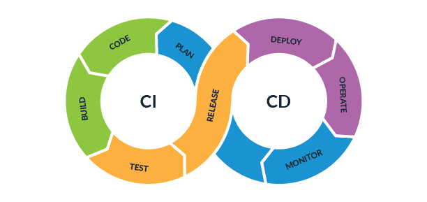

# Database CI/CD

## Introduction

In this Lab you will start working on the database CICD workflow using SQLcl Projects commands and git.

The command in SQLcl for Database CI/CD extension is **project**. It contains several sub-commands that are used as part of the process to help developers manage database changes and create serialized transactions.



**Estimated Workshop Time:** 15 minutes

### **Objectives**

* Learn how to work with **project** sub-commands

### **Prerequisites**

* Completion of the previous Labs.
* Get the application

## Task 1: Initialization using project init

* init|in
    Initializes a new project. This command can be run in a new Git repository or in an existing repository.

    ```
    <copy>project init -name demo -makeroot -schemas cicd<copy>
    ```

    This command creates a project in the current working directory called demo under a new folder called demo. Several folders are created under the project directory including a configuration directory under **.dbtools**.
    This folder and the files under it should be added and committed to the Git repository.

## Task 2: Exporting from database (project export)

* export|ex
    Exports database objects into your repository.

    As a rule, when exporting from the database, a new branch is created. This branch is used when using the stage command to compare with previous branches to generate the DDL statements. You can run the following command in the project to export the objects owned by the schemas identified in the project init command.

    ```
    <copy>project export<copy>
    ```

    You can also choose to export a specific schema, or even an object.

    In the configuration files, there is a specific file for filtering objects that can be modified to clearly identify the correct objects to export.

## Task 3: Project Stage

* stage|st
    Creates Liquibase changelogs or changesets for all source files and custom SQL files.

    The stage command is used along with the export command. This command takes the current branch and compares it to the base branch and generates the changelogs that will apply those changes to a database. The command creates a folder in a specific format with a dist folder.

    ```src
       dist -     
            -releases     
            -next         
                - <stage files>```

    The stage command can also be used to add other custom changesets as part of the change. This generates a file to add SQL and SQLcl commands with a Liquibase SQL changeset header. This file will be added to the changelog hierarchy automatically.

## Task 4: Project Release

* release|re
    Moves the current set of work into a release state and starts a new body of work.
    The release command takes the contents of the dist/next folder and renames it to a given version number.

    ```
    <copy>project release -version 1.0<copy>
    ```

     And then creates a new next folder under dist.

    Once code has been moved into a release it should never be modified. As such, it is recommended that the release command should only be run once the following criteria have been met:

    * project verify has successfully ran.
    * Test the release against various systems:
        * Build system: This confirms that all DDL and code compiles correctly.
        * Test system (with data): Confirms that no data integrity issues (For example: Making a column not null only to find out it has null values).

    To test a pre-release build, run project gen-artifact and use a version name such as -version 1.0.0-test. This also includes everything in the next folder.

## Task 5: Generate The Artifact (project gen-artifact)

Generates an artifact representing the current state of your project.

```
<copy>project gen-artifact<copy>
```

## Task 6: Deploy The Artifact To The PROD DB

Deploys the artifact on a target database.

```
<copy>project deploy -file demo-1.0.zip<copy>
```

## Task 7: XXXX

TBD

## Learn More

TBD: Add some useful links if you want, or just remove this section.

## Acknowledgements

* **Author** - Fatima AOURGA & Abdelilah AIT HAMMOU, Junior Member of Technical Staff, SQLcl
* **Created By/Date** - Fatima AOURGA, Junior Member of Technical Staff, SQLcl, December 2024