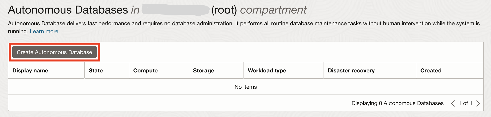
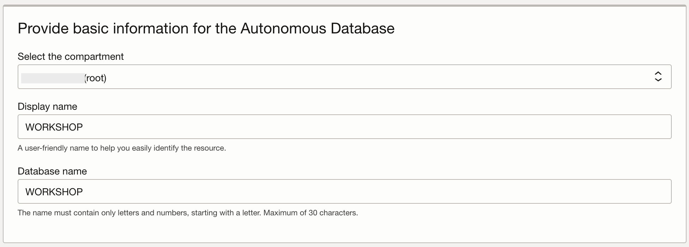

# Provision an Oracle Autonomous Database

## Introduction

This lab walks you through the steps to quickly provision an Oracle Autonomous Database (either Autonomous Transaction Processing [ATP] or Autonomous Data Warehouse [ADW]) on Oracle Cloud. You will connect to the database using SQL Worksheet, a browser-based tool that is easily accessible from the Autonomous Database console. Then create a database user (schema), assign privileges to the user, and enable the user to log in to the database.
<create and setup your schema (user). You will use this database in subsequent labs of this workshop.>

Estimated lab time: 10 minutes

_Note: While this lab uses ATP, the steps are identical for creating and connecting to an ADW database._

### **Objectives**

- Provision a new Autonomous Transaction Processing instance
- Create user and setup schema

### **Prerequisites**

- This lab requires completion of the **Get Started** section in the Contents menu on the left.

## Task 1: Create Your Free Trial Account

1. Log in to the Oracle Cloud, as shown in the previous lab.

2. Once you are logged in, you are taken to the cloud services dashboard where you can see all the services available to you. Click the navigation menu in the upper left to show top level navigation choices.

    **Note:** You can also directly access your Autonomous Transaction Processing or Autonomous Data Warehouse service in the **Quick Actions** section of the dashboard.

    

3. The following steps apply similarly to either Autonomous Data Warehouse or Autonomous Transaction Processing. This lab shows provisioning of an Autonomous Transaction Processing database, so click **Oracle Database** -> **Autonomous Transaction Processing**.

    

4. On the left side, make sure your **Workload Type** is **Transaction Processing** or **All** to see your Autonomous Transaction Processing instances. You can use the **Compartment** drop-down menu to select a compartment. Select your root compartment, or another compartment of your choice where you will create your new ATP instance. If you want to learn how to create a new compartment, click [here](https://docs.cloud.oracle.com/iaas/Content/Identity/Tasks/managingcompartments.htm#Working). To learn more about compartments, click [here](https://docs.cloud.oracle.com/en-us/iaas/Content/GSG/Concepts/settinguptenancy.htm#Setting_Up_Your_Tenancy).

    

    **Note** - Avoid the use of the Managed Compartment for PaaS compartment as this is an Oracle default used for Oracle Platform Services.

5. This console in the last screenshot shows that no databases yet exist. If there were a long list of databases, you could filter the list by the state of the databases (available, stopped, terminated, and so on). You can also sort by **Workload Type**. Here, the **Transaction Processing** workload type is selected.

## Task 2: Create Autonomous Database Instance

1. Click **Create Autonomous Database** to start the instance creation process.

    

2. This brings up the **Create Autonomous Database** screen where you will specify the configuration of the instance.

3. Provide basic information for the autonomous database:

    

    **Compartment** - Select a compartment for the database from the drop-down list. In the above example, the root compartment that is chosen.

    **Display Name** - Enter a memorable name for the database for display purposes. For example **WORKSHOP**.

    **Database Name** - Use letters and numbers only, starting with a letter. Maximum length is 14 characters. (Underscores not initially supported.) For example use **WORKSHOP**.

    

4. Choose a workload type. Select the workload type for your database from the choices:

    **Transaction Processing** - For this lab, choose **Transaction Processing** as the workload type.

    **Data Warehouse** - Alternately, you could have chosen Data Warehouse as the workload type.

    

5. Choose a deployment type. Select the deployment type for your database from the choices:

    **Serverless** - For this lab, choose **Serverless** as the deployment type.

    **Dedicated Infrastructure** - Alternately, you could have chosen Dedicated Infrastructure as the workload type.

    

6. Configure the database:

    **Always Free** - If your cloud account offers it, enable this option to create an always free autonomous database, which comes with 1 CPU and 20 GB of storage.

    **Choose database version** - Select a database version from the available versions.

    

7. Create administrator credentials:

    **Password** and **Confirm Password** - Specify a strong password for ADMIN user of the service instance.

    ***Remember** this password, you will need it later*

    

8. Choose network access:

    For this lab, accept the default, **Secure access from everywhere**.

    

9. Choose a license type. For this lab, choose **License Included**. The two license types are:

    * **Bring Your Own License (BYOL)** - Select this type when your organization has existing database licenses.

    * **License Included** - Select this type when you want to subscribe to new database software licenses and the database cloud service.

    

10. For this lab, do not provide a contact email address. The **Contact Email** field allows you to list contacts to receive operational notices and announcements as well as unplanned maintenance notifications.

    

    Leave the advanced options as they are.

11. Click **Create Autonomous Database**.

    

12. Your instance will begin provisioning. In a few minutes the state will turn from Provisioning to Available. At this point, your Autonomous Transaction Processing database is ready to use! Have a look at your instance's details here including its name, database version, CPU count and storage size.

    

    Provisioning an Autonomous Database instance.

    

    Autonomous Database instance successfully provisioned.

## Task 3: Create Your Workshop Database User

Although you can connect to your autonomous database from local desktop tools, such as Oracle SQL Developer, you can conveniently access the browser-based SQL Worksheet directly from your Autonomous Database console.

1. In your database's details page, click the **Database Actions** button. Then choose the **SQL** option.

    

2. The Database Actions page opens with a SQL Worksheet window.

    

    You can follow the guide to understand the different components of database actions (don't worry about the warning pop up just close it).

    If a sign-in page opens for Database Actions, simply use your database instance's default administrator account, **Username - ADMIN**, and **Password** you specified when creating the database, then click **Sign in**.

    

    Database administrators perform many tasks. One of their more common tasks is creating database users and assigning them unique usernames. After users log in to the database with their username and password, they can issue database SQL statements to create objects, query objects, and manage the database.

    Creating a user is a way to create a schema. In this section, you execute the `CREATE USER` statement to create and grant privileges to a database user.

    **Syntax:** `CREATE USER <user> IDENTIFIED BY <password>;`

    >**Note:**  The password specified must meet the default Oracle database password complexity rules:

    * The password must be between 12 and 30 characters long and must include at least one uppercase letter, one lowercase letter, and one numeric character.
    * The password limit is shown as 60 characters in some help tooltip popups. Limit passwords to a maximum of 30 characters.
    * The password cannot contain the username.
    * The password cannot be one of the last four passwords used for the same username.
    * The password cannot contain the double quote (") character.
    * The password must not be the same password that is set less than 24 hours ago.

3. Create a user named `HRUSER` by copying and pasting the following command to the worksheet. Click on the green and white Run Statement button to execute the command.

    ```sql
    <copy>CREATE USER hruser IDENTIFIED BY Example_pwd01;</copy>
    ```

    

4. Use the `GRANT` statement to assign privileges and roles to users.

    **Syntax:** `GRANT <privilege> TO <user>;`

    Execute the following statement to assign the required privileges to the HRUSER user:

    ```sql
    <copy>GRANT CREATE ANY TABLE, ALTER ANY TABLE, DROP ANY TABLE TO hruser;</copy>
    ```

    

## Task 4: Create Database Objects For The Labs

1. You are still connected to SQL Worksheet as administrator. In this section, you execute the `CREATE TABLE` statement to create two tables in the HRUSER schema.

    **Syntax**:
	```
	CREATE TABLE [schema.]table (column datatype [DEFAULT expr][, ...]);
	```

    Perform the following steps to create the `Employees` and `Departments` tables in the HRUSER schema. Since the ADMIN user will be creating these, we will prepend HRUSER to the table name.

3. Create the `EMPLOYEES` table with the `EMPLOYEES_ID` column as the primary key.

    ```sql
    <copy>CREATE TABLE HRUSER.EMPLOYEES (
	    employees_id NUMBER GENERATED ALWAYS AS IDENTITY,
	    first_name VARCHAR2(100),
        last_name VARCHAR2(100),
	    start_date DATE,
	    department_id NUMBER,
	    PRIMARY KEY(employees_id));
        </copy>
    ```

4. You will now populate the table with sample data. You will add rows by executing `INSERT` statements.

    **Syntax**:
	```sql
	INSERT INTO [schema.]table [(column [, column...])] VALUES (value [, value...]);
	```

    Execute the following statements to insert data into the `EMPLOYEES` table. We will again prepend HRUSER to the table name. When executing more than one statement in the worksheet at a time, highlight all the SQL to execute with the mouse, then click the green and white Run Statement button.

    ```sql
    <copy>INSERT INTO HRUSER.EMPLOYEES (FIRST_NAME, LAST_NAME) VALUES('Abdelilah', 'AIT HAMMOU');
    INSERT INTO HRUSER.EMPLOYEES (FIRST_NAME, LAST_NAME) VALUES('Fatima', 'AOURGA');
    INSERT INTO HRUSER.EMPLOYEES (FIRST_NAME, LAST_NAME) VALUES('Tom', 'Tomas');
    INSERT INTO HRUSER.EMPLOYEES (FIRST_NAME, LAST_NAME) VALUES('Larry', 'King');
    INSERT INTO HRUSER.EMPLOYEES (FIRST_NAME, LAST_NAME) VALUES('Alex', 'Dom');
    COMMIT;
    </copy>
    ```

5. You can retrieve the data from the `EMPLOYEES` table. Execute the following statement to select all the `FIRST_NAME` and `LAST_NAME` columns and view the results:

    ```
    <copy>SELECT FIRST_NAME, LAST_NAME FROM HRUSER.EMPLOYEES;</copy>
    ```

You may now **proceed to the next lab.**

## Want to Learn More?

Click [here](https://docs.oracle.com/en/cloud/paas/autonomous-database/serverless/adbsb/index.html) for documentation on using Oracle Autonomous Database Serverless.

## Acknowledgements

- **Author** - Fatima AOURGA, Junior Member of Technical Staff, SQLcl
- **Created By/Date** - Fatima AOURGA, Junior Member of Technical Staff, SQLcl, December 2024
