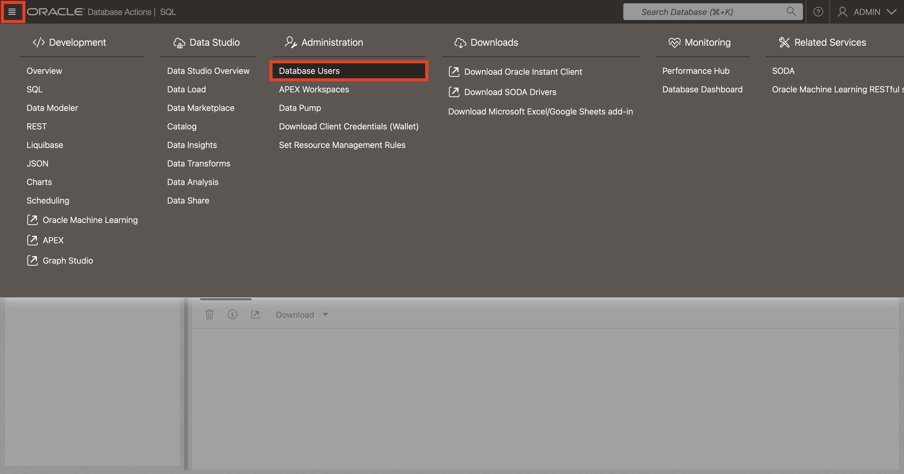
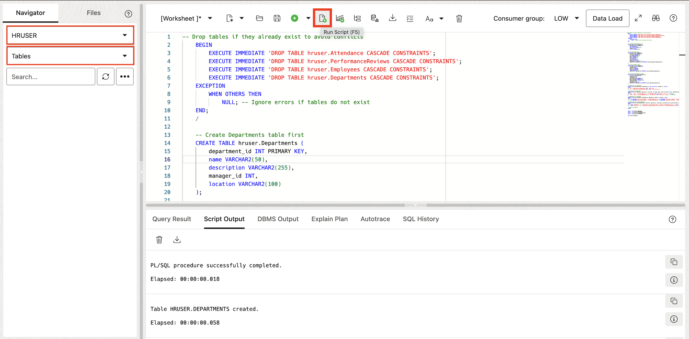
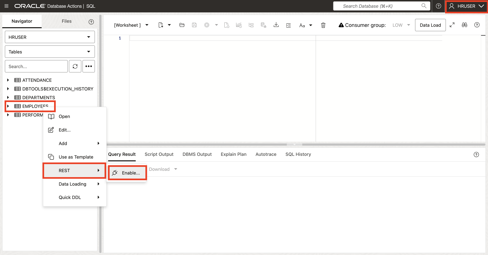
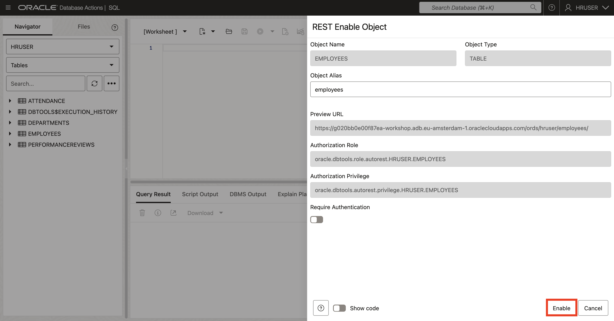

# Database Setup Using OAD & ORDS

## Introduction

This lab walks you through the steps to quickly provision an **O**racle **A**utonomous **D**atabase (either Autonomous Transaction Processing [ATP] or Autonomous Data Warehouse [ADW]) on Oracle Cloud. You will connect to the database using SQL Worksheet, a browser-based tool that is easily accessible from the Autonomous Database console. Then create a database user (schema), assign privileges to the user, and enable the user to log in to the database creating the needed objects and using **O**racle **R**EST **D**ata **S**ervices **(ORDS)** to enable REST Endpoints for the created objects.
<create and setup your schema (user). You will use this database in subsequent labs of this workshop.>


Estimated lab time: 10 minutes

_Note: While this lab uses ATP, the steps are identical for creating and connecting to an ADW database._

### **Objectives**

- Provision a new Autonomous Transaction Processing instance
- Create user and setup schema

### **Prerequisites**

- This lab requires completion of the **Get Started** section in the Contents menu on the left.

## Task 1: Create Your Free Trial Account

1. Log in to the Oracle Cloud, as shown in the previous lab.

2. Once you are logged in, you are taken to the cloud services dashboard where you can see all the services available to you. Click the navigation menu in the upper left to show top level navigation choices.

    **Note:** You can also directly access your Autonomous Transaction Processing or Autonomous Data Warehouse service in the **Quick Actions** section of the dashboard.

    

3. The following steps apply similarly to either Autonomous Data Warehouse or Autonomous Transaction Processing. This lab shows provisioning of an Autonomous Transaction Processing database, so click **Oracle Database** -> **Autonomous Transaction Processing**.

    

4. On the left side, make sure your **Workload Type** is **Transaction Processing** or **All** to see your Autonomous Transaction Processing instances. You can use the **Compartment** drop-down menu to select a compartment. Select your root compartment, or another compartment of your choice where you will create your new ATP instance. If you want to learn how to create a new compartment, click [here](https://docs.cloud.oracle.com/iaas/Content/Identity/Tasks/managingcompartments.htm#Working). To learn more about compartments, click [here](https://docs.cloud.oracle.com/en-us/iaas/Content/GSG/Concepts/settinguptenancy.htm#Setting_Up_Your_Tenancy).

    

    **Note** - Avoid the use of the Managed Compartment for PaaS compartment as this is an Oracle default used for Oracle Platform Services.

5. This console in the last screenshot shows that no databases yet exist. If there were a long list of databases, you could filter the list by the state of the databases (available, stopped, terminated, and so on). You can also sort by **Workload Type**. Here, the **Transaction Processing** workload type is selected.

## Task 2: Create Autonomous Database Instance

1. Click **Create Autonomous Database** to start the instance creation process.

    

2. This brings up the **Create Autonomous Database** screen where you will specify the configuration of the instance.

3. Provide basic information for the autonomous database:

    

    **Compartment** - Select a compartment for the database from the drop-down list. In the above example, the root compartment that is chosen.

    **Display Name** - Enter a memorable name for the database for display purposes. For example **WORKSHOP**.

    **Database Name** - Use letters and numbers only, starting with a letter. Maximum length is 14 characters. (Underscores not initially supported.) For example use **WORKSHOP**.

    

4. Choose a workload type. Select the workload type for your database from the choices:

    **Transaction Processing** - For this lab, choose **Transaction Processing** as the workload type.

    **Data Warehouse** - Alternately, you could have chosen Data Warehouse as the workload type.

    

5. Choose a deployment type. Select the deployment type for your database from the choices:

    **Serverless** - For this lab, choose **Serverless** as the deployment type.

    **Dedicated Infrastructure** - Alternately, you could have chosen Dedicated Infrastructure as the workload type.

    

6. Configure the database:

    **Always Free** - If your cloud account offers it, enable this option to create an always free autonomous database, which comes with 1 CPU and 20 GB of storage.

    **Choose database version** - Select a database version from the available versions.

    

7. Create administrator credentials:

    **Password** and **Confirm Password** - Specify a strong password for ADMIN user of the service instance.

    ***Remember** this password, you will need it later*

    

8. Choose network access:

    For this lab, accept the default, **Secure access from everywhere**.

    

9. Choose a license type. For this lab, choose **License Included**. The two license types are:

    * **Bring Your Own License (BYOL)** - Select this type when your organization has existing database licenses.

    * **License Included** - Select this type when you want to subscribe to new database software licenses and the database cloud service.

    

10. For this lab, do not provide a contact email address. The **Contact Email** field allows you to list contacts to receive operational notices and announcements as well as unplanned maintenance notifications.

    

    Leave the advanced options as they are.

11. Click **Create Autonomous Database**.

    

12. Your instance will begin provisioning. In a few minutes the state will turn from Provisioning to Available. At this point, your Autonomous Transaction Processing database is ready to use! Have a look at your instance's details here including its name, database version, CPU count and storage size.

    

    Provisioning an Autonomous Database instance.

    

    Autonomous Database instance successfully provisioned.

## Task 3: Create Your Workshop Database User & objects

Although you can connect to your autonomous database from local desktop tools, such as Oracle SQL Developer, you can conveniently access the browser-based SQL Worksheet directly from your Autonomous Database console.

1. In your database's details page, click the **Database Actions** button. Then choose the **SQL** option.

    

2. The Database Actions page opens with a SQL Worksheet window.

    

    You can follow the guide to understand the different components of database actions (don't worry about the warning pop up just close it).

    If a sign-in page opens for Database Actions, simply use your database instance's default administrator account, **Username - ADMIN**, and **Password** you specified when creating the database, then click **Sign in**.

    

    Database administrators perform many tasks. One of their more common tasks is creating database users and assigning them unique usernames. After users log in to the database with their username and password, they can issue database SQL statements to create objects, query objects, and manage the database.

    Creating a user is a way to create a schema. In this section, you execute the `CREATE USER` statement to create and grant privileges to a database user.

    **Syntax:** `CREATE USER <user> IDENTIFIED BY <password>;`

    >**Note:**  The password specified must meet the default Oracle database password complexity rules:

    * The password must be between 12 and 30 characters long and must include at least one uppercase letter, one lowercase letter, and one numeric character.
    * The password limit is shown as 60 characters in some help tooltip popups. Limit passwords to a maximum of 30 characters.
    * The password cannot contain the username.
    * The password cannot be one of the last four passwords used for the same username.
    * The password cannot contain the double quote (") character.
    * The password must not be the same password that is set less than 24 hours ago.

3. Create a user named `HRUSER` by copying and pasting the following command to the worksheet. Click on the green and white Run Statement button to execute the command.

    ```sql
    <copy>CREATE USER hruser IDENTIFIED BY Example_pwd01;</copy>
    ```

    

4. Use the `GRANT` statement to assign privileges and roles to users.

    **Syntax:** `GRANT <privilege> TO <user>;`

    Execute the following statement to assign the required privileges to the HRUSER user:

    ```sql
    <copy>GRANT CREATE ANY TABLE, ALTER ANY TABLE, DROP ANY TABLE TO hruser;</copy>
    ```

    

## Task 4: Create Objects & Generate REST Endpoints

You will generate REST endpoints to serve as APIs for your application to interact with the database. But first, let's create the necessary objects for our application.

1. Click the hamburger menu in the top-left corner of the page and click **Database Users**.

    

2. Search for HRUSER (by scrolling) and click on the three dotes in the right side of the user, then click **Enable REST**.

    

3. Click on the flesh icon at the bottom right to connect as HRUSER.

    

4. Enter **Username** and **Password** for HRUSER then click **Sign in**.

    

    Now, you are connected as HRUSER as you can see at the top right corner of the screen.

5. Click **Development** then **SQL**

    

6. Create four tables for HRUSER schema and add records.

    * Copy the following script to do that. *Expand the line right below by clicking on it to view the copyable code block*

    <details>
    <summary>[CLICK TO EXPAND] SQL script fo database objects creation</summary>

    ```na

    <copy>
    -- Drop tables if they already exist to avoid conflicts
    BEGIN
        EXECUTE IMMEDIATE 'DROP TABLE hruser.Attendance CASCADE CONSTRAINTS';
        EXECUTE IMMEDIATE 'DROP TABLE hruser.PerformanceReviews CASCADE CONSTRAINTS';
        EXECUTE IMMEDIATE 'DROP TABLE hruser.Employees CASCADE CONSTRAINTS';
        EXECUTE IMMEDIATE 'DROP TABLE hruser.Departments CASCADE CONSTRAINTS';
    EXCEPTION
        WHEN OTHERS THEN
            NULL; -- Ignore errors if tables do not exist
    END;
    /

    -- Create Departments table first
    CREATE TABLE hruser.Departments (
        department_id INT PRIMARY KEY,
        name VARCHAR2(50),
        description VARCHAR2(255),
        manager_id INT,
        location VARCHAR2(100)
    );

    -- Create Employees table
    CREATE TABLE hruser.Employees (
        employee_id INT PRIMARY KEY,
        first_name VARCHAR2(50),
        last_name VARCHAR2(50),
        email VARCHAR2(100),
        phone VARCHAR2(20),
        hire_date DATE,
        status VARCHAR2(20),
        department_id INT,
        current_salary NUMBER(10, 2),
        FOREIGN KEY (department_id) REFERENCES hruser.Departments(department_id)
    );

    -- Create Attendance table
    CREATE TABLE hruser.Attendance (
        attendance_id INT PRIMARY KEY,
        employee_id INT,
        check_in TIMESTAMP,
        check_out TIMESTAMP,
        status VARCHAR2(20),
        FOREIGN KEY (employee_id) REFERENCES hruser.Employees(employee_id)
    );

    -- Create PerformanceReviews table
    CREATE TABLE hruser.PerformanceReviews (
        review_id INT PRIMARY KEY,
        employee_id INT,
        review_date DATE,
        performance_score NUMBER(3,2),
        goals_achieved VARCHAR2(255),
        areas_improvement VARCHAR2(255),
        reviewer_id INT,
        next_review_date DATE,
        FOREIGN KEY (employee_id) REFERENCES hruser.Employees(employee_id)
    );

    -- Sample data for Departments
    INSERT INTO hruser.Departments (department_id, name, description, manager_id, location)
    VALUES
    (1, 'HR', 'Human Resources Department', NULL, 'New York'),
    (2, 'IT', 'Information Technology Department', NULL, 'San Francisco');

    -- Sample data for Employees
    INSERT INTO hruser.Employees (employee_id, first_name, last_name, email, phone, hire_date, status, department_id, current_salary)
    VALUES
    (1, 'John', 'Doe', 'john.doe@example.com', '123-456-7890', DATE '2020-01-15', 'Active', 1, 50000.00),
    (2, 'Jane', 'Smith', 'jane.smith@example.com', '123-456-7891', DATE '2019-05-22', 'Active', 2, 60000.00);

    -- Sample data for Attendance
    INSERT INTO hruser.Attendance (attendance_id, employee_id, check_in, check_out, status)
    VALUES
    (1, 1, TO_TIMESTAMP('2025-01-08 09:00:00', 'YYYY-MM-DD HH24:MI:SS'), TO_TIMESTAMP('2025-01-08 17:00:00', 'YYYY-MM-DD HH24:MI:SS'), 'Present'),
    (2, 2, TO_TIMESTAMP('2025-01-08 08:45:00', 'YYYY-MM-DD HH24:MI:SS'), TO_TIMESTAMP('2025-01-08 16:45:00', 'YYYY-MM-DD HH24:MI:SS'), 'Present');

    -- Sample data for PerformanceReviews
    INSERT INTO hruser.PerformanceReviews (review_id, employee_id, review_date, performance_score, goals_achieved, areas_improvement, reviewer_id, next_review_date)
    VALUES
    (1, 1, DATE '2025-01-01', 4.5, 'Completed all HR recruitment goals', 'Improve team management skills', 2, DATE '2025-07-01'),
    (2, 2, DATE '2025-01-01', 4.0, 'Successfully implemented new IT infrastructure', 'Enhance communication with non-technical teams', 1, DATE '2025-07-01');

    -- Commit the changes
    COMMIT;


    select * from hruser.Employees;
    select * from hruser.DEPARTMENTS;
    select * from hruser.PerformanceReviews;
    select * from hruser.ATTENDANCE;

    desc hruser.Employees;


    </copy>

    ```
    </details>

    * Past the copied script in the SQL worksheet and click run script as shown in the following:

    

    * Click the reload button surrounded in blue color to see the created tables for this **HRUSER**.

    

    Now, we will proceed for enabling the user tables to get the ORDS URLs (Endpoints) by the next steps.

7. Right click on the **EMPLOYEES** table. Click **REST**. Click **Enable...**.

    

8. Click **Enable**.

    

    Now, your **EMPLOYEES** table is **REST Enables**.

    >**Note:** *Repeat the same thing to enable the other tables (ATTENDANCE, DEPARTMENTS and PERFORMANCEREVIEWS).*

9. Click the hamburger menu. Click **REST**.

    

10. Click **AUTOREST**.

    

    You will see all the enabled table shown there.

    

    Those URLs generated by ORDS are the ones that we will use in our application.

You are now all set! Let's **proceed to the next lab.**

## Learn More

Click [here](https://docs.oracle.com/en/cloud/paas/autonomous-database/serverless/adbsb/index.html) for documentation on using Oracle Autonomous Database Serverless.

## Acknowledgements

- **Author** - Fatima AOURGA & hruser AIT HAMMOU, Junior Member of Technical Staff, SQLcl
- **Created By/Date** - Fatima AOURGA, Junior Member of Technical Staff, SQLcl, December 2024
