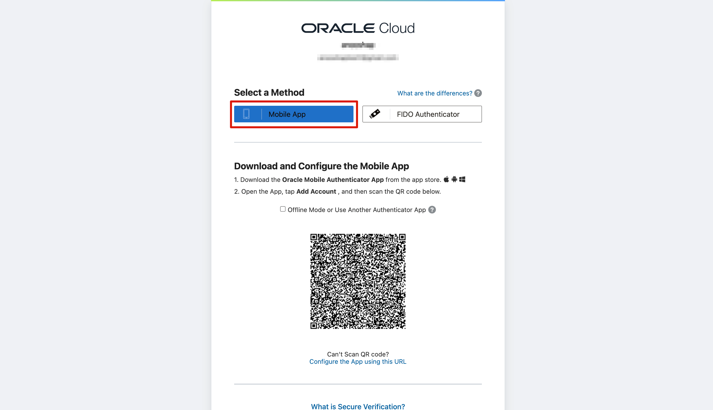

# Get started - Cloud login

## Introduction

<Oracle Cloud is the industry's broadest and most integrated cloud provider, with deployment options ranging from the public cloud to your data center. Oracle Cloud offers best-in-class services across Software as a Service (SaaS), Platform as a Service (PaaS), and Infrastructure as a Service (IaaS).>
All your work during this workshop will be within the Oracle cloud. Before you get started, you will need an Oracle Cloud account. This lab walks you through the steps of getting an Oracle Cloud Free Tier account and signing in.

Estimated Time: 5 minutes

### **Existing Cloud Accounts**

If you already have access to an Oracle Cloud account, skip to **Task 2** to sign in to your cloud tenancy.

### **Objectives**

* Create an Oracle Cloud Free Tier account
* Sign in to your account

### **Prerequisites**

* A valid email address
* Ability to receive SMS text verification (only if your email isn't recognized)
* Oracle Mobile Authenticator app installed on your phone

>***Note:** Interfaces in the following screenshots may look different from the interfaces you will see.*

## Task 1: Create Your Free Trial Account

If you already have a cloud account, skip to **Task 2**.

1. Open up a web browser to access the Oracle Cloud account registration form at [oracle.com/cloud/free](https://signup.cloud.oracle.com?sourceType=:ow:lp:cpo::::RC_WWMK211125P00013:llid=685).

    You will be presented with a registration page.

    

2. Enter the following information to create your Oracle Cloud Free Tier account.

    * Choose your **Country**
    * Enter your **Name** and **Email**
    * Use hCaptcha to verify your identity
3. Once you have entered a valid email address, select the **Verify my email** button. The screen will appear as follows after you select the button:

    

4. Go to your email. You will see an account validation email from Oracle in your inbox. The email will be similar to the following:

    

5. Click **Verify email**.

6. Enter the following information to create your Oracle Cloud Free Tier account.

    * Enter a **Password**
    * Choose a **Customer type** either **Corporate** and enter your **Company Name** or just choose **Individual**
    * Your **Cloud Account Name** will generate automatically based on your inputs. You can change that name by entering a new value. Remember what you wrote. You'll need this name later to sign in.
    * Choose a **Home Region**. Your Home Region cannot be changed once you sign-up.

    > **Note:** Based on the current design of the workshop and resource availability, it is recommended not to use the London region for this workshop at this time.

    

    * Click **Continue**

7. Enter your address information. Choose your country and enter a phone number. Click **Continue**.

    

8. Click the **Add payment verification method** button.

    

9. Choose the verification method. In this case, click the **Credit Card** button. Enter your information and payment details.

    > **Note:** This is a free credit promotion account. You will not be charged unless you elect to upgrade the account.

    

10. Once your payment verification is complete, review and accept the agreement by clicking the check box. Click the **Start my free trial** button.

    

11. Your account is provisioning and should be available soon! You might want to log out as you wait for your account to be provisioned. You'll receive an email from Oracle notifying you that provisioning is complete, with your cloud account and username.

## Task 2: Sign in to Your Account

*Please note that while your tenancy is initially created, you will only see a direct login. Once your tenancy is fully provisioned, you will see the screens as described below.*

1. Go to [cloud.oracle.com](https://cloud.oracle.com?sourceType=:ow:lp:cpo::::RC_WWMK211125P00013:llid=685). Enter your Cloud Account Name and click **Next**. This is the name you chose while creating your account in the previous section. It's NOT your email address. If you've forgotten the name, see the confirmation email.

    

2. Choose *"OracleIdentityCloudService"* and click **Next**.

    

    When you sign up for an Oracle Cloud account, a user is created for you in Oracle Identity Cloud Service with the username and password you selected. You can use this single sign-on option to sign in to Oracle Cloud Infrastructure and then navigate to other Oracle Cloud services without re-authenticating. This user has administrator privileges for all the Oracle Cloud services included with your account.

3. Enter your Cloud Account credentials and click **Sign In**. Your username is your email address. The password is what you chose when you signed up for an account.

    

4. You will be prompted to enable secure verification. Click **Enable Secure Verification**. For more details, refer the [Managing Multifactor Authentication documentation](https://docs.oracle.com/en-us/iaas/Content/Identity/Tasks/usingmfa.htm)

    

5. Select a method - **Mobile App** or **FIDO Authenticator** to enable secure verification.

    

6. If you have chosen:

    * **Mobile App** - Follow the steps as shown in the screenshot to setup authentication.

        

    * **FIDO Authenticator** - Click **Setup** and follow the steps to setup authentication.

        

7. Once you have verified authentication, you will now be signed in to Oracle Cloud!

    

Well done! You may now **proceed to the next lab**.

## Learn More

Here are some useful links if you want to know more about Oracle Cloud :
* [Oracle Cloud Doc](https://www.oracle.com/cloud/)

## Acknowledgements

* **Author** - Fatima AOURGA, Junior Member of Technical Staff, SQLcl
* **Created By/Date** - Fatima AOURGA, Junior Member of Technical Staff, SQLcl, December 2024